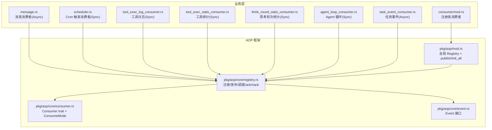
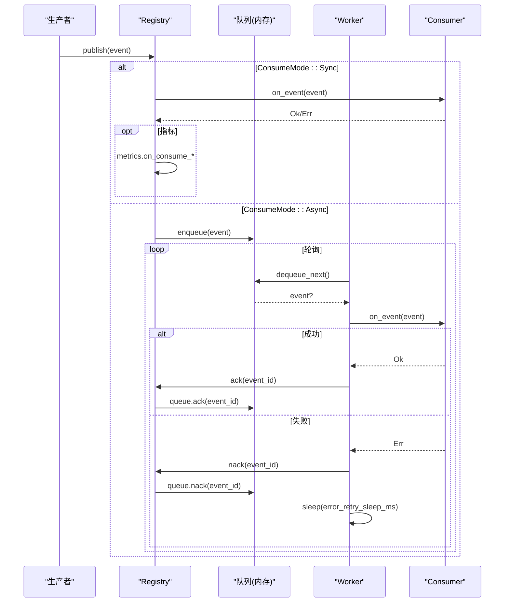
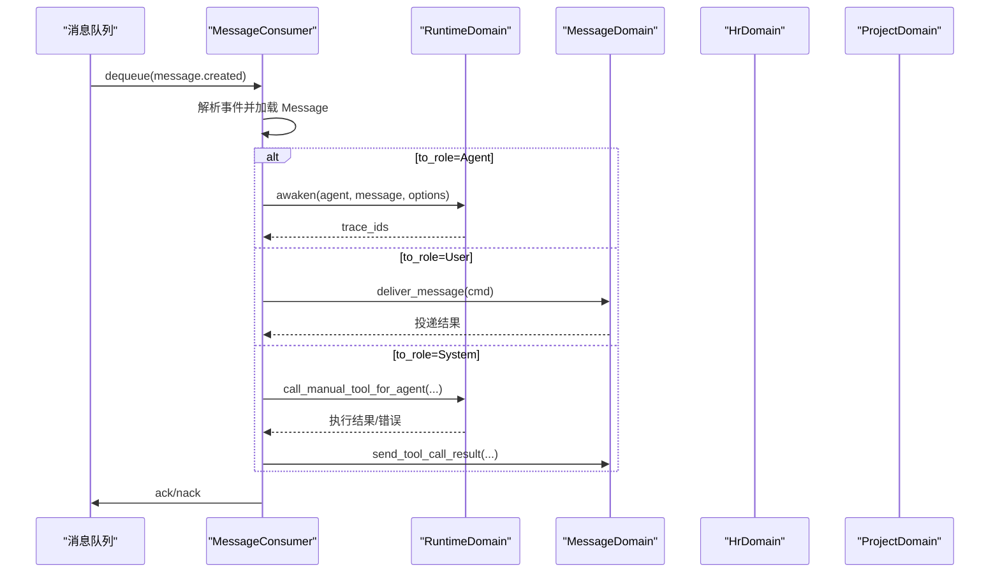
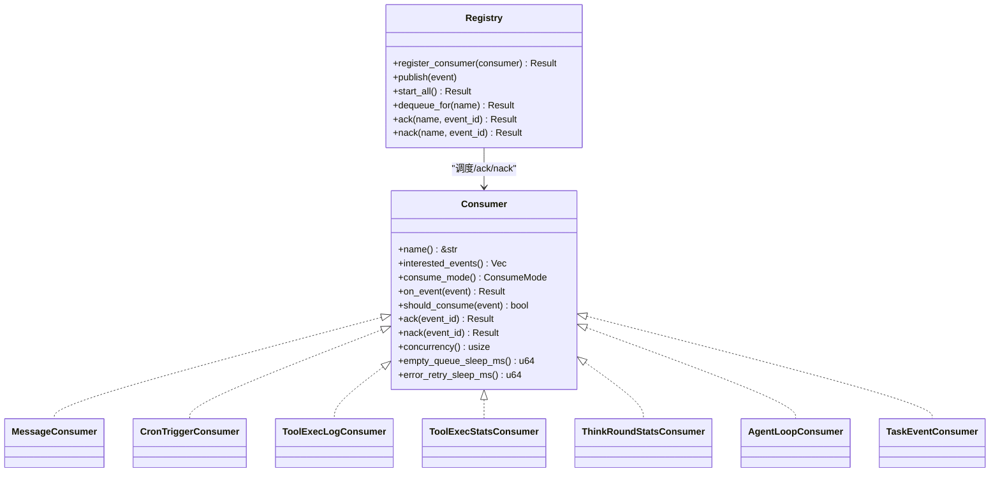
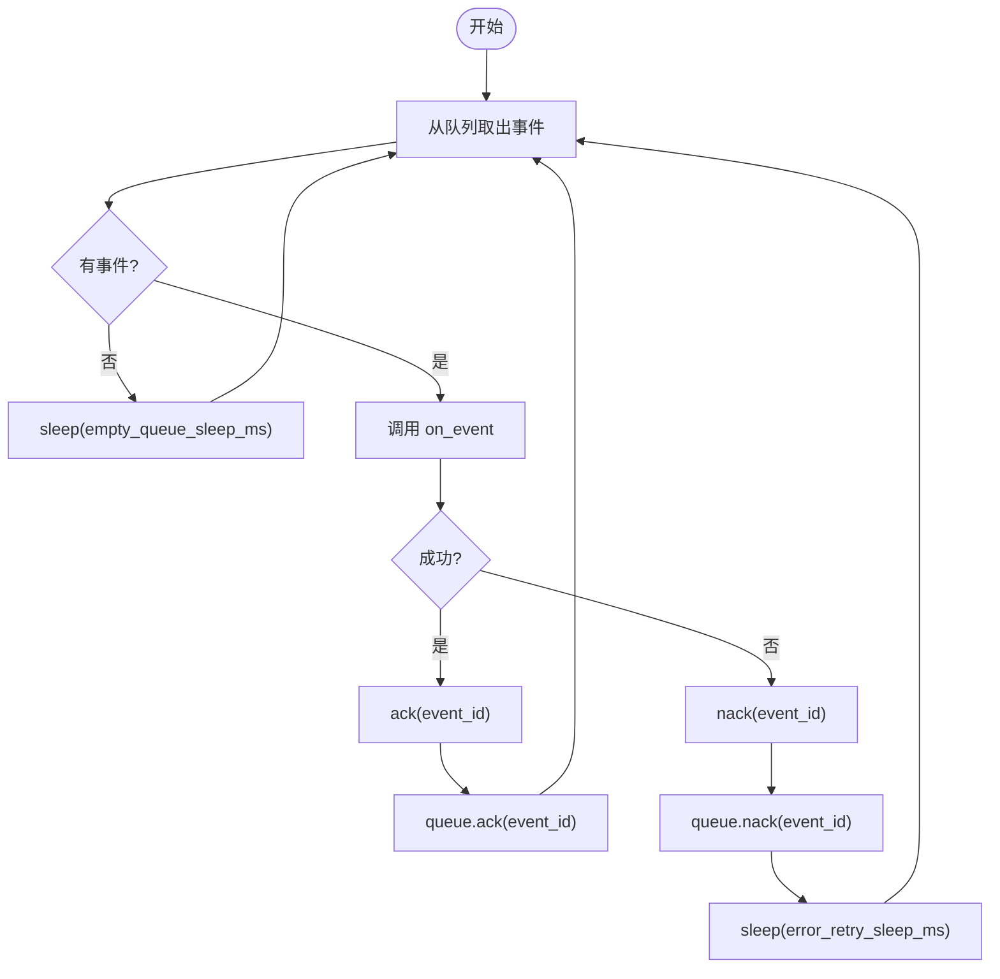
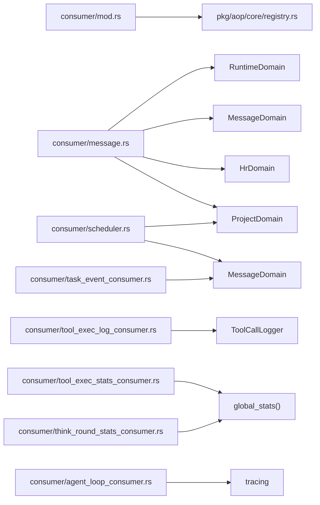

# 事件消费者

<cite>
**本文引用的文件**
- [src/consumer/mod.rs](file://src/consumer/mod.rs)
- [src/pkg/aop/mod.rs](file://src/pkg/aop/mod.rs)
- [src/pkg/aop/core/mod.rs](file://src/pkg/aop/core/mod.rs)
- [src/pkg/aop/core/registry.rs](file://src/pkg/aop/core/registry.rs)
- [src/pkg/aop/core/consumer.rs](file://src/pkg/aop/core/consumer.rs)
- [src/pkg/aop/core/event.rs](file://src/pkg/aop/core/event.rs)
- [src/consumer/message.rs](file://src/consumer/message.rs)
- [src/consumer/scheduler.rs](file://src/consumer/scheduler.rs)
- [src/consumer/tool_exec_log_consumer.rs](file://src/consumer/tool_exec_log_consumer.rs)
- [src/consumer/tool_exec_stats_consumer.rs](file://src/consumer/tool_exec_stats_consumer.rs)
- [src/consumer/think_round_stats_consumer.rs](file://src/consumer/think_round_stats_consumer.rs)
- [src/consumer/agent_loop_consumer.rs](file://src/consumer/agent_loop_consumer.rs)
- [src/consumer/task_event_consumer.rs](file://src/consumer/task_event_consumer.rs)
- [src/consumer/aop_stats_collector.rs](file://src/consumer/aop_stats_collector.rs)
</cite>

## 目录
1. [简介](#简介)
2. [项目结构](#项目结构)
3. [核心组件](#核心组件)
4. [架构总览](#架构总览)
5. [详细组件分析](#详细组件分析)
6. [依赖关系分析](#依赖关系分析)
7. [性能考量](#性能考量)
8. [故障排查指南](#故障排查指南)
9. [结论](#结论)
10. [附录](#附录)

## 简介
本文件面向 AOP 事件消费者系统，聚焦以下主题：
- 消费者注册机制与生命周期管理
- 消费模式 ConsumeMode（同步/异步）及调度策略
- 异步消费处理、确认与重试（ack/nack）
- 错误处理策略与退避
- 内置消费者实现：消息消费者、调度器消费者、工具执行日志消费者、工具执行统计消费者、思考轮次统计消费者、Agent 循环消费者、任务事件消费者
- 性能监控与调试技巧
- 自定义消费者开发指南与最佳实践

## 项目结构
AOP 事件中心位于 pkg/aop，业务消费者位于 consumer。启动时通过 consumer::init 注册所有业务消费者，随后由 aop::init_all 启动调度器并拉起异步 worker。

图表来源
- [src/consumer/mod.rs:16-37](file://src/consumer/mod.rs#L16-L37)
- [src/pkg/aop/mod.rs:36-60](file://src/pkg/aop/mod.rs#L36-L60)
- [src/pkg/aop/core/registry.rs:49-206](file://src/pkg/aop/core/registry.rs#L49-L206)
- [src/pkg/aop/core/consumer.rs:6-13](file://src/pkg/aop/core/consumer.rs#L6-L13)
- [src/pkg/aop/core/event.rs:12-24](file://src/pkg/aop/core/event.rs#L12-L24)

章节来源
- [src/consumer/mod.rs:16-37](file://src/consumer/mod.rs#L16-L37)
- [src/pkg/aop/mod.rs:36-60](file://src/pkg/aop/mod.rs#L36-L60)

## 核心组件
- Consumer trait：定义 name、interested_events、consume_mode、on_event、should_consume、ack/nack、concurrency、empty_queue_sleep_ms、error_retry_sleep_ms。
- ConsumeMode：Sync（发布线程直接调用 on_event）、Async（入队后由调度器 worker 拉取）。
- Event：统一事件抽象，包含 kind/id/order_key/priority/created_at。
- Registry：维护消费者映射、生产者集合、队列、指标钩子；负责发布、调度、ack/nack、worker 启动。
- AOP 统计：AopStatsCollector 提供概览、时序、分布等内存统计。

章节来源
- [src/pkg/aop/core/consumer.rs:6-71](file://src/pkg/aop/core/consumer.rs#L6-L71)
- [src/pkg/aop/core/event.rs:12-24](file://src/pkg/aop/core/event.rs#L12-L24)
- [src/pkg/aop/core/registry.rs:11-47](file://src/pkg/aop/core/registry.rs#L11-L47)
- [src/consumer/aop_stats_collector.rs:43-72](file://src/consumer/aop_stats_collector.rs#L43-L72)

## 架构总览
AOP 事件中心遵循“生产-消费”解耦：
- 生产者发布事件（可同步或异步），Registry 根据消费者订阅的 EventKind 分发。
- Sync 消费者在发布线程内立即处理；Async 消费者入队，由多 worker 轮询拉取并处理。
- 异步处理支持 ack/nack 与重试，失败时按 error_retry_sleep_ms 退避，避免紧密自旋。
- 指标采集通过 AopMetricsHook 注入，AopStatsCollector 提供运行时统计。

图表来源
- [src/pkg/aop/core/registry.rs:97-206](file://src/pkg/aop/core/registry.rs#L97-L206)
- [src/pkg/aop/core/registry.rs:260-449](file://src/pkg/aop/core/registry.rs#L260-L449)
- [src/pkg/aop/core/consumer.rs:6-71](file://src/pkg/aop/core/consumer.rs#L6-L71)

## 详细组件分析

### 消费者注册与生命周期
- 注册入口：consumer::init 中依次注册消息、调度器、工具日志、工具统计、Agent 循环、思考轮次统计、任务事件等消费者。
- 启动调度：aop::init_all 调用 registry.start_all，为每个 Async 消费者启动 concurrency 个 worker。
- 生命周期：
  - 注册阶段：创建队列（仅 Async）、建立 EventKind -> Consumers 映射。
  - 运行阶段：publish 分发；Sync 直接调用；Async 入队并由 worker 拉取。
  - 结束阶段：进程退出时 tokio 协程自然回收。

章节来源
- [src/consumer/mod.rs:16-37](file://src/consumer/mod.rs#L16-L37)
- [src/pkg/aop/mod.rs:53-60](file://src/pkg/aop/mod.rs#L53-L60)
- [src/pkg/aop/core/registry.rs:49-73](file://src/pkg/aop/core/registry.rs#L49-L73)
- [src/pkg/aop/core/registry.rs:260-449](file://src/pkg/aop/core/registry.rs#L260-L449)

### 消费模式 ConsumeMode
- Sync：适合轻量、快速完成的处理，如日志写入、统计记录。
- Async：适合耗时、可能失败的业务编排，具备 ack/nack、并发控制、退避重试。

章节来源
- [src/pkg/aop/core/consumer.rs:6-13](file://src/pkg/aop/core/consumer.rs#L6-L13)

### 异步消费处理与错误策略
- 并发控制：consumer.concurrency() 决定 worker 数量。
- 空队列休眠：empty_queue_sleep_ms 降低空转 CPU。
- 失败重试：on_event 返回 Err 时调用 nack，queue.nack 重新入队，并 sleep(error_retry_sleep_ms)。
- 成功确认：ack 成功后调用 queue.ack 移除事件，避免 order_key 阻塞后续消息。

章节来源
- [src/pkg/aop/core/registry.rs:318-449](file://src/pkg/aop/core/registry.rs#L318-L449)
- [src/pkg/aop/core/consumer.rs:47-70](file://src/pkg/aop/core/consumer.rs#L47-L70)

### 内置消费者详解

#### 消息消费者（MessageConsumer）
- 事件：message.created
- 模式：Async，并发 4，空队列 100ms，错误重试 1000ms
- 职责：
  - 解析 MessageCreatedEvent，加载完整 Message
  - 按 to_role 分发：Agent/User/System
  - Agent 消息：原子占用 Agent（BusyGuard），检查任务状态与最大思考深度，唤醒 Agent（awaken）
  - User 消息：投递到用户（SSE/渠道），全失败则返回错误以触发重试
  - System 消息：ToolCallRequest 执行工具并回写结果
  - ack/nack：更新消息状态为 Processed/Pending

图表来源
- [src/consumer/message.rs:64-141](file://src/consumer/message.rs#L64-L141)
- [src/consumer/message.rs:147-357](file://src/consumer/message.rs#L147-L357)
- [src/consumer/message.rs:359-477](file://src/consumer/message.rs#L359-L477)

章节来源
- [src/consumer/message.rs:64-141](file://src/consumer/message.rs#L64-L141)
- [src/consumer/message.rs:147-357](file://src/consumer/message.rs#L147-L357)
- [src/consumer/message.rs:359-477](file://src/consumer/message.rs#L359-L477)

#### 调度器消费者（CronTriggerConsumer）
- 事件：cron.trigger
- 模式：Sync
- 职责：
  - 解析 payload.action，分发 agent_rest/project_followup
  - agent_rest：调用 settle_memory 沉淀短期记忆
  - project_followup：扫描进行中且有 Owner Agent 的项目，发送跟进通知（预检查 Agent 空闲）

章节来源
- [src/consumer/scheduler.rs:39-95](file://src/consumer/scheduler.rs#L39-L95)
- [src/consumer/scheduler.rs:99-195](file://src/consumer/scheduler.rs#L99-L195)

#### 工具执行日志消费者（ToolExecLogConsumer）
- 事件：agent.tool.executed
- 模式：Sync
- 职责：将 ToolExecEvent 写入 JSONL 日志（ToolCallLogger）

章节来源
- [src/consumer/tool_exec_log_consumer.rs:26-52](file://src/consumer/tool_exec_log_consumer.rs#L26-L52)

#### 工具执行统计消费者（ToolExecStatsConsumer）
- 事件：agent.tool.executed
- 模式：Sync
- 职责：将工具调用结果转换为 ToolCallEvent，通过 global_stats() 记录统计

章节来源
- [src/consumer/tool_exec_stats_consumer.rs:27-72](file://src/consumer/tool_exec_stats_consumer.rs#L27-L72)

#### 思考轮次统计消费者（ThinkRoundStatsConsumer）
- 事件：agent.think.round
- 模式：Sync
- 职责：将每轮 think 的 token 用量记录到 ModelCallEvent（跳过 total_tokens=0 的轮次）

章节来源
- [src/consumer/think_round_stats_consumer.rs:29-72](file://src/consumer/think_round_stats_consumer.rs#L29-L72)

#### Agent 循环消费者（AgentLoopConsumer）
- 事件：agent.loop、agent.think.round
- 模式：Sync
- 职责：记录 Agent 生命周期（started/finished）与每轮 think 指标（round、duration_ms、tool_calls）

章节来源
- [src/consumer/agent_loop_consumer.rs:26-96](file://src/consumer/agent_loop_consumer.rs#L26-L96)

#### 任务事件消费者（TaskEventConsumer）
- 事件：task.status_changed
- 模式：Async
- 职责：
  - 仅处理 Completed 状态
  - 查询项目 Owner Agent，去重检查是否已有 Pending 的 TaskDispatchNotification
  - 构建意图指令内容并发送给 Owner Agent

章节来源
- [src/consumer/task_event_consumer.rs:38-137](file://src/consumer/task_event_consumer.rs#L38-L137)

### 类图（消费者与框架）

图表来源
- [src/pkg/aop/core/consumer.rs:15-71](file://src/pkg/aop/core/consumer.rs#L15-L71)
- [src/pkg/aop/core/registry.rs:49-206](file://src/pkg/aop/core/registry.rs#L49-L206)
- [src/consumer/message.rs:64-141](file://src/consumer/message.rs#L64-L141)
- [src/consumer/scheduler.rs:39-95](file://src/consumer/scheduler.rs#L39-L95)
- [src/consumer/tool_exec_log_consumer.rs:26-52](file://src/consumer/tool_exec_log_consumer.rs#L26-L52)
- [src/consumer/tool_exec_stats_consumer.rs:27-72](file://src/consumer/tool_exec_stats_consumer.rs#L27-L72)
- [src/consumer/think_round_stats_consumer.rs:29-72](file://src/consumer/think_round_stats_consumer.rs#L29-L72)
- [src/consumer/agent_loop_consumer.rs:26-96](file://src/consumer/agent_loop_consumer.rs#L26-L96)
- [src/consumer/task_event_consumer.rs:38-137](file://src/consumer/task_event_consumer.rs#L38-L137)

### 流程图（异步消费者工作流）

图表来源
- [src/pkg/aop/core/registry.rs:318-449](file://src/pkg/aop/core/registry.rs#L318-L449)

## 依赖关系分析
- consumer/mod.rs 依赖 pkg/aop.registry 进行消费者注册。
- 各消费者依赖各自领域 Domain/DAL（如 RuntimeDomain、MessageDomain、HrDomain、ProjectDomain）。
- Registry 依赖 EventQueue（默认 InMemoryEventQueue）与 AopMetricsHook（可选）。
- 统计模块 AopStatsCollector 基于 RuntimeStatsCollector 聚合维度 (event_kind, consumer_name, status)。

图表来源
- [src/consumer/mod.rs:16-37](file://src/consumer/mod.rs#L16-L37)
- [src/consumer/message.rs:147-357](file://src/consumer/message.rs#L147-L357)
- [src/consumer/scheduler.rs:99-195](file://src/consumer/scheduler.rs#L99-L195)
- [src/consumer/tool_exec_log_consumer.rs:40-52](file://src/consumer/tool_exec_log_consumer.rs#L40-L52)
- [src/consumer/tool_exec_stats_consumer.rs:41-72](file://src/consumer/tool_exec_stats_consumer.rs#L41-L72)
- [src/consumer/think_round_stats_consumer.rs:43-72](file://src/consumer/think_round_stats_consumer.rs#L43-L72)
- [src/consumer/agent_loop_consumer.rs:43-96](file://src/consumer/agent_loop_consumer.rs#L43-L96)
- [src/consumer/task_event_consumer.rs:52-137](file://src/consumer/task_event_consumer.rs#L52-L137)

章节来源
- [src/consumer/mod.rs:16-37](file://src/consumer/mod.rs#L16-L37)
- [src/consumer/message.rs:147-357](file://src/consumer/message.rs#L147-L357)
- [src/consumer/scheduler.rs:99-195](file://src/consumer/scheduler.rs#L99-L195)
- [src/consumer/tool_exec_log_consumer.rs:40-52](file://src/consumer/tool_exec_log_consumer.rs#L40-L52)
- [src/consumer/tool_exec_stats_consumer.rs:41-72](file://src/consumer/tool_exec_stats_consumer.rs#L41-L72)
- [src/consumer/think_round_stats_consumer.rs:43-72](file://src/consumer/think_round_stats_consumer.rs#L43-L72)
- [src/consumer/agent_loop_consumer.rs:43-96](file://src/consumer/agent_loop_consumer.rs#L43-L96)
- [src/consumer/task_event_consumer.rs:52-137](file://src/consumer/task_event_consumer.rs#L52-L137)

## 性能考量
- 并发度调优：MessageConsumer 使用 concurrency=4，可根据负载调整。
- 退避策略：error_retry_sleep_ms 避免失败时的紧密自旋；empty_queue_sleep_ms 降低空转。
- 顺序与优先级：Event.order_key 与 priority 影响队列调度，确保关键事件优先处理。
- 指标埋点：通过 AopMetricsHook 收集 on_publish/on_consume_start/on_consume_success/on_consume_failure，结合 AopStatsCollector 提供概览与时序。
- 资源释放：ack 成功后必须调用 queue.ack，避免 order_key 阻塞后续消息。

章节来源
- [src/consumer/message.rs:130-141](file://src/consumer/message.rs#L130-L141)
- [src/pkg/aop/core/registry.rs:318-449](file://src/pkg/aop/core/registry.rs#L318-L449)
- [src/consumer/aop_stats_collector.rs:74-195](file://src/consumer/aop_stats_collector.rs#L74-L195)

## 故障排查指南
- 事件未消费：
  - 检查 interested_events 是否正确声明
  - 检查 should_consume 过滤逻辑
  - 查看队列长度与 stats（queue_len/all_queue_stats）
- 异步消费者卡死：
  - 确认 ack/nack 是否成对调用（成功 ack + queue.ack；失败 nack + queue.nack）
  - 检查 on_event 是否长时间阻塞
- 重试风暴：
  - 调整 error_retry_sleep_ms，避免频繁重试导致雪崩
- 指标异常：
  - 确认 AopMetricsHook 已注入，观察 on_consume_* 回调
  - 使用 AopStatsCollector.overview/time_series/distribution 定位问题

章节来源
- [src/pkg/aop/core/registry.rs:97-206](file://src/pkg/aop/core/registry.rs#L97-L206)
- [src/pkg/aop/core/registry.rs:318-449](file://src/pkg/aop/core/registry.rs#L318-L449)
- [src/consumer/aop_stats_collector.rs:74-195](file://src/consumer/aop_stats_collector.rs#L74-L195)

## 结论
AOP 事件消费者系统通过统一的 Consumer 接口与 Registry 调度，实现了高内聚、低耦合的事件驱动架构。内置消费者覆盖了消息投递、定时任务、工具执行日志与统计、Agent 循环观测、任务状态通知等关键场景。通过 ConsumeMode、ack/nack、并发与退避策略，系统在可靠性与性能之间取得平衡。建议在生产环境中结合 AopStatsCollector 持续监控，并根据负载动态调优参数。

## 附录

### 自定义消费者开发指南
- 实现 Consumer trait：
  - name：唯一标识
  - interested_events：声明感兴趣的事件类型
  - consume_mode：选择 Sync 或 Async
  - on_event：核心处理逻辑
  - 若 Async：实现 ack/nack，设置 concurrency、empty_queue_sleep_ms、error_retry_sleep_ms
- 注册消费者：
  - 在 consumer::init 中通过 aop::registry().register_consumer(Arc::new(...)) 注册
- 最佳实践：
  - 轻量逻辑用 Sync，复杂编排用 Async
  - 合理设置并发与退避，避免资源争用
  - 使用 RequestContext 传递上下文，保持链路追踪
  - 利用 tracing 与 stats 进行可观测性建设

章节来源
- [src/pkg/aop/core/consumer.rs:15-71](file://src/pkg/aop/core/consumer.rs#L15-L71)
- [src/consumer/mod.rs:16-37](file://src/consumer/mod.rs#L16-L37)