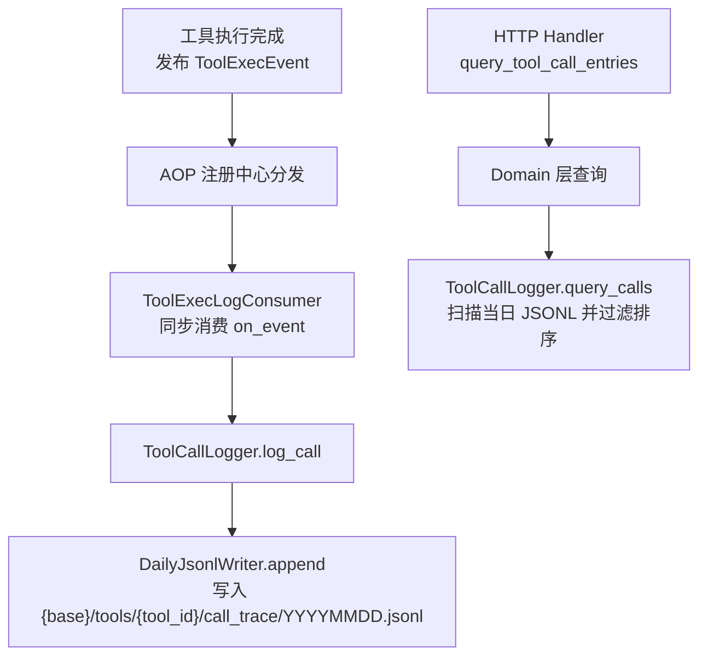
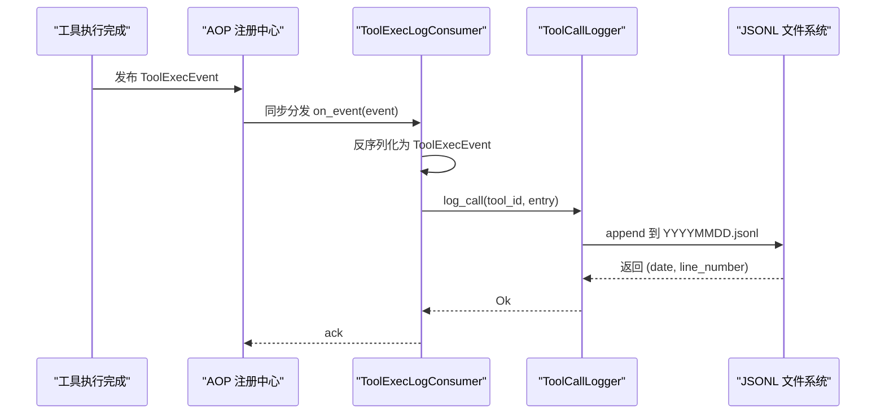
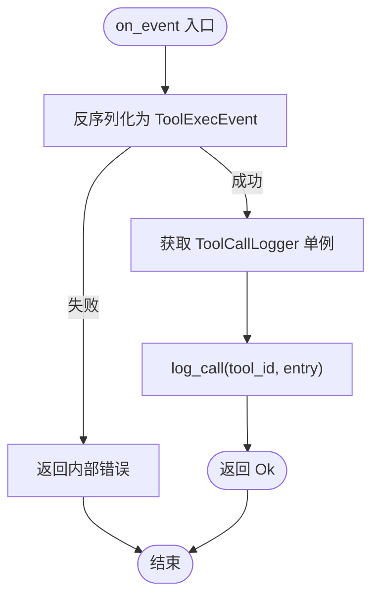
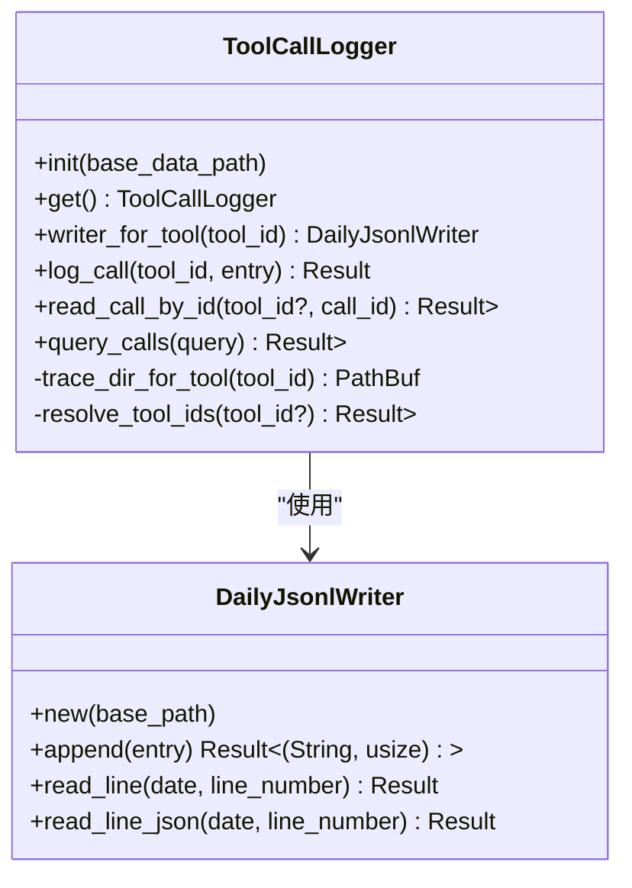
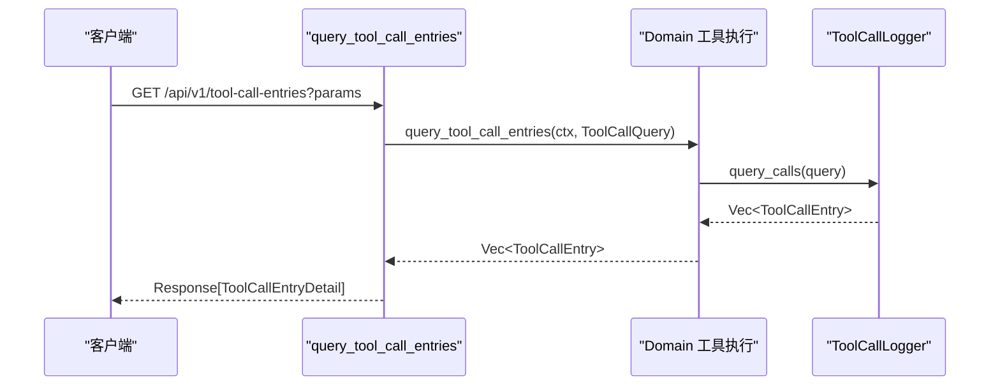
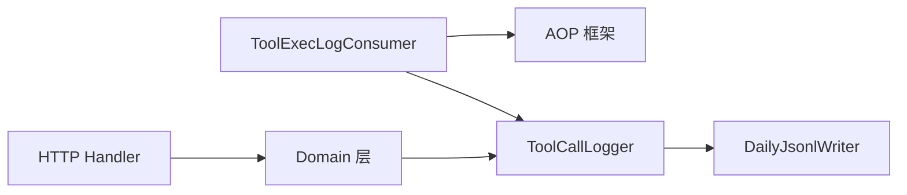
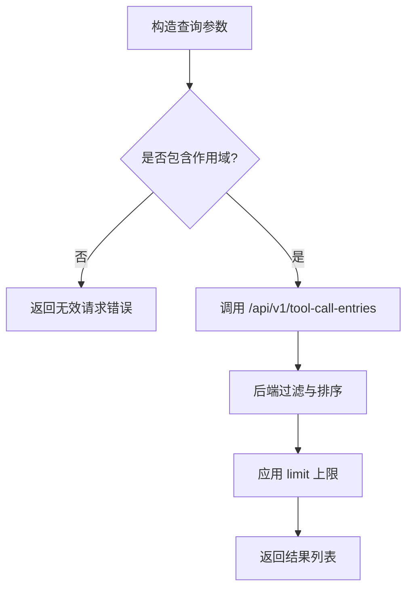

# 工具执行日志消费者

<cite>
**本文引用的文件**
- [src/consumer/tool_exec_log_consumer.rs](file://src/consumer/tool_exec_log_consumer.rs)
- [src/models/events/tool_exec.rs](file://src/models/events/tool_exec.rs)
- [src/pkg/tool_tracing/logger.rs](file://src/pkg/tool_tracing/logger.rs)
- [src/pkg/daily_jsonl.rs](file://src/pkg/daily_jsonl.rs)
- [src/handlers/finance/tool/query_tool_call_entries.rs](file://src/handlers/finance/tool/query_tool_call_entries.rs)
- [src/service/domain/runtime/tool_execution_test.rs](file://src/service/domain/runtime/tool_execution_test.rs)
- [src/pkg/stats/tool_call.rs](file://src/pkg/stats/tool_call.rs)
- [src/handlers/system/aop.rs](file://src/handlers/system/aop.rs)
- [src/consumer/aop_stats_collector.rs](file://src/consumer/aop_stats_collector.rs)
</cite>

## 目录
1. [简介](#简介)
2. [项目结构](#项目结构)
3. [核心组件](#核心组件)
4. [架构总览](#架构总览)
5. [详细组件分析](#详细组件分析)
6. [依赖关系分析](#依赖关系分析)
7. [性能与存储特性](#性能与存储特性)
8. [日志查询接口与使用示例](#日志查询接口与使用示例)
9. [故障排查与调试技巧](#故障排查与调试技巧)
10. [结论](#结论)

## 简介
本文件面向“工具执行日志消费者”的完整实现与使用，聚焦 ToolExecLogConsumer 如何订阅 AOP 事件、收集工具调用日志、格式化并持久化到按日分片的 JSONL 文件，以及如何通过查询接口检索日志。文档同时覆盖日志级别控制（AOP 队列监控）、结构化日志输出、查询索引优化策略、日志轮转与存储空间管理、以及性能监控指标与调试方法。

## 项目结构
围绕工具执行日志的关键路径如下：
- 事件定义：ToolExecEvent 描述一次工具执行完成的事件，包含完整的调用条目与上下文统计字段。
- 消费者：ToolExecLogConsumer 同步消费该事件，将结构化条目写入每日 JSONL 文件。
- 日志存储：DailyJsonlWriter 提供按日期分片追加与读取能力；ToolCallLogger 封装工具维度的目录结构与读写。
- 查询入口：HTTP Handler 暴露查询工具调用轨迹的接口，支持多条件过滤与分页限制。
- 监控与统计：AOP 队列监控与内存统计收集器用于观测消费者吞吐、延迟与错误率；工具调用统计事件用于 DuckDB 聚合。

**图表来源**
- [src/models/events/tool_exec.rs:1-65](file://src/models/events/tool_exec.rs#L1-L65)
- [src/consumer/tool_exec_log_consumer.rs:1-53](file://src/consumer/tool_exec_log_consumer.rs#L1-L53)
- [src/pkg/tool_tracing/logger.rs:1-253](file://src/pkg/tool_tracing/logger.rs#L1-L253)
- [src/pkg/daily_jsonl.rs:1-110](file://src/pkg/daily_jsonl.rs#L1-L110)
- [src/handlers/finance/tool/query_tool_call_entries.rs:1-46](file://src/handlers/finance/tool/query_tool_call_entries.rs#L1-L46)

**章节来源**
- [src/models/events/tool_exec.rs:1-65](file://src/models/events/tool_exec.rs#L1-L65)
- [src/consumer/tool_exec_log_consumer.rs:1-53](file://src/consumer/tool_exec_log_consumer.rs#L1-L53)
- [src/pkg/tool_tracing/logger.rs:1-253](file://src/pkg/tool_tracing/logger.rs#L1-L253)
- [src/pkg/daily_jsonl.rs:1-110](file://src/pkg/daily_jsonl.rs#L1-L110)
- [src/handlers/finance/tool/query_tool_call_entries.rs:1-46](file://src/handlers/finance/tool/query_tool_call_entries.rs#L1-L46)

## 核心组件
- ToolExecLogConsumer：声明式消费者，订阅事件 kind 为 "agent.tool.executed"，采用同步消费模式，反序列化后调用日志记录器写入 JSONL。
- ToolExecEvent：承载工具调用结果的结构化事件，包含 entry、组织/用户维度、参数/结果长度等统计字段，并按 agent_id 作为顺序键保证同一 Agent 的工具日志顺序。
- ToolCallLogger：全局单例，负责工具维度的 trace 目录解析、写入与查询；查询时按 tool_id 范围扫描对应 JSONL 文件，过滤并排序返回。
- DailyJsonlWriter：通用按日分片 JSONL 写入器，append 返回行号，read_line/read_line_json 支持随机读取指定行。
- HTTP 查询接口：统一入口 query_tool_call_entries，将请求参数映射为 ToolCallQuery 并委托 Domain 层查询。

**章节来源**
- [src/consumer/tool_exec_log_consumer.rs:1-53](file://src/consumer/tool_exec_log_consumer.rs#L1-L53)
- [src/models/events/tool_exec.rs:1-65](file://src/models/events/tool_exec.rs#L1-L65)
- [src/pkg/tool_tracing/logger.rs:1-253](file://src/pkg/tool_tracing/logger.rs#L1-L253)
- [src/pkg/daily_jsonl.rs:1-110](file://src/pkg/daily_jsonl.rs#L1-L110)
- [src/handlers/finance/tool/query_tool_call_entries.rs:1-46](file://src/handlers/finance/tool/query_tool_call_entries.rs#L1-L46)

## 架构总览
工具执行日志链路遵循 Adapter → Domain → DAL → DAO 的单向调用原则，日志消费者位于 AOP 层，属于横切关注点，不侵入业务逻辑。

**图表来源**
- [src/models/events/tool_exec.rs:1-65](file://src/models/events/tool_exec.rs#L1-L65)
- [src/consumer/tool_exec_log_consumer.rs:1-53](file://src/consumer/tool_exec_log_consumer.rs#L1-L53)
- [src/pkg/tool_tracing/logger.rs:1-253](file://src/pkg/tool_tracing/logger.rs#L1-L253)
- [src/pkg/daily_jsonl.rs:1-110](file://src/pkg/daily_jsonl.rs#L1-L110)

## 详细组件分析

### ToolExecLogConsumer 分析
- 职责：订阅 "agent.tool.executed" 事件，同步消费，将结构化条目写入 JSONL。
- 关键行为：
  - interested_events 仅匹配单一事件类型。
  - consume_mode 为 Sync，确保日志写入与工具执行在同一调用链中完成。
  - on_event 中反序列化失败会转为内部错误；写入失败被忽略以避免阻塞主流程。
- 设计要点：
  - 与旧装饰器逻辑保持一致，替换 ToolCallLoggingDecorator 的 JSONL 写入职责。
  - 通过 order_key(agent_id) 保证同一 Agent 的工具日志顺序。

**图表来源**
- [src/consumer/tool_exec_log_consumer.rs:1-53](file://src/consumer/tool_exec_log_consumer.rs#L1-L53)
- [src/models/events/tool_exec.rs:1-65](file://src/models/events/tool_exec.rs#L1-L65)

**章节来源**
- [src/consumer/tool_exec_log_consumer.rs:1-53](file://src/consumer/tool_exec_log_consumer.rs#L1-L53)
- [src/models/events/tool_exec.rs:1-65](file://src/models/events/tool_exec.rs#L1-L65)

### ToolCallLogger 与 DailyJsonlWriter 分析
- 存储布局：{base_data_path}/tools/{tool_id}/call_trace/YYYYMMDD.jsonl，每行一个结构化条目。
- 写入：append 自动创建目录与文件，返回日期与行号。
- 查询：
  - resolve_tool_ids 支持限定单个 tool_id 或扫描所有工具目录。
  - read_matching_entries 逐行解析并应用过滤条件（call_id、agent_id、project_id、task_id、tool_id、status、时间范围）。
  - 结果按 started_at、finished_at、call_id 降序排序，并受最大限制保护。
- 安全：validate_tool_id_for_trace_path 防止路径穿越。

**图表来源**
- [src/pkg/tool_tracing/logger.rs:1-253](file://src/pkg/tool_tracing/logger.rs#L1-L253)
- [src/pkg/daily_jsonl.rs:1-110](file://src/pkg/daily_jsonl.rs#L1-L110)

**章节来源**
- [src/pkg/tool_tracing/logger.rs:1-253](file://src/pkg/tool_tracing/logger.rs#L1-L253)
- [src/pkg/daily_jsonl.rs:1-110](file://src/pkg/daily_jsonl.rs#L1-L110)

### HTTP 查询接口分析
- 入口：GET /api/v1/tool-call-entries（由 register_handler_tool 标注），接收 QueryToolCallEntriesRequest。
- 处理：将请求参数映射为 ToolCallQuery，调用 Domain 层 tool_execution().query_tool_call_entries(ctx, query)。
- 响应：转换为 ToolCallEntryDetail 列表返回。

**图表来源**
- [src/handlers/finance/tool/query_tool_call_entries.rs:1-46](file://src/handlers/finance/tool/query_tool_call_entries.rs#L1-L46)
- [src/pkg/tool_tracing/logger.rs:1-253](file://src/pkg/tool_tracing/logger.rs#L1-L253)

**章节来源**
- [src/handlers/finance/tool/query_tool_call_entries.rs:1-46](file://src/handlers/finance/tool/query_tool_call_entries.rs#L1-L46)

### 结构化日志与脱敏
- 事件携带完整 ToolCallEntry，包含 call_id、tool_id、tool_name、agent/task/project 维度、started_at/finished_at/duration_ms、input/output/error/status 等。
- 在工具执行完成后，会对输入输出进行脱敏处理，避免敏感信息进入日志。
- metadata 注入 caller_location，便于定位调用位置。

**章节来源**
- [src/models/events/tool_exec.rs:1-65](file://src/models/events/tool_exec.rs#L1-L65)

## 依赖关系分析
- ToolExecLogConsumer 依赖 AOP 框架（ConsumeMode、Consumer、EventKind）与 ToolCallLogger。
- ToolCallLogger 依赖 DailyJsonlWriter 与文件系统；查询逻辑直接扫描 JSONL 文件，未引入外部索引服务。
- HTTP 查询接口依赖 Domain 层与 ToolCallLogger；测试验证了带作用域的查询与无作用域的限制。

**图表来源**
- [src/consumer/tool_exec_log_consumer.rs:1-53](file://src/consumer/tool_exec_log_consumer.rs#L1-L53)
- [src/pkg/tool_tracing/logger.rs:1-253](file://src/pkg/tool_tracing/logger.rs#L1-L253)
- [src/pkg/daily_jsonl.rs:1-110](file://src/pkg/daily_jsonl.rs#L1-L110)
- [src/handlers/finance/tool/query_tool_call_entries.rs:1-46](file://src/handlers/finance/tool/query_tool_call_entries.rs#L1-L46)

**章节来源**
- [src/consumer/tool_exec_log_consumer.rs:1-53](file://src/consumer/tool_exec_log_consumer.rs#L1-L53)
- [src/pkg/tool_tracing/logger.rs:1-253](file://src/pkg/tool_tracing/logger.rs#L1-L253)
- [src/pkg/daily_jsonl.rs:1-110](file://src/pkg/daily_jsonl.rs#L1-L110)
- [src/handlers/finance/tool/query_tool_call_entries.rs:1-46](file://src/handlers/finance/tool/query_tool_call_entries.rs#L1-L46)

## 性能与存储特性
- 日志级别控制：
  - 消费者采用同步模式，确保日志与执行一致；AOP 框架对 publish/consume 生命周期埋点，支持监控队列状态与耗时。
  - 系统提供 AOP 队列监控接口，可查询各消费者的 pending/in_progress 数量、最老事件年龄等。
- 结构化日志输出：
  - 每条 JSONL 行是完整 ToolCallEntry，便于后续离线分析与检索。
- 查询索引优化：
  - 当前实现直接扫描 JSONL 文件，适合中小规模数据；当查询量增长时可引入索引而不改变公开 API。
  - 查询限制 MAX_TOOL_CALL_QUERY_LIMIT 防止大结果集拖慢系统。
- 日志轮转策略：
  - 按日分片（YYYYMMDD.jsonl），天然具备轮转效果；可通过外部策略清理过期文件。
- 存储空间管理：
  - 存储路径 {base_data_path}/tools/{tool_id}/call_trace/，建议定期归档与压缩历史文件。
- 性能监控指标：
  - AOP 内存统计收集器提供概览、时序、分布查询，反映发布/消费/成功/失败计数与平均耗时。
  - 工具调用统计事件（ToolCallEvent）用于 DuckDB 聚合，记录调用次数、参数/结果大小、耗时与状态。

**章节来源**
- [src/pkg/tool_tracing/logger.rs:1-253](file://src/pkg/tool_tracing/logger.rs#L1-L253)
- [src/handlers/system/aop.rs:1-86](file://src/handlers/system/aop.rs#L1-L86)
- [src/consumer/aop_stats_collector.rs:1-307](file://src/consumer/aop_stats_collector.rs#L1-L307)
- [src/pkg/stats/tool_call.rs:1-65](file://src/pkg/stats/tool_call.rs#L1-L65)

## 日志查询接口与使用示例
- 接口：GET /api/v1/tool-call-entries
- 请求参数（部分）：
  - call_id：精确匹配调用 ID
  - agent_id、project_id、task_id、tool_id：维度过滤
  - status：成功/失败等状态过滤
  - started_after、started_before：时间范围过滤
  - limit：最大返回条数（受上限保护）
- 使用步骤：
  1. 构造请求参数，设置必要过滤条件。
  2. 调用接口获取 ToolCallEntryDetail 列表。
  3. 根据 call_id 精确定位某次工具调用；或使用 agent_id/time range 缩小范围。
- 作用域限制：
  - 测试表明，无作用域的查询会被拒绝，需通过 RequestContext 传递 agent/project/task 上下文。

**图表来源**
- [src/handlers/finance/tool/query_tool_call_entries.rs:1-46](file://src/handlers/finance/tool/query_tool_call_entries.rs#L1-L46)
- [src/service/domain/runtime/tool_execution_test.rs:745-781](file://src/service/domain/runtime/tool_execution_test.rs#L745-L781)

**章节来源**
- [src/handlers/finance/tool/query_tool_call_entries.rs:1-46](file://src/handlers/finance/tool/query_tool_call_entries.rs#L1-L46)
- [src/service/domain/runtime/tool_execution_test.rs:745-781](file://src/service/domain/runtime/tool_execution_test.rs#L745-L781)

## 故障排查与调试技巧
- 消费者反序列化失败：
  - 现象：on_event 返回内部错误；检查事件 payload 是否符合 ToolExecEvent 结构。
- 日志未写入：
  - 检查 ToolCallLogger 是否已初始化；确认 base_data_path 存在且可写。
  - 查看 tools/{tool_id}/call_trace/ 目录下是否有 YYYYMMDD.jsonl 文件。
- 查询结果为空：
  - 确认请求包含有效作用域（agent/project/task）；检查时间范围与状态过滤是否正确。
  - 注意 limit 上限与排序规则（started_at、finished_at、call_id 降序）。
- AOP 队列监控：
  - 使用 /api/v1/system/aop/stats 与 /api/v1/system/aop/{consumer}/stats 观察消费者队列状态。
  - 使用 /api/v1/system/aop/{consumer}/events 列出事件摘要与详情，辅助定位消费失败原因。
- 性能问题：
  - 若查询缓慢，优先缩小时间范围与工具维度；考虑引入索引以替代全量扫描。
  - 结合 AOP 内存统计收集器查看平均耗时与失败率，识别瓶颈。

**章节来源**
- [src/consumer/tool_exec_log_consumer.rs:1-53](file://src/consumer/tool_exec_log_consumer.rs#L1-L53)
- [src/pkg/tool_tracing/logger.rs:1-253](file://src/pkg/tool_tracing/logger.rs#L1-L253)
- [src/handlers/system/aop.rs:1-86](file://src/handlers/system/aop.rs#L1-L86)
- [src/consumer/aop_stats_collector.rs:1-307](file://src/consumer/aop_stats_collector.rs#L1-L307)

## 结论
ToolExecLogConsumer 通过 AOP 同步消费机制，将工具执行结果以结构化 JSONL 形式持久化，实现了高内聚、低耦合的日志采集方案。配合 DailyJsonlWriter 的按日分片与 ToolCallLogger 的查询能力，提供了简洁可靠的日志存储与检索基础。通过 AOP 队列监控与内存统计收集器，可对消费者性能与健康度进行实时观测。未来可在查询层引入索引以提升大规模数据下的检索效率，并通过外部策略管理日志轮转与空间占用。