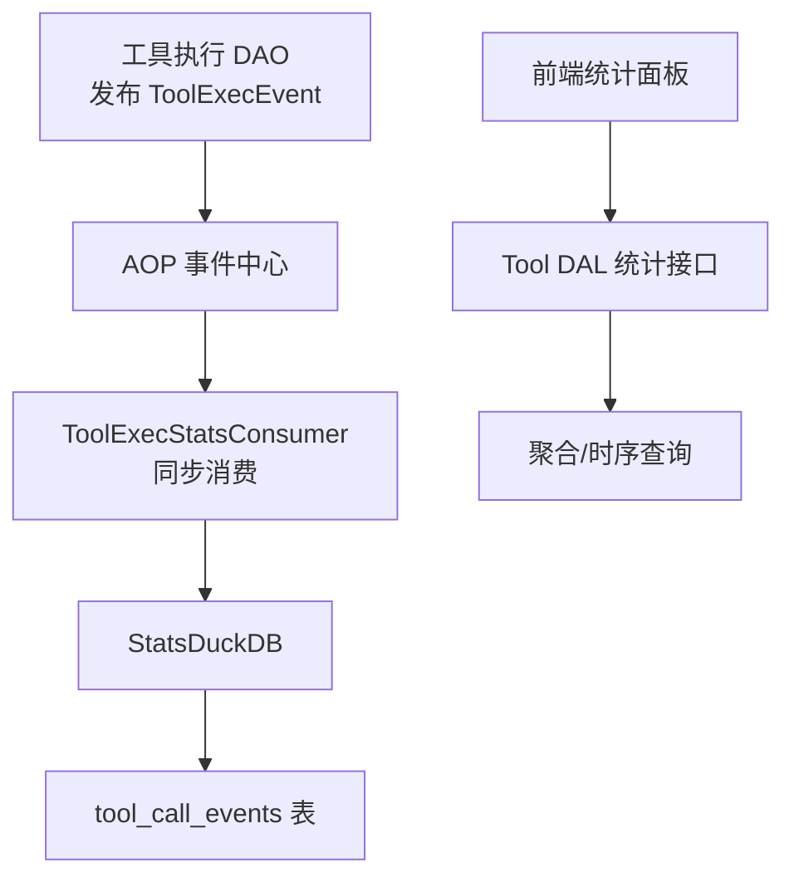
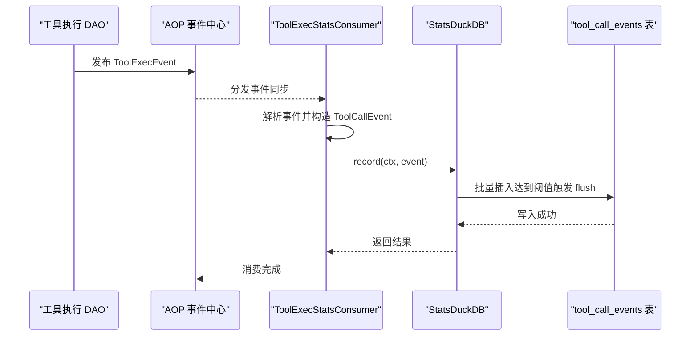
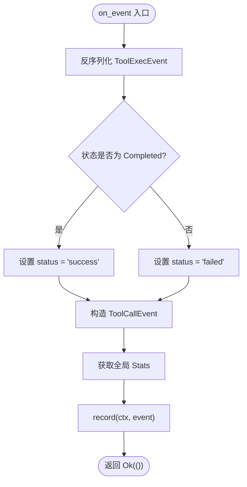
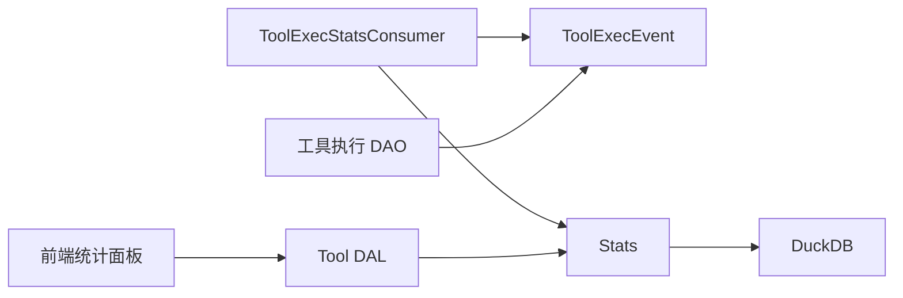

# 工具执行统计消费者

<cite>
**本文引用的文件**
- [tool_exec_stats_consumer.rs](file://src/consumer/tool_exec_stats_consumer.rs)
- [mod.rs（consumer 模块）](file://src/consumer/mod.rs)
- [tool_exec.rs（事件定义）](file://src/models/events/tool_exec.rs)
- [tool_call.rs（统计事件与表）](file://src/pkg/stats/tool_call.rs)
- [collector.rs（Stats 聚合与查询）](file://src/pkg/stats/collector.rs)
- [entry.rs（工具调用追踪条目）](file://src/pkg/tool_tracing/entry.rs)
- [impl.rs（工具执行 DAO）](file://src/service/dao/tool_call/impl.rs)
- [tool.rs（DAL 统计接口）](file://src/service/dal/tool.rs)
- [stats_duckdb_test.rs（统计测试）](file://src/service/dao/tool/stats_duckdb_test.rs)
- [stats.rs（前端统计面板）](file://frontend/src/components/stats.rs)
</cite>

## 目录
1. [简介](#简介)
2. [项目结构](#项目结构)
3. [核心组件](#核心组件)
4. [架构总览](#架构总览)
5. [详细组件分析](#详细组件分析)
6. [依赖关系分析](#依赖关系分析)
7. [性能考量](#性能考量)
8. [故障排查指南](#故障排查指南)
9. [结论](#结论)
10. [附录](#附录)

## 简介
本文件面向“工具执行统计消费者”的完整实现，围绕 ToolExecStatsConsumer 的职责、数据流、持久化策略、查询优化与可视化展示进行系统化说明。该消费者订阅 AOP 事件“agent.tool.executed”，将工具调用的耗时、参数/结果大小、成功/失败状态等指标写入 DuckDB 的专用统计表，并通过 DAL/DAO 暴露统计查询能力，最终在前端以统计卡片与时序图表呈现。

## 项目结构
- 消费者注册：在 consumer 模块初始化时统一注册各业务消费者，包括工具执行统计消费者。
- 事件发布：工具执行完成后由 DAO 层通过 AOP 发布 ToolExecEvent。
- 消费者处理：ToolExecStatsConsumer 同步消费事件，构造 ToolCallEvent 并写入 Stats。
- 持久化：Stats 基于 DuckDB，按批刷新到 tool_call_events 表。
- 查询与展示：DAL 提供统计查询接口，前端使用统计面板组件渲染。

**图示来源**
- [mod.rs（consumer 模块）:16-36](file://src/consumer/mod.rs#L16-L36)
- [tool_exec.rs:5-25](file://src/models/events/tool_exec.rs#L5-L25)
- [tool_exec_stats_consumer.rs:27-71](file://src/consumer/tool_exec_stats_consumer.rs#L27-L71)
- [tool_call.rs:121-188](file://src/pkg/stats/tool_call.rs#L121-L188)
- [collector.rs:116-131](file://src/pkg/stats/collector.rs#L116-L131)
- [tool.rs:205-232](file://src/service/dal/tool.rs#L205-L232)
- [stats.rs:217-235](file://frontend/src/components/stats.rs#L217-L235)

**章节来源**
- [mod.rs（consumer 模块）:16-36](file://src/consumer/mod.rs#L16-L36)
- [tool_exec.rs:5-25](file://src/models/events/tool_exec.rs#L5-L25)
- [tool_exec_stats_consumer.rs:27-71](file://src/consumer/tool_exec_stats_consumer.rs#L27-L71)
- [tool_call.rs:121-188](file://src/pkg/stats/tool_call.rs#L121-L188)
- [collector.rs:116-131](file://src/pkg/stats/collector.rs#L116-L131)
- [tool.rs:205-232](file://src/service/dal/tool.rs#L205-L232)
- [stats.rs:217-235](file://frontend/src/components/stats.rs#L217-L235)

## 核心组件
- ToolExecStatsConsumer：AOP 同步消费者，负责将工具执行事件转换为统计事件并记录。
- ToolExecEvent：工具执行完成事件，包含完整的调用条目与上下文维度信息。
- ToolCallEvent：统计事件模型，绑定 tool_call_events 表，承载标签与度量字段。
- Stats：统计基础设施，管理多表注册、批量写入、聚合与时间序列查询。
- Tool DAL：对外暴露工具统计查询接口，组合多个 DAO 能力。
- 前端统计面板：展示调用次数、QPS、失败次数等关键指标。

**章节来源**
- [tool_exec_stats_consumer.rs:13-71](file://src/consumer/tool_exec_stats_consumer.rs#L13-L71)
- [tool_exec.rs:11-64](file://src/models/events/tool_exec.rs#L11-L64)
- [tool_call.rs:12-41](file://src/pkg/stats/tool_call.rs#L12-L41)
- [collector.rs:82-131](file://src/pkg/stats/collector.rs#L82-L131)
- [tool.rs:205-232](file://src/service/dal/tool.rs#L205-L232)
- [stats.rs:217-235](file://frontend/src/components/stats.rs#L217-L235)

## 架构总览
工具执行统计链路遵循“生产-消费”模式：
- 生产者：工具执行 DAO 在完成工具调用后发布 ToolExecEvent。
- 消费者：ToolExecStatsConsumer 同步消费事件，构造 ToolCallEvent 并调用 Stats.record 写入。
- 持久化：Stats 内部维护缓冲，达到批次阈值后批量写入 DuckDB 的 tool_call_events 表。
- 查询：DAL 提供统计查询方法，支持调用摘要、失败计数、时间序列等。
- 展示：前端通过统计面板组件读取后端返回的统计数据进行可视化。

**图示来源**
- [impl.rs:84-116](file://src/service/dao/tool_call/impl.rs#L84-L116)
- [tool_exec.rs:47-64](file://src/models/events/tool_exec.rs#L47-L64)
- [tool_exec_stats_consumer.rs:41-71](file://src/consumer/tool_exec_stats_consumer.rs#L41-L71)
- [collector.rs:195-227](file://src/pkg/stats/collector.rs#L195-L227)
- [tool_call.rs:157-188](file://src/pkg/stats/tool_call.rs#L157-L188)

## 详细组件分析

### ToolExecStatsConsumer 分析
- 职责：订阅“agent.tool.executed”事件，将事件中的工具调用信息映射为统计事件，并写入 Stats。
- 事件解析：反序列化 ToolExecEvent，提取工具 ID、名称、Agent/Project/Task/Organization/User 维度以及参数/结果长度、耗时等。
- 状态映射：根据 ToolCallStatus 将 Completed 映射为 success，其他状态映射为 failed。
- 写入流程：构造 ToolCallEvent，获取全局 Stats 引用，创建系统级 RequestContext 并调用 record。

**图示来源**
- [tool_exec_stats_consumer.rs:41-71](file://src/consumer/tool_exec_stats_consumer.rs#L41-L71)
- [entry.rs:5-14](file://src/pkg/tool_tracing/entry.rs#L5-L14)

**章节来源**
- [tool_exec_stats_consumer.rs:27-71](file://src/consumer/tool_exec_stats_consumer.rs#L27-L71)
- [entry.rs:5-14](file://src/pkg/tool_tracing/entry.rs#L5-L14)

### ToolExecEvent 事件模型
- 字段：event_id、entry（完整调用条目）、organization_id、user_id、args_len、result_len、created_at。
- 事件标识：kind 为“agent.tool.executed”，id 为 event_id，order_key 基于 agent_id 保证同一 Agent 的工具日志顺序。
- 用途：作为 AOP 事件载体，被日志消费者与统计消费者共同订阅。

**章节来源**
- [tool_exec.rs:11-64](file://src/models/events/tool_exec.rs#L11-L64)

### ToolCallEvent 与持久化表
- 事件模型：包含 timestamp、tool_id、tool_name、agent_id、project_id、task_id、organization_id、user_id 等标签字段，以及 call_count、args_len、result_len、duration_ms、status 等度量字段。
- 表结构：tool_call_events 表，主键 id，timestamp 及各类 VARCHAR/BIGINT 字段。
- 写入方式：单条插入与批量插入均支持，错误处理统一包装为内部错误。

**章节来源**
- [tool_call.rs:12-41](file://src/pkg/stats/tool_call.rs#L12-L41)
- [tool_call.rs:121-188](file://src/pkg/stats/tool_call.rs#L121-L188)

### Stats 聚合与查询
- 注册与初始化：默认注册 DefaultStatTable、ModelCallStatTable、ToolCallStatTable、AgentAwakeStatTable、ProjectStatTable、TaskStatTable。
- 写入机制：record 将事件推入缓冲，达到 batch_size 时触发 flush_event_type，批量写入 DuckDB。
- 聚合查询：query_aggregation 支持过滤、分组与聚合函数（Count/Sum/Avg），构建 SQL 并返回结构化结果。
- 时间序列：query_time_series 支持按小时/天桶聚合，返回 TimeSeriesPoint。

**章节来源**
- [collector.rs:116-131](file://src/pkg/stats/collector.rs#L116-L131)
- [collector.rs:195-227](file://src/pkg/stats/collector.rs#L195-L227)
- [collector.rs:314-365](file://src/pkg/stats/collector.rs#L314-L365)
- [collector.rs:448-527](file://src/pkg/stats/collector.rs#L448-L527)

### 工具执行 DAO 与事件发布
- 执行流程：计算开始/结束时间与耗时，构造 ToolCallEntry，脱敏外部协议工具的输入输出错误，计算 args/result 长度。
- 事件发布：通过 AOP 发布 ToolExecEvent，携带 entry、组织/用户维度、参数/结果长度等信息。
- 错误处理：工具执行失败时抛出类型化错误，并附加 trace_ref 以便追踪。

**章节来源**
- [impl.rs:84-116](file://src/service/dao/tool_call/impl.rs#L84-L116)
- [tool_exec.rs:47-64](file://src/models/events/tool_exec.rs#L47-L64)

### DAL 统计接口与前端展示
- DAL 接口：get_stats 接受 tool_id 与 StatsFetchOptions，返回 ToolStats（包含调用摘要、失败计数、时间序列等）。
- 前端面板：ToolStatsPanel 展示调用次数、平均 QPS、瞬时 QPS、失败次数等卡片。

**章节来源**
- [tool.rs:205-232](file://src/service/dal/tool.rs#L205-L232)
- [stats.rs:217-235](file://frontend/src/components/stats.rs#L217-L235)

## 依赖关系分析
- 消费者依赖：ToolExecStatsConsumer 依赖 AOP 框架、事件模型、统计事件与工具追踪条目。
- 统计基础设施：Stats 依赖 DuckDB 连接、表注册与批量写入逻辑。
- DAL/DAO：DAL 组合多个 DAO，提供统一的统计查询入口；DAO 负责事件发布与数据准备。
- 前端：通过 API 获取统计结果并渲染。

**图示来源**
- [tool_exec_stats_consumer.rs:6-11](file://src/consumer/tool_exec_stats_consumer.rs#L6-L11)
- [tool_exec.rs:1-25](file://src/models/events/tool_exec.rs#L1-25)
- [collector.rs:82-131](file://src/pkg/stats/collector.rs#L82-L131)
- [tool.rs:205-232](file://src/service/dal/tool.rs#L205-L232)
- [stats.rs:217-235](file://frontend/src/components/stats.rs#L217-L235)

**章节来源**
- [tool_exec_stats_consumer.rs:6-11](file://src/consumer/tool_exec_stats_consumer.rs#L6-L11)
- [tool_exec.rs:1-25](file://src/models/events/tool_exec.rs#L1-25)
- [collector.rs:82-131](file://src/pkg/stats/collector.rs#L82-L131)
- [tool.rs:205-232](file://src/service/dal/tool.rs#L205-L232)
- [stats.rs:217-235](file://frontend/src/components/stats.rs#L217-L235)

## 性能考量
- 批量写入：Stats 内部缓冲达到阈值后批量插入，降低数据库写入开销。
- 同步消费：消费者采用同步模式，确保事件处理的顺序性与一致性，但需注意高吞吐场景下的阻塞风险。
- 查询优化：聚合查询与时间序列查询通过 SQL 生成与参数化避免注入风险，并按时间范围与过滤器减少扫描范围。
- 脱敏处理：外部协议工具的输入输出错误进行脱敏，避免敏感数据进入统计与日志。

[本节为通用性能讨论，不直接分析具体文件]

## 故障排查指南
- 事件反序列化失败：检查 ToolExecEvent 字段是否与事件结构一致，关注 organization_id/user_id/args_len/result_len 等字段的可选性与类型。
- 统计未写入：确认 Stats 已初始化并注册 ToolCallStatTable，检查全局 Stats 引用是否可用。
- 查询结果为空：验证时间范围、过滤器与分组条件是否正确，必要时调整 StatsFetchOptions。
- 前端显示异常：确认后端返回的 ToolStats 结构包含所需字段，检查前端面板组件的数据绑定。

**章节来源**
- [tool_exec_stats_consumer.rs:41-71](file://src/consumer/tool_exec_stats_consumer.rs#L41-L71)
- [collector.rs:116-131](file://src/pkg/stats/collector.rs#L116-L131)
- [stats_duckdb_test.rs:118-168](file://src/service/dao/tool/stats_duckdb_test.rs#L118-L168)
- [stats.rs:217-235](file://frontend/src/components/stats.rs#L217-L235)

## 结论
ToolExecStatsConsumer 作为工具执行统计的核心消费者，通过 AOP 事件驱动实现了工具调用的性能采集、持久化与查询能力。结合 Stats 的批量写入与聚合查询，以及 DAL 的统一接口与前端可视化，形成了完整的工具执行监控闭环。在高并发场景下，建议关注消费者同步模式的潜在瓶颈，并结合业务需求调整批次大小与查询粒度。

[本节为总结性内容，不直接分析具体文件]

## 附录
- 相关设计文档：AOP 事件中心计划、工具执行统计面板补充计划等。
- 测试用例：工具统计查询测试覆盖调用摘要与失败计数等关键路径。

[本节为补充信息，不直接分析具体文件]