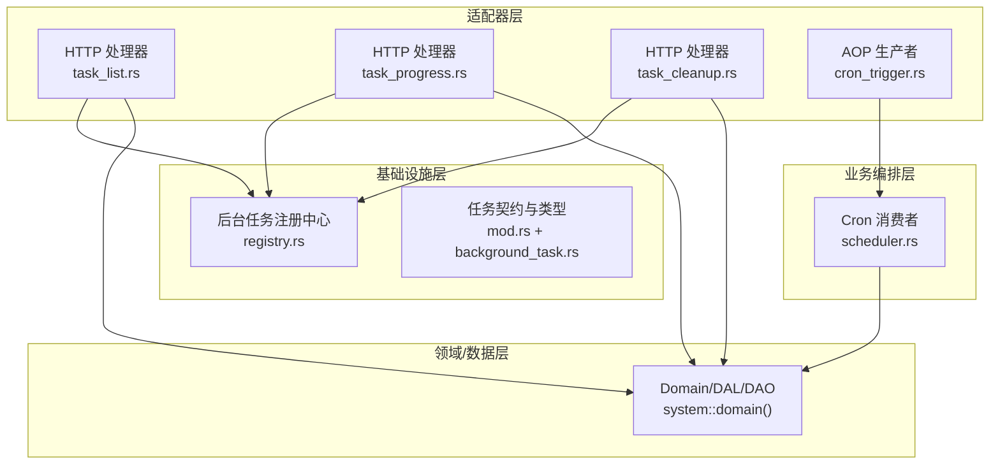
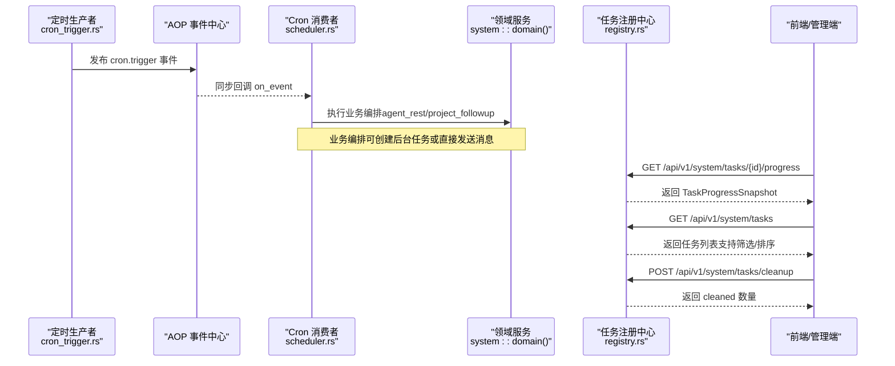
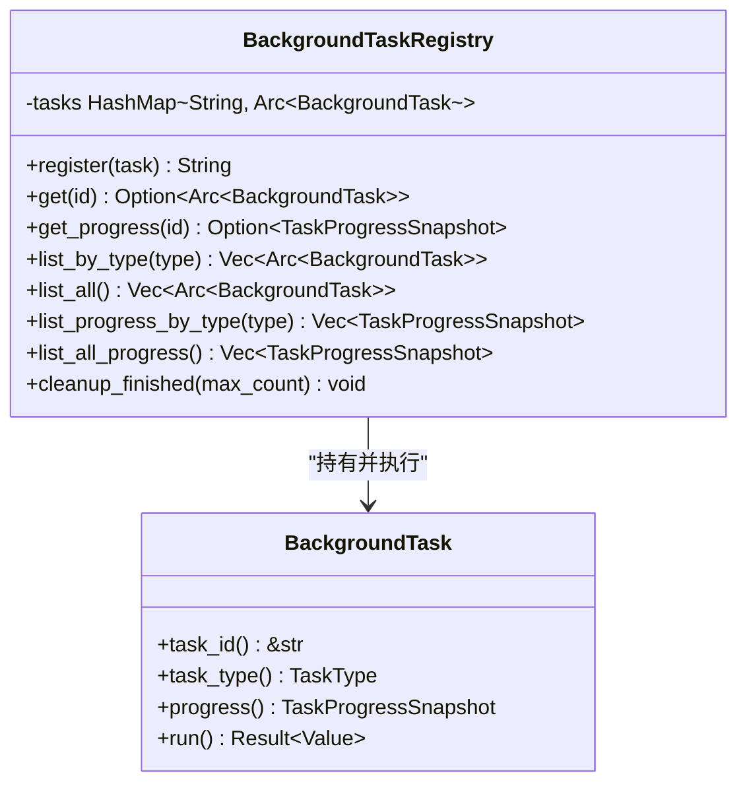
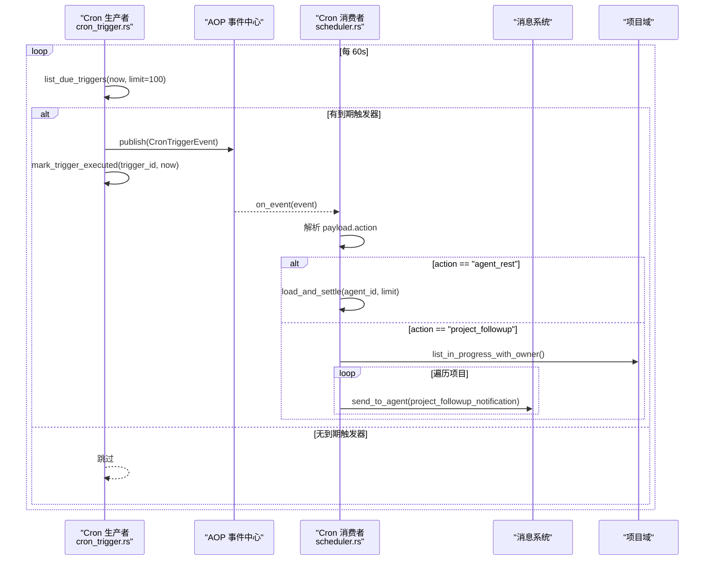
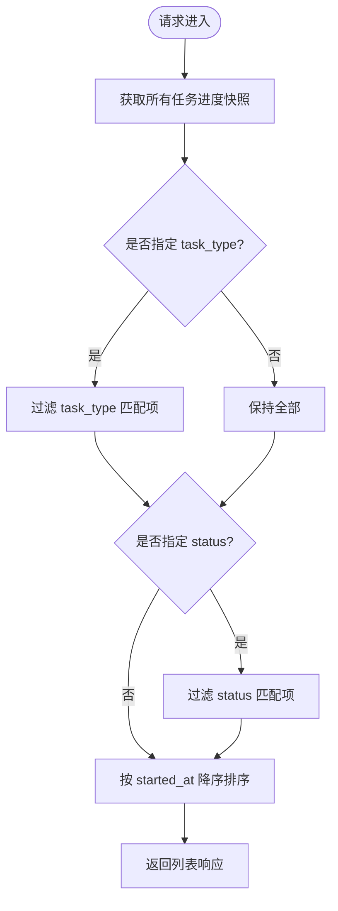
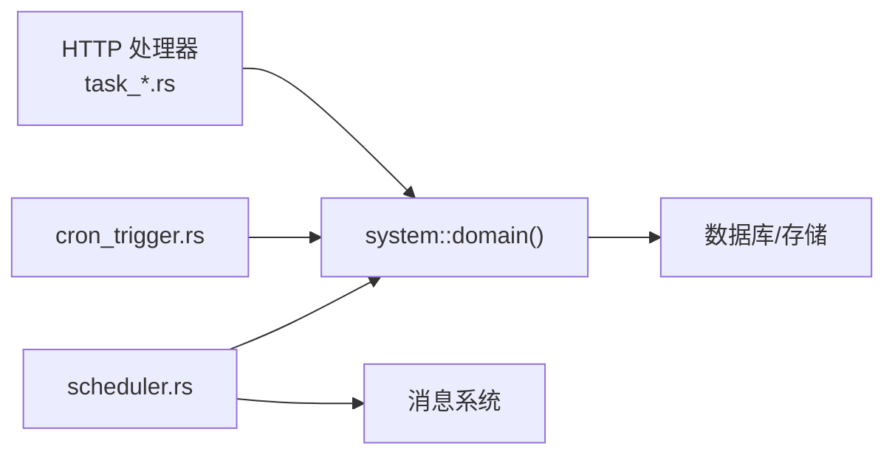

# 后台任务系统

<cite>
**本文引用的文件**
- [src/pkg/background_task/mod.rs](file://src/pkg/background_task/mod.rs)
- [src/pkg/background_task/registry.rs](file://src/pkg/background_task/registry.rs)
- [common/src/api/background_task.rs](file://common/src/api/background_task.rs)
- [src/handlers/system/task_list.rs](file://src/handlers/system/task_list.rs)
- [src/handlers/system/task_progress.rs](file://src/handlers/system/task_progress.rs)
- [src/handlers/system/task_cleanup.rs](file://src/handlers/system/task_cleanup.rs)
- [src/producer/cron_trigger.rs](file://src/producer/cron_trigger.rs)
- [src/consumer/scheduler.rs](file://src/consumer/scheduler.rs)
- [common/src/enums/task.rs](file://common/src/enums/task.rs)
</cite>

## 目录
1. [简介](#简介)
2. [项目结构](#项目结构)
3. [核心组件](#核心组件)
4. [架构总览](#架构总览)
5. [详细组件分析](#详细组件分析)
6. [依赖关系分析](#依赖关系分析)
7. [性能考虑](#性能考虑)
8. [故障排查指南](#故障排查指南)
9. [结论](#结论)
10. [附录](#附录)

## 简介
本技术文档聚焦 AI Orz 的后台任务系统，围绕任务调度器设计、任务注册机制、执行引擎与任务状态管理展开。系统基于 AOP 事件中心实现定时任务的发现与投递，通过统一的后台任务注册中心提供任务生命周期管理与进度查询能力。文档同时覆盖定时任务、延迟任务（由上层调用方触发）、重试策略建议、优先级管理建议、监控统计、失败处理与恢复策略，以及任务与消息系统的集成方式与分布式部署注意事项。

## 项目结构
后台任务系统横跨 pkg、producer、consumer、handlers 与 common API 层，遵循四层单向调用：Adapter（HTTP Handler / AOP Producer）→ Domain → DAL → DAO。任务相关的关键位置如下：
- 通用后台任务契约与注册中心：pkg/background_task
- 定时任务生产者：producer/cron_trigger
- Cron 触发消费者（业务编排）：consumer/scheduler
- 统一任务进度查询与管理接口：handlers/system/*
- 统一 DTO 与枚举：common/src/api/background_task.rs、common/src/enums/task.rs

图表来源
- [src/handlers/system/task_list.rs:1-41](file://src/handlers/system/task_list.rs#L1-L41)
- [src/handlers/system/task_progress.rs:1-26](file://src/handlers/system/task_progress.rs#L1-L26)
- [src/handlers/system/task_cleanup.rs:1-48](file://src/handlers/system/task_cleanup.rs#L1-L48)
- [src/producer/cron_trigger.rs:1-88](file://src/producer/cron_trigger.rs#L1-L88)
- [src/consumer/scheduler.rs:1-211](file://src/consumer/scheduler.rs#L1-L211)
- [src/pkg/background_task/registry.rs:1-131](file://src/pkg/background_task/registry.rs#L1-L131)
- [common/src/api/background_task.rs:1-128](file://common/src/api/background_task.rs#L1-L128)

章节来源
- [src/pkg/background_task/mod.rs:1-80](file://src/pkg/background_task/mod.rs#L1-L80)
- [src/pkg/background_task/registry.rs:1-131](file://src/pkg/background_task/registry.rs#L1-L131)
- [common/src/api/background_task.rs:1-128](file://common/src/api/background_task.rs#L1-L128)
- [src/handlers/system/task_list.rs:1-41](file://src/handlers/system/task_list.rs#L1-L41)
- [src/handlers/system/task_progress.rs:1-26](file://src/handlers/system/task_progress.rs#L1-L26)
- [src/handlers/system/task_cleanup.rs:1-48](file://src/handlers/system/task_cleanup.rs#L1-L48)
- [src/producer/cron_trigger.rs:1-88](file://src/producer/cron_trigger.rs#L1-L88)
- [src/consumer/scheduler.rs:1-211](file://src/consumer/scheduler.rs#L1-L211)

## 核心组件
- 后台任务契约与注册中心
  - BackgroundTask trait：定义任务 ID、类型、进度快照与执行入口 run。
  - BackgroundTaskRegistry：全局注册中心，提供注册即 spawn 执行、按类型/全部列出、进度查询、完成态清理等能力。
- 定时任务生产者与消费者
  - CronTriggerProducer：周期性轮询到期触发器，发布 cron.trigger 事件并标记已执行。
  - CronTriggerConsumer：订阅 cron.trigger 事件，解析 payload.action 分发到具体业务编排（如 agent_rest、project_followup）。
- 统一任务 API
  - TaskProgressSnapshot、TaskStatus、TaskType 等 DTO 用于统一进度查询与列表展示。
  - HTTP 处理器提供任务列表、进度查询、清理已完成任务等接口。

章节来源
- [src/pkg/background_task/mod.rs:1-80](file://src/pkg/background_task/mod.rs#L1-L80)
- [src/pkg/background_task/registry.rs:1-131](file://src/pkg/background_task/registry.rs#L1-L131)
- [common/src/api/background_task.rs:1-128](file://common/src/api/background_task.rs#L1-L128)
- [src/producer/cron_trigger.rs:1-88](file://src/producer/cron_trigger.rs#L1-L88)
- [src/consumer/scheduler.rs:1-211](file://src/consumer/scheduler.rs#L1-L211)
- [src/handlers/system/task_list.rs:1-41](file://src/handlers/system/task_list.rs#L1-L41)
- [src/handlers/system/task_progress.rs:1-26](file://src/handlers/system/task_progress.rs#L1-L26)
- [src/handlers/system/task_cleanup.rs:1-48](file://src/handlers/system/task_cleanup.rs#L1-L48)

## 架构总览
后台任务系统采用“事件驱动 + 注册中心”的模式：
- 定时任务：CronTriggerProducer 定期扫描到期触发器，发布事件；CronTriggerConsumer 消费事件并编排业务逻辑。
- 异步任务：任意层通过 registry().register(task) 提交任务，注册中心在后台线程执行，任务对象自包含进度状态，外部通过统一接口查询。
- 监控与管理：HTTP 处理器暴露任务列表、进度查询、清理接口，供前端或运维工具使用。

图表来源
- [src/producer/cron_trigger.rs:1-88](file://src/producer/cron_trigger.rs#L1-L88)
- [src/consumer/scheduler.rs:1-211](file://src/consumer/scheduler.rs#L1-L211)
- [src/handlers/system/task_progress.rs:1-26](file://src/handlers/system/task_progress.rs#L1-L26)
- [src/handlers/system/task_list.rs:1-41](file://src/handlers/system/task_list.rs#L1-L41)
- [src/handlers/system/task_cleanup.rs:1-48](file://src/handlers/system/task_cleanup.rs#L1-L48)
- [src/pkg/background_task/registry.rs:1-131](file://src/pkg/background_task/registry.rs#L1-L131)

## 详细组件分析

### 任务契约与注册中心
- BackgroundTask trait
  - 职责：声明任务唯一标识、类型、进度快照读取与执行入口。
  - 语义：run 内部更新自身进度字段，最终写入结果并置为完成；任务只执行一次由注册中心的 spawn 保证。
- BackgroundTaskRegistry
  - 注册与执行：register 将任务以 Arc<dyn BackgroundTask> 存入内存表，并在后台任务中执行 run。
  - 进度查询：get/get_progress/list_by_type/list_all/list_all_progress 提供多种查询视图。
  - 清理策略：cleanup_finished 按 task_type 分组，保留每组最近 N 个已完成/失败任务，移除更早记录。

图表来源
- [src/pkg/background_task/mod.rs:1-80](file://src/pkg/background_task/mod.rs#L1-L80)
- [src/pkg/background_task/registry.rs:1-131](file://src/pkg/background_task/registry.rs#L1-L131)

章节来源
- [src/pkg/background_task/mod.rs:1-80](file://src/pkg/background_task/mod.rs#L1-L80)
- [src/pkg/background_task/registry.rs:1-131](file://src/pkg/background_task/registry.rs#L1-L131)

### 定时任务流程（生产者与消费者）
- CronTriggerProducer
  - 每 60 秒轮询到期触发器，构造 CronTriggerEvent 并发布到 AOP 事件中心，随后标记触发器已执行。
- CronTriggerConsumer
  - 订阅 cron.trigger 事件，解析 payload.action 进行分发：
    - agent_rest：加载 Agent 并执行记忆沉淀（复用 settle_memory 公共函数）。
    - project_followup：扫描进行中且有 Owner Agent 的项目，预检查 Agent 运行时状态后发送跟进通知消息。

图表来源
- [src/producer/cron_trigger.rs:1-88](file://src/producer/cron_trigger.rs#L1-L88)
- [src/consumer/scheduler.rs:1-211](file://src/consumer/scheduler.rs#L1-L211)

章节来源
- [src/producer/cron_trigger.rs:1-88](file://src/producer/cron_trigger.rs#L1-L88)
- [src/consumer/scheduler.rs:1-211](file://src/consumer/scheduler.rs#L1-L211)

### 任务进度查询与管理（HTTP 接口）
- 列表查询：GET /api/v1/system/tasks
  - 支持按 task_type 字符串匹配与 status 筛选，返回按 started_at 降序的任务快照列表。
- 进度查询：GET /api/v1/system/tasks/{task_id}/progress
  - 根据 task_id 查询对应任务的 TaskProgressSnapshot，不存在返回未找到错误。
- 清理接口：POST /api/v1/system/tasks/cleanup
  - 每个 task_type 仅保留最近 max_count 个已完成/失败任务，其余移除；返回清理数量。

图表来源
- [src/handlers/system/task_list.rs:1-41](file://src/handlers/system/task_list.rs#L1-L41)

章节来源
- [src/handlers/system/task_list.rs:1-41](file://src/handlers/system/task_list.rs#L1-L41)
- [src/handlers/system/task_progress.rs:1-26](file://src/handlers/system/task_progress.rs#L1-L26)
- [src/handlers/system/task_cleanup.rs:1-48](file://src/handlers/system/task_cleanup.rs#L1-L48)

### 任务状态与类型
- 任务状态（API 层）：Pending、Running、Completed、Failed，用于统一进度展示。
- 任务类型（API 层）：InitializeSystem、RebuildVectors、SeedSave、SeedLoad、SeedApplyDefault，前端据此显示文案。
- 任务状态（领域层）：TaskStatus 枚举包含 Cancelled、PendingReview、Pending、InProgress、Completed、Archived，用于持久化与领域模型。

章节来源
- [common/src/api/background_task.rs:1-128](file://common/src/api/background_task.rs#L1-L128)
- [common/src/enums/task.rs:1-100](file://common/src/enums/task.rs#L1-L100)

## 依赖关系分析
- 模块耦合
  - handlers/system/* 依赖 system::domain().background_task_registry() 获取任务注册中心实例。
  - producer/cron_trigger 依赖 system::domain().cron_manager() 查询到期触发器。
  - consumer/scheduler 依赖 message 与 project 领域服务完成业务编排。
- 外部依赖
  - AOP 事件中心用于解耦定时任务的生产与消费。
  - 消息系统用于项目跟进通知等场景。
- 潜在循环依赖
  - 当前分层清晰，未见循环依赖；需确保新增任务编排时仍遵循 Adapter → Domain → DAL → DAO 单向调用。

图表来源
- [src/handlers/system/task_list.rs:1-41](file://src/handlers/system/task_list.rs#L1-L41)
- [src/producer/cron_trigger.rs:1-88](file://src/producer/cron_trigger.rs#L1-L88)
- [src/consumer/scheduler.rs:1-211](file://src/consumer/scheduler.rs#L1-L211)

章节来源
- [src/handlers/system/task_list.rs:1-41](file://src/handlers/system/task_list.rs#L1-L41)
- [src/producer/cron_trigger.rs:1-88](file://src/producer/cron_trigger.rs#L1-L88)
- [src/consumer/scheduler.rs:1-211](file://src/consumer/scheduler.rs#L1-L211)

## 性能考虑
- 内存注册中心
  - 任务数量通常不大，list_all_progress 遍历性能可接受；若未来规模扩大，可引入分页或索引优化。
- 清理策略
  - cleanup_finished 按类型分组并排序，避免长期运行导致内存膨胀；建议结合监控定期调用。
- 定时轮询
  - 生产者每 60 秒轮询，limit=100 控制单次扫描量；可根据负载调整间隔与上限。
- 并发执行
  - 任务通过 tokio::spawn 后台执行，注意任务内 I/O 与 CPU 密集操作的资源占用；必要时限制并发度。

[本节为通用指导，不直接分析具体文件]

## 故障排查指南
- 任务执行失败
  - 注册中心在 register 的 spawn 中对 Err 进行 error 日志记录；可通过任务列表与进度接口查看 Failed 状态与 error 字段。
- 定时任务未触发
  - 检查 CronTriggerProducer 轮询是否生效、DB 中是否存在到期触发器、AOP 事件中心是否正常注册与发布。
- 项目跟进消息发送失败
  - 检查 Agent 运行时状态是否为可用；确认消息投递链路正常；关注 consumer 中的警告日志。
- 任务堆积与内存增长
  - 定期调用清理接口；评估任务生命周期与清理阈值；必要时扩展清理策略（如按时间窗口清理）。

章节来源
- [src/pkg/background_task/registry.rs:25-45](file://src/pkg/background_task/registry.rs#L25-L45)
- [src/handlers/system/task_cleanup.rs:1-48](file://src/handlers/system/task_cleanup.rs#L1-L48)
- [src/consumer/scheduler.rs:139-194](file://src/consumer/scheduler.rs#L139-L194)

## 结论
AI Orz 后台任务系统通过 AOP 事件中心与统一注册中心实现了定时任务与异步任务的解耦与统一管理。任务对象自包含进度状态，配合 HTTP 接口提供完整的监控与管理能力。系统在分层设计上严格遵循单向调用，便于扩展与维护。后续可在重试机制、优先级队列、持久化任务历史等方面进一步增强，以满足更大规模与更高可靠性的需求。

## 附录

### 任务开发示例（步骤说明）
- 实现任务对象
  - 实现 BackgroundTask trait，维护任务 ID、类型、进度字段与 run 方法。
  - 在 run 中逐步更新进度，最终写入 result 并置为 Completed。
- 注册与执行
  - 通过 registry().register(Arc::new(MyTask)) 提交任务，获得 task_id。
- 进度查询
  - 前端轮询 GET /api/v1/system/tasks/{task_id}/progress 获取 TaskProgressSnapshot。
- 列表与清理
  - 使用列表接口筛选任务类型与状态；定期调用清理接口保留最近完成记录。

章节来源
- [src/pkg/background_task/mod.rs:1-80](file://src/pkg/background_task/mod.rs#L1-L80)
- [src/pkg/background_task/registry.rs:25-45](file://src/pkg/background_task/registry.rs#L25-L45)
- [common/src/api/background_task.rs:52-128](file://common/src/api/background_task.rs#L52-L128)
- [src/handlers/system/task_progress.rs:1-26](file://src/handlers/system/task_progress.rs#L1-L26)
- [src/handlers/system/task_list.rs:1-41](file://src/handlers/system/task_list.rs#L1-L41)
- [src/handlers/system/task_cleanup.rs:1-48](file://src/handlers/system/task_cleanup.rs#L1-L48)

### 配置与管理要点
- 定时任务
  - 通过 system::domain().cron_manager() 管理触发器；生产者在轮询时读取到期触发器并发布事件。
- 任务清理阈值
  - 清理接口支持 max_count 参数，默认 10；可按业务需要调整。
- 监控指标
  - 建议结合 AOP 统计与日志，记录任务执行耗时、失败率与队列长度等指标。

章节来源
- [src/producer/cron_trigger.rs:1-88](file://src/producer/cron_trigger.rs#L1-L88)
- [src/handlers/system/task_cleanup.rs:1-48](file://src/handlers/system/task_cleanup.rs#L1-L48)

### 与消息系统集成
- 项目跟进通知
  - CronTriggerConsumer 在 project_followup 动作中构建消息内容并通过消息系统发送给 Owner Agent。
- 预检查
  - 发送前检查 Agent 运行时状态，避免对不可用 Agent 发送消息造成 nack 堆积。

章节来源
- [src/consumer/scheduler.rs:139-194](file://src/consumer/scheduler.rs#L139-L194)

### 分布式部署考虑
- 进程内注册中心
  - 当前注册中心为进程内内存结构；多实例部署时，各实例独立维护任务状态。
- 任务可见性
  - 如需跨实例可见，可将任务元数据持久化（例如任务表），并提供集中式查询接口。
- 定时任务协调
  - 多实例下需避免重复触发；可通过数据库锁或分布式协调服务确保单一实例执行。
- 消息系统
  - 使用可靠的消息中间件保障事件投递与顺序性；消费者需具备幂等处理与重试能力。

[本节为概念性指导，不直接分析具体文件]