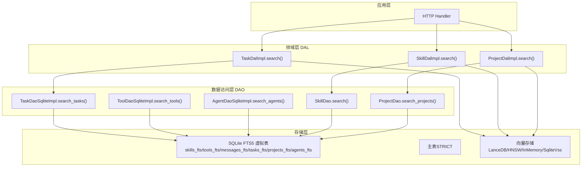
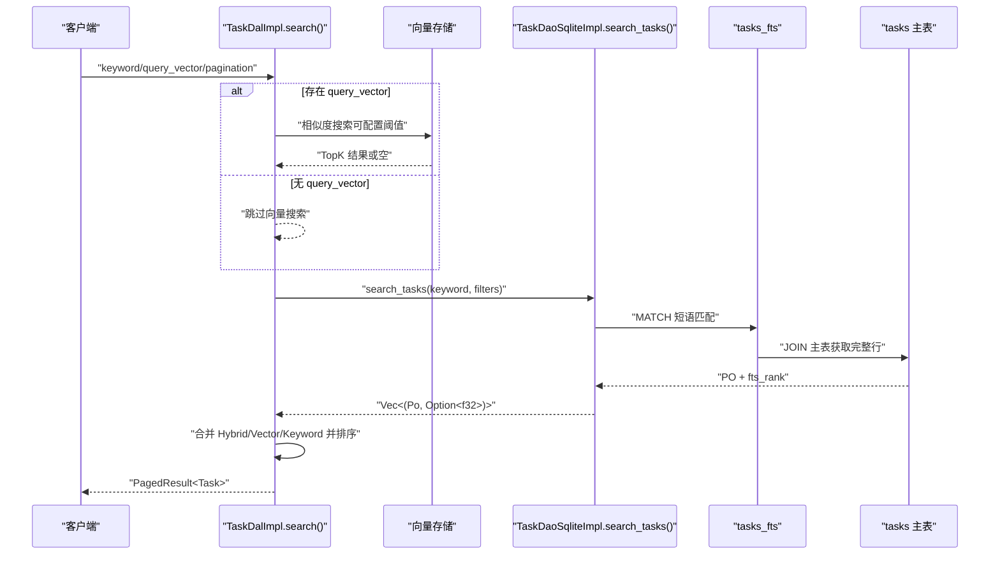
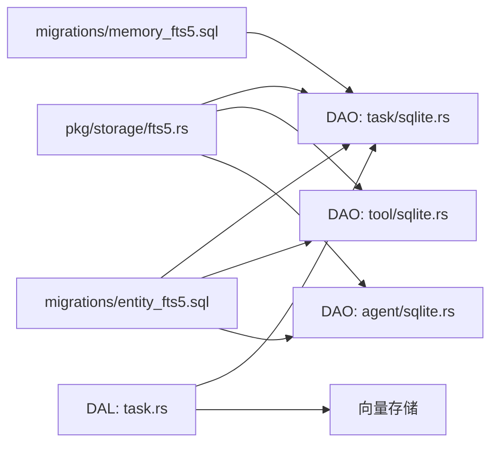

# 全文搜索

<cite>
**本文引用的文件**
- [fts5.rs](file://src/pkg/storage/fts5.rs)
- [20260712000000_memory_fts5.sql](file://migrations/20260712000000_memory_fts5.sql)
- [20260712000001_entity_fts5.sql](file://migrations/20260712000001_entity_fts5.sql)
- [task.rs](file://src/service/dal/task.rs)
- [sqlite.rs（Task DAO）](file://src/service/dao/task/sqlite.rs)
- [sqlite.rs（Tool DAO）](file://src/service/dao/tool/sqlite.rs)
- [sqlite.rs（Agent DAO）](file://src/service/dao/agent/sqlite.rs)
- [mod.rs（Skill DAO）](file://src/service/dao/skill/mod.rs)
- [mod.rs（Project DAO）](file://src/service/dao/project/mod.rs)
- [vector.rs](file://src/models/vector.rs)
- [ai_orz.toml](file://common/config/ai_orz.toml)
</cite>

## 目录
1. [简介](#简介)
2. [项目结构](#项目结构)
3. [核心组件](#核心组件)
4. [架构总览](#架构总览)
5. [详细组件分析](#详细组件分析)
6. [依赖关系分析](#依赖关系分析)
7. [性能与优化](#性能与优化)
8. [故障排查指南](#故障排查指南)
9. [结论](#结论)
10. [附录：查询语法与实践示例](#附录：查询语法与实践示例)

## 简介
本技术文档聚焦 AI Orz 的全文搜索子系统，围绕 SQLite FTS5 虚拟表、trigram 分词器、BM25 相关性排序、关键词转义与短语匹配、DAL 层混合搜索（FTS5 + 向量）以及分页机制展开。文档同时给出索引维护策略、查询优化建议以及与向量搜索结合的最佳实践，帮助读者在工程实践中高效使用全文检索能力。

## 项目结构
全文搜索能力贯穿三层：
- 存储层（DAO）：基于 SQLx 构建 FTS5 MATCH + JOIN 主表的查询，返回业务 PO 与 BM25 评分 fts_rank，并统一限制最大返回条数以保护系统。
- 领域层（DAL）：组合 FTS5 关键词搜索与向量语义搜索，按 Hybrid/Vector/Keyword 三态合并结果并统一排序；支持向量距离阈值过滤与降级。
- 通用工具（pkg/storage）：提供 FTS5 关键词转义函数，确保用户输入安全且符合 FTS5 语法。

图表来源
- [task.rs:143-153](file://src/service/dal/task.rs#L143-L153)
- [sqlite.rs（Task DAO）:177-200](file://src/service/dao/task/sqlite.rs#L177-L200)
- [sqlite.rs（Tool DAO）:429-453](file://src/service/dao/tool/sqlite.rs#L429-L453)
- [sqlite.rs（Agent DAO）:141-230](file://src/service/dao/agent/sqlite.rs#L141-L230)
- [mod.rs（Skill DAO）:101-109](file://src/service/dao/skill/mod.rs#L101-L109)
- [mod.rs（Project DAO）:97-110](file://src/service/dao/project/mod.rs#L97-L110)

章节来源
- [task.rs:143-153](file://src/service/dal/task.rs#L143-L153)
- [sqlite.rs（Task DAO）:177-200](file://src/service/dao/task/sqlite.rs#L177-L200)
- [sqlite.rs（Tool DAO）:429-453](file://src/service/dao/tool/sqlite.rs#L429-L453)
- [sqlite.rs（Agent DAO）:141-230](file://src/service/dao/agent/sqlite.rs#L141-L230)
- [mod.rs（Skill DAO）:101-109](file://src/service/dao/skill/mod.rs#L101-L109)
- [mod.rs（Project DAO）:97-110](file://src/service/dao/project/mod.rs#L97-L110)

## 核心组件
- FTS5 虚拟表与触发器：为记忆与实体创建 FTS5 虚拟表，配置 trigram 分词器，并通过 INSERT/UPDATE/DELETE 触发器自动同步主表到 FTS 表。
- 关键词转义：escape_fts5_keyword 将用户输入转为 FTS5 短语匹配，避免空格被解释为 AND，并正确处理特殊字符。
- 搜索实现：各 DAO 的 search_* 方法统一采用 FTS5 MATCH + JOIN 主表 + ORDER BY rank（BM25），并限制最大返回数量。
- 混合搜索：DAL 层根据 keyword 与 query_vector 选择 Keyword/Vector/Hybrid 三种模式，并按 Hybrid→Vector→Keyword 优先级合并排序。
- 分页：统一通过 LIMIT/OFFSET 控制，搜索场景默认上限 20 条，防止全量扫描。

章节来源
- [20260712000000_memory_fts5.sql:16-29](file://migrations/20260712000000_memory_fts5.sql#L16-L29)
- [20260712000001_entity_fts5.sql:18-66](file://migrations/20260712000001_entity_fts5.sql#L18-L66)
- [fts5.rs:6-18](file://src/pkg/storage/fts5.rs#L6-L18)
- [sqlite.rs（Task DAO）:177-200](file://src/service/dao/task/sqlite.rs#L177-L200)
- [sqlite.rs（Tool DAO）:429-453](file://src/service/dao/tool/sqlite.rs#L429-L453)
- [sqlite.rs（Agent DAO）:141-230](file://src/service/dao/agent/sqlite.rs#L141-L230)
- [task.rs:143-153](file://src/service/dal/task.rs#L143-L153)

## 架构总览
下图展示一次“任务”混合搜索的调用序列：DAL 层先尝试向量搜索（可选），再执行 FTS5 关键词搜索，最后合并结果并按 Hybrid/Vector/Keyword 分组排序。

图表来源
- [task.rs:143-153](file://src/service/dal/task.rs#L143-L153)
- [task.rs:405-437](file://src/service/dal/task.rs#L405-L437)
- [sqlite.rs（Task DAO）:177-200](file://src/service/dao/task/sqlite.rs#L177-L200)

章节来源
- [task.rs:143-153](file://src/service/dal/task.rs#L143-L153)
- [task.rs:405-437](file://src/service/dal/task.rs#L405-L437)
- [sqlite.rs（Task DAO）:177-200](file://src/service/dao/task/sqlite.rs#L177-L200)

## 详细组件分析

### FTS5 虚拟表与触发器
- 记忆类索引：short_term_memory_fts（summary/tags）、knowledge_node_fts（node_name/summary/node_description）。
- 实体类索引：skills_fts、tools_fts、messages_fts、tasks_fts、projects_fts、agents_fts。
- 所有虚拟表均启用 trigram 分词器，支持中英文混合检索。
- 每个主表均有 AFTER INSERT/AFTER UPDATE/AFTER DELETE 触发器，保证 FTS 与主表一致。
- 迁移脚本包含存量数据回填语句，确保历史数据可被检索。

章节来源
- [20260712000000_memory_fts5.sql:16-29](file://migrations/20260712000000_memory_fts5.sql#L16-L29)
- [20260712000000_memory_fts5.sql:35-79](file://migrations/20260712000000_memory_fts5.sql#L35-L79)
- [20260712000000_memory_fts5.sql:85-92](file://migrations/20260712000000_memory_fts5.sql#L85-L92)
- [20260712000001_entity_fts5.sql:18-66](file://migrations/20260712000001_entity_fts5.sql#L18-L66)
- [20260712000001_entity_fts5.sql:72-217](file://migrations/20260712000001_entity_fts5.sql#L72-L217)
- [20260712000001_entity_fts5.sql:223-246](file://migrations/20260712000001_entity_fts5.sql#L223-L246)

### 关键词提取与分词处理
- 关键词转义：escape_fts5_keyword 将用户输入包裹为双引号短语，内部双引号双写转义，避免空格被解析为 AND，同时屏蔽 FTS5 特殊字符影响。
- 分词器：trigram 基于三字符子串匹配，天然支持中文与英文混合检索。
- 空关键词处理：DAO 层对空关键词直接返回空结果，避免 FTS5 MATCH 报错。

章节来源
- [fts5.rs:6-18](file://src/pkg/storage/fts5.rs#L6-L18)
- [sqlite.rs（Task DAO）:184-193](file://src/service/dao/task/sqlite.rs#L184-L193)
- [sqlite.rs（Agent DAO）:148-156](file://src/service/dao/agent/sqlite.rs#L148-L156)

### 搜索结果排序与分页机制
- 排序：FTS5 虚拟表自带 rank 列，ORDER BY rank 即 BM25 相关性排序（越小越相关）。
- 分页：统一使用 LIMIT/OFFSET；搜索场景限制最大返回数量（默认 20），防止全量结果泄露。
- 混合排序：DAL 层将 Hybrid/Vector/Keyword 三类结果分组后，组内分别按 vector_distance 升序或 fts_rank 升序排序，组间按 Hybrid→Vector→Keyword 优先级合并。

章节来源
- [sqlite.rs（Task DAO）:195-200](file://src/service/dao/task/sqlite.rs#L195-L200)
- [sqlite.rs（Tool DAO）:429-453](file://src/service/dao/tool/sqlite.rs#L429-L453)
- [sqlite.rs（Agent DAO）:216-230](file://src/service/dao/agent/sqlite.rs#L216-L230)
- [task.rs:405-437](file://src/service/dal/task.rs#L405-L437)

### 搜索语法支持与布尔查询、模糊匹配、权重评分
- 语法：当前实现采用短语匹配（关键词整体加双引号），适合精确命中；未暴露复杂布尔语法（AND/OR/NOT）与通配符。
- 模糊匹配：trigram 分词器具备近似匹配能力，短词/错字可通过子串重叠获得一定召回。
- 权重评分：BM25 由 FTS5 内部计算，DAO 层通过 rank 排序体现相关性；DAL 层 SearchMatchInfo 携带 fts_rank 供上层展示或二次排序。

章节来源
- [fts5.rs:6-18](file://src/pkg/storage/fts5.rs#L6-L18)
- [20260712000001_entity_fts5.sql:18-66](file://migrations/20260712000001_entity_fts5.sql#L18-L66)
- [vector.rs:106-125](file://src/models/vector.rs#L106-L125)

### 与向量搜索的结合使用模式
- 混合搜索入口：DAL 层 search() 根据参数决定 Keyword/Vector/Hybrid 模式。
- 降级策略：当向量搜索失败或无可用 Embedding Provider 时，自动降级为纯关键词搜索。
- 阈值过滤：可配置向量距离阈值（如 0.8），超过阈值的向量结果将被过滤，仅保留更相似的结果。
- 结果包装：SearchResult/SearchMatchInfo 携带 match_type、vector_distance、fts_rank 等元信息，便于前端展示与排序。

章节来源
- [task.rs:143-153](file://src/service/dal/task.rs#L143-L153)
- [task.rs:405-437](file://src/service/dal/task.rs#L405-L437)
- [vector.rs:94-125](file://src/models/vector.rs#L94-L125)

## 依赖关系分析
- DAO 层依赖 pkg/storage 的 escape_fts5_keyword，避免 DAO 之间互相依赖。
- DAL 层依赖 DAO 与向量存储，负责策略编排与结果合并。
- 迁移脚本定义 FTS5 虚拟表与触发器，是全文检索的基础设施。

图表来源
- [fts5.rs:6-18](file://src/pkg/storage/fts5.rs#L6-L18)
- [sqlite.rs（Task DAO）:177-200](file://src/service/dao/task/sqlite.rs#L177-L200)
- [sqlite.rs（Tool DAO）:429-453](file://src/service/dao/tool/sqlite.rs#L429-L453)
- [sqlite.rs（Agent DAO）:141-230](file://src/service/dao/agent/sqlite.rs#L141-L230)
- [20260712000000_memory_fts5.sql:16-29](file://migrations/20260712000000_memory_fts5.sql#L16-L29)
- [20260712000001_entity_fts5.sql:18-66](file://migrations/20260712000001_entity_fts5.sql#L18-L66)
- [task.rs:143-153](file://src/service/dal/task.rs#L143-L153)

章节来源
- [fts5.rs:6-18](file://src/pkg/storage/fts5.rs#L6-L18)
- [sqlite.rs（Task DAO）:177-200](file://src/service/dao/task/sqlite.rs#L177-L200)
- [sqlite.rs（Tool DAO）:429-453](file://src/service/dao/tool/sqlite.rs#L429-L453)
- [sqlite.rs（Agent DAO）:141-230](file://src/service/dao/agent/sqlite.rs#L141-L230)
- [20260712000000_memory_fts5.sql:16-29](file://migrations/20260712000000_memory_fts5.sql#L16-L29)
- [20260712000001_entity_fts5.sql:18-66](file://migrations/20260712000001_entity_fts5.sql#L18-L66)
- [task.rs:143-153](file://src/service/dal/task.rs#L143-L153)

## 性能与优化
- 索引维护
  - 使用触发器自动同步，避免额外写入逻辑；更新路径为先删旧再插新，保证一致性。
  - 迁移脚本包含存量数据回填，上线后可立即检索历史数据。
- 查询优化
  - 短语匹配减少误匹配，提高准确率；trigram 提升中文召回。
  - 搜索场景限制最大返回数量（默认 20），避免全量扫描。
  - 使用 ORDER BY rank 利用 FTS5 内置相关性排序，无需额外打分。
- 混合搜索优化
  - 向量距离阈值可调，过滤低相似度结果，减少无效合并。
  - 向量搜索失败自动降级为关键词搜索，保障可用性。
- 配置与环境
  - 数据库文件位置与日志目录可在 ai_orz.toml 中配置，便于部署与运维。

章节来源
- [20260712000000_memory_fts5.sql:35-79](file://migrations/20260712000000_memory_fts5.sql#L35-L79)
- [20260712000001_entity_fts5.sql:72-217](file://migrations/20260712000001_entity_fts5.sql#L72-L217)
- [sqlite.rs（Task DAO）:184-200](file://src/service/dao/task/sqlite.rs#L184-L200)
- [sqlite.rs（Tool DAO）:429-453](file://src/service/dao/tool/sqlite.rs#L429-L453)
- [sqlite.rs（Agent DAO）:148-230](file://src/service/dao/agent/sqlite.rs#L148-L230)
- [task.rs:405-437](file://src/service/dal/task.rs#L405-L437)
- [ai_orz.toml:14-29](file://common/config/ai_orz.toml#L14-L29)

## 故障排查指南
- 关键词为空导致 MATCH 报错：DAO 层已对空关键词提前返回空结果，若仍出现异常，请检查上游是否传入空白字符串。
- 触发器不同步：确认迁移脚本已执行，且主表操作经过触发器路径；必要时重新执行存量回填。
- 向量搜索失败降级：查看日志中的“向量搜索失败，降级到关键词搜索”，确认 Embedding Provider 可用性与向量化流程。
- 结果过多或超时：检查分页 limit，搜索场景默认上限 20；如需更多，需评估数据规模与索引效率。

章节来源
- [sqlite.rs（Task DAO）:184-193](file://src/service/dao/task/sqlite.rs#L184-L193)
- [20260712000000_memory_fts5.sql:35-79](file://migrations/20260712000000_memory_fts5.sql#L35-L79)
- [task.rs:405-437](file://src/service/dal/task.rs#L405-L437)

## 结论
AI Orz 的全文搜索以 SQLite FTS5 为核心，配合 trigram 分词器与 BM25 相关性排序，实现了稳定高效的关键词检索。通过 DAO 层的统一封装与 DAL 层的混合搜索编排，系统在准确性、召回率与可用性之间取得良好平衡。结合向量搜索与阈值过滤，进一步提升了语义匹配能力。建议在大规模数据场景下关注索引维护与查询限流，确保系统稳定性。

## 附录：查询语法与实践示例
- 短语匹配：使用 escape_fts5_keyword 将用户输入转为短语匹配，避免空格被解释为 AND。
- 中文检索：trigram 分词器支持中文，建议关键词长度≥3 字符以获得更好效果。
- 混合搜索：DAL 层 search() 支持 keyword 与 query_vector 同时传入，自动合并 Hybrid/Vector/Keyword 结果。
- 分页：LIMIT/OFFSET 控制返回范围，搜索场景默认上限 20。

章节来源
- [fts5.rs:6-18](file://src/pkg/storage/fts5.rs#L6-L18)
- [sqlite.rs（Task DAO）:184-200](file://src/service/dao/task/sqlite.rs#L184-L200)
- [task.rs:143-153](file://src/service/dal/task.rs#L143-L153)