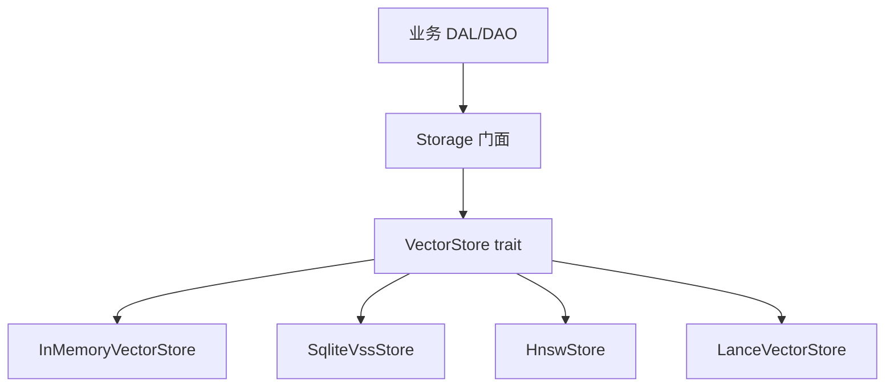
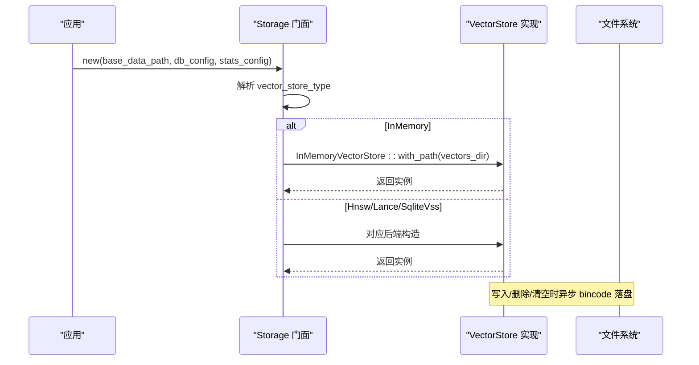
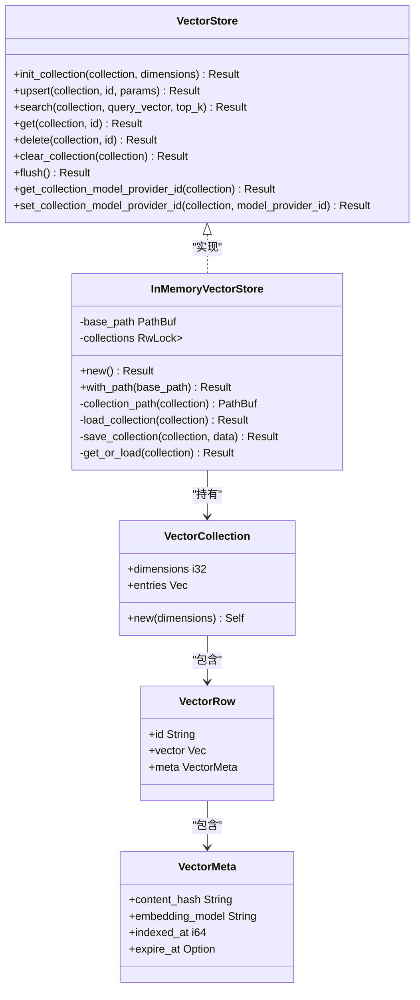
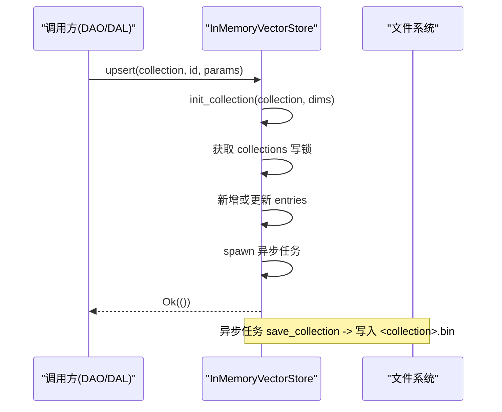
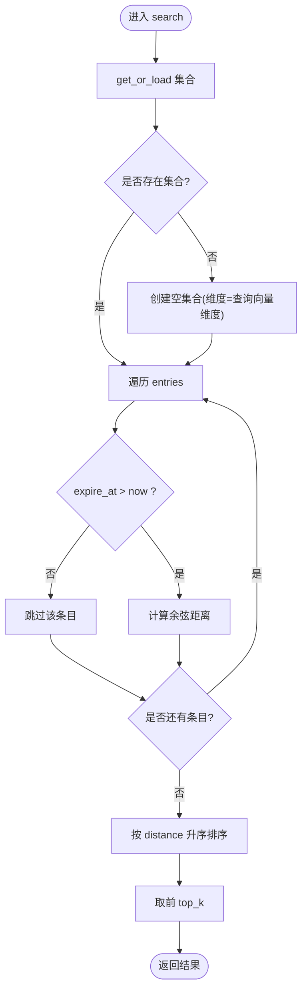
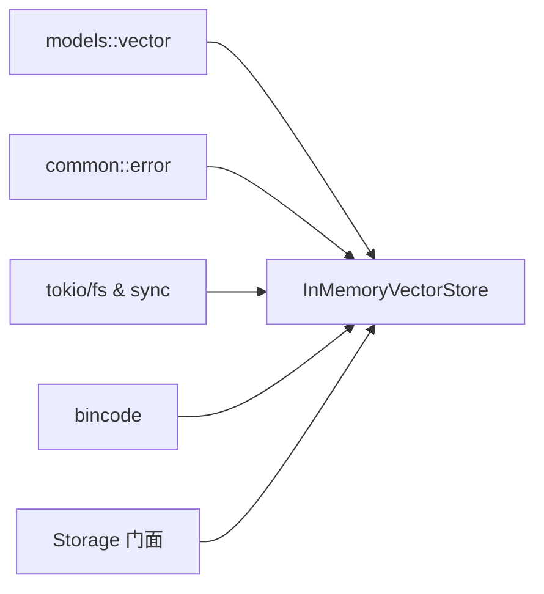

# 内存向量存储后端

<cite>
**本文引用的文件**
- [mem_vector.rs](file://src/pkg/storage/mem_vector.rs)
- [vector.rs](file://src/pkg/storage/vector.rs)
- [mod.rs](file://src/pkg/storage/mod.rs)
- [vector.rs（模型定义）](file://src/models/vector.rs)
- [vector_search_architecture.md](file://docs/vector_search_architecture.md)
- [message_vector_test.rs](file://tests/integration/message_vector_test.rs)
</cite>

## 目录
1. [简介](#简介)
2. [项目结构](#项目结构)
3. [核心组件](#核心组件)
4. [架构总览](#架构总览)
5. [详细组件分析](#详细组件分析)
6. [依赖关系分析](#依赖关系分析)
7. [性能与容量特性](#性能与容量特性)
8. [故障排查指南](#故障排查指南)
9. [结论](#结论)
10. [附录：测试环境使用建议](#附录测试环境使用建议)

## 简介
本技术文档聚焦于内存向量存储后端 InMemoryVectorStore，系统性阐述其实现原理、数据结构、生命周期管理、相似度计算、持久化策略、在测试环境中的优势与局限，以及何时选择内存存储而非其他持久化后端的决策依据。同时给出性能特征与容量限制说明，帮助读者在生产与测试环境中做出合适的选型与配置。

## 项目结构
InMemoryVectorStore 位于通用存储层 pkg/storage 中，作为 VectorStore trait 的一种实现，与其他后端（SqliteVssStore、HnswStore、LanceVectorStore）并列，由 Storage 门面根据配置动态注入。

图表来源
- [mod.rs:36-93](file://src/pkg/storage/mod.rs#L36-L93)
- [vector.rs:18-74](file://src/pkg/storage/vector.rs#L18-L74)

章节来源
- [mod.rs:1-212](file://src/pkg/storage/mod.rs#L1-L212)
- [vector.rs:1-74](file://src/pkg/storage/vector.rs#L1-L74)

## 核心组件
- VectorStore trait：统一抽象了集合初始化、插入/更新、搜索、获取、删除、清空、刷新等能力，所有后端均实现该接口，上层调用零感知。
- InMemoryVectorStore：纯 Rust 内存实现，基于 HashMap + Vec 的集合结构，支持懒加载与异步持久化到磁盘（bincode 序列化）。
- 数据模型：VectorCollection、VectorRow、VectorMeta、VectorIndexParams、VectorSearchHit 等，定义了向量化数据的结构与索引参数。

章节来源
- [vector.rs:18-74](file://src/pkg/storage/vector.rs#L18-L74)
- [mem_vector.rs:18-101](file://src/pkg/storage/mem_vector.rs#L18-L101)
- [vector.rs（模型定义）:9-67](file://src/models/vector.rs#L9-L67)

## 架构总览
Storage 在启动时根据配置选择向量存储后端。当配置为 InMemory 类型时，会创建 InMemoryVectorStore，并指定 base_data_path/vectors 作为持久化目录。所有业务 DAO/DAL 通过统一的 VectorStore 接口进行向量索引操作，屏蔽底层差异。

图表来源
- [mod.rs:56-93](file://src/pkg/storage/mod.rs#L56-L93)
- [mem_vector.rs:27-49](file://src/pkg/storage/mem_vector.rs#L27-L49)

章节来源
- [mod.rs:56-122](file://src/pkg/storage/mod.rs#L56-L122)
- [mem_vector.rs:27-101](file://src/pkg/storage/mem_vector.rs#L27-L101)

## 详细组件分析

### InMemoryVectorStore 数据结构与存储布局
- 集合容器：collections: Arc<RwLock<HashMap<String, VectorCollection>>>，以集合名为键，值为 VectorCollection。
- 集合内部：VectorCollection 包含维度 dimensions 与 entries: Vec<VectorRow>，entries 是线性数组，按插入顺序维护。
- 元数据：VectorMeta 记录 content_hash、embedding_model、indexed_at、expire_at，用于过期过滤与重建判断。
- 持久化：每个集合一个 .bin 文件，路径为 base_path/collection.bin，采用 bincode 标准配置序列化。

复杂度
- upsert/get/delete 对单个条目为 O(1)~O(n)（HashMap 查找 O(1)，但 VectorCollection.entries 为 Vec，定位/遍历为 O(n)）。
- search 为 O(n) 全量扫描，计算余弦距离并排序 top_k。

章节来源
- [mem_vector.rs:18-101](file://src/pkg/storage/mem_vector.rs#L18-L101)
- [vector.rs（模型定义）:9-52](file://src/models/vector.rs#L9-L52)

### 生命周期管理与自动清理
- 懒加载：get_or_load 先查内存缓存，未命中则从磁盘读取并缓存；避免冷启动全量加载。
- 异步持久化：upsert/delete/clear_collection 修改内存后，spawn tokio 任务异步保存集合到磁盘，不阻塞主流程。
- 过期清理：search 时过滤 expire_at > now 的条目，避免返回已过期结果；注意当前未实现后台定时回收，仅查询时过滤。
- 进程退出：由于 collections 为内存结构，进程重启后需重新从磁盘加载；若磁盘文件损坏或丢失，将视为新集合。

潜在风险与建议
- 无后台清理线程：长时间运行且大量过期条目可能增长内存占用，建议在业务层定期 clear_collection 或引入 TTL 清理任务。
- 并发写：RwLock 保护集合字典，entries 修改在写锁内完成；高并发下需注意写放大与 IO 压力。

章节来源
- [mem_vector.rs:56-101](file://src/pkg/storage/mem_vector.rs#L56-L101)
- [mem_vector.rs:138-186](file://src/pkg/storage/mem_vector.rs#L138-L186)
- [mem_vector.rs:188-228](file://src/pkg/storage/mem_vector.rs#L188-L228)
- [mem_vector.rs:236-274](file://src/pkg/storage/mem_vector.rs#L236-L274)

### 向量相似度计算
- 算法：余弦相似度转换为距离，distance = 1 - cos(a,b)。
- 实现：点积 / (||a|| * ||b||)，若任一范数为 0，返回最大距离 1.0。
- 排序：search 对所有条目计算距离后升序排序，取前 top_k。

复杂度
- 单次相似度计算 O(d)，d 为向量维度。
- 搜索整体 O(n*d + n log n)（含排序），top_k 截断不影响最坏复杂度。

优化机会
- 可考虑近似最近邻（如 HNSW）或批量 SIMD 加速，但在小数据集场景收益有限。
- 可缓存归一化向量以减少重复范数计算（需权衡内存与一致性）。

章节来源
- [mem_vector.rs:103-117](file://src/pkg/storage/mem_vector.rs#L103-L117)
- [mem_vector.rs:188-228](file://src/pkg/storage/mem_vector.rs#L188-L228)

### 与 VectorStore trait 的集成
- init_collection：幂等创建集合，优先尝试从磁盘加载已有集合。
- upsert：确保集合存在，新增或更新条目，并异步持久化。
- search：懒加载集合，过滤过期项，计算距离并排序返回 top_k。
- get/delete/clear_collection：基础 CRUD 与清空，均触发异步持久化。
- flush：默认空实现（InMemory 无需额外 flush）。

章节来源
- [vector.rs:18-74](file://src/pkg/storage/vector.rs#L18-L74)
- [mem_vector.rs:119-274](file://src/pkg/storage/mem_vector.rs#L119-L274)

### 类图（代码级）

图表来源
- [vector.rs:18-74](file://src/pkg/storage/vector.rs#L18-L74)
- [mem_vector.rs:18-101](file://src/pkg/storage/mem_vector.rs#L18-L101)
- [vector.rs（模型定义）:9-52](file://src/models/vector.rs#L9-L52)

### 序列图：upsert 流程

图表来源
- [mem_vector.rs:138-186](file://src/pkg/storage/mem_vector.rs#L138-L186)
- [mem_vector.rs:73-80](file://src/pkg/storage/mem_vector.rs#L73-L80)

### 流程图：search 算法

图表来源
- [mem_vector.rs:188-228](file://src/pkg/storage/mem_vector.rs#L188-L228)

## 依赖关系分析
- 模块耦合：InMemoryVectorStore 依赖 models::vector 的数据结构，依赖 common::error 的错误类型，依赖 tokio 异步 IO 与 bincode 序列化。
- 外部依赖：无系统级依赖，纯 Rust 实现，跨平台友好。
- 组合关系：Storage 门面聚合 VectorStore trait，运行时注入具体实现；InMemoryVectorStore 通过 with_path 接受测试或配置的 base_data_path。

图表来源
- [mem_vector.rs:8-16](file://src/pkg/storage/mem_vector.rs#L8-L16)
- [mod.rs:36-93](file://src/pkg/storage/mod.rs#L36-L93)

章节来源
- [mem_vector.rs:8-16](file://src/pkg/storage/mem_vector.rs#L8-L16)
- [mod.rs:36-93](file://src/pkg/storage/mod.rs#L36-L93)

## 性能与容量特性
- 时间复杂度
  - upsert/get/delete：单条操作接近 O(1)~O(n)，取决于 entries 的查找与插入位置。
  - search：O(n*d + n log n)，n 为条目数，d 为向量维度；适合中小规模数据。
- 空间复杂度
  - 内存占用约 O(n*d)，加上元数据开销；大维度或大数据集需谨慎评估。
- 持久化 IO
  - 每次 upsert/delete/clear 触发一次 bincode 序列化与文件写入；高频写入可能造成 IO 抖动。
- 容量限制
  - 受限于进程内存与磁盘空间；无内置上限控制，建议结合业务 TTL 与定期清理。
- 适用场景
  - 开发/测试：零依赖、快速启动、数据隔离友好。
  - 小规模生产：数据量不大、对延迟敏感、无需复杂索引结构的场景。

章节来源
- [mem_vector.rs:103-117](file://src/pkg/storage/mem_vector.rs#L103-L117)
- [mem_vector.rs:188-228](file://src/pkg/storage/mem_vector.rs#L188-L228)
- [vector_search_architecture.md:161-184](file://docs/vector_search_architecture.md#L161-L184)

## 故障排查指南
- 集合未找到
  - 现象：search/get 返回空集合或未命中。
  - 排查：确认 init_collection 是否被调用；检查 base_data_path/vectors 目录下是否存在 .bin 文件；验证 get_or_load 是否成功加载。
- 搜索结果不包含过期条目
  - 现象：search 返回结果少于预期。
  - 排查：检查 VectorMeta.expire_at 是否设置且已过期；确认当前时间与 expire_at 比较逻辑。
- 持久化失败
  - 现象：进程重启后数据丢失或集合为空。
  - 排查：检查异步持久化任务是否执行成功；确认磁盘权限与可用空间；必要时增加 flush 或同步落盘策略。
- 性能退化
  - 现象：search 耗时随数据量线性增长。
  - 排查：评估 n 与 d 的增长情况；考虑切换到 HNSW/LanceDB 等高性能后端；或在业务层实施分片/分页/过滤。

章节来源
- [mem_vector.rs:56-101](file://src/pkg/storage/mem_vector.rs#L56-L101)
- [mem_vector.rs:188-228](file://src/pkg/storage/mem_vector.rs#L188-L228)
- [mem_vector.rs:236-274](file://src/pkg/storage/mem_vector.rs#L236-L274)

## 结论
InMemoryVectorStore 以简洁可靠的纯 Rust 实现提供了开箱即用的内存向量存储能力，特别适合开发与测试环境，以及小规模生产场景。其基于 HashMap+Vec 的结构简单直观，配合懒加载与异步持久化，兼顾易用性与基本可用性。对于大规模数据或高并发场景，建议评估 HNSW/LanceDB 等后端以获得更好的扩展性与性能。

## 附录：测试环境使用建议
- 优势
  - 零系统依赖，跨平台稳定；CI 默认运行无需外部服务。
  - 数据隔离友好：可通过 with_path 指定独立目录，避免测试间干扰。
  - 快速迭代：无需构建复杂索引，便于快速验证业务逻辑。
- 局限性
  - 线性搜索性能有限，不适合海量数据。
  - 无后台清理机制，长期运行需关注内存与过期条目。
  - 持久化为文件形式，频繁写入可能影响 IO 性能。
- 实践建议
  - 在集成测试中使用 with_path 隔离数据；测试结束后清理临时目录。
  - 对需要向量语义搜索的测试，若无 embedding provider，可降级到 FTS5 关键词搜索路径（见集成测试示例）。
  - 合理设置 expire_at，并在业务层定期清理或重建集合，避免内存膨胀。

章节来源
- [message_vector_test.rs:113-162](file://tests/integration/message_vector_test.rs#L113-L162)
- [vector_search_architecture.md:144-158](file://docs/vector_search_architecture.md#L144-L158)