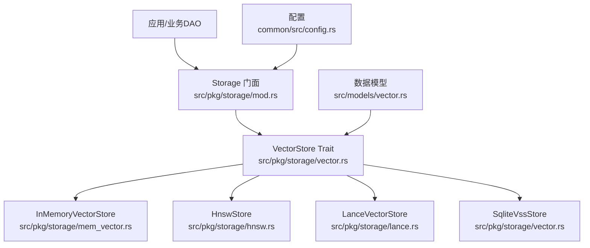
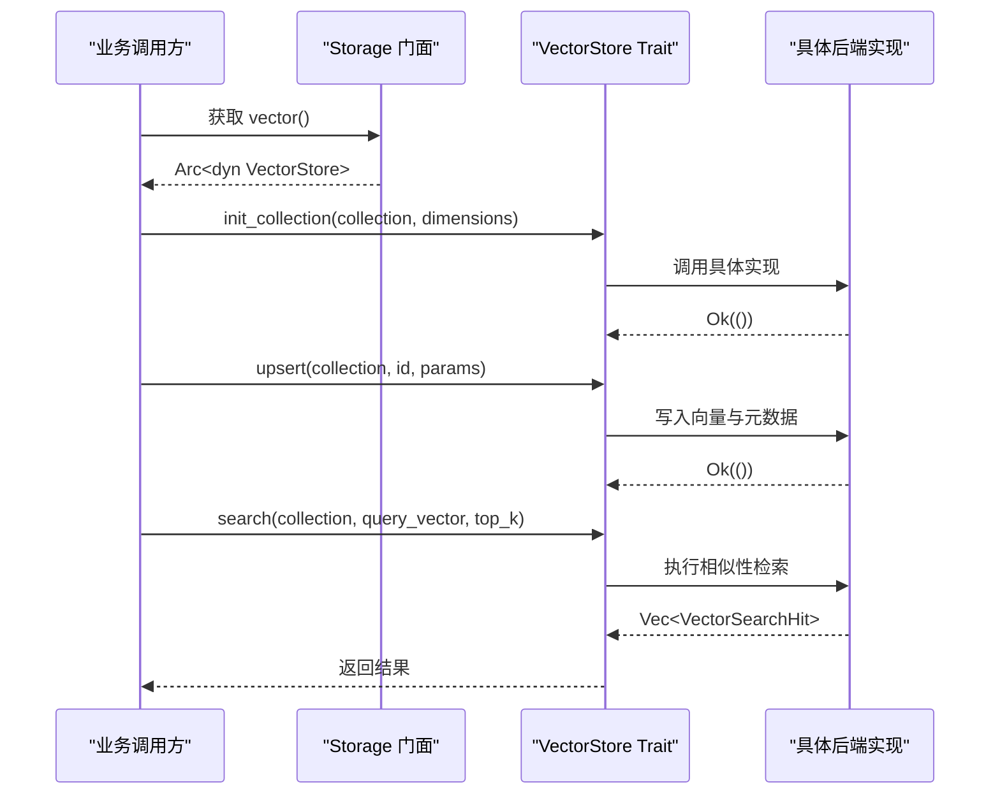
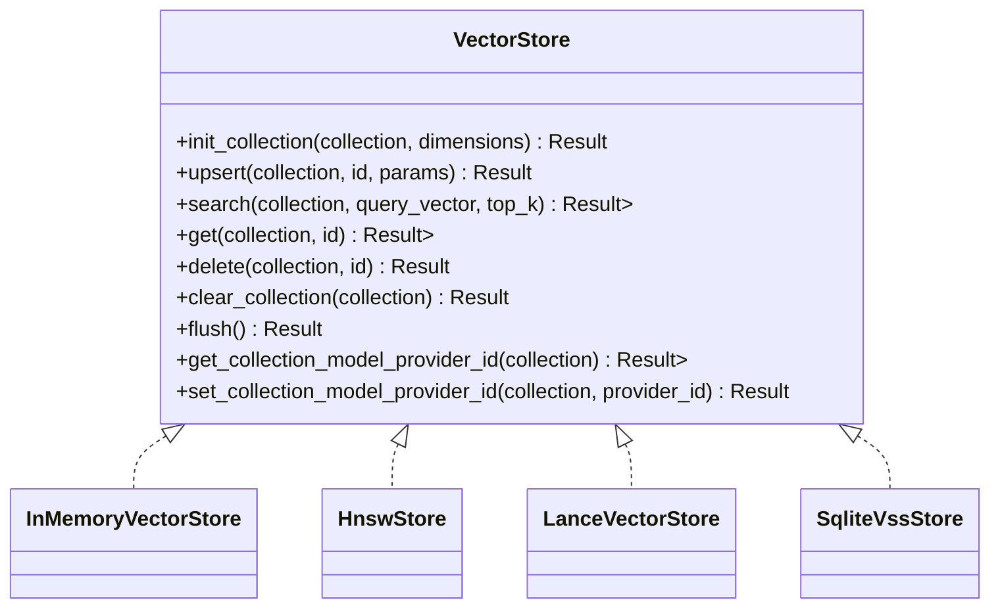
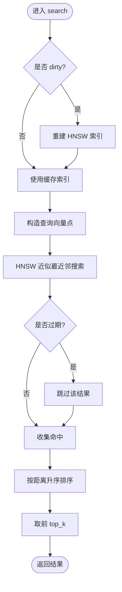
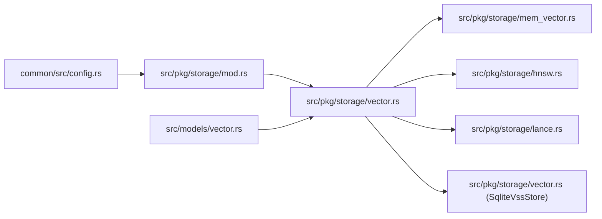

# 向量存储

<cite>
**本文引用的文件**
- [src/pkg/storage/mod.rs](file://src/pkg/storage/mod.rs)
- [src/pkg/storage/vector.rs](file://src/pkg/storage/vector.rs)
- [src/pkg/storage/mem_vector.rs](file://src/pkg/storage/mem_vector.rs)
- [src/pkg/storage/hnsw.rs](file://src/pkg/storage/hnsw.rs)
- [src/pkg/storage/lance.rs](file://src/pkg/storage/lance.rs)
- [src/models/vector.rs](file://src/models/vector.rs)
- [common/src/config.rs](file://common/src/config.rs)
</cite>

## 目录
1. [简介](#简介)
2. [项目结构](#项目结构)
3. [核心组件](#核心组件)
4. [架构总览](#架构总览)
5. [详细组件分析](#详细组件分析)
6. [依赖关系分析](#依赖关系分析)
7. [性能与优化](#性能与优化)
8. [故障排查指南](#故障排查指南)
9. [结论](#结论)
10. [附录：配置与选型指南](#附录：配置与选型指南)

## 简介
本技术文档围绕 AI Orz 的向量存储子系统，系统性阐述向量存储抽象接口 VectorStore trait 的设计与实现，并深入解析四种后端实现：InMemoryVectorStore（纯 Rust 内存）、HnswStore（HNSW 近似最近邻索引）、LanceVectorStore（LanceDB 集成）和 SqliteVssStore（SQLite VSS 扩展）。文档覆盖向量数据的插入、查询、更新、删除操作；说明维度配置、相似度计算、索引构建策略与性能优化技巧；并提供不同后端的选型建议与配置示例。

## 项目结构
向量存储子系统位于 src/pkg/storage 下，采用“统一抽象 + 多后端”的分层设计：
- 抽象层：vector.rs 定义 VectorStore trait 及通用数据结构
- 后端实现：mem_vector.rs、hnsw.rs、lance.rs、vector.rs（SqliteVssStore）
- 门面与装配：mod.rs 提供 Storage 门面，按配置选择具体后端
- 数据模型：models/vector.rs 定义统一的向量行、元数据、搜索命中等结构
- 配置：common/src/config.rs 定义 VectorStoreType 枚举与数据库相关配置

图表来源
- [src/pkg/storage/mod.rs:36-148](file://src/pkg/storage/mod.rs#L36-L148)
- [src/pkg/storage/vector.rs:18-74](file://src/pkg/storage/vector.rs#L18-L74)
- [src/pkg/storage/mem_vector.rs:18-25](file://src/pkg/storage/mem_vector.rs#L18-L25)
- [src/pkg/storage/hnsw.rs:149-166](file://src/pkg/storage/hnsw.rs#L149-L166)
- [src/pkg/storage/lance.rs:26-33](file://src/pkg/storage/lance.rs#L26-L33)
- [src/models/vector.rs:9-67](file://src/models/vector.rs#L9-L67)
- [common/src/config.rs:78-114](file://common/src/config.rs#L78-L114)

章节来源
- [src/pkg/storage/mod.rs:36-148](file://src/pkg/storage/mod.rs#L36-L148)
- [common/src/config.rs:78-114](file://common/src/config.rs#L78-L114)

## 核心组件
- VectorStore trait：定义集合初始化、upsert、search、get、delete、clear_collection、flush、集合级 model_provider_id 读写等统一接口
- 数据模型：VectorRow、VectorMeta、VectorSearchHit、VectorIndexParams、VectorCollection、SearchMatchInfo、MatchType、Vectorizable trait
- Storage 门面：根据配置创建对应后端实例，暴露 sqlite()、vector()、stats() 等方法
- 配置：DatabaseConfig 包含 vector_store_type、hnsw_index_dir、vector_db_file_name 等；VectorStoreType 枚举支持 LanceDb、InMemory、Hnsw、SqliteVss

章节来源
- [src/pkg/storage/vector.rs:18-74](file://src/pkg/storage/vector.rs#L18-L74)
- [src/models/vector.rs:9-67](file://src/models/vector.rs#L9-L67)
- [src/pkg/storage/mod.rs:36-148](file://src/pkg/storage/mod.rs#L36-L148)
- [common/src/config.rs:78-114](file://common/src/config.rs#L78-L114)

## 架构总览
系统通过 Storage 门面在启动时依据配置选择向量后端，并在运行期以统一接口对外提供服务。业务 DAO 仅依赖 VectorStore trait，不感知具体后端实现，从而实现可插拔切换与测试隔离。

图表来源
- [src/pkg/storage/mod.rs:78-93](file://src/pkg/storage/mod.rs#L78-L93)
- [src/pkg/storage/vector.rs:18-74](file://src/pkg/storage/vector.rs#L18-L74)

章节来源
- [src/pkg/storage/mod.rs:78-93](file://src/pkg/storage/mod.rs#L78-L93)

## 详细组件分析

### VectorStore 抽象与数据模型
- 抽象接口
  - init_collection：按集合名与维度初始化存储
  - upsert：插入或更新向量及其元数据
  - search：语义搜索，返回命中列表与距离
  - get/delete/clear_collection：基础 CRUD
  - flush：持久化刷新（HnswStore 有实际落盘逻辑）
  - get/set_collection_model_provider_id：集合级模型提供者标识管理，用于重建索引判断
- 数据模型
  - VectorMeta：内容哈希、嵌入模型、索引时间、过期时间
  - VectorRow：业务 ID、向量、元数据
  - VectorSearchHit：完整行 + 相似度距离
  - VectorIndexParams：向量、内容哈希、模型提供者 ID、嵌入模型、过期时间
  - Vectorizable：实体向量化能力抽象（vectorize_text、vector_collection、needs_reindex 等）

章节来源
- [src/pkg/storage/vector.rs:18-74](file://src/pkg/storage/vector.rs#L18-L74)
- [src/models/vector.rs:9-67](file://src/models/vector.rs#L9-L67)

#### 类图（代码级）

图表来源
- [src/pkg/storage/vector.rs:18-74](file://src/pkg/storage/vector.rs#L18-L74)
- [src/pkg/storage/mem_vector.rs:18-25](file://src/pkg/storage/mem_vector.rs#L18-L25)
- [src/pkg/storage/hnsw.rs:149-166](file://src/pkg/storage/hnsw.rs#L149-L166)
- [src/pkg/storage/lance.rs:26-33](file://src/pkg/storage/lance.rs#L26-L33)
- [src/pkg/storage/vector.rs:76-81](file://src/pkg/storage/vector.rs#L76-L81)

### InMemoryVectorStore（纯 Rust 内存实现）
- 原理
  - 基于 HashMap 维护集合条目，使用 bincode 序列化到 .bin 文件进行懒加载持久化
  - 相似度计算采用余弦距离（1 - cosine_similarity），越小越相似
  - 异步持久化：upsert/delete/clear_collection 修改后后台任务写盘
- 关键流程
  - init_collection：若不存在则从磁盘加载或新建集合
  - upsert：新增或更新条目，标记脏并异步落盘
  - search：过滤过期项，计算所有向量距离，排序取 top_k
  - delete/clear：移除条目并异步落盘
- 复杂度
  - 搜索 O(N)，适合中小规模或测试场景
- 适用场景
  - 零系统依赖、跨平台、快速原型与单元测试

章节来源
- [src/pkg/storage/mem_vector.rs:18-25](file://src/pkg/storage/mem_vector.rs#L18-L25)
- [src/pkg/storage/mem_vector.rs:103-117](file://src/pkg/storage/mem_vector.rs#L103-L117)
- [src/pkg/storage/mem_vector.rs:121-186](file://src/pkg/storage/mem_vector.rs#L121-L186)
- [src/pkg/storage/mem_vector.rs:188-228](file://src/pkg/storage/mem_vector.rs#L188-L228)
- [src/pkg/storage/mem_vector.rs:236-274](file://src/pkg/storage/mem_vector.rs#L236-L274)

### HnswStore（HNSW 高性能近似最近邻索引）
- 原理
  - 基于 instant-distance 库构建 HNSW 索引，每个集合独立索引
  - 增量写入标记 dirty，搜索时按需重建索引；后台 60s 定时落盘，Drop 兜底同步
  - 持久化：每个集合 .bincode 文件 + collections_meta.bincode 元数据
- 关键流程
  - init_collection：确保集合存在
  - upsert：写入向量与行数据，更新集合元数据（model_provider_id、dimensions、updated_at）
  - search：dirty 时重建索引，使用 HNSW 搜索并按距离排序
  - delete：标记删除，dirty=true
  - clear_collection：重置集合
  - flush：批量落盘 dirty 集合与元数据
- 复杂度
  - 构建 O(N log N) 级别，搜索近似 O(log N) 级别（取决于参数）
- 适用场景
  - 大规模向量检索、生产环境、需要持久化与高吞吐

章节来源
- [src/pkg/storage/hnsw.rs:20-34](file://src/pkg/storage/hnsw.rs#L20-L34)
- [src/pkg/storage/hnsw.rs:36-62](file://src/pkg/storage/hnsw.rs#L36-L62)
- [src/pkg/storage/hnsw.rs:96-125](file://src/pkg/storage/hnsw.rs#L96-L125)
- [src/pkg/storage/hnsw.rs:149-166](file://src/pkg/storage/hnsw.rs#L149-L166)
- [src/pkg/storage/hnsw.rs:189-219](file://src/pkg/storage/hnsw.rs#L189-L219)
- [src/pkg/storage/hnsw.rs:344-388](file://src/pkg/storage/hnsw.rs#L344-L388)
- [src/pkg/storage/hnsw.rs:432-491](file://src/pkg/storage/hnsw.rs#L432-L491)
- [src/pkg/storage/hnsw.rs:493-543](file://src/pkg/storage/hnsw.rs#L493-L543)
- [src/pkg/storage/hnsw.rs:556-616](file://src/pkg/storage/hnsw.rs#L556-L616)

#### 流程图（HNSW 搜索）

图表来源
- [src/pkg/storage/hnsw.rs:493-543](file://src/pkg/storage/hnsw.rs#L493-L543)

### LanceVectorStore（LanceDB 集成）
- 原理
  - 基于 LanceDB 嵌入式向量数据库，使用 Arrow RecordBatch 存储向量与元数据
  - 表 schema 固定：id、vector（FixedSizeList<Float32, D>）、content_hash、embedding_model、indexed_at、expire_at
  - 搜索使用 vector_search API，结果流式收集
- 关键流程
  - init_collection：懒加载创建表（如不存在）
  - upsert：先删除旧记录，再追加新批次
  - search：vector_search + limit(top_k)
  - get：按 id 查询单条
  - delete/clear：条件删除或清空
- 复杂度
  - 内置 HNSW 索引，搜索高效；批处理写入提升吞吐
- 适用场景
  - 生产级向量数据库、跨平台、无需额外系统依赖

章节来源
- [src/pkg/storage/lance.rs:26-33](file://src/pkg/storage/lance.rs#L26-L33)
- [src/pkg/storage/lance.rs:43-62](file://src/pkg/storage/lance.rs#L43-L62)
- [src/pkg/storage/lance.rs:64-123](file://src/pkg/storage/lance.rs#L64-L123)
- [src/pkg/storage/lance.rs:126-199](file://src/pkg/storage/lance.rs#L126-L199)
- [src/pkg/storage/lance.rs:201-282](file://src/pkg/storage/lance.rs#L201-L282)
- [src/pkg/storage/lance.rs:284-363](file://src/pkg/storage/lance.rs#L284-L363)

### SqliteVssStore（SQLite VSS 扩展）
- 原理
  - 使用 SQLite vss0 扩展创建虚拟表 vss_{collection}，存储 embedding JSON
  - 元数据存储在 vector_metadata 表（source_id、content_hash、model、dimensions、expire_at）
  - 搜索通过 MATCH json(?) 匹配向量，JOIN 元数据表返回结果
- 关键流程
  - init_collection：CREATE VIRTUAL TABLE ... USING vss0(embedding(D))
  - upsert：INSERT OR REPLACE 元数据表，再 INSERT OR REPLACE vss_{}(rowid, embedding)
  - search：MATCH 向量并 JOIN 元数据，过滤过期项，ORDER BY distance LIMIT top_k
  - get/delete/clear：基于 rowid 与 source_id 操作
- 注意
  - 搜索结果中 vector 字段为空（vss 不返回原始向量），业务侧需按 source_id 重新获取或重向量化
- 适用场景
  - 已有 SQLite 生态、具备 vss0 扩展环境

章节来源
- [src/pkg/storage/vector.rs:76-81](file://src/pkg/storage/vector.rs#L76-L81)
- [src/pkg/storage/vector.rs:83-124](file://src/pkg/storage/vector.rs#L83-L124)
- [src/pkg/storage/vector.rs:126-173](file://src/pkg/storage/vector.rs#L126-L173)
- [src/pkg/storage/vector.rs:175-234](file://src/pkg/storage/vector.rs#L175-L234)
- [src/pkg/storage/vector.rs:237-290](file://src/pkg/storage/vector.rs#L237-L290)

## 依赖关系分析
- Storage 门面依赖 common::config::DatabaseConfig 决定后端类型
- 各后端均依赖 models/vector.rs 的统一数据结构
- HnswStore 依赖 instant-distance 库；LanceVectorStore 依赖 lancedb、arrow；SqliteVssStore 依赖 sqlx + vss0 扩展；InMemoryVectorStore 无外部系统依赖
- 业务 DAO 通过 RequestContext.vector_store() 访问统一接口，避免耦合

图表来源
- [common/src/config.rs:78-114](file://common/src/config.rs#L78-L114)
- [src/pkg/storage/mod.rs:78-93](file://src/pkg/storage/mod.rs#L78-L93)
- [src/pkg/storage/vector.rs:18-74](file://src/pkg/storage/vector.rs#L18-L74)

章节来源
- [src/pkg/storage/mod.rs:78-93](file://src/pkg/storage/mod.rs#L78-L93)
- [common/src/config.rs:78-114](file://common/src/config.rs#L78-L114)

## 性能与优化
- 相似度计算
  - InMemoryVectorStore 与 HnswStore 均采用余弦距离（1 - cosine_similarity）
  - SqliteVssStore 由 vss0 扩展计算距离
  - LanceVectorStore 由底层引擎计算距离
- 索引构建策略
  - HnswStore：增量写入标记 dirty，搜索时按需重建；后台 60s 落盘；Drop 兜底
  - LanceVectorStore：批处理写入，表级索引自动维护
  - SqliteVssStore：虚拟表索引由 vss0 维护
  - InMemoryVectorStore：线性扫描，适合小规模
- 性能优化建议
  - 大规模数据优先选择 HnswStore 或 LanceVectorStore
  - 合理设置 top_k 与距离阈值，减少不必要的数据传输与排序
  - 使用 Vectorizable 的 needs_reindex 与 content_hash 避免重复索引
  - 对过期向量设置 expire_at，搜索时过滤减少无效结果
  - 使用 set_collection_model_provider_id 跟踪模型版本，便于切换后重建索引

章节来源
- [src/pkg/storage/mem_vector.rs:103-117](file://src/pkg/storage/mem_vector.rs#L103-L117)
- [src/pkg/storage/hnsw.rs:107-125](file://src/pkg/storage/hnsw.rs#L107-L125)
- [src/pkg/storage/hnsw.rs:344-388](file://src/pkg/storage/hnsw.rs#L344-L388)
- [src/pkg/storage/vector.rs:126-173](file://src/pkg/storage/vector.rs#L126-L173)
- [src/pkg/storage/lance.rs:201-282](file://src/pkg/storage/lance.rs#L201-L282)

## 故障排查指南
- 后端不可用
  - SqliteVssStore：检查 vss0 扩展是否成功加载；连接 URL 是否正确
  - LanceVectorStore：检查 base_path 是否存在且可写；表创建是否成功
  - HnswStore：检查 hnsw_index_dir 权限；collections_meta.bincode 是否损坏
- 搜索结果为空
  - 确认集合已初始化且存在数据；检查 expire_at 是否导致过滤
  - 对于 SqliteVssStore，注意搜索结果不包含原始向量，需业务侧补充
- 索引不一致
  - 使用 get_collection_model_provider_id 检查集合当前模型提供者
  - 切换模型后调用 set_collection_model_provider_id 并重建索引
- 持久化失败
  - HnswStore：关注后台 flush 日志；Drop 兜底可能未完全落盘时需手动 flush
  - InMemoryVectorStore：异步持久化失败不影响主流程，但可能导致重启后数据丢失

章节来源
- [src/pkg/storage/vector.rs:237-290](file://src/pkg/storage/vector.rs#L237-L290)
- [src/pkg/storage/hnsw.rs:344-388](file://src/pkg/storage/hnsw.rs#L344-L388)
- [src/pkg/storage/hnsw.rs:403-429](file://src/pkg/storage/hnsw.rs#L403-L429)
- [src/pkg/storage/lance.rs:43-62](file://src/pkg/storage/lance.rs#L43-L62)

## 结论
AI Orz 向量存储子系统通过统一的 VectorStore trait 屏蔽了多种后端差异，提供了可扩展、可替换的向量检索能力。InMemoryVectorStore 适合开发与测试；HnswStore 与 LanceVectorStore 面向生产环境的高性能需求；SqliteVssStore 适用于已有 SQLite 生态的场景。结合配置与模型提供者管理，可实现平滑的索引重建与降级策略。

## 附录：配置与选型指南
- 配置项
  - DatabaseConfig.vector_store_type：选择后端类型（LanceDb、InMemory、Hnsw、SqliteVss）
  - DatabaseConfig.hnsw_index_dir：HNSW 后端索引目录
  - DatabaseConfig.vector_db_file_name：SQLite VSS 后端向量数据库文件名
- 选型建议
  - 默认推荐：LanceVectorStore（生产级、零系统依赖、内置索引）
  - 开发/测试：InMemoryVectorStore（零依赖、快速迭代）
  - 高性能本地：HnswStore（纯 Rust、持久化、按需重建）
  - 已有 SQLite：SqliteVssStore（利用 vss0 扩展）
- 配置示例（ai_orz.toml）
  - 在 [database] 段设置 vector_store_type、hnsw_index_dir、vector_db_file_name
  - 环境变量可覆盖默认值

章节来源
- [common/src/config.rs:78-114](file://common/src/config.rs#L78-L114)
- [common/src/config.rs:178-203](file://common/src/config.rs#L178-L203)
- [src/pkg/storage/mod.rs:78-93](file://src/pkg/storage/mod.rs#L78-L93)