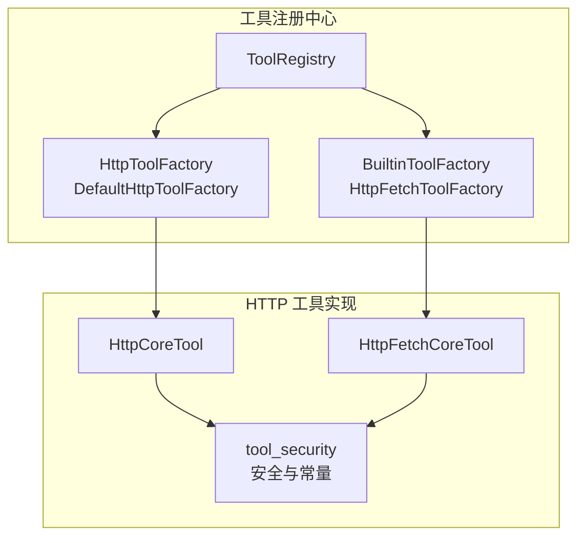
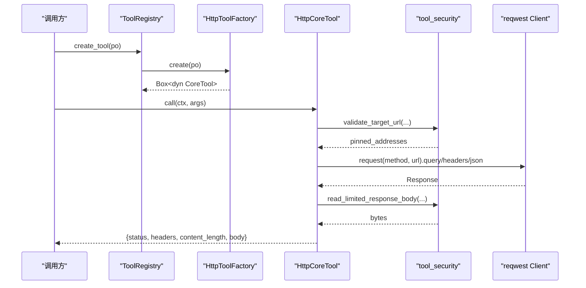
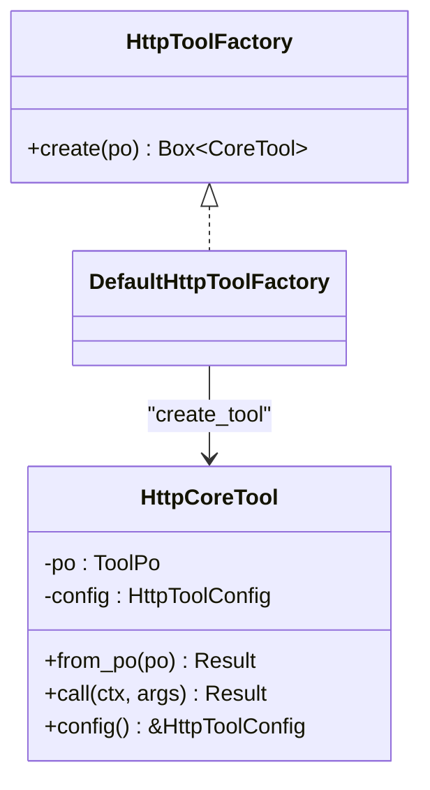
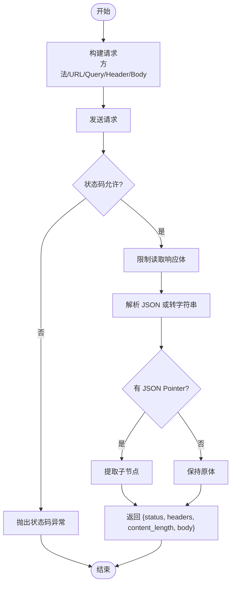
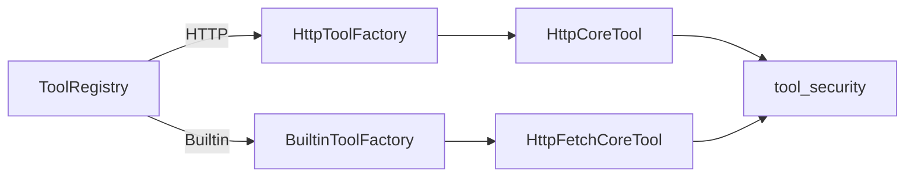

# HTTP 工具

<cite>
**本文引用的文件**
- [http.rs](file://src/pkg/tool_registry/http.rs)
- [http_fetch.rs](file://src/pkg/tool_registry/http_fetch.rs)
- [tool_security.rs](file://src/pkg/tool_registry/tool_security.rs)
- [mod.rs](file://src/pkg/tool_registry/mod.rs)
- [http_tests.rs](file://src/pkg/tool_registry/http_tests.rs)
- [response_test.rs](file://src/handlers/finance/tool/response_test.rs)
</cite>

## 目录
1. [简介](#简介)
2. [项目结构](#项目结构)
3. [核心组件](#核心组件)
4. [架构总览](#架构总览)
5. [详细组件分析](#详细组件分析)
6. [依赖关系分析](#依赖关系分析)
7. [性能与可靠性](#性能与可靠性)
8. [故障排查指南](#故障排查指南)
9. [结论](#结论)
10. [附录：配置与使用示例](#附录配置与使用示例)

## 简介
本技术文档围绕 HTTP 工具系统展开，重点说明 HttpToolFactory 接口设计、HTTP 请求构建器、响应处理机制；并深入解释 URL 模板解析、参数绑定、请求头设置、认证处理、超时控制、错误处理与安全限制。该子系统位于 pkg/tool_registry 层，属于通用基础设施工具，无业务感知，遵循“Adapter → Domain → DAL → DAO”的单向调用原则。

## 项目结构
HTTP 工具相关代码集中在以下模块：
- 协议级工厂与可执行工具：src/pkg/tool_registry/http.rs
- 内置 HTTP Fetch 工具：src/pkg/tool_registry/http_fetch.rs
- 安全与通用能力（SSRF、大小限制、默认常量等）：src/pkg/tool_registry/tool_security.rs
- 全局工具注册表与分发：src/pkg/tool_registry/mod.rs
- 测试与行为验证：src/pkg/tool_registry/http_tests.rs、src/handlers/finance/tool/response_test.rs

图表来源
- [mod.rs:29-101](file://src/pkg/tool_registry/mod.rs#L29-L101)
- [http.rs:23-39](file://src/pkg/tool_registry/http.rs#L23-L39)
- [http_fetch.rs:19-52](file://src/pkg/tool_registry/http_fetch.rs#L19-L52)
- [tool_security.rs:8-15](file://src/pkg/tool_registry/tool_security.rs#L8-L15)

章节来源
- [mod.rs:1-132](file://src/pkg/tool_registry/mod.rs#L1-L132)
- [http.rs:1-114](file://src/pkg/tool_registry/http.rs#L1-L114)
- [http_fetch.rs:1-52](file://src/pkg/tool_registry/http_fetch.rs#L1-L52)
- [tool_security.rs:1-16](file://src/pkg/tool_registry/tool_security.rs#L1-L16)

## 核心组件
- HttpToolFactory 接口：定义协议级工厂方法 create(po)，将数据库中的 ToolPo 转换为可执行的 CoreTool 实例。
- DefaultHttpToolFactory：默认实现，委托给 create_tool(po) 构造 HttpCoreTool。
- HttpCoreTool：从 ToolPo.config 反序列化为 HttpToolConfig，并在 call(ctx, args) 中完成参数校验、URL 模板渲染、目标地址安全校验、请求构建与发送、响应读取与过滤、JSON Pointer 提取等。
- HttpFetchCoreTool：内置通用 fetch 工具，固定 GET + HTTPS，严格拒绝本地网络与 HTTP，适合拉取公开资源。
- tool_security：提供默认/硬上限常量、域名白黑名单匹配、本地网络判定、DNS 解析与 IP 校验、响应体大小限制、敏感头脱敏等。

章节来源
- [http.rs:23-114](file://src/pkg/tool_registry/http.rs#L23-L114)
- [http_fetch.rs:19-143](file://src/pkg/tool_registry/http_fetch.rs#L19-L143)
- [tool_security.rs:8-15](file://src/pkg/tool_registry/tool_security.rs#L8-L15)

## 架构总览
HTTP 工具在运行时由 ToolRegistry 根据 ToolPo.protocol 分发到对应工厂：
- HTTP 协议：通过 HttpToolFactory 创建 HttpCoreTool
- 内置工具：通过 BuiltinToolFactory 创建如 HttpFetchCoreTool

请求执行流程：
1. 参数校验：基于 parameters_schema 校验必填项、类型、枚举、是否允许额外属性。
2. URL 模板渲染：仅支持 {{args.key}} 占位符，且 scheme 与 authority 必须固定，禁止 userinfo。
3. 目标安全校验：域名白/黑名单、本地网络访问需显式开启、DNS 解析后 IP 再次校验。
4. 构建请求：禁用重定向、关闭代理、按 host 进行 DNS pinning、设置超时、追加 query/header/body。
5. 发送与响应：限制响应体大小、脱敏响应头、可选 JSON Pointer 提取子集。
6. 返回统一结果：status、headers、content_length、body。

图表来源
- [mod.rs:81-101](file://src/pkg/tool_registry/mod.rs#L81-L101)
- [http.rs:126-220](file://src/pkg/tool_registry/http.rs#L126-L220)
- [tool_security.rs:92-139](file://src/pkg/tool_registry/tool_security.rs#L92-L139)

## 详细组件分析

### HttpToolFactory 与 HttpCoreTool
- 职责边界
  - HttpToolFactory：协议级工厂，解耦依赖注入，便于测试替换。
  - HttpCoreTool：封装一次完整 HTTP 调用的生命周期，包括参数校验、模板渲染、安全校验、网络 I/O、响应处理。
- 关键数据流
  - ToolPo.config → HttpToolConfig（method/url/headers/query/body/timeout_ms/response_max_bytes/allowed_status_codes/response_json_pointer/allowed_domains/blocked_domains/allow_local_network）
  - 参数 schema → 校验必填/类型/枚举/额外属性
  - URL 模板 → 仅支持 {{args.key}}，scheme/authority 固定，禁止 userinfo
  - 目标校验 → 域名白/黑名单、本地网络策略、DNS 解析后 IP 校验
  - 请求构建 → 禁用重定向、关闭代理、DNS pinning、超时、query/header/body
  - 响应处理 → 限制大小、脱敏头、JSON Pointer 提取
- 复杂度与性能
  - 模板渲染为线性扫描，时间复杂度 O(n)
  - DNS 解析与连接建立受网络影响，整体耗时取决于远端服务
  - 响应体读取采用分块累加，内存占用受 response_max_bytes 限制

图表来源
- [http.rs:23-39](file://src/pkg/tool_registry/http.rs#L23-L39)
- [http.rs:75-114](file://src/pkg/tool_registry/http.rs#L75-L114)

章节来源
- [http.rs:23-114](file://src/pkg/tool_registry/http.rs#L23-L114)

### HTTP 请求构建器与响应处理器
- 请求构建
  - 方法：仅支持 GET/POST
  - URL：模板渲染后解析为 Url，禁止重定向
  - Query/Header：对象模板渲染为标量键值对，HeaderName/HeaderValue 严格校验
  - Body：POST 时以 JSON 序列化渲染后的 body
- 响应处理
  - 状态码：默认允许 200/201/202/204，可通过 allowed_status_codes 覆盖
  - 响应头：脱敏敏感头（Authorization/Cookie/Set-Cookie/含 token/api-key/secret/password 等）
  - 响应体：限制最大字节数，尝试 JSON 解析，失败回退为字符串
  - JSON Pointer：可选提取子节点

图表来源
- [http.rs:126-220](file://src/pkg/tool_registry/http.rs#L126-L220)

章节来源
- [http.rs:126-220](file://src/pkg/tool_registry/http.rs#L126-L220)

### URL 模板解析与参数绑定
- 模板语法：仅支持 {{args.key}}，不支持任意表达式
- 约束
  - URL 的 scheme 与 authority 必须固定，不允许包含占位符
  - 禁止在 URL 中包含 userinfo（@）
  - 未解析的占位符会报错，防止泄露或误用
- 参数绑定
  - 基于 parameters_schema 校验必填字段、类型、枚举、是否允许额外属性
  - 模板渲染时将 args 中的标量值替换到 URL/Query/Header/Body

章节来源
- [http.rs:230-367](file://src/pkg/tool_registry/http.rs#L230-L367)
- [tool_security.rs:233-312](file://src/pkg/tool_registry/tool_security.rs#L233-L312)

### 认证处理与安全限制
- 认证方式
  - 通过 headers 模板注入 Authorization、API Key、Token 等
  - 支持在 query/body 中传递鉴权参数（需谨慎）
- SSRF 防护
  - 域名白名单/黑名单：allowed_domains/blocked_domains
  - 本地网络访问：默认拒绝，需 allow_local_network=true 显式开启
  - DNS 解析后 IP 校验：确保解析结果不在本地网段
- 其他安全
  - 禁用重定向与代理，避免被恶意跳转或绕过策略
  - 响应头脱敏，避免泄露敏感信息
  - 错误消息不暴露渲染后的 URL 或敏感参数

章节来源
- [http.rs:136-157](file://src/pkg/tool_registry/http.rs#L136-L157)
- [tool_security.rs:17-169](file://src/pkg/tool_registry/tool_security.rs#L17-L169)
- [http_tests.rs:910-958](file://src/pkg/tool_registry/http_tests.rs#L910-L958)

### 超时控制与重试机制
- 超时控制
  - 默认超时：DEFAULT_TIMEOUT_MS
  - 单工具覆盖：timeout_ms
  - 硬上限：HARD_TIMEOUT_MS，超出即拒绝
- 重试机制
  - 当前实现未内置重试逻辑；如需重试应在上层调用方实现（例如在 Domain/Service 层包装）

章节来源
- [tool_security.rs:8-15](file://src/pkg/tool_registry/tool_security.rs#L8-L15)
- [http.rs:561-573](file://src/pkg/tool_registry/http.rs#L561-L573)

### 错误处理
- 参数错误：未知参数、类型不符、枚举非法、必填缺失
- 模板错误：未解析占位符、非法占位符格式、header/value 非法
- 网络错误：请求失败、DNS 解析失败、响应过大
- 状态码错误：非允许的状态码
- 脱敏：错误消息不包含渲染后的 URL 或敏感参数

章节来源
- [http.rs:230-367](file://src/pkg/tool_registry/http.rs#L230-L367)
- [http.rs:180-220](file://src/pkg/tool_registry/http.rs#L180-L220)
- [http_tests.rs:657-708](file://src/pkg/tool_registry/http_tests.rs#L657-L708)

## 依赖关系分析
- ToolRegistry 作为入口，依据 ToolPo.protocol 分发到不同工厂
- HttpToolFactory 负责 HTTP 工具的创建，内部依赖 tool_security 的安全能力
- HttpFetchCoreTool 作为内置工具，同样依赖 tool_security 进行安全校验

图表来源
- [mod.rs:81-101](file://src/pkg/tool_registry/mod.rs#L81-L101)
- [http.rs:23-39](file://src/pkg/tool_registry/http.rs#L23-L39)
- [http_fetch.rs:19-52](file://src/pkg/tool_registry/http_fetch.rs#L19-L52)

章节来源
- [mod.rs:1-132](file://src/pkg/tool_registry/mod.rs#L1-L132)

## 性能与可靠性
- 性能
  - 模板渲染与参数校验为轻量 CPU 操作
  - 网络 I/O 为主要瓶颈，建议合理设置 timeout_ms 与 response_max_bytes
  - DNS pinning 减少中间劫持风险，可能增加首次解析开销
- 可靠性
  - 禁用重定向与代理，降低不可控跳转风险
  - 响应体大小限制防止内存耗尽
  - 严格的状态码白名单提升健壮性

[本节为通用指导，无需特定文件引用]

## 故障排查指南
- 常见错误与定位
  - “invalid http tool config”：检查 method/url/headers/query/body 是否符合规范
  - “unsupported http method”：仅支持 GET/POST
  - “unresolved or unsupported http template placeholder”：检查占位符是否为 {{args.key}}
  - “blocked http domain / http domain is not allowed”：调整 allowed_domains/blocked_domains
  - “local network http target requires allow_local_network=true”：确认是否需要访问本地网络
  - “http response too large”：增大 response_max_bytes 或优化服务端响应
  - “unexpected http status code”：调整 allowed_status_codes 或检查服务端状态
- 日志与脱敏
  - 错误消息已脱敏，不会暴露渲染后的 URL 或敏感参数
  - 管理接口返回的工具详情会对敏感配置进行脱敏展示

章节来源
- [http_tests.rs:657-708](file://src/pkg/tool_registry/http_tests.rs#L657-L708)
- [http_tests.rs:868-908](file://src/pkg/tool_registry/http_tests.rs#L868-L908)
- [http_tests.rs:910-958](file://src/pkg/tool_registry/http_tests.rs#L910-L958)
- [response_test.rs:22-49](file://src/handlers/finance/tool/response_test.rs#L22-L49)

## 结论
HTTP 工具系统通过 HttpToolFactory 与 HttpCoreTool 实现了配置驱动的 HTTP 调用能力，具备严格的 URL 模板解析、参数绑定、请求头设置、认证注入、超时控制、响应限制与安全策略。其设计强调安全优先（SSRF 防护、本地网络默认拒绝、重定向与代理禁用），并通过 tool_security 提供统一的常量与校验能力。建议在业务层按需实现重试与监控，结合 allowed_status_codes 与 response_json_pointer 提高鲁棒性与可用性。

[本节为总结，无需特定文件引用]

## 附录：配置与使用示例
以下为典型场景的配置要点与用法说明（以配置字段与行为为主，不直接粘贴代码）：

- GET 请求
  - method: "GET"
  - url: 固定域名与路径，可使用 {{args.xxx}} 占位符
  - query: 对象模板，键为查询名，值为 "{{args.xxx}}"
  - headers: 可注入 Accept、Authorization 等
  - allowed_status_codes: 默认包含 200/201/202/204，可按需调整
  - response_json_pointer: 可选，用于提取 JSON 子节点
  - 参考路径
    - [http.rs:126-220](file://src/pkg/tool_registry/http.rs#L126-L220)
    - [http_tests.rs:759-806](file://src/pkg/tool_registry/http_tests.rs#L759-L806)

- POST 请求
  - method: "POST"
  - body: 对象或数组模板，键名不得包含占位符，值可为 "{{args.xxx}}"
  - headers: 通常设置 Content-Type: application/json
  - 参考路径
    - [http.rs:174-178](file://src/pkg/tool_registry/http.rs#L174-L178)

- 文件上传
  - 当前 HTTP 工具以 JSON 序列化 body，不适合 multipart/form-data 上传
  - 如需上传二进制或多部分表单，建议使用专用工具或服务端 SDK
  - 参考路径
    - [http.rs:174-178](file://src/pkg/tool_registry/http.rs#L174-L178)

- API 调用（带认证）
  - headers 中注入 Authorization 或自定义密钥头
  - 注意敏感头会在响应中被脱敏，但请求侧需确保安全传输
  - 参考路径
    - [http.rs:165-172](file://src/pkg/tool_registry/http.rs#L165-L172)
    - [tool_security.rs:172-198](file://src/pkg/tool_registry/tool_security.rs#L172-L198)

- 超时与响应限制
  - timeout_ms: 单工具覆盖默认超时
  - response_max_bytes: 限制响应体大小，防止内存溢出
  - 参考路径
    - [http.rs:561-589](file://src/pkg/tool_registry/http.rs#L561-L589)
    - [tool_security.rs:8-15](file://src/pkg/tool_registry/tool_security.rs#L8-L15)

- 安全策略
  - allowed_domains/blocked_domains: 域名白/黑名单
  - allow_local_network: 默认拒绝本地网络，需显式开启
  - 参考路径
    - [http.rs:136-157](file://src/pkg/tool_registry/http.rs#L136-L157)
    - [tool_security.rs:92-169](file://src/pkg/tool_registry/tool_security.rs#L92-L169)

- 内置 HTTP Fetch 工具
  - 固定 GET + HTTPS，默认拒绝本地网络与 HTTP
  - 适合拉取公开 HTTPS 资源
  - 参考路径
    - [http_fetch.rs:19-143](file://src/pkg/tool_registry/http_fetch.rs#L19-L143)