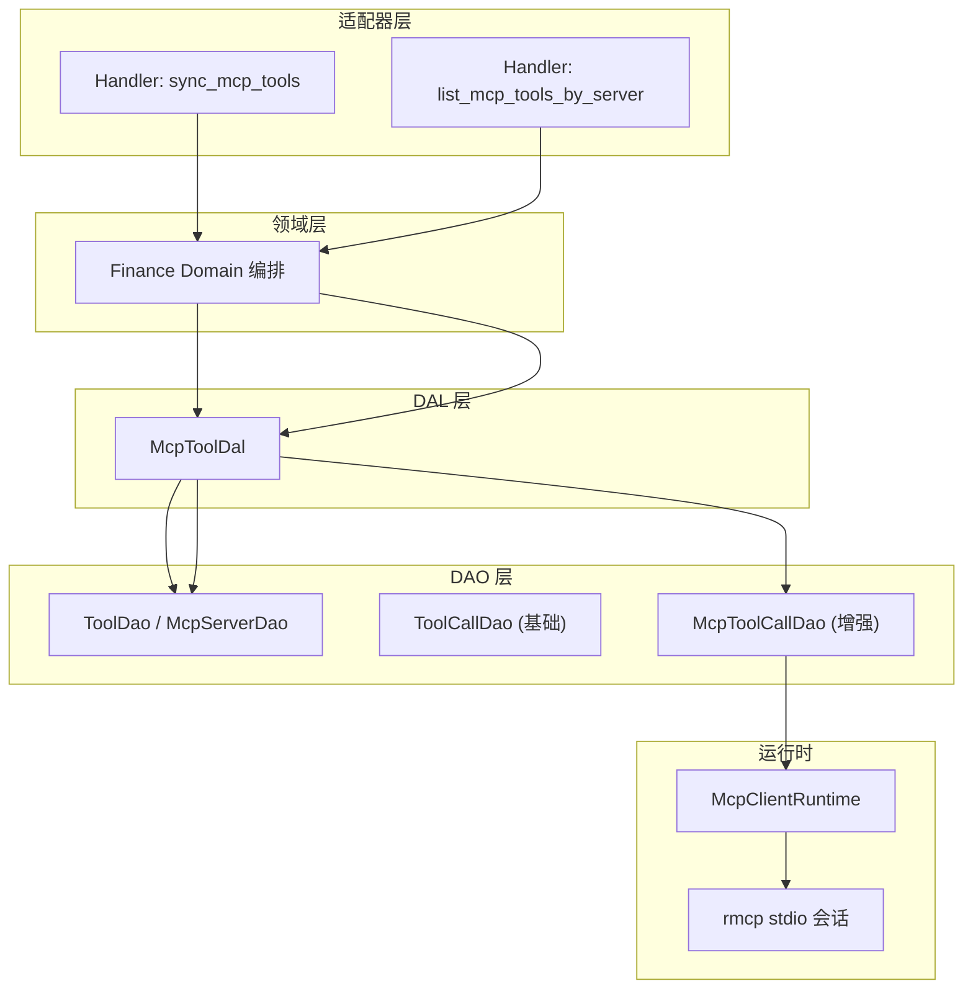
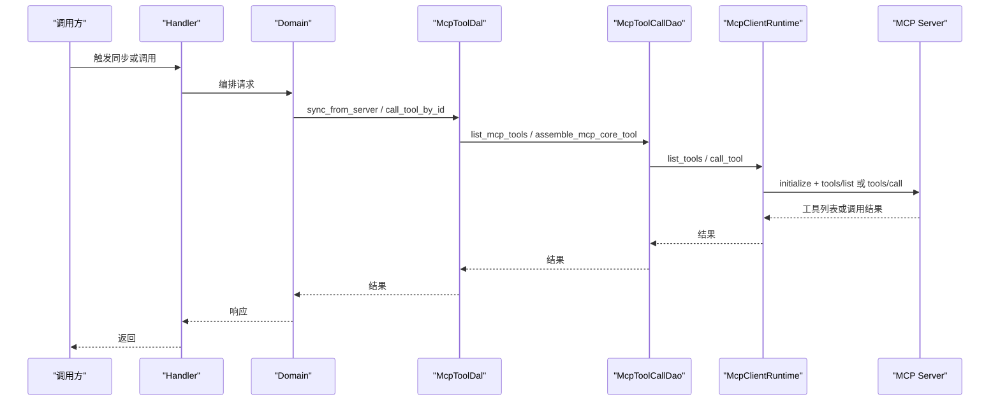
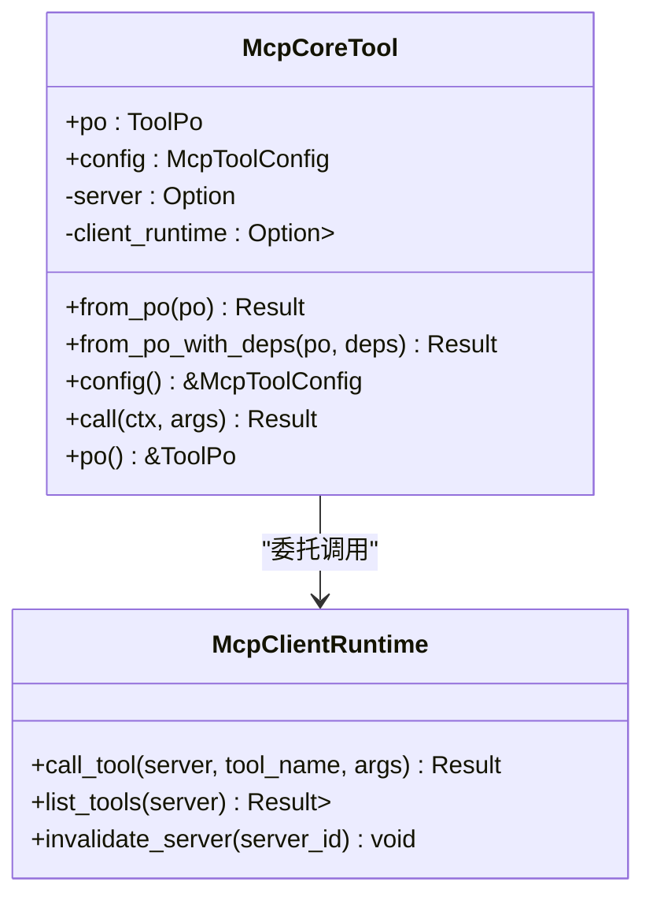
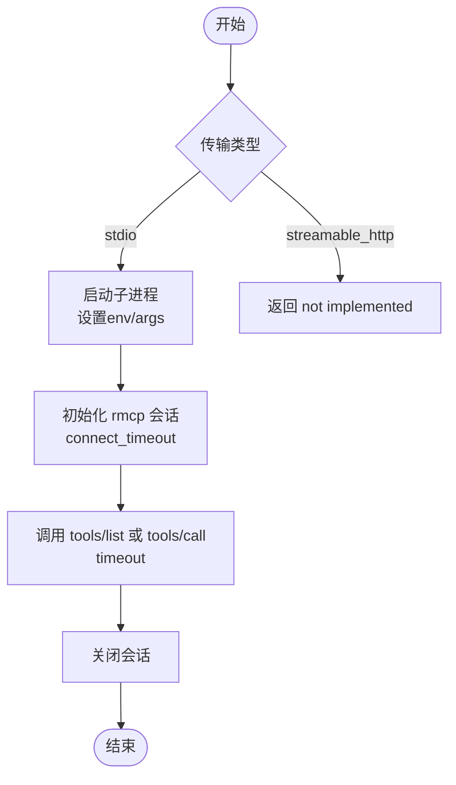
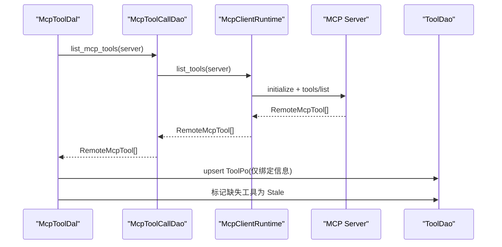
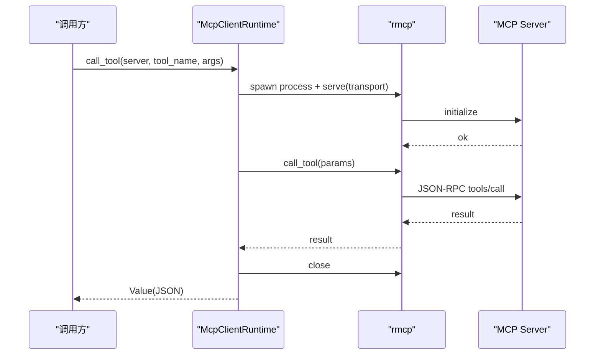
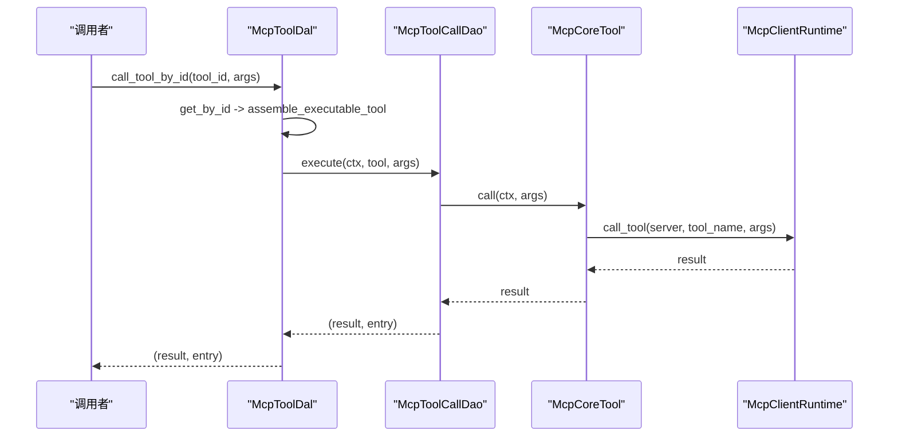
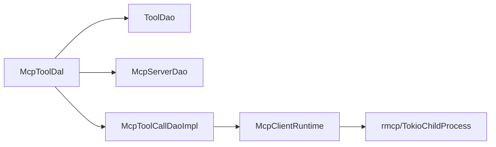

# MCP 协议工具

<cite>
**本文引用的文件**
- [mcp.rs](file://src/pkg/tool_registry/mcp.rs)
- [mcp_tool.rs](file://src/service/dal/mcp_tool.rs)
- [mcp.rs](file://src/service/dao/tool_call/mcp.rs)
- [mcp_server.rs](file://src/models/mcp_server.rs)
- [mcp_tool.rs](file://common/src/api/mcp_tool.rs)
- [sync_mcp_tools.rs](file://src/handlers/finance/mcp_tool/sync_mcp_tools.rs)
- [list_mcp_tools_by_server.rs](file://src/handlers/finance/mcp_tool/list_mcp_tools_by_server.rs)
- [mcp_tool_design.md](file://docs/mcp_tool_design.md)
</cite>

## 目录
1. [简介](#简介)
2. [项目结构](#项目结构)
3. [核心组件](#核心组件)
4. [架构总览](#架构总览)
5. [详细组件分析](#详细组件分析)
6. [依赖关系分析](#依赖关系分析)
7. [性能与可靠性](#性能与可靠性)
8. [故障排查指南](#故障排查指南)
9. [结论](#结论)
10. [附录：集成示例](#附录集成示例)

## 简介
本技术文档围绕 MCP（Model Context Protocol）工具在系统中的实现，系统性说明 McpCoreTool 的实现、MCP 服务器连接管理、工具发现机制、JSON-RPC 通信流程、参数序列化、配置管理、错误重试与超时控制，以及安全与性能策略。同时提供从服务器配置到工具调用、结果处理的完整集成路径，帮助读者快速理解并正确使用该能力。

## 项目结构
本项目采用严格四层单向调用：Adapter → Domain → DAL → DAO，禁止跨层调用与同层互调。MCP 工具相关代码分布在以下位置：
- pkg/tool_registry/mcp.rs：MCP 工具运行时与可执行工具封装（McpClientRuntime、McpCoreTool）。
- service/dal/mcp_tool.rs：MCP 专属 DAL，负责工具同步、组装、按 server 管理与调用编排。
- service/dao/tool_call/mcp.rs：MCP 增强的 ToolCallDao，持有唯一 McpClientRuntime 生命周期。
- models/mcp_server.rs：MCP Server 数据模型与配置（含脱敏与安全默认值）。
- common/api/mcp_tool.rs：前后端共享的 MCP 工具 API DTO。
- handlers/finance/mcp_tool/*：HTTP Handler，仅做请求映射与编排入口。
- docs/mcp_tool_design.md：设计文档，定义职责边界、初始化顺序与演进路线。

图表来源
- [mcp_tool.rs:108-167](file://src/service/dal/mcp_tool.rs#L108-L167)
- [mcp.rs:90-140](file://src/pkg/tool_registry/mcp.rs#L90-L140)
- [mcp.rs:142-192](file://src/pkg/tool_registry/mcp.rs#L142-L192)

章节来源
- [mcp_tool_design.md:120-150](file://docs/mcp_tool_design.md#L120-L150)
- [mcp_tool.rs:1-85](file://src/service/dal/mcp_tool.rs#L1-L85)

## 核心组件
- McpCoreTool：标准 CoreTool 实现，封装 ToolPo、McpToolConfig、McpServerPo 与 McpClientRuntime，对外暴露 call(args) 调用远端 MCP 工具。
- McpClientRuntime：最小 MCP 客户端运行时，当前支持 stdio transport；负责建立进程、初始化会话、调用 tools/list 与 tools/call、超时控制与关闭会话。
- McpToolDal：MCP 专属 DAL，负责：
  - 从远程 MCP Server 同步工具元数据为本地 ToolPo；
  - 将 ToolPo + McpServerPo 组装为可执行的 Tool；
  - 按 server 查询与管理；
  - 调用工具并返回结果与调用记录。
- McpToolCallDaoImpl：对通用 ToolCallDao 的 MCP 增强实现，持有唯一 McpClientRuntime，提供 assemble_mcp_core_tool、invalidate_mcp_server、list_mcp_tools 等能力。
- McpServerPo/McpServerConfig：持久化 MCP Server 连接配置，包含传输类型、命令/URL、环境变量、请求头、超时与响应大小限制，并提供管理面脱敏方法。

章节来源
- [mcp.rs:27-48](file://src/pkg/tool_registry/mcp.rs#L27-L48)
- [mcp.rs:50-198](file://src/pkg/tool_registry/mcp.rs#L50-L198)
- [mcp_tool.rs:48-91](file://src/service/dal/mcp_tool.rs#L48-L91)
- [mcp.rs:19-38](file://src/service/dao/tool_call/mcp.rs#L19-L38)
- [mcp_server.rs:97-167](file://src/models/mcp_server.rs#L97-L167)

## 架构总览
MCP 工具通过“管理面 + 运行面”分离的方式组织：
- 管理面：创建/更新 MCP Server，同步远端工具为本地 ToolPo，按 server 列出已同步工具。
- 运行面：根据 ToolPo.protocol=Mcp 路由到 McpToolDal，组装 McpCoreTool，调用 McpClientRuntime 完成 JSON-RPC 通信。

图表来源
- [mcp_tool.rs:108-167](file://src/service/dal/mcp_tool.rs#L108-L167)
- [mcp.rs:90-140](file://src/pkg/tool_registry/mcp.rs#L90-L140)
- [mcp.rs:142-192](file://src/pkg/tool_registry/mcp.rs#L142-L192)
- [mcp.rs:200-240](file://src/pkg/tool_registry/mcp.rs#L200-L240)

## 详细组件分析

### McpCoreTool 实现
- 职责：实现 CoreTool 接口，call(ctx, args) 委托给 McpClientRuntime.call_tool(server, tool_name, args)。
- 构造：支持 from_po（仅校验配置）与 from_po_with_deps（注入 server 与 runtime），确保执行时具备必要依赖。
- 错误处理：当缺少 server 或 runtime 时返回明确的不可执行错误；将底层错误统一转换为工具执行失败错误。

图表来源
- [mcp.rs:277-355](file://src/pkg/tool_registry/mcp.rs#L277-L355)
- [mcp.rs:50-198](file://src/pkg/tool_registry/mcp.rs#L50-L198)

章节来源
- [mcp.rs:277-355](file://src/pkg/tool_registry/mcp.rs#L277-L355)

### MCP 服务器连接管理
- 传输类型：支持 stdio 与 streamable_http；当前仅 stdio 可用，HTTP 显式 not implemented。
- 配置项：command、args、env、url、headers、timeout_ms、connect_timeout_ms、response_max_bytes。
- 安全默认值：
  - env 默认不继承系统环境，需显式配置；
  - stdio command 不走 shell，使用命令+参数数组；
  - 管理面展示/日志/错误输出对 env、headers、URL query 进行脱敏。
- 生命周期：当前 per-operation 独立 session，每次调用启动子进程、初始化会话、执行后关闭；若引入缓存，invalidate 标记将用于关闭/丢弃旧会话。

图表来源
- [mcp_server.rs:97-167](file://src/models/mcp_server.rs#L97-L167)
- [mcp.rs:200-240](file://src/pkg/tool_registry/mcp.rs#L200-L240)
- [mcp.rs:103-140](file://src/pkg/tool_registry/mcp.rs#L103-L140)
- [mcp.rs:142-192](file://src/pkg/tool_registry/mcp.rs#L142-L192)

章节来源
- [mcp_server.rs:97-167](file://src/models/mcp_server.rs#L97-L167)
- [mcp.rs:200-240](file://src/pkg/tool_registry/mcp.rs#L200-L240)

### 工具发现机制（tools/list）
- 入口：McpToolDal.sync_from_server 调用 McpToolCallDao.list_mcp_tools，最终由 McpClientRuntime.list_tools 发起 tools/list。
- 同步规则：
  - 不存在则创建 ToolPo；
  - 已存在则校验 protocol=Mcp 且绑定一致，否则返回冲突；
  - 保留 created_at/created_by/status，更新 updated_by；
  - ToolPo.config 仅保存 server_id/tool_name 绑定，不复制敏感配置；
  - 未出现在本次远端列表中的 Enabled 工具标记为 Stale。
- 结果：生成标准 ToolPo，便于后续绑定 Agent、Prompt 展示与运行时调用。

图表来源
- [mcp_tool.rs:108-167](file://src/service/dal/mcp_tool.rs#L108-L167)
- [mcp.rs:90-140](file://src/pkg/tool_registry/mcp.rs#L90-L140)

章节来源
- [mcp_tool.rs:108-167](file://src/service/dal/mcp_tool.rs#L108-L167)
- [mcp_tool_design.md:299-349](file://docs/mcp_tool_design.md#L299-L349)

### MCP 协议 JSON-RPC 通信与参数序列化
- 通信方式：通过 rmcp 库以 stdio 通道与 MCP Server 交互，先 initialize，再调用 tools/list 或 tools/call。
- 参数序列化：
  - 输入：必须为 JSON object；非 object 直接拒绝，避免启动外部进程。
  - 输出：MCP 调用结果序列化为 Value，再转为 JSON 返回。
- 超时控制：
  - connect_timeout_ms：初始化会话超时；
  - timeout_ms：tools/list 与 tools/call 调用超时。
- 会话关闭：无论成功或失败，均尝试关闭会话；关闭失败返回安全文案，不泄露底层细节。

图表来源
- [mcp.rs:142-192](file://src/pkg/tool_registry/mcp.rs#L142-L192)
- [mcp.rs:200-240](file://src/pkg/tool_registry/mcp.rs#L200-L240)

章节来源
- [mcp.rs:142-192](file://src/pkg/tool_registry/mcp.rs#L142-L192)
- [mcp.rs:200-240](file://src/pkg/tool_registry/mcp.rs#L200-L240)

### 工具调用流程与结果处理
- 入口：McpToolDal.call_tool_by_id 或 call_tool。
- 组装：校验 ToolPo.protocol=Mcp、status=Enabled；读取 McpServerPo 并校验 status=Enabled；组装 McpCoreTool。
- 执行：委托 McpToolCallDao.execute，内部调用 McpCoreTool.call，最终进入 McpClientRuntime.call_tool。
- 结果：返回 (Value, ToolCallEntry)，其中 call_id 为真实调用 ID；结果消息不复制 request args，超限结果使用安全 marker。

图表来源
- [mcp_tool.rs:219-250](file://src/service/dal/mcp_tool.rs#L219-L250)
- [mcp.rs:323-355](file://src/pkg/tool_registry/mcp.rs#L323-L355)
- [mcp.rs:142-192](file://src/pkg/tool_registry/mcp.rs#L142-L192)

章节来源
- [mcp_tool.rs:219-250](file://src/service/dal/mcp_tool.rs#L219-L250)
- [mcp_tool_design.md:581-635](file://docs/mcp_tool_design.md#L581-L635)

### 配置管理与状态控制
- McpServerConfig：
  - stdio：command、args、env；
  - HTTP：url、headers；
  - 通用：timeout_ms、connect_timeout_ms、response_max_bytes。
- 管理面脱敏：redacted_for_management 对 env、headers、URL query 替换为占位符，避免泄露敏感信息。
- 状态：
  - McpServerStatus：Deleted/Enabled/Disabled；
  - ToolStatus：新增 Stale 表示远端缺失，正常业务过滤 stale，管理面可显式查询。

章节来源
- [mcp_server.rs:97-167](file://src/models/mcp_server.rs#L97-L167)
- [mcp_tool_design.md:1312-1327](file://docs/mcp_tool_design.md#L1312-L1327)

## 依赖关系分析
- DAL 与 DAO：
  - McpToolDal 组合 ToolDao、McpServerDao、McpToolCallDao，不直接创建 base ToolCallDao 或第二份 runtime。
  - McpToolCallDaoImpl 持有唯一 McpClientRuntime，作为 MCP 增强实现。
- 运行时依赖：
  - McpCoreTool 依赖 McpClientRuntime，不直接访问 DAO；
  - McpClientRuntime 依赖 rmcp 与 tokio 进程管理。
- 初始化顺序：
  - service::dao::mcp_server::init 初始化持久化单例；
  - service::dao::tool_call::init 初始化 McpToolCallDaoImpl（含 runtime）；
  - service::dal::mcp_tool::init 装配 DAL 依赖。

图表来源
- [mcp_tool.rs:22-46](file://src/service/dal/mcp_tool.rs#L22-L46)
- [mcp.rs:40-72](file://src/service/dao/tool_call/mcp.rs#L40-L72)
- [mcp.rs:200-240](file://src/pkg/tool_registry/mcp.rs#L200-L240)

章节来源
- [mcp_tool_design.md:152-186](file://docs/mcp_tool_design.md#L152-L186)
- [mcp_tool.rs:22-46](file://src/service/dal/mcp_tool.rs#L22-L46)

## 性能与可靠性
- 会话策略：当前 per-operation 独立 session，无共享缓存；并发调用各自独立进程与会话，避免跨 await 共享锁。
- 超时控制：
  - connect_timeout_ms：会话初始化超时；
  - timeout_ms：工具调用超时；
  - response_max_bytes：响应体大小限制。
- 失效与重试：
  - invalidate_server 标记 server 失效，下一次成功调用清除标记；
  - 首次失败不自动重试，建议上层根据业务需求增加重试策略；
  - 若未来引入 session cache，invalidate 将扩展为关闭/丢弃旧会话。
- 资源释放：每次调用后尝试关闭会话；关闭失败返回安全文案，避免泄露底层错误。

章节来源
- [mcp_tool_design.md:1346-1352](file://docs/mcp_tool_design.md#L1346-L1352)
- [mcp.rs:103-140](file://src/pkg/tool_registry/mcp.rs#L103-L140)
- [mcp.rs:142-192](file://src/pkg/tool_registry/mcp.rs#L142-L192)

## 故障排查指南
- 常见错误：
  - 非 JSON object 参数：直接拒绝，不会启动外部进程；
  - 找不到 MCP Server：ResourceNotFound；
  - 工具或服务器禁用：InvalidRequest；
  - 超时：明确提示超时毫秒数；
  - 会话关闭失败：返回安全文案，不泄露 command/env/credential。
- 排查步骤：
  - 检查 ToolPo.protocol 是否为 Mcp，status 是否为 Enabled；
  - 检查 McpServerPo.status 是否为 Enabled；
  - 确认 command 是否存在于 PATH 或使用绝对路径；
  - 查看超时配置是否合理；
  - 检查管理面脱敏后的配置是否正确。

章节来源
- [mcp.rs:142-192](file://src/pkg/tool_registry/mcp.rs#L142-L192)
- [mcp_tool.rs:257-287](file://src/service/dal/mcp_tool.rs#L257-L287)
- [mcp_server.rs:152-167](file://src/models/mcp_server.rs#L152-L167)

## 结论
MCP 工具在本项目中以“管理面 + 运行面”分离的方式实现，遵循严格分层与单向依赖原则。McpCoreTool 与 McpClientRuntime 封装了 JSON-RPC 通信与进程管理，McpToolDal 负责工具同步与执行编排，McpToolCallDaoImpl 统一管理运行时生命周期。当前版本聚焦 stdio transport，具备完善的超时控制、错误脱敏与状态管理，为后续 HTTP transport 与连接池优化奠定基础。

## 附录：集成示例
以下为 MCP 工具集成的关键步骤与对应文件路径，便于快速上手：

- 配置 MCP 服务器
  - 参考：[mcp_server.rs:97-167](file://src/models/mcp_server.rs#L97-L167)
  - 说明：设置 transport、command/args/env/url/headers、超时与响应大小限制；管理面展示使用脱敏配置。

- 同步远端工具
  - 参考：[sync_mcp_tools.rs](file://src/handlers/finance/mcp_tool/sync_mcp_tools.rs)
  - 说明：调用 McpToolDal.sync_from_server，将远端工具元数据同步为本地 ToolPo。

- 列出已同步工具
  - 参考：[list_mcp_tools_by_server.rs](file://src/handlers/finance/mcp_tool/list_mcp_tools_by_server.rs)
  - 说明：按 server 分页查询已同步工具，支持关键字与状态过滤。

- 调用 MCP 工具
  - 参考：[mcp_tool.rs:219-250](file://src/service/dal/mcp_tool.rs#L219-L250)
  - 说明：通过 McpToolDal.call_tool_by_id 或 call_tool，返回结果与调用记录。

- 结果处理
  - 参考：[mcp_tool_design.md:1312-1327](file://docs/mcp_tool_design.md#L1312-L1327)
  - 说明：结果消息不复制 request args，超限结果使用安全 marker，携带 trace_ref 关联完整调用记录。

章节来源
- [mcp_server.rs:97-167](file://src/models/mcp_server.rs#L97-L167)
- [sync_mcp_tools.rs](file://src/handlers/finance/mcp_tool/sync_mcp_tools.rs)
- [list_mcp_tools_by_server.rs](file://src/handlers/finance/mcp_tool/list_mcp_tools_by_server.rs)
- [mcp_tool.rs:219-250](file://src/service/dal/mcp_tool.rs#L219-L250)
- [mcp_tool_design.md:1312-1327](file://docs/mcp_tool_design.md#L1312-L1327)