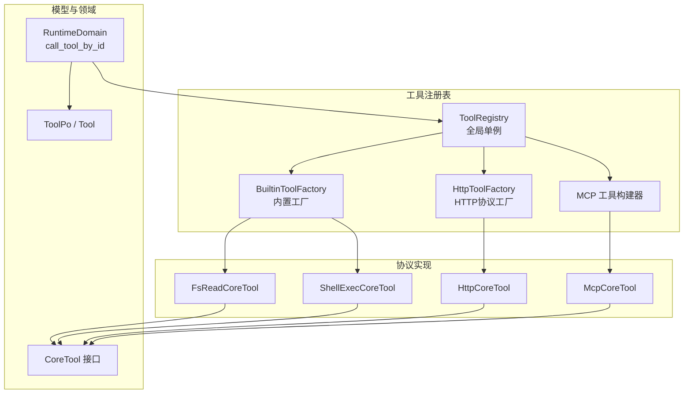
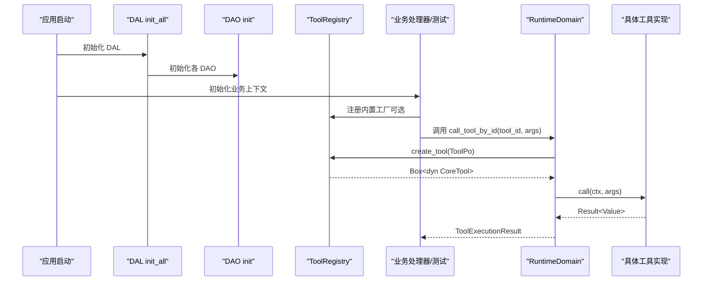
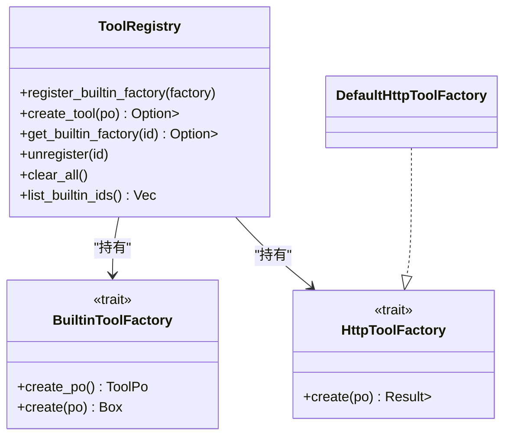
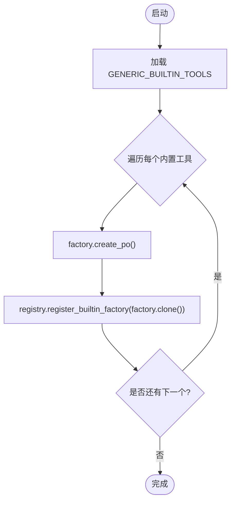
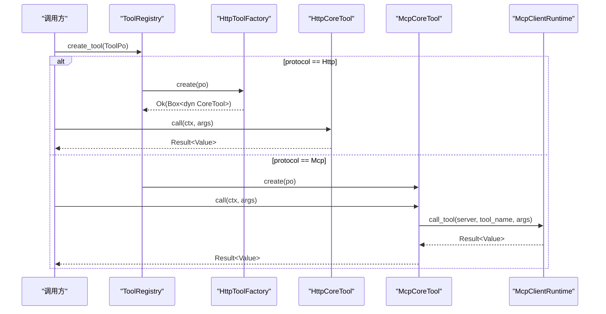
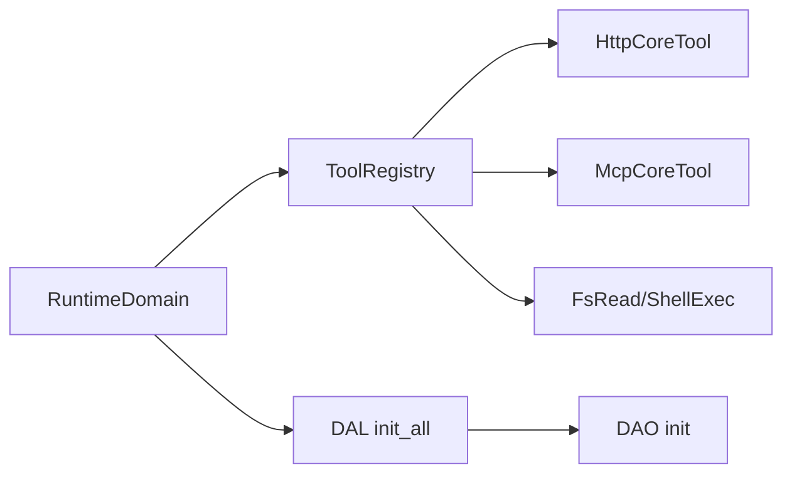

# 核心架构与注册机制

<cite>
**本文引用的文件**
- [src/pkg/tool_registry/mod.rs](file://src/pkg/tool_registry/mod.rs)
- [src/pkg/tool_registry/builtin.rs](file://src/pkg/tool_registry/builtin.rs)
- [src/pkg/tool_registry/http.rs](file://src/pkg/tool_registry/http.rs)
- [src/pkg/tool_registry/mcp.rs](file://src/pkg/tool_registry/mcp.rs)
- [src/pkg/tool_registry/fs_read.rs](file://src/pkg/tool_registry/fs_read.rs)
- [src/pkg/tool_registry/shell_exec.rs](file://src/pkg/tool_registry/shell_exec.rs)
- [src/models/tool.rs](file://src/models/tool.rs)
- [src/service/domain/runtime/mod.rs](file://src/service/domain/runtime/mod.rs)
- [src/service/dal/mod.rs](file://src/service/dal/mod.rs)
- [src/service/dao/tool/sqlite.rs](file://src/service/dao/tool/sqlite.rs)
- [src/handlers/finance/mcp_tool/mcp_tool_handler_test.rs](file://src/handlers/finance/mcp_tool/mcp_tool_handler_test.rs)
- [src/handlers/finance/tool/tool_call_entry_test.rs](file://src/handlers/finance/tool/tool_call_entry_test.rs)
</cite>

## 目录
1. [简介](#简介)
2. [项目结构](#项目结构)
3. [核心组件](#核心组件)
4. [架构总览](#架构总览)
5. [详细组件分析](#详细组件分析)
6. [依赖关系分析](#依赖关系分析)
7. [性能与安全考量](#性能与安全考量)
8. [故障排查指南](#故障排查指南)
9. [结论](#结论)
10. [附录：完整使用示例路径](#附录：完整使用示例路径)

## 简介
本技术文档围绕工具注册表的核心架构展开，重点说明 ToolRegistry 全局单例、工厂模式实现、协议类型分发机制；内置工具工厂注册、动态工具创建流程、工具生命周期管理；线程安全设计、内存管理与性能优化策略；并提供工具注册、发现、创建和销毁的完整代码示例路径。同时解释工具协议抽象接口设计与扩展机制，帮助读者理解如何在现有体系下新增或替换工具协议实现。

## 项目结构
工具注册表位于 src/pkg/tool_registry，采用“按协议分模块”的组织方式：
- 全局注册表与协议分发：mod.rs
- 内置工具工厂与通用内置工具集合：builtin.rs
- HTTP 协议工具实现与配置校验：http.rs
- MCP（Model Context Protocol）工具运行时与客户端：mcp.rs
- 文件系统读取工具实现：fs_read.rs
- Shell 执行工具实现：shell_exec.rs
- 工具协议抽象与持久化对象：models/tool.rs
- 领域层工具执行入口（Runtime Domain）：service/domain/runtime/mod.rs
- DAL/DAO 初始化与工具数据访问：service/dal/mod.rs, service/dao/tool/sqlite.rs
- 测试中初始化顺序参考：handlers/finance/*_test.rs

图表来源
- [src/pkg/tool_registry/mod.rs:29-132](file://src/pkg/tool_registry/mod.rs#L29-L132)
- [src/pkg/tool_registry/builtin.rs:13-43](file://src/pkg/tool_registry/builtin.rs#L13-L43)
- [src/pkg/tool_registry/http.rs:23-114](file://src/pkg/tool_registry/http.rs#L23-L114)
- [src/pkg/tool_registry/mcp.rs:270-365](file://src/pkg/tool_registry/mcp.rs#L270-L365)
- [src/models/tool.rs:16-34](file://src/models/tool.rs#L16-L34)
- [src/service/domain/runtime/mod.rs:175-213](file://src/service/domain/runtime/mod.rs#L175-L213)

章节来源
- [src/pkg/tool_registry/mod.rs:29-132](file://src/pkg/tool_registry/mod.rs#L29-L132)
- [src/pkg/tool_registry/builtin.rs:13-43](file://src/pkg/tool_registry/builtin.rs#L13-L43)
- [src/models/tool.rs:16-34](file://src/models/tool.rs#L16-L34)
- [src/service/domain/runtime/mod.rs:175-213](file://src/service/domain/runtime/mod.rs#L175-L213)

## 核心组件
- 全局单例注册表：通过 lazy_static 暴露 GLOBAL_TOOL_REGISTRY，提供 get_registry() 获取全局引用。
- 协议分发：create_tool 根据 ToolPo.protocol 将请求路由到对应工厂或构建器。
- 内置工具工厂：BuiltinToolFactory 定义 create_po 与 create，用于生成默认 ToolPo 并构造可执行 CoreTool。
- HTTP 协议工厂：HttpToolFactory 为协议级工厂，DefaultHttpToolFactory 基于 ToolPo.config 构造 HttpCoreTool。
- MCP 工具运行时：McpClientRuntime 负责 stdio 模式的连接、工具列表与调用；McpCoreTool 作为可执行工具包装。
- 工具协议抽象：CoreTool 统一 call/po/as_original 接口，所有具体工具实现该接口。
- 领域执行入口：RuntimeDomain 的 call_tool_by_id/call_tool 拥有协议路由职责，协调 DAL/DAO 与注册表。

章节来源
- [src/pkg/tool_registry/mod.rs:29-132](file://src/pkg/tool_registry/mod.rs#L29-L132)
- [src/pkg/tool_registry/builtin.rs:13-43](file://src/pkg/tool_registry/builtin.rs#L13-L43)
- [src/pkg/tool_registry/http.rs:23-114](file://src/pkg/tool_registry/http.rs#L23-L114)
- [src/pkg/tool_registry/mcp.rs:270-365](file://src/pkg/tool_registry/mcp.rs#L270-L365)
- [src/models/tool.rs:16-34](file://src/models/tool.rs#L16-L34)
- [src/service/domain/runtime/mod.rs:175-213](file://src/service/domain/runtime/mod.rs#L175-L213)

## 架构总览
工具注册表在启动时通过 DAL 初始化流程完成 DAO/DAL 单例注册；随后由业务侧（如处理器测试）调用 DAL init_all 完成各子模块初始化。工具注册表本身是进程级单例，内置工具工厂在首次访问或显式注册时加入全局映射。运行时，领域层通过 RuntimeDomain 调用工具，内部依据 ToolPo.protocol 选择协议实现，最终执行 CoreTool::call。

图表来源
- [src/service/dal/mod.rs:54-76](file://src/service/dal/mod.rs#L54-L76)
- [src/service/dao/tool/sqlite.rs:83-87](file://src/service/dao/tool/sqlite.rs#L83-L87)
- [src/pkg/tool_registry/mod.rs:29-132](file://src/pkg/tool_registry/mod.rs#L29-L132)
- [src/service/domain/runtime/mod.rs:175-213](file://src/service/domain/runtime/mod.rs#L175-L213)

章节来源
- [src/service/dal/mod.rs:54-76](file://src/service/dal/mod.rs#L54-L76)
- [src/service/dao/tool/sqlite.rs:83-87](file://src/service/dao/tool/sqlite.rs#L83-L87)
- [src/pkg/tool_registry/mod.rs:29-132](file://src/pkg/tool_registry/mod.rs#L29-L132)
- [src/service/domain/runtime/mod.rs:175-213](file://src/service/domain/runtime/mod.rs#L175-L213)

## 详细组件分析

### ToolRegistry 全局单例与协议分发
- 全局单例：lazy_static 保证全局唯一实例，get_registry() 返回静态引用。
- 存储结构：
  - builtin_factories：HashMap<String, Box<dyn BuiltinToolFactory>>，以工具 id 为键。
  - mcp_factories：预留扩展位，当前阶段为占位。
  - http_factory：协议级工厂，支持注入自定义实现。
- 协议分发：create_tool 根据 ToolProtocol 分支：
  - Builtin：从内置工厂 map 查找并调用 create(po)。
  - Mcp：调用 mcp::create_tool 构建 McpCoreTool 存根。
  - Http：委托给 http_factory.create(po)。

图表来源
- [src/pkg/tool_registry/mod.rs:29-132](file://src/pkg/tool_registry/mod.rs#L29-L132)
- [src/pkg/tool_registry/builtin.rs:13-43](file://src/pkg/tool_registry/builtin.rs#L13-L43)
- [src/pkg/tool_registry/http.rs:23-39](file://src/pkg/tool_registry/http.rs#L23-L39)

章节来源
- [src/pkg/tool_registry/mod.rs:29-132](file://src/pkg/tool_registry/mod.rs#L29-L132)

### 内置工具工厂注册
- 通用内置工具集合 GENERIC_BUILTIN_TOOLS 包含 http_fetch、fs_read、fs_write、shell_exec。
- register_all(registry) 遍历集合，调用每个工厂的 create_po 生成默认 ToolPo，并通过 registry.register_builtin_factory 注册。
- 每个内置工具工厂实现 BuiltinToolFactory，提供默认元数据与参数 Schema，以及构造可执行 CoreTool 的能力。

图表来源
- [src/pkg/tool_registry/builtin.rs:26-43](file://src/pkg/tool_registry/builtin.rs#L26-L43)
- [src/pkg/tool_registry/mod.rs:75-79](file://src/pkg/tool_registry/mod.rs#L75-L79)

章节来源
- [src/pkg/tool_registry/builtin.rs:26-43](file://src/pkg/tool_registry/builtin.rs#L26-L43)
- [src/pkg/tool_registry/mod.rs:75-79](file://src/pkg/tool_registry/mod.rs#L75-L79)

### 动态工具创建流程（HTTP/MCP）
- HTTP：
  - HttpToolFactory::create 解析 ToolPo.config 为 HttpToolConfig，进行安全与模板校验，构造 HttpCoreTool。
  - execute_http_call 负责参数校验、URL 渲染、目标域白名单/黑名单校验、超时与响应大小限制、JSON Pointer 提取等。
- MCP：
  - McpCoreTool::from_po 仅解析并校验 ToolPo.config（server_id、tool_name），不直接建立连接。
  - 实际调用通过 McpClientRuntime.call_tool 发起 stdio 会话，带超时控制与错误处理。
  - 支持工具列表查询 list_tools，便于同步远端能力。

图表来源
- [src/pkg/tool_registry/http.rs:111-220](file://src/pkg/tool_registry/http.rs#L111-L220)
- [src/pkg/tool_registry/mcp.rs:270-365](file://src/pkg/tool_registry/mcp.rs#L270-L365)
- [src/pkg/tool_registry/mod.rs:81-102](file://src/pkg/tool_registry/mod.rs#L81-L102)

章节来源
- [src/pkg/tool_registry/http.rs:111-220](file://src/pkg/tool_registry/http.rs#L111-L220)
- [src/pkg/tool_registry/mcp.rs:270-365](file://src/pkg/tool_registry/mcp.rs#L270-L365)
- [src/pkg/tool_registry/mod.rs:81-102](file://src/pkg/tool_registry/mod.rs#L81-L102)

### 工具生命周期管理
- 注册：
  - 内置工具通过 register_all 注册到全局注册表。
  - 动态工具（HTTP/MCP）通过 ToolPo 持久化后，在运行时由 create_tool 构建可执行实例。
- 发现：
  - list_builtin_ids 列出已注册的内置工具 ID。
  - 管理面可通过 DAL/DAO 查询工具元数据与状态。
- 创建：
  - create_tool 根据协议分发到对应工厂/构建器。
- 销毁：
  - unregister 移除指定 ID 的工厂（内置/MCP）。
  - clear_all 清空所有工厂。
  - 具体工具实例无显式资源释放逻辑，HTTP/MCP 在调用完成后关闭连接或结束会话。

章节来源
- [src/pkg/tool_registry/mod.rs:104-130](file://src/pkg/tool_registry/mod.rs#L104-L130)
- [src/pkg/tool_registry/http.rs:111-124](file://src/pkg/tool_registry/http.rs#L111-L124)
- [src/pkg/tool_registry/mcp.rs:357-370](file://src/pkg/tool_registry/mcp.rs#L357-L370)

### 线程安全设计
- 全局注册表使用 Arc<Mutex<HashMap...>> 保护内置工厂映射，确保并发安全。
- 协议级工厂（HttpToolFactory）为 Send + Sync，可在多线程环境中共享。
- MCP 客户端运行时使用 Mutex<HashSet<String>> 维护失效服务器集合，避免并发竞争。
- 工具实例本身不可变或轻量，调用通过异步函数执行，避免共享可变状态。

章节来源
- [src/pkg/tool_registry/mod.rs:46-64](file://src/pkg/tool_registry/mod.rs#L46-L64)
- [src/pkg/tool_registry/mcp.rs:50-66](file://src/pkg/tool_registry/mcp.rs#L50-L66)

### 内存管理与性能优化策略
- HTTP 工具：
  - 禁止重定向与代理，减少不必要跳转与开销。
  - 限制响应最大字节数，防止大响应导致内存压力。
  - 超时控制，避免长时间阻塞。
  - JSON Pointer 提取，减少后续处理成本。
- 文件系统工具：
  - 限制文件大小（例如 10MB），避免读取超大文件。
  - 流式读取与行范围裁剪，降低内存占用。
- Shell 执行工具：
  - 输出截断与日志落盘，避免响应体过大。
  - 后台模式支持长任务，立即返回 PID 与日志路径。
  - 环境变量白名单过滤，减少不必要的环境污染。
- 注册表：
  - 工厂级别缓存，避免重复构造。
  - 按需创建工具实例，减少常驻内存。

章节来源
- [src/pkg/tool_registry/http.rs:149-220](file://src/pkg/tool_registry/http.rs#L149-L220)
- [src/pkg/tool_registry/fs_read.rs:150-210](file://src/pkg/tool_registry/fs_read.rs#L150-L210)
- [src/pkg/tool_registry/shell_exec.rs:281-465](file://src/pkg/tool_registry/shell_exec.rs#L281-L465)

### 工具协议抽象接口设计与扩展机制
- CoreTool 接口：
  - call(ctx, args) 统一执行入口。
  - po() 返回持久化元数据。
  - as_original() 支持装饰器链中取出原始工具。
- 扩展新协议：
  - 实现 HttpToolFactory 或新增协议工厂 trait，并在 ToolRegistry 中添加分发分支。
  - 定义协议配置结构（如 HttpToolConfig、McpToolConfig），在 create_tool 中解析与校验。
  - 实现具体 CoreTool，封装协议细节与安全策略。
- 内置工具扩展：
  - 实现 BuiltinToolFactory，提供默认 ToolPo 与参数 Schema，并注册到 GENERIC_BUILTIN_TOOLS。

章节来源
- [src/models/tool.rs:16-34](file://src/models/tool.rs#L16-L34)
- [src/pkg/tool_registry/http.rs:23-39](file://src/pkg/tool_registry/http.rs#L23-L39)
- [src/pkg/tool_registry/mcp.rs:270-365](file://src/pkg/tool_registry/mcp.rs#L270-L365)
- [src/pkg/tool_registry/builtin.rs:13-43](file://src/pkg/tool_registry/builtin.rs#L13-L43)

## 依赖关系分析
- 领域层依赖注册表：RuntimeDomain 通过 ToolRegistry 创建工具实例。
- 注册表依赖协议实现：HTTP/MCP/内置工具各自实现 CoreTool。
- 数据层依赖：DAL/DAO 负责工具元数据的持久化与查询。
- 测试依赖：处理器测试初始化 DAL/DAO/DOMAIN，确保运行环境一致。

图表来源
- [src/service/domain/runtime/mod.rs:175-213](file://src/service/domain/runtime/mod.rs#L175-L213)
- [src/service/dal/mod.rs:54-76](file://src/service/dal/mod.rs#L54-L76)
- [src/service/dao/tool/sqlite.rs:83-87](file://src/service/dao/tool/sqlite.rs#L83-L87)

章节来源
- [src/service/domain/runtime/mod.rs:175-213](file://src/service/domain/runtime/mod.rs#L175-L213)
- [src/service/dal/mod.rs:54-76](file://src/service/dal/mod.rs#L54-L76)
- [src/service/dao/tool/sqlite.rs:83-87](file://src/service/dao/tool/sqlite.rs#L83-L87)

## 性能与安全考量
- 性能：
  - 工厂缓存与按需实例化，减少构造开销。
  - HTTP 响应大小限制与超时控制，避免资源耗尽。
  - 文件读取流式处理与行范围裁剪，降低内存占用。
  - Shell 输出截断与日志落盘，避免大响应阻塞。
- 安全：
  - HTTP 目标域白名单/黑名单校验，禁止本地网络默认访问。
  - 模板变量严格校验，仅允许 args.* 占位符。
  - Shell 工作目录限制与环境变量白名单过滤。
  - 内置工具不可修改，防止恶意篡改。

章节来源
- [src/pkg/tool_registry/http.rs:369-475](file://src/pkg/tool_registry/http.rs#L369-L475)
- [src/pkg/tool_registry/shell_exec.rs:168-239](file://src/pkg/tool_registry/shell_exec.rs#L168-L239)
- [src/pkg/tool_registry/fs_read.rs:133-165](file://src/pkg/tool_registry/fs_read.rs#L133-L165)

## 故障排查指南
- HTTP 工具配置无效：
  - 检查 method/url 是否为空，URL 是否合法，是否启用非受支持的方案。
  - 参考测试用例验证 URL 模板与参数必填项。
- MCP 工具不可执行：
  - 确认 server_id 与 tool_name 存在且匹配。
  - 检查 stdio 命令是否在 PATH 中或提供绝对路径。
  - 关注会话初始化超时与关闭失败错误信息。
- 内置工具无法修改：
  - 内置工具不可更新，需通过代码同步。
- 工作目录不在允许范围：
  - Shell 工具会拒绝不在 base_data_path 或额外允许路径的工作目录。

章节来源
- [src/pkg/tool_registry/http_tests.rs:176-216](file://src/pkg/tool_registry/http_tests.rs#L176-L216)
- [src/pkg/tool_registry/mcp.rs:200-268](file://src/pkg/tool_registry/mcp.rs#L200-L268)
- [src/service/dao/tool/sqlite.rs:121-127](file://src/service/dao/tool/sqlite.rs#L121-L127)
- [src/pkg/tool_registry/shell_exec.rs:168-191](file://src/pkg/tool_registry/shell_exec.rs#L168-L191)

## 结论
工具注册表通过全局单例与工厂模式实现了协议无关的工具创建与执行，结合严格的配置校验与安全策略，提供了可扩展、高性能、易维护的工具生态。通过 CoreTool 抽象与协议工厂解耦，新增协议或内置工具只需实现最小接口并注册即可融入系统。领域层统一编排工具执行，DAL/DAO 负责持久化，形成清晰的分层与单向依赖。

## 附录：完整使用示例路径
- 注册内置工具：
  - [src/pkg/tool_registry/builtin.rs:26-43](file://src/pkg/tool_registry/builtin.rs#L26-L43)
- 创建 HTTP 工具并执行：
  - [src/pkg/tool_registry/http.rs:111-220](file://src/pkg/tool_registry/http.rs#L111-L220)
- 创建 MCP 工具并执行：
  - [src/pkg/tool_registry/mcp.rs:270-365](file://src/pkg/tool_registry/mcp.rs#L270-L365)
- 领域层调用工具：
  - [src/service/domain/runtime/mod.rs:175-213](file://src/service/domain/runtime/mod.rs#L175-L213)
- 初始化 DAL/DAO：
  - [src/service/dal/mod.rs:54-76](file://src/service/dal/mod.rs#L54-L76)
  - [src/service/dao/tool/sqlite.rs:83-87](file://src/service/dao/tool/sqlite.rs#L83-L87)
- 测试初始化顺序参考：
  - [src/handlers/finance/mcp_tool/mcp_tool_handler_test.rs:17-32](file://src/handlers/finance/mcp_tool/mcp_tool_handler_test.rs#L17-L32)
  - [src/handlers/finance/tool/tool_call_entry_test.rs:13-28](file://src/handlers/finance/tool/tool_call_entry_test.rs#L13-L28)