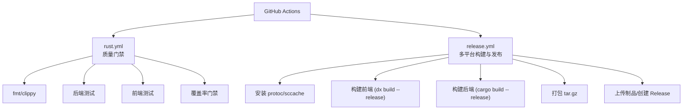
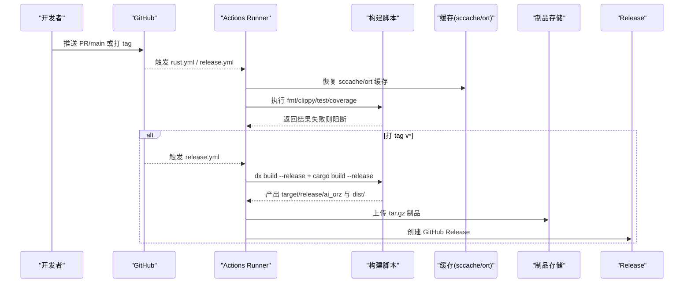
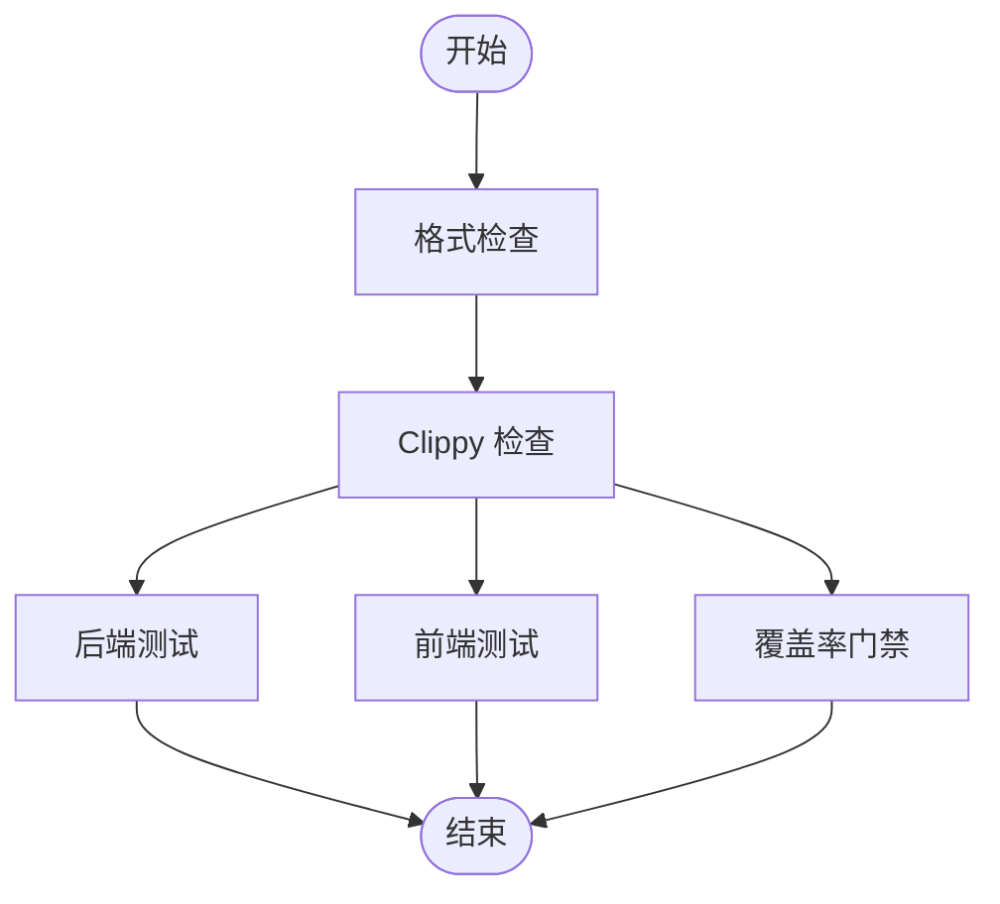
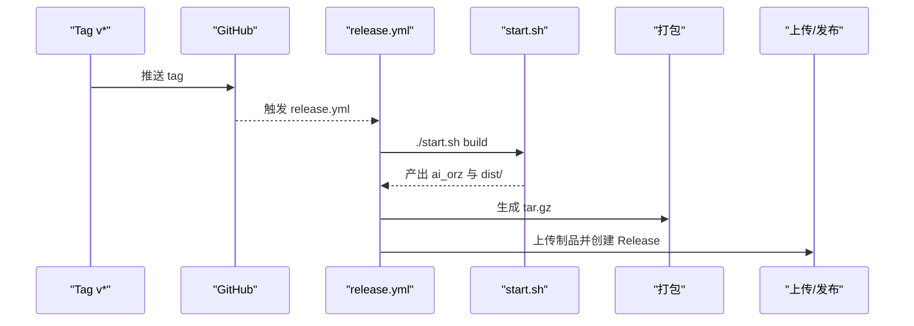
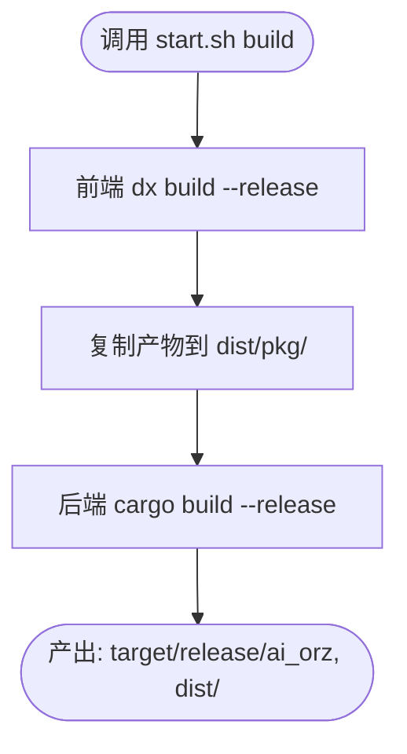
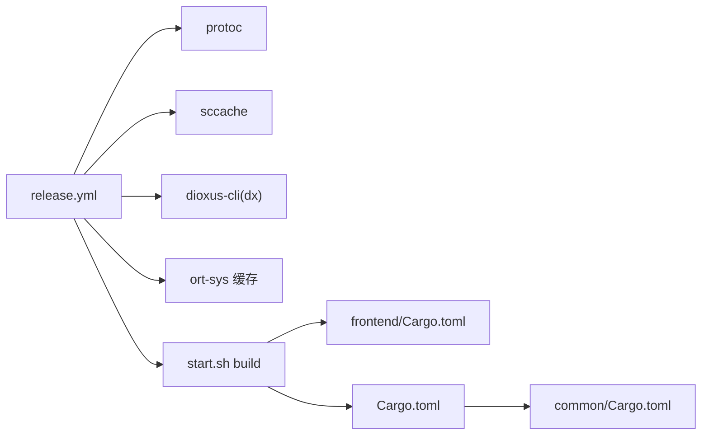

# 持续集成与发布工作流

<cite>
**本文引用的文件**
- [release.yml](file://.github/workflows/release.yml)
- [rust.yml](file://.github/workflows/rust.yml)
- [start.sh](file://start.sh)
- [build.sh](file://build.sh)
- [Cargo.toml](file://Cargo.toml)
- [frontend/Cargo.toml](file://frontend/Cargo.toml)
- [common/Cargo.toml](file://common/Cargo.toml)
- [rust-toolchain.toml](file://rust-toolchain.toml)
- [frontend/Dioxus.toml](file://frontend/Dioxus.toml)
</cite>

## 目录
1. [简介](#简介)
2. [项目结构](#项目结构)
3. [核心组件](#核心组件)
4. [架构总览](#架构总览)
5. [详细组件分析](#详细组件分析)
6. [依赖关系分析](#依赖关系分析)
7. [性能与缓存优化](#性能与缓存优化)
8. [故障排查指南](#故障排查指南)
9. [结论](#结论)

## 简介
本仓库采用 GitHub Actions 实现“开发质量门禁 + 多平台发布”的持续集成与发布流水线。整体分为两条主线：
- 质量门禁（PR/合并到 main）：格式检查、Clippy 零警告、后端与前端并行测试、覆盖率门禁（main 更严格，PR 略宽松）。
- 发布构建（打 tag v* 或手动触发）：按目标平台原生编译后端二进制与前端静态资源，打包为可分发归档并创建 GitHub Release。

该流程强调：
- 使用 sccache 加速跨 job 的 Rust 编译缓存命中。
- 通过 SQLX_OFFLINE=true 使用离线查询缓存，避免 CI 网络波动。
- 前端基于 Dioxus 0.7 构建 WASM 产物，统一输出到 dist/ 目录，随后端二进制一起打包。
- 仅对 tag 触发时创建 GitHub Release，避免误发。

## 项目结构
CI/CD 相关的关键位置与职责如下：
- .github/workflows/rust.yml：质量门禁（fmt、clippy、backend/frontend 测试、coverage）。
- .github/workflows/release.yml：多平台 release 构建与发布。
- start.sh / build.sh：统一构建入口，封装前后端构建与运行。
- Cargo 工作区与前端配置：定义 workspace、依赖、工具链与前端构建输出。

图表来源
- [rust.yml:1-281](file://.github/workflows/rust.yml#L1-L281)
- [release.yml:1-143](file://.github/workflows/release.yml#L1-L143)

章节来源
- [rust.yml:1-281](file://.github/workflows/rust.yml#L1-L281)
- [release.yml:1-143](file://.github/workflows/release.yml#L1-L143)

## 核心组件
- 质量门禁（rust.yml）
  - fmt：快速文本检查，失败不阻塞后续步骤。
  - clippy：全目标 Clippy 检查，-D warnings 零容忍。
  - backend：单元测试 + 集成测试（含 SQLite 集成测试）。
  - frontend：wasm32 目标 clippy + 前端测试。
  - coverage：使用 cargo-llvm-cov 收集覆盖率，设置 fail-under-lines 阈值（main 45%，PR 38%），报告写入日志与 Summary。
- 发布构建（release.yml）
  - 矩阵构建：Linux x86_64、macOS aarch64（不做交叉编译，避免重型依赖链问题）。
  - 环境准备：安装 protoc、sccache、dioxus-cli（dx）。
  - 构建：调用 start.sh build 完成前后端 release 构建；复制前端产物到 dist/。
  - 打包：生成 ai_orz-{tag}-{target}.tar.gz，内含 README.txt 说明。
  - 发布：仅在 refs/tags/v* 时下载制品并创建 GitHub Release。

章节来源
- [rust.yml:17-175](file://.github/workflows/rust.yml#L17-L175)
- [rust.yml:176-281](file://.github/workflows/rust.yml#L176-L281)
- [release.yml:14-123](file://.github/workflows/release.yml#L14-L123)
- [release.yml:124-143](file://.github/workflows/release.yml#L124-L143)

## 架构总览
下图展示了从代码提交到制品发布的端到端流程，包括并行化策略与关键依赖。

图表来源
- [rust.yml:17-175](file://.github/workflows/rust.yml#L17-L175)
- [release.yml:14-123](file://.github/workflows/release.yml#L14-L123)
- [release.yml:124-143](file://.github/workflows/release.yml#L124-L143)

## 详细组件分析

### 质量门禁流水线（rust.yml）
- 阶段划分
  - fmt：独立 job，秒级返回，纯文本检查。
  - lint：安装 protoc（lancedb 依赖）、sccache、clippy，-D warnings。
  - backend：在 lint 通过后并行执行，包含单元测试与集成测试。
  - frontend：在 lint 通过后并行执行，wasm32 clippy + 前端测试。
  - coverage：在 lint 通过后并行执行，使用 cargo-llvm-cov 收集覆盖率并校验阈值。
- 关键环境变量
  - SQLX_OFFLINE=true：使用离线查询缓存，避免 CI 网络影响。
  - CARGO_INCREMENTAL=0：与 sccache 配合，由 sccache 完全接管缓存。
- 覆盖率门禁
  - main push：fail-under-lines 45。
  - PR：fail-under-lines 38。
  - 报告：文本明细输出到日志，摘要写入 run Summary。

图表来源
- [rust.yml:17-175](file://.github/workflows/rust.yml#L17-L175)
- [rust.yml:176-281](file://.github/workflows/rust.yml#L176-L281)

章节来源
- [rust.yml:17-175](file://.github/workflows/rust.yml#L17-L175)
- [rust.yml:176-281](file://.github/workflows/rust.yml#L176-L281)

### 发布流水线（release.yml）
- 触发条件
  - push tags: v*
  - workflow_dispatch（手动触发）
- 构建矩阵
  - ubuntu-latest → x86_64-unknown-linux-gnu
  - macos-latest → aarch64-apple-darwin
- 环境与依赖
  - 安装 protoc（lancedb 构建需要 well-known types）。
  - 安装并启用 sccache，缓存键基于 Cargo.lock。
  - 安装 dioxus-cli（dx），版本与前端 dioxus 0.7.x 对齐。
- 构建与打包
  - 调用 start.sh build 完成前后端 release 构建。
  - 将前端产物复制到 dist/，后端二进制位于 target/release/ai_orz。
  - 打包为 ai_orz-{tag}-{target}.tar.gz，附带 README.txt。
- 发布
  - 仅在 refs/tags/v* 时创建 GitHub Release，自动生成分发说明。

图表来源
- [release.yml:1-143](file://.github/workflows/release.yml#L1-L143)
- [start.sh:130-188](file://start.sh#L130-L188)

章节来源
- [release.yml:1-143](file://.github/workflows/release.yml#L1-L143)
- [start.sh:130-188](file://start.sh#L130-L188)

### 构建脚本（start.sh / build.sh）
- start.sh 提供统一入口：dev/prod/build/backend/frontend/help。
- build 模式：
  - 前端：dx build --release，将 wasm/js/snippets 等产物复制到 dist/pkg/。
  - 后端：cargo build --release，产物位于 target/release/ai_orz。
- prod 模式：先构建再运行 release 二进制。
- build.sh：直接委托给 start.sh build。

图表来源
- [start.sh:130-188](file://start.sh#L130-L188)
- [build.sh:1-10](file://build.sh#L1-L10)

章节来源
- [start.sh:130-188](file://start.sh#L130-L188)
- [build.sh:1-10](file://build.sh#L1-L10)

### 工作区与工具链配置
- 工作区：Cargo.toml 定义 workspace members（根 crate、frontend、common、ai-orz-macros）。
- 工具链：rust-toolchain.toml 固定 stable 通道，并包含 rustfmt、clippy 以及 wasm32-unknown-unknown 目标。
- 前端配置：frontend/Dioxus.toml 指定输出目录为 dist，WASM 优化等级 level=4。
- 公共 crate：common/Cargo.toml 暴露可选特性（sqlx、axum-integration、jwt-integration 等），供前后端按需启用。

章节来源
- [Cargo.toml:1-8](file://Cargo.toml#L1-L8)
- [rust-toolchain.toml:1-5](file://rust-toolchain.toml#L1-L5)
- [frontend/Dioxus.toml:1-18](file://frontend/Dioxus.toml#L1-L18)
- [common/Cargo.toml:1-34](file://common/Cargo.toml#L1-L34)

## 依赖关系分析
- 外部依赖
  - lancedb：需要 protoc 以编译 lance-encoding（well-known types）。
  - ort-sys：预编译二进制缓存路径 ~/.cache/ort，显著缩短构建时间。
  - dioxus-cli（dx）：用于前端构建，需与前端 dioxus 版本匹配。
- 内部依赖
  - common：前后端共享 DTO、错误类型与枚举，减少重复定义。
  - ai-orz-macros：日志与统计事件宏，被 common 与后端引用。
- 构建产物
  - 后端：target/release/ai_orz。
  - 前端：dist/（含 index.html 与 pkg/*.wasm/*.js）。

图表来源
- [release.yml:30-81](file://.github/workflows/release.yml#L30-L81)
- [frontend/Cargo.toml:1-27](file://frontend/Cargo.toml#L1-L27)
- [Cargo.toml:1-147](file://Cargo.toml#L1-L147)
- [common/Cargo.toml:1-34](file://common/Cargo.toml#L1-L34)

章节来源
- [release.yml:30-81](file://.github/workflows/release.yml#L30-L81)
- [Cargo.toml:1-147](file://Cargo.toml#L1-L147)
- [frontend/Cargo.toml:1-27](file://frontend/Cargo.toml#L1-L27)
- [common/Cargo.toml:1-34](file://common/Cargo.toml#L1-L34)

## 性能与缓存优化
- sccache 缓存
  - 所有 job 共享同一缓存键（基于 Cargo.lock），跨 job 复用依赖编译产物。
  - 关闭增量编译（CARGO_INCREMENTAL=0），让 sccache 完全接管缓存。
- ort-sys 预编译二进制缓存
  - 缓存路径 ~/.cache/ort，按 runner.os 与 Cargo.lock 哈希区分。
- SQLX 离线查询缓存
  - SQLX_OFFLINE=true，避免 CI 网络访问数据库 schema，提升稳定性与速度。
- 前端构建优化
  - dx build --release 使用 wasm-opt level=4，平衡体积与性能。
  - 产物统一复制到 dist/，便于打包与部署。

章节来源
- [rust.yml:42-74](file://.github/workflows/rust.yml#L42-L74)
- [rust.yml:98-129](file://.github/workflows/rust.yml#L98-L129)
- [rust.yml:195-223](file://.github/workflows/rust.yml#L195-L223)
- [release.yml:40-81](file://.github/workflows/release.yml#L40-L81)
- [frontend/Dioxus.toml:5-6](file://frontend/Dioxus.toml#L5-L6)

## 故障排查指南
- 常见构建失败原因
  - 缺少 protoc：lancedb 构建需要 well-known types，需在 Linux/macOS 分别安装 protobuf-compiler/libprotobuf-dev 或 brew install protobuf。
  - ort-sys 缓存未命中：清理缓存或等待首次构建完成后再次尝试。
  - dioxus-cli 版本不匹配：确保安装的 dx 与前端 dioxus 0.7.x 兼容。
  - 覆盖率门禁失败：根据日志定位未覆盖模块，提高测试覆盖至阈值以上（main 45%，PR 38%）。
- 调试建议
  - 查看 sccache 统计：sccache --show-stats。
  - 本地复现：使用 start.sh dev/build/prod 验证构建与运行。
  - 检查 SQLX 离线缓存：确认 .sqlx 目录存在且与当前数据库 schema 一致。

章节来源
- [rust.yml:37-40](file://.github/workflows/rust.yml#L37-L40)
- [release.yml:30-38](file://.github/workflows/release.yml#L30-L38)
- [release.yml:72-81](file://.github/workflows/release.yml#L72-L81)
- [rust.yml:239-256](file://.github/workflows/rust.yml#L239-L256)

## 结论
本项目的 CI/CD 流水线通过“质量门禁 + 多平台发布”的双轨设计，实现了：
- 快速反馈：fmt/clippy 先行，测试与覆盖率并行，缩短反馈周期。
- 稳定构建：SQLX 离线缓存、sccache、ort-sys 预编译缓存，降低网络与编译不确定性。
- 安全发布：仅对 tag 触发 Release，避免误发；产物包含 README 与完整运行依赖。
- 可维护性：统一构建脚本与配置，简化开发与部署体验。

建议在后续迭代中继续：
- 保持覆盖率门槛逐步提升，确保核心路径覆盖充分。
- 关注依赖更新（如 lancedb、dioxus）带来的构建变化，及时适配 CI 环境。
- 扩展更多平台矩阵（如需）时，评估交叉编译成本与替代方案。