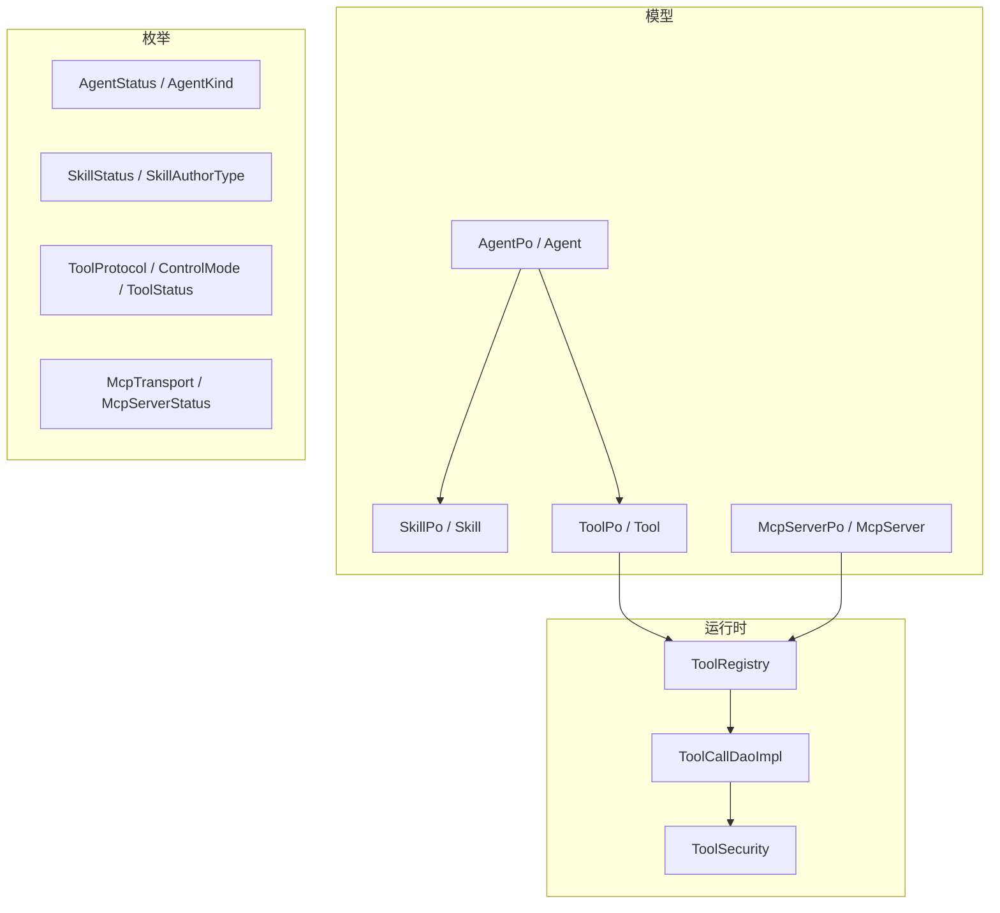
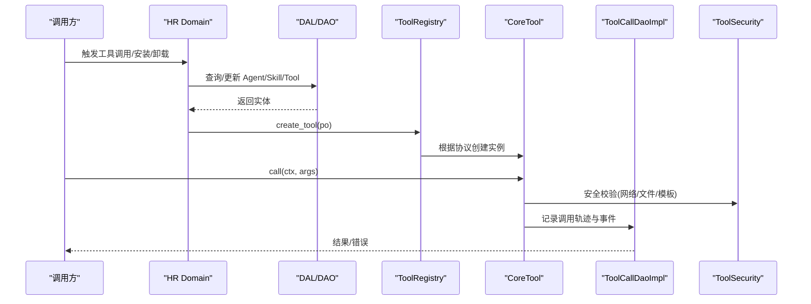
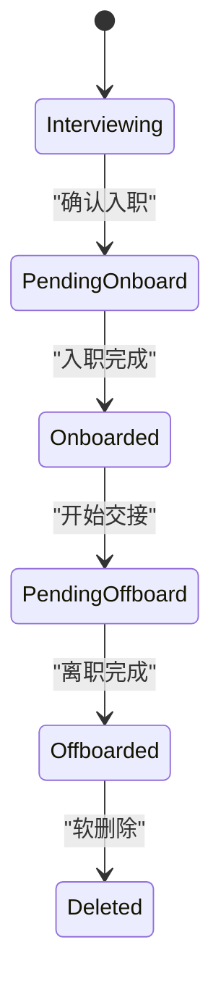
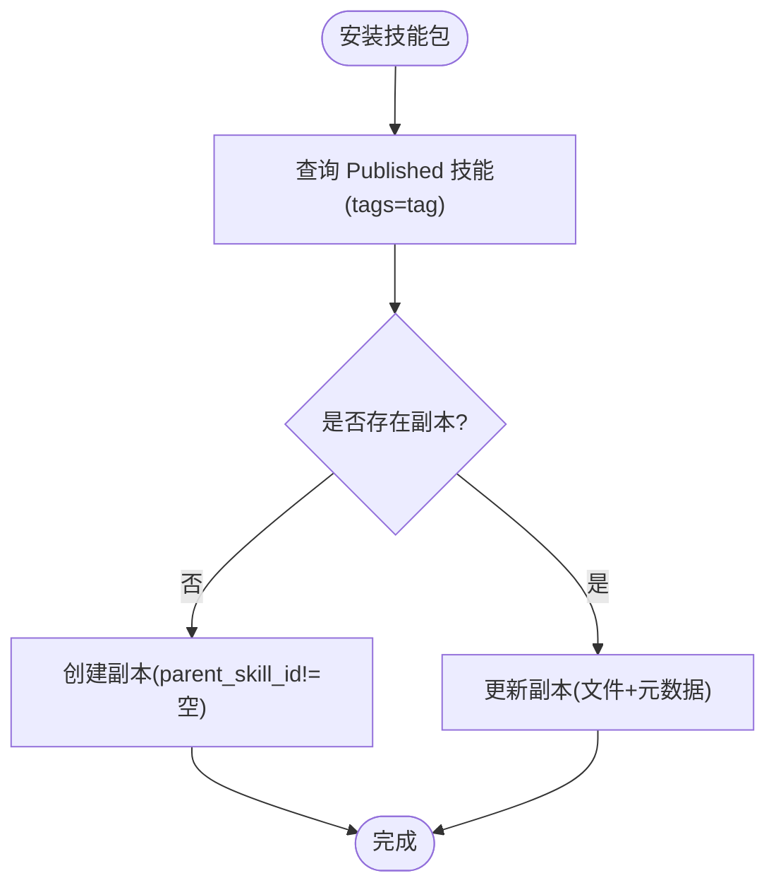
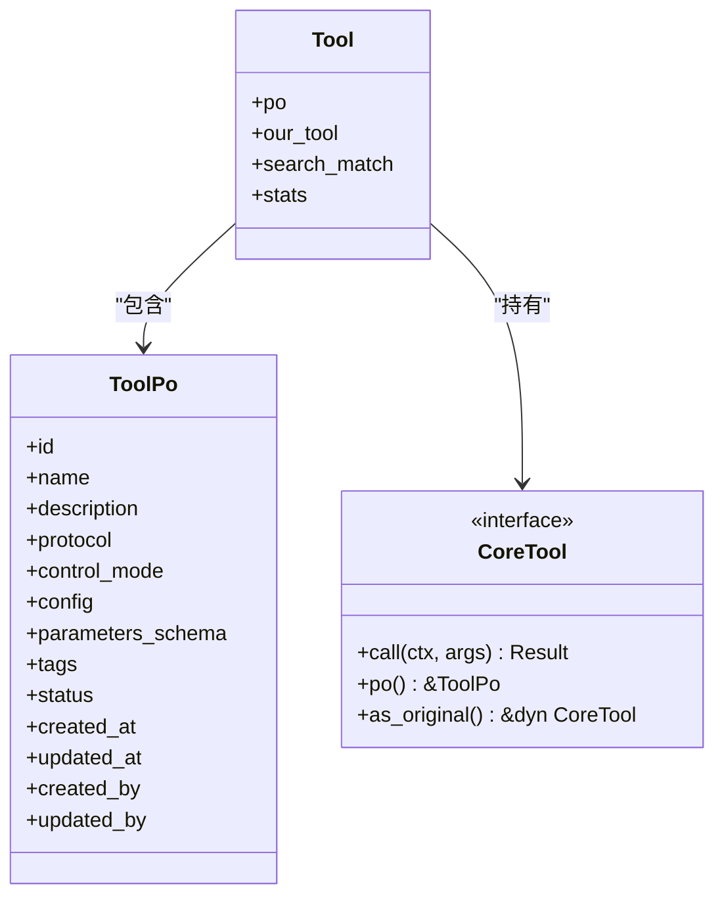
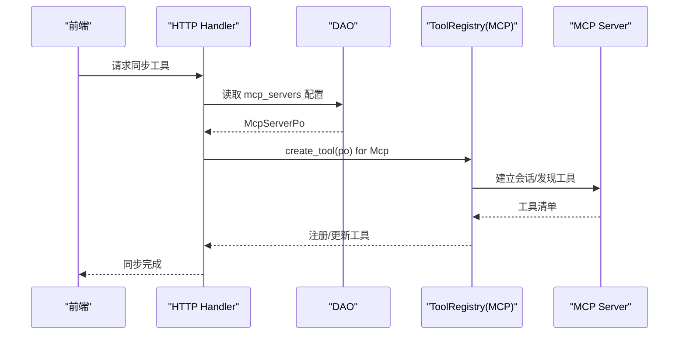
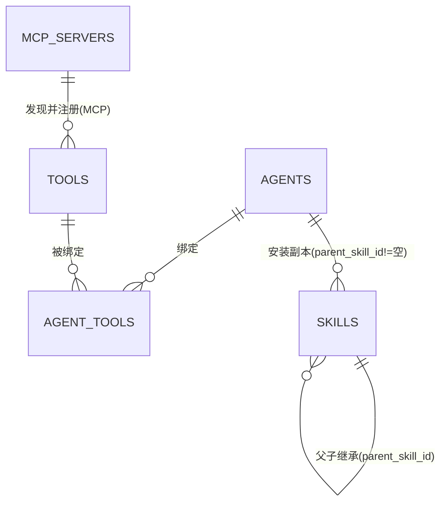
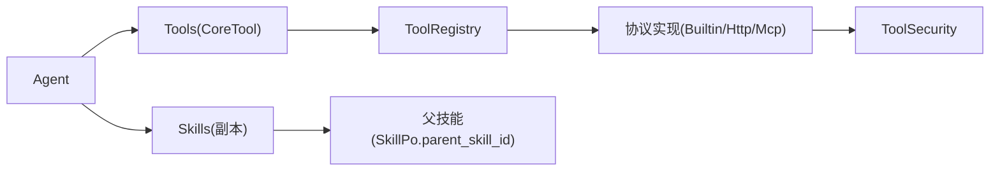

# Agent 和技能模型

<cite>
**本文引用的文件**
- [src/models/agent.rs](file://src/models/agent.rs)
- [common/src/enums/agent.rs](file://common/src/enums/agent.rs)
- [common/src/enums/agent_kind.rs](file://common/src/enums/agent_kind.rs)
- [src/models/skill.rs](file://src/models/skill.rs)
- [common/src/enums/skill.rs](file://common/src/enums/skill.rs)
- [src/models/tool.rs](file://src/models/tool.rs)
- [common/src/enums/tool.rs](file://common/src/enums/tool.rs)
- [src/models/mcp_server.rs](file://src/models/mcp_server.rs)
- [common/src/enums/mcp_server.rs](file://common/src/enums/mcp_server.rs)
- [migrations/20260420000000_initial.sql](file://migrations/20260420000000_initial.sql)
- [migrations/20260623000000_mcp_servers.sql](file://migrations/20260623000000_mcp_servers.sql)
- [src/pkg/tool_registry/mod.rs](file://src/pkg/tool_registry/mod.rs)
- [src/pkg/tool_registry/tool_security.rs](file://src/pkg/tool_registry/tool_security.rs)
- [src/service/domain/hr/mod.rs](file://src/service/domain/hr/mod.rs)
- [src/service/dao/tool_call/impl.rs](file://src/service/dao/tool_call/impl.rs)
</cite>

## 目录
1. [简介](#简介)
2. [项目结构](#项目结构)
3. [核心组件](#核心组件)
4. [架构总览](#架构总览)
5. [详细组件分析](#详细组件分析)
6. [依赖关系分析](#依赖关系分析)
7. [性能考量](#性能考量)
8. [故障排查指南](#故障排查指南)
9. [结论](#结论)
10. [附录：数据库 Schema 与迁移策略](#附录数据库-schema-与迁移策略)

## 简介
本文件为 AI Orz 的 Agent、Skill、Tool 以及 MCP Server 的数据模型文档，聚焦以下目标：
- Agent 实体的生命周期状态、配置结构与技能绑定关系
- Skill 实体的版本管理、依赖关系与安装机制
- Tool 实体的注册模式、执行上下文与安全控制
- MCP Server 的集成配置与工具发现机制
- 实体间复杂关系、继承层次与多态处理
- 完整数据库 schema 设计与迁移策略

## 项目结构
围绕数据模型的代码主要分布在以下模块：
- 模型定义：Agent、Skill、Tool、MCP Server
- 枚举类型：AgentStatus、AgentKind、SkillStatus、ToolProtocol、ControlMode、McpTransport/McpServerStatus
- 工具注册与执行：全局工具注册表、安全校验、调用追踪
- 领域服务：HR Domain 对 Agent/Skill 的管理能力（安装/卸载/副本）
- 持久化：SQL 迁移脚本与 DAO/DAL 层

图表来源
- [src/models/agent.rs:15-121](file://src/models/agent.rs#L15-L121)
- [src/models/skill.rs:20-124](file://src/models/skill.rs#L20-L124)
- [src/models/tool.rs:57-106](file://src/models/tool.rs#L57-L106)
- [src/models/mcp_server.rs:17-123](file://src/models/mcp_server.rs#L17-L123)
- [src/pkg/tool_registry/mod.rs:29-102](file://src/pkg/tool_registry/mod.rs#L29-L102)
- [src/service/dao/tool_call/impl.rs:17-44](file://src/service/dao/tool_call/impl.rs#L17-L44)
- [src/pkg/tool_registry/tool_security.rs:17-139](file://src/pkg/tool_registry/tool_security.rs#L17-L139)

章节来源
- [src/models/agent.rs:15-121](file://src/models/agent.rs#L15-L121)
- [src/models/skill.rs:20-124](file://src/models/skill.rs#L20-L124)
- [src/models/tool.rs:57-106](file://src/models/tool.rs#L57-L106)
- [src/models/mcp_server.rs:17-123](file://src/models/mcp_server.rs#L17-L123)
- [src/pkg/tool_registry/mod.rs:29-102](file://src/pkg/tool_registry/mod.rs#L29-L102)
- [src/service/dao/tool_call/impl.rs:17-44](file://src/service/dao/tool_call/impl.rs#L17-L44)
- [src/pkg/tool_registry/tool_security.rs:17-139](file://src/pkg/tool_registry/tool_security.rs#L17-L139)

## 核心组件
- Agent
  - 业务聚合体：包含持久化对象 AgentPo、Brain、Tools、Skills、运行时信息与统计等
  - 运行时配置：AgentRuntimeConfig（思考深度、轮次、工具调用限制、反思开关、用户确认、已安装标签/技能包、外部执行器配置）
  - 外部执行器：CLI 或 Remote（A2A），通过 ExternalAgentConfig 区分
- Skill
  - 持久化对象 SkillPo：名称、描述、标签、分类、父技能ID、作者信息、状态、内容路径
  - 业务实体 Skill：PO + 文件列表 + 搜索元信息；支持向量化
- Tool
  - 持久化对象 ToolPo：协议（Builtin/Http/Mcp）、控制模式（Auto/Manual）、配置、参数 Schema、标签、状态
  - 业务实体 Tool：PO + 可执行 CoreTool trait 对象 + 搜索/统计元信息
  - 管理面占位实现：不可执行的 ManagementOnlyTool
- MCP Server
  - 连接配置 McpServerConfig：stdio（command/args/env）或 streamable_http（url/headers），超时与响应大小限制
  - 状态：Enabled/Disabled/Deleted；传输：Stdio/StreamableHttp

章节来源
- [src/models/agent.rs:15-121](file://src/models/agent.rs#L15-L121)
- [src/models/agent.rs:186-328](file://src/models/agent.rs#L186-L328)
- [src/models/agent.rs:330-553](file://src/models/agent.rs#L330-L553)
- [src/models/skill.rs:20-124](file://src/models/skill.rs#L20-L124)
- [src/models/tool.rs:57-106](file://src/models/tool.rs#L57-L106)
- [src/models/mcp_server.rs:97-123](file://src/models/mcp_server.rs#L97-L123)
- [src/models/mcp_server.rs:224-280](file://src/models/mcp_server.rs#L224-L280)

## 架构总览
Agent 作为编排中心，装配 Brain 与 Tools，并可安装/卸载 Skills。工具通过全局注册表按协议分发到具体实现，执行时携带 RequestContext，并记录调用轨迹。MCP Server 提供远程工具发现与执行通道。

图表来源
- [src/pkg/tool_registry/mod.rs:81-102](file://src/pkg/tool_registry/mod.rs#L81-L102)
- [src/service/dao/tool_call/impl.rs:118-154](file://src/service/dao/tool_call/impl.rs#L118-L154)
- [src/pkg/tool_registry/tool_security.rs:92-139](file://src/pkg/tool_registry/tool_security.rs#L92-L139)
- [src/service/domain/hr/mod.rs:154-247](file://src/service/domain/hr/mod.rs#L154-L247)

## 详细组件分析

### Agent 实体与生命周期
- 生命周期状态（AgentStatus）
  - Deleted → Interviewing → PendingOnboard → Onboarded → PendingOffboard → Offboarded
  - 默认初始状态为 Interviewing；入职就绪需校验工具绑定与技能安装
- 运行时状态（内存）
  - Idle/Resting/Busy；Resting/Busy 不接受新消息
- 类型（AgentKind）
  - Local：本地 Brain + Tools
  - Cli：子进程包装（命令、参数、工作目录、环境变量、超时、Prompt 模板）
  - Remote：A2A 远程（endpoint、agent_name、auth_token、超时）
- 运行时配置（AgentRuntimeConfig）
  - 最大思考深度、单次唤醒最大思考轮次、思考间隔、单步最大工具调用次数
  - 是否启用反思、是否需要用户确认
  - 已安装工具包 tags、已安装技能包 tags
  - 外部执行器配置（Cli/Remote）

图表来源
- [common/src/enums/agent.rs:8-30](file://common/src/enums/agent.rs#L8-L30)
- [common/src/enums/agent.rs:64-99](file://common/src/enums/agent.rs#L64-L99)
- [common/src/enums/agent_kind.rs:8-25](file://common/src/enums/agent_kind.rs#L8-L25)
- [src/models/agent.rs:15-121](file://src/models/agent.rs#L15-L121)
- [src/models/agent.rs:330-553](file://src/models/agent.rs#L330-L553)

章节来源
- [common/src/enums/agent.rs:8-99](file://common/src/enums/agent.rs#L8-L99)
- [common/src/enums/agent_kind.rs:8-80](file://common/src/enums/agent_kind.rs#L8-L80)
- [src/models/agent.rs:15-121](file://src/models/agent.rs#L15-L121)
- [src/models/agent.rs:330-553](file://src/models/agent.rs#L330-L553)

### Skill 实体与版本管理
- 字段与关系
  - id/name/description/tags/category
  - parent_skill_id：用于技能树演进与副本溯源
  - author_id/author_type：用户或 Agent 创建
  - status：Draft/Published/Expired
  - content_path：相对 base_data_path 的技能目录路径
- 安装机制
  - 按 tag 批量安装到 Agent 目录，生成副本（parent_skill_id 不为空）
  - 支持重新安装以覆盖副本（更新文件与元数据）
  - 支持单技能卸载（仅限副本）与技能包卸载（可选删除副本）
- 向量化
  - Skill 与 SkillPo 均实现 Vectorizable，文本由 name/description/tags 组成

图表来源
- [src/models/skill.rs:20-124](file://src/models/skill.rs#L20-L124)
- [src/models/skill.rs:127-150](file://src/models/skill.rs#L127-L150)
- [src/service/domain/hr/mod.rs:249-290](file://src/service/domain/hr/mod.rs#L249-L290)
- [src/service/domain/hr/mod.rs:355-392](file://src/service/domain/hr/mod.rs#L355-L392)

章节来源
- [src/models/skill.rs:20-124](file://src/models/skill.rs#L20-L124)
- [common/src/enums/skill.rs:6-79](file://common/src/enums/skill.rs#L6-L79)
- [src/service/domain/hr/mod.rs:249-392](file://src/service/domain/hr/mod.rs#L249-L392)

### Tool 实体与注册模式
- 协议与控制模式
  - Protocol：Builtin/Http/Mcp
  - ControlMode：Auto（Rig 原生自动处理）/ Manual（自建链路手动处理）
  - Status：Enabled/Disabled/Stale（远端工具消失/改名）
- 注册模式
  - 全局 ToolRegistry 维护各协议的工厂
  - create_tool(po) 根据协议分派：
    - Builtin：从内置工厂创建
    - Http：使用协议级工厂
    - Mcp：当前阶段为配置驱动桩，后续由专用工厂注入依赖
- 执行上下文与安全
  - 执行时携带 RequestContext（组织/用户/Agent/Task/Project）
  - 安全控制：URL 白名单/黑名单、SSRF 防护、敏感头脱敏、响应体大小限制、文件系统沙箱、模板边界校验

图表来源
- [src/models/tool.rs:57-106](file://src/models/tool.rs#L57-L106)
- [src/models/tool.rs:16-34](file://src/models/tool.rs#L16-L34)
- [common/src/enums/tool.rs:9-162](file://common/src/enums/tool.rs#L9-L162)
- [src/pkg/tool_registry/mod.rs:29-102](file://src/pkg/tool_registry/mod.rs#L29-L102)

章节来源
- [src/models/tool.rs:57-106](file://src/models/tool.rs#L57-L106)
- [common/src/enums/tool.rs:9-162](file://common/src/enums/tool.rs#L9-L162)
- [src/pkg/tool_registry/mod.rs:29-102](file://src/pkg/tool_registry/mod.rs#L29-L102)
- [src/pkg/tool_registry/tool_security.rs:92-139](file://src/pkg/tool_registry/tool_security.rs#L92-L139)

### MCP Server 集成与工具发现
- 传输与配置
  - Stdio：command/args/env
  - StreamableHttp：url/headers
  - 超时与响应大小限制
- 状态与索引
  - Enabled/Disabled/Deleted
  - 唯一索引：active(name WHERE status!=Deleted)
- 工具发现
  - 前端详情页支持“同步工具”，后端触发 MCP 工具同步流程（当前阶段为配置驱动桩）

图表来源
- [migrations/20260623000000_mcp_servers.sql:4-20](file://migrations/20260623000000_mcp_servers.sql#L4-L20)
- [src/models/mcp_server.rs:17-123](file://src/models/mcp_server.rs#L17-L123)
- [src/models/mcp_server.rs:224-280](file://src/models/mcp_server.rs#L224-L280)
- [src/pkg/tool_registry/mod.rs:92-100](file://src/pkg/tool_registry/mod.rs#L92-L100)

章节来源
- [migrations/20260623000000_mcp_servers.sql:4-20](file://migrations/20260623000000_mcp_servers.sql#L4-L20)
- [src/models/mcp_server.rs:17-123](file://src/models/mcp_server.rs#L17-L123)
- [src/models/mcp_server.rs:224-280](file://src/models/mcp_server.rs#L224-L280)
- [src/pkg/tool_registry/mod.rs:92-100](file://src/pkg/tool_registry/mod.rs#L92-L100)

### 实体关系与多态
- 关系
  - Agent ↔ Tool：通过 agent_tools 关联表绑定
  - Agent ↔ Skill：通过 runtime_config.installed_tags/installed_skill_packs 与副本（parent_skill_id）关联
  - Tool ↔ MCP Server：MCP 工具由 MCP Server 发现并注册
- 多态
  - CoreTool 接口统一不同协议工具的调用方式
  - AgentKind 决定执行后端（Local/Cli/Remote）
  - ToolProtocol 决定工具实现与注册路径

图表来源
- [migrations/20260420000000_initial.sql:202-244](file://migrations/20260420000000_initial.sql#L202-L244)
- [src/models/agent.rs:186-328](file://src/models/agent.rs#L186-L328)
- [src/models/skill.rs:20-124](file://src/models/skill.rs#L20-L124)
- [src/models/tool.rs:57-106](file://src/models/tool.rs#L57-L106)
- [src/models/mcp_server.rs:224-280](file://src/models/mcp_server.rs#L224-L280)

章节来源
- [migrations/20260420000000_initial.sql:202-244](file://migrations/20260420000000_initial.sql#L202-L244)
- [src/models/agent.rs:186-328](file://src/models/agent.rs#L186-L328)
- [src/models/skill.rs:20-124](file://src/models/skill.rs#L20-L124)
- [src/models/tool.rs:57-106](file://src/models/tool.rs#L57-L106)
- [src/models/mcp_server.rs:224-280](file://src/models/mcp_server.rs#L224-L280)

## 依赖关系分析
- 低耦合高内聚
  - 模型层仅承载数据结构与基础方法
  - 领域层（HR Domain）编排业务规则（状态流转、安装/卸载）
  - DAL/DAO 负责数据访问与执行抽象
  - 工具注册表按协议解耦实现
- 关键依赖链
  - Agent 装配 Tools/Skills → ToolRegistry 创建 CoreTool → ToolCallDaoImpl 记录轨迹 → ToolSecurity 安全校验
  - Skill 副本通过 parent_skill_id 形成继承树，便于版本演进与回滚

图表来源
- [src/models/agent.rs:186-328](file://src/models/agent.rs#L186-L328)
- [src/pkg/tool_registry/mod.rs:29-102](file://src/pkg/tool_registry/mod.rs#L29-L102)
- [src/pkg/tool_registry/tool_security.rs:92-139](file://src/pkg/tool_registry/tool_security.rs#L92-L139)
- [src/models/skill.rs:20-124](file://src/models/skill.rs#L20-L124)

章节来源
- [src/models/agent.rs:186-328](file://src/models/agent.rs#L186-L328)
- [src/pkg/tool_registry/mod.rs:29-102](file://src/pkg/tool_registry/mod.rs#L29-L102)
- [src/pkg/tool_registry/tool_security.rs:92-139](file://src/pkg/tool_registry/tool_security.rs#L92-L139)
- [src/models/skill.rs:20-124](file://src/models/skill.rs#L20-L124)

## 性能考量
- 工具调用
  - Auto 工具适合简单场景；Manual 工具用于关键路径，便于收敛控制
  - 限制单步最大工具调用次数与思考轮次，避免无限循环
- 资源限制
  - HTTP 响应体大小限制、超时时间上限
  - 文件系统沙箱与敏感文件拦截
- 搜索与向量化
  - Agent/Skill/Tool 均实现 Vectorizable，提升检索效率
  - 合理使用 tags 与 category 进行过滤

[本节为通用指导，不直接分析具体文件]

## 故障排查指南
- 工具不可用
  - 检查 ToolStatus：Stale 表示远端工具消失/改名，需重新同步
  - 检查 ControlMode：Manual 需要确保链路正确接入
- 安全拒绝
  - URL 不在白名单或命中黑名单；解析到本地网络但未允许
  - 文件名匹配敏感模式；路径超出沙箱范围
- 技能安装失败
  - 副本归属校验失败（非该 Agent 的副本）
  - 乐观锁冲突（并发编辑 skill.md）

章节来源
- [src/models/tool.rs:163-201](file://src/models/tool.rs#L163-L201)
- [src/pkg/tool_registry/tool_security.rs:92-139](file://src/pkg/tool_registry/tool_security.rs#L92-L139)
- [src/pkg/tool_registry/tool_security.rs:335-419](file://src/pkg/tool_registry/tool_security.rs#L335-L419)
- [src/service/domain/hr/mod.rs:355-392](file://src/service/domain/hr/mod.rs#L355-L392)

## 结论
本模型以 Agent 为核心，结合 Skill 的版本化与安装机制、Tool 的多协议注册与执行、以及 MCP Server 的工具发现，构建了可扩展、安全可控的智能体能力体系。通过清晰的枚举、分层架构与严格的安全校验，系统能够在保证稳定性的同时快速扩展新能力。

[本节为总结性内容，不直接分析具体文件]

## 附录：数据库 Schema 与迁移策略
- 核心表
  - agents：Agent 基本信息与运行时配置（JSON）
  - tools：工具元数据（协议、控制模式、配置、Schema、标签、状态）
  - agent_tools：Agent 与工具绑定关系
  - skills：技能元数据与内容路径（支持父子继承）
  - mcp_servers：MCP Server 连接配置（传输、配置 JSON、状态）
- 迁移策略
  - 增量迁移：新增字段/表通过独立迁移文件（如 mcp_servers）
  - 向后兼容：JSON 字段（runtime_config/config）便于平滑扩展
  - 索引优化：针对常用查询字段建立索引（如 skills.status/category/updated_at）

章节来源
- [migrations/20260420000000_initial.sql:39-244](file://migrations/20260420000000_initial.sql#L39-L244)
- [migrations/20260623000000_mcp_servers.sql:4-20](file://migrations/20260623000000_mcp_servers.sql#L4-L20)