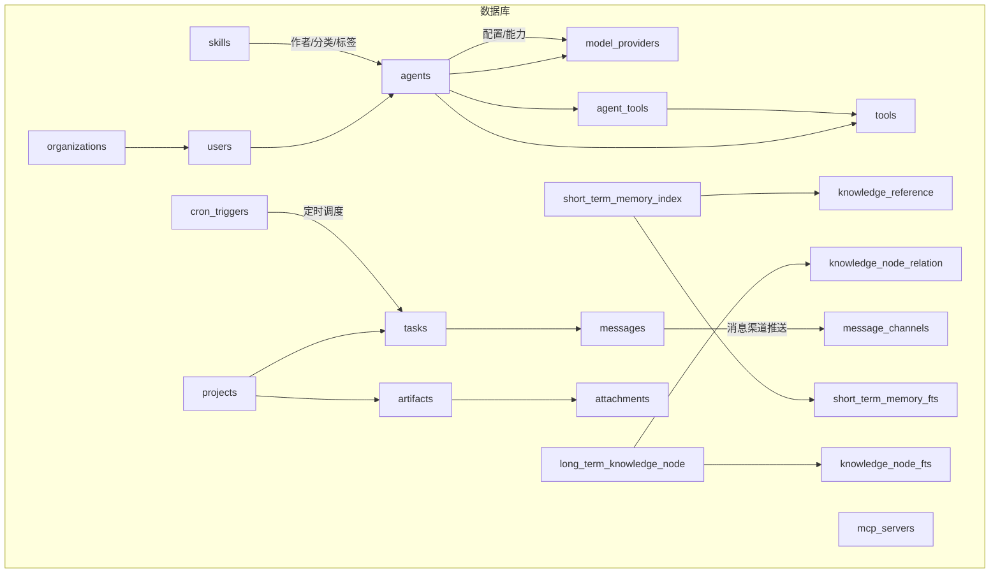
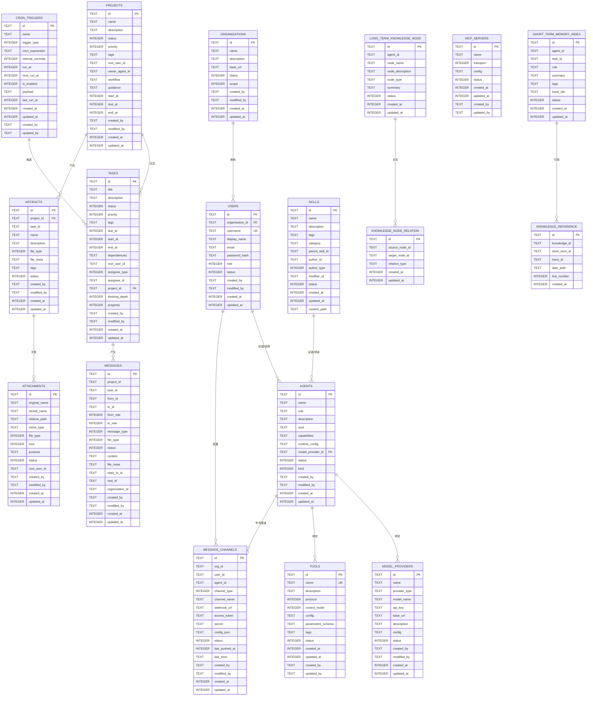
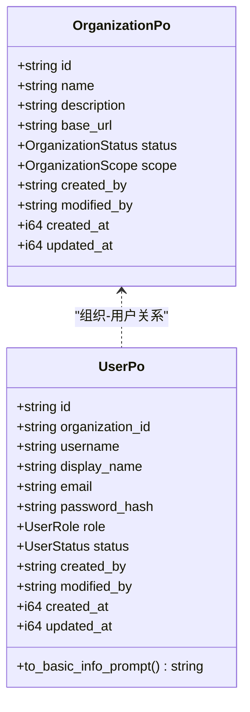
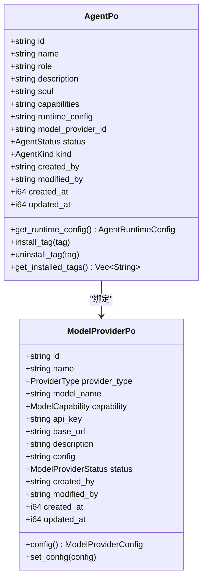
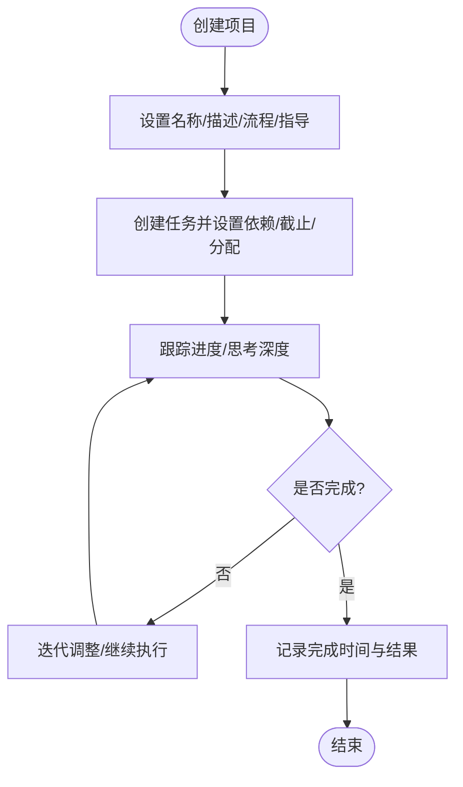
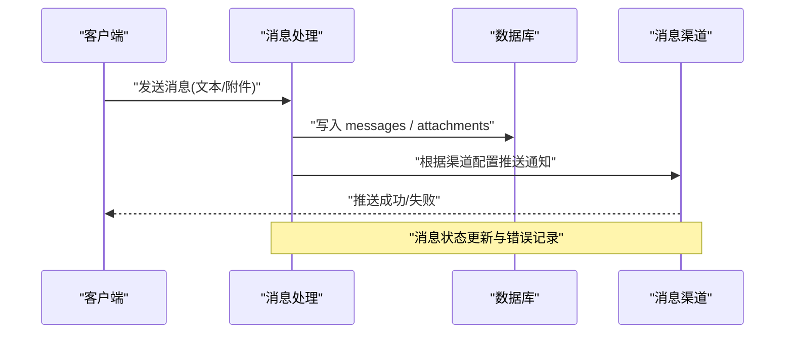
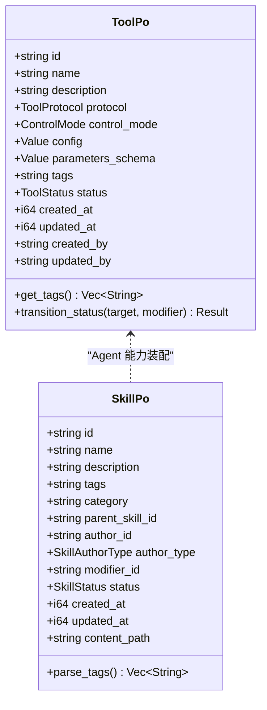
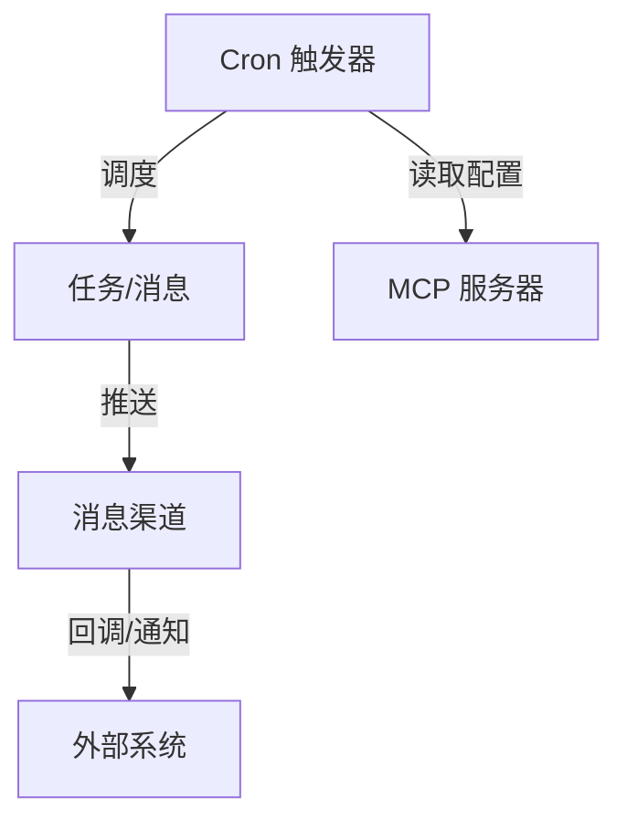
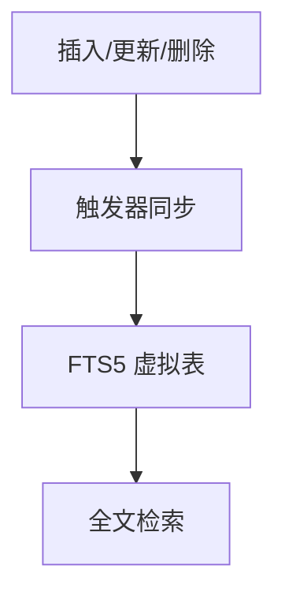
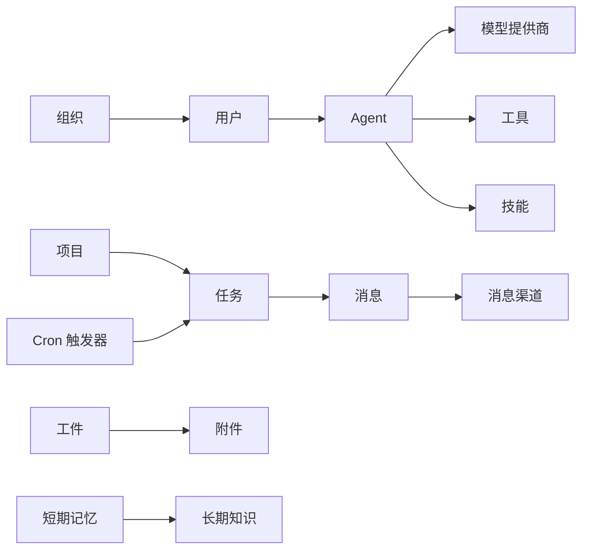

# 数据模型

<cite>
**本文引用的文件**
- [20260420000000_initial.sql](file://migrations/20260420000000_initial.sql)
- [20260508000000_message_channels.sql](file://migrations/20260508000000_message_channels.sql)
- [20260617000000_attachments.sql](file://migrations/20260617000000_attachments.sql)
- [20260623000000_mcp_servers.sql](file://migrations/20260623000000_mcp_servers.sql)
- [20260711000000_cron_triggers.sql](file://migrations/20260711000000_cron_triggers.sql)
- [20260712000000_memory_fts5.sql](file://migrations/20260712000000_memory_fts5.sql)
- [organization.rs](file://src/models/organization.rs)
- [user.rs](file://src/models/user.rs)
- [agent.rs](file://src/models/agent.rs)
- [project.rs](file://src/models/project.rs)
- [task.rs](file://src/models/task.rs)
- [message.rs](file://src/models/message.rs)
- [skill.rs](file://src/models/skill.rs)
- [tool.rs](file://src/models/tool.rs)
- [model_provider.rs](file://src/models/model_provider.rs)
</cite>

## 目录
1. [简介](#简介)
2. [项目结构](#项目结构)
3. [核心组件](#核心组件)
4. [架构总览](#架构总览)
5. [详细组件分析](#详细组件分析)
6. [依赖关系分析](#依赖关系分析)
7. [性能考虑](#性能考虑)
8. [故障排查指南](#故障排查指南)
9. [结论](#结论)
10. [附录](#附录)

## 简介
本文件为 AI Orz 的数据模型文档，覆盖核心实体关系、字段定义与数据类型、主键/外键与索引约束、数据验证与业务规则、数据库 Schema 图与示例数据、数据访问模式与缓存策略、性能考量、数据生命周期与归档、迁移路径与版本管理、数据安全与隐私以及访问控制。目标是为研发、运维与审计提供统一、可追溯的数据层参考。

## 项目结构
- 数据库 Schema 以 SQL 迁移文件为主，位于 migrations 目录；初始版本合并于 20260420000000_initial.sql，后续增量变更通过独立迁移文件演进。
- 应用侧持久化对象（PO）与领域实体位于 src/models，对应各表结构与业务语义。
- 全文检索通过 FTS5 虚拟表与触发器实现，针对短期记忆与知识节点等高频查询场景。

**图表来源**
- [20260420000000_initial.sql:9-273](file://migrations/20260420000000_initial.sql#L9-L273)
- [20260508000000_message_channels.sql:5-31](file://migrations/20260508000000_message_channels.sql#L5-L31)
- [20260617000000_attachments.sql:2-23](file://migrations/20260617000000_attachments.sql#L2-L23)
- [20260623000000_mcp_servers.sql:4-20](file://migrations/20260623000000_mcp_servers.sql#L4-L20)
- [20260711000000_cron_triggers.sql:4-25](file://migrations/20260711000000_cron_triggers.sql#L4-L25)
- [20260712000000_memory_fts5.sql:16-92](file://migrations/20260712000000_memory_fts5.sql#L16-L92)

**章节来源**
- [20260420000000_initial.sql:9-273](file://migrations/20260420000000_initial.sql#L9-L273)
- [20260508000000_message_channels.sql:5-31](file://migrations/20260508000000_message_channels.sql#L5-L31)
- [20260617000000_attachments.sql:2-23](file://migrations/20260617000000_attachments.sql#L2-L23)
- [20260623000000_mcp_servers.sql:4-20](file://migrations/20260623000000_mcp_servers.sql#L4-L20)
- [20260711000000_cron_triggers.sql:4-25](file://migrations/20260711000000_cron_triggers.sql#L4-L25)
- [20260712000000_memory_fts5.sql:16-92](file://migrations/20260712000000_memory_fts5.sql#L16-L92)

## 核心组件
- 组织与用户：多租户隔离的基础单元，用户归属组织，具备角色与状态。
- Agent：AI 智能体，绑定模型提供商，支持运行时配置、工具与技能装配。
- 模型提供商：LLM 接入配置，包含能力、限流与配额等参数。
- 项目与任务：项目管理与任务分解，任务可关联项目并具备依赖、进度与时间线。
- 消息：跨角色通信载体，支持文本与附件，支持回复链与上下文注入。
- 工件与附件：产物与通用文件资产，支持元数据与用途标记。
- 工具与技能：Agent 能力扩展，工具协议多样，技能支持树状继承与标签分类。
- 消息渠道：外部推送通道（飞书、微信、Slack、邮件、Webhook），支持按用户/Agent 绑定。
- MCP Server：外部工具服务连接配置，支持多种传输方式。
- Cron 触发器：定时任务调度，支持一次性、Cron 表达式与间隔执行。
- 短期记忆与长期知识：记忆索引与知识图谱节点，配合 FTS5 全文检索。

**章节来源**
- [organization.rs:10-62](file://src/models/organization.rs#L10-L62)
- [user.rs:10-98](file://src/models/user.rs#L10-L98)
- [agent.rs:15-709](file://src/models/agent.rs#L15-L709)
- [model_provider.rs:9-248](file://src/models/model_provider.rs#L9-L248)
- [project.rs:15-359](file://src/models/project.rs#L15-L359)
- [task.rs:16-343](file://src/models/task.rs#L16-L343)
- [message.rs:18-690](file://src/models/message.rs#L18-L690)
- [skill.rs:9-193](file://src/models/skill.rs#L9-L193)
- [tool.rs:14-314](file://src/models/tool.rs#L14-L314)
- [20260508000000_message_channels.sql:5-31](file://migrations/20260508000000_message_channels.sql#L5-L31)
- [20260617000000_attachments.sql:2-23](file://migrations/20260617000000_attachments.sql#L2-L23)
- [20260623000000_mcp_servers.sql:4-20](file://migrations/20260623000000_mcp_servers.sql#L4-L20)
- [20260711000000_cron_triggers.sql:4-25](file://migrations/20260711000000_cron_triggers.sql#L4-L25)
- [20260712000000_memory_fts5.sql:16-92](file://migrations/20260712000000_memory_fts5.sql#L16-L92)

## 架构总览
下图展示核心实体之间的关系与关键约束，体现多租户、Agent 能力装配、项目-任务-消息链路、知识与记忆索引等。

**图表来源**
- [20260420000000_initial.sql:9-273](file://migrations/20260420000000_initial.sql#L9-L273)
- [20260508000000_message_channels.sql:5-31](file://migrations/20260508000000_message_channels.sql#L5-L31)
- [20260617000000_attachments.sql:2-23](file://migrations/20260617000000_attachments.sql#L2-L23)
- [20260623000000_mcp_servers.sql:4-20](file://migrations/20260623000000_mcp_servers.sql#L4-L20)
- [20260711000000_cron_triggers.sql:4-25](file://migrations/20260711000000_cron_triggers.sql#L4-L25)

## 详细组件分析

### 组织与用户
- 组织：唯一标识、名称、描述、基础 URL、状态与范围（本地/远程）。用于多租户隔离与前端链接生成。
- 用户：归属组织、用户名唯一、显示名、邮箱、密码哈希、角色与状态。支持将用户信息序列化为 Prompt 片段供 Agent 感知。

**图表来源**
- [organization.rs:10-62](file://src/models/organization.rs#L10-L62)
- [user.rs:10-98](file://src/models/user.rs#L10-L98)

**章节来源**
- [organization.rs:10-62](file://src/models/organization.rs#L10-L62)
- [user.rs:10-98](file://src/models/user.rs#L10-L98)

### Agent 与模型提供商
- Agent：名称、角色、描述、灵魂设定、能力列表、运行时配置（JSON）、状态、类型（Local/Cli/Remote）、创建/修改者与时间戳。运行时配置包含思考深度、轮次限制、工具调用限制、反思模式、用户确认、已安装工具包/技能包 tag、外部执行配置等。
- 模型提供商：提供商类型、模型名称、API Key、基础 URL、描述、配置（JSON，含上下文窗口、推荐长度、输出上限、温度、限流与配额）、状态。

**图表来源**
- [agent.rs:330-709](file://src/models/agent.rs#L330-L709)
- [model_provider.rs:37-248](file://src/models/model_provider.rs#L37-L248)

**章节来源**
- [agent.rs:15-709](file://src/models/agent.rs#L15-L709)
- [model_provider.rs:9-248](file://src/models/model_provider.rs#L9-L248)

### 项目与任务
- 项目：名称、描述、工作流与指导建议、状态、优先级、标签、根用户、负责人 Agent、起止时间、创建/修改信息与时间戳。支持执行计划与结果存储。
- 任务：标题、描述、状态、优先级、标签、截止时间、开始/结束时间、依赖（JSON）、根用户、分配对象类型与 ID、所属项目、思考深度、进度、创建/修改信息与时间戳。支持执行计划与结果存储。

**图表来源**
- [project.rs:15-359](file://src/models/project.rs#L15-L359)
- [task.rs:16-343](file://src/models/task.rs#L16-L343)

**章节来源**
- [project.rs:15-359](file://src/models/project.rs#L15-L359)
- [task.rs:16-343](file://src/models/task.rs#L16-L343)

### 消息与附件
- 消息：项目/任务上下文、发送者/接收者、角色、类型、状态、内容、文件元数据、回复链、根消息、组织 ID、创建/修改信息与时间戳。支持事件总线顺序消费与优先级。
- 附件：原始名、存储名、相对路径、MIME、文件类型、大小、用途、状态、根用户、创建/修改信息与时间戳。

**图表来源**
- [message.rs:18-690](file://src/models/message.rs#L18-L690)
- [20260508000000_message_channels.sql:5-31](file://migrations/20260508000000_message_channels.sql#L5-L31)
- [20260617000000_attachments.sql:2-23](file://migrations/20260617000000_attachments.sql#L2-L23)

**章节来源**
- [message.rs:18-690](file://src/models/message.rs#L18-L690)
- [20260508000000_message_channels.sql:5-31](file://migrations/20260508000000_message_channels.sql#L5-L31)
- [20260617000000_attachments.sql:2-23](file://migrations/20260617000000_attachments.sql#L2-L23)

### 工具与技能
- 工具：名称唯一、描述、协议类型（内置/HTTP/MCP）、控制模式、配置 JSON、参数 Schema、标签、状态、创建/更新时间与人员。支持状态迁移与统计注入。
- 技能：名称、描述、标签、分类、父技能、作者与类型、修改者、状态、时间戳、内容路径。支持向量化与搜索匹配。

**图表来源**
- [tool.rs:57-314](file://src/models/tool.rs#L57-L314)
- [skill.rs:20-193](file://src/models/skill.rs#L20-L193)

**章节来源**
- [tool.rs:14-314](file://src/models/tool.rs#L14-L314)
- [skill.rs:9-193](file://src/models/skill.rs#L9-L193)

### 消息渠道、MCP 服务器与 Cron 触发器
- 消息渠道：组织/用户/Agent 维度配置，渠道类型、名称、回调地址、令牌、密钥、扩展配置、状态、最后推送时间与错误信息。
- MCP 服务器：名称、传输方式（stdio/streamable_http）、配置 JSON、状态、时间戳与人员。
- Cron 触发器：名称、触发类型（一次性/Cron/间隔）、表达式/间隔/运行时间、下次运行时间、启用标志、负载 JSON、上次运行时间、时间戳与人员。

**图表来源**
- [20260508000000_message_channels.sql:5-31](file://migrations/20260508000000_message_channels.sql#L5-L31)
- [20260623000000_mcp_servers.sql:4-20](file://migrations/20260623000000_mcp_servers.sql#L4-L20)
- [20260711000000_cron_triggers.sql:4-25](file://migrations/20260711000000_cron_triggers.sql#L4-L25)

**章节来源**
- [20260508000000_message_channels.sql:5-31](file://migrations/20260508000000_message_channels.sql#L5-L31)
- [20260623000000_mcp_servers.sql:4-20](file://migrations/20260623000000_mcp_servers.sql#L4-L20)
- [20260711000000_cron_triggers.sql:4-25](file://migrations/20260711000000_cron_triggers.sql#L4-L25)

### 短期记忆与长期知识（FTS5）
- 短期记忆索引：摘要与标签，支持 trigram 分词全文检索。
- 长期知识节点：节点名、描述、类型、摘要，支持 trigram 分词全文检索。
- 知识引用：关联知识节点与短期记忆，支持行号定位。
- 知识节点关系：源节点与目标节点的关系类型。

**图表来源**
- [20260712000000_memory_fts5.sql:16-92](file://migrations/20260712000000_memory_fts5.sql#L16-L92)

**章节来源**
- [20260712000000_memory_fts5.sql:16-92](file://migrations/20260712000000_memory_fts5.sql#L16-L92)

## 依赖关系分析
- 组织-用户：一对多，用户归属组织，便于权限与数据隔离。
- 用户-Agent：用户创建或管理 Agent，Agent 绑定模型提供商。
- 项目-任务：项目包含多个任务，任务可关联项目并可有依赖关系。
- 任务-消息：任务产生消息，消息可携带附件与上下文。
- Agent-工具/技能：Agent 装配工具与技能，支持标签与协议差异。
- 消息-渠道：消息可通过多渠道推送，支持用户/Agent 级别配置。
- 工件-附件：工件产出关联附件，支持元数据与用途。
- Cron-任务：Cron 触发器驱动任务执行或消息分发。
- 记忆-知识：短期记忆与长期知识通过引用与关系形成知识图谱，FTS5 加速检索。

**图表来源**
- [20260420000000_initial.sql:9-273](file://migrations/20260420000000_initial.sql#L9-L273)
- [20260508000000_message_channels.sql:5-31](file://migrations/20260508000000_message_channels.sql#L5-L31)
- [20260617000000_attachments.sql:2-23](file://migrations/20260617000000_attachments.sql#L2-L23)
- [20260623000000_mcp_servers.sql:4-20](file://migrations/20260623000000_mcp_servers.sql#L4-L20)
- [20260711000000_cron_triggers.sql:4-25](file://migrations/20260711000000_cron_triggers.sql#L4-L25)

**章节来源**
- [20260420000000_initial.sql:9-273](file://migrations/20260420000000_initial.sql#L9-L273)
- [20260508000000_message_channels.sql:5-31](file://migrations/20260508000000_message_channels.sql#L5-L31)
- [20260617000000_attachments.sql:2-23](file://migrations/20260617000000_attachments.sql#L2-L23)
- [20260623000000_mcp_servers.sql:4-20](file://migrations/20260623000000_mcp_servers.sql#L4-L20)
- [20260711000000_cron_triggers.sql:4-25](file://migrations/20260711000000_cron_triggers.sql#L4-L25)

## 性能考虑
- 索引优化：为常用查询列建立索引，如 users.organization_id、messages.task_id/from_id/to_id/created_at、skills.status/category/parent_skill_id/updated_at/author_id、artifacts.project_id/task_id/status、mcp_servers.transport/status/created_at、cron_triggers.next_run_at/is_enabled/trigger_type/created_at 等。
- 全文检索：短期记忆与知识节点使用 FTS5 与 trigram 分词，提升中文混合检索效率。
- 批量操作：消息与附件写入建议批量提交，减少事务开销。
- 分页与过滤：对大表（messages、artifacts、skills）采用分页与条件过滤，避免全表扫描。
- 缓存策略：对频繁读取的只读数据（如 skills、tools、model_providers）可在应用层引入内存缓存，结合版本号或时间戳失效。
- 异步处理：消息推送与工具执行结果回写采用异步队列，降低请求延迟。

[本节为通用性能建议，不直接分析具体文件]

## 故障排查指南
- 消息推送失败：检查 message_channels 的 status、last_error 与 webhook_url/access_token/secret 配置是否正确；关注 last_pushed_at 是否更新。
- 工具状态异常：校验 tool.status 与 available_statuses 迁移规则，确保状态转换合法；查看工具配置与协议是否匹配。
- Cron 未触发：核对 cron_triggers.trigger_type、cron_expression/interval_seconds、next_run_at 与 is_enabled；检查 last_run_at 是否更新。
- 全文检索无结果：确认 FTS5 触发器是否生效，检查 short_term_memory_fts/knowledge_node_fts 是否有对应 rowid；必要时重新回填索引。
- 附件无法访问：检查 attachments.relative_path 与存储路径一致性；确认 file_type 与 mime_type 匹配。

**章节来源**
- [20260508000000_message_channels.sql:5-31](file://migrations/20260508000000_message_channels.sql#L5-L31)
- [20260623000000_mcp_servers.sql:4-20](file://migrations/20260623000000_mcp_servers.sql#L4-L20)
- [20260711000000_cron_triggers.sql:4-25](file://migrations/20260711000000_cron_triggers.sql#L4-L25)
- [20260712000000_memory_fts5.sql:16-92](file://migrations/20260712000000_memory_fts5.sql#L16-L92)
- [20260617000000_attachments.sql:2-23](file://migrations/20260617000000_attachments.sql#L2-L23)

## 结论
AI Orz 的数据模型围绕多租户组织与用户、Agent 能力装配、项目-任务-消息链路、知识与记忆索引构建，辅以消息渠道、MCP 服务器与 Cron 触发器等扩展能力。通过严格的迁移管理与索引优化，保障数据一致性与查询性能。建议在应用层引入缓存与异步处理，进一步提升吞吐与响应速度。

[本节为总结性内容，不直接分析具体文件]

## 附录

### 数据验证规则与业务规则
- 组织与用户：用户名唯一；用户必须属于组织；角色与状态受枚举约束。
- Agent：运行时配置 JSON 需符合 AgentRuntimeConfig 结构；外部执行配置需与 Agent 类型匹配。
- 模型提供商：配置 JSON 包含上下文窗口、推荐长度、输出上限、温度、限流与配额；状态受枚举约束。
- 项目与任务：任务依赖为 JSON 数组字符串；进度范围 0-100；状态迁移遵循业务规则。
- 消息：类型与角色受枚举约束；附件消息需填充 file_type 与 file_meta；回复链需维护 root_id。
- 工具：名称唯一；协议与控制模式匹配；状态迁移需通过可用状态集校验。
- 技能：标签为 JSON 数组；分类单一；状态受枚举约束。
- 消息渠道：渠道类型受枚举约束；状态与错误信息需记录；推送失败需更新 last_error。
- MCP 服务器：传输方式受 CHECK 约束；状态受 CHECK 约束。
- Cron 触发器：触发类型受 CHECK 约束；启用标志受 CHECK 约束；表达式与间隔互斥。

**章节来源**
- [user.rs:10-98](file://src/models/user.rs#L10-L98)
- [agent.rs:15-709](file://src/models/agent.rs#L15-L709)
- [model_provider.rs:9-248](file://src/models/model_provider.rs#L9-L248)
- [project.rs:15-359](file://src/models/project.rs#L15-L359)
- [task.rs:16-343](file://src/models/task.rs#L16-L343)
- [message.rs:18-690](file://src/models/message.rs#L18-L690)
- [tool.rs:14-314](file://src/models/tool.rs#L14-L314)
- [skill.rs:9-193](file://src/models/skill.rs#L9-L193)
- [20260508000000_message_channels.sql:5-31](file://migrations/20260508000000_message_channels.sql#L5-L31)
- [20260623000000_mcp_servers.sql:4-20](file://migrations/20260623000000_mcp_servers.sql#L4-L20)
- [20260711000000_cron_triggers.sql:4-25](file://migrations/20260711000000_cron_triggers.sql#L4-L25)

### 数据生命周期、保留策略与归档规则
- 消息：按项目/任务维度归档，历史消息可冷存储；附件按用途与大小分级保留。
- 任务与项目：完成后进入归档状态，保留执行计划与结果；超期未活跃的项目定期清理。
- 记忆与知识：短期记忆按时间窗口滚动清理；长期知识节点与关系保留核心摘要，冗余内容按需压缩。
- 工具与技能：禁用工具保留元数据；技能副本按 Agent 安装情况保留。
- 渠道与 MCP：停用渠道与 MCP 服务器保留配置与日志，便于审计与恢复。
- Cron 触发器：已完成的一次性任务可归档；周期性任务保留最近运行记录。

[本节为通用策略建议，不直接分析具体文件]

### 数据迁移路径与版本管理
- 初始版本：20260420000000_initial.sql 合并所有最新表结构。
- 增量迁移：按日期前缀命名，涵盖消息渠道、附件、MCP 服务器、Cron 触发器、FTS5 索引、任务进度、消息组织与根字段、Agent 类型、渠道作用域、知识节点标签与发布标志、执行计划结果等。
- 版本管理：迁移文件顺序执行，新增迁移需保证幂等与兼容性；FTS5 触发器与存量数据回填需在迁移中完成。

**章节来源**
- [20260420000000_initial.sql:9-273](file://migrations/20260420000000_initial.sql#L9-L273)
- [20260508000000_message_channels.sql:5-31](file://migrations/20260508000000_message_channels.sql#L5-L31)
- [20260617000000_attachments.sql:2-23](file://migrations/20260617000000_attachments.sql#L2-L23)
- [20260623000000_mcp_servers.sql:4-20](file://migrations/20260623000000_mcp_servers.sql#L4-L20)
- [20260711000000_cron_triggers.sql:4-25](file://migrations/20260711000000_cron_triggers.sql#L4-L25)
- [20260712000000_memory_fts5.sql:16-92](file://migrations/20260712000000_memory_fts5.sql#L16-L92)

### 数据安全、隐私要求与访问控制
- 敏感字段：密码哈希、API Key、Secret、Access Token 等需加密存储或安全配置；最小权限原则访问。
- 多租户隔离：组织 ID 作为数据隔离键，查询与写入需校验组织上下文。
- 审计追踪：created_by/modified_by/created_at/updated_at 记录变更轨迹；消息渠道错误信息记录便于问题定位。
- 访问控制：基于角色与组织范围的权限控制；Agent 工具与技能安装需授权；消息推送渠道需认证与签名校验。
- 隐私保护：消息内容与附件需脱敏展示；向量检索避免泄露敏感字段；日志中隐藏敏感信息。

[本节为通用安全建议，不直接分析具体文件]