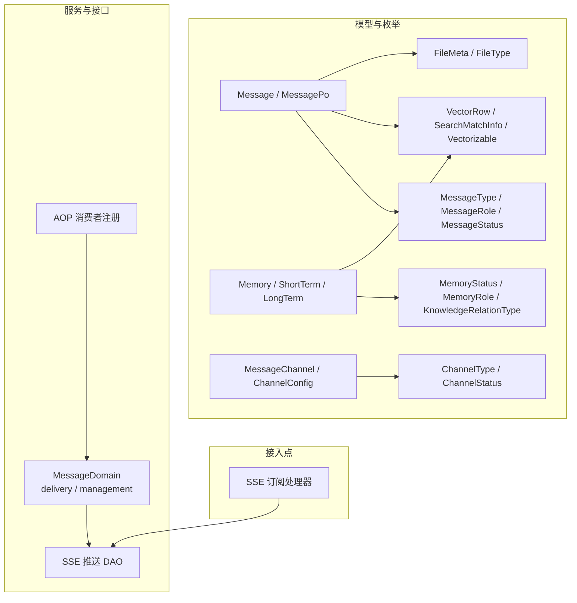
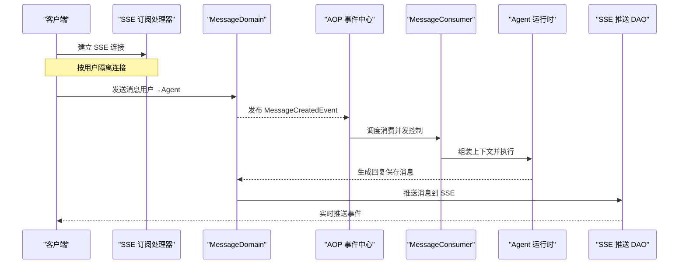
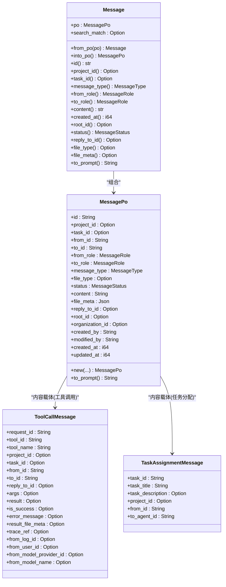
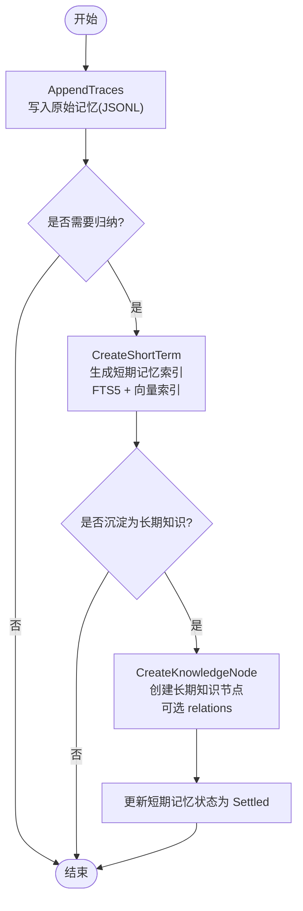
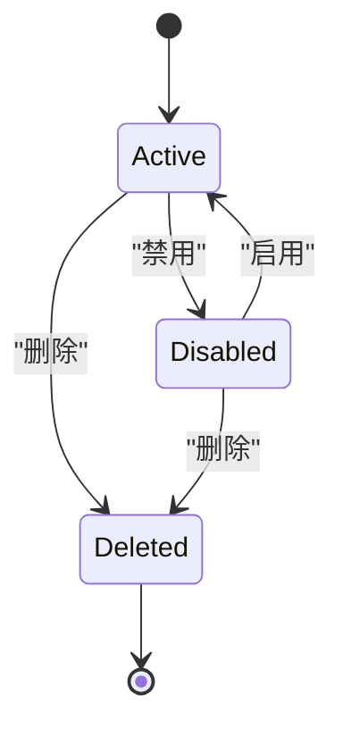
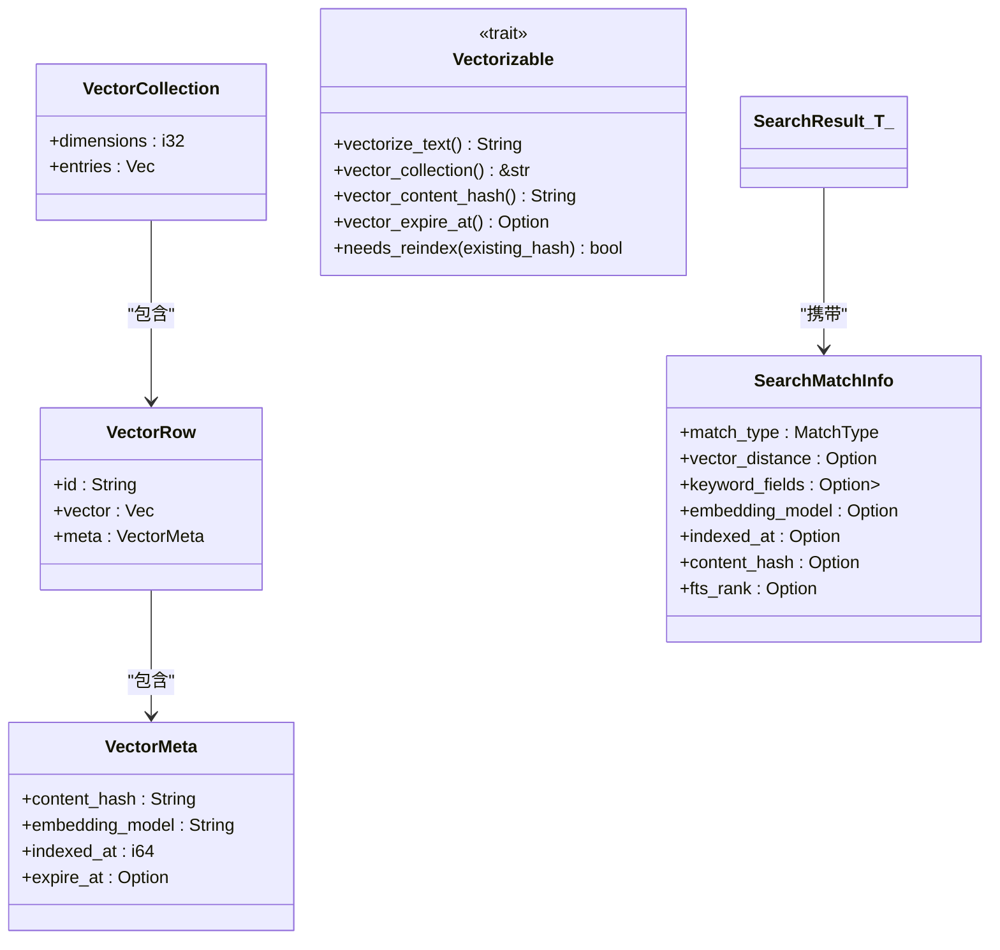
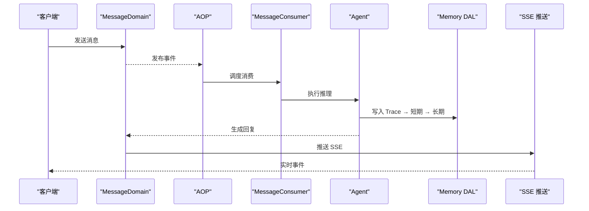
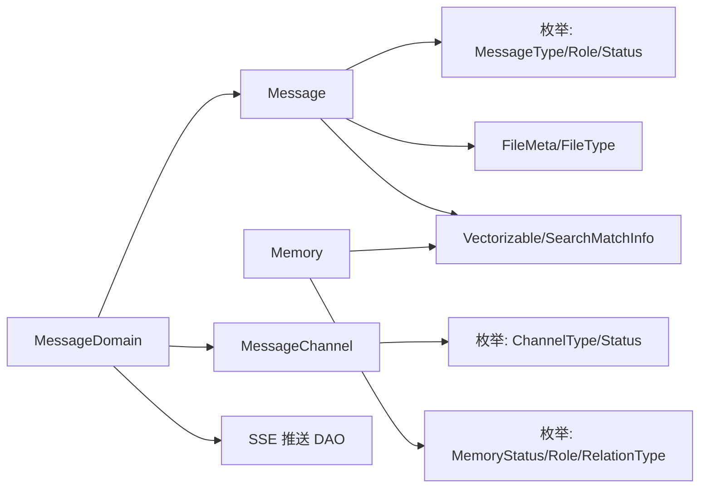

# 消息和记忆模型

<cite>
**本文引用的文件**
- [src/models/message.rs](file://src/models/message.rs)
- [common/src/enums/message.rs](file://common/src/enums/message.rs)
- [src/models/memory.rs](file://src/models/memory.rs)
- [common/src/enums/memory.rs](file://common/src/enums/memory.rs)
- [src/models/message_channel.rs](file://src/models/message_channel.rs)
- [common/src/enums/message_channel.rs](file://common/src/enums/message_channel.rs)
- [src/models/vector.rs](file://src/models/vector.rs)
- [src/models/file.rs](file://src/models/file.rs)
- [common/src/enums/file.rs](file://common/src/enums/file.rs)
- [src/service/domain/message/mod.rs](file://src/service/domain/message/mod.rs)
- [src/handlers/finance/message/subscribe_sse.rs](file://src/handlers/finance/message/subscribe_sse.rs)
- [src/service/dao/message_push.rs](file://src/service/dao/message_push.rs)
- [src/consumer/mod.rs](file://src/consumer/mod.rs)
- [docs/message_interaction_design.md](file://docs/message_interaction_design.md)
</cite>

## 目录
1. [引言](#引言)
2. [项目结构](#项目结构)
3. [核心组件](#核心组件)
4. [架构总览](#架构总览)
5. [详细组件分析](#详细组件分析)
6. [依赖关系分析](#依赖关系分析)
7. [性能考量](#性能考量)
8. [故障排查指南](#故障排查指南)
9. [结论](#结论)
10. [附录](#附录)

## 引言
本文件为 AI Orz 的消息与记忆系统提供全面的数据模型文档，覆盖以下关键主题：
- Message 实体的消息类型、发送接收机制与对话历史（根消息链、回复关联）
- Memory 实体的短期记忆、长期知识节点及沉淀机制
- Message Channel 的多渠道支持与路由规则
- Vector 实体的向量存储、相似度计算与检索优化（FTS5 + 向量混合搜索）
- 实时推送（SSE）、持久化存储与查询性能优化
- 完整的消息流处理与记忆管理策略

## 项目结构
围绕消息与记忆的核心代码分布在 models、enums、service/domain、handlers、consumer 等模块中。数据模型集中在 models 层，枚举定义在 common/enums，领域能力在 service/domain，HTTP 入口在 handlers，异步消费在 consumer。

图表来源
- [src/models/message.rs:18-300](file://src/models/message.rs#L18-L300)
- [common/src/enums/message.rs:7-189](file://common/src/enums/message.rs#L7-L189)
- [src/models/memory.rs:15-320](file://src/models/memory.rs#L15-L320)
- [common/src/enums/memory.rs:12-212](file://common/src/enums/memory.rs#L12-L212)
- [src/models/message_channel.rs:19-255](file://src/models/message_channel.rs#L19-L255)
- [common/src/enums/message_channel.rs:9-122](file://common/src/enums/message_channel.rs#L9-L122)
- [src/models/vector.rs:9-168](file://src/models/vector.rs#L9-L168)
- [src/models/file.rs:6-27](file://src/models/file.rs#L6-L27)
- [common/src/enums/file.rs:11-56](file://common/src/enums/file.rs#L11-L56)
- [src/service/domain/message/mod.rs:70-378](file://src/service/domain/message/mod.rs#L70-L378)
- [src/handlers/finance/message/subscribe_sse.rs:1-42](file://src/handlers/finance/message/subscribe_sse.rs#L1-L42)
- [src/service/dao/message_push.rs:12-136](file://src/service/dao/message_push.rs#L12-L136)
- [src/consumer/mod.rs:16-36](file://src/consumer/mod.rs#L16-L36)

章节来源
- [src/models/message.rs:18-300](file://src/models/message.rs#L18-L300)
- [common/src/enums/message.rs:7-189](file://common/src/enums/message.rs#L7-L189)
- [src/models/memory.rs:15-320](file://src/models/memory.rs#L15-L320)
- [common/src/enums/memory.rs:12-212](file://common/src/enums/memory.rs#L12-L212)
- [src/models/message_channel.rs:19-255](file://src/models/message_channel.rs#L19-L255)
- [common/src/enums/message_channel.rs:9-122](file://common/src/enums/message_channel.rs#L9-L122)
- [src/models/vector.rs:9-168](file://src/models/vector.rs#L9-L168)
- [src/models/file.rs:6-27](file://src/models/file.rs#L6-L27)
- [common/src/enums/file.rs:11-56](file://common/src/enums/file.rs#L11-L56)
- [src/service/domain/message/mod.rs:70-378](file://src/service/domain/message/mod.rs#L70-L378)
- [src/handlers/finance/message/subscribe_sse.rs:1-42](file://src/handlers/finance/message/subscribe_sse.rs#L1-L42)
- [src/service/dao/message_push.rs:12-136](file://src/service/dao/message_push.rs#L12-L136)
- [src/consumer/mod.rs:16-36](file://src/consumer/mod.rs#L16-L36)

## 核心组件
- Message 实体：承载文本与附件消息，支持工具调用请求/结果、确认交互、任务分配与调度通知；通过 root_id 维护消息链，reply_to_id 支持引用回复。
- Memory 实体：包含原始记忆追踪（JSONL）、短期记忆索引（SQLite，可 FTS5+向量）、长期知识节点（SQLite，可 FTS5+向量），以及知识节点关系。
- Message Channel：多通道推送配置（飞书、微信、Slack、邮件、Webhook、A2A 回调），支持状态机与范围控制（用户级/Agent 级/项目级）。
- Vector：统一的向量化抽象（Vectorizable），支持内容哈希、过期策略、相似度距离与混合检索元信息（SearchMatchInfo）。
- 领域能力：MessageDomain 提供 send_to_agent/send_to_user/tool call/task assignment/deliver_message/SSE 订阅等能力。

章节来源
- [src/models/message.rs:18-300](file://src/models/message.rs#L18-L300)
- [src/models/memory.rs:15-320](file://src/models/memory.rs#L15-L320)
- [src/models/message_channel.rs:19-255](file://src/models/message_channel.rs#L19-L255)
- [src/models/vector.rs:9-168](file://src/models/vector.rs#L9-L168)
- [src/service/domain/message/mod.rs:70-378](file://src/service/domain/message/mod.rs#L70-L378)

## 架构总览
消息从 HTTP 进入后，经 Domain 层持久化并触发 AOP 事件，消费者异步处理并唤醒 Agent；Agent 产出回复后再次持久化并通过 SSE 实时推送给前端。记忆系统在思考闭环中产生 Trace，随后归纳为短期记忆，再沉淀为长期知识节点，均支持 FTS5 与向量检索。

图表来源
- [src/handlers/finance/message/subscribe_sse.rs:1-42](file://src/handlers/finance/message/subscribe_sse.rs#L1-L42)
- [src/service/domain/message/mod.rs:259-331](file://src/service/domain/message/mod.rs#L259-L331)
- [src/consumer/mod.rs:16-36](file://src/consumer/mod.rs#L16-L36)
- [src/service/dao/message_push.rs:60-136](file://src/service/dao/message_push.rs#L60-L136)
- [docs/message_interaction_design.md:162-219](file://docs/message_interaction_design.md#L162-L219)

## 详细组件分析

### Message 实体与消息类型
- 角色与类型：支持 User/Agent/System 角色；消息类型涵盖文本、图片、文件、音频、视频、工具调用请求/结果、确认请求/回复、任务分配与调度通知、项目跟进通知。
- 消息链与回复：root_id 用于整条消息链标识，reply_to_id 用于引用回复；便于拉取完整对话历史。
- 附件与元数据：附件消息的 content 存储相对路径，file_meta 存储路径、大小、MIME 类型；file_type 区分附件类别。
- 工具调用统一结构：ToolCallMessage 统一封装请求与结果，支持大结果附件与轻量 trace 引用。
- 任务分配消息：TaskAssignmentMessage 用于跨 Agent 的任务派发。

图表来源
- [src/models/message.rs:18-300](file://src/models/message.rs#L18-L300)
- [src/models/message.rs:402-612](file://src/models/message.rs#L402-L612)

章节来源
- [src/models/message.rs:18-300](file://src/models/message.rs#L18-L300)
- [src/models/message.rs:402-612](file://src/models/message.rs#L402-L612)
- [common/src/enums/message.rs:7-189](file://common/src/enums/message.rs#L7-L189)

### Memory 实体与记忆管理策略
- 原始记忆追踪（MemoryTrace）：记录一次完整思考闭环（输入/输出/时间戳/角色/元数据），写入每日 JSONL，位置信息用于后续溯源。
- 短期记忆索引（ShortTermMemoryIndexPo）：聚合多条相关细节，摘要与标签用于 FTS5 与向量检索；支持状态 Active/Forgotten/Settled。
- 长期知识节点（LongTermKnowledgeNodePo）：经过归纳总结的知识，具备描述、摘要、标签、是否已发布等字段；支持关系表（KnowledgeNodeRelationPo）。
- 知识引用（KnowledgeReferencePo）：将知识节点与原始记忆细节关联，保留日期文件名与行号以便回溯。
- 两阶段写入：先 AppendTraces（不向量化），再 CreateShortTerm（自动向量化）；长期节点与关系单独创建。

图表来源
- [src/models/memory.rs:15-320](file://src/models/memory.rs#L15-L320)
- [common/src/enums/memory.rs:12-212](file://common/src/enums/memory.rs#L12-L212)

章节来源
- [src/models/memory.rs:15-320](file://src/models/memory.rs#L15-L320)
- [common/src/enums/memory.rs:12-212](file://common/src/enums/memory.rs#L12-L212)

### Message Channel 多渠道支持与路由规则
- 渠道类型：飞书、微信、Slack、邮件、通用 Webhook、A2A 回调。
- 状态机：Active ↔ Disabled，Deleted 为终态；提供 available_statuses 与 can_transition_to 校验。
- 绑定范围：用户全局默认或绑定特定 Agent；scope_project 限定项目范围。
- 配置结构：ChannelConfig 包含各渠道所需参数（如飞书 App ID/Secret、邮箱 SMTP、Slack Token、Webhook 模板等）。

图表来源
- [src/models/message_channel.rs:19-255](file://src/models/message_channel.rs#L19-L255)
- [common/src/enums/message_channel.rs:9-122](file://common/src/enums/message_channel.rs#L9-L122)

章节来源
- [src/models/message_channel.rs:19-255](file://src/models/message_channel.rs#L19-L255)
- [common/src/enums/message_channel.rs:9-122](file://common/src/enums/message_channel.rs#L9-L122)

### Vector 实体：向量存储、相似度与检索优化
- 数据结构：VectorRow（id、vector、meta）、VectorCollection（维度与条目）、VectorMeta（内容哈希、模型名、索引时间、过期时间）。
- 可向量化 Trait：Vectorizable 要求实现 vectorize_text 与 vector_collection，并提供内容哈希、过期判断与重索引判定。
- 搜索结果包装：SearchResult<T> 携带业务 PO 与 SearchMatchInfo（匹配类型、向量距离、关键词命中字段、Embedding 模型、索引时间、内容哈希、FTS BM25 评分）。
- 相似度计算：内存向量库使用余弦距离排序，越小越相似。

图表来源
- [src/models/vector.rs:9-168](file://src/models/vector.rs#L9-L168)

章节来源
- [src/models/vector.rs:9-168](file://src/models/vector.rs#L9-L168)

### 消息流处理与记忆管理策略
- 消息流：
  - 发送：Domain.send_to_agent 持久化消息并发布事件；AOP 消费者异步处理，唤醒 Agent；Agent 回复后再次持久化并通过 SSE 推送。
  - 投递：deliver_message 查询用户可用渠道，批量推送；失败聚合到 DeliveryResult。
  - 订阅：SSE 订阅处理器按用户隔离连接，断开时自动清理。
- 记忆管理：
  - 思考闭环产生 MemoryTrace，随后归纳为 ShortTerm 并索引（FTS5 + 向量）。
  - 沉淀流程将短期记忆转化为 LongTerm 知识节点，建立关系并评估共享（published）。
  - 混合检索：Hybrid（FTS5 + 向量）优先，其次 Vector-only，最后 Keyword-only；组内按距离或 BM25 排序。

图表来源
- [docs/message_interaction_design.md:162-219](file://docs/message_interaction_design.md#L162-L219)
- [src/consumer/mod.rs:16-36](file://src/consumer/mod.rs#L16-L36)
- [src/service/domain/message/mod.rs:259-331](file://src/service/domain/message/mod.rs#L259-L331)

章节来源
- [docs/message_interaction_design.md:162-219](file://docs/message_interaction_design.md#L162-L219)
- [src/consumer/mod.rs:16-36](file://src/consumer/mod.rs#L16-L36)
- [src/service/domain/message/mod.rs:259-331](file://src/service/domain/message/mod.rs#L259-L331)

## 依赖关系分析
- Message 依赖枚举（MessageType/MessageRole/MessageStatus）、文件元数据（FileMeta/FileType）、向量接口（Vectorizable/SearchMatchInfo）。
- Memory 依赖枚举（MemoryStatus/MemoryRole/KnowledgeRelationType）与向量接口。
- MessageChannel 依赖枚举（ChannelType/ChannelStatus）与配置结构（ChannelConfig）。
- Domain 依赖 DAO/DAL（消息、渠道、推送、附件），对外暴露 delivery/management 能力。
- SSE 推送 DAO 维护用户连接映射，支持 register/unregister/push/connection_count。

图表来源
- [src/models/message.rs:18-300](file://src/models/message.rs#L18-L300)
- [src/models/memory.rs:15-320](file://src/models/memory.rs#L15-L320)
- [src/models/message_channel.rs:19-255](file://src/models/message_channel.rs#L19-L255)
- [src/service/domain/message/mod.rs:70-378](file://src/service/domain/message/mod.rs#L70-L378)
- [src/service/dao/message_push.rs:12-136](file://src/service/dao/message_push.rs#L12-L136)

章节来源
- [src/models/message.rs:18-300](file://src/models/message.rs#L18-L300)
- [src/models/memory.rs:15-320](file://src/models/memory.rs#L15-L320)
- [src/models/message_channel.rs:19-255](file://src/models/message_channel.rs#L19-L255)
- [src/service/domain/message/mod.rs:70-378](file://src/service/domain/message/mod.rs#L70-L378)
- [src/service/dao/message_push.rs:12-136](file://src/service/dao/message_push.rs#L12-L136)

## 性能考量
- 向量检索优化：
  - 混合搜索策略：Hybrid（FTS5 + 向量）优先，Vector-only 次之，Keyword-only 兜底；组内按距离或 BM25 排序。
  - 内容哈希与过期：VectorMeta 记录 content_hash 与 expire_at，避免重复索引与过期数据干扰。
  - 相似度计算：内存库使用余弦距离，排序 O(n log n)，top_k 截断。
- 消息持久化与消费：
  - AOP 事件队列按 order_key 保证同任务顺序消费，提升一致性。
  - SSE 推送基于 broadcast channel，按用户隔离连接，降低广播开销。
- 查询性能：
  - FTS5 虚拟表配合 trigram 分词器，提高中文检索效率。
  - 短/长记忆索引与关系表分离，减少 JOIN 复杂度。

[本节为通用指导，无需具体文件引用]

## 故障排查指南
- 消息投递失败：
  - 检查渠道状态（Active/Disabled/Deleted）与 scope_project 限制。
  - 查看 DeliveryResult 中的 success/failed 计数与错误信息。
- SSE 推送异常：
  - 确认用户连接已注册且未断开；检查 push 返回 delivered_count。
  - 浏览器断开时 CleanupStream 应自动注销连接，防止内存泄漏。
- 向量检索降级：
  - 当 Embedding Provider 不可用或向量化失败时，系统会降级到纯关键词搜索；关注日志“向量搜索失败，降级到关键词搜索”。
- 记忆沉淀问题：
  - 确认短期记忆状态流转（Active → Settled）；检查 FTS5 触发器同步与向量索引是否成功。

章节来源
- [src/service/domain/message/mod.rs:317-331](file://src/service/domain/message/mod.rs#L317-L331)
- [src/handlers/finance/message/subscribe_sse.rs:17-42](file://src/handlers/finance/message/subscribe_sse.rs#L17-L42)
- [src/service/dao/message_push.rs:60-136](file://src/service/dao/message_push.rs#L60-L136)
- [docs/message_interaction_design.md:199-219](file://docs/message_interaction_design.md#L199-L219)

## 结论
AI Orz 的消息与记忆系统以清晰的数据模型与分层架构为基础，实现了：
- 丰富的消息类型与完整的对话历史（root_id/reply_to_id）
- 两阶段记忆管理与知识图谱沉淀（Trace → ShortTerm → LongTerm）
- 多渠道推送与状态机控制（ChannelType/ChannelStatus）
- 混合检索优化（FTS5 + 向量）与实时推送（SSE）
- 稳定的异步消费与幂等性保障（AOP 事件中心）

该设计兼顾可扩展性与性能，适合大规模消息与记忆场景。

[本节为总结，无需具体文件引用]

## 附录
- 文件元数据与类型：
  - FileMeta：文件路径、MIME 类型、文件大小
  - FileType：Document/Image/Audio/Video/Binary
- 领域命令与结果：
  - SendToAgentCommand/SendToUserCommand/SendToolCallRequestCommand/SendTaskAssignmentCommand
  - DeliverMessageCommand/SubscribeResult
  - DeliveryResult（success/failed/total）

章节来源
- [src/models/file.rs:6-27](file://src/models/file.rs#L6-L27)
- [common/src/enums/file.rs:11-56](file://common/src/enums/file.rs#L11-L56)
- [src/service/domain/message/mod.rs:121-244](file://src/service/domain/message/mod.rs#L121-L244)