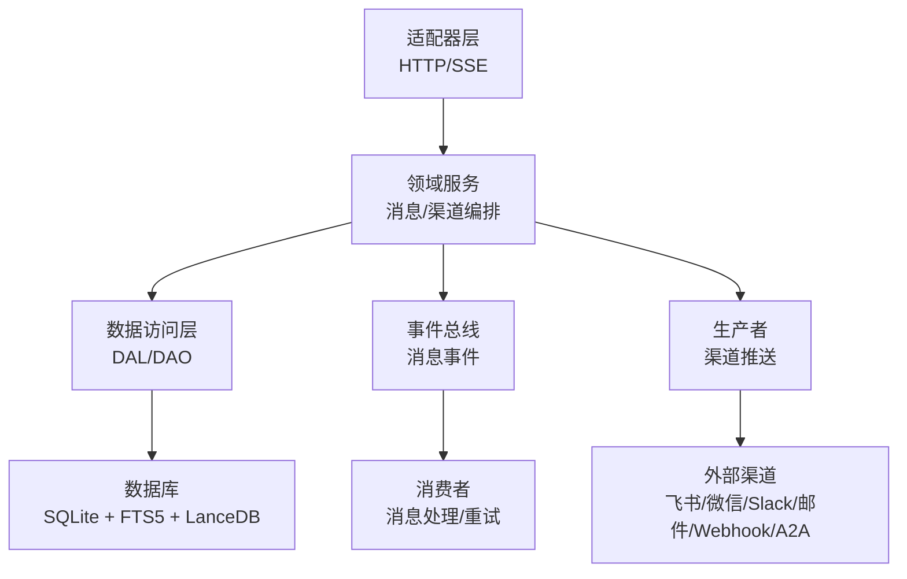
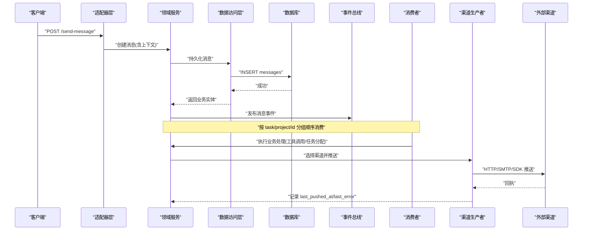
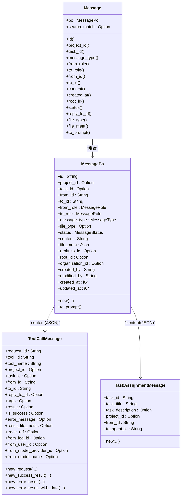
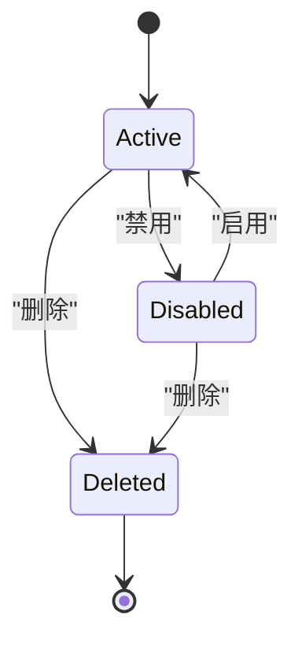
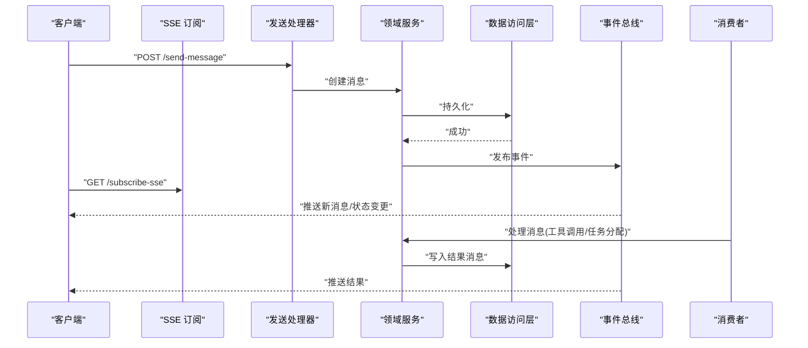
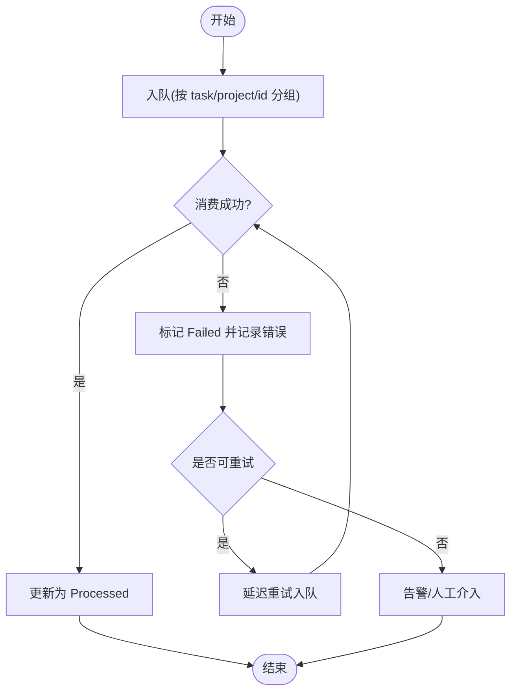
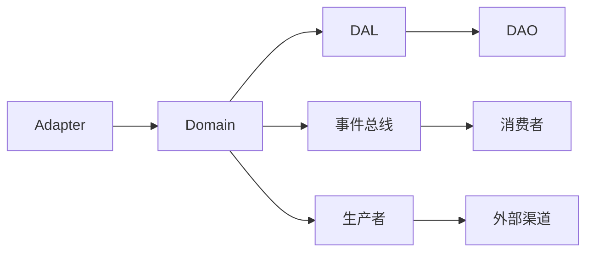

# 消息系统

<cite>
**本文引用的文件**
- [src/models/message.rs](file://src/models/message.rs)
- [common/src/enums/message.rs](file://common/src/enums/message.rs)
- [src/models/message_channel.rs](file://src/models/message_channel.rs)
- [common/src/enums/message_channel.rs](file://common/src/enums/message_channel.rs)
- [migrations/20260420000000_initial.sql](file://migrations/20260420000000_initial.sql)
- [migrations/20260508000000_message_channels.sql](file://migrations/20260508000000_message_channels.sql)
- [migrations/20260428100000_add_reply_to_id_to_messages.sql](file://migrations/20260428100000_add_reply_to_id_to_messages.sql)
- [migrations/20260718000000_add_org_and_root_to_messages.sql](file://migrations/20260718000000_add_org_and_root_to_messages.sql)
- [migrations/20260720000000_add_scope_project_to_channels.sql](file://migrations/20260720000000_add_scope_project_to_channels.sql)
- [src/service/dal/message.rs](file://src/service/dal/message.rs)
- [src/service/dal/message_channel.rs](file://src/service/dal/message_channel.rs)
- [src/service/domain/message/mod.rs](file://src/service/domain/message/mod.rs)
- [src/consumer/message.rs](file://src/consumer/message.rs)
- [src/producer/message_channel.rs](file://src/producer/message_channel.rs)
- [src/pkg/adapter/message.rs](file://src/pkg/adapter/message.rs)
- [src/handlers/finance/message/send_message.rs](file://src/handlers/finance/message/send_message.rs)
- [src/handlers/finance/message/subscribe_sse.rs](file://src/handlers/finance/message/subscribe_sse.rs)
- [src/handlers/finance/message/search_messages.rs](file://src/handlers/finance/message/search_messages.rs)
- [src/handlers/finance/message/list_messages.rs](file://src/handlers/finance/message/list_messages.rs)
- [src/handlers/finance/message_channel/create_message_channel.rs](file://src/handlers/finance/message_channel/create_message_channel.rs)
- [src/handlers/finance/message_channel/update_message_channel_status.rs](file://src/handlers/finance/message_channel/update_message_channel_status.rs)
- [src/models/events/message.rs](file://src/models/events/message.rs)
</cite>

## 目录
1. [简介](#简介)
2. [项目结构](#项目结构)
3. [核心组件](#核心组件)
4. [架构总览](#架构总览)
5. [详细组件分析](#详细组件分析)
6. [依赖关系分析](#依赖关系分析)
7. [性能考虑](#性能考虑)
8. [故障排查指南](#故障排查指南)
9. [结论](#结论)
10. [附录](#附录)

## 简介
本文件为消息系统的详细数据模型与流程文档，覆盖 Message 实体、MessageChannel 渠道配置与路由、消息发送接收流程、重试与错误处理、实时推送、持久化存储与查询优化、多渠道统一抽象与适配层设计，以及消息链与回复机制的实现要点。内容严格遵循四层单向调用：Adapter → Domain → DAL → DAO，PO 仅在 DAO/DAL 内部使用，Domain 对外以业务实体和事件交互。

## 项目结构
围绕消息系统的关键代码组织如下：
- 领域模型与枚举：Message、MessagePo、ToolCallMessage、TaskAssignmentMessage；MessageType、MessageRole、MessageStatus；ChannelType、ChannelStatus、ChannelConfig
- 适配器层（HTTP/SSE）：消息发送、列表、搜索、SSE 订阅；渠道创建与状态更新
- 领域服务：消息与渠道的业务编排、上下文注入、事件发布
- 数据访问层（DAL/DAO）：消息与渠道的增删改查、向量索引、FTS5 全文检索
- 生产者/消费者：渠道推送生产者、消息消费与重试
- 迁移脚本：消息表、渠道表及字段演进

图表来源
- [src/pkg/adapter/message.rs:1-200](file://src/pkg/adapter/message.rs#L1-L200)
- [src/service/domain/message/mod.rs:1-200](file://src/service/domain/message/mod.rs#L1-L200)
- [src/service/dal/message.rs:1-200](file://src/service/dal/message.rs#L1-L200)
- [src/consumer/message.rs:1-200](file://src/consumer/message.rs#L1-L200)
- [src/producer/message_channel.rs:1-200](file://src/producer/message_channel.rs#L1-L200)

章节来源
- [src/models/message.rs:1-690](file://src/models/message.rs#L1-L690)
- [common/src/enums/message.rs:1-189](file://common/src/enums/message.rs#L1-L189)
- [src/models/message_channel.rs:1-260](file://src/models/message_channel.rs#L1-L260)
- [common/src/enums/message_channel.rs:1-122](file://common/src/enums/message_channel.rs#L1-L122)

## 核心组件
- Message 业务实体与 MessagePo 持久化对象：承载消息全生命周期数据，支持文本与附件、工具调用、任务分配等类型，具备消息链与回复能力，并实现事件与向量化接口。
- 消息类型枚举：Text、Image、File、Audio、Video、ToolCallRequest、ToolCallResult、ConfirmRequest、ConfirmResponse、TaskAssignment、TaskDispatchNotification、ProjectFollowupNotification。
- 消息角色与状态：User/Agent/System；Recalled/Pending/Processing/Processed/Failed。
- MessageChannel 渠道实体与 ChannelConfig：支持多租户、用户/Agent 绑定、Webhook/Token/Secret、扩展配置 JSON，状态 Active/Disabled/Deleted，范围 scope_project。
- 工具调用消息 ToolCallMessage：统一封装请求与结果，包含 trace_ref、大结果附件元数据、异步上下文重建字段。
- 任务分配消息 TaskAssignmentMessage：用于任务指派通知。

章节来源
- [src/models/message.rs:18-690](file://src/models/message.rs#L18-L690)
- [common/src/enums/message.rs:7-189](file://common/src/enums/message.rs#L7-L189)
- [src/models/message_channel.rs:19-260](file://src/models/message_channel.rs#L19-L260)
- [common/src/enums/message_channel.rs:9-122](file://common/src/enums/message_channel.rs#L9-L122)

## 架构总览
消息系统采用分层架构与事件驱动：
- Adapter 层暴露 HTTP/SSE 接口，负责参数校验、鉴权、上下文构建，调用 Domain 服务。
- Domain 层进行业务编排：消息创建、路由、上下文注入、事件发布；渠道状态机与范围匹配。
- DAL/DAO 层提供数据访问：消息 CRUD、向量索引、FTS5 检索、渠道配置读写。
- 事件总线：消息作为 Event 入队，按 task/project/id 分组顺序消费；消费者执行处理逻辑与重试。
- 生产者：将消息投递到指定渠道（飞书/微信/Slack/邮件/Webhook/A2A）。

图表来源
- [src/handlers/finance/message/send_message.rs:1-200](file://src/handlers/finance/message/send_message.rs#L1-L200)
- [src/service/domain/message/mod.rs:1-200](file://src/service/domain/message/mod.rs#L1-L200)
- [src/service/dal/message.rs:1-200](file://src/service/dal/message.rs#L1-L200)
- [src/consumer/message.rs:1-200](file://src/consumer/message.rs#L1-L200)
- [src/producer/message_channel.rs:1-200](file://src/producer/message_channel.rs#L1-L200)

## 详细组件分析

### Message 实体与内容结构
- 字段说明：id、project_id、task_id、from_id/to_id、from_role/to_role、message_type、file_type、status、content、file_meta、reply_to_id、root_id、organization_id、created_by/modified_by、时间戳。
- 内容策略：
  - Text：content 直接存储文本。
  - Image/File/Audio/Video：content 存储相对路径，file_meta 存储大小、MIME 等元数据。
  - ToolCallRequest/ToolCallResult：content 为 ToolCallMessage 序列化 JSON。
  - TaskAssignment：content 为 TaskAssignmentMessage 序列化 JSON。
- 消息链与回复：
  - reply_to_id 指向父消息，用于引用/回复或工具调用结果关联请求。
  - root_id 标识消息链根，便于按链拉取。
- Prompt 格式化：to_prompt 输出结构化字符串，便于大模型识别关键字段。

图表来源
- [src/models/message.rs:18-690](file://src/models/message.rs#L18-L690)

章节来源
- [src/models/message.rs:18-690](file://src/models/message.rs#L18-L690)
- [common/src/enums/message.rs:57-189](file://common/src/enums/message.rs#L57-L189)

### 消息类型、角色与状态
- 消息类型：Text、Image、File、Audio、Video、ToolCallRequest、ToolCallResult、ConfirmRequest、ConfirmResponse、TaskAssignment、TaskDispatchNotification、ProjectFollowupNotification。
- 角色：User、Agent、System。
- 状态：Recalled、Pending、Processing、Processed、Failed。用于事件总线恢复与处理跟踪。

章节来源
- [common/src/enums/message.rs:57-189](file://common/src/enums/message.rs#L57-L189)

### MessageChannel 渠道配置与状态机
- 渠道类型：Lark、Wechat、Slack、Email、Webhook、A2aCallback。
- 配置：webhook_url、access_token、secret、config_json（各渠道详细配置）、scope_project（消息范围）。
- 状态机：Active ↔ Disabled；Deleted 为终态；available_statuses/can_transition_to/transition_status 保证合法迁移。
- 追踪：last_pushed_at、last_error。

图表来源
- [src/models/message_channel.rs:67-107](file://src/models/message_channel.rs#L67-L107)
- [common/src/enums/message_channel.rs:82-122](file://common/src/enums/message_channel.rs#L82-L122)

章节来源
- [src/models/message_channel.rs:19-260](file://src/models/message_channel.rs#L19-L260)
- [common/src/enums/message_channel.rs:9-122](file://common/src/enums/message_channel.rs#L9-L122)

### 消息发送与接收流程
- 发送：
  - Adapter 接收请求，构建 RequestContext，调用 Domain 创建消息并持久化。
  - Domain 发布消息事件，消费者按 task/project/id 顺序消费。
  - 消费者根据 message_type 执行业务逻辑（如工具调用），生成结果消息并回写。
- 接收：
  - 外部渠道回调通过 Adapter 进入 Domain，解析后写入消息并触发后续流程。
- SSE 实时推送：
  - 客户端订阅 SSE，服务端在消息状态变更或新消息时推送增量。

图表来源
- [src/handlers/finance/message/send_message.rs:1-200](file://src/handlers/finance/message/send_message.rs#L1-L200)
- [src/handlers/finance/message/subscribe_sse.rs:1-200](file://src/handlers/finance/message/subscribe_sse.rs#L1-L200)
- [src/consumer/message.rs:1-200](file://src/consumer/message.rs#L1-L200)

章节来源
- [src/handlers/finance/message/send_message.rs:1-200](file://src/handlers/finance/message/send_message.rs#L1-L200)
- [src/handlers/finance/message/subscribe_sse.rs:1-200](file://src/handlers/finance/message/subscribe_sse.rs#L1-L200)
- [src/consumer/message.rs:1-200](file://src/consumer/message.rs#L1-L200)

### 重试机制与错误处理
- 事件总线按 order_key(task/project/id) 分组，保证同组顺序消费。
- 失败消息标记 Failed，可基于 status 与重试策略重新入队。
- 渠道推送失败记录 last_error，支持退避重试与告警。
- 工具调用结果携带 is_success、error_message、trace_ref，便于追踪与诊断。

图表来源
- [src/models/message.rs:204-247](file://src/models/message.rs#L204-L247)
- [src/models/message_channel.rs:139-155](file://src/models/message_channel.rs#L139-L155)

章节来源
- [src/models/message.rs:204-247](file://src/models/message.rs#L204-L247)
- [src/models/message_channel.rs:139-155](file://src/models/message_channel.rs#L139-L155)

### 实时推送、持久化与查询优化
- 实时推送：SSE 订阅，消息事件驱动推送增量。
- 持久化：SQLite 存储消息与渠道，FTS5 全文检索 content；LanceDB 向量索引 messages 集合，支持语义检索。
- 查询优化：
  - 列表与分页：按 project/task 过滤，结合 created_at 排序。
  - 搜索：FTS5 关键词 + 向量相似度混合检索。
  - 消息链：按 root_id 批量拉取。

章节来源
- [src/handlers/finance/message/search_messages.rs:1-200](file://src/handlers/finance/message/search_messages.rs#L1-L200)
- [src/handlers/finance/message/list_messages.rs:1-200](file://src/handlers/finance/message/list_messages.rs#L1-L200)
- [src/service/dal/message.rs:1-200](file://src/service/dal/message.rs#L1-L200)
- [migrations/20260420000000_initial.sql:1-200](file://migrations/20260420000000_initial.sql#L1-L200)
- [migrations/20260508000000_message_channels.sql:1-200](file://migrations/20260508000000_message_channels.sql#L1-L200)

### 多渠道统一抽象与适配层
- 统一抽象：ChannelType 枚举定义渠道种类；ChannelConfig 聚合各渠道配置；MessageChannelPo 持有 config_json。
- 适配层：Adapter 将不同渠道的输入输出转换为统一消息模型；生产者根据 channel_type 选择具体实现进行推送。
- 范围控制：scope_project 限制渠道仅对特定项目生效。

章节来源
- [src/models/message_channel.rs:115-260](file://src/models/message_channel.rs#L115-L260)
- [common/src/enums/message_channel.rs:9-122](file://common/src/enums/message_channel.rs#L9-L122)
- [src/producer/message_channel.rs:1-200](file://src/producer/message_channel.rs#L1-L200)

### 消息链与回复机制
- reply_to_id：用于引用/回复或工具调用结果关联请求。
- root_id：标识消息链根，便于按链拉取与展示。
- 迁移支持：reply_to_id 与 organization_id/root_id 字段由迁移脚本引入。

章节来源
- [src/models/message.rs:281-290](file://src/models/message.rs#L281-L290)
- [migrations/20260428100000_add_reply_to_id_to_messages.sql:1-200](file://migrations/20260428100000_add_reply_to_id_to_messages.sql#L1-L200)
- [migrations/20260718000000_add_org_and_root_to_messages.sql:1-200](file://migrations/20260718000000_add_org_and_root_to_messages.sql#L1-L200)

## 依赖关系分析
- 模块耦合：
  - Adapter 依赖 Domain 服务，不直接访问 DAL。
  - Domain 依赖 DAL 与事件总线，不感知 DAO 细节。
  - DAL 依赖 DAO 与存储后端（SQLite/LanceDB/FTS5）。
  - 消费者与生产者通过事件总线与 Domain 解耦。
- 外部依赖：
  - 渠道 SDK/HTTP/SMTP 通过生产者适配。
  - 向量检索使用 LanceDB，全文检索使用 FTS5。

图表来源
- [src/pkg/adapter/message.rs:1-200](file://src/pkg/adapter/message.rs#L1-L200)
- [src/service/domain/message/mod.rs:1-200](file://src/service/domain/message/mod.rs#L1-L200)
- [src/service/dal/message.rs:1-200](file://src/service/dal/message.rs#L1-L200)
- [src/consumer/message.rs:1-200](file://src/consumer/message.rs#L1-L200)
- [src/producer/message_channel.rs:1-200](file://src/producer/message_channel.rs#L1-L200)

章节来源
- [src/pkg/adapter/message.rs:1-200](file://src/pkg/adapter/message.rs#L1-L200)
- [src/service/domain/message/mod.rs:1-200](file://src/service/domain/message/mod.rs#L1-L200)
- [src/service/dal/message.rs:1-200](file://src/service/dal/message.rs#L1-L200)

## 性能考虑
- 事件分组顺序：按 task/project/id 分组，避免跨组乱序，降低锁竞争。
- 向量与全文检索：LanceDB 向量索引 + FTS5 关键词检索，提升查询效率。
- 附件存储：content 仅存路径，file_meta 存元数据，减少大对象入库。
- 渠道推送：记录 last_pushed_at/last_error，支持退避重试与限流。
- 分页与排序：按 created_at 排序，结合 project/task 过滤，减少扫描。

[本节为通用指导，无需特定文件来源]

## 故障排查指南
- 消息未送达：
  - 检查渠道状态是否为 Active，scope_project 是否匹配。
  - 查看 last_error 与 last_pushed_at，定位推送失败原因。
- 消息重复或丢失：
  - 确认事件总线分组 key 是否正确（task/project/id）。
  - 检查消息状态流转：Pending → Processing → Processed/Failed。
- 工具调用异常：
  - 查看 ToolCallMessage 的 is_success、error_message、trace_ref。
  - 核对 args/result 结构与权限。
- 查询慢：
  - 确认 FTS5 与向量索引是否建立。
  - 优化过滤条件与分页参数。

章节来源
- [src/models/message_channel.rs:139-155](file://src/models/message_channel.rs#L139-L155)
- [src/models/message.rs:204-247](file://src/models/message.rs#L204-L247)
- [src/handlers/finance/message/search_messages.rs:1-200](file://src/handlers/finance/message/search_messages.rs#L1-L200)

## 结论
消息系统通过清晰的分层与事件驱动，实现了多类型消息的统一建模、多渠道推送、消息链与回复、实时推送与高效检索。借助 SQLite + FTS5 + LanceDB 的组合，兼顾了事务性与检索性能。状态机与重试机制保障了可靠性，适配层设计使新增渠道成本低、扩展性强。

[本节为总结，无需特定文件来源]

## 附录
- 建表迁移参考：
  - 消息表与基础字段：[migrations/20260420000000_initial.sql:1-200](file://migrations/20260420000000_initial.sql#L1-L200)
  - 渠道表与配置：[migrations/20260508000000_message_channels.sql:1-200](file://migrations/20260508000000_message_channels.sql#L1-L200)
  - 回复与根消息：[migrations/20260428100000_add_reply_to_id_to_messages.sql:1-200](file://migrations/20260428100000_add_reply_to_id_to_messages.sql#L1-L200)、[migrations/20260718000000_add_org_and_root_to_messages.sql:1-200](file://migrations/20260718000000_add_org_and_root_to_messages.sql#L1-L200)
  - 渠道范围：[migrations/20260720000000_add_scope_project_to_channels.sql:1-200](file://migrations/20260720000000_add_scope_project_to_channels.sql#L1-L200)

[本节为附录，无需特定文件来源]