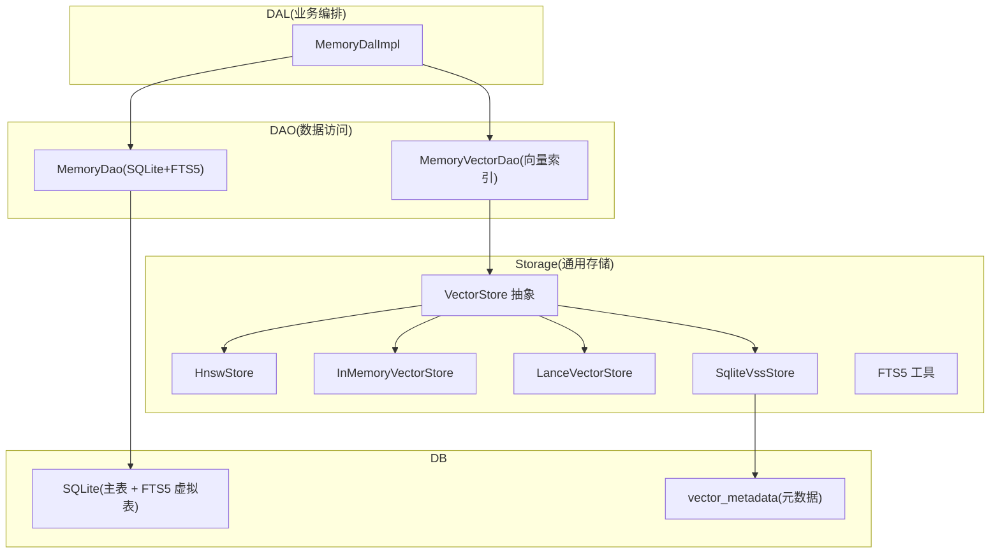
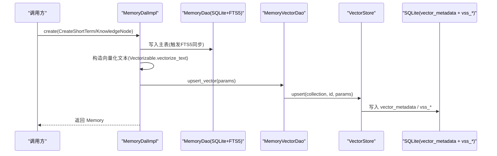
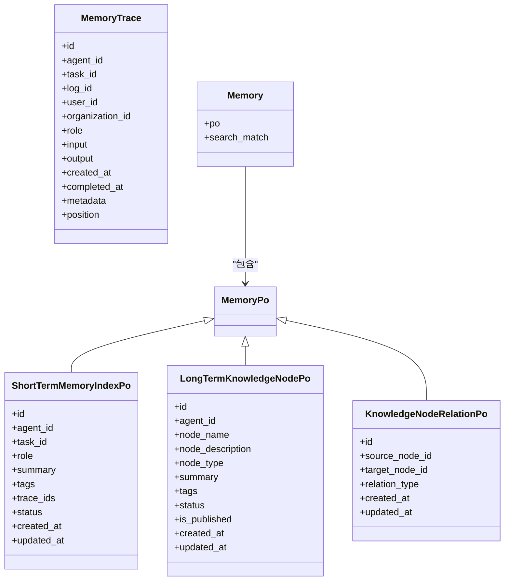
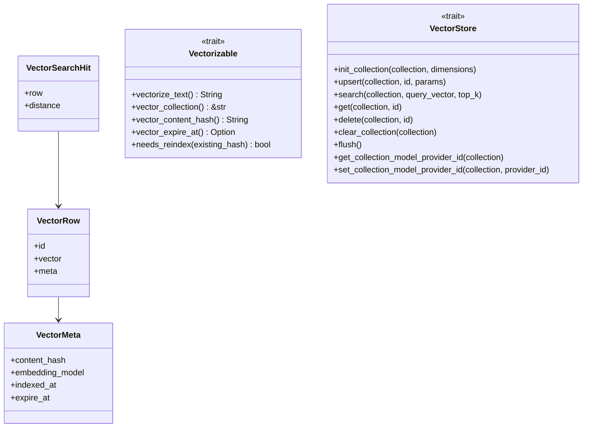
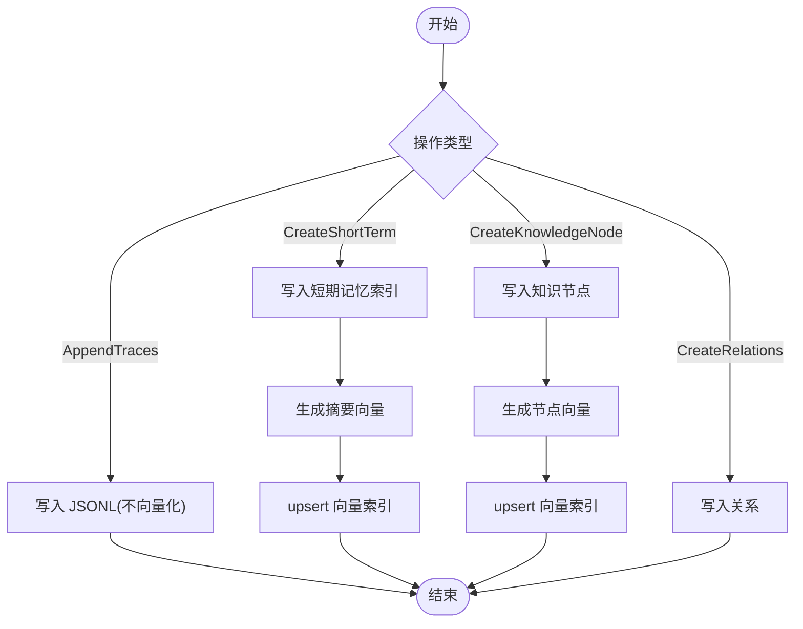
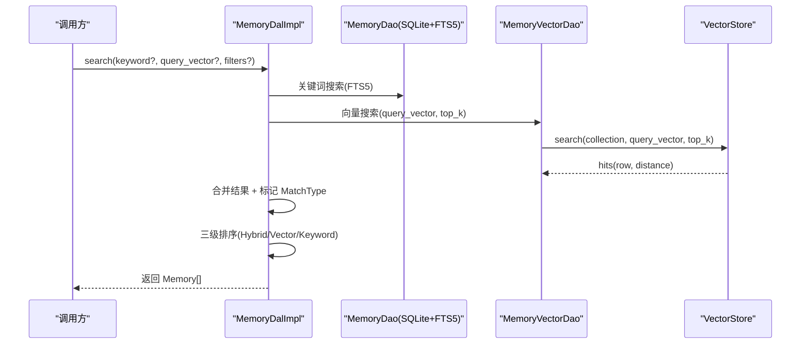
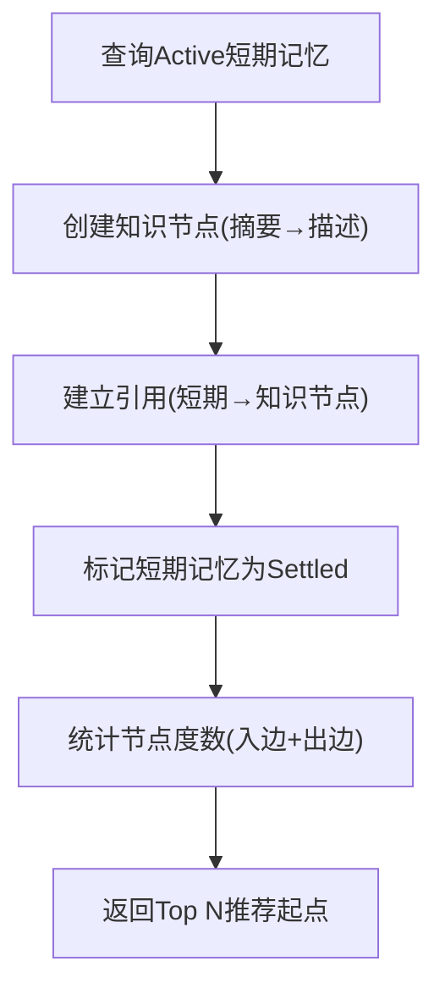
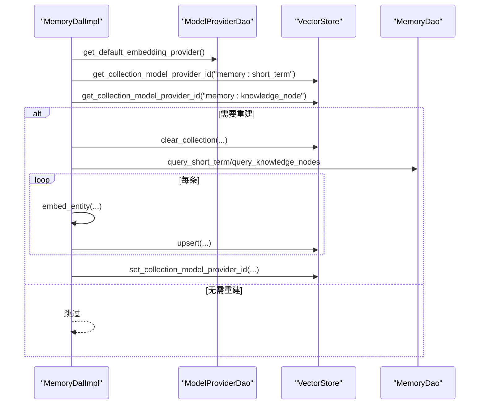
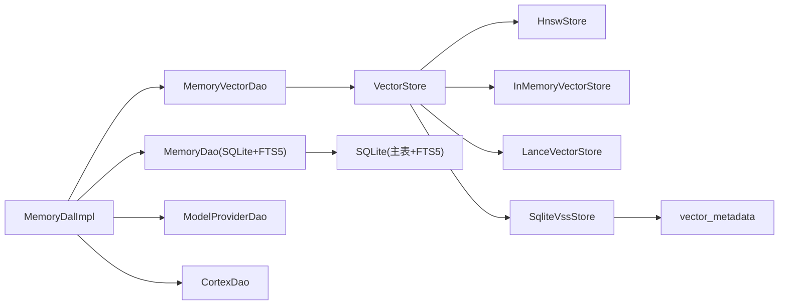

# 记忆和向量系统

<cite>
**本文引用的文件**
- [src/models/memory.rs](file://src/models/memory.rs)
- [src/models/vector.rs](file://src/models/vector.rs)
- [common/src/enums/memory.rs](file://common/src/enums/memory.rs)
- [src/service/dal/memory.rs](file://src/service/dal/memory.rs)
- [src/pkg/storage/mod.rs](file://src/pkg/storage/mod.rs)
- [src/pkg/storage/vector.rs](file://src/pkg/storage/vector.rs)
- [src/pkg/storage/hnsw.rs](file://src/pkg/storage/hnsw.rs)
- [src/pkg/storage/fts5.rs](file://src/pkg/storage/fts5.rs)
- [migrations/20260712000000_memory_fts5.sql](file://migrations/20260712000000_memory_fts5.sql)
- [migrations/20260505000000_vector_metadata.sql](file://migrations/20260505000000_vector_metadata.sql)
- [docs/vector_search_architecture.md](file://docs/vector_search_architecture.md)
</cite>

## 目录
1. [简介](#简介)
2. [项目结构](#项目结构)
3. [核心组件](#核心组件)
4. [架构总览](#架构总览)
5. [详细组件分析](#详细组件分析)
6. [依赖关系分析](#依赖关系分析)
7. [性能与内存管理](#性能与内存管理)
8. [故障排查指南](#故障排查指南)
9. [结论](#结论)
10. [附录](#附录)

## 简介
本文件面向“记忆与向量系统”的数据模型与实现，聚焦以下目标：
- Memory 实体的记忆类型（短期记忆、长期知识节点）、存储策略与生命周期管理。
- Vector 实体的向量维度、索引构建与相似度计算算法。
- 记忆的创建、更新、检索与沉淀流程。
- 向量搜索的性能优化、内存管理与磁盘持久化策略。
- 记忆质量评估、去重机制与知识图谱构建方法。
- FTS5 全文搜索与向量检索的协同工作机制。

## 项目结构
记忆与向量能力横跨四层：
- Adapter/Handler 层：对外暴露 API（不在本文展开）。
- Domain/DAL 层：编排业务逻辑（记忆创建、检索、沉淀、重建等）。
- DAO 层：SQLite 基础数据与 FTS5 索引；向量 DAO 负责向量索引 CRUD。
- Storage 层：通用存储抽象与多后端实现（InMemory/HNSW/LanceDB/SqliteVss），FTS5 工具函数。

图表来源
- [src/service/dal/memory.rs:70-177](file://src/service/dal/memory.rs#L70-L177)
- [src/pkg/storage/mod.rs:1-212](file://src/pkg/storage/mod.rs#L1-L212)
- [src/pkg/storage/vector.rs:18-74](file://src/pkg/storage/vector.rs#L18-L74)
- [migrations/20260712000000_memory_fts5.sql:1-92](file://migrations/20260712000000_memory_fts5.sql#L1-L92)
- [migrations/20260505000000_vector_metadata.sql:1-16](file://migrations/20260505000000_vector_metadata.sql#L1-L16)

章节来源
- [docs/vector_search_architecture.md:1-159](file://docs/vector_search_architecture.md#L1-L159)
- [src/pkg/storage/mod.rs:1-212](file://src/pkg/storage/mod.rs#L1-L212)

## 核心组件
- Memory 实体族
  - MemoryTrace：原始思考闭环记录（JSONL 行，无 SQLite 表）
  - ShortTermMemoryIndexPo：短期记忆索引（SQLite 表，summary/tags/trace_ids/status）
  - LongTermKnowledgeNodePo：长期知识节点（SQLite 表，node_description/summary/tags/status/is_published）
  - KnowledgeNodeRelationPo：知识节点关系（source/target/type）
  - Memory：业务实体包装（PO + SearchMatchInfo）
- Vector 通用数据结构
  - VectorRow/VectorMeta：向量行与元数据（content_hash/embedding_model/indexed_at/expire_at）
  - VectorSearchHit：搜索结果（row + distance）
  - VectorCollection：集合元信息（dimensions/entries）
  - Vectorizable Trait：实体向量化接口（vectorize_text/vector_collection/needs_reindex）
- 存储后端
  - VectorStore 抽象：init_collection/upsert/search/get/delete/clear_collection/flush
  - HnswStore：纯 Rust HNSW，余弦距离，bincode 持久化，后台定时落盘
  - SqliteVssStore：基于 SQLite vss0 扩展
  - InMemoryVectorStore/LanceVectorStore：其他后端
- FTS5 全文搜索
  - short_term_memory_fts/knowledge_node_fts 虚拟表，trigram 分词器，触发器自动同步

章节来源
- [src/models/memory.rs:15-424](file://src/models/memory.rs#L15-L424)
- [src/models/vector.rs:9-168](file://src/models/vector.rs#L9-L168)
- [src/pkg/storage/vector.rs:18-74](file://src/pkg/storage/vector.rs#L18-L74)
- [src/pkg/storage/hnsw.rs:1-617](file://src/pkg/storage/hnsw.rs#L1-L617)
- [src/pkg/storage/fts5.rs:1-45](file://src/pkg/storage/fts5.rs#L1-L45)
- [migrations/20260712000000_memory_fts5.sql:1-92](file://migrations/20260712000000_memory_fts5.sql#L1-L92)
- [migrations/20260505000000_vector_metadata.sql:1-16](file://migrations/20260505000000_vector_metadata.sql#L1-L16)

## 架构总览
记忆系统采用“基础数据 + 全文索引 + 向量索引”三层解耦设计：
- 基础数据：SQLite 主表承载短期记忆索引与长期知识节点。
- 全文索引：FTS5 虚拟表通过触发器自动同步，支持 trigram 中文分词。
- 向量索引：VectorStore 抽象统一接入多种后端，DAL 层在创建/更新时按需生成 embedding 并 upsert。

图表来源
- [src/service/dal/memory.rs:377-475](file://src/service/dal/memory.rs#L377-L475)
- [src/models/vector.rs:138-168](file://src/models/vector.rs#L138-L168)
- [src/pkg/storage/vector.rs:94-124](file://src/pkg/storage/vector.rs#L94-L124)
- [migrations/20260712000000_memory_fts5.sql:32-79](file://migrations/20260712000000_memory_fts5.sql#L32-L79)

## 详细组件分析

### Memory 数据模型
- MemoryTrace：以 trace_id 贯穿一次完整思考闭环，包含输入/输出/时间戳/角色/元数据，物理位置指向每日 JSONL 文件。
- ShortTermMemoryIndexPo：聚合多条相关细节，提供 summary/tags/trace_ids/status，作为短期记忆检索单元。
- LongTermKnowledgeNodePo：经过归纳总结的知识节点，包含 node_description/summary/tags/status/is_published。
- KnowledgeNodeRelationPo：描述知识节点之间的关系（related/contains/depends/prerequisite/similar/causes 等）。
- Memory：业务实体包装，附加 SearchMatchInfo 用于混合搜索排序与展示。

图表来源
- [src/models/memory.rs:15-424](file://src/models/memory.rs#L15-L424)

章节来源
- [src/models/memory.rs:15-424](file://src/models/memory.rs#L15-L424)
- [common/src/enums/memory.rs:12-30](file://common/src/enums/memory.rs#L12-L30)

### Vector 数据模型与可插拔后端
- VectorRow/VectorMeta：统一表示向量行与元数据（content_hash、embedding_model、indexed_at、expire_at）。
- VectorSearchHit：搜索结果携带 row 与 distance。
- Vectorizable：实体自描述向量化字段与集合名，默认内容哈希与过期策略。
- VectorStore：统一抽象，支持 InMemory/HNSW/LanceDB/SqliteVss 多后端。

图表来源
- [src/models/vector.rs:9-168](file://src/models/vector.rs#L9-L168)
- [src/pkg/storage/vector.rs:18-74](file://src/pkg/storage/vector.rs#L18-L74)

章节来源
- [src/models/vector.rs:9-168](file://src/models/vector.rs#L9-L168)
- [src/pkg/storage/vector.rs:18-74](file://src/pkg/storage/vector.rs#L18-L74)

### 记忆生命周期与存储策略
- 创建
  - AppendTraces：仅写 JSONL（不向量化）。
  - CreateShortTerm：写 SQLite 短期记忆索引，自动向量化 summary+tags。
  - CreateKnowledgeNode：写 SQLite 知识节点，可选附带引用关系，自动向量化 node_description+summary+tags。
  - CreateRelations：写关系表（不向量化）。
- 更新
  - 仅支持 ShortTerm/KnowledgeNode；更新后重新向量化，失败降级为 warn。
- 删除
  - ShortTerm：软删除（标记 Forgotten）+ 删除向量索引。
  - KnowledgeNode：级联删除关系与引用 + 删除向量索引。
- 沉淀
  - settle_short_term_to_long_term：查询 Active 短期记忆 → 按主题/时间分组 → 创建知识节点 → 建立引用 → 标记 Settled。

图表来源
- [src/service/dal/memory.rs:377-475](file://src/service/dal/memory.rs#L377-L475)
- [src/models/memory.rs:342-366](file://src/models/memory.rs#L342-L366)

章节来源
- [src/service/dal/memory.rs:377-475](file://src/service/dal/memory.rs#L377-L475)
- [src/models/memory.rs:342-366](file://src/models/memory.rs#L342-L366)

### 检索与混合搜索
- 搜索入口：MemoryDal.search 根据 memory_type 分别检索短期记忆与知识节点，必要时检索关系（关键词）。
- 匹配类型：Vector/Keyword/Hybrid，结果带 SearchMatchInfo（match_type、vector_distance、keyword_fields、embedding_model、indexed_at、content_hash、fts_rank）。
- 排序策略：Hybrid > Vector > Keyword；组内按 vector_distance 升序或 fts_rank 升序。
- FTS5：short_term_memory_fts/knowledge_node_fts 使用 trigram 分词，触发器自动同步增删改。

图表来源
- [src/service/dal/memory.rs:190-276](file://src/service/dal/memory.rs#L190-L276)
- [src/models/vector.rs:94-136](file://src/models/vector.rs#L94-L136)
- [migrations/20260712000000_memory_fts5.sql:16-29](file://migrations/20260712000000_memory_fts5.sql#L16-L29)

章节来源
- [src/service/dal/memory.rs:190-276](file://src/service/dal/memory.rs#L190-L276)
- [src/models/vector.rs:94-136](file://src/models/vector.rs#L94-L136)
- [migrations/20260712000000_memory_fts5.sql:16-29](file://migrations/20260712000000_memory_fts5.sql#L16-L29)

### 知识图谱构建与遍历
- 构建
  - 从短期记忆沉淀为知识节点，建立引用关系（KnowledgeReferencePo），将短期记忆标记为 Settled。
  - 关系类型丰富（related/contains/depends/prerequisite/similar/causes 等）。
- 推荐起点
  - 统计节点度数（入边+出边），返回 Top N 节点作为图谱导航起点。
- 遍历
  - 支持 BFS/DFS 两种策略，限制深度与每层宽度，避免爆炸式展开。

图表来源
- [src/service/dal/memory.rs:578-652](file://src/service/dal/memory.rs#L578-L652)
- [src/service/dal/memory.rs:314-375](file://src/service/dal/memory.rs#L314-L375)
- [src/service/dal/memory.rs:518-576](file://src/service/dal/memory.rs#L518-L576)

章节来源
- [src/service/dal/memory.rs:518-652](file://src/service/dal/memory.rs#L518-L652)

### 向量索引重建与模型切换
- 重建入口：rebuild_vectors(ctx)
  - 获取当前启用的 Embedding Provider。
  - 检查两个集合的 model_provider_id，若不一致则清空对应集合。
  - 逐条查询全量短期记忆/知识节点，embed + upsert。
  - 完成后设置集合的 model_provider_id。
- 降级策略：单条失败不影响整体，记录 warn。

图表来源
- [src/service/dal/memory.rs:654-799](file://src/service/dal/memory.rs#L654-L799)
- [src/pkg/storage/vector.rs:59-74](file://src/pkg/storage/vector.rs#L59-L74)

章节来源
- [src/service/dal/memory.rs:654-799](file://src/service/dal/memory.rs#L654-L799)

## 依赖关系分析
- DAL 依赖：
  - MemoryDao（SQLite + FTS5）
  - MemoryVectorDao（向量索引 CRUD）
  - ModelProviderDao（Embedding Provider）
  - CortexDao（向量化）
- Storage 层：
  - VectorStore 抽象由 HnswStore/InMemoryVectorStore/LanceVectorStore/SqliteVssStore 实现。
  - FTS5 工具函数 escape_fts5_keyword 供各 DAO 复用。
- 数据库：
  - 主表：short_term_memory_index、long_term_knowledge_node、knowledge_node_relation。
  - FTS5 虚拟表：short_term_memory_fts、knowledge_node_fts（trigram 分词）。
  - 向量元数据：vector_metadata（collection/source_id/content_hash/model/dimensions/indexed_at/expire_at）。

图表来源
- [src/service/dal/memory.rs:181-186](file://src/service/dal/memory.rs#L181-L186)
- [src/pkg/storage/mod.rs:20-35](file://src/pkg/storage/mod.rs#L20-L35)
- [migrations/20260712000000_memory_fts5.sql:16-29](file://migrations/20260712000000_memory_fts5.sql#L16-L29)
- [migrations/20260505000000_vector_metadata.sql:1-16](file://migrations/20260505000000_vector_metadata.sql#L1-L16)

章节来源
- [src/service/dal/memory.rs:181-186](file://src/service/dal/memory.rs#L181-L186)
- [src/pkg/storage/mod.rs:20-35](file://src/pkg/storage/mod.rs#L20-L35)

## 性能与内存管理
- 向量相似度算法
  - HNSW：余弦距离（1 - cos(θ)），lazy rebuild（写入标记 dirty，搜索时按需重建）。
  - SqliteVss：基于 vss0 扩展的 MATCH 查询，返回距离。
- 索引构建
  - 实体通过 Vectorizable 指定向量化文本与集合名；DAL 在创建/更新时生成 embedding 并 upsert。
  - 内容哈希（SHA256）用于判断是否需要重索引，避免重复调用 Embedding API。
- 内存管理
  - HNSW：每个 collection 独立 HashMap 缓存向量与删除标记；索引缓存不参与序列化，加载后重建。
  - 后台任务：每 60 秒扫描 dirty flag 落盘；Drop 时兜底落盘。
  - 冷启动：扫描 hnsw_index_dir 加载已有 bincode 文件，避免冷启动重建。
- 磁盘持久化
  - HNSW：每个 collection 一个 .bincode 文件；collections_meta.bincode 保存集合元数据。
  - SqliteVss：vector_metadata 表 + vss_* 虚拟表。
  - FTS5：SQLite 内置虚拟表，触发器自动同步。
- 性能优化建议
  - 合理设置 top_k，控制返回规模。
  - 使用 MemoryStatus 过滤（Active/Forgotten/Settled）减少无关数据参与检索。
  - 批量重建时逐条失败降级，保证整体可用性。
  - 对大集合优先选择 HNSW/LanceDB 后端，降低查询延迟。

章节来源
- [src/pkg/storage/hnsw.rs:20-34](file://src/pkg/storage/hnsw.rs#L20-L34)
- [src/pkg/storage/hnsw.rs:107-124](file://src/pkg/storage/hnsw.rs#L107-L124)
- [src/pkg/storage/hnsw.rs:377-388](file://src/pkg/storage/hnsw.rs#L377-L388)
- [src/pkg/storage/hnsw.rs:403-429](file://src/pkg/storage/hnsw.rs#L403-L429)
- [src/pkg/storage/vector.rs:126-173](file://src/pkg/storage/vector.rs#L126-L173)
- [src/models/vector.rs:69-92](file://src/models/vector.rs#L69-L92)

## 故障排查指南
- 向量索引不可用
  - 现象：向量搜索返回空或降级为关键词搜索。
  - 排查：确认 Embedding Provider 是否启用；检查 rebuild_vectors 是否完成；查看日志中“向量索引更新失败”的 warn。
- 向量重建卡住或失败
  - 现象：switch 后重建进度缓慢或中断。
  - 排查：检查 vector_store.clear_collection 是否成功；逐条 embed 失败会记录 warn，不影响整体；确认后端可用（HNSW/LanceDB/SqliteVss）。
- FTS5 搜索异常
  - 现象：关键词搜索命中为空。
  - 排查：确认触发器是否存在；检查 escape_fts5_keyword 是否正确转义；验证 trigram 分词配置。
- 知识图谱遍历过深
  - 现象：返回结果过多或性能下降。
  - 排查：限制 max_depth 与 max_breadth；使用 BFS/DFS 策略；关注 visited_nodes/visited_relations 去重。

章节来源
- [src/service/dal/memory.rs:392-475](file://src/service/dal/memory.rs#L392-L475)
- [src/service/dal/memory.rs:654-799](file://src/service/dal/memory.rs#L654-L799)
- [src/pkg/storage/fts5.rs:6-18](file://src/pkg/storage/fts5.rs#L6-L18)
- [migrations/20260712000000_memory_fts5.sql:32-79](file://migrations/20260712000000_memory_fts5.sql#L32-L79)

## 结论
记忆与向量系统通过“基础数据 + FTS5 + 向量索引”的分层设计，实现了高内聚、低耦合的记忆管理能力。短期记忆与长期知识节点的沉淀流程清晰，混合搜索提供语义与关键词的双重召回，知识图谱构建与遍历支持复杂关系探索。多后端向量存储与 HNSW 持久化保障了性能与可靠性，降级策略确保系统在部分组件不可用时仍能提供核心功能。

## 附录

### 记忆状态与类型
- MemoryStatus：Forgotten/Active/Settled，控制检索可见性与生命周期。
- MemoryRole：System/User/Assistant/Summary，标识记忆来源。
- KnowledgeRelationType：丰富的关系类型，支撑知识图谱建模。
- MemoryType：Trace/ShortTerm/KnowledgeNode/Relation/All，用于过滤查询。

章节来源
- [common/src/enums/memory.rs:12-30](file://common/src/enums/memory.rs#L12-L30)
- [common/src/enums/memory.rs:56-94](file://common/src/enums/memory.rs#L56-L94)
- [common/src/enums/memory.rs:96-182](file://common/src/enums/memory.rs#L96-L182)
- [common/src/enums/memory.rs:184-212](file://common/src/enums/memory.rs#L184-L212)

### FTS5 与向量协同
- FTS5 虚拟表通过触发器自动同步主表变更，支持 trigram 中文分词。
- 混合搜索将关键词与向量结果合并，按 Hybrid/Vector/Keyword 优先级排序，组内按距离或 BM25 评分细排。
- 向量元数据记录 content_hash/embedding_model/indexed_at/expire_at，支持过期清理与模型切换检测。

章节来源
- [migrations/20260712000000_memory_fts5.sql:16-29](file://migrations/20260712000000_memory_fts5.sql#L16-L29)
- [migrations/20260712000000_memory_fts5.sql:32-79](file://migrations/20260712000000_memory_fts5.sql#L32-L79)
- [migrations/20260505000000_vector_metadata.sql:1-16](file://migrations/20260505000000_vector_metadata.sql#L1-L16)
- [src/models/vector.rs:94-136](file://src/models/vector.rs#L94-L136)