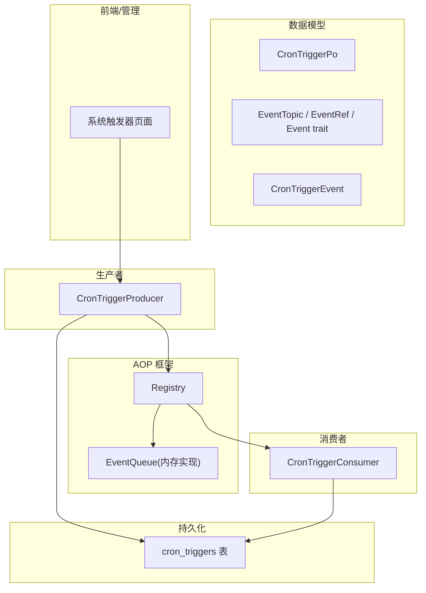
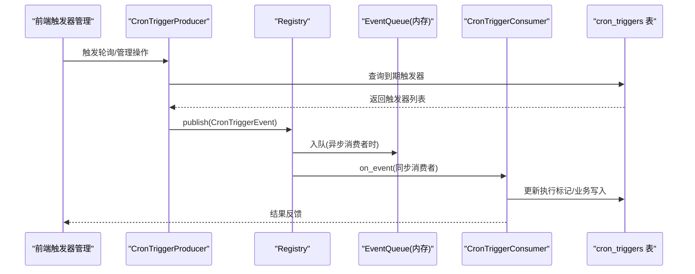
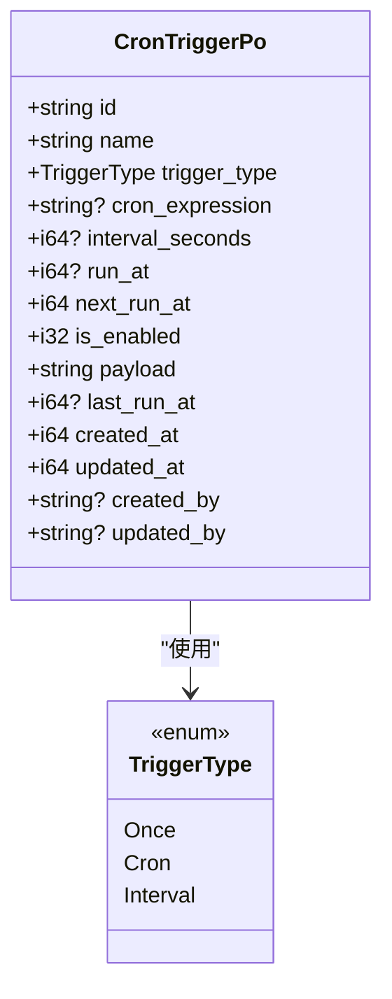
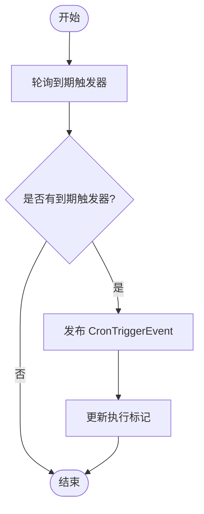
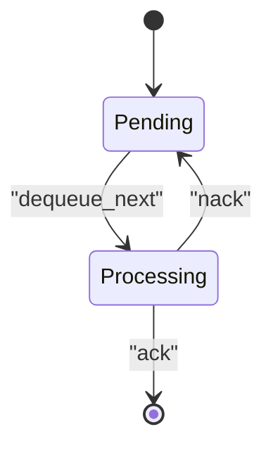
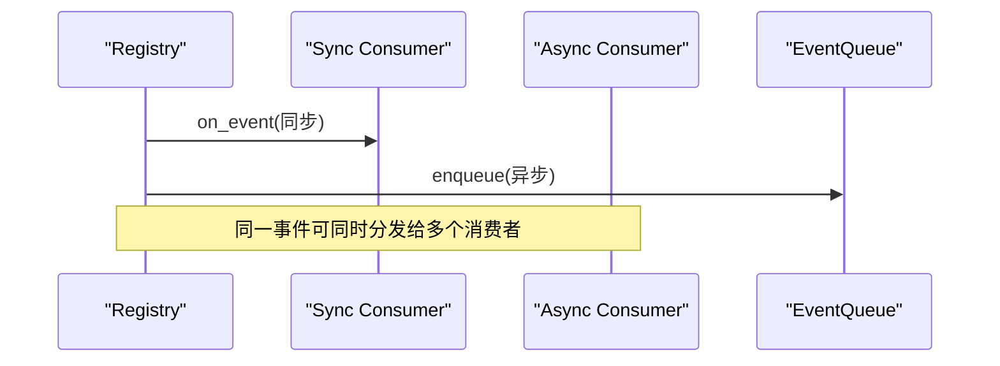
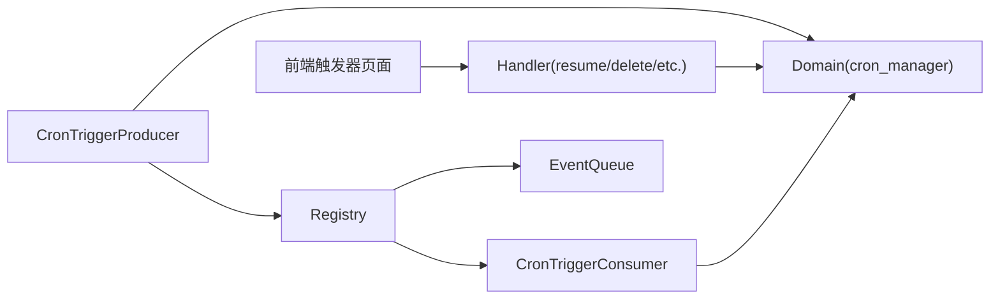

# 定时任务和事件系统

<cite>
**本文引用的文件**
- [src/models/cron_trigger.rs](file://src/models/cron_trigger.rs)
- [migrations/20260711000000_cron_triggers.sql](file://migrations/20260711000000_cron_triggers.sql)
- [common/src/enums/cron_trigger.rs](file://common/src/enums/cron_trigger.rs)
- [src/producer/cron_trigger.rs](file://src/producer/cron_trigger.rs)
- [src/consumer/scheduler.rs](file://src/consumer/scheduler.rs)
- [src/models/events/cron_trigger.rs](file://src/models/events/cron_trigger.rs)
- [src/models/event.rs](file://src/models/event.rs)
- [src/pkg/aop/queue/mod.rs](file://src/pkg/aop/queue/mod.rs)
- [docs/superpowers/plans/2026-07-20-aop-event-center.md](file://docs/superpowers/plans/2026-07-20-aop-event-center.md)
- [docs/superpowers/plans/2026-07-21-aop-monitoring.md](file://docs/superpowers/plans/2026-07-21-aop-monitoring.md)
- [tests/integration/system_cron_triggers_test.rs](file://tests/integration/system_cron_triggers_test.rs)
- [frontend/src/pages/system/triggers.rs](file://frontend/src/pages/system/triggers.rs)
- [src/handlers/system/cron_trigger/resume_cron_trigger.rs](file://src/handlers/system/cron_trigger/resume_cron_trigger.rs)
</cite>

## 目录
1. [简介](#简介)
2. [项目结构](#项目结构)
3. [核心组件](#核心组件)
4. [架构总览](#架构总览)
5. [详细组件分析](#详细组件分析)
6. [依赖关系分析](#依赖关系分析)
7. [性能与并发控制](#性能与并发控制)
8. [故障排查指南](#故障排查指南)
9. [结论](#结论)
10. [附录](#附录)

## 简介
本文件面向“定时任务与事件系统”的数据模型与运行机制，聚焦以下目标：
- CronTrigger 实体的调度表达式解析、执行计划管理与重试机制。
- Event 实体类型定义、元数据结构与处理状态流转。
- 事件的发布订阅模式实现、消费者注册机制与负载均衡策略。
- 任务执行的日志记录、错误处理与监控告警能力。
- 事件溯源、审计追踪与性能分析支持。
- 定时任务的启用/禁用、暂停/恢复与删除操作。
- 事件队列的持久化存储、消息格式与传输协议（接口抽象）。
- 任务调度的优先级管理、并发控制与资源限制。

## 项目结构
围绕定时任务与事件系统的代码分布在如下层次：
- 数据模型层：CronTriggerPo、EventTopic、EventRef、Event trait、CronTriggerEvent。
- 生产者层：CronTriggerProducer 周期性扫描到期触发器并生产事件。
- 消费者层：CronTriggerConsumer 消费 cron.trigger 事件并编排业务动作。
- AOP 框架：Registry、EventQueue 抽象与内存实现，提供发布/订阅、入队/出队、ack/nack、监控统计等能力。
- 持久化层：cron_triggers 表及索引；队列当前为内存实现，具备可替换扩展点。
- 前端与管理面：系统页面对触发器的列表、暂停/恢复、删除等操作。

图表来源
- [src/models/cron_trigger.rs:1-66](file://src/models/cron_trigger.rs#L1-L66)
- [src/models/event.rs:1-104](file://src/models/event.rs#L1-L104)
- [src/models/events/cron_trigger.rs:1-30](file://src/models/events/cron_trigger.rs#L1-L30)
- [src/producer/cron_trigger.rs:1-88](file://src/producer/cron_trigger.rs#L1-L88)
- [src/consumer/scheduler.rs:1-211](file://src/consumer/scheduler.rs#L1-L211)
- [src/pkg/aop/queue/mod.rs:1-107](file://src/pkg/aop/queue/mod.rs#L1-L107)
- [migrations/20260711000000_cron_triggers.sql:1-25](file://migrations/20260711000000_cron_triggers.sql#L1-L25)
- [frontend/src/pages/system/triggers.rs:394-421](file://frontend/src/pages/system/triggers.rs#L394-L421)

章节来源
- [src/models/cron_trigger.rs:1-66](file://src/models/cron_trigger.rs#L1-L66)
- [migrations/20260711000000_cron_triggers.sql:1-25](file://migrations/20260711000000_cron_triggers.sql#L1-L25)
- [src/models/event.rs:1-104](file://src/models/event.rs#L1-L104)
- [src/models/events/cron_trigger.rs:1-30](file://src/models/events/cron_trigger.rs#L1-L30)
- [src/producer/cron_trigger.rs:1-88](file://src/producer/cron_trigger.rs#L1-L88)
- [src/consumer/scheduler.rs:1-211](file://src/consumer/scheduler.rs#L1-L211)
- [src/pkg/aop/queue/mod.rs:1-107](file://src/pkg/aop/queue/mod.rs#L1-L107)
- [frontend/src/pages/system/triggers.rs:394-421](file://frontend/src/pages/system/triggers.rs#L394-L421)

## 核心组件
- CronTriggerPo：定时触发器配置对象，包含名称、类型、表达式/间隔/一次性时间、下次执行时间、是否启用、负载 JSON、上次执行时间、创建/更新时间与操作人。
- TriggerType：触发器类型枚举（一次性、Cron 表达式、固定间隔），用于数据库存储与前后端共享。
- EventTopic/EventRef/Event：事件主题、事件引用与事件基础能力，定义事件 ID、排序分组键、优先级、创建时间等元数据。
- CronTriggerEvent：Cron 触发器事件，携带 trigger_id、trigger_name、payload、created_at，并实现 Event trait。
- CronTriggerProducer：周期轮询到期触发器，生成事件并通过 Registry 发布，同时更新执行标记。
- CronTriggerConsumer：订阅 cron.trigger 事件，按 payload.action 分发到具体业务处理（如 agent_rest、project_followup）。
- EventQueue：队列抽象，支持 enqueue/dequeue/ack/nack/recover/stats/query_events/get_event 等，当前默认内存实现，可扩展持久化后端。
- Registry：事件注册中心，管理生产者/消费者注册、事件分发、异步消费者独立队列、生命周期与查询。

章节来源
- [src/models/cron_trigger.rs:1-66](file://src/models/cron_trigger.rs#L1-L66)
- [common/src/enums/cron_trigger.rs:1-47](file://common/src/enums/cron_trigger.rs#L1-L47)
- [src/models/event.rs:1-104](file://src/models/event.rs#L1-L104)
- [src/models/events/cron_trigger.rs:1-30](file://src/models/events/cron_trigger.rs#L1-L30)
- [src/producer/cron_trigger.rs:1-88](file://src/producer/cron_trigger.rs#L1-L88)
- [src/consumer/scheduler.rs:1-211](file://src/consumer/scheduler.rs#L1-L211)
- [src/pkg/aop/queue/mod.rs:1-107](file://src/pkg/aop/queue/mod.rs#L1-L107)
- [docs/superpowers/plans/2026-07-20-aop-event-center.md:728-950](file://docs/superpowers/plans/2026-07-20-aop-event-center.md#L728-L950)

## 架构总览
下图展示从前端管理到后端生产者、AOP 框架与消费者的完整调用链，以及数据库持久化与队列交互。

图表来源
- [src/producer/cron_trigger.rs:42-86](file://src/producer/cron_trigger.rs#L42-L86)
- [src/consumer/scheduler.rs:53-94](file://src/consumer/scheduler.rs#L53-L94)
- [src/pkg/aop/queue/mod.rs:77-106](file://src/pkg/aop/queue/mod.rs#L77-L106)
- [migrations/20260711000000_cron_triggers.sql:4-24](file://migrations/20260711000000_cron_triggers.sql#L4-L24)

## 详细组件分析

### CronTrigger 数据模型与调度表达式
- 字段说明：id、name、trigger_type、cron_expression、interval_seconds、run_at、next_run_at、is_enabled、payload、last_run_at、created_at、updated_at、created_by、updated_by。
- 类型约束：trigger_type 使用 INTEGER 并限定取值范围；is_enabled 限定 0/1；payload 默认空 JSON。
- 索引优化：针对 next_run_at、is_enabled、trigger_type、created_at 建立索引以加速到期查询与状态筛选。
- 表达式解析：当前代码未包含 Cron 表达式解析逻辑；TriggerType::Cron 在部分文档中注明不可用，实际调度通过 next_run_at 与 is_enabled 配合轮询实现。

图表来源
- [src/models/cron_trigger.rs:10-27](file://src/models/cron_trigger.rs#L10-L27)
- [common/src/enums/cron_trigger.rs:9-22](file://common/src/enums/cron_trigger.rs#L9-L22)
- [migrations/20260711000000_cron_triggers.sql:4-24](file://migrations/20260711000000_cron_triggers.sql#L4-L24)

章节来源
- [src/models/cron_trigger.rs:10-66](file://src/models/cron_trigger.rs#L10-L66)
- [common/src/enums/cron_trigger.rs:9-47](file://common/src/enums/cron_trigger.rs#L9-L47)
- [migrations/20260711000000_cron_triggers.sql:4-24](file://migrations/20260711000000_cron_triggers.sql#L4-L24)

### 执行计划管理与重试机制
- 执行计划：生产者每 60 秒轮询一次，查询 next_run_at <= now 且启用的触发器，批量上限 100。
- 执行标记：每次成功发布事件后，调用 mark_trigger_executed 更新 last_run_at 与 next_run_at（由 domain 层实现）。
- 重试机制：事件队列支持 nack 将失败事件重新放回队列等待重试；对于 CronTriggerConsumer 当前为同步消费者，错误直接返回，上层可根据需要实现重试策略。

图表来源
- [src/producer/cron_trigger.rs:38-86](file://src/producer/cron_trigger.rs#L38-L86)
- [src/consumer/scheduler.rs:53-94](file://src/consumer/scheduler.rs#L53-L94)
- [src/pkg/aop/queue/mod.rs:77-106](file://src/pkg/aop/queue/mod.rs#L77-L106)

章节来源
- [src/producer/cron_trigger.rs:38-86](file://src/producer/cron_trigger.rs#L38-L86)
- [src/consumer/scheduler.rs:53-94](file://src/consumer/scheduler.rs#L53-L94)
- [src/pkg/aop/queue/mod.rs:77-106](file://src/pkg/aop/queue/mod.rs#L77-L106)

### Event 实体：类型定义、元数据与状态流转
- 事件主题：Message、TaskChange、CronTrigger、Custom(u16)。
- 事件引用：event_id、order_key、priority、created_at；用于堆排序与队列存储。
- 事件基础能力：id、topic、order_key、priority、created_at、to_event_ref。
- 状态流转：Pending → Processing → Ack/Nack；队列支持查询事件摘要与详情。

图表来源
- [src/models/event.rs:7-96](file://src/models/event.rs#L7-L96)
- [src/pkg/aop/queue/mod.rs:77-106](file://src/pkg/aop/queue/mod.rs#L77-L106)

章节来源
- [src/models/event.rs:7-96](file://src/models/event.rs#L7-L96)
- [src/pkg/aop/queue/mod.rs:77-106](file://src/pkg/aop/queue/mod.rs#L77-L106)

### 发布订阅模式、消费者注册与负载均衡
- 发布订阅：Registry.publish 根据事件 kind 查找感兴趣消费者，同步消费者直接调用 on_event，异步消费者入队。
- 消费者注册：register_consumer 支持多事件类型订阅，并为异步消费者创建独立队列。
- 负载均衡：当前内存队列基于全局堆与 order_key 分组保证顺序消费；空 order_key 支持并行消费；无显式多实例负载均衡，可通过多进程/多实例部署扩展。

图表来源
- [docs/superpowers/plans/2026-07-20-aop-event-center.md:728-950](file://docs/superpowers/plans/2026-07-20-aop-event-center.md#L728-L950)
- [src/pkg/aop/queue/mod.rs:77-106](file://src/pkg/aop/queue/mod.rs#L77-L106)

章节来源
- [docs/superpowers/plans/2026-07-20-aop-event-center.md:728-950](file://docs/superpowers/plans/2026-07-20-aop-event-center.md#L728-L950)
- [src/pkg/aop/queue/mod.rs:77-106](file://src/pkg/aop/queue/mod.rs#L77-L106)

### 任务执行日志、错误处理与监控告警
- 日志记录：消费者在处理事件时记录关键信息（触发器名称、ID、action、agent_id 等）；错误路径记录警告或错误。
- 错误处理：反序列化失败、未知 action、下游服务调用失败均有明确错误分支与日志。
- 监控告警：队列提供 stats、query_events、get_event 等监控方法，便于观察 pending/in_progress 数量、最老事件年龄与事件详情预览。

章节来源
- [src/consumer/scheduler.rs:53-94](file://src/consumer/scheduler.rs#L53-L94)
- [src/consumer/scheduler.rs:104-131](file://src/consumer/scheduler.rs#L104-L131)
- [src/consumer/scheduler.rs:139-194](file://src/consumer/scheduler.rs#L139-L194)
- [src/pkg/aop/queue/mod.rs:10-106](file://src/pkg/aop/queue/mod.rs#L10-L106)
- [docs/superpowers/plans/2026-07-21-aop-monitoring.md:1-781](file://docs/superpowers/plans/2026-07-21-aop-monitoring.md#L1-L781)

### 事件溯源、审计追踪与性能分析
- 事件溯源：每个事件具备唯一 event_id 与 created_at，队列支持按条件查询事件列表与详情，便于回溯。
- 审计追踪：CronTriggerPo 包含 created_by、updated_by、created_at、updated_at 等审计字段；触发器执行记录 last_run_at。
- 性能分析：队列 stats 提供 oldest_event_age_secs、pending_count、in_progress_count 等指标；可通过 API 暴露监控数据。

章节来源
- [src/models/cron_trigger.rs:10-27](file://src/models/cron_trigger.rs#L10-L27)
- [src/models/events/cron_trigger.rs:4-29](file://src/models/events/cron_trigger.rs#L4-L29)
- [src/pkg/aop/queue/mod.rs:10-106](file://src/pkg/aop/queue/mod.rs#L10-L106)
- [docs/superpowers/plans/2026-07-21-aop-monitoring.md:1-781](file://docs/superpowers/plans/2026-07-21-aop-monitoring.md#L1-L781)

### 定时任务的启用/禁用、暂停/恢复与删除
- 启用/禁用：is_enabled 字段控制触发器是否参与调度；前端页面支持暂停/恢复操作。
- 暂停/恢复：Handler 调用 domain 层的 resume_trigger/pause_trigger 等方法更新状态。
- 删除：前端页面提供删除按钮，后端对应 delete_cron_trigger 接口。

章节来源
- [frontend/src/pages/system/triggers.rs:394-421](file://frontend/src/pages/system/triggers.rs#L394-L421)
- [src/handlers/system/cron_trigger/resume_cron_trigger.rs:1-22](file://src/handlers/system/cron_trigger/resume_cron_trigger.rs#L1-L22)
- [migrations/20260711000000_cron_triggers.sql:11-13](file://migrations/20260711000000_cron_triggers.sql#L11-L13)

### 事件队列的持久化存储、消息格式与传输协议
- 持久化存储：当前默认内存实现，具备 recover/clear 接口；可扩展为 Redis/SQLite 等持久化后端。
- 消息格式：事件以 serde_json::Value 形式入队，支持序列化/反序列化；Event trait 提供统一元数据访问。
- 传输协议：队列抽象定义了 enqueue/dequeue/ack/nack 等协议方法，屏蔽底层存储差异。

章节来源
- [src/pkg/aop/queue/mod.rs:77-106](file://src/pkg/aop/queue/mod.rs#L77-L106)
- [docs/superpowers/plans/2026-07-20-aop-event-center.md:330-666](file://docs/superpowers/plans/2026-07-20-aop-event-center.md#L330-L666)

### 任务调度的优先级管理、并发控制与资源限制
- 优先级管理：EventRef.priority 越大优先级越高；同优先级按 created_at 升序消费。
- 并发控制：空 order_key 的事件可并行消费；非空 order_key 的事件保证顺序消费，避免乱序。
- 资源限制：生产者批量上限 100；消费者可根据业务实现限流与退避策略。

章节来源
- [src/models/event.rs:23-52](file://src/models/event.rs#L23-L52)
- [src/producer/cron_trigger.rs:55-58](file://src/producer/cron_trigger.rs#L55-L58)
- [src/pkg/aop/queue/mod.rs:77-106](file://src/pkg/aop/queue/mod.rs#L77-L106)

## 依赖关系分析
- 生产者依赖 Domain 层获取到期触发器，并通过 Registry 发布事件。
- 消费者依赖 Domain 层执行业务动作（如记忆沉淀、项目跟进）。
- 队列抽象解耦存储实现，便于替换与扩展。
- 前端通过 Handler 与 Domain 交互，完成触发器的管理操作。

图表来源
- [src/producer/cron_trigger.rs:55-80](file://src/producer/cron_trigger.rs#L55-L80)
- [src/consumer/scheduler.rs:104-194](file://src/consumer/scheduler.rs#L104-L194)
- [src/handlers/system/cron_trigger/resume_cron_trigger.rs:11-22](file://src/handlers/system/cron_trigger/resume_cron_trigger.rs#L11-L22)

章节来源
- [src/producer/cron_trigger.rs:55-80](file://src/producer/cron_trigger.rs#L55-L80)
- [src/consumer/scheduler.rs:104-194](file://src/consumer/scheduler.rs#L104-L194)
- [src/handlers/system/cron_trigger/resume_cron_trigger.rs:11-22](file://src/handlers/system/cron_trigger/resume_cron_trigger.rs#L11-L22)

## 性能与并发控制
- 轮询频率：生产者每 60 秒轮询一次，适合低频定时任务场景。
- 批量处理：每次最多处理 100 个到期触发器，避免单次负载过高。
- 顺序与并行：order_key 为空的事件可并行消费；非空 order_key 的事件严格顺序消费。
- 监控指标：队列 stats 提供 pending/in_progress 数量、最老事件年龄等，便于容量规划与瓶颈定位。

[本节为通用指导，不直接分析具体文件]

## 故障排查指南
- 事件反序列化失败：检查 CronTriggerEvent.payload 是否为合法 JSON，确认 consumer 对 payload.action 的支持。
- 未知 action：消费者会记录警告日志，需扩展 action 分支或修正触发器 payload。
- 下游服务调用失败：记录警告日志，必要时实现重试与退避策略。
- 队列积压：通过 stats 查看 pending_count 与 oldest_event_age_secs，评估消费者处理能力与资源限制。

章节来源
- [src/consumer/scheduler.rs:53-94](file://src/consumer/scheduler.rs#L53-L94)
- [src/consumer/scheduler.rs:104-131](file://src/consumer/scheduler.rs#L104-L131)
- [src/consumer/scheduler.rs:139-194](file://src/consumer/scheduler.rs#L139-L194)
- [src/pkg/aop/queue/mod.rs:10-106](file://src/pkg/aop/queue/mod.rs#L10-L106)

## 结论
本系统通过清晰的数据模型与 AOP 框架实现了定时任务与事件驱动的解耦架构。CronTrigger 以 next_run_at 与 is_enabled 为核心进行调度，事件以 Event trait 统一元数据，队列抽象支持灵活存储与监控。当前实现已覆盖发布订阅、消费者注册、优先级与顺序控制、日志与错误处理、监控告警等关键能力。后续可增强 Cron 表达式解析、持久化队列与多实例负载均衡，进一步提升系统弹性与可观测性。

[本节为总结，不直接分析具体文件]

## 附录
- 集成测试验证了系统级 Cron 触发器的幂等性与基线数量，确保默认触发器正确注入且不重复创建。
- 前端页面提供触发器列表、暂停/恢复、删除等操作，便于运维管理。

章节来源
- [tests/integration/system_cron_triggers_test.rs:102-129](file://tests/integration/system_cron_triggers_test.rs#L102-L129)
- [frontend/src/pages/system/triggers.rs:394-421](file://frontend/src/pages/system/triggers.rs#L394-L421)