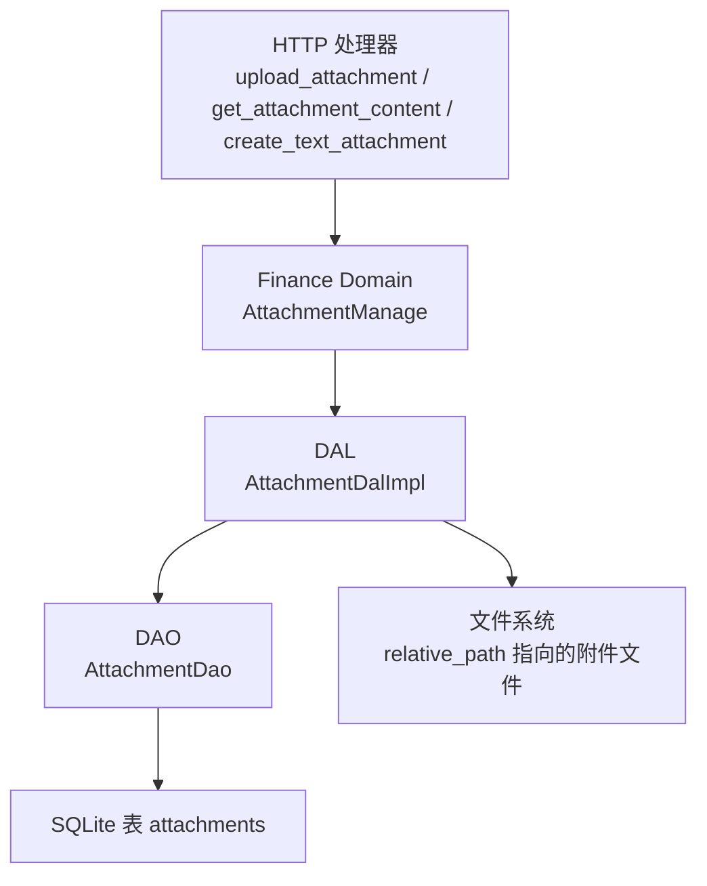
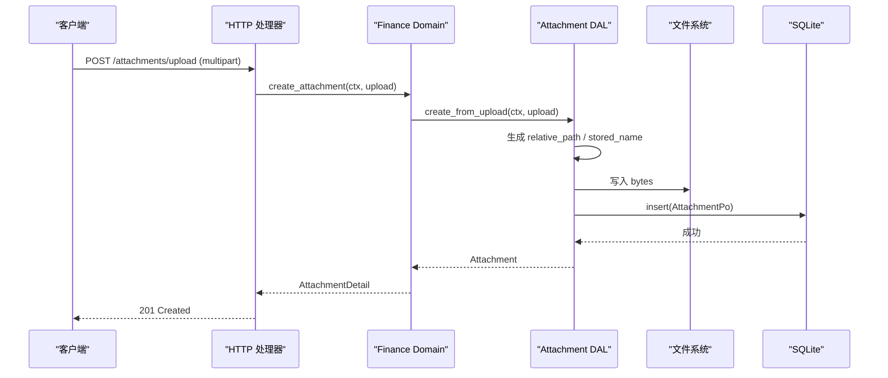
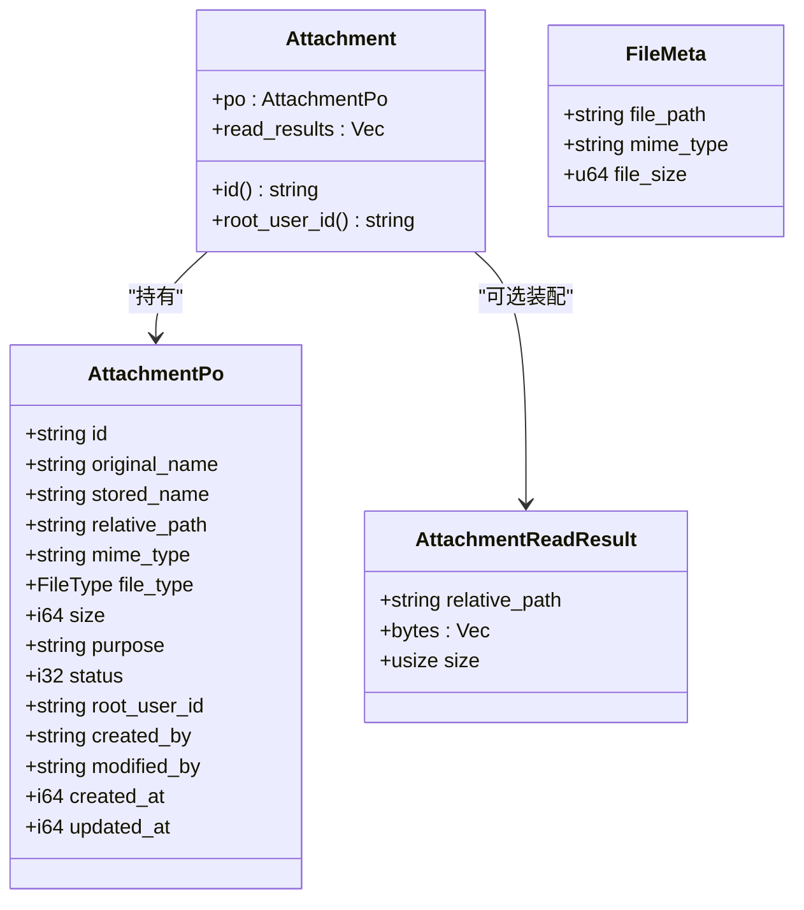
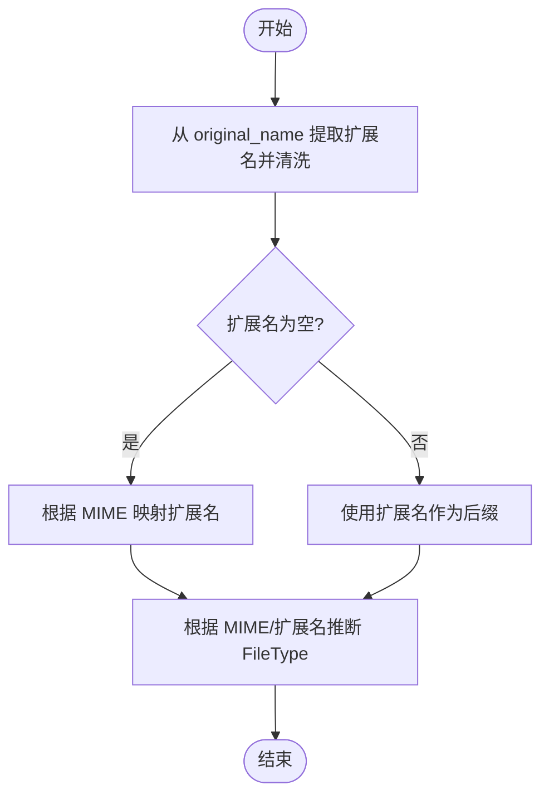
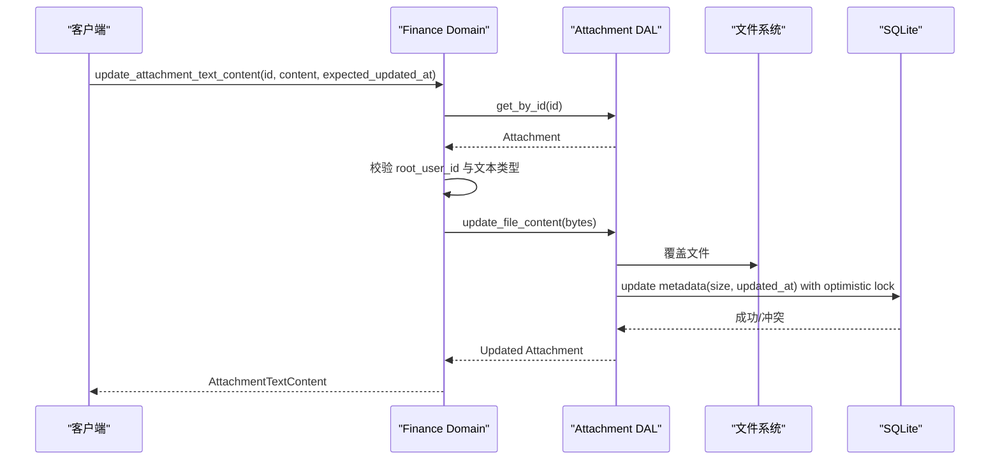
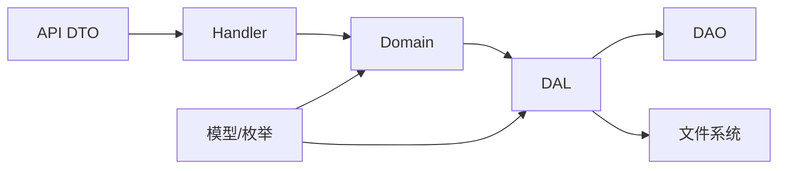

# 文件存储模型

<cite>
**本文引用的文件**
- [src/models/attachment.rs](file://src/models/attachment.rs)
- [src/models/file.rs](file://src/models/file.rs)
- [common/src/enums/file.rs](file://common/src/enums/file.rs)
- [src/service/dal/attachment.rs](file://src/service/dal/attachment.rs)
- [src/service/domain/finance/attachment.rs](file://src/service/domain/finance/attachment.rs)
- [common/src/api/attachment.rs](file://common/src/api/attachment.rs)
- [migrations/20260617000000_attachments.sql](file://migrations/20260617000000_attachments.sql)
- [src/handlers/finance/attachment/upload_attachment.rs](file://src/handlers/finance/attachment/upload_attachment.rs)
- [src/handlers/finance/attachment/get_attachment_content.rs](file://src/handlers/finance/attachment/get_attachment_content.rs)
- [src/handlers/finance/attachment/create_text_attachment.rs](file://src/handlers/finance/attachment/create_text_attachment.rs)
- [src/pkg/storage/mod.rs](file://src/pkg/storage/mod.rs)
- [src/pkg/tool_registry/fs_read.rs](file://src/pkg/tool_registry/fs_read.rs)
- [src/pkg/tool_registry/tool_security.rs](file://src/pkg/tool_registry/tool_security.rs)
</cite>

## 目录
1. [简介](#简介)
2. [项目结构](#项目结构)
3. [核心组件](#核心组件)
4. [架构总览](#架构总览)
5. [详细组件分析](#详细组件分析)
6. [依赖关系分析](#依赖关系分析)
7. [性能考虑](#性能考虑)
8. [故障排查指南](#故障排查指南)
9. [结论](#结论)
10. [附录](#附录)

## 简介
本文件围绕“附件（Attachment）”这一通用文件资产，系统化说明其数据模型、路径与元数据管理、类型识别、大小限制、访问控制、生命周期、版本控制、上传下载、文本预览与更新、权限与安全、搜索索引、存储抽象与迁移等。该能力归属 Finance Domain，遵循四层单向调用：Adapter（HTTP Handler）→ Domain → DAL → DAO，PO 仅在 DAO/DAL 内部使用，Domain 对外统一暴露业务实体。

## 项目结构
- 模型层：定义持久化对象 AttachmentPo、业务实体 Attachment、共享文件元数据 FileMeta、文件类型枚举 FileType。
- 服务层：DAL 负责上传编排、文件名/路径生成、类型推断、写入与元数据更新；Domain 实现业务校验、权限检查、文本内容读取与更新。
- 接口层：Handler 解析 multipart 表单或 JSON 请求，调用 Domain 完成上传、查询、删除、文本内容读写。
- 存储层：SQL 表 migrations 定义 attachments 表及索引；文件系统通过相对路径落盘；向量/全文检索由 pkg/storage 提供，但附件本身以本地文件 + DB 元数据为主。

图表来源
- [src/handlers/finance/attachment/upload_attachment.rs:17-82](file://src/handlers/finance/attachment/upload_attachment.rs#L17-L82)
- [src/service/domain/finance/attachment.rs:17-137](file://src/service/domain/finance/attachment.rs#L17-L137)
- [src/service/dal/attachment.rs:45-190](file://src/service/dal/attachment.rs#L45-L190)
- [migrations/20260617000000_attachments.sql:1-23](file://migrations/20260617000000_attachments.sql#L1-L23)

章节来源
- [src/models/attachment.rs:1-186](file://src/models/attachment.rs#L1-L186)
- [src/models/file.rs:1-28](file://src/models/file.rs#L1-L28)
- [common/src/enums/file.rs:1-56](file://common/src/enums/file.rs#L1-L56)
- [src/service/dal/attachment.rs:1-278](file://src/service/dal/attachment.rs#L1-L278)
- [src/service/domain/finance/attachment.rs:1-248](file://src/service/domain/finance/attachment.rs#L1-L248)
- [common/src/api/attachment.rs:1-119](file://common/src/api/attachment.rs#L1-L119)
- [migrations/20260617000000_attachments.sql:1-23](file://migrations/20260617000000_attachments.sql#L1-L23)

## 核心组件
- 持久化对象 AttachmentPo：包含 id、original_name、stored_name、relative_path、mime_type、file_type、size、purpose、status、root_user_id、审计字段与时间戳。
- 业务实体 Attachment：封装 PO 并可选装配 read_results（用于按需读取文件内容）。
- 共享元数据 FileMeta：供 artifact/message 等场景在数据库中以 JSON 形式记录文件路径、MIME、大小。
- 文件类型 FileType：Document/Image/Audio/Video/Binary，支持 i32/i64 互转，便于数据库存储与前端展示。
- 上传/文本命令：AttachmentUpload、TextAttachmentCreate、TextContentUpdate，分别对应二进制上传、小文本创建、文本全量替换。
- API DTO：AttachmentDetail、AttachmentListQuery、AttachmentContentResponse 等，前后端共享。

章节来源
- [src/models/attachment.rs:9-186](file://src/models/attachment.rs#L9-L186)
- [src/models/file.rs:6-27](file://src/models/file.rs#L6-L27)
- [common/src/enums/file.rs:11-56](file://common/src/enums/file.rs#L11-L56)
- [common/src/api/attachment.rs:9-119](file://common/src/api/attachment.rs#L9-L119)

## 架构总览
- 调用方向严格单向：Handler → Domain → DAL → DAO。
- 启动时通过 storage 初始化 SQLite 连接池并运行 migrations，确保 attachments 表存在。
- 文件落盘策略：DAL 根据 file_id 与扩展名生成 relative_path（按日期分目录），先写文件再插入元数据；更新内容时覆盖文件并刷新 size 与 updated_at。
- 类型识别：基于 MIME 与扩展名推断 FileType；文本类型进一步校验 MIME/扩展名与内容是否 UTF-8。
- 访问控制：Domain 层校验 root_user_id 与当前用户一致，未授权返回空结果；删除为软删除（status=0）。
- 版本控制：文本更新采用乐观锁（expected_updated_at 与 updated_at 比对），冲突则拒绝更新。
- 安全扫描：工具层提供路径白名单、敏感文件名拦截、符号链接拒绝等规则，可用于后续扩展至附件上传流程。

图表来源
- [src/handlers/finance/attachment/upload_attachment.rs:17-82](file://src/handlers/finance/attachment/upload_attachment.rs#L17-L82)
- [src/service/domain/finance/attachment.rs:17-39](file://src/service/domain/finance/attachment.rs#L17-L39)
- [src/service/dal/attachment.rs:96-134](file://src/service/dal/attachment.rs#L96-L134)
- [migrations/20260617000000_attachments.sql:1-23](file://migrations/20260617000000_attachments.sql#L1-L23)

## 详细组件分析

### 数据模型与字段语义
- AttachmentPo：主键 id；original_name 仅用于展示；stored_name 系统命名；relative_path 相对根目录的路径；mime_type 与 file_type 描述类型；size 字节数；purpose 用途标记；status 软删标志；root_user_id 资源归属；created_by/modified_by 审计；created_at/updated_at 时间戳。
- Attachment：包装 PO，read_results 用于按需加载文件内容，避免不必要 I/O。
- FileMeta：轻量级 JSON 元数据，适用于非附件场景的文件引用。
- FileType：统一分类，便于过滤与展示。

图表来源
- [src/models/attachment.rs:9-67](file://src/models/attachment.rs#L9-L67)
- [src/models/file.rs:6-27](file://src/models/file.rs#L6-L27)

章节来源
- [src/models/attachment.rs:9-186](file://src/models/attachment.rs#L9-L186)
- [src/models/file.rs:6-27](file://src/models/file.rs#L6-L27)
- [common/src/enums/file.rs:11-56](file://common/src/enums/file.rs#L11-L56)

### 路径映射与类型识别
- 路径生成：按日期分目录，结合 file_id 与扩展名生成 relative_path，降低单目录文件数量。
- 扩展名推断：优先从 original_name 提取并清洗，其次回退到 MIME 映射。
- MIME 推断：对文本类创建时按扩展名推断默认 MIME。
- 类型识别：基于 MIME 前缀与扩展名综合判断 FileType，未知类型归为 Binary。

图表来源
- [src/service/dal/attachment.rs:192-277](file://src/service/dal/attachment.rs#L192-L277)

章节来源
- [src/service/dal/attachment.rs:192-277](file://src/service/dal/attachment.rs#L192-L277)

### 访问控制与权限校验
- 资源隔离：get 与 update 均校验 attachment.po.root_user_id 与当前 ctx.uid() 一致，否则返回空或拒绝。
- 软删除：delete 将 status 置 0，不物理删除文件，便于恢复与审计。
- 审计字段：created_by/modified_by 记录操作者，便于追踪。

章节来源
- [src/service/domain/finance/attachment.rs:41-66](file://src/service/domain/finance/attachment.rs#L41-L66)
- [src/service/domain/finance/attachment.rs:88-124](file://src/service/domain/finance/attachment.rs#L88-L124)
- [src/models/attachment.rs:179-185](file://src/models/attachment.rs#L179-L185)

### 生命周期管理与版本控制
- 创建：上传后生成 ID、路径、类型、大小，写入文件并插入元数据。
- 读取：可按需读取文件内容，避免大文件全量加载。
- 更新：文本内容全量替换，覆盖文件并刷新 size 与 updated_at；使用 expected_updated_at 进行乐观锁，防止并发覆盖。
- 删除：软删除，保留文件以便恢复或归档。

图表来源
- [src/service/domain/finance/attachment.rs:88-124](file://src/service/domain/finance/attachment.rs#L88-L124)
- [src/service/dal/attachment.rs:175-189](file://src/service/dal/attachment.rs#L175-L189)

章节来源
- [src/service/domain/finance/attachment.rs:88-124](file://src/service/domain/finance/attachment.rs#L88-L124)
- [src/service/dal/attachment.rs:175-189](file://src/service/dal/attachment.rs#L175-L189)

### 上传、下载、预览与转换
- 上传：Handler 解析 multipart，构造 AttachmentUpload，调用 Domain → DAL 写入文件与元数据。
- 下载/读取：get_attachment 可携带 include_file_content 选项读取 bytes；get_attachment_content 专用于文本内容读取。
- 预览/转换：当前实现聚焦文本预览（UTF-8 校验与解码），未实现图片/视频转码；如需预览，可在 Domain 层扩展转换逻辑。

章节来源
- [src/handlers/finance/attachment/upload_attachment.rs:17-82](file://src/handlers/finance/attachment/upload_attachment.rs#L17-L82)
- [src/handlers/finance/attachment/get_attachment_content.rs:12-37](file://src/handlers/finance/attachment/get_attachment_content.rs#L12-L37)
- [src/service/domain/finance/attachment.rs:41-86](file://src/service/domain/finance/attachment.rs#L41-L86)

### 大小限制与安全扫描
- 文本大小限制：TEXT_CONTENT_BYTES 上限，防止过大文本导致内存压力。
- 工具层安全：fs_read 对读文件有硬限制（如 10MB），tool_security 提供路径白名单、敏感文件名拦截、符号链接拒绝等规则，可作为附件上传的安全基线参考。
- 建议：在上传入口增加文件大小上限校验与恶意文件检测（如病毒扫描），并在存储层启用路径规范化与沙箱限制。

章节来源
- [src/service/domain/finance/attachment.rs:15-16](file://src/service/domain/finance/attachment.rs#L15-L16)
- [src/pkg/tool_registry/fs_read.rs:157-178](file://src/pkg/tool_registry/fs_read.rs#L157-L178)
- [src/pkg/tool_registry/tool_security.rs:314-343](file://src/pkg/tool_registry/tool_security.rs#L314-L343)

### 搜索索引、全文检索与标签分类
- 标签分类：purpose 字段用于标记用途（如 skill/message/artifact/tool_result），配合 file_type 可实现基础筛选。
- 列表查询：AttachmentListQuery 支持 purpose、file_type、分页参数。
- 全文检索：附件内容未直接建立全文索引；可通过外部 FTS5/向量索引对文本内容进行二次处理（例如在 Domain 层触发异步任务构建索引）。

章节来源
- [common/src/api/attachment.rs:9-22](file://common/src/api/attachment.rs#L9-L22)
- [migrations/20260617000000_attachments.sql:19-22](file://migrations/20260617000000_attachments.sql#L19-L22)

### 存储后端抽象、多存储支持与迁移
- 存储初始化：storage 模块初始化 SQLite 连接池并运行 migrations，确保 attachments 表就绪。
- 多存储：当前附件以本地文件系统 + SQLite 元数据存储；若需多后端（如对象存储），可在 DAL 层抽象 write_file/read_file 接口，替换底层实现。
- 迁移：migrations 中定义了 attachments 表结构与索引，升级时自动应用。

章节来源
- [src/pkg/storage/mod.rs:42-76](file://src/pkg/storage/mod.rs#L42-L76)
- [migrations/20260617000000_attachments.sql:1-23](file://migrations/20260617000000_attachments.sql#L1-L23)

### 去重、空间统计与清理策略
- 去重：当前实现未内置内容哈希去重；可在 DAL 层引入内容摘要（如 SHA-256）与重复检测，合并相同内容以减少冗余。
- 空间统计：size 字段记录每个附件大小，可聚合统计；建议增加按用户/用途维度的统计视图。
- 清理策略：软删除后可定期清理无引用的文件；建议结合定时任务扫描 status=0 且无关联记录的附件进行物理删除。

[本节为概念性说明，不直接分析具体文件]

## 依赖关系分析
- Handler 依赖 Domain 暴露的 AttachmentManage。
- Domain 依赖 DAL 的 AttachmentDal。
- DAL 依赖 DAO 的 AttachmentDao 与文件系统。
- 模型与枚举被多层复用，API DTO 被前后端共享。

图表来源
- [src/handlers/finance/attachment/upload_attachment.rs:17-82](file://src/handlers/finance/attachment/upload_attachment.rs#L17-L82)
- [src/service/domain/finance/attachment.rs:17-137](file://src/service/domain/finance/attachment.rs#L17-L137)
- [src/service/dal/attachment.rs:45-190](file://src/service/dal/attachment.rs#L45-L190)

章节来源
- [src/handlers/finance/attachment/upload_attachment.rs:17-82](file://src/handlers/finance/attachment/upload_attachment.rs#L17-L82)
- [src/service/domain/finance/attachment.rs:17-137](file://src/service/domain/finance/attachment.rs#L17-L137)
- [src/service/dal/attachment.rs:45-190](file://src/service/dal/attachment.rs#L45-L190)

## 性能考虑
- 按需读取：read_results 仅在需要时装配，减少不必要的 I/O。
- 文本限制：MAX_TEXT_CONTENT_BYTES 限制文本大小，避免内存溢出。
- 并发写入：SQLite 单文件写并发有限，DAL 层顺序写入文件与元数据，避免竞争。
- 建议：对大文件流式写入、压缩存储（如 gzip）、异步索引构建以提升吞吐。

[本节提供一般性指导，不直接分析具体文件]

## 故障排查指南
- 缺少用户上下文：Handler 与 DAL 会校验 ctx.uid()，为空时报错。
- 文本内容非法：非 UTF-8 或包含 NUL 字节将被拒绝。
- 并发冲突：文本更新时 expected_updated_at 与 updated_at 不一致将返回冲突错误。
- 权限不足：root_user_id 不匹配将返回空结果。
- 文件过大：工具层对读文件有硬限制，上传应增加大小校验。

章节来源
- [src/handlers/finance/attachment/upload_attachment.rs:26-30](file://src/handlers/finance/attachment/upload_attachment.rs#L26-L30)
- [src/service/domain/finance/attachment.rs:180-195](file://src/service/domain/finance/attachment.rs#L180-L195)
- [src/service/domain/finance/attachment.rs:107-111](file://src/service/domain/finance/attachment.rs#L107-L111)
- [src/pkg/tool_registry/fs_read.rs:157-178](file://src/pkg/tool_registry/fs_read.rs#L157-L178)

## 结论
附件模型以 AttachmentPo/Attachment 为核心，结合 FileType 与 FileMeta 实现统一的类型与元数据管理；DAL 负责路径与类型推断、文件写入与元数据更新；Domain 实现权限、文本校验与乐观锁；Handler 提供上传、查询、文本内容读取等接口。当前实现已具备完整的生命周期管理、访问控制与版本控制，并可在此基础上扩展去重、空间统计、清理策略、预览转换与全文检索。

## 附录
- 数据库表结构：attachments 表包含 id、original_name、stored_name、relative_path、mime_type、file_type、size、purpose、status、root_user_id、审计字段与时间戳，并建立常用索引。
- API 契约：AttachmentDetail、AttachmentListQuery、AttachmentContentResponse 等 DTO 定义前后端交互格式。

章节来源
- [migrations/20260617000000_attachments.sql:1-23](file://migrations/20260617000000_attachments.sql#L1-L23)
- [common/src/api/attachment.rs:9-119](file://common/src/api/attachment.rs#L9-L119)