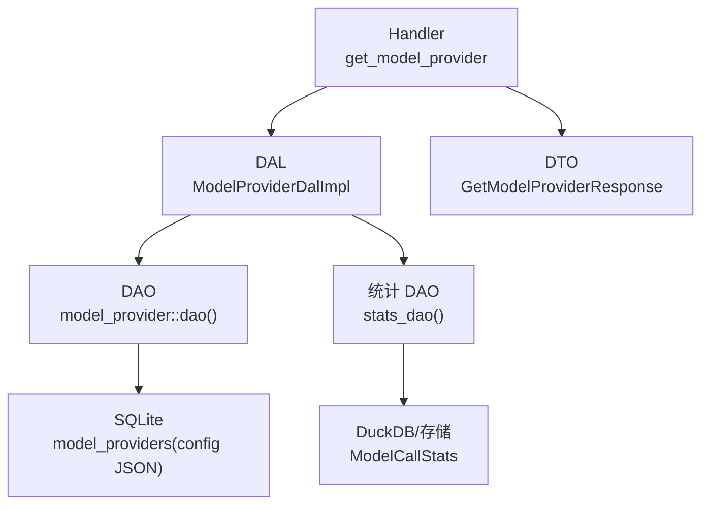
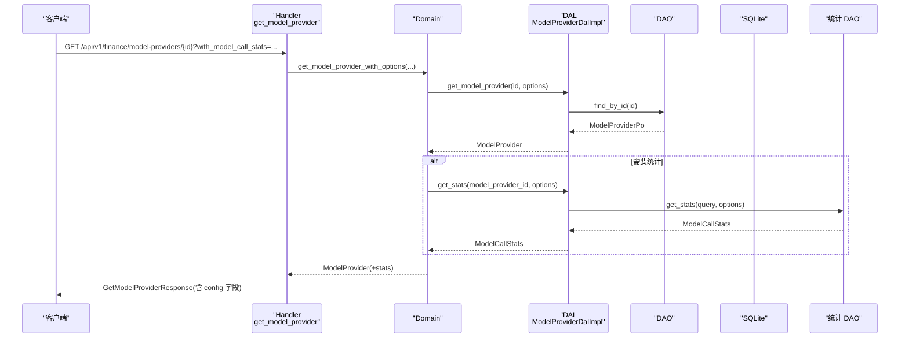
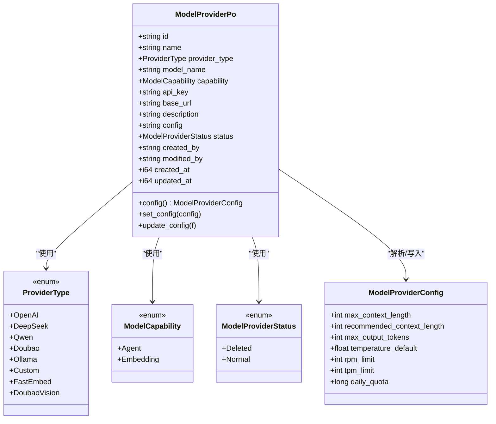
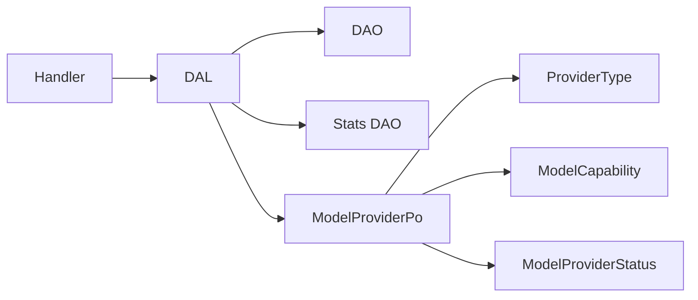
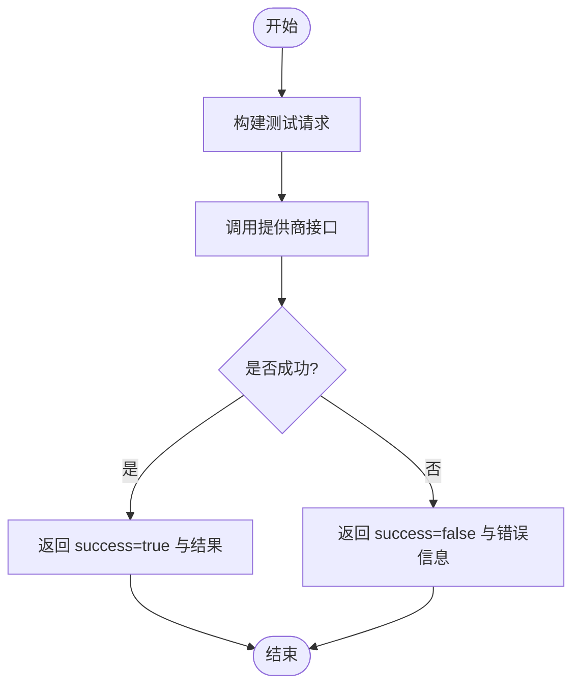

# 模型提供商配置

<cite>
**本文引用的文件**
- [src/models/model_provider.rs](file://src/models/model_provider.rs)
- [common/src/enums/provider.rs](file://common/src/enums/provider.rs)
- [common/src/enums/agent.rs](file://common/src/enums/agent.rs)
- [common/src/api/model_provider.rs](file://common/src/api/model_provider.rs)
- [src/service/dal/model_provider.rs](file://src/service/dal/model_provider.rs)
- [src/handlers/finance/model_provider/get_model_provider.rs](file://src/handlers/finance/model_provider/get_model_provider.rs)
- [migrations/20260510000000_model_provider_config.sql](file://migrations/20260510000000_model_provider_config.sql)
</cite>

## 目录
1. [简介](#简介)
2. [项目结构](#项目结构)
3. [核心组件](#核心组件)
4. [架构总览](#架构总览)
5. [详细组件分析](#详细组件分析)
6. [依赖关系分析](#依赖关系分析)
7. [性能与容量规划](#性能与容量规划)
8. [故障转移与高可用](#故障转移与高可用)
9. [测试接口与监控指标](#测试接口与监控指标)
10. [安全与环境配置](#安全与环境配置)
11. [常见问题排查](#常见问题排查)
12. [结论](#结论)

## 简介
本文面向“模型提供商配置”的数据模型与运行时能力，系统性说明：
- ModelProviderPo 持久化对象的字段、类型与约束
- ModelProviderConfig JSON 配置的参数语义（上下文窗口、推荐上下文、最大输出 token、温度、请求限制等）
- ProviderType 枚举支持的模型提供商类型
- ModelCapability 能力标识与 ModelProviderStatus 状态管理
- 连接池、负载均衡与故障转移策略建议
- 模型测试接口、性能监控指标与调用统计
- API Key 安全管理、Base URL 配置与多环境支持

## 项目结构
围绕模型提供商配置的关键代码分布在以下层次：
- 数据模型层：src/models/model_provider.rs（PO、业务对象、JSON 配置解析）
- 公共枚举与 DTO：common/src/enums/provider.rs、common/src/enums/agent.rs、common/src/api/model_provider.rs
- DAL 层：src/service/dal/model_provider.rs（查询、统计注入、分页与选项）
- 迁移脚本：migrations/20260510000000_model_provider_config.sql（config 字段）
- Handler 示例：src/handlers/finance/model_provider/get_model_provider.rs（读取 config 并返回给前端）

图表来源
- [src/handlers/finance/model_provider/get_model_provider.rs:34-71](file://src/handlers/finance/model_provider/get_model_provider.rs#L34-L71)
- [src/service/dal/model_provider.rs:124-156](file://src/service/dal/model_provider.rs#L124-L156)
- [migrations/20260510000000_model_provider_config.sql:1-3](file://migrations/20260510000000_model_provider_config.sql#L1-L3)

章节来源
- [src/models/model_provider.rs:1-248](file://src/models/model_provider.rs#L1-L248)
- [common/src/enums/provider.rs:1-154](file://common/src/enums/provider.rs#L1-L154)
- [common/src/enums/agent.rs:113-152](file://common/src/enums/agent.rs#L113-L152)
- [common/src/api/model_provider.rs:1-391](file://common/src/api/model_provider.rs#L1-L391)
- [src/service/dal/model_provider.rs:1-223](file://src/service/dal/model_provider.rs#L1-L223)
- [src/handlers/finance/model_provider/get_model_provider.rs:34-71](file://src/handlers/finance/model_provider/get_model_provider.rs#L34-L71)
- [migrations/20260510000000_model_provider_config.sql:1-3](file://migrations/20260510000000_model_provider_config.sql#L1-L3)

## 核心组件
- ModelProviderPo：持久化对象，包含基础元信息、提供商类型、能力、密钥、可选 Base URL、描述、JSON 配置、状态、审计字段与时间戳。
- ModelProviderConfig：JSON 配置对象，承载上下文窗口、推荐上下文、最大输出 token、默认温度、RPM/TPM 限制、每日配额等。
- ProviderType：模型提供商类型枚举，覆盖 OpenAI 兼容、DeepSeek、通义千问、豆包、Ollama、自定义、FastEmbed、豆包 Vision 多模态 Embedding。
- ModelCapability：区分 Agent 对话/工具调用与 Embedding 向量化两类能力。
- ModelProviderStatus：软删除状态（Deleted/Normal）。
- DAL 层：提供创建、查询、更新、删除、分页查询、统计注入等能力。

章节来源
- [src/models/model_provider.rs:9-68](file://src/models/model_provider.rs#L9-L68)
- [common/src/enums/provider.rs:9-45](file://common/src/enums/provider.rs#L9-L45)
- [common/src/enums/agent.rs:113-152](file://common/src/enums/agent.rs#L113-L152)
- [src/service/dal/model_provider.rs:43-104](file://src/service/dal/model_provider.rs#L43-L104)

## 架构总览
遵循四层单向调用：Adapter → Domain → DAL → DAO。本模块中：
- Adapter（Handler）负责接收请求、构造 DTO、调用 Domain/DAL
- Domain 负责业务规则（如嵌入提供商唯一性校验）
- DAL 封装数据访问与统计注入
- DAO 对接 SQLite/DuckDB

图表来源
- [src/handlers/finance/model_provider/get_model_provider.rs:34-71](file://src/handlers/finance/model_provider/get_model_provider.rs#L34-L71)
- [src/service/dal/model_provider.rs:124-156](file://src/service/dal/model_provider.rs#L124-L156)

## 详细组件分析

### 数据模型：ModelProviderPo
- id：字符串主键
- name：名称
- provider_type：ProviderType 枚举
- model_name：模型名
- capability：ModelCapability 枚举
- api_key：API 密钥（敏感字段）
- base_url：可选的自定义 Base URL
- description：可选描述
- config：JSON 文本，存储 ModelProviderConfig
- status：ModelProviderStatus（软删除）
- created_by/modified_by：审计字段
- created_at/updated_at：时间戳

约束与行为要点
- config 为 JSON 文本，通过 PO 的 config()/set_config()/update_config() 进行序列化/反序列化
- 空字符串的 base_url/description 会被规范化为 None
- 新建时默认 status=Normal，config="{}"

章节来源
- [src/models/model_provider.rs:37-56](file://src/models/model_provider.rs#L37-L56)
- [src/models/model_provider.rs:144-196](file://src/models/model_provider.rs#L144-L196)
- [migrations/20260510000000_model_provider_config.sql:1-3](file://migrations/20260510000000_model_provider_config.sql#L1-L3)

### 配置对象：ModelProviderConfig
字段说明
- max_context_length：上下文窗口长度（模型支持的最大 token 数），用于上下文压缩检测基准
- recommended_context_length：推荐上下文长度（优先作为压缩触发阈值），未设置时按 max_context_length * 60% 自动计算
- max_output_tokens：最大输出 token 数
- temperature_default：默认温度值（典型范围 0.0 - 2.0）
- rpm_limit：每分钟请求数限制
- tpm_limit：每分钟 token 数限制
- daily_quota：每日配额（token 或请求数）

使用方式
- 通过 PO 的 config()/set_config()/update_config() 读写
- Handler 在响应中暴露 max_context_length 与 recommended_context_length 供前端展示

章节来源
- [src/models/model_provider.rs:9-35](file://src/models/model_provider.rs#L9-L35)
- [src/handlers/finance/model_provider/get_model_provider.rs:42-70](file://src/handlers/finance/model_provider/get_model_provider.rs#L42-L70)

### 枚举：ProviderType
支持的提供商类型
- OpenAI：OpenAI 兼容
- DeepSeek：DeepSeek
- Qwen：通义千问
- Doubao：豆包
- Ollama：本地 Ollama
- Custom：自定义 OpenAI 兼容
- FastEmbed：纯本地向量化（无外部依赖）
- DoubaoVision：豆包 Vision 多模态 Embedding（使用 /embeddings/multimodal endpoint）

章节来源
- [common/src/enums/provider.rs:9-32](file://common/src/enums/provider.rs#L9-L32)

### 能力标识：ModelCapability
- Agent：用于 Agent 思考、对话、工具调用
- Embedding：用于向量化

章节来源
- [common/src/enums/provider.rs:34-45](file://common/src/enums/provider.rs#L34-L45)

### 状态管理：ModelProviderStatus
- Deleted：软删除
- Normal：正常可用

章节来源
- [common/src/enums/agent.rs:113-152](file://common/src/enums/agent.rs#L113-L152)

### 类与关系图

图表来源
- [src/models/model_provider.rs:9-68](file://src/models/model_provider.rs#L9-L68)
- [common/src/enums/provider.rs:9-45](file://common/src/enums/provider.rs#L9-L45)
- [common/src/enums/agent.rs:113-152](file://common/src/enums/agent.rs#L113-L152)

## 依赖关系分析
- Handler 依赖 DTO 与 Domain/DAL；DAL 组合 DAO 与统计 DAO；PO 依赖枚举与 JSON 序列化
- 统计注入仅在显式开启时执行，失败会降级记录日志并继续返回基础实体
- 嵌入提供商启用具有唯一性约束（Domain 层校验）

图表来源
- [src/service/dal/model_provider.rs:124-156](file://src/service/dal/model_provider.rs#L124-L156)
- [src/models/model_provider.rs:37-68](file://src/models/model_provider.rs#L37-L68)

章节来源
- [src/service/dal/model_provider.rs:124-156](file://src/service/dal/model_provider.rs#L124-L156)
- [src/models/model_provider.rs:37-68](file://src/models/model_provider.rs#L37-L68)

## 性能与容量规划
- 上下文窗口与推荐上下文
  - 以 max_context_length 作为基准，recommended_context_length 为空时按 60% 自动计算，可作为上下文压缩触发阈值
- 速率限制
  - 通过 rpm_limit 与 tpm_limit 控制每分钟请求与 token 上限
  - daily_quota 用于日级配额控制
- 统计与观测
  - 可通过 with_model_call_stats 获取汇总、Token 汇总与时序统计
  - 统计查询失败会降级并记录告警日志，不影响基础数据返回

章节来源
- [src/models/model_provider.rs:9-35](file://src/models/model_provider.rs#L9-L35)
- [src/service/dal/model_provider.rs:124-156](file://src/service/dal/model_provider.rs#L124-L156)

## 故障转移与高可用
- 提供商选择与切换
  - 嵌入提供商启用具有唯一性约束，避免多个同时启用导致冲突
- 建议策略（实现层面可扩展）
  - 基于健康检查与权重轮询的负载均衡
  - 快速失败与重试：对超时/限流错误进行退避与重试
  - 多提供商冗余：同能力下配置多个提供商，按优先级与健康度切换
  - 熔断与降级：当某提供商连续失败达到阈值后暂时隔离，回退到其他提供商或本地 FastEmbed

章节来源
- [src/service/domain/finance/model_provider.rs:54-82](file://src/service/domain/finance/model_provider.rs#L54-L82)

## 测试接口与监控指标
- 测试连接
  - 提供测试连接请求/响应 DTO，可用于验证 Base URL、API Key 与网络连通性
- 调用模型
  - 提供直接调用模型的请求/响应 DTO，便于端到端验证
- 统计指标
  - 调用次数、Token 用量、时序分布（小时/天粒度）
  - 可在获取提供商详情时附带统计信息

图表来源
- [common/src/api/model_provider.rs:209-252](file://common/src/api/model_provider.rs#L209-L252)

章节来源
- [common/src/api/model_provider.rs:209-252](file://common/src/api/model_provider.rs#L209-L252)

## 安全与环境配置
- API Key 管理
  - 存储在 PO 的 api_key 字段，属于敏感信息，应避免在日志中明文输出
- Base URL 配置
  - 支持可选 base_url，用于自定义后端地址（如代理或私有部署）
- 多环境支持
  - 通过不同提供商实例与 base_url 区分开发/测试/生产环境
  - 结合 status 字段启用/禁用特定环境的提供商
- 上下文与统计
  - 通过 config 中的 rpm_limit/tpm_limit/daily_quota 做资源保护
  - 使用 with_model_call_stats 按需加载统计，减少不必要开销

章节来源
- [src/models/model_provider.rs:37-68](file://src/models/model_provider.rs#L37-L68)
- [common/src/api/model_provider.rs:102-133](file://common/src/api/model_provider.rs#L102-L133)

## 常见问题排查
- 无法获取统计
  - 检查是否传入 with_model_call_stats=true
  - 统计查询失败会降级记录日志，不影响基础数据
- 嵌入提供商无法启用
  - 若已存在其他启用的嵌入提供商，需先切换或禁用
- 上下文压缩不生效
  - 确认已设置 max_context_length 或 recommended_context_length
  - 注意 recommended_context_length 为空时会按 60% 自动计算

章节来源
- [src/service/dal/model_provider.rs:124-156](file://src/service/dal/model_provider.rs#L124-L156)
- [src/service/domain/finance/model_provider.rs:54-82](file://src/service/domain/finance/model_provider.rs#L54-L82)

## 结论
本方案通过清晰的 PO/DTO/枚举分层与 DAL 抽象，实现了模型提供商配置的持久化、查询、统计与扩展能力。借助 JSON 配置与能力/状态枚举，系统可灵活适配多种提供商与运行场景，并通过统计与测试接口保障可观测性与可维护性。建议在后续迭代中完善负载均衡、熔断与多提供商冗余策略，进一步提升稳定性与弹性。