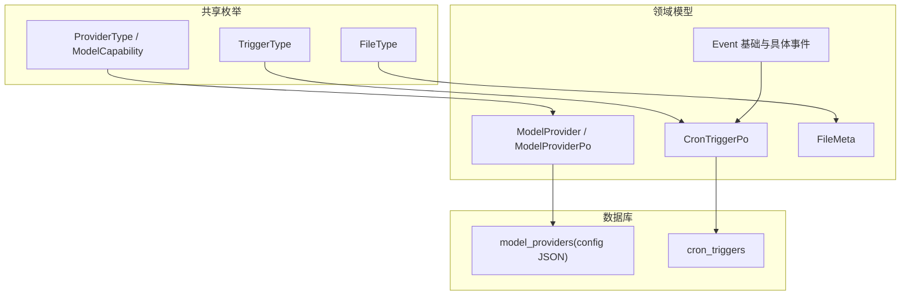
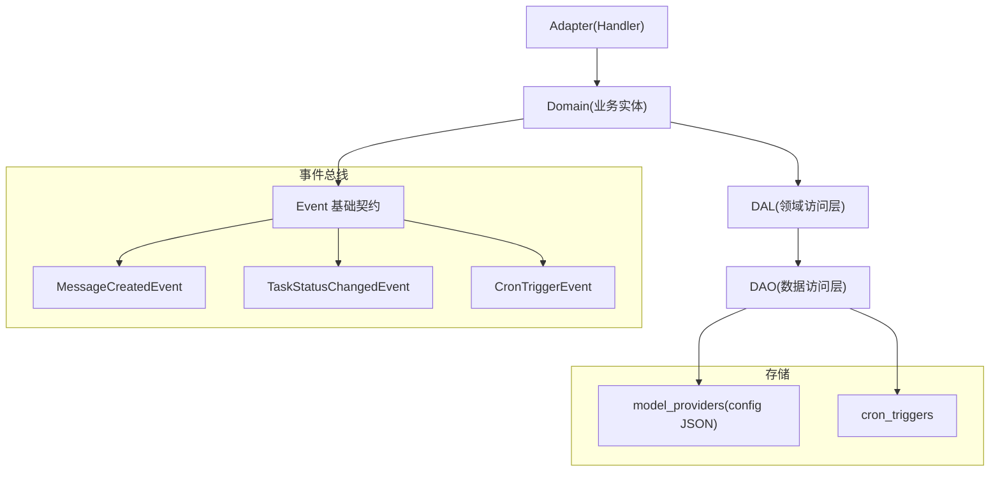
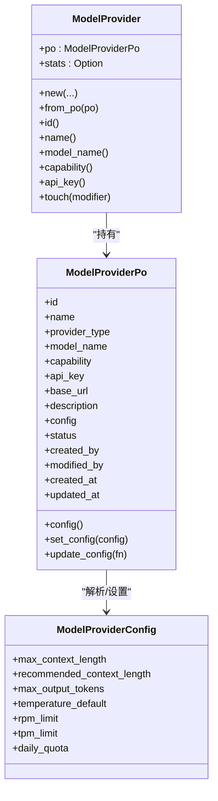
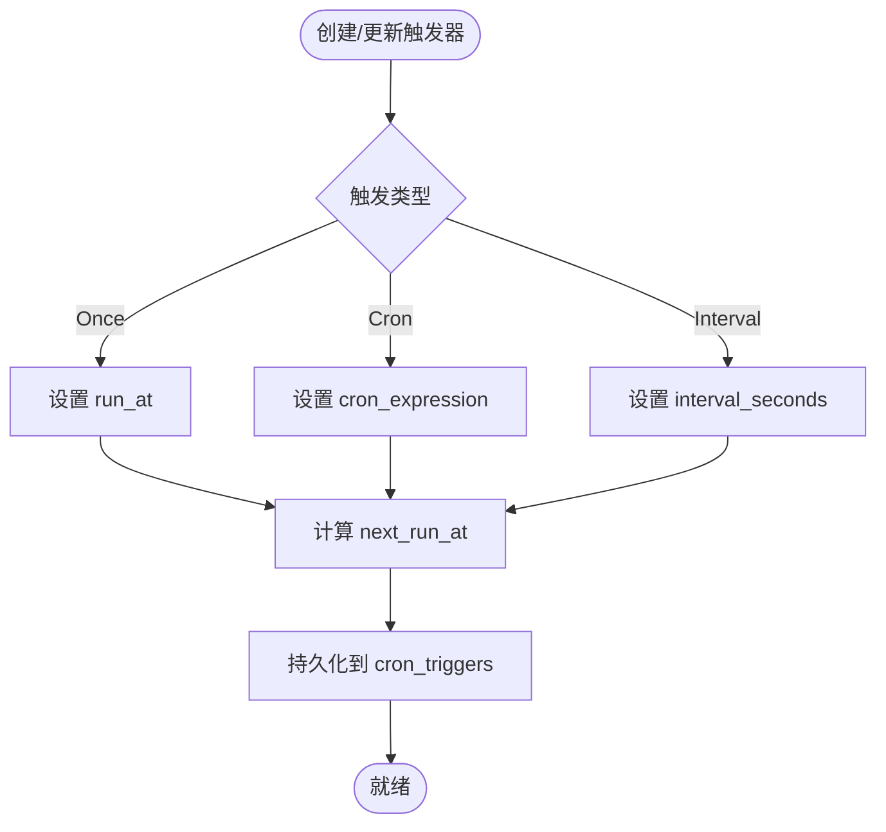
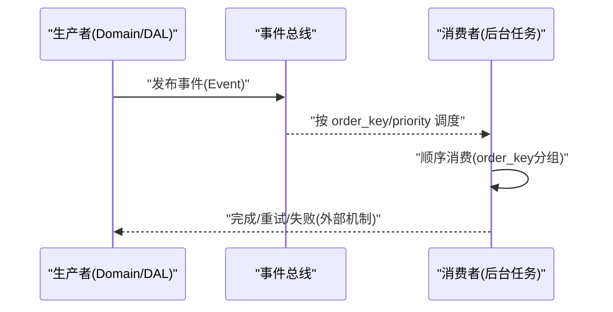
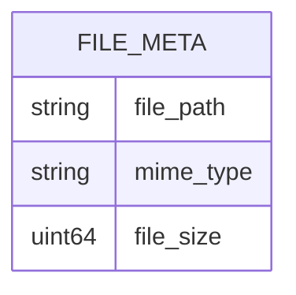
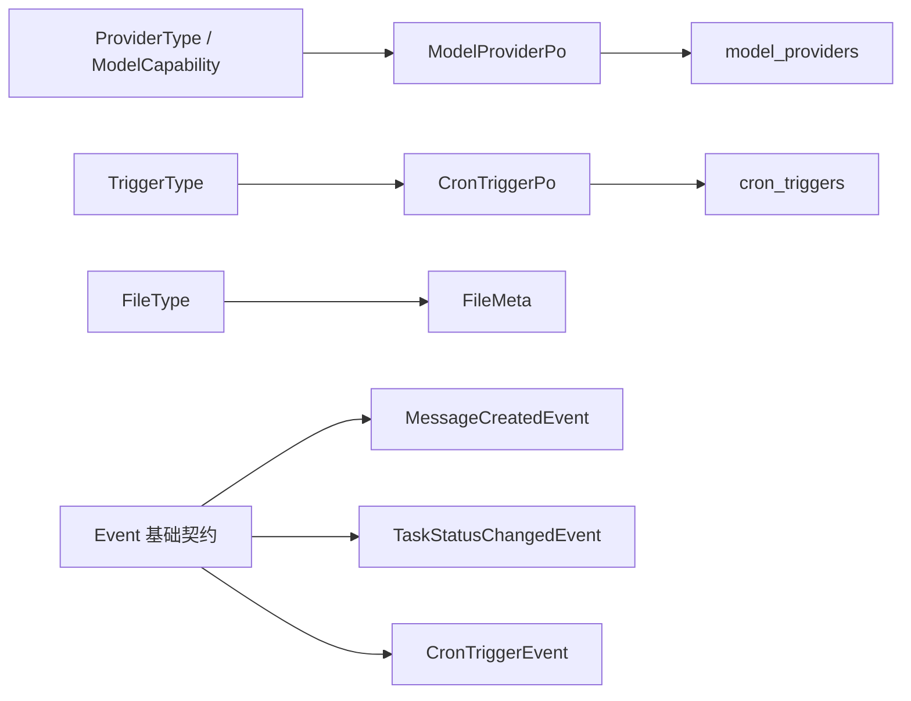

# 系统模型

<cite>
**本文引用的文件**
- [src/models/model_provider.rs](file://src/models/model_provider.rs)
- [common/src/enums/provider.rs](file://common/src/enums/provider.rs)
- [migrations/20260510000000_model_provider_config.sql](file://migrations/20260510000000_model_provider_config.sql)
- [src/models/cron_trigger.rs](file://src/models/cron_trigger.rs)
- [common/src/enums/cron_trigger.rs](file://common/src/enums/cron_trigger.rs)
- [migrations/20260711000000_cron_triggers.sql](file://migrations/20260711000000_cron_triggers.sql)
- [src/models/event.rs](file://src/models/event.rs)
- [src/models/events/mod.rs](file://src/models/events/mod.rs)
- [src/models/events/cron_trigger.rs](file://src/models/events/cron_trigger.rs)
- [src/models/events/message.rs](file://src/models/events/message.rs)
- [src/models/events/task_status.rs](file://src/models/events/task_status.rs)
- [src/models/file.rs](file://src/models/file.rs)
- [common/src/enums/file.rs](file://common/src/enums/file.rs)
</cite>

## 目录
1. [简介](#简介)
2. [项目结构](#项目结构)
3. [核心组件](#核心组件)
4. [架构总览](#架构总览)
5. [详细组件分析](#详细组件分析)
6. [依赖关系分析](#依赖关系分析)
7. [性能考量](#性能考量)
8. [故障排查指南](#故障排查指南)
9. [结论](#结论)
10. [附录](#附录)

## 简介
本文件聚焦 AI Orz 系统管理模块的数据模型，覆盖以下关键实体与能力：
- Model Provider（模型提供商）：模型配置、连接管理与性能监控的数据结构与使用方式。
- Cron Trigger（定时触发器）：定时任务调度、执行日志与错误处理相关的数据结构。
- Event（事件）：事件类型、发布订阅模式与异步处理的数据契约。
- File（文件元数据）：文件管理、路径映射与访问控制所需的基础结构。
- 系统配置与健康检查：围绕上述实体的配置项、状态与可观测性字段说明。

本项目遵循严格四层单向调用：Adapter → Domain → DAL → DAO；PO 仅在 DAO/DAL 内部使用，Domain 层输入为 Command/Query，输出业务实体与内部事件；service 层公共方法首参统一为 RequestContext，跨层传递使用 ctx.clone()。

## 项目结构
围绕管理模块的数据模型，主要分布在如下位置：
- 领域模型与持久化对象：src/models/*
- 共享枚举与类型：common/src/enums/*
- 数据库迁移：migrations/*
- 事件定义：src/models/events/*

图表来源
- [src/models/model_provider.rs:1-248](file://src/models/model_provider.rs#L1-L248)
- [common/src/enums/provider.rs:1-154](file://common/src/enums/provider.rs#L1-L154)
- [src/models/cron_trigger.rs:1-66](file://src/models/cron_trigger.rs#L1-L66)
- [common/src/enums/cron_trigger.rs:1-47](file://common/src/enums/cron_trigger.rs#L1-L47)
- [src/models/file.rs:1-28](file://src/models/file.rs#L1-L28)
- [common/src/enums/file.rs:1-56](file://common/src/enums/file.rs#L1-L56)
- [migrations/20260510000000_model_provider_config.sql:1-3](file://migrations/20260510000000_model_provider_config.sql#L1-L3)
- [migrations/20260711000000_cron_triggers.sql:1-25](file://migrations/20260711000000_cron_triggers.sql#L1-L25)

章节来源
- [src/models/model_provider.rs:1-248](file://src/models/model_provider.rs#L1-L248)
- [common/src/enums/provider.rs:1-154](file://common/src/enums/provider.rs#L1-L154)
- [src/models/cron_trigger.rs:1-66](file://src/models/cron_trigger.rs#L1-L66)
- [common/src/enums/cron_trigger.rs:1-47](file://common/src/enums/cron_trigger.rs#L1-L47)
- [src/models/file.rs:1-28](file://src/models/file.rs#L1-L28)
- [common/src/enums/file.rs:1-56](file://common/src/enums/file.rs#L1-L56)
- [migrations/20260510000000_model_provider_config.sql:1-3](file://migrations/20260510000000_model_provider_config.sql#L1-L3)
- [migrations/20260711000000_cron_triggers.sql:1-25](file://migrations/20260711000000_cron_triggers.sql#L1-L25)

## 核心组件
本节概述四大核心数据模型及其职责边界：
- Model Provider：封装模型提供商的配置、状态与可选统计信息，支持 JSON 配置存储与上下文增强。
- Cron Trigger：描述定时任务的触发规则、运行计划与负载载荷，支撑一次性、Cron 表达式与固定间隔三种触发模式。
- Event：定义事件总线契约，包括主题、优先级、排序键与创建时间，确保有序与可追踪的异步处理。
- File：统一的文件元数据结构，用于附件与制品的文件路径、MIME 类型与大小记录。

章节来源
- [src/models/model_provider.rs:1-248](file://src/models/model_provider.rs#L1-L248)
- [src/models/cron_trigger.rs:1-66](file://src/models/cron_trigger.rs#L1-L66)
- [src/models/event.rs:1-104](file://src/models/event.rs#L1-L104)
- [src/models/file.rs:1-28](file://src/models/file.rs#L1-L28)

## 架构总览
下图展示了管理模块数据模型在系统中的位置与交互方向，强调 Adapter→Domain→DAL→DAO 的单向依赖以及事件总线的异步解耦。

图表来源
- [src/models/event.rs:1-104](file://src/models/event.rs#L1-L104)
- [src/models/events/message.rs:1-53](file://src/models/events/message.rs#L1-L53)
- [src/models/events/task_status.rs:1-66](file://src/models/events/task_status.rs#L1-L66)
- [src/models/events/cron_trigger.rs:1-30](file://src/models/events/cron_trigger.rs#L1-L30)
- [migrations/20260510000000_model_provider_config.sql:1-3](file://migrations/20260510000000_model_provider_config.sql#L1-L3)
- [migrations/20260711000000_cron_triggers.sql:1-25](file://migrations/20260711000000_cron_triggers.sql#L1-L25)

## 详细组件分析

### Model Provider（模型提供商）
- 配置与能力
  - 提供商类型：OpenAI、DeepSeek、Qwen、Doubao、Ollama、Custom、FastEmbed、DoubaoVision。
  - 模型能力：Agent（对话/思考/工具调用）或 Embedding（向量化）。
  - 配置项（JSON 存储）：上下文窗口长度、推荐上下文长度、最大输出 token、默认温度、每分钟请求/Token 限制、每日配额等。
- 持久化对象与业务对象
  - PO：包含 id、name、provider_type、model_name、capability、api_key、base_url、description、config(JSON)、status、审计字段与时间戳。
  - 业务对象：包装 PO，并可选择携带模型调用统计（由上层查询时附加）。
- 连接管理与状态
  - 通过 status 字段标识提供商状态（如正常/异常），便于健康检查与路由选择。
  - config 字段以 JSON 形式保存运行时可调参数，提供解析与更新接口。
- 上下文增强
  - 实现 EnrichContext，将 model_provider_id 与 model_name 注入 RequestContext，便于链路追踪与指标打点。

图表来源
- [src/models/model_provider.rs:1-248](file://src/models/model_provider.rs#L1-L248)
- [common/src/enums/provider.rs:1-154](file://common/src/enums/provider.rs#L1-L154)
- [migrations/20260510000000_model_provider_config.sql:1-3](file://migrations/20260510000000_model_provider_config.sql#L1-L3)

章节来源
- [src/models/model_provider.rs:1-248](file://src/models/model_provider.rs#L1-L248)
- [common/src/enums/provider.rs:1-154](file://common/src/enums/provider.rs#L1-L154)
- [migrations/20260510000000_model_provider_config.sql:1-3](file://migrations/20260510000000_model_provider_config.sql#L1-L3)

### Cron Trigger（定时触发器）
- 触发类型
  - Once（一次性）、Cron（表达式）、Interval（固定间隔）。
- 调度字段
  - cron_expression、interval_seconds、run_at 决定触发时机；next_run_at 表示下次执行时间；last_run_at 记录上次执行时间。
- 负载与开关
  - payload 为 JSON 负载，承载任务执行所需参数；is_enabled 控制启停。
- 生命周期
  - 新建时生成唯一 ID（UUID v7），自动填充审计字段与初始时间戳；touch 方法更新修改人与时间。

图表来源
- [src/models/cron_trigger.rs:1-66](file://src/models/cron_trigger.rs#L1-L66)
- [common/src/enums/cron_trigger.rs:1-47](file://common/src/enums/cron_trigger.rs#L1-L47)
- [migrations/20260711000000_cron_triggers.sql:1-25](file://migrations/20260711000000_cron_triggers.sql#L1-L25)

章节来源
- [src/models/cron_trigger.rs:1-66](file://src/models/cron_trigger.rs#L1-L66)
- [common/src/enums/cron_trigger.rs:1-47](file://common/src/enums/cron_trigger.rs#L1-L47)
- [migrations/20260711000000_cron_triggers.sql:1-25](file://migrations/20260711000000_cron_triggers.sql#L1-L25)

### Event（事件）
- 事件基础契约
  - 主题：Message、TaskChange、CronTrigger、Custom(u16)。
  - 引用：EventRef 包含 event_id、order_key、priority、created_at，用于堆排序与队列存储。
  - 事件接口：要求实现 id、topic、order_key、priority、created_at 等，保证可序列化、可比较、可克隆。
- 具体事件
  - MessageCreatedEvent：消息创建事件，order_key 按接收者角色分层（Agent 维度串行，否则按 task/project 降级）。
  - TaskStatusChangedEvent：任务状态变更事件，order_key 为 task_id，确保同一任务的状态变更顺序消费。
  - CronTriggerEvent：定时触发事件，order_key 为 trigger_id，保障同一触发器的顺序执行。
- 发布订阅与异步处理
  - 通过 AOP 事件总线发布，消费者异步处理，降低主流程耦合度与延迟。

图表来源
- [src/models/event.rs:1-104](file://src/models/event.rs#L1-L104)
- [src/models/events/message.rs:1-53](file://src/models/events/message.rs#L1-L53)
- [src/models/events/task_status.rs:1-66](file://src/models/events/task_status.rs#L1-L66)
- [src/models/events/cron_trigger.rs:1-30](file://src/models/events/cron_trigger.rs#L1-L30)

章节来源
- [src/models/event.rs:1-104](file://src/models/event.rs#L1-L104)
- [src/models/events/mod.rs:1-21](file://src/models/events/mod.rs#L1-L21)
- [src/models/events/message.rs:1-53](file://src/models/events/message.rs#L1-L53)
- [src/models/events/task_status.rs:1-66](file://src/models/events/task_status.rs#L1-L66)
- [src/models/events/cron_trigger.rs:1-30](file://src/models/events/cron_trigger.rs#L1-L30)

### File（文件元数据）
- 用途：统一记录附件与制品的文件路径、MIME 类型与文件大小，供前后端一致展示与下载。
- 字段说明
  - file_path：相对路径（相对于附件目录）。
  - mime_type：MIME 类型（如 application/pdf、image/png）。
  - file_size：字节数。
- 访问控制建议
  - 基于 file_path 进行权限校验，结合组织/项目/任务上下文限制访问范围。
  - 对外暴露下载接口时，校验当前用户是否有权访问对应资源。

图表来源
- [src/models/file.rs:1-28](file://src/models/file.rs#L1-L28)
- [common/src/enums/file.rs:1-56](file://common/src/enums/file.rs#L1-L56)

章节来源
- [src/models/file.rs:1-28](file://src/models/file.rs#L1-L28)
- [common/src/enums/file.rs:1-56](file://common/src/enums/file.rs#L1-L56)

### 系统配置、健康检查与运维监控
- 系统配置
  - Model Provider 的运行时参数通过 config(JSON) 集中管理，支持动态更新与部分字段增量修改。
  - 触发器配置通过 cron_triggers 表维护，支持一次性、Cron 表达式与固定间隔三种模式。
- 健康检查
  - 通过 ModelProvider.status 反映提供商可用性；结合 RPM/TPM/配额等限流配置，评估服务健康度。
- 运维监控
  - 事件总线提供可观测性：MessageCreatedEvent、TaskStatusChangedEvent、CronTriggerEvent 可用于追踪消息投递、任务状态流转与定时任务执行情况。
  - 上下文增强：ModelProviderPo/ModelProvider 实现 EnrichContext，将 provider 与模型信息注入 RequestContext，便于链路追踪与指标采集。

章节来源
- [src/models/model_provider.rs:1-248](file://src/models/model_provider.rs#L1-L248)
- [src/models/cron_trigger.rs:1-66](file://src/models/cron_trigger.rs#L1-L66)
- [src/models/event.rs:1-104](file://src/models/event.rs#L1-L104)

## 依赖关系分析
- 模型与枚举
  - ModelProviderPo 依赖 ProviderType、ModelCapability、ModelProviderStatus（来自 common 枚举）。
  - CronTriggerPo 依赖 TriggerType。
  - FileMeta 与 FileType 配合，形成统一分类。
- 事件与调度
  - 事件基础契约约束所有具体事件的字段与行为；order_key 与 priority 决定消费顺序与并行度。
- 存储与迁移
  - model_providers.config 为 JSON 文本列，支持灵活扩展。
  - cron_triggers 表包含索引优化查询与调度效率。

图表来源
- [common/src/enums/provider.rs:1-154](file://common/src/enums/provider.rs#L1-L154)
- [common/src/enums/cron_trigger.rs:1-47](file://common/src/enums/cron_trigger.rs#L1-L47)
- [common/src/enums/file.rs:1-56](file://common/src/enums/file.rs#L1-L56)
- [src/models/model_provider.rs:1-248](file://src/models/model_provider.rs#L1-L248)
- [src/models/cron_trigger.rs:1-66](file://src/models/cron_trigger.rs#L1-L66)
- [src/models/event.rs:1-104](file://src/models/event.rs#L1-L104)
- [migrations/20260510000000_model_provider_config.sql:1-3](file://migrations/20260510000000_model_provider_config.sql#L1-L3)
- [migrations/20260711000000_cron_triggers.sql:1-25](file://migrations/20260711000000_cron_triggers.sql#L1-L25)

章节来源
- [common/src/enums/provider.rs:1-154](file://common/src/enums/provider.rs#L1-L154)
- [common/src/enums/cron_trigger.rs:1-47](file://common/src/enums/cron_trigger.rs#L1-L47)
- [common/src/enums/file.rs:1-56](file://common/src/enums/file.rs#L1-L56)
- [src/models/model_provider.rs:1-248](file://src/models/model_provider.rs#L1-L248)
- [src/models/cron_trigger.rs:1-66](file://src/models/cron_trigger.rs#L1-L66)
- [src/models/event.rs:1-104](file://src/models/event.rs#L1-L104)
- [migrations/20260510000000_model_provider_config.sql:1-3](file://migrations/20260510000000_model_provider_config.sql#L1-L3)
- [migrations/20260711000000_cron_triggers.sql:1-25](file://migrations/20260711000000_cron_triggers.sql#L1-L25)

## 性能考量
- 事件消费顺序与并行
  - 通过 order_key 对同组事件串行消费，避免竞争；不同组可并行处理，提升吞吐。
  - 优先级 priority 控制高优事件优先消费，适合告警与关键状态变更。
- 数据库索引
  - cron_triggers 表针对 next_run_at、is_enabled、trigger_type、created_at 建立索引，加速调度与查询。
- 配置与限流
  - Model Provider 的 rpm_limit、tpm_limit、daily_quota 可在上游限流，防止过载。
  - 推荐上下文长度用于压缩触发阈值，减少大上下文带来的开销。

[本节为通用指导，不直接分析具体文件]

## 故障排查指南
- 定时任务未执行
  - 检查 cron_triggers.next_run_at 与 is_enabled 是否正确；确认 cron_expression 或 interval_seconds 配置无误。
- 事件乱序或丢失
  - 核对 order_key 设计是否符合业务语义（如 Agent 维度串行、任务维度串行）；检查消费者是否成功 ack。
- 模型提供商不可用
  - 查看 status 字段；检查 config 中的限流与配额；结合上下文增强信息进行链路追踪定位。
- 文件访问失败
  - 校验 file_path 是否存在且权限正确；确认 MIME 类型与前端渲染匹配；检查访问控制逻辑。

章节来源
- [migrations/20260711000000_cron_triggers.sql:1-25](file://migrations/20260711000000_cron_triggers.sql#L1-L25)
- [src/models/event.rs:1-104](file://src/models/event.rs#L1-L104)
- [src/models/model_provider.rs:1-248](file://src/models/model_provider.rs#L1-L248)
- [src/models/file.rs:1-28](file://src/models/file.rs#L1-L28)

## 结论
本数据模型文档梳理了 AI Orz 系统管理模块的核心实体与契约：
- Model Provider 通过结构化配置与状态字段，支撑连接管理与可观测性。
- Cron Trigger 提供灵活的调度能力，并通过索引与字段设计保障执行效率。
- Event 体系以统一契约与顺序控制，实现可靠的异步解耦。
- File 元数据为附件与制品的统一管理奠定基础。
这些模型共同构成系统管理能力的基石，配合四层架构与 AOP 事件总线，确保可扩展、可观测与高性能。

[本节为总结性内容，不直接分析具体文件]

## 附录
- 术语
  - PO：持久化对象，仅 DAO/DAL 内部使用。
  - 业务实体：Domain 层对外暴露的对象，通常包装 PO 并附加业务逻辑。
  - 上下文增强：将关键标识注入 RequestContext，便于追踪与监控。
- 最佳实践
  - 保持 order_key 粒度合理，避免过粗导致阻塞、过细导致并发不足。
  - 配置项尽量集中在 JSON 字段，便于版本演进与灰度发布。
  - 健康检查与限流策略应前置到调用方，保护下游服务。

[本节为补充说明，不直接分析具体文件]