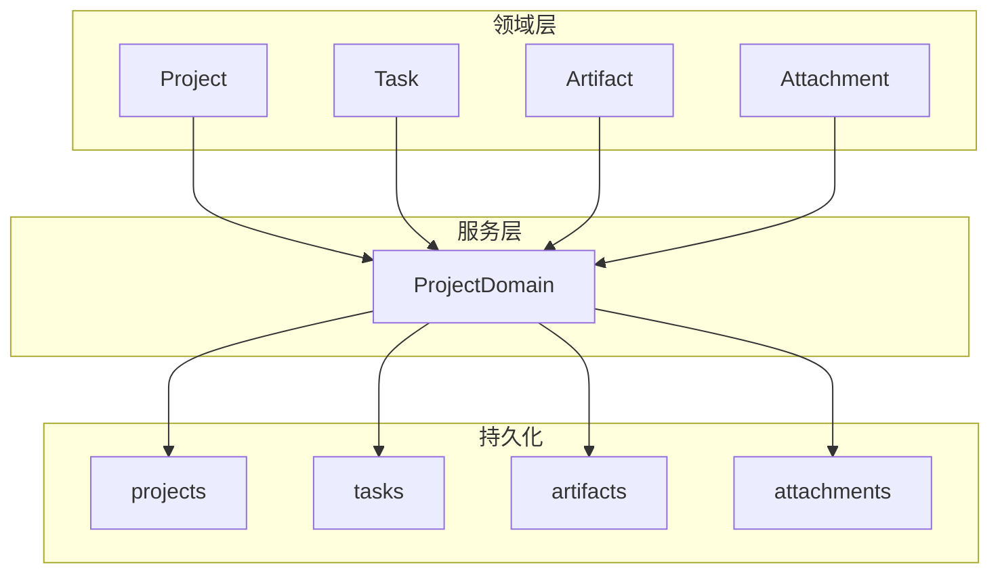
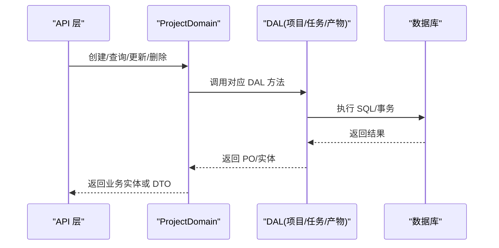
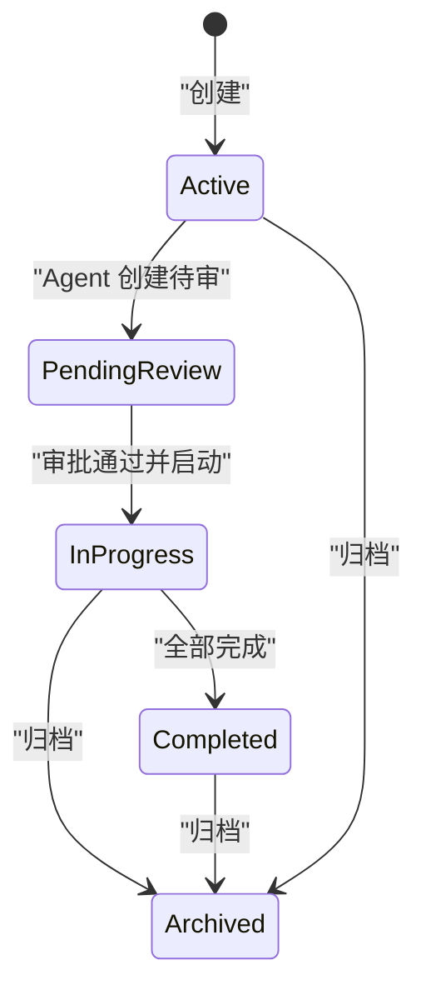
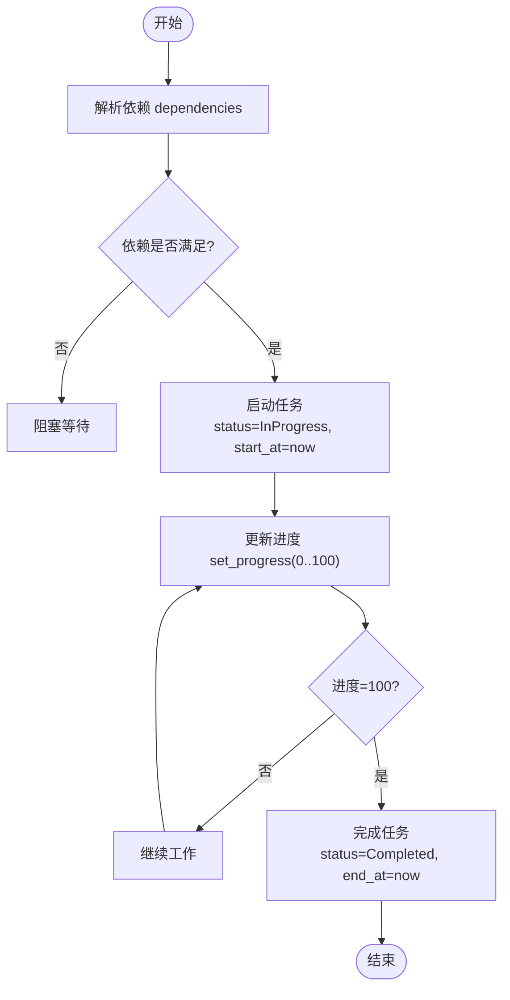
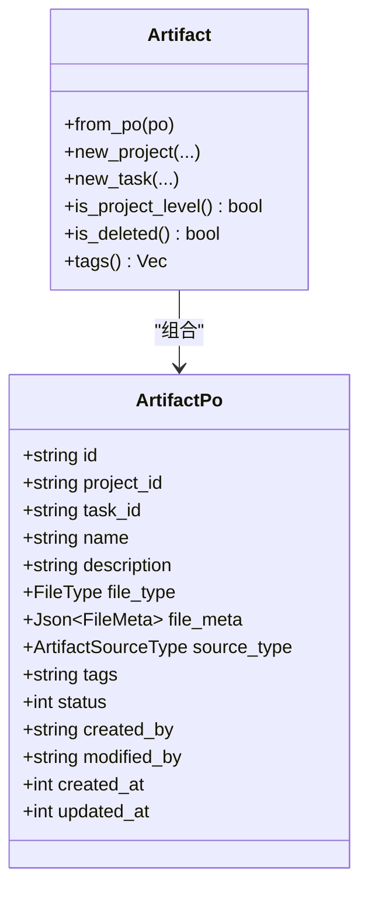
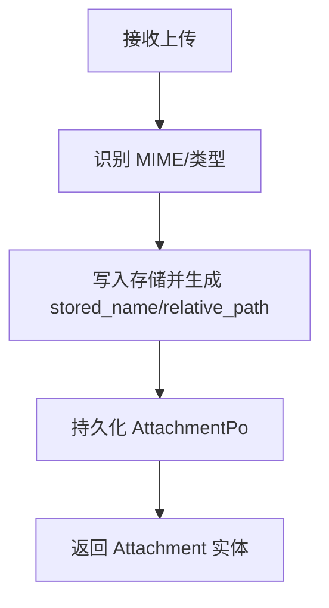
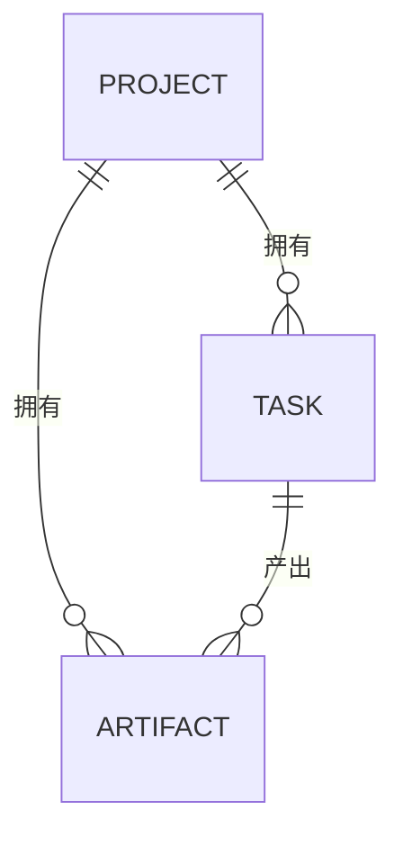

# 项目和任务模型

<cite>
**本文引用的文件**
- [src/models/project.rs](file://src/models/project.rs)
- [src/models/task.rs](file://src/models/task.rs)
- [src/models/artifact.rs](file://src/models/artifact.rs)
- [src/models/attachment.rs](file://src/models/attachment.rs)
- [common/src/enums/project.rs](file://common/src/enums/project.rs)
- [common/src/enums/task.rs](file://common/src/enums/task.rs)
- [common/src/enums/artifact.rs](file://common/src/enums/artifact.rs)
- [common/src/enums/file.rs](file://common/src/enums/file.rs)
- [migrations/20260420000000_initial.sql](file://migrations/20260420000000_initial.sql)
- [migrations/20260509000000_artifact_add_project_id.sql](file://migrations/20260509000000_artifact_add_project_id.sql)
- [migrations/20260617000000_attachments.sql](file://migrations/20260617000000_attachments.sql)
- [migrations/20260712000002_task_progress.sql](file://migrations/20260712000002_task_progress.sql)
- [src/service/domain/project/mod.rs](file://src/service/domain/project/mod.rs)
- [common/src/models/stats.rs](file://common/src/models/stats.rs)
</cite>

## 目录
1. [简介](#简介)
2. [项目结构](#项目结构)
3. [核心数据模型](#核心数据模型)
4. [架构总览](#架构总览)
5. [详细组件分析](#详细组件分析)
6. [依赖关系分析](#依赖关系分析)
7. [性能与扩展性](#性能与扩展性)
8. [故障排查指南](#故障排查指南)
9. [结论](#结论)
10. [附录：CRUD 与业务规则](#附录crud-与业务规则)

## 简介
本文件为 AI Orz 项目管理系统的“项目与任务”数据模型文档，聚焦以下目标：
- 说明 Project 实体的组织结构、成员管理（负责人 Agent）与状态流转。
- 记录 Task 实体的任务分解、进度跟踪与依赖关系。
- 解释 Artifact 实体的版本控制、内容存储与元数据管理。
- 记录 Attachment 实体的文件上传、类型识别与访问控制。
- 描述项目层级关系、任务分配机制与协作工作流程。
- 提供完整的 CRUD 操作与业务规则。

## 项目结构
本项目采用分层架构：Domain 层定义业务实体与规则；DAO/DAL 负责数据访问；API 层暴露接口；数据库通过迁移脚本维护表结构。与本项目相关的关键位置如下：
- 领域模型：Project、Task、Artifact、Attachment
- 枚举与公共统计：ProjectStatus、TaskStatus、AssigneeType、FileType、ArtifactSourceType、ProjectProgressSummary
- 数据库迁移：projects、tasks、artifacts、attachments 等表结构演进
- 领域服务：ProjectDomain 聚合 Project/Task/Artifact 管理能力

图表来源
- [src/service/domain/project/mod.rs:91-105](file://src/service/domain/project/mod.rs#L91-L105)
- [migrations/20260420000000_initial.sql:73-115](file://migrations/20260420000000_initial.sql#L73-L115)
- [migrations/20260509000000_artifact_add_project_id.sql:11-25](file://migrations/20260509000000_artifact_add_project_id.sql#L11-L25)
- [migrations/20260617000000_attachments.sql:2-17](file://migrations/20260617000000_attachments.sql#L2-L17)

章节来源
- [src/service/domain/project/mod.rs:91-105](file://src/service/domain/project/mod.rs#L91-L105)
- [migrations/20260420000000_initial.sql:73-115](file://migrations/20260420000000_initial.sql#L73-L115)
- [migrations/20260509000000_artifact_add_project_id.sql:11-25](file://migrations/20260509000000_artifact_add_project_id.sql#L11-L25)
- [migrations/20260617000000_attachments.sql:2-17](file://migrations/20260617000000_attachments.sql#L2-L17)

## 核心数据模型
本节从持久化对象（Po）与业务实体两个层面，梳理各实体的字段、关系与约束。

### Project（项目）
- 持久化对象 ProjectPo
  - 关键字段：id、name、description、workflow、guidance、status、priority、tags(JSON)、root_user_id、owner_agent_id(可选)、start_at/due_at/end_at、created_by/modified_by、created_at/updated_at、execution_plan/result、last_followup_at
  - 标签以 JSON 字符串存储，支持序列化/反序列化
- 业务实体 Project
  - 聚合 Po 及搜索匹配信息、统计数据、模型调用统计、任务依赖图、产物列表、实时进度汇总
  - 提供启动/完成等方法，自动设置时间戳与状态
- 状态枚举 ProjectStatus
  - Deleted、Active、PendingReview、InProgress、Completed、Archived
- 进度汇总 ProjectProgressSummary
  - 基于任务列表实时计算：总数、已完成、进行中、待启动、阻塞、已取消、整体百分比

章节来源
- [src/models/project.rs:15-80](file://src/models/project.rs#L15-L80)
- [src/models/project.rs:173-183](file://src/models/project.rs#L173-L183)
- [src/models/project.rs:214-263](file://src/models/project.rs#L214-L263)
- [common/src/enums/project.rs:8-27](file://common/src/enums/project.rs#L8-L27)
- [common/src/models/stats.rs:151-171](file://common/src/models/stats.rs#L151-L171)

### Task（任务）
- 持久化对象 TaskPo
  - 关键字段：id、title、description、status、priority、tags(JSON)、due_at/start_at/end_at、dependencies(JSON 数组，可为空)、root_user_id、assignee_type(Agent/User)、assignee_id、project_id(可选)、thinking_depth、progress(0-100)、created_by/modified_by、created_at/updated_at、execution_plan/result
  - 依赖以 JSON 字符串存储，空时存 None
- 业务实体 Task
  - 聚合 Po 及搜索匹配、统计数据、模型调用统计、产物列表
  - 提供开始/完成/取消、进度设置、思考深度计数等方法
- 状态枚举 TaskStatus
  - Cancelled、PendingReview、Pending、InProgress、Completed、Archived
- 分配者类型 AssigneeType
  - User、Agent

章节来源
- [src/models/task.rs:16-81](file://src/models/task.rs#L16-L81)
- [src/models/task.rs:172-188](file://src/models/task.rs#L172-L188)
- [src/models/task.rs:237-315](file://src/models/task.rs#L237-L315)
- [common/src/enums/task.rs:8-27](file://common/src/enums/task.rs#L8-L27)
- [common/src/enums/task.rs:61-72](file://common/src/enums/task.rs#L61-L72)
- [migrations/20260712000002_task_progress.sql:1-4](file://migrations/20260712000002_task_progress.sql#L1-L4)

### Artifact（产物）
- 持久化对象 ArtifactPo
  - 关键字段：id、project_id(必填)、task_id(可选，None 表示项目级产物)、name、description、file_type(FileType)、file_meta(Json<FileMeta>)、source_type(ArtifactSourceType)、tags(JSON)、status(软删除)、创建/修改人及时间
  - 支持项目级与任务级两种范围
- 业务实体 Artifact
  - 提供创建项目/任务级产物的工厂方法、软删除、标签读写等
- 来源类型 ArtifactSourceType
  - Attachment(引用 Finance 附件)、GeneratedContent(运行时生成内容)、RemoteUrl(预留)
- 文件类型 FileType
  - Document、Image、Audio、Video、Binary

章节来源
- [src/models/artifact.rs:17-57](file://src/models/artifact.rs#L17-L57)
- [src/models/artifact.rs:65-192](file://src/models/artifact.rs#L65-L192)
- [src/models/artifact.rs:194-315](file://src/models/artifact.rs#L194-L315)
- [common/src/enums/artifact.rs:8-26](file://common/src/enums/artifact.rs#L8-L26)
- [common/src/enums/file.rs:11-29](file://common/src/enums/file.rs#L11-L29)
- [migrations/20260509000000_artifact_add_project_id.sql:11-25](file://migrations/20260509000000_artifact_add_project_id.sql#L11-L25)

### Attachment（附件）
- 持久化对象 AttachmentPo
  - 关键字段：id、original_name、stored_name、relative_path、mime_type、file_type(FileType)、size、purpose、status(软删除)、root_user_id、创建/修改人及时间
- 业务实体 Attachment
  - 支持读取结果装配、文本内容更新、软删除
- 用途 purpose 用于标记附件的业务场景，便于权限与展示控制

章节来源
- [src/models/attachment.rs:9-49](file://src/models/attachment.rs#L9-L49)
- [src/models/attachment.rs:69-117](file://src/models/attachment.rs#L69-L117)
- [src/models/attachment.rs:145-185](file://src/models/attachment.rs#L145-L185)
- [migrations/20260617000000_attachments.sql:2-17](file://migrations/20260617000000_attachments.sql#L2-L17)

## 架构总览
领域服务将 Project/Task/Artifact 的管理能力聚合，统一对外暴露。DAL/DAO 负责具体数据访问，Domain 层不直接操作 DAO。

图表来源
- [src/service/domain/project/mod.rs:91-105](file://src/service/domain/project/mod.rs#L91-L105)
- [migrations/20260420000000_initial.sql:73-115](file://migrations/20260420000000_initial.sql#L73-L115)

## 详细组件分析

### Project 实体：组织、成员与状态流转
- 组织结构
  - root_user_id：归属用户
  - owner_agent_id：PMO 推进项目的负责人 Agent（可选）
  - workflow/guidance：运作流程与指导建议，用于 Agent 上下文注入
- 状态流转
  - 启动 start()：状态置 InProgress，记录 start_at
  - 完成 complete()：状态置 Completed，记录 end_at
  - 归档 archive()：由领域服务实现（见附录）
- 进度汇总
  - progress_summary_from_tasks()：根据任务列表实时计算总体进度百分比与各状态计数

图表来源
- [src/models/project.rs:173-183](file://src/models/project.rs#L173-L183)
- [common/src/enums/project.rs:8-27](file://common/src/enums/project.rs#L8-L27)
- [src/models/project.rs:324-358](file://src/models/project.rs#L324-L358)

章节来源
- [src/models/project.rs:15-80](file://src/models/project.rs#L15-L80)
- [src/models/project.rs:173-183](file://src/models/project.rs#L173-L183)
- [src/models/project.rs:324-358](file://src/models/project.rs#L324-L358)
- [common/src/enums/project.rs:8-27](file://common/src/enums/project.rs#L8-L27)

### Task 实体：分解、进度与依赖
- 任务分解
  - project_id：所属项目（可选），支持跨项目独立任务
  - dependencies：前置任务 ID 列表（JSON），为空表示无依赖
- 进度跟踪
  - progress：0-100，set_progress() 会截断到合法范围并更新时间戳
  - thinking_depth：Agent 思考轮次，支持递增与重置
- 依赖关系
  - 通过 dependencies 字段表达 DAG 依赖，可在上层构建任务图（Mermaid）
- 状态流转
  - 开始 start()：状态置 InProgress，记录 start_at
  - 完成 complete()：状态置 Completed，progress=100，记录 end_at
  - 取消 cancel()：状态置 Cancelled

图表来源
- [src/models/task.rs:172-188](file://src/models/task.rs#L172-L188)
- [src/models/task.rs:205-214](file://src/models/task.rs#L205-L214)
- [src/models/task.rs:296-302](file://src/models/task.rs#L296-L302)

章节来源
- [src/models/task.rs:16-81](file://src/models/task.rs#L16-L81)
- [src/models/task.rs:172-188](file://src/models/task.rs#L172-L188)
- [src/models/task.rs:205-214](file://src/models/task.rs#L205-L214)
- [src/models/task.rs:296-302](file://src/models/task.rs#L296-L302)
- [common/src/enums/task.rs:8-27](file://common/src/enums/task.rs#L8-L27)

### Artifact 实体：版本、内容与元数据
- 版本控制
  - 通过 source_type 区分来源：Attachment(引用)、GeneratedContent(生成内容)、RemoteUrl(预留)
  - 软删除 status=0，保留历史痕迹
- 内容存储
  - file_meta(Json<FileMeta>) 包含路径、MIME、大小等元数据
  - GeneratedContent 支持内容读取/更新（领域服务提供 read_content/update_artifact）
- 元数据管理
  - name/description/tags 可更新，tags 以 JSON 数组存储
  - 支持项目级与任务级两种范围（task_id 是否为空）

图表来源
- [src/models/artifact.rs:17-57](file://src/models/artifact.rs#L17-L57)
- [src/models/artifact.rs:65-192](file://src/models/artifact.rs#L65-L192)
- [src/models/artifact.rs:194-315](file://src/models/artifact.rs#L194-L315)
- [common/src/enums/artifact.rs:8-26](file://common/src/enums/artifact.rs#L8-L26)
- [common/src/enums/file.rs:11-29](file://common/src/enums/file.rs#L11-L29)

章节来源
- [src/models/artifact.rs:17-57](file://src/models/artifact.rs#L17-L57)
- [src/models/artifact.rs:65-192](file://src/models/artifact.rs#L65-L192)
- [src/models/artifact.rs:194-315](file://src/models/artifact.rs#L194-L315)
- [common/src/enums/artifact.rs:8-26](file://common/src/enums/artifact.rs#L8-L26)
- [common/src/enums/file.rs:11-29](file://common/src/enums/file.rs#L11-L29)

### Attachment 实体：上传、类型识别与访问控制
- 文件上传
  - 支持二进制上传与小型文本创建（TextAttachmentCreate）
  - 文本内容全量替换（TextContentUpdate）支持乐观锁（expected_updated_at）
- 类型识别
  - mime_type 与 file_type(FileType) 共同标识文件类别
- 访问控制
  - root_user_id 限定资产归属用户
  - purpose 标记用途，便于按场景过滤与授权
  - status 软删除控制可见性

图表来源
- [src/models/attachment.rs:69-117](file://src/models/attachment.rs#L69-L117)
- [src/models/attachment.rs:145-185](file://src/models/attachment.rs#L145-L185)
- [migrations/20260617000000_attachments.sql:2-17](file://migrations/20260617000000_attachments.sql#L2-L17)

章节来源
- [src/models/attachment.rs:69-117](file://src/models/attachment.rs#L69-L117)
- [src/models/attachment.rs:145-185](file://src/models/attachment.rs#L145-L185)
- [migrations/20260617000000_attachments.sql:2-17](file://migrations/20260617000000_attachments.sql#L2-L17)

## 依赖关系分析
- Project 与 Task
  - Task.project_id 指向 Project.id，形成一对多关系
  - Project 的进度汇总依赖其下 Task 的状态与进度
- Task 与 Artifact
  - Artifact.task_id 可选，关联到 Task；未关联则为项目级产物
- Project 与 Artifact
  - Artifact.project_id 必填，确保产物始终属于某个项目
- Attachment 与 Artifact
  - Artifact.source_type=Attachment 时，表示对 Finance 域 Attachment 的引用

图表来源
- [migrations/20260420000000_initial.sql:73-115](file://migrations/20260420000000_initial.sql#L73-L115)
- [migrations/20260509000000_artifact_add_project_id.sql:11-25](file://migrations/20260509000000_artifact_add_project_id.sql#L11-L25)

章节来源
- [migrations/20260420000000_initial.sql:73-115](file://migrations/20260420000000_initial.sql#L73-L115)
- [migrations/20260509000000_artifact_add_project_id.sql:11-25](file://migrations/20260509000000_artifact_add_project_id.sql#L11-L25)

## 性能与扩展性
- 索引优化
  - artifacts 表针对 project_id、task_id、status 建立索引，提升查询效率
  - attachments 表针对 root_user_id、purpose、status、created_at 建立索引
- 向量检索
  - ProjectPo/TaskPo 实现 Vectorizable，支持 FTS5+向量混合搜索
- 实时计算
  - ProjectProgressSummary 基于任务列表实时聚合，避免冗余存储
- 可扩展点
  - ArtifactSourceType.RemoteUrl 预留远程 URL 模式
  - Attachments.purpose 可扩展更多业务场景

章节来源
- [migrations/20260420000000_initial.sql:246-273](file://migrations/20260420000000_initial.sql#L246-L273)
- [migrations/20260617000000_attachments.sql:19-22](file://migrations/20260617000000_attachments.sql#L19-L22)
- [src/models/project.rs:282-315](file://src/models/project.rs#L282-L315)
- [src/models/task.rs:334-342](file://src/models/task.rs#L334-L342)
- [common/src/enums/artifact.rs:8-26](file://common/src/enums/artifact.rs#L8-L26)

## 故障排查指南
- 任务依赖导致阻塞
  - 检查 Task.dependencies 是否为空或依赖任务是否已完成
  - 使用 get_dependencies() 解析依赖列表
- 进度未更新
  - 确认是否调用了 set_progress()，且值在 0-100 范围内
  - 完成后需调用 complete() 以设置进度为 100 并记录 end_at
- 产物无法读取
  - 确认 source_type 是否为 GeneratedContent
  - 使用领域服务的 read_content/get_artifact_content 获取内容
- 附件访问被拒绝
  - 校验 root_user_id 与当前用户上下文
  - 检查 status 是否为软删除

章节来源
- [src/models/task.rs:296-302](file://src/models/task.rs#L296-L302)
- [src/models/task.rs:205-214](file://src/models/task.rs#L205-L214)
- [src/models/artifact.rs:183-192](file://src/models/artifact.rs#L183-L192)
- [src/models/attachment.rs:145-185](file://src/models/attachment.rs#L145-L185)

## 结论
AI Orz 的项目与任务模型通过清晰的领域分层与严格的枚举约束，实现了：
- 项目状态机与进度汇总的可控性与可观测性
- 任务的依赖管理与进度追踪
- 产物的版本化与内容管理
- 附件的通用上传与访问控制
该设计兼顾了扩展性与性能，适合复杂协作场景下的项目管理需求。

## 附录：CRUD 与业务规则

### Project
- 创建：create(ctx, name, description, priority, tags, owner_agent_id, root_user_id, created_by)
- 查询：get/get_project/list_by_user/list/query/search/count_projects
- 更新：update_basic(name?, description?, priority?, tags?, execution_plan?, execution_result?)
- 状态流转：start()/complete()/archive()/transition_status(target)
- 业务规则：
  - start() 设置 InProgress 与 start_at
  - complete() 设置 Completed 与 end_at
  - 进度汇总基于任务列表实时计算

章节来源
- [src/service/domain/project/mod.rs:111-226](file://src/service/domain/project/mod.rs#L111-L226)
- [src/models/project.rs:173-183](file://src/models/project.rs#L173-L183)
- [src/models/project.rs:324-358](file://src/models/project.rs#L324-L358)

### Task
- 创建：create/create_with_options(title, description, priority, tags, root_user_id, assignee_type, assignee_id, project_id?, due_at?, dependencies?, created_by)
- 查询：get/get_task/list_by_project/list_by_agent/list/query/search/count_tasks
- 更新：update_basic(title?, description?, priority?, tags?, due_at?, dependencies?, execution_plan?, execution_result?)
- 状态流转：start()/complete()/cancel()/transition_status(target)
- 进度：update_progress(task_id, progress)
- 业务规则：
  - set_progress() 限制 0-100
  - complete() 设置进度 100 与 end_at
  - dependencies 为空表示无依赖

章节来源
- [src/service/domain/project/mod.rs:228-359](file://src/service/domain/project/mod.rs#L228-L359)
- [src/models/task.rs:172-188](file://src/models/task.rs#L172-L188)
- [src/models/task.rs:205-214](file://src/models/task.rs#L205-L214)
- [src/models/task.rs:296-302](file://src/models/task.rs#L296-L302)

### Artifact
- 创建：create_attachment_artifact/create_project_artifact/create_task_artifact/create_generated_artifact/create_generated_artifact_from_file
- 查询：get/list_by_project/list_by_task/list/query
- 更新：update_artifact(id, content?, name?, description?, tags?, expected_updated_at?)
- 删除：delete(id)
- 内容：get_artifact_content/read_content
- 业务规则：
  - project_id 必填，task_id 可选
  - source_type 决定内容读写策略
  - 软删除 status=0

章节来源
- [src/service/domain/project/mod.rs:361-498](file://src/service/domain/project/mod.rs#L361-L498)
- [src/models/artifact.rs:65-192](file://src/models/artifact.rs#L65-L192)
- [src/models/artifact.rs:194-315](file://src/models/artifact.rs#L194-L315)

### Attachment
- 创建：文本创建 TextAttachmentCreate；二进制上传 AttachmentUpload
- 查询：list/get/get_content
- 更新：文本内容全量替换 TextContentUpdate（支持乐观锁）
- 删除：mark_deleted(modified_by)
- 业务规则：
  - root_user_id 控制归属
  - purpose 用于场景化过滤
  - status 软删除控制可见性

章节来源
- [src/models/attachment.rs:69-117](file://src/models/attachment.rs#L69-L117)
- [src/models/attachment.rs:145-185](file://src/models/attachment.rs#L145-L185)