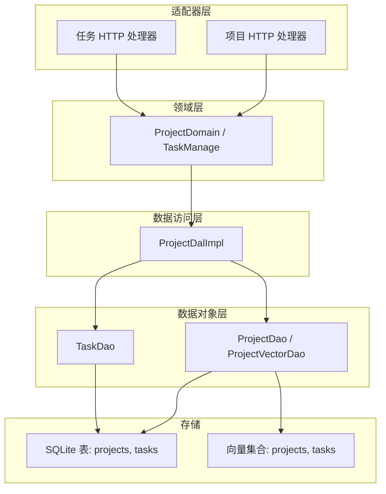
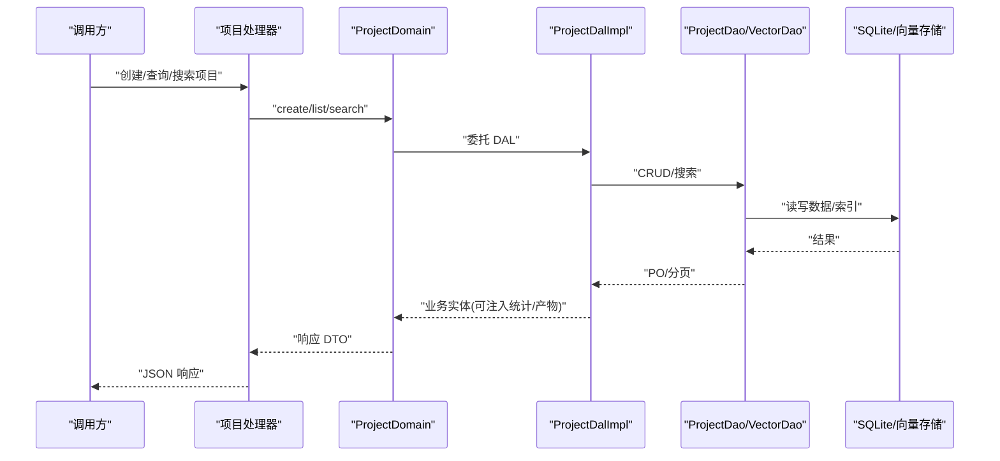
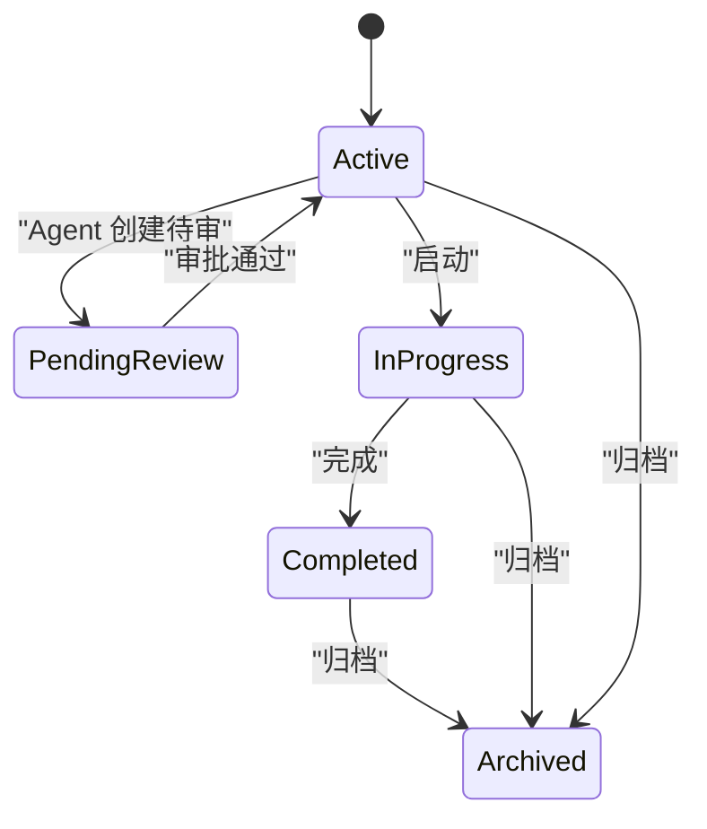
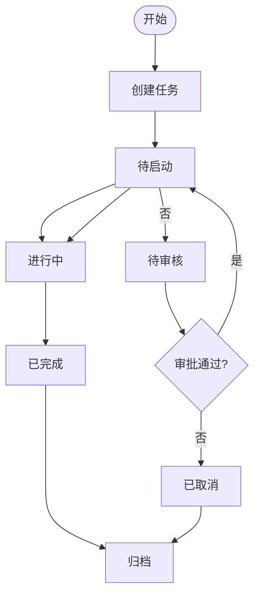
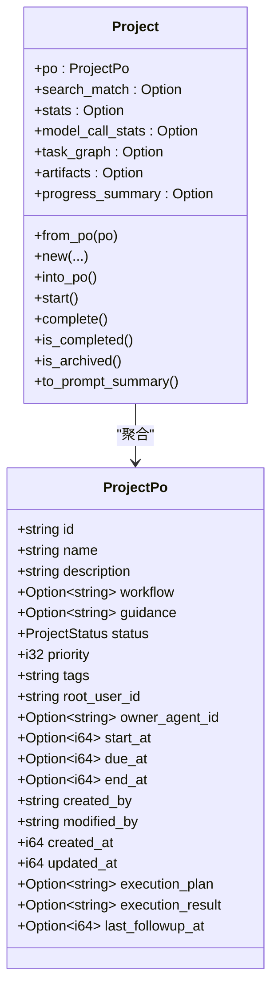
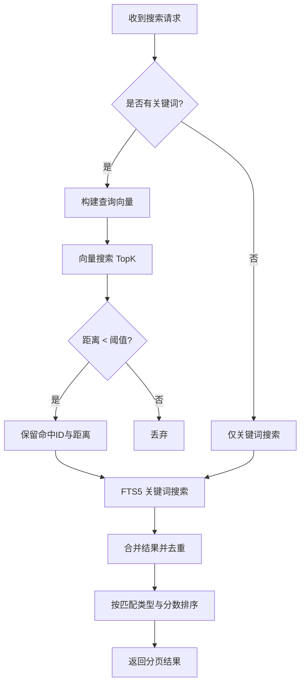
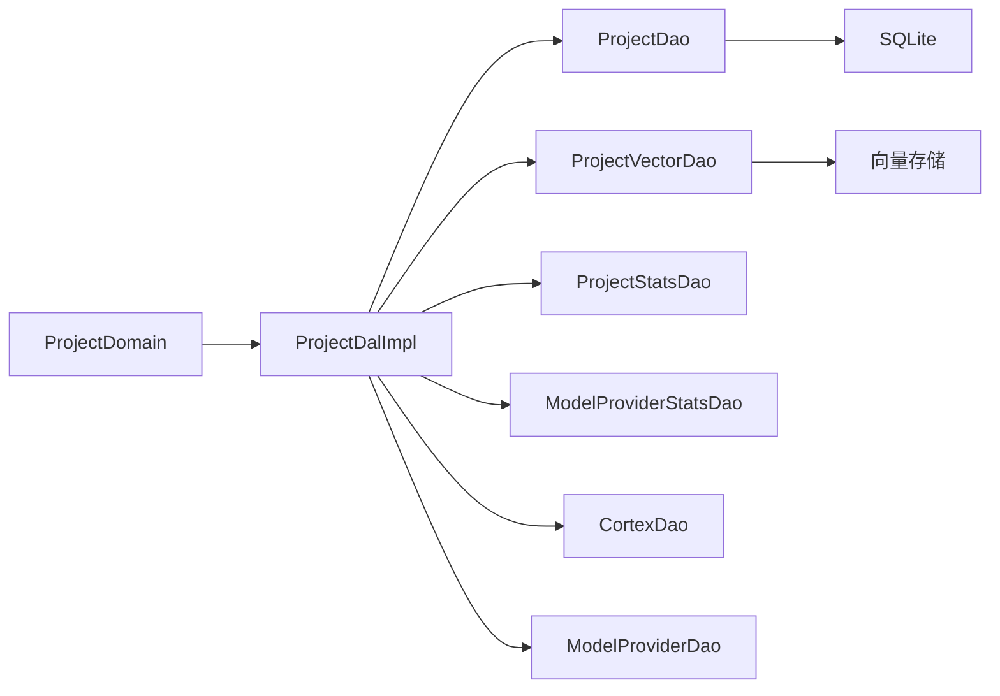

# 项目管理

<cite>
**本文引用的文件**
- [src/models/project.rs](file://src/models/project.rs)
- [src/models/task.rs](file://src/models/task.rs)
- [common/src/enums/project.rs](file://common/src/enums/project.rs)
- [common/src/enums/task.rs](file://common/src/enums/task.rs)
- [src/service/domain/project/mod.rs](file://src/service/domain/project/mod.rs)
- [src/service/dal/project.rs](file://src/service/dal/project.rs)
- [src/service/dao/project/mod.rs](file://src/service/dao/project/mod.rs)
- [common/src/models/stats.rs](file://common/src/models/stats.rs)
- [common/src/api/project.rs](file://common/src/api/project.rs)
- [migrations/20260420000000_initial.sql](file://migrations/20260420000000_initial.sql)
- [src/handlers/project/projects/mod.rs](file://src/handlers/project/projects/mod.rs)
- [src/handlers/project/task/mod.rs](file://src/handlers/project/task/mod.rs)
</cite>

## 目录
1. [简介](#简介)
2. [项目结构](#项目结构)
3. [核心组件](#核心组件)
4. [架构总览](#架构总览)
5. [详细组件分析](#详细组件分析)
6. [依赖关系分析](#依赖关系分析)
7. [性能考虑](#性能考虑)
8. [故障排查指南](#故障排查指南)
9. [结论](#结论)
10. [附录](#附录)

## 简介
本文件聚焦“项目管理”模块的数据模型与业务设计，覆盖 Project 与 Task 实体的创建、配置与生命周期管理；任务优先级、状态转换与进度跟踪；项目与任务的层级关系、成员权限与协作机制；项目模板、批量操作与搜索过滤的数据支持；以及 ProjectPo 持久化对象与 Project 业务实体的设计模式与向量化搜索实现。

## 项目结构
本项目遵循严格四层单向调用：Adapter（HTTP Handler）→ Domain → DAL → DAO，禁止跨层调用与同层互调。PO 仅在 DAO/DAL 内部使用，Domain 对外统一暴露业务实体。服务层公共方法首参为 RequestContext，跨层传递使用 ctx.clone()。

图表来源
- [src/handlers/project/projects/mod.rs:1-20](file://src/handlers/project/projects/mod.rs#L1-L20)
- [src/handlers/project/task/mod.rs:1-28](file://src/handlers/project/task/mod.rs#L1-L28)
- [src/service/domain/project/mod.rs:91-226](file://src/service/domain/project/mod.rs#L91-L226)
- [src/service/dal/project.rs:211-221](file://src/service/dal/project.rs#L211-L221)
- [src/service/dao/project/mod.rs:39-147](file://src/service/dao/project/mod.rs#L39-L147)
- [migrations/20260420000000_initial.sql:73-115](file://migrations/20260420000000_initial.sql#L73-L115)

章节来源
- [src/handlers/project/projects/mod.rs:1-20](file://src/handlers/project/projects/mod.rs#L1-L20)
- [src/handlers/project/task/mod.rs:1-28](file://src/handlers/project/task/mod.rs#L1-L28)
- [src/service/domain/project/mod.rs:91-226](file://src/service/domain/project/mod.rs#L91-L226)
- [src/service/dal/project.rs:211-221](file://src/service/dal/project.rs#L211-L221)
- [src/service/dao/project/mod.rs:39-147](file://src/service/dao/project/mod.rs#L39-L147)
- [migrations/20260420000000_initial.sql:73-115](file://migrations/20260420000000_initial.sql#L73-L115)

## 核心组件
- ProjectPo：项目持久化对象，仅 DAO/DAL 使用，包含项目基本信息、时间戳、执行计划/结果等。
- Project：业务实体，聚合 PO 及按需注入的统计、产物、进度汇总等。
- TaskPo：任务持久化对象，包含任务标题、描述、状态、优先级、标签、截止时间、依赖、分配对象、项目归属、思考深度、进度等。
- Task：业务实体，聚合 PO 及按需注入的统计、产物等。
- 枚举：ProjectStatus、TaskStatus、AssigneeType 定义状态与分配类型。
- 统计：ProjectStats、TaskStats、ModelCallStats、ProjectProgressSummary 提供统计与进度汇总。

章节来源
- [src/models/project.rs:15-80](file://src/models/project.rs#L15-L80)
- [src/models/task.rs:16-81](file://src/models/task.rs#L16-L81)
- [common/src/enums/project.rs:8-27](file://common/src/enums/project.rs#L8-L27)
- [common/src/enums/task.rs:8-27](file://common/src/enums/task.rs#L8-L27)
- [common/src/models/stats.rs:114-171](file://common/src/models/stats.rs#L114-L171)

## 架构总览
- 分层职责清晰：Handler 接收请求并调用 Domain；Domain 组合 DAL；DAL 封装 DAO；DAO 对接 SQLite 与向量存储。
- 数据流向：Handler → Domain → DAL → DAO → 存储；返回时按选项按需加载统计、产物、进度汇总等。
- 搜索能力：关键词（FTS5）+ 向量语义混合搜索，DAL 层负责合并排序与降级。

图表来源
- [src/handlers/project/projects/mod.rs:1-20](file://src/handlers/project/projects/mod.rs#L1-L20)
- [src/service/domain/project/mod.rs:91-226](file://src/service/domain/project/mod.rs#L91-L226)
- [src/service/dal/project.rs:223-274](file://src/service/dal/project.rs#L223-L274)
- [src/service/dao/project/mod.rs:39-147](file://src/service/dao/project/mod.rs#L39-L147)

## 详细组件分析

### Project 实体与生命周期
- 字段与含义：
  - 标识与元信息：id、name、description、workflow、guidance、tags、root_user_id、owner_agent_id。
  - 时间戳：start_at、due_at、end_at、created_at、updated_at。
  - 执行上下文：execution_plan、execution_result、last_followup_at。
- 状态枚举：
  - Deleted、Active、PendingReview、InProgress、Completed、Archived。
- 生命周期方法：
  - start：状态置为 InProgress，记录 start_at。
  - complete：状态置为 Completed，记录 end_at。
  - is_completed/is_archived：便捷判断。
- 提示摘要：to_prompt_summary 用于 Agent 上下文注入。

图表来源
- [common/src/enums/project.rs:8-27](file://common/src/enums/project.rs#L8-L27)
- [src/models/project.rs:173-183](file://src/models/project.rs#L173-L183)

章节来源
- [src/models/project.rs:15-80](file://src/models/project.rs#L15-L80)
- [src/models/project.rs:173-183](file://src/models/project.rs#L173-L183)
- [common/src/enums/project.rs:8-27](file://common/src/enums/project.rs#L8-L27)

### Task 实体与状态转换
- 字段与含义：
  - 基本：id、title、description、status、priority、tags。
  - 时间：due_at、start_at、end_at。
  - 依赖：dependencies（JSON 数组字符串）。
  - 归属：root_user_id、assignee_type、assignee_id、project_id。
  - 过程：thinking_depth、progress、execution_plan、execution_result。
- 状态枚举：
  - Cancelled、PendingReview、Pending、InProgress、Completed、Archived。
- 状态转换：
  - start：状态置为 InProgress，记录 start_at。
  - complete：状态置为 Completed，进度置 100，记录 end_at。
  - cancel：状态置为 Cancelled。
- 进度控制：
  - set_progress：限制在 0-100，更新 updated_at。
- 提示摘要：to_prompt_summary 用于 Agent 上下文注入。

图表来源
- [common/src/enums/task.rs:8-27](file://common/src/enums/task.rs#L8-L27)
- [src/models/task.rs:172-188](file://src/models/task.rs#L172-L188)

章节来源
- [src/models/task.rs:16-81](file://src/models/task.rs#L16-L81)
- [src/models/task.rs:172-188](file://src/models/task.rs#L172-L188)
- [common/src/enums/task.rs:8-27](file://common/src/enums/task.rs#L8-L27)

### 项目与任务的层级关系、成员权限与协作
- 层级关系：
  - Task 通过 project_id 归属到 Project。
  - Task 支持 dependencies 表示前置任务依赖。
- 成员与协作：
  - root_user_id 表示最终服务对象，所有派生任务继承此字段。
  - owner_agent_id 指定负责推进项目的 Agent。
  - assignee_type/assignee_id 支持将任务分配给用户或 Agent。
- 协作机制：
  - 项目级产物 ArtifactDetail 与任务级产物关联，便于追溯。
  - 项目进度汇总基于任务状态实时计算。

章节来源
- [src/models/task.rs:37-46](file://src/models/task.rs#L37-L46)
- [src/models/project.rs:34-37](file://src/models/project.rs#L34-L37)
- [common/src/enums/task.rs:61-87](file://common/src/enums/task.rs#L61-L87)
- [common/src/models/stats.rs:151-171](file://common/src/models/stats.rs#L151-L171)

### 任务进度跟踪、截止日期管理与完成标准
- 进度跟踪：
  - Task.progress 范围 0-100，set_progress 自动截断并更新时间戳。
  - ProjectProgressSummary 根据任务列表实时计算整体进度百分比与各状态计数。
- 截止日期管理：
  - Task.due_at、Project.due_at 用于截止提醒与展示。
- 完成标准：
  - Task.complete 将状态置为 Completed，进度置 100，记录 end_at。
  - Project.complete 将状态置为 Completed，记录 end_at。

章节来源
- [src/models/task.rs:205-214](file://src/models/task.rs#L205-L214)
- [src/models/task.rs:178-183](file://src/models/task.rs#L178-L183)
- [src/models/project.rs:179-183](file://src/models/project.rs#L179-L183)
- [common/src/models/stats.rs:151-171](file://common/src/models/stats.rs#L151-L171)

### 项目模板、批量操作与搜索过滤
- 项目模板：
  - workflow/guidance 字段可用于承载项目运作流程与指导建议，作为模板化内容供 Agent 参考。
- 批量操作：
  - ProjectQuery.ids 支持按 ID 批量查询，常用于向量搜索结果回填。
  - Task 支持批量创建（create_with_options），并可设置 due_at、dependencies 等可选字段。
- 搜索过滤：
  - 通用 query：支持 ids、keyword、root_user_id、status_in、owner_agent_id、分页。
  - 搜索 search：关键词 + 向量语义混合搜索，返回匹配类型与评分。

章节来源
- [src/models/project.rs:24-27](file://src/models/project.rs#L24-L27)
- [src/service/dao/project/mod.rs:12-37](file://src/service/dao/project/mod.rs#L12-L37)
- [src/service/domain/project/mod.rs:145-179](file://src/service/domain/project/mod.rs#L145-L179)
- [common/src/api/project.rs:214-248](file://common/src/api/project.rs#L214-L248)

### ProjectPo 与 Project 的设计模式
- 设计模式：
  - PO 与业务实体分离：ProjectPo 仅用于 DAO/DAL 持久化；Project 为 Domain 层业务实体，聚合 PO 与按需注入的附加信息。
  - 构造与转换：Project::from_po/from_new/into_po 提供双向转换；ProjectPo::new 初始化默认值与时间戳。
  - 上下文增强：EnrichContext 实现使 PO/Entity 可注入 project_id/agent_id/task_id 到 RequestContext。
- 向量化接口：
  - Vectorizable 实现：ProjectPo/Project 提供 vectorize_text 与 vector_collection，用于生成嵌入文本与集合名。

图表来源
- [src/models/project.rs:15-80](file://src/models/project.rs#L15-L80)
- [src/models/project.rs:82-141](file://src/models/project.rs#L82-L141)
- [src/models/project.rs:214-263](file://src/models/project.rs#L214-L263)

章节来源
- [src/models/project.rs:15-80](file://src/models/project.rs#L15-L80)
- [src/models/project.rs:82-141](file://src/models/project.rs#L82-L141)
- [src/models/project.rs:214-263](file://src/models/project.rs#L214-L263)

### 向量化搜索的实现
- 文本向量化：
  - ProjectPo.vectorize_text：拼接 name、description、workflow、guidance（跳过空值）。
  - TaskPo.vectorize_text：拼接 title、description。
- 集合命名：
  - Project 集合名为 "projects"，Task 集合名为 "tasks"。
- 混合搜索流程（以 Project 为例）：
  - 若有关键词，尝试构建查询向量并执行向量搜索，过滤距离阈值。
  - 同时执行 FTS5 关键词搜索，获取 BM25 排名。
  - 合并结果，去重并按匹配类型与分数排序（Hybrid > Vector > Keyword）。
  - 失败降级：向量搜索失败则退回纯关键词搜索。
- 重建索引：
  - rebuild_vectors：检查当前 Embedding Provider 与集合元数据一致则跳过；否则清空集合并逐条重建。

图表来源
- [src/models/project.rs:282-315](file://src/models/project.rs#L282-L315)
- [src/models/task.rs:334-342](file://src/models/task.rs#L334-L342)
- [src/service/dal/project.rs:490-703](file://src/service/dal/project.rs#L490-L703)
- [src/service/dal/project.rs:738-800](file://src/service/dal/project.rs#L738-L800)

章节来源
- [src/models/project.rs:282-315](file://src/models/project.rs#L282-L315)
- [src/models/task.rs:334-342](file://src/models/task.rs#L334-L342)
- [src/service/dal/project.rs:490-703](file://src/service/dal/project.rs#L490-L703)
- [src/service/dal/project.rs:738-800](file://src/service/dal/project.rs#L738-L800)

### API 与数据契约
- 项目 API：
  - 创建：CreateProjectRequest（name、description、priority、tags、owner_agent_id）。
  - 获取：GetProjectRequest（with_stats、with_model_call_stats、with_task_graph、with_artifacts、with_progress_summary）。
  - 列表：ListProjectsRequest（分页）。
  - 更新：UpdateProjectRequest（name、description、priority、tags、execution_plan、execution_result）。
  - 状态更新：UpdateProjectStatusRequest（目标状态）。
  - 查询：ProjectQueryRequest（ids、keyword、root_user_id、status_in、owner_agent_id、分页）。
  - 搜索：SearchProjectsRequest（keyword、ids、root_user_id、status_in、owner_agent_id、分页）。
- 响应：
  - GetProjectResponse 包含基础字段与按需注入的 stats、model_call_stats、task_graph、artifacts、progress_summary。
  - ListProjectsResponse 与 SearchProjectsResponse 使用 PagedResult<ProjectListItem>。

章节来源
- [common/src/api/project.rs:10-251](file://common/src/api/project.rs#L10-L251)

### 数据库表结构
- projects 表：
  - 主键 id，名称 name，描述 description，状态 status，优先级 priority，标签 tags，根用户 root_user_id，负责人 owner_agent_id，流程 workflow，指导 guidance，时间 start_at/due_at/end_at，审计 created_by/modified_by/created_at/updated_at。
- tasks 表：
  - 主键 id，标题 title，描述 description，状态 status，优先级 priority，标签 tags，截止时间 due_at，开始/结束 start_at/end_at，依赖 dependencies，根用户 root_user_id，分配类型 assignee_type，分配 ID assignee_id，项目归属 project_id，思考深度 thinking_depth，审计字段。

章节来源
- [migrations/20260420000000_initial.sql:73-115](file://migrations/20260420000000_initial.sql#L73-L115)

## 依赖关系分析
- 领域依赖：
  - ProjectDomain 组合 ProjectDal、TaskDal、ArtifactDal，提供统一入口。
- DAL 依赖：
  - ProjectDalImpl 依赖 ProjectDao、ProjectVectorDao、ProjectStatsDao、ModelProviderStatsDao、CortexDao、ModelProviderDao。
- DAO 抽象：
  - ProjectDao 提供 CRUD、查询、统计、全文检索。
  - ProjectVectorDao 提供向量索引 upsert、搜索、删除、清空。
- 外部依赖：
  - 向量后端支持 LanceDB/HNSW/InMemory/SqliteVss 多后端降级。
  - 全文搜索使用 FTS5 + trigram 分词器。

图表来源
- [src/service/domain/project/mod.rs:502-539](file://src/service/domain/project/mod.rs#L502-L539)
- [src/service/dal/project.rs:211-221](file://src/service/dal/project.rs#L211-L221)
- [src/service/dao/project/mod.rs:39-147](file://src/service/dao/project/mod.rs#L39-L147)

章节来源
- [src/service/domain/project/mod.rs:502-539](file://src/service/domain/project/mod.rs#L502-L539)
- [src/service/dal/project.rs:211-221](file://src/service/dal/project.rs#L211-L221)
- [src/service/dao/project/mod.rs:39-147](file://src/service/dao/project/mod.rs#L39-L147)

## 性能考虑
- 向量索引维护：
  - create/update 时自动维护向量索引，内容哈希变化才重索引；失败降级不影响主流程。
- 混合搜索优化：
  - 关键词存在时并行进行向量搜索与 FTS5 搜索，合并后按匹配类型与分数排序；向量搜索失败降级为纯关键词搜索。
- 统计查询按需加载：
  - with_stats/with_model_call_stats/with_task_graph/with_artifacts/with_progress_summary 控制额外负载。
- 重建索引：
  - rebuild_vectors 检查 provider 一致性避免重复重建；清空集合后逐条重建，单条失败不影响整体。

章节来源
- [src/service/dal/project.rs:223-274](file://src/service/dal/project.rs#L223-L274)
- [src/service/dal/project.rs:374-433](file://src/service/dal/project.rs#L374-L433)
- [src/service/dal/project.rs:490-703](file://src/service/dal/project.rs#L490-L703)
- [src/service/dal/project.rs:738-800](file://src/service/dal/project.rs#L738-L800)

## 故障排查指南
- 向量搜索失败：
  - 现象：向量搜索报错或无可用 Embedding Provider。
  - 处理：降级到关键词搜索；日志记录 warn/debug；必要时触发 rebuild_vectors。
- 向量索引写入失败：
  - 现象：upsert_vector 异常。
  - 处理：记录 warn；不影响主流程；检查向量后端健康与权限。
- 统计查询为空：
  - 现象：get_stats/get_model_call_stats 返回默认值。
  - 处理：确认时间范围与 interval；检查事件表与聚合逻辑。
- 项目归档清理：
  - 现象：归档后向量索引未清理。
  - 处理：archive 会调用 delete_vector；检查实现与错误日志。

章节来源
- [src/service/dal/project.rs:223-274](file://src/service/dal/project.rs#L223-L274)
- [src/service/dal/project.rs:374-433](file://src/service/dal/project.rs#L374-L433)
- [src/service/dal/project.rs:490-703](file://src/service/dal/project.rs#L490-L703)
- [src/service/dal/project.rs:738-800](file://src/service/dal/project.rs#L738-L800)

## 结论
项目管理模块通过清晰的 PO/业务实体分离、严格的分层架构与灵活的搜索统计能力，实现了 Project 与 Task 的全生命周期管理。状态流转、进度跟踪、截止日期与完成标准明确；混合搜索与向量索引维护提供了高效检索体验；统计与进度汇总按需加载保障性能。建议在扩展新字段或状态时，同步更新枚举、DTO、DAO/DAL 与测试用例，确保一致性。

## 附录
- 关键路径参考：
  - 项目创建/更新/状态流转：[src/service/domain/project/mod.rs:111-226](file://src/service/domain/project/mod.rs#L111-L226)
  - 任务创建/更新/状态流转：[src/service/domain/project/mod.rs:228-359](file://src/service/domain/project/mod.rs#L228-L359)
  - 项目混合搜索实现：[src/service/dal/project.rs:490-703](file://src/service/dal/project.rs#L490-L703)
  - 项目进度汇总计算：[src/models/project.rs:324-359](file://src/models/project.rs#L324-L359)
  - 数据库表结构：[migrations/20260420000000_initial.sql:73-115](file://migrations/20260420000000_initial.sql#L73-L115)