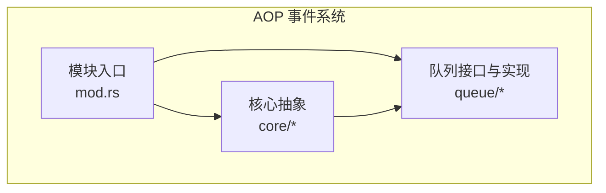
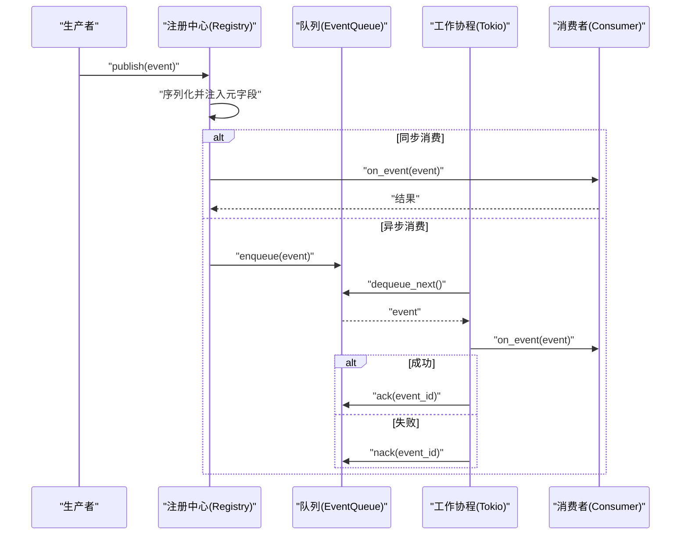
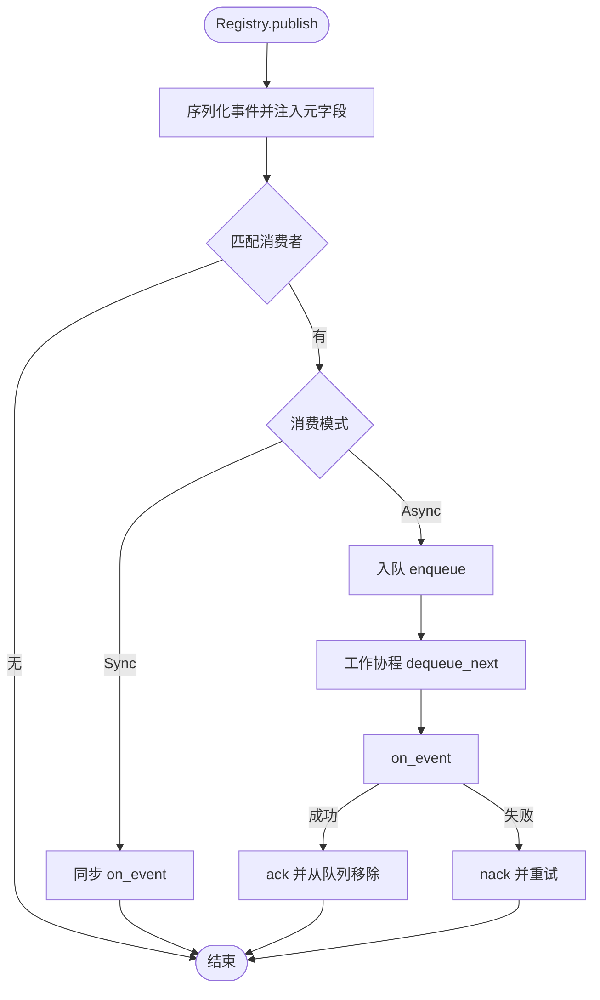
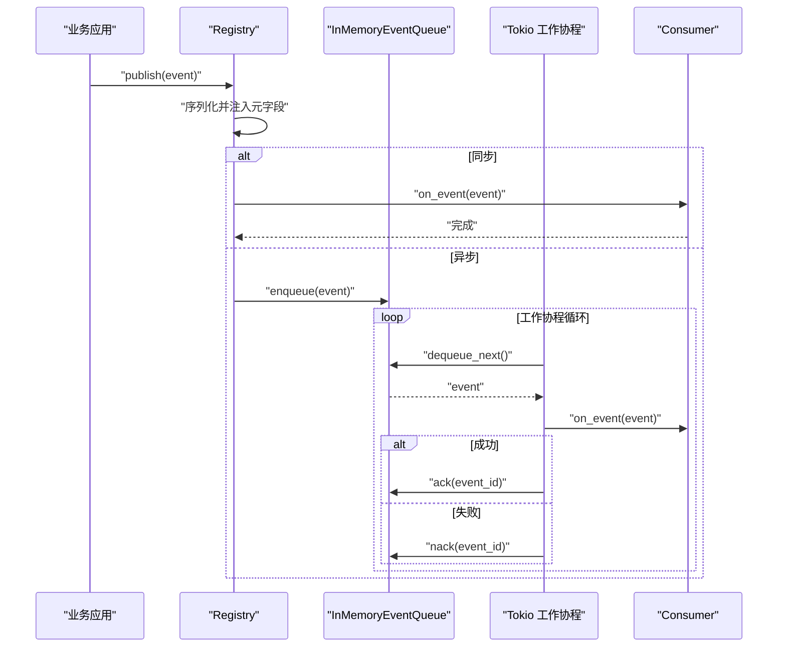
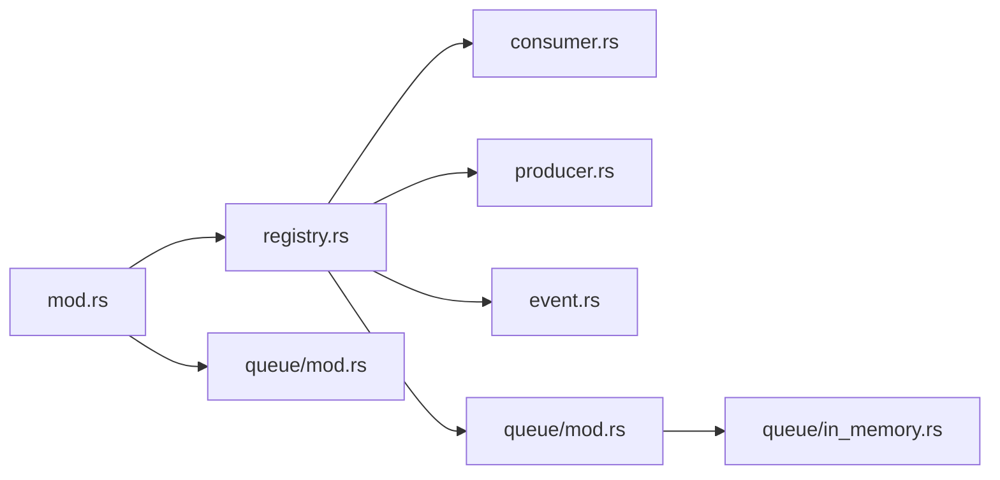

# AOP 事件系统架构

<cite>
**本文引用的文件**
- [src/pkg/aop/mod.rs](file://src/pkg/aop/mod.rs)
- [src/pkg/aop/core/mod.rs](file://src/pkg/aop/core/mod.rs)
- [src/pkg/aop/core/event.rs](file://src/pkg/aop/core/event.rs)
- [src/pkg/aop/core/producer.rs](file://src/pkg/aop/core/producer.rs)
- [src/pkg/aop/core/consumer.rs](file://src/pkg/aop/core/consumer.rs)
- [src/pkg/aop/core/registry.rs](file://src/pkg/aop/core/registry.rs)
- [src/pkg/aop/core/scheduler.rs](file://src/pkg/aop/core/scheduler.rs)
- [src/pkg/aop/queue/mod.rs](file://src/pkg/aop/queue/mod.rs)
- [src/pkg/aop/queue/in_memory.rs](file://src/pkg/aop/queue/in_memory.rs)
</cite>

## 目录
1. [简介](#简介)
2. [项目结构](#项目结构)
3. [核心组件](#核心组件)
4. [架构总览](#架构总览)
5. [详细组件分析](#详细组件分析)
6. [依赖关系分析](#依赖关系分析)
7. [性能考量](#性能考量)
8. [故障排查指南](#故障排查指南)
9. [结论](#结论)
10. [附录：开发指南与配置](#附录：开发指南与配置)

## 简介
本文件为 AI Orz 系统的 AOP 事件系统架构文档，聚焦事件中心的设计原理与实现。内容涵盖生产者-消费者模式、事件队列管理、优先级排序与顺序保证机制；消息 Topic 的三层分发架构；同步/异步消费支持；轮询生产者注册与启动；崩溃恢复策略；Tokio 任务调度模型；相同 order_key 的顺序锁保证；以及事件总线架构图、事件流转图和关键配置选项。同时提供事件生产者和消费者的开发指南，帮助快速接入与扩展。

## 项目结构
AOP 事件系统位于 src/pkg/aop 下，采用分层与职责分离的组织方式：
- core：定义事件、消费者、生产者、注册中心、调度器等核心抽象与实现
- queue：事件队列接口与内存实现（可扩展持久化实现）
- mod：全局单例 Registry、便捷发布 API、初始化入口



图表来源
- [src/pkg/aop/mod.rs:1-61](file://src/pkg/aop/mod.rs#L1-L61)
- [src/pkg/aop/core/mod.rs:1-14](file://src/pkg/aop/core/mod.rs#L1-L14)
- [src/pkg/aop/queue/mod.rs:1-107](file://src/pkg/aop/queue/mod.rs#L1-L107)

章节来源
- [src/pkg/aop/mod.rs:1-61](file://src/pkg/aop/mod.rs#L1-L61)
- [src/pkg/aop/core/mod.rs:1-14](file://src/pkg/aop/core/mod.rs#L1-L14)

## 核心组件
- 事件 Event：携带数据与元信息（kind、id、order_key、priority、created_at），用于统一序列化与路由
- 消费者 Consumer：支持同步与异步两种消费模式，具备过滤、确认/拒绝、并发与退避控制
- 生产者 Producer：支持轮询与非轮询两种生命周期管理，由注册中心统一管理
- 注册中心 Registry：维护消费者与生产者集合，负责事件分发、队列分配、工作协程启动与指标埋点
- 队列 EventQueue：抽象出入队、出队、确认、统计、查询等能力，当前提供内存实现
- 调度器 Scheduler：通用定时任务抽象（供扩展使用）

章节来源
- [src/pkg/aop/core/event.rs:1-25](file://src/pkg/aop/core/event.rs#L1-L25)
- [src/pkg/aop/core/consumer.rs:1-72](file://src/pkg/aop/core/consumer.rs#L1-L72)
- [src/pkg/aop/core/producer.rs:1-36](file://src/pkg/aop/core/producer.rs#L1-L36)
- [src/pkg/aop/core/registry.rs:1-561](file://src/pkg/aop/core/registry.rs#L1-L561)
- [src/pkg/aop/queue/mod.rs:1-107](file://src/pkg/aop/queue/mod.rs#L1-L107)
- [src/pkg/aop/core/scheduler.rs:1-9](file://src/pkg/aop/core/scheduler.rs#L1-L9)

## 架构总览
AOP 事件系统采用“生产者-消费者 + 队列”的生产者-消费者模式，结合注册中心进行统一编排。事件通过统一 Event 抽象进入 Registry，按消费者感兴趣的事件类型进行分发；同步消费者直接执行，异步消费者入队并由 Tokio 工作协程拉取处理。队列层对同一 order_key 的事件进行顺序保证，避免乱序消费。



图表来源
- [src/pkg/aop/core/registry.rs:97-206](file://src/pkg/aop/core/registry.rs#L97-L206)
- [src/pkg/aop/core/registry.rs:208-447](file://src/pkg/aop/core/registry.rs#L208-L447)
- [src/pkg/aop/queue/mod.rs:77-107](file://src/pkg/aop/queue/mod.rs#L77-L107)
- [src/pkg/aop/queue/in_memory.rs:104-267](file://src/pkg/aop/queue/in_memory.rs#L104-L267)

## 详细组件分析

### 事件与元数据（Event）
- kind：事件类型标识，用于消费者订阅匹配
- id：唯一事件标识，用于去重与确认
- order_key：顺序键，相同 key 的事件将保持顺序消费
- priority：优先级，高优先级优先出队
- created_at：创建时间戳，用于排序与监控

章节来源
- [src/pkg/aop/core/event.rs:1-25](file://src/pkg/aop/core/event.rs#L1-L25)

### 消费者（Consumer）
- 支持同步与异步两种消费模式
- 可自定义过滤 should_consume
- 异步模式下支持 ack/nack 确认机制
- 可配置并发 worker 数量、空队列休眠、错误重试休眠

章节来源
- [src/pkg/aop/core/consumer.rs:1-72](file://src/pkg/aop/core/consumer.rs#L1-L72)

### 生产者（Producer）
- 支持轮询模式（poll_interval_secs > 0）与非轮询模式
- 非轮询模式由 start/stop 自行管理生命周期
- 轮询模式由注册中心周期性调用 poll

章节来源
- [src/pkg/aop/core/producer.rs:1-36](file://src/pkg/aop/core/producer.rs#L1-L36)

### 注册中心（Registry）
- 维护消费者与生产者集合
- 事件发布时序列化并注入元字段，便于队列与监控读取
- 同步消费者直接 on_event；异步消费者入队
- 启动时扫描异步消费者，为每个消费者创建独立队列与工作协程
- 启动轮询生产者或调用非轮询生产者的 start



图表来源
- [src/pkg/aop/core/registry.rs:97-206](file://src/pkg/aop/core/registry.rs#L97-L206)
- [src/pkg/aop/core/registry.rs:208-447](file://src/pkg/aop/core/registry.rs#L208-L447)

章节来源
- [src/pkg/aop/core/registry.rs:1-561](file://src/pkg/aop/core/registry.rs#L1-L561)

### 队列（EventQueue）与内存实现（InMemoryEventQueue）
- 接口包含 enqueue、dequeue_next、ack、nack、stats、query_events、get_event 等
- 内存实现使用全局堆与各 order_key 的有序队列，确保同 key 顺序消费
- 通过 has_active_message 标记某 order_key 是否已有活动消息，避免并行乱序
- 支持统计与查询，便于运维监控

```mermaid
classDiagram
class EventQueue {
+enqueue(ctx, event) Result
+enqueue_batch(ctx, events) Result
+dequeue_next(ctx) Result<Option<Value>>
+ack(ctx, event_id) Result
+nack(ctx, event_id) Result
+len() usize
+in_progress_count() usize
+recover(ctx) Result<usize>
+clear() void
+stats() QueueStats
+query_events(filter) Vec<EventSummary>
+get_event(event_id) Option<EventDetail>
}
class InMemoryEventQueue {
-events : HashMap<String, Value>
-queues : HashMap<String, BinaryHeap<EventRef>>
-global_heap : BinaryHeap<EventRef>
-in_progress : HashMap<String, (EventRef, String)>
-has_active_message : HashMap<String, bool>
-lock : Mutex<()>
}
EventQueue <|.. InMemoryEventQueue : "实现"
```

图表来源
- [src/pkg/aop/queue/mod.rs:1-107](file://src/pkg/aop/queue/mod.rs#L1-L107)
- [src/pkg/aop/queue/in_memory.rs:1-449](file://src/pkg/aop/queue/in_memory.rs#L1-L449)

章节来源
- [src/pkg/aop/queue/mod.rs:1-107](file://src/pkg/aop/queue/mod.rs#L1-L107)
- [src/pkg/aop/queue/in_memory.rs:1-449](file://src/pkg/aop/queue/in_memory.rs#L1-L449)

### 调度器（Scheduler）
- 通用定时任务抽象，提供 name、interval_secs、run 方法
- 可用于扩展周期性任务（如清理、重建索引等）

章节来源
- [src/pkg/aop/core/scheduler.rs:1-9](file://src/pkg/aop/core/scheduler.rs#L1-L9)

### 事件流转图（从生产到消费）


图表来源
- [src/pkg/aop/core/registry.rs:97-206](file://src/pkg/aop/core/registry.rs#L97-L206)
- [src/pkg/aop/core/registry.rs:208-447](file://src/pkg/aop/core/registry.rs#L208-L447)
- [src/pkg/aop/queue/in_memory.rs:104-267](file://src/pkg/aop/queue/in_memory.rs#L104-L267)

## 依赖关系分析
- Registry 依赖 Consumer、Producer、EventQueue、RequestContext、AopMetricsHook
- InMemoryEventQueue 依赖 RequestContext、serde_json、标准库容器
- 模块入口暴露全局 Registry 单例与便捷 publish/init_all API



图表来源
- [src/pkg/aop/mod.rs:1-61](file://src/pkg/aop/mod.rs#L1-L61)
- [src/pkg/aop/core/registry.rs:1-561](file://src/pkg/aop/core/registry.rs#L1-L561)
- [src/pkg/aop/queue/mod.rs:1-107](file://src/pkg/aop/queue/mod.rs#L1-L107)
- [src/pkg/aop/queue/in_memory.rs:1-449](file://src/pkg/aop/queue/in_memory.rs#L1-L449)

章节来源
- [src/pkg/aop/mod.rs:1-61](file://src/pkg/aop/mod.rs#L1-L61)
- [src/pkg/aop/core/registry.rs:1-561](file://src/pkg/aop/core/registry.rs#L1-L561)
- [src/pkg/aop/queue/mod.rs:1-107](file://src/pkg/aop/queue/mod.rs#L1-L107)

## 性能考量
- 优先级与顺序：全局堆 + 各 order_key 有序队列，高优先级优先出队；同 key 顺序消费
- 并发控制：消费者可配置 concurrency，默认 1，避免过度竞争
- 退避策略：空队列与错误重试均支持 sleep，降低 CPU 自旋
- 锁粒度：内存队列使用 Mutex 保护共享状态，减少竞争
- 指标埋点：通过 AopMetricsHook 在发布、消费开始、成功、失败处采集指标

[本节为通用指导，不直接分析具体文件]

## 故障排查指南
- 事件未消费：检查消费者 interested_events 是否正确注册；查看队列 stats 与 query_events
- 顺序错乱：确认 order_key 设置一致；检查是否有多个并发 worker 消费同一 key
- 频繁重试：关注 error_retry_sleep_ms 配置；检查 nack 路径与队列状态
- 队列积压：观察 oldest_event_age_secs 与 pending_count；必要时扩容 consumer 并发
- 指标缺失：确认已注入 AopMetricsHook；检查 on_publish/on_consume_* 回调

章节来源
- [src/pkg/aop/core/registry.rs:260-487](file://src/pkg/aop/core/registry.rs#L260-L487)
- [src/pkg/aop/queue/in_memory.rs:300-447](file://src/pkg/aop/queue/in_memory.rs#L300-L447)

## 结论
AOP 事件系统以简洁清晰的抽象实现了可靠的生产者-消费者模型，支持同步与异步消费、优先级与顺序保证、工作协程并发与退避、以及完善的监控与查询能力。通过注册中心统一管理生命周期，易于扩展新的队列实现与调度任务。建议在生产环境结合持久化队列与外部存储，进一步提升可靠性与可观测性。

[本节为总结，不直接分析具体文件]

## 附录：开发指南与配置

### 事件生产者开发指南
- 实现 Producer trait，提供 name、register、start/stop、poll_interval_secs、poll
- 在 register 中获取 Registry 引用，使用 registry.publish 发布事件
- 若需要轮询，返回 poll_interval_secs > 0，并在 poll 中持续产出事件

章节来源
- [src/pkg/aop/core/producer.rs:1-36](file://src/pkg/aop/core/producer.rs#L1-L36)
- [src/pkg/aop/core/registry.rs:75-95](file://src/pkg/aop/core/registry.rs#L75-L95)
- [src/pkg/aop/core/registry.rs:451-484](file://src/pkg/aop/core/registry.rs#L451-L484)

### 事件消费者开发指南
- 实现 Consumer trait，声明 interested_events、consume_mode、on_event
- 异步模式需实现 ack/nack，合理设置 concurrency、empty_queue_sleep_ms、error_retry_sleep_ms
- 在应用启动阶段注册消费者，并调用 init_all 启动调度器

章节来源
- [src/pkg/aop/core/consumer.rs:1-72](file://src/pkg/aop/core/consumer.rs#L1-L72)
- [src/pkg/aop/mod.rs:48-61](file://src/pkg/aop/mod.rs#L48-L61)
- [src/pkg/aop/core/registry.rs:260-447](file://src/pkg/aop/core/registry.rs#L260-L447)

### 事件队列与顺序保证
- 使用 order_key 保证相同业务实体的事件顺序消费
- 内存队列通过 has_active_message 与有序队列配合，确保同 key 串行
- 可通过 stats/query_events/get_event 进行诊断与排障

章节来源
- [src/pkg/aop/queue/in_memory.rs:104-267](file://src/pkg/aop/queue/in_memory.rs#L104-L267)
- [src/pkg/aop/queue/in_memory.rs:300-447](file://src/pkg/aop/queue/in_memory.rs#L300-L447)

### 事件持久化策略说明
- 当前内存队列实现不包含持久化；如需持久化，可实现 EventQueue 并对接 SQLite messages 表或其他存储
- 建议在持久化实现中记录 message_id 元数据，并支持 recover/clear/stats/query_events
- 注意在持久化层实现相同的顺序与优先级语义，确保与内存实现行为一致

[本节为概念性说明，不直接分析具体文件]

### Tokio 任务调度模型
- 注册中心使用 tokio::spawn 启动消费者工作协程与轮询生产者
- 每个异步消费者可配置多个 worker，提升吞吐
- 空队列与错误场景使用 sleep 退避，避免忙等

章节来源
- [src/pkg/aop/core/registry.rs:299-447](file://src/pkg/aop/core/registry.rs#L299-L447)
- [src/pkg/aop/core/registry.rs:451-484](file://src/pkg/aop/core/registry.rs#L451-L484)

### 关键配置选项
- ConsumeMode：Sync/Async，选择同步或异步消费
- concurrency：异步消费者并发数
- empty_queue_sleep_ms：空队列休眠毫秒数
- error_retry_sleep_ms：错误重试休眠毫秒数
- poll_interval_secs：生产者轮询间隔秒数

章节来源
- [src/pkg/aop/core/consumer.rs:1-72](file://src/pkg/aop/core/consumer.rs#L1-L72)
- [src/pkg/aop/core/producer.rs:1-36](file://src/pkg/aop/core/producer.rs#L1-L36)