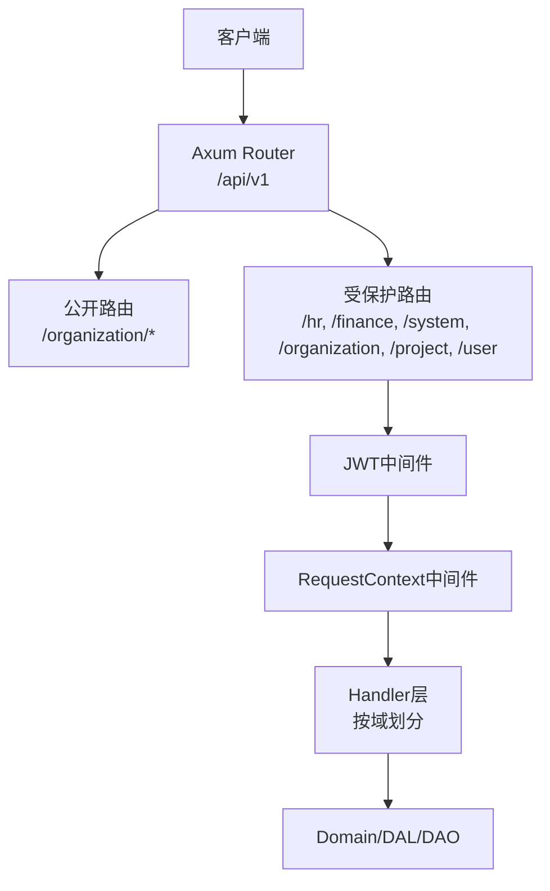
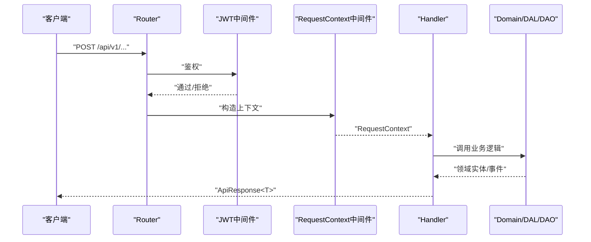
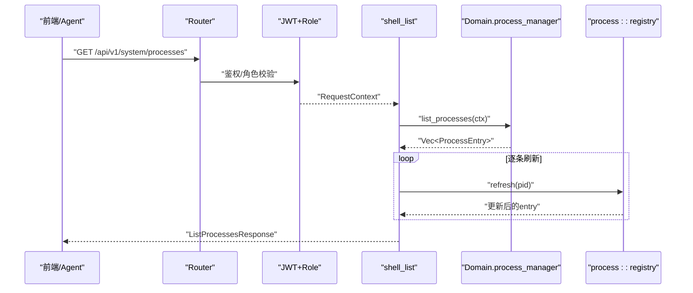
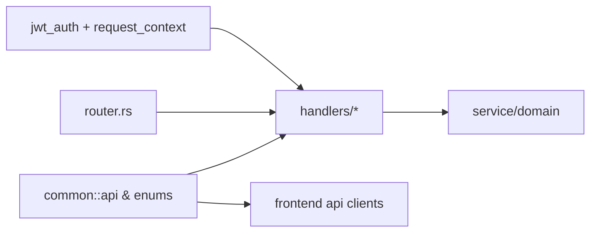

# API协议规范

<cite>
**本文引用的文件**
- [common/src/api/mod.rs](file://common/src/api/mod.rs)
- [common/src/api/system.rs](file://common/src/api/system.rs)
- [docs/design/api_protocol_convention.md](file://docs/design/api_protocol_convention.md)
- [common/src/error/code.rs](file://common/src/error/code.rs)
- [common/src/error/mod.rs](file://common/src/error/mod.rs)
- [common/src/constants/http_header.rs](file://common/src/constants/http_header.rs)
- [src/router.rs](file://src/router.rs)
- [src/middleware/jwt_auth.rs](file://src/middleware/jwt_auth.rs)
- [src/handlers/system/process/shell_list.rs](file://src/handlers/system/process/shell_list.rs)
</cite>

## 目录
1. [简介](#简介)
2. [项目结构](#项目结构)
3. [核心组件](#核心组件)
4. [架构总览](#架构总览)
5. [详细组件分析](#详细组件分析)
6. [依赖关系分析](#依赖关系分析)
7. [性能与一致性考量](#性能与一致性考量)
8. [故障排查指南](#故障排查指南)
9. [结论](#结论)
10. [附录：API清单与约定](#附录api清单与约定)

## 简介
本规范定义前后端统一的HTTP API协议，确保请求/响应结构、错误码、认证与权限、分页与查询等在全栈保持一致。核心原则是：所有共享的DTO与枚举必须且只能定义在 common crate，后端handler与前端客户端共同引用，编译期对齐，避免协议漂移。

## 项目结构
- 协议单一事实源：common/src/api/* 与 common/src/enums/* 集中定义请求/响应结构与共享枚举。
- 路由与中间件：src/router.rs 统一挂载 /api/v1 下的公开与受保护路由；JWT认证与请求上下文中间件保障安全与上下文注入。
- Handler层：按域组织（hr/finance/system/organization/project/user），通过宏生成HTTP处理器并注册为LLM工具（如 shell_list）。

图表来源
- [src/router.rs:75-207](file://src/router.rs#L75-L207)
- [src/middleware/jwt_auth.rs:25-87](file://src/middleware/jwt_auth.rs#L25-L87)

章节来源
- [src/router.rs:75-207](file://src/router.rs#L75-L207)
- [docs/design/api_protocol_convention.md:1-71](file://docs/design/api_protocol_convention.md#L1-L71)

## 核心组件
- 统一响应信封：ApiResponse<T> 包含 code/message/data，禁止裸原始类型响应。
- 分页参数与结果：PaginationParams + PagedResult<T> 作为统一分页契约。
- 错误模型：ErrorCode 枚举 + Error 类型，提供结构化错误信息与HTTP状态映射。
- HTTP头键：LOG_ID/USER_ID/USERNAME/ORGANIZATION_ID/USER_ROLE/CALLER_TYPE 统一管理。
- 认证与上下文：JWT中间件从Cookie或Authorization提取token，验证后将用户信息写入请求头；RequestContext中间件据此构建请求上下文。

章节来源
- [common/src/api/mod.rs:6-83](file://common/src/api/mod.rs#L6-L83)
- [common/src/error/code.rs:5-146](file://common/src/error/code.rs#L5-L146)
- [common/src/error/mod.rs:1-25](file://common/src/error/mod.rs#L1-L25)
- [common/src/constants/http_header.rs:1-20](file://common/src/constants/http_header.rs#L1-L20)
- [src/middleware/jwt_auth.rs:25-87](file://src/middleware/jwt_auth.rs#L25-L87)

## 架构总览
- 分层单向调用：Adapter（HTTP Handler）→ Domain → DAL → DAO，禁止跨层与同层互调。
- DTO边界：Handler仅接收/返回 common 定义的DTO；内部领域对象不泄漏到HTTP层。
- 路由组织：/api/v1 下分 public_routes 与 protected_routes；系统管理域整体要求Admin角色。
- A2A协议：独立路径 /.well-known/agent.json、/a2a、/a2a/subscribe、/a2a/callback/{task_id}。

图表来源
- [src/router.rs:132-207](file://src/router.rs#L132-L207)
- [src/middleware/jwt_auth.rs:36-87](file://src/middleware/jwt_auth.rs#L36-L87)

章节来源
- [src/router.rs:132-207](file://src/router.rs#L132-L207)
- [docs/design/api_protocol_convention.md:6-44](file://docs/design/api_protocol_convention.md#L6-L44)

## 详细组件分析

### 统一响应与分页
- ApiResponse<T>：code=0表示成功，非0为错误；data仅在成功时存在。
- PagedResult<T>：items + total，配合 PaginationParams（limit/offset）实现偏移分页。
- 命名约定：请求/响应以 ActionEntityRequest/Response 命名；列表项使用 EntityListItem/Item。

章节来源
- [common/src/api/mod.rs:6-83](file://common/src/api/mod.rs#L6-L83)
- [docs/design/api_protocol_convention.md:46-55](file://docs/design/api_protocol_convention.md#L46-L55)

### 错误模型与HTTP状态
- ErrorCode：覆盖通用、认证、权限、资源、数据库、第三方、网络、运行时、配置、工具、系统等领域错误，并映射HTTP状态码。
- Result<T>：统一错误类型别名，便于在各层传递结构化错误。
- 禁止裸返回：即便只返回一个字段，也必须封装为 Response 结构体。

章节来源
- [common/src/error/code.rs:5-146](file://common/src/error/code.rs#L5-L146)
- [common/src/error/mod.rs:1-25](file://common/src/error/mod.rs#L1-L25)
- [docs/design/api_protocol_convention.md:14-30](file://docs/design/api_protocol_convention.md#L14-L30)

### 认证与权限
- JWT中间件支持双模式：优先Cookie，其次Authorization: Bearer；失败时浏览器重定向，API返回401 JSON。
- 通过后将用户ID、用户名、组织ID、角色、调用方类型写入请求头，供后续中间件与Handler使用。
- 系统管理域整体要求Admin角色，高危操作在Handler内二次校验SuperAdmin。

章节来源
- [src/middleware/jwt_auth.rs:25-87](file://src/middleware/jwt_auth.rs#L25-L87)
- [src/router.rs:181-188](file://src/router.rs#L181-L188)
- [common/src/constants/http_header.rs:1-20](file://common/src/constants/http_header.rs#L1-L20)

### 进程管理接口（shell_list 双露）
- 列表接口：GET /api/v1/system/processes，返回 ListProcessesResponse { processes: Vec<ProcessInfo> }。
- ProcessInfo：包含pid、call_id、tool_id、agent_id、command、working_dir、background、started_at、alive、exit_code、log_path。
- 行为：Agent调用者仅可见自身启动的进程；每次返回列表前对每个进程进行探活刷新 alive 状态。
- 双露：同一处理器同时作为HTTP端点与LLM工具（id=shell_list，tags=shell）。

图表来源
- [src/handlers/system/process/shell_list.rs:10-49](file://src/handlers/system/process/shell_list.rs#L10-L49)
- [common/src/api/system.rs:240-278](file://common/src/api/system.rs#L240-L278)
- [src/router.rs:674-800](file://src/router.rs#L674-L800)

章节来源
- [src/handlers/system/process/shell_list.rs:10-49](file://src/handlers/system/process/shell_list.rs#L10-L49)
- [common/src/api/system.rs:240-278](file://common/src/api/system.rs#L240-L278)
- [src/router.rs:674-800](file://src/router.rs#L674-L800)

### 日志与备份相关DTO
- LogEntry：时间戳、级别、消息、追踪ID、用户ID、操作名、原始JSON（Option<Value>）。
- QueryLogsResponse：total/entries/page/page_size，用于日志分页查询。
- BackupInfo：版本、时间戳、文件名、大小、MD5；DeleteBackupResponse：success。

章节来源
- [common/src/api/system.rs:331-395](file://common/src/api/system.rs#L331-L395)

## 依赖关系分析
- common 作为协议单一事实源被后端与前端共同引用，避免重复定义。
- router 将 handler 暴露为HTTP端点，并通过中间件链保证认证与上下文。
- handler 仅依赖 common DTO 与 service domain，不直接泄露DAL/DAO内部结构。

图表来源
- [src/router.rs:75-207](file://src/router.rs#L75-L207)
- [common/src/api/mod.rs:85-156](file://common/src/api/mod.rs#L85-L156)

章节来源
- [src/router.rs:75-207](file://src/router.rs#L75-L207)
- [common/src/api/mod.rs:85-156](file://common/src/api/mod.rs#L85-L156)

## 性能与一致性考量
- 列表接口按需刷新：进程列表在返回前逐条 refresh 探活，保证 alive 准确性但增加开销；应结合前端轮询策略控制频率。
- 分页限制：统一使用 limit/offset，避免全量拉取；对大数据集建议服务端限制最大页大小。
- 错误快速失败：认证失败尽早返回，减少下游处理成本。
- 协议收敛：所有DTO集中在 common，新增接口需同步更新前后端引用，编译期发现不一致。

[本节为通用指导，不直接分析具体文件]

## 故障排查指南
- 未认证/过期：检查JWT Cookie或Authorization头；浏览器会重定向到登录页，API返回401 JSON。
- 权限不足：系统管理域需要Admin角色；确认请求携带的角色头正确。
- 数据为空：进程列表为内存态，服务重启后为空属预期；日志/备份查询注意分页参数。
- 协议不一致：若前端收到异常结构，检查是否使用了本地镜像的DTO；应改为引用 common 定义。

章节来源
- [src/middleware/jwt_auth.rs:139-156](file://src/middleware/jwt_auth.rs#L139-L156)
- [src/router.rs:181-188](file://src/router.rs#L181-L188)
- [docs/design/api_protocol_convention.md:32-44](file://docs/design/api_protocol_convention.md#L32-L44)

## 结论
本规范通过统一响应信封、集中化DTO、结构化错误模型与严格的认证/权限流程，确保前后端协议一致性与可维护性。新增接口应遵循“common单一事实源”的原则，并在路由中明确公开/受保护范围与角色要求。

[本节为总结，不直接分析具体文件]

## 附录：API清单与约定

### 路由分组
- 公开路由：/api/v1/organization/*（初始化、登录、组织列表等）
- 受保护路由：/api/v1/hr、/finance、/system、/organization、/project、/user
- A2A协议：/.well-known/agent.json、/a2a、/a2a/subscribe、/a2a/callback/{task_id}
- 健康探测：/health

章节来源
- [src/router.rs:75-207](file://src/router.rs#L75-L207)

### 关键接口示例
- 列出后台进程：GET /api/v1/system/processes → ListProcessesResponse
- 查询日志：GET /api/v1/system/logs → QueryLogsResponse
- 备份删除：DELETE /api/v1/system/backups/{version} → DeleteBackupResponse

章节来源
- [common/src/api/system.rs:240-395](file://common/src/api/system.rs#L240-L395)
- [src/router.rs:674-800](file://src/router.rs#L674-L800)

### 请求/响应约定
- 统一响应：ApiResponse<T>
- 分页：PaginationParams + PagedResult<T>
- 错误：ErrorCode + Error，HTTP状态映射见错误码表
- 头部：LOG_ID/USER_ID/USERNAME/ORGANIZATION_ID/USER_ROLE/CALLER_TYPE

章节来源
- [common/src/api/mod.rs:6-83](file://common/src/api/mod.rs#L6-L83)
- [common/src/error/code.rs:5-146](file://common/src/error/code.rs#L5-L146)
- [common/src/constants/http_header.rs:1-20](file://common/src/constants/http_header.rs#L1-L20)