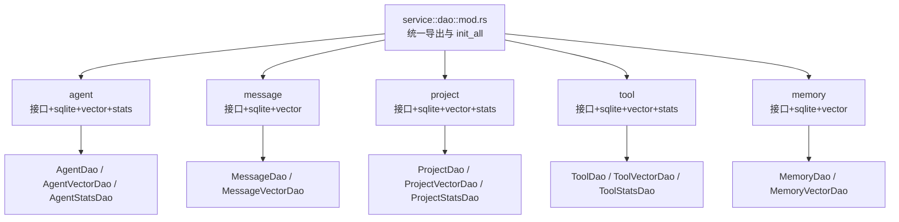
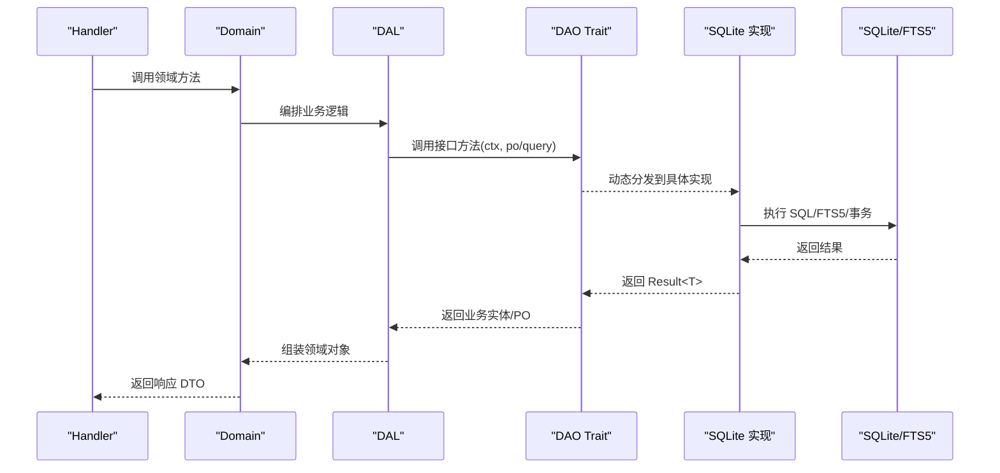
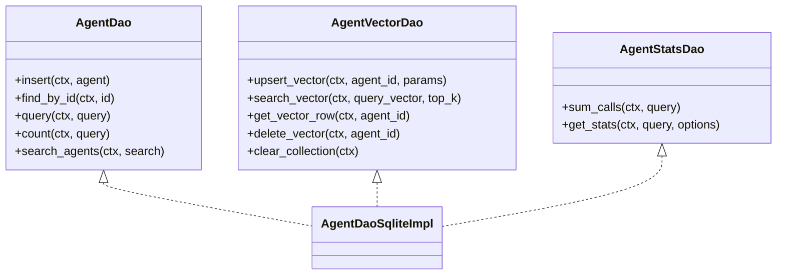
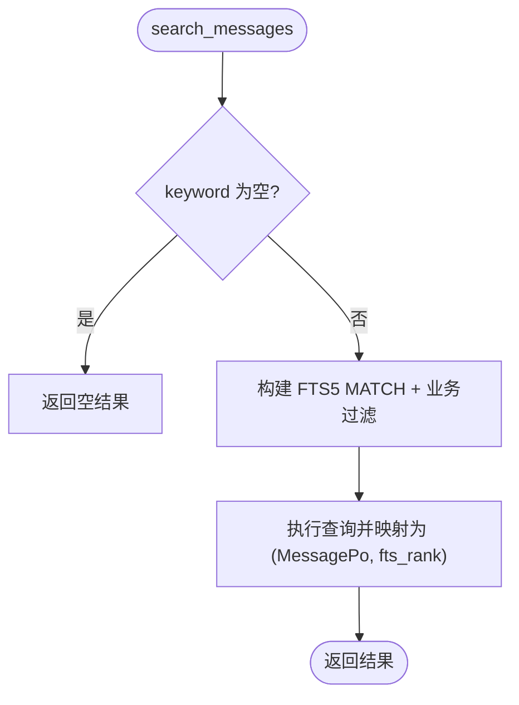
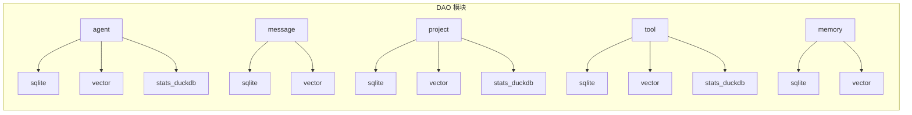

# DAO 层多态

<cite>
**本文引用的文件**
- [src/service/dao/mod.rs](file://src/service/dao/mod.rs)
- [src/service/dao/agent/mod.rs](file://src/service/dao/agent/mod.rs)
- [src/service/dao/agent/sqlite.rs](file://src/service/dao/agent/sqlite.rs)
- [src/service/dao/message/mod.rs](file://src/service/dao/message/mod.rs)
- [src/service/dao/message/sqlite.rs](file://src/service/dao/message/sqlite.rs)
- [src/service/dao/project/mod.rs](file://src/service/dao/project/mod.rs)
- [src/service/dao/project/sqlite.rs](file://src/service/dao/project/sqlite.rs)
- [src/service/dao/tool/mod.rs](file://src/service/dao/tool/mod.rs)
- [src/service/dao/tool/sqlite.rs](file://src/service/dao/tool/sqlite.rs)
- [src/service/dao/memory/mod.rs](file://src/service/dao/memory/mod.rs)
- [src/service/dao/memory/sqlite.rs](file://src/service/dao/memory/sqlite.rs)
- [docs/ARCHITECTURE.md](file://docs/ARCHITECTURE.md)
</cite>

## 目录
1. [简介](#简介)
2. [项目结构](#项目结构)
3. [核心组件](#核心组件)
4. [架构总览](#架构总览)
5. [详细组件分析](#详细组件分析)
6. [依赖关系分析](#依赖关系分析)
7. [性能与基准](#性能与基准)
8. [故障排查指南](#故障排查指南)
9. [结论](#结论)
10. [附录：如何新增存储后端](#附录如何新增存储后端)

## 简介
本文件面向 AI Orz 系统的 DAO 层，系统性阐述其“多态接口设计”原则与实践。DAO 层通过抽象 Trait 定义统一的数据访问契约，并以 SQLite 实现作为默认后端；同时为向量检索、统计查询等能力提供独立子模块（如 vector、stats_duckdb），使上层 DAL/Domain 仅面向接口编程，从而支持未来替换或扩展其他存储后端（内存、DuckDB、PostgreSQL 等）。文档还覆盖 CRUD 规范、查询参数模型、FTS5 全文检索、软删除策略、事务边界、初始化与依赖注入模式，以及迁移与性能基线建议。

## 项目结构
DAO 层按领域划分模块，每个模块包含：
- 接口定义（Trait + 查询参数结构体）
- SQLite 具体实现（单例工厂 + 方法实现）
- 可选的向量索引子模块（vector）
- 可选的统计子模块（stats_duckdb）
- 统一的 init() 入口，由 service::init_all() 集中注册

图示来源
- [src/service/dao/mod.rs:1-56](file://src/service/dao/mod.rs#L1-L56)

章节来源
- [src/service/dao/mod.rs:1-56](file://src/service/dao/mod.rs#L1-L56)

## 核心组件
- 多态接口（Trait）：每个领域一个主 DAO Trait，负责该实体的基础 CRUD、分页查询、计数与搜索入口。
- 向量 DAO（Vector Dao）：将向量索引与业务数据解耦，提供 upsert/search/get/delete/clear 等纯向量操作。
- 统计 DAO（Stats Dao）：基于 Stats 事件表（如 DuckDB）聚合调用次数、失败率、QPS 等指标。
- 查询参数模型：每个 DAO 定义 Query/Search 结构体，统一组合过滤条件、分页、关键词与向量入参。
- 初始化与单例：每个 DAO 模块暴露 new/init/dao 函数，使用 OnceLock 管理全局单例，便于测试隔离与运行时切换。

章节来源
- [src/service/dao/agent/mod.rs:63-213](file://src/service/dao/agent/mod.rs#L63-L213)
- [src/service/dao/message/mod.rs:59-217](file://src/service/dao/message/mod.rs#L59-L217)
- [src/service/dao/project/mod.rs:39-247](file://src/service/dao/project/mod.rs#L39-L247)
- [src/service/dao/tool/mod.rs:24-358](file://src/service/dao/tool/mod.rs#L24-L358)
- [src/service/dao/memory/mod.rs:60-562](file://src/service/dao/memory/mod.rs#L60-L562)

## 架构总览
DAO 层遵循“严格分层、面向接口编程”的原则：
- 上层（DAL/Domain）只依赖 DAO Trait，不感知具体存储实现。
- 所有服务方法首参为 RequestContext，跨层传递使用 ctx.clone()。
- PO 仅在 DAO/DAL 内部流转，Domain 及以上不直接持有 PO。
- 统一初始化：service::init_all() 调用各模块 init() 完成单例注册。

图示来源
- [docs/ARCHITECTURE.md:325-385](file://docs/ARCHITECTURE.md#L325-L385)
- [src/service/dao/mod.rs:29-55](file://src/service/dao/mod.rs#L29-L55)

章节来源
- [docs/ARCHITECTURE.md:325-385](file://docs/ARCHITECTURE.md#L325-L385)
- [src/service/dao/mod.rs:29-55](file://src/service/dao/mod.rs#L29-L55)

## 详细组件分析

### Agent DAO 多态设计
- 接口职责
  - AgentDao：CRUD、通用查询、计数、FTS5 关键词搜索（返回 PO 与 BM25 评分）。
  - AgentVectorDao：向量索引 upsert/search/get/delete/clear，与基础数据解耦。
  - AgentStatsDao：基于事件表的唤醒统计与 QPS 计算。
- 查询参数
  - AgentQuery：ID 列表、状态、创建者、角色标签（JSON 数组精确匹配）、分页等。
  - AgentSearch：关键词 + 向量入参 + TopK + 距离阈值 + 复用 AgentQuery 作为业务过滤。
- 实现要点
  - SQLite 实现使用 sqlx QueryBuilder 构建 COUNT/LIST/SEARCH 语句。
  - FTS5 MATCH 配合 escape_fts5_keyword，空关键词短路返回。
  - 角色标签使用 json_each 进行 OR 语义匹配。
  - 软删除：status != 0 在常规查询中自动过滤。

图示来源
- [src/service/dao/agent/mod.rs:63-213](file://src/service/dao/agent/mod.rs#L63-L213)
- [src/service/dao/agent/sqlite.rs:57-329](file://src/service/dao/agent/sqlite.rs#L57-L329)

章节来源
- [src/service/dao/agent/mod.rs:63-213](file://src/service/dao/agent/mod.rs#L63-L213)
- [src/service/dao/agent/sqlite.rs:57-329](file://src/service/dao/agent/sqlite.rs#L57-L329)

### Message DAO 多态设计
- 接口职责
  - MessageDao：消息插入、通用查询、按任务/项目/发送方/接收方查询、软删除、状态更新、FTS5 全文检索。
  - MessageVectorDao：消息向量索引的增删查改与语义搜索。
- 查询参数
  - MessageQuery：id、ids、task_id、project_id、from/to、to_role、message_type、status_in、limit/offset、order_by、organization_id。
  - MessageSearch：keyword + query_vector + top_k + filters。
- 实现要点
  - 默认软删除过滤：未显式指定 status_in 时排除 Recalled(0)。
  - FTS5 MATCH + JOIN，空关键词短路。
  - 工具调用请求/结果便捷方法：create_tool_call_request/result。

图示来源
- [src/service/dao/message/sqlite.rs:429-527](file://src/service/dao/message/sqlite.rs#L429-L527)

章节来源
- [src/service/dao/message/mod.rs:59-217](file://src/service/dao/message/mod.rs#L59-L217)
- [src/service/dao/message/sqlite.rs:429-527](file://src/service/dao/message/sqlite.rs#L429-L527)

### Project DAO 多态设计
- 接口职责
  - ProjectDao：CRUD、按根用户/状态查询、分页、计数、FTS5 全文检索。
  - ProjectVectorDao：项目向量索引的增删查改与语义搜索。
  - ProjectStatsDao：项目业务事件统计与 QPS 计算。
- 查询参数
  - ProjectQuery：root_user_id、status_in、分页、ids、owner_agent_id。
  - ProjectSearch：keyword + query_vector + top_k + filters。
- 实现要点
  - 排序：priority DESC, created_at DESC。
  - FTS5 MATCH 结合业务过滤（修复了 root_user_id/owner_agent_id/status_in/ids 的应用）。
  - 软删除：status != 0。

章节来源
- [src/service/dao/project/mod.rs:39-247](file://src/service/dao/project/mod.rs#L39-L247)
- [src/service/dao/project/sqlite.rs:75-395](file://src/service/dao/project/sqlite.rs#L75-L395)

### Tool DAO 多态设计
- 接口职责
  - ToolDao：工具元数据 CRUD、按 Agent 绑定/解绑、启用工具列表、内置工具同步、FTS5 搜索。
  - ToolVectorDao：工具向量索引的增删查改与语义搜索。
  - ToolStatsDao：工具调用次数、失败次数、按 Agent 分组统计。
- 查询参数
  - ToolQuery：agent_id、ids、tags、protocol、status/exclude_status、mcp_server_id、enabled_only、分页。
  - ToolSearch：keyword + query_vector + top_k + distance_threshold + filters。
- 实现要点
  - 内置工具不可修改/删除。
  - tags 过滤需跳过空字符串避免 json_each 报错。
  - FTS5 MATCH + 可选 JOIN agent_tools，限制最大返回数量。

章节来源
- [src/service/dao/tool/mod.rs:24-358](file://src/service/dao/tool/mod.rs#L24-L358)
- [src/service/dao/tool/sqlite.rs:89-452](file://src/service/dao/tool/sqlite.rs#L89-L452)

### Memory DAO 多态设计
- 接口职责
  - MemoryDao：短期记忆索引与长期知识图谱节点的增删查改、引用与关系维护、原始追踪文件追加读取。
  - MemoryVectorDao：短期记忆与长期知识节点向量索引的增删查改与语义搜索。
- 查询参数
  - MemoryQuery：ids、agent_id、status/exclude_status、keyword、limit、memory_type、tags、task_id、include_shared、node_type。
  - MemorySearch：keyword + query_vector + top_k + distance_threshold + filters。
- 实现要点
  - 原始记忆不可修改不可删除，只能追加（每日 JSONL 文件）。
  - 知识节点 upsert：先尝试 UPDATE，不存在则 INSERT。
  - 批量写入使用事务保证一致性。
  - FTS5 全文检索用于短期索引与知识节点。

章节来源
- [src/service/dao/memory/mod.rs:60-562](file://src/service/dao/memory/mod.rs#L60-L562)
- [src/service/dao/memory/sqlite.rs:126-800](file://src/service/dao/memory/sqlite.rs#L126-L800)

## 依赖关系分析
- 模块内依赖
  - 每个 DAO 模块通过 mod.rs 声明子模块（sqlite/vector/stats_duckdb），并在顶层提供 dao()/init()/new() 别名，供 DAL 组合使用。
- 模块间依赖
  - DAO 之间无相互依赖，保持单一数据源职责。
  - 向量与统计能力以独立 Trait 形式存在，避免与基础 CRUD 耦合。
- 外部依赖
  - sqlx 0.8（SQLite，离线查询缓存 .sqlx）。
  - FTS5 全文检索（BM25）。
  - stats_duckdb 用于统计聚合。

图示来源
- [src/service/dao/agent/mod.rs:206-213](file://src/service/dao/agent/mod.rs#L206-L213)
- [src/service/dao/message/mod.rs:213-217](file://src/service/dao/message/mod.rs#L213-L217)
- [src/service/dao/project/mod.rs:240-247](file://src/service/dao/project/mod.rs#L240-L247)
- [src/service/dao/tool/mod.rs:14-34](file://src/service/dao/tool/mod.rs#L14-L34)
- [src/service/dao/memory/mod.rs:555-562](file://src/service/dao/memory/mod.rs#L555-L562)

章节来源
- [src/service/dao/agent/mod.rs:206-213](file://src/service/dao/agent/mod.rs#L206-L213)
- [src/service/dao/message/mod.rs:213-217](file://src/service/dao/message/mod.rs#L213-L217)
- [src/service/dao/project/mod.rs:240-247](file://src/service/dao/project/mod.rs#L240-L247)
- [src/service/dao/tool/mod.rs:14-34](file://src/service/dao/tool/mod.rs#L14-L34)
- [src/service/dao/memory/mod.rs:555-562](file://src/service/dao/memory/mod.rs#L555-L562)

## 性能与基准
- 查询优化
  - 使用 sqlx QueryBuilder 动态拼接 WHERE 条件，避免 N+1 与无效条件。
  - FTS5 MATCH 配合 escape_fts5_keyword，空关键词短路，减少无效扫描。
  - 搜索场景限制最大返回条数（如 20），防止全量返回。
- 事务与批处理
  - 批量写入（如知识节点 upsert）使用事务提交，确保一致性。
- 软删除与索引
  - 常规查询默认过滤 status=0，减少脏数据干扰。
  - 对常用过滤字段建立索引（如 is_published），加速查询。
- 建议的基准测试
  - 针对高频 DAO 方法（query/search/count）建立基准测试，对比不同后端（SQLite vs 内存/其他）的吞吐与延迟。
  - 向量搜索在不同 top_k、距离阈值下的召回率与耗时。
  - FTS5 全文检索在不同关键词长度与分词策略下的性能。

[本节为通用指导，无需特定文件来源]

## 故障排查指南
- 常见问题
  - FTS5 空关键词导致 MATCH 报错：已在各实现中增加空关键词短路逻辑。
  - json_each 解析错误：对空 tags 做前置判断，避免 malformed JSON。
  - 软删除误过滤：当需要查询历史/恢复时，显式传入 status_in 覆盖默认过滤。
  - 内置工具不可修改/删除：更新/删除前校验协议类型，抛出明确错误。
- 定位步骤
  - 检查 DAO 方法的 QueryBuilder 拼接是否正确（字段别名、JOIN 条件）。
  - 确认 RequestContext 是否携带正确的 db_pool 与组织上下文。
  - 查看日志中的警告（如 keyword 已废弃提示），迁移至 FTS5 搜索。

章节来源
- [src/service/dao/message/sqlite.rs:530-595](file://src/service/dao/message/sqlite.rs#L530-L595)
- [src/service/dao/tool/sqlite.rs:455-520](file://src/service/dao/tool/sqlite.rs#L455-L520)
- [src/service/dao/agent/sqlite.rs:331-383](file://src/service/dao/agent/sqlite.rs#L331-L383)

## 结论
AI Orz 的 DAO 层通过“接口 + 多实现”的多态设计，实现了存储后端的可替换性与能力的可扩展性。每个领域 DAO 均提供清晰的 CRUD、查询、搜索与统计接口，并通过独立的向量与统计子模块解耦复杂能力。SQLite 作为默认后端，配合 FTS5 与事务机制，满足当前业务需求；未来可通过实现相同 Trait 接入其他后端，保持上层代码零改动。

[本节为总结性内容，无需特定文件来源]

## 附录：如何新增存储后端
- 步骤概览
  1. 新建模块或子模块（如 memory/postgres.rs），实现对应 DAO Trait。
  2. 在模块内提供 new/init/dao 函数，使用 OnceLock 管理实例。
  3. 在模块 mod.rs 中导出新实现，并更新 init() 注册。
  4. 若涉及向量/统计，新增 vector/stats 子模块并实现相应 Trait。
  5. 编写单元测试，使用独立数据库/内存存储验证行为一致性。
- 关键约束
  - 所有方法首参为 RequestContext，跨层使用 ctx.clone()。
  - 保持接口一致：CRUD、查询参数、搜索返回格式与现有实现对齐。
  - 软删除与 FTS5 行为保持一致（必要时适配）。
  - 禁止在 DAO 中定义通用工具函数，避免 DAO → DAO 依赖。

章节来源
- [src/service/dao/mod.rs:29-55](file://src/service/dao/mod.rs#L29-L55)
- [src/service/dao/agent/sqlite.rs:36-53](file://src/service/dao/agent/sqlite.rs#L36-L53)
- [src/service/dao/message/sqlite.rs:42-59](file://src/service/dao/message/sqlite.rs#L42-L59)
- [src/service/dao/project/sqlite.rs:42-60](file://src/service/dao/project/sqlite.rs#L42-L60)
- [src/service/dao/tool/sqlite.rs:58-87](file://src/service/dao/tool/sqlite.rs#L58-L87)
- [src/service/dao/memory/sqlite.rs:66-83](file://src/service/dao/memory/sqlite.rs#L66-L83)