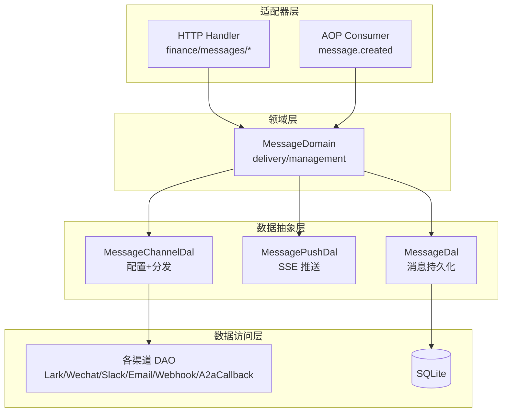
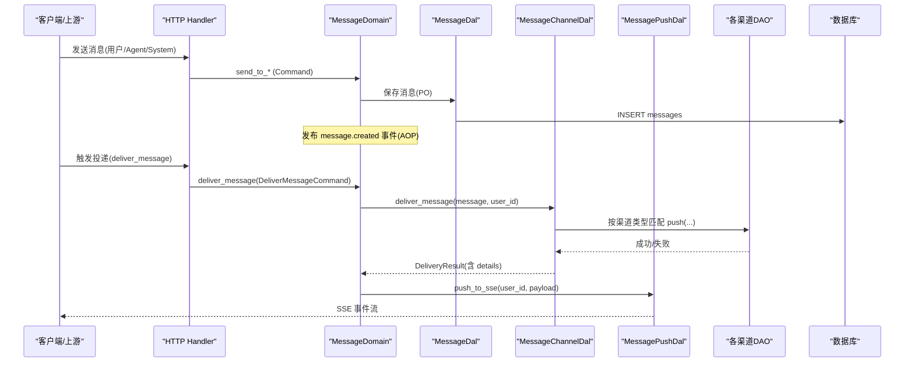
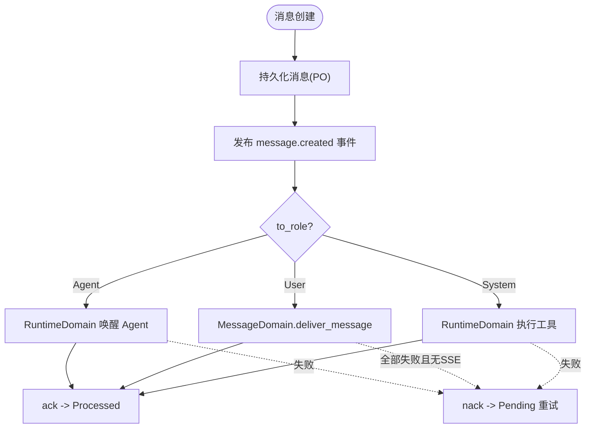
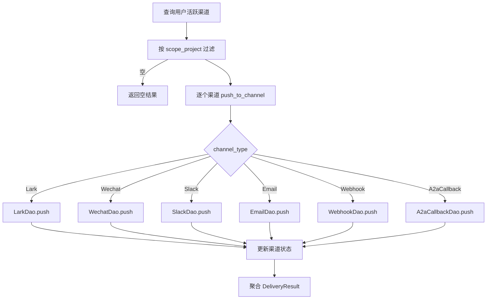
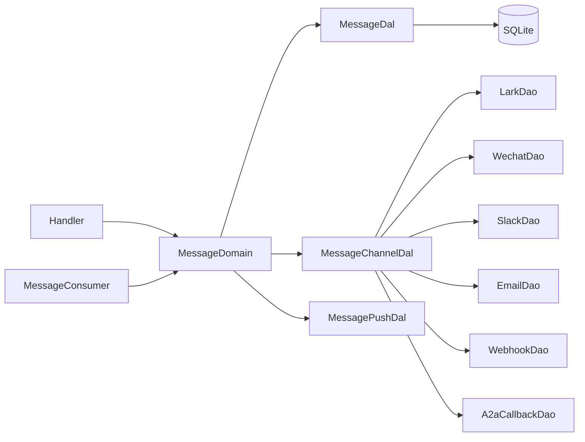

# Message 领域编排

<cite>
**本文引用的文件**
- [src/service/domain/message/mod.rs](file://src/service/domain/message/mod.rs)
- [src/service/domain/message/delivery.rs](file://src/service/domain/message/delivery.rs)
- [src/models/message.rs](file://src/models/message.rs)
- [src/models/message_channel.rs](file://src/models/message_channel.rs)
- [src/service/dal/message_channel.rs](file://src/service/dal/message_channel.rs)
- [src/consumer/message.rs](file://src/consumer/message.rs)
- [tests/integration/message_delivery_test.rs](file://tests/integration/message_delivery_test.rs)
- [docs/message_channel_design.md](file://docs/message_channel_design.md)
- [docs/message_interaction_design.md](file://docs/message_interaction_design.md)
</cite>

## 目录
1. [简介](#简介)
2. [项目结构](#项目结构)
3. [核心组件](#核心组件)
4. [架构总览](#架构总览)
5. [详细组件分析](#详细组件分析)
6. [依赖关系分析](#依赖关系分析)
7. [性能与可靠性](#性能与可靠性)
8. [故障排查指南](#故障排查指南)
9. [结论](#结论)
10. [附录：编排示例](#附录编排示例)

## 简介
本编排文档聚焦 Message 领域的消息管理与投递，覆盖消息生命周期、多渠道投递、消息路由、队列编排、重试机制与失败处理等关键业务模式。结合 AOP 事件中心、SSE 实时推送与多渠道（飞书/微信/Slack/邮件/Webhook/A2A 回调）分发，说明如何保证可靠投递与高可用。

## 项目结构
Message 领域遵循严格四层单向调用：Adapter（HTTP Handler / 公开回调 / AOP Producer）→ Domain → DAL → DAO，禁止跨层调用与同层互调。Domain 输入为 Command/Query，输出为业务实体与内部事件；DAL 对外统一使用业务实体；DAO 仅暴露数据访问能力。

图表来源
- [src/service/domain/message/mod.rs:32-79](file://src/service/domain/message/mod.rs#L32-L79)
- [src/service/dal/message_channel.rs:29-58](file://src/service/dal/message_channel.rs#L29-L58)
- [src/consumer/message.rs:64-141](file://src/consumer/message.rs#L64-L141)

章节来源
- [docs/message_interaction_design.md:223-245](file://docs/message_interaction_design.md#L223-L245)
- [docs/message_channel_design.md:424-474](file://docs/message_channel_design.md#L424-L474)

## 核心组件
- 消息领域接口与命令对象：定义 send_to_agent/send_to_user/send_tool_call_request/send_tool_call_result/send_task_assignment/deliver_message 等入口，以及对应 Command 参数对象，避免参数膨胀。
- 消息实体与 PO：Message 封装 MessagePo，支持消息链 root_id/reply_to_id、上下文 project/task、工具调用消息 ToolCallMessage、任务分配消息 TaskAssignmentMessage。
- 渠道 DAL：统一整合渠道配置管理（CRUD/状态/测试）与消息分发（按 scope_project 过滤后逐渠道 push），纯 match 分发到具体渠道 DAO。
- SSE 推送：通过 MessagePushDal 将消息以 SsePushPayload 推送到在线订阅者。
- 消费者编排：MessageConsumer 消费 message.created 事件，按 to_role 路由到 RuntimeDomain 唤醒 Agent 或 MessageDomain 投递用户消息，并实现 ack/nack 重试语义。

章节来源
- [src/service/domain/message/mod.rs:121-377](file://src/service/domain/message/mod.rs#L121-L377)
- [src/models/message.rs:18-247](file://src/models/message.rs#L18-L247)
- [src/service/dal/message_channel.rs:62-126](file://src/service/dal/message_channel.rs#L62-L126)
- [src/consumer/message.rs:64-141](file://src/consumer/message.rs#L64-L141)

## 架构总览
消息从创建到投递的端到端流程如下：

图表来源
- [src/service/domain/message/delivery.rs:381-436](file://src/service/domain/message/delivery.rs#L381-L436)
- [src/service/dal/message_channel.rs:226-284](file://src/service/dal/message_channel.rs#L226-L284)
- [src/consumer/message.rs:359-389](file://src/consumer/message.rs#L359-L389)

## 详细组件分析

### 消息实体与生命周期
- 实体设计：Message 组合 MessagePo，提供 id/project_id/task_id/from_id/to_id/role/message_type/content/file_meta/reply_to_id/root_id 等字段，支持消息链与上下文。
- 生命周期：
  - 创建：send_to_* 生成 ID、填充上下文、写入 PO，返回业务实体。
  - 消费：AOP 调度 MessageConsumer 根据 to_role 路由；Agent 消息走 RuntimeDomain 唤醒；User 消息走 MessageDomain.deliver_message；System 消息执行工具调用。
  - 完成：消费者 ack 更新为 Processed；失败 nack 回退为 Pending 并重试。

图表来源
- [src/models/message.rs:249-300](file://src/models/message.rs#L249-L300)
- [src/consumer/message.rs:78-141](file://src/consumer/message.rs#L78-L141)
- [src/consumer/message.rs:359-389](file://src/consumer/message.rs#L359-L389)

章节来源
- [src/models/message.rs:18-247](file://src/models/message.rs#L18-L247)
- [src/consumer/message.rs:78-141](file://src/consumer/message.rs#L78-L141)

### 多渠道投递与路由
- 路由策略：
  - 查询用户已启用渠道列表。
  - 按 scope_project 过滤：全局渠道接收所有消息；项目级渠道仅接收对应项目的消息。
  - 纯 match 分发到 Lark/Wechat/Slack/Email/Webhook/A2aCallback DAO。
  - 记录每个渠道的成功/失败详情，并更新 last_pushed_at/last_error。
- 结果聚合：DeliveryResult 汇总 total/success/failed/details，并在 Domain 层合并 SSE 推送计数。

图表来源
- [src/service/dal/message_channel.rs:226-284](file://src/service/dal/message_channel.rs#L226-L284)
- [src/service/dal/message_channel.rs:289-336](file://src/service/dal/message_channel.rs#L289-L336)

章节来源
- [src/service/dal/message_channel.rs:62-126](file://src/service/dal/message_channel.rs#L62-L126)
- [docs/message_channel_design.md:424-474](file://docs/message_channel_design.md#L424-L474)

### SSE 实时推送
- 订阅：subscribe_sse 建立连接并注册 receiver。
- 推送：deliver_message 构造 SsePushPayload，调用 MessagePushDal.push_to_sse 推送给当前用户的所有在线连接。
- 集成验证：集成测试验证 SSE 连接建立与事件内容正确性。

章节来源
- [src/service/domain/message/delivery.rs:438-459](file://src/service/domain/message/delivery.rs#L438-L459)
- [tests/integration/message_delivery_test.rs:385-515](file://tests/integration/message_delivery_test.rs#L385-L515)

### 工具调用与结果回写
- 请求：send_tool_call_request 序列化 ToolCallMessage 并持久化，设置 from_log_id/user_id/model_provider_id/model_name 以便异步路径重建 ctx。
- 执行：消费者解析 ToolCallRequest，调用 RuntimeDomain 执行工具，捕获成功/失败结果。
- 结果：send_tool_call_result 校验请求类型，构造结果消息，保留 trace_ref 轻量引用，关联原消息 root_id。

章节来源
- [src/service/domain/message/delivery.rs:210-330](file://src/service/domain/message/delivery.rs#L210-L330)
- [src/consumer/message.rs:402-477](file://src/consumer/message.rs#L402-L477)

### 消费者编排与重试
- 事件消费：MessageConsumer 订阅 message.created，按 to_role 分发。
- Agent 消息：原子占用 Agent（BusyGuard），检查任务状态与轮次限制，唤醒 Agent。
- User 消息：调用 deliver_message，若所有渠道失败且无 SSE 推送，则返回错误触发 nack 重试。
- System 消息：解析并执行工具调用，回写结果。

章节来源
- [src/consumer/message.rs:64-141](file://src/consumer/message.rs#L64-L141)
- [src/consumer/message.rs:145-389](file://src/consumer/message.rs#L145-L389)

## 依赖关系分析
- 单向依赖：Handler/Consumer → Domain → DAL → DAO；Domain 不感知 DAO 细节，仅通过 DAL 暴露的接口协作。
- 渠道扩展：新增渠道需实现 DAO，并在 DAL 的 match 中增加分支，编译期强制完整性。
- 事件驱动：AOP 框架负责事件入队/出队与 ack/nack，业务侧在 Consumer 中编排。

图表来源
- [src/service/domain/message/mod.rs:32-79](file://src/service/domain/message/mod.rs#L32-L79)
- [src/service/dal/message_channel.rs:29-58](file://src/service/dal/message_channel.rs#L29-L58)

章节来源
- [docs/message_channel_design.md:424-474](file://docs/message_channel_design.md#L424-L474)

## 性能与可靠性
- 并发与顺序：
  - 事件消费并发度为 4，order_key 按 task_id/project_id/id 分组保证顺序。
  - 消费者空队列休眠 100ms，错误重试间隔 1000ms。
- 幂等与去重：
  - 发送前可检查 has_pending_message_for_agent，避免重复通知。
  - BusyGuard 防止同一 Agent 被重复唤醒。
- 失败隔离：
  - 单渠道失败不影响其他渠道与 SSE；聚合失败才由消费者决定重试。
- 资源控制：
  - SSE 长连接按用户维度管理，断开自动清理。
  - 大结果附件采用 FileMeta 外置，inline 结果限长截断。

章节来源
- [src/consumer/message.rs:130-141](file://src/consumer/message.rs#L130-L141)
- [src/service/domain/message/mod.rs:107-117](file://src/service/domain/message/mod.rs#L107-L117)
- [src/service/domain/message/delivery.rs:21-31](file://src/service/domain/message/delivery.rs#L21-L31)

## 故障排查指南
- 渠道未实现：Webhook 渠道当前返回 unsupported_operation，集成测试断言 failed=1 且不抛错。
- 不可达 URL：无效 URL 导致 HTTP 错误，但 deliver_message 仍返回 Ok，仅 aggregated failed 计数增加。
- 零渠道与零 SSE：deliver_message 返回 Ok，total/success/failed/sse_delivered 全 0；消费者层判定“全部失败且无 SSE”时触发重试。
- 消费者重试：ack/nack 分别标记 Processed/Pending；当投递失败且无 SSE 时返回错误，触发重试。

章节来源
- [tests/integration/message_delivery_test.rs:517-651](file://tests/integration/message_delivery_test.rs#L517-L651)
- [tests/integration/message_delivery_test.rs:653-800](file://tests/integration/message_delivery_test.rs#L653-L800)
- [src/consumer/message.rs:359-389](file://src/consumer/message.rs#L359-L389)

## 结论
Message 领域通过 Domain 编排、DAL 统一分发、DAO 独立实现与 AOP 事件驱动，实现了高内聚、低耦合的消息管理与投递体系。多渠道投递具备失败隔离与可观测性，SSE 提供实时推送能力，消费者层保障重试与顺序。整体设计满足可靠投递与高可用要求，并为后续渠道扩展与业务演进预留了清晰边界。

## 附录：编排示例
以下示例展示复杂业务场景的实现方式，均基于现有接口与流程：

- 消息创建与链路追踪
  - 使用 SendToAgentCommand/SendToUserCommand 创建消息，自动继承 reply_to_id 的 root_id，形成消息链。
  - 参考路径：[src/service/domain/message/delivery.rs:51-158](file://src/service/domain/message/delivery.rs#L51-L158)

- 路由选择与渠道过滤
  - 查询用户活跃渠道并按 scope_project 过滤，纯 match 分发到具体渠道 DAO。
  - 参考路径：[src/service/dal/message_channel.rs:226-284](file://src/service/dal/message_channel.rs#L226-L284)

- 投递跟踪与结果聚合
  - 每个渠道推送后更新状态，聚合 DeliveryResult 包含 total/success/failed/details。
  - 参考路径：[src/service/dal/message_channel.rs:289-336](file://src/service/dal/message_channel.rs#L289-L336)

- SSE 推送与订阅
  - 构建 SsePushPayload 并通过 MessagePushDal 推送至在线订阅者。
  - 参考路径：[src/service/domain/message/delivery.rs:381-436](file://src/service/domain/message/delivery.rs#L381-L436)

- 工具调用与结果回写
  - 发送 ToolCallRequest，消费者执行工具并回写 ToolCallResult，保留 trace_ref。
  - 参考路径：[src/service/domain/message/delivery.rs:210-330](file://src/service/domain/message/delivery.rs#L210-L330), [src/consumer/message.rs:402-477](file://src/consumer/message.rs#L402-L477)

- 重试与失败处理
  - 消费者在“全部渠道失败且无 SSE”时返回错误，触发 nack 重试。
  - 参考路径：[src/consumer/message.rs:359-389](file://src/consumer/message.rs#L359-L389)

章节来源
- [tests/integration/message_delivery_test.rs:117-191](file://tests/integration/message_delivery_test.rs#L117-L191)
- [tests/integration/message_delivery_test.rs:385-515](file://tests/integration/message_delivery_test.rs#L385-L515)
- [tests/integration/message_delivery_test.rs:517-651](file://tests/integration/message_delivery_test.rs#L517-L651)
- [tests/integration/message_delivery_test.rs:653-800](file://tests/integration/message_delivery_test.rs#L653-L800)