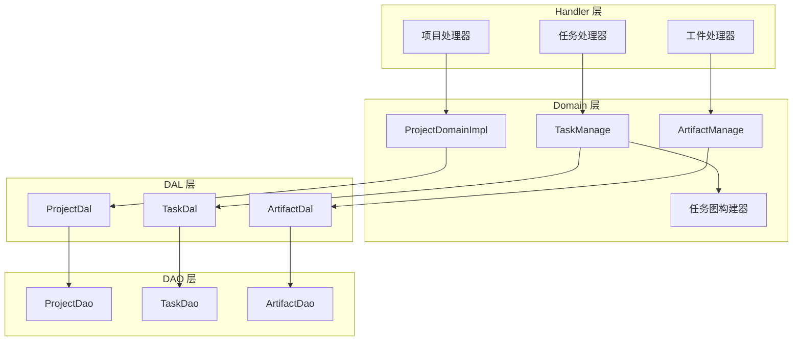
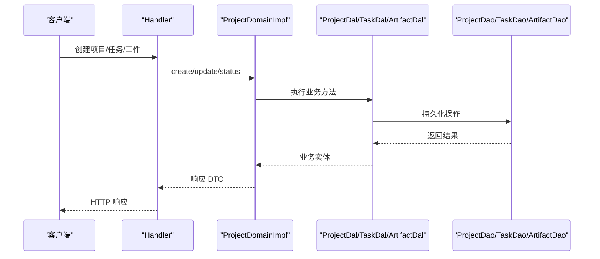
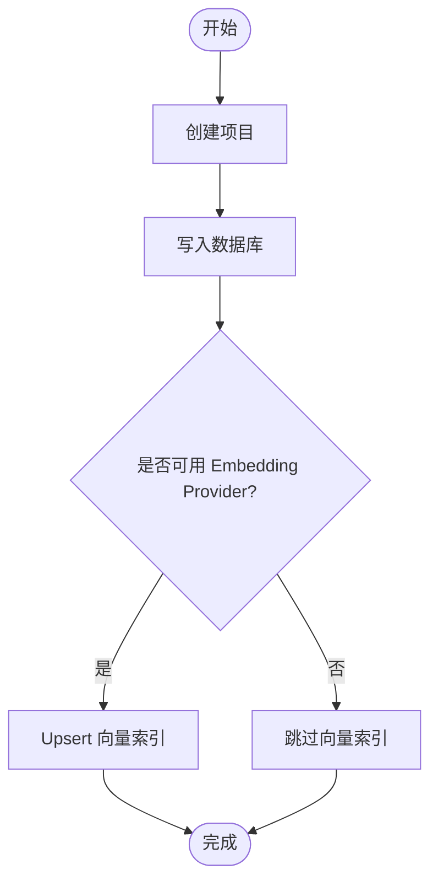
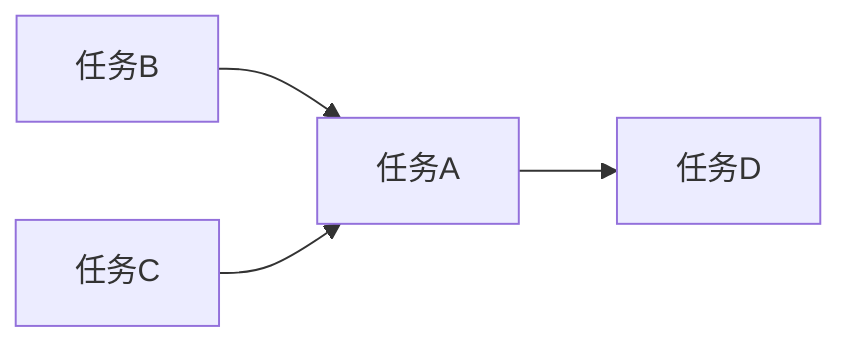
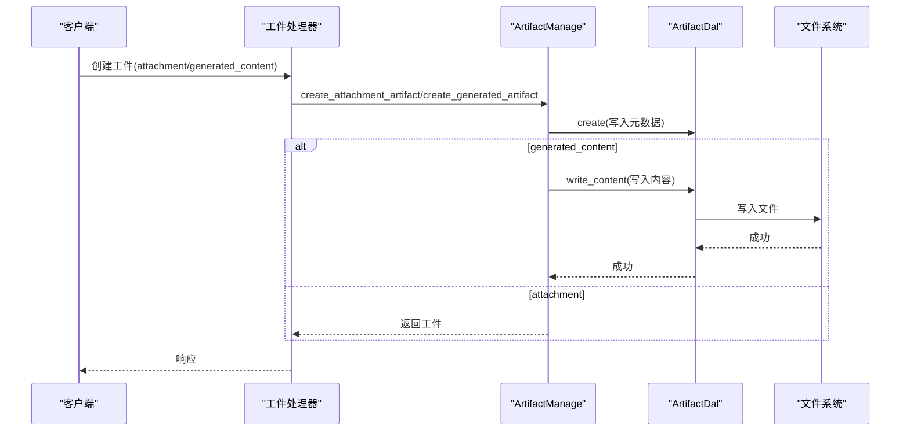
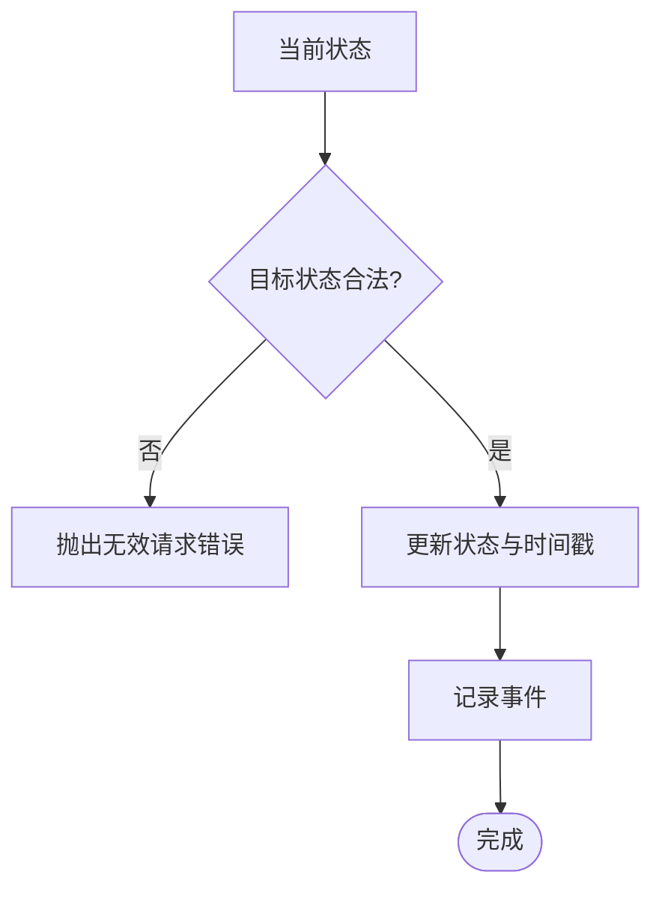
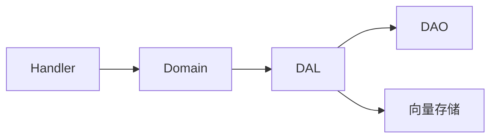

# Project 领域编排

<cite>
**本文引用的文件**
- [项目系统设计文档](file://docs/project_design.md)
- [项目管理系统设计文档](file://docs/project_management_design.md)
- [架构说明](file://docs/ARCHITECTURE.md)
- [Project Domain 入口与接口定义](file://src/service/domain/project/mod.rs)
- [Task 业务实现](file://src/service/domain/project/task.rs)
- [Artifact 业务实现](file://src/service/domain/project/artifact.rs)
- [任务图构建器](file://src/service/domain/project/task_graph.rs)
- [Project DAL](file://src/service/dal/project.rs)
- [Task DAL](file://src/service/dal/task.rs)
- [Artifact DAL](file://src/service/dal/artifact.rs)
- [Handler 路由分组（项目/任务/工件）](file://src/handlers/project/mod.rs)
</cite>

## 目录
1. [简介](#简介)
2. [项目结构](#项目结构)
3. [核心组件](#核心组件)
4. [架构总览](#架构总览)
5. [详细组件分析](#详细组件分析)
6. [依赖关系分析](#依赖关系分析)
7. [性能考虑](#性能考虑)
8. [故障排查指南](#故障排查指南)
9. [结论](#结论)
10. [附录：编排示例](#附录：编排示例)

## 简介
本编排文档聚焦 Project 领域，围绕“项目、任务、工件”三大实体展开，系统化阐述以下能力：
- 项目生命周期管理：创建、查询、更新、状态流转（活跃/进行中/已完成/归档）、软删除。
- 任务依赖关系处理：基于 dependencies 的 DAG 约束、任务图构建与可视化渲染。
- 工件版本与关联管理：项目级与任务级产物、来源类型（附件引用/生成内容）、内容读写与部分更新、乐观锁。
- 调度编排模式：统一的状态流转入口、上下文注入、事件记录、向量索引降级策略。
- 数据一致性与并发安全：事务边界、乐观锁、权限校验、错误回滚与降级。

## 项目结构
Project 领域采用严格单向分层：Handler → Domain → DAL → DAO，禁止跨层调用与同层互调。PO 仅在 DAO/DAL 内部使用，Domain 对外仅暴露业务实体与 Command/Query。

图表来源
- [Project Domain 入口与接口定义:63-105](file://src/service/domain/project/mod.rs#L63-L105)
- [Project DAL:213-221](file://src/service/dal/project.rs#L213-L221)
- [Task DAL:211-219](file://src/service/dal/task.rs#L211-L219)
- [Artifact DAL:95-98](file://src/service/dal/artifact.rs#L95-L98)
- [任务图构建器:17-28](file://src/service/domain/project/task_graph.rs#L17-L28)

章节来源
- [项目管理系统设计文档:11-32](file://docs/project_management_design.md#L11-L32)
- [架构说明:24-33](file://docs/ARCHITECTURE.md#L24-L33)

## 核心组件
- ProjectDomainImpl：聚合 Project/Task/Artifact 管理能力，提供单例访问与初始化。
- TaskManage：任务 CRUD、状态流转、进度更新、事件记录。
- ArtifactManage：产物创建（附件引用/生成内容）、查询、删除、内容读写、部分更新与乐观锁。
- 任务图构建器：将任务列表转换为 Mermaid 图，支持方向配置与状态分类。
- ProjectDal/TaskDal/ArtifactDal：封装 DAO，提供混合搜索、统计、向量索引维护等能力。

章节来源
- [Project Domain 入口与接口定义:63-105](file://src/service/domain/project/mod.rs#L63-L105)
- [Task 业务实现:18-526](file://src/service/domain/project/task.rs#L18-L526)
- [Artifact 业务实现:16-532](file://src/service/domain/project/artifact.rs#L16-L532)
- [任务图构建器:17-67](file://src/service/domain/project/task_graph.rs#L17-L67)
- [Project DAL:213-221](file://src/service/dal/project.rs#L213-L221)
- [Task DAL:211-219](file://src/service/dal/task.rs#L211-L219)
- [Artifact DAL:95-98](file://src/service/dal/artifact.rs#L95-L98)

## 架构总览
Project 领域通过 Domain 层统一编排业务规则，DAL 层负责数据访问与增强（混合搜索、统计、向量索引），DAO 层专注持久化。Handler 仅做请求解析与 DTO 转换，不承载业务逻辑。

图表来源
- [Project Domain 入口与接口定义:63-105](file://src/service/domain/project/mod.rs#L63-L105)
- [Project DAL:213-221](file://src/service/dal/project.rs#L213-L221)
- [Task DAL:211-219](file://src/service/dal/task.rs#L211-L219)
- [Artifact DAL:95-98](file://src/service/dal/artifact.rs#L95-L98)

章节来源
- [项目管理系统设计文档:138-175](file://docs/project_management_design.md#L138-L175)
- [架构说明:56-64](file://docs/ARCHITECTURE.md#L56-L64)

## 详细组件分析

### 项目生命周期编排
- 创建项目：构造 ProjectPo → DAL 写入 → 可选向量索引维护（失败降级）。
- 查询项目：支持通用查询、混合搜索（FTS5 + 向量语义）、分页与过滤。
- 状态流转：统一入口 transition_status，保证合法状态机；归档时清理向量索引。
- 统计与模型调用统计：按选项加载 ProjectStats 与 ModelCallStats。

图表来源
- [Project DAL:225-274](file://src/service/dal/project.rs#L225-L274)
- [Project DAL:448-456](file://src/service/dal/project.rs#L448-L456)

章节来源
- [Project DAL:225-274](file://src/service/dal/project.rs#L225-L274)
- [Project DAL:488-703](file://src/service/dal/project.rs#L488-L703)
- [Project DAL:738-800](file://src/service/dal/project.rs#L738-L800)

### 任务依赖与 DAG 编排
- 依赖存储：dependencies 字段为前置任务 ID 列表。
- 图构建：遍历任务，添加节点与边，dep_id → task_id 表示执行流向。
- 可视化：Mermaid flowchart，支持方向与状态分类。

图表来源
- [任务图构建器:31-54](file://src/service/domain/project/task_graph.rs#L31-L54)

章节来源
- [任务图构建器:17-67](file://src/service/domain/project/task_graph.rs#L17-L67)

### 工件创建与版本控制编排
- 创建工件：支持附件引用型与生成内容型；项目级与任务级两种归属。
- 权限校验：validate_project_access 与 validate_project_and_task。
- 内容读写：仅 GeneratedContent 类型支持直接读取/更新；路径安全校验。
- 部分更新：name/description/tags/content 可选更新；expected_updated_at 乐观锁。

图表来源
- [Artifact 业务实现:27-71](file://src/service/domain/project/artifact.rs#L27-L71)
- [Artifact 业务实现:342-399](file://src/service/domain/project/artifact.rs#L342-L399)
- [Artifact DAL:176-194](file://src/service/dal/artifact.rs#L176-L194)

章节来源
- [Artifact 业务实现:27-532](file://src/service/domain/project/artifact.rs#L27-L532)
- [Artifact DAL:95-194](file://src/service/dal/artifact.rs#L95-L194)

### 任务状态流转编排
- 统一入口：transition_status 校验状态机合法性。
- 副作用：start/complete 设置时间戳；cancelled 走专用 action。
- 事件记录：每次状态变更记录 TaskEvent。

图表来源
- [Task 业务实现:394-482](file://src/service/domain/project/task.rs#L394-L482)

章节来源
- [Task 业务实现:281-392](file://src/service/domain/project/task.rs#L281-L392)
- [Task 业务实现:394-482](file://src/service/domain/project/task.rs#L394-L482)

## 依赖关系分析
- Domain 依赖 DAL，DAL 依赖 DAO；Handler 仅依赖 Domain。
- 向量索引：ProjectDal/TaskDal 在写操作后尝试 upsert 向量索引，失败降级不影响主流程。
- 混合搜索：DAL 层组合 FTS5 关键词与向量搜索结果，按匹配类型排序。

图表来源
- [Project DAL:225-274](file://src/service/dal/project.rs#L225-L274)
- [Task DAL:223-255](file://src/service/dal/task.rs#L223-L255)
- [Project DAL:488-703](file://src/service/dal/project.rs#L488-L703)
- [Task DAL:366-571](file://src/service/dal/task.rs#L366-L571)

章节来源
- [Project DAL:225-274](file://src/service/dal/project.rs#L225-L274)
- [Task DAL:223-255](file://src/service/dal/task.rs#L223-L255)
- [Project DAL:488-703](file://src/service/dal/project.rs#L488-L703)
- [Task DAL:366-571](file://src/service/dal/task.rs#L366-L571)

## 性能考虑
- 向量索引降级：Embedding Provider 不可用或写入失败时，记录日志并继续主流程。
- 混合搜索优化：先执行关键词搜索，再并行/串行执行向量搜索，合并去重后排序。
- 批量获取：对向量命中但不在关键词结果中的 ID，使用通用 query 批量获取，减少 N+1。
- 截断与分页：搜索结果限制最大条数，避免全量返回。

章节来源
- [Project DAL:488-703](file://src/service/dal/project.rs#L488-L703)
- [Task DAL:366-571](file://src/service/dal/task.rs#L366-L571)

## 故障排查指南
- 向量索引失败：检查 Embedding Provider 配置与网络；查看日志中 vector_index/vector_search 相关告警。
- 工件内容更新冲突：expected_updated_at 不匹配时返回 Conflict，需前端重新加载。
- 权限校验失败：validate_project_access 或 validate_project_and_task 抛出 InvalidRequest，检查 root_user_id 与 project/task 归属。
- 任务状态非法：transition_status 拒绝非法流转，检查当前状态与目标状态组合。

章节来源
- [Project DAL:225-274](file://src/service/dal/project.rs#L225-L274)
- [Task DAL:223-255](file://src/service/dal/task.rs#L223-L255)
- [Artifact 业务实现:273-340](file://src/service/domain/project/artifact.rs#L273-L340)
- [Task 业务实现:394-482](file://src/service/domain/project/task.rs#L394-L482)

## 结论
Project 领域通过清晰的层次划分与统一的编排入口，实现了项目生命周期、任务依赖 DAG、工件版本控制的完整闭环。DAL 层的混合搜索与向量索引降级策略提升了系统鲁棒性，Domain 层的权限校验与乐观锁保障了数据一致性。未来可进一步扩展 Agent 自主编排能力，结合思考循环与工具调用，实现更复杂的自动化流程。

## 附录：编排示例

### 项目创建流程
- 输入：名称、描述、优先级、标签、负责人 Agent、root_user_id、创建人。
- 流程：Domain 构造 Project → DAL 写入 → 可选向量索引维护 → 返回项目实体。

章节来源
- [Project Domain 入口与接口定义:118-129](file://src/service/domain/project/mod.rs#L118-L129)
- [Project DAL:225-274](file://src/service/dal/project.rs#L225-L274)

### 任务分解与依赖管理
- 输入：标题、描述、优先级、标签、root_user_id、分配对象、project_id、due_at、dependencies。
- 流程：Domain 构造 Task → DAL 写入 → 向量索引维护 → 返回任务实体。
- 依赖图：基于 dependencies 构建 DAG，渲染为 Mermaid 字符串。

章节来源
- [Task 业务实现:51-109](file://src/service/domain/project/task.rs#L51-L109)
- [任务图构建器:17-67](file://src/service/domain/project/task_graph.rs#L17-L67)

### 工件关联管理
- 输入：project_id、task_id（可选）、name、description、file_type、file_meta、tags、created_by。
- 流程：Domain 校验权限 → 构造 Artifact → DAL 写入元数据 → 若为生成内容则写入文件 → 返回工件实体。
- 更新：部分更新 name/description/tags/content，支持乐观锁。

章节来源
- [Artifact 业务实现:27-71](file://src/service/domain/project/artifact.rs#L27-L71)
- [Artifact 业务实现:273-340](file://src/service/domain/project/artifact.rs#L273-L340)