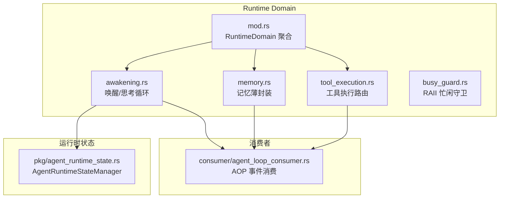
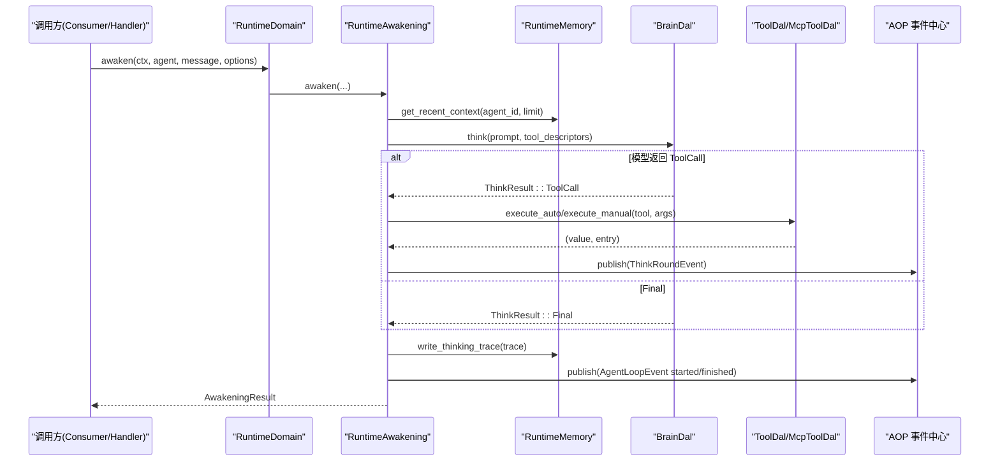
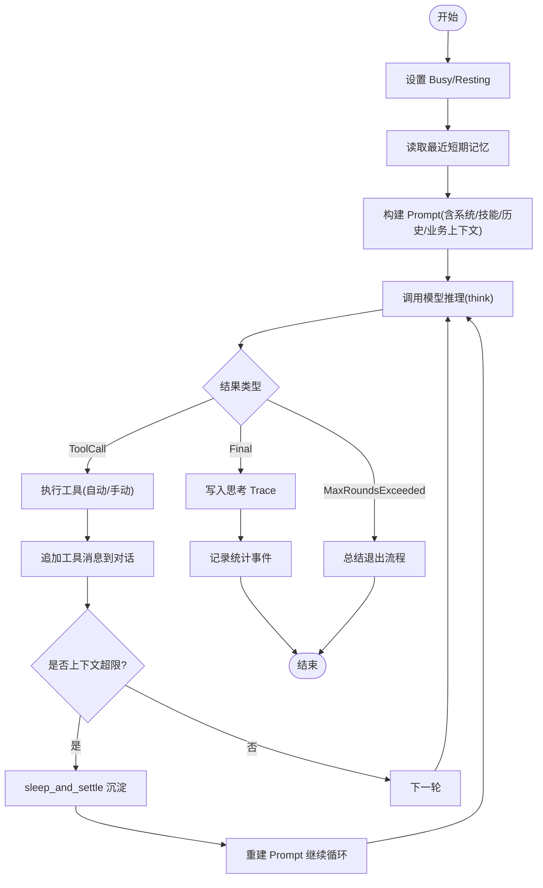
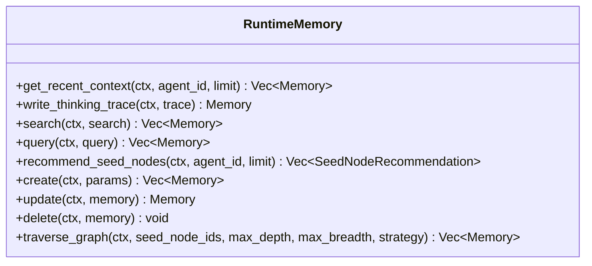
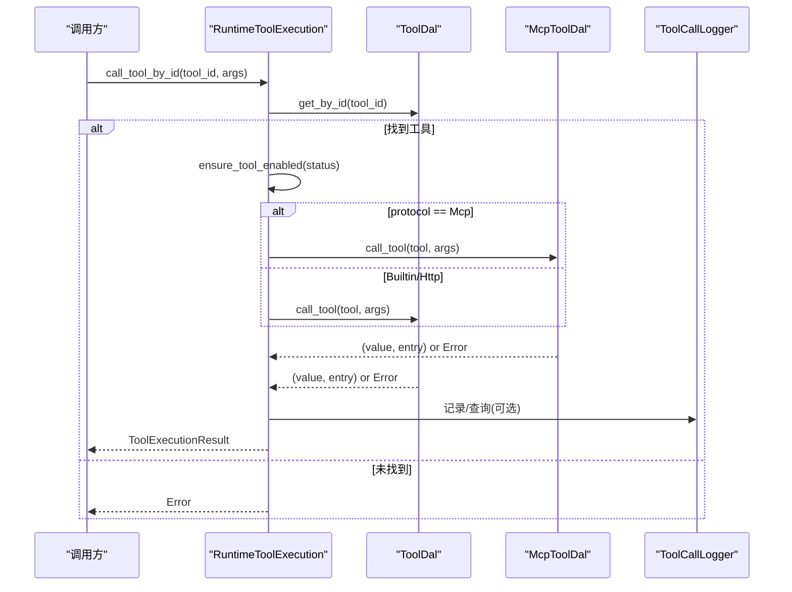
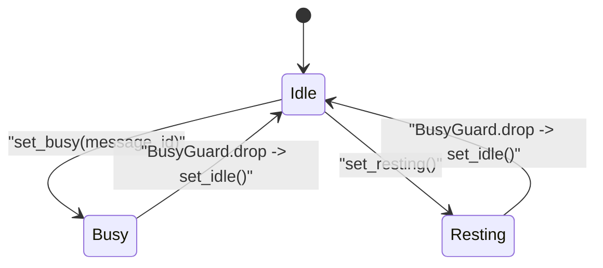
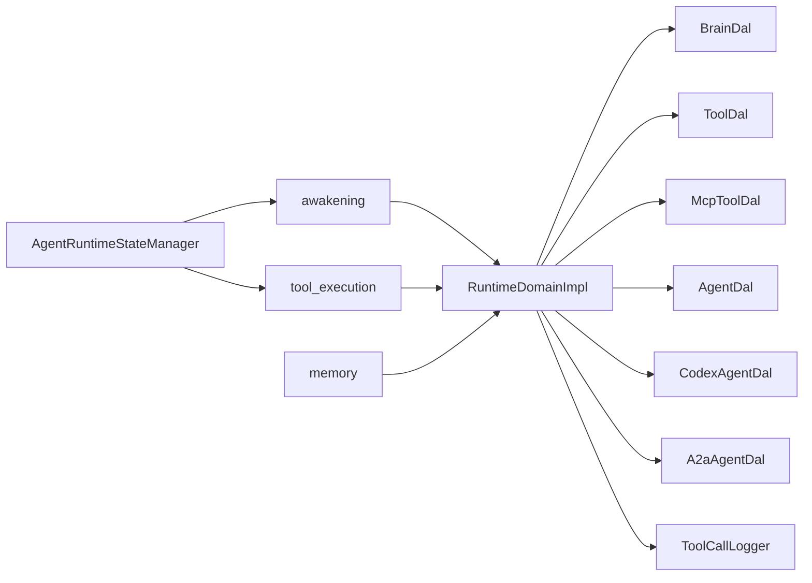
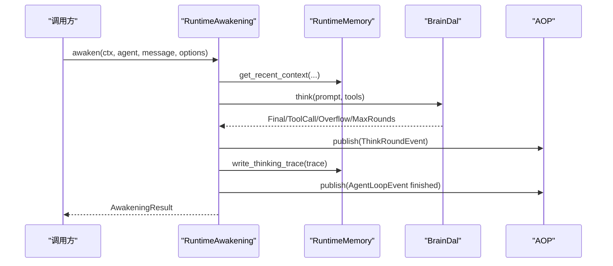

# Runtime 领域编排

<cite>
**本文引用的文件**
- [src/service/domain/runtime/mod.rs](file://src/service/domain/runtime/mod.rs)
- [src/service/domain/runtime/awakening.rs](file://src/service/domain/runtime/awakening.rs)
- [src/service/domain/runtime/memory.rs](file://src/service/domain/runtime/memory.rs)
- [src/service/domain/runtime/tool_execution.rs](file://src/service/domain/runtime/tool_execution.rs)
- [src/service/domain/runtime/busy_guard.rs](file://src/service/domain/runtime/busy_guard.rs)
- [src/pkg/agent_runtime_state.rs](file://src/pkg/agent_runtime_state.rs)
- [src/consumer/agent_loop_consumer.rs](file://src/consumer/agent_loop_consumer.rs)
- [docs/ARCHITECTURE.md](file://docs/ARCHITECTURE.md)
</cite>

## 目录
1. [简介](#简介)
2. [项目结构](#项目结构)
3. [核心组件](#核心组件)
4. [架构总览](#架构总览)
5. [详细组件分析](#详细组件分析)
6. [依赖关系分析](#依赖关系分析)
7. [性能与稳定性](#性能与稳定性)
8. [故障排查指南](#故障排查指南)
9. [结论](#结论)
10. [附录：编排示例](#附录编排示例)

## 简介
本文件面向 Runtime 领域的“运行时编排”，聚焦 Agent 唤醒机制、记忆管理、工具执行、忙闲保护等关键能力，并围绕运行时状态管理、资源调度、并发控制展开说明。文档同时给出 Agent 生命周期编排、记忆存取编排、工具调用编排的业务模式与流程图示，帮助读者理解如何在高并发场景下保证高性能与稳定性。

## 项目结构
Runtime 领域位于 service/domain/runtime，采用 trait + impl 的聚合式组织方式：
- mod.rs：定义 RuntimeDomain 及其子能力 trait（记忆、唤醒、工具执行），并提供单例入口与实现类。
- awakening.rs：Agent 唤醒主流程、思考循环、上下文压缩与总结退出。
- memory.rs：运行时记忆读写薄封装，复用 DAL 层接口。
- tool_execution.rs：工具协议路由、授权校验、错误映射与追踪查询。
- busy_guard.rs：基于 RAII 的忙闲状态清理保障。
- pkg/agent_runtime_state.rs：全局内存态管理器，提供 Idle/Busy/Resting 状态与原子 try_set_busy。

图表来源
- [src/service/domain/runtime/mod.rs:31-49](file://src/service/domain/runtime/mod.rs#L31-L49)
- [src/service/domain/runtime/awakening.rs:151-363](file://src/service/domain/runtime/awakening.rs#L151-L363)
- [src/service/domain/runtime/memory.rs:10-119](file://src/service/domain/runtime/memory.rs#L10-L119)
- [src/service/domain/runtime/tool_execution.rs:12-186](file://src/service/domain/runtime/tool_execution.rs#L12-L186)
- [src/pkg/agent_runtime_state.rs:31-157](file://src/pkg/agent_runtime_state.rs#L31-L157)
- [src/consumer/agent_loop_consumer.rs:26-96](file://src/consumer/agent_loop_consumer.rs#L26-L96)

章节来源
- [src/service/domain/runtime/mod.rs:1-469](file://src/service/domain/runtime/mod.rs#L1-L469)
- [docs/ARCHITECTURE.md:150-227](file://docs/ARCHITECTURE.md#L150-L227)

## 核心组件
- RuntimeDomain 聚合器：统一暴露 memory()/awakening()/tool_execution() 三个能力视图，并提供 agent_runtime_state/is_agent_unavailable 查询。
- RuntimeAwakening：负责装配 Brain、awaken/sleep_and_settle、共享 think loop、上下文压缩与总结退出。
- RuntimeMemory：对 DAL Memory 的薄封装，提供 get_recent_context/write_thinking_trace/search/query/traverse_graph 等。
- RuntimeToolExecution：按协议路由到 MCP/Builtin/Http 工具执行，维护授权、错误映射与追踪查询。
- BusyGuard：确保任何路径（包括 panic）都释放 Busy/Resting 状态为 Idle。
- AgentRuntimeStateManager：内存态 DashMap，提供 set_idle/set_resting/set_busy/try_set_busy 及状态变更事件发布。

章节来源
- [src/service/domain/runtime/mod.rs:31-49](file://src/service/domain/runtime/mod.rs#L31-L49)
- [src/service/domain/runtime/awakening.rs:151-363](file://src/service/domain/runtime/awakening.rs#L151-L363)
- [src/service/domain/runtime/memory.rs:10-119](file://src/service/domain/runtime/memory.rs#L10-L119)
- [src/service/domain/runtime/tool_execution.rs:12-186](file://src/service/domain/runtime/tool_execution.rs#L12-L186)
- [src/service/domain/runtime/busy_guard.rs:1-33](file://src/service/domain/runtime/busy_guard.rs#L1-L33)
- [src/pkg/agent_runtime_state.rs:31-157](file://src/pkg/agent_runtime_state.rs#L31-L157)

## 架构总览
Runtime 遵循严格分层：Adapter → Domain → DAL → DAO。Runtime 作为 Domain 层，组合多个 DAL（BrainDal、ToolDal、McpToolDal、AgentDal、CodexAgentDal、A2aAgentDal），并通过 AOP 事件中心对外发布 AgentLoopEvent 与 ThinkRoundEvent，供消费者记录日志与指标。

图表来源
- [src/service/domain/runtime/awakening.rs:415-748](file://src/service/domain/runtime/awakening.rs#L415-L748)
- [src/service/domain/runtime/memory.rs:14-67](file://src/service/domain/runtime/memory.rs#L14-L67)
- [src/consumer/agent_loop_consumer.rs:26-96](file://src/consumer/agent_loop_consumer.rs#L26-L96)

章节来源
- [docs/ARCHITECTURE.md:229-242](file://docs/ARCHITECTURE.md#L229-L242)
- [src/service/domain/runtime/mod.rs:248-399](file://src/service/domain/runtime/mod.rs#L248-L399)

## 详细组件分析

### 唤醒与思考循环（RuntimeAwakening）
- 统一 think loop：run_think_loop 封装超时、多轮迭代、工具调用分发、上下文压缩检测与统计事件发布。
- 上下文压缩：当 input_tokens 达到阈值时中断循环，触发 sleep_and_settle 沉淀后重试；累计轮次跨压缩保持。
- 总结退出：当达到最大轮次限制时进入 summary 流程，让 Agent 总结当前工作并发送/记录结果。
- 状态保护：awaken 设置 Busy，sleep_and_settle 设置 Resting，均通过 BusyGuard 在 Drop 时恢复 Idle。

图表来源
- [src/service/domain/runtime/awakening.rs:151-363](file://src/service/domain/runtime/awakening.rs#L151-L363)
- [src/service/domain/runtime/awakening.rs:415-748](file://src/service/domain/runtime/awakening.rs#L415-L748)
- [src/service/domain/runtime/busy_guard.rs:1-33](file://src/service/domain/runtime/busy_guard.rs#L1-L33)

章节来源
- [src/service/domain/runtime/awakening.rs:151-363](file://src/service/domain/runtime/awakening.rs#L151-L363)
- [src/service/domain/runtime/awakening.rs:415-748](file://src/service/domain/runtime/awakening.rs#L415-L748)

### 记忆管理（RuntimeMemory）
- 最近短期记忆：get_recent_context 通过 DAL 查询 ShortTerm 记忆，限制条数用于 prompt 历史注入。
- 思考 Trace 写入：write_thinking_trace 统一补全 log_id/user_id/organization_id/task_id 后写入，并返回 Memory。
- 公开查询：search/query/recommend_seed_nodes/create/update/delete/traverse_graph 全部透传至 DAL。

图表来源
- [src/service/domain/runtime/memory.rs:10-119](file://src/service/domain/runtime/memory.rs#L10-L119)

章节来源
- [src/service/domain/runtime/memory.rs:10-119](file://src/service/domain/runtime/memory.rs#L10-L119)

### 工具执行（RuntimeToolExecution）
- 协议路由：根据 ToolProtocol 选择 McpToolDal 或通用 ToolDal 执行。
- 授权校验：call_manual_tool_for_agent 校验工具绑定、ControlMode=Manual、以及 neural/installed_tags 过滤。
- 错误映射：MCP 错误规范化提示，Builtin/Http 脱敏底层细节，保留 field/source 信息。
- 追踪查询：基于 ToolCallLogger 提供列表与按 call_id 查询，且受 RequestContext 作用域约束。

图表来源
- [src/service/domain/runtime/tool_execution.rs:12-186](file://src/service/domain/runtime/tool_execution.rs#L12-L186)

章节来源
- [src/service/domain/runtime/tool_execution.rs:12-186](file://src/service/domain/runtime/tool_execution.rs#L12-L186)

### 忙闲保护与状态管理（BusyGuard + AgentRuntimeStateManager）
- BusyGuard：RAII 守卫，Drop 时调用 set_idle，避免异常路径导致状态泄漏。
- AgentRuntimeStateManager：内存态管理，支持 set_idle/set_resting/set_busy/try_set_busy；try_set_busy 解决 TOCTOU 竞态，防止同一 Agent 被并发唤醒。
- 状态事件：状态变更通过 AOP 同步发布 AgentStateEvent，供监控与前端展示。

图表来源
- [src/service/domain/runtime/busy_guard.rs:1-33](file://src/service/domain/runtime/busy_guard.rs#L1-L33)
- [src/pkg/agent_runtime_state.rs:51-107](file://src/pkg/agent_runtime_state.rs#L51-L107)

章节来源
- [src/service/domain/runtime/busy_guard.rs:1-33](file://src/service/domain/runtime/busy_guard.rs#L1-L33)
- [src/pkg/agent_runtime_state.rs:31-157](file://src/pkg/agent_runtime_state.rs#L31-L157)

## 依赖关系分析
- RuntimeDomainImpl 组合多个 DAL：BrainDal、ToolDal、McpToolDal、AgentDal、CodexAgentDal、A2aAgentDal，并通过 ToolCallLogger 进行追踪。
- awakening 依赖 memory、brain_dal、tool_dal/mcp_tool_dal 完成思考与工具调用。
- tool_execution 依赖 tool_dal/mcp_tool_dal 与 tool_call_logger。
- 状态管理通过 pkg/agent_runtime_state 全局单例，所有唤醒/沉睡流程共享。

图表来源
- [src/service/domain/runtime/mod.rs:248-399](file://src/service/domain/runtime/mod.rs#L248-L399)
- [src/service/domain/runtime/awakening.rs:151-363](file://src/service/domain/runtime/awakening.rs#L151-L363)
- [src/service/domain/runtime/tool_execution.rs:12-186](file://src/service/domain/runtime/tool_execution.rs#L12-L186)
- [src/pkg/agent_runtime_state.rs:31-157](file://src/pkg/agent_runtime_state.rs#L31-L157)

章节来源
- [src/service/domain/runtime/mod.rs:248-399](file://src/service/domain/runtime/mod.rs#L248-L399)

## 性能与稳定性
- 超时与轮次保护：think loop 内置 300s 超时与最大轮次限制，避免长尾任务拖垮服务。
- 上下文压缩：input_tokens 达到阈值即触发沉淀，降低后续轮次的上下文压力，提升吞吐。
- 并发安全：try_set_busy 原子尝试设置 Busy，避免同一 Agent 被重复唤醒；BusyGuard 确保状态回收。
- 错误隔离：工具执行失败不阻塞主流程（如总结失败仅告警），统计写入失败不影响业务返回。
- 事件解耦：AOP 事件同步转发但消费端异步处理，降低主链路延迟。

[本节为通用指导，无需特定文件引用]

## 故障排查指南
- Agent 永远 Busy：检查 awaken 中 set_busy 后是否有异常提前返回导致 BusyGuard 未释放；确认 BusyGuard 已正确构造。
- 上下文溢出频繁：调整 ModelProvider 的 recommended_context_length 或 max_context_length，或优化 prompt 长度。
- 工具执行失败：查看 tool_execution 的错误映射逻辑，区分 MCP 超时/服务器不可用/工具禁用等情况；核对 ControlMode 与标签过滤。
- 统计缺失：确认 AOP 事件发布成功，消费者正常注册；若统计写入失败，关注警告日志但不影响业务。

章节来源
- [src/service/domain/runtime/busy_guard.rs:1-33](file://src/service/domain/runtime/busy_guard.rs#L1-L33)
- [src/service/domain/runtime/awakening.rs:151-363](file://src/service/domain/runtime/awakening.rs#L151-L363)
- [src/service/domain/runtime/tool_execution.rs:188-219](file://src/service/domain/runtime/tool_execution.rs#L188-L219)
- [src/consumer/agent_loop_consumer.rs:26-96](file://src/consumer/agent_loop_consumer.rs#L26-L96)

## 结论
Runtime 领域通过清晰的 trait 抽象与 DAL 组合，实现了 Agent 唤醒、记忆沉淀、工具执行与状态保护的完整编排。think loop 的超时、轮次与上下文压缩机制保障了在高负载下的稳定性；BusyGuard 与 try_set_busy 解决了并发与状态泄漏问题；AOP 事件将可观测性融入主线流程。整体设计兼顾了高性能与可维护性，便于后续扩展更多 Agent 类型与工具协议。

[本节为总结性内容，无需特定文件引用]

## 附录：编排示例

### 示例一：Agent 唤醒流程
- 步骤要点：
  - 设置 Busy，构造 MemoryTrace 获取 trace_id。
  - 读取近期短期记忆，构建 Prompt（系统/技能/历史/业务上下文）。
  - 执行 think loop，处理 Final/ToolCall/ContextOverflow/MaxRoundsExceeded。
  - 写入思考 Trace，发布 AgentLoopEvent 与 ThinkRoundEvent。
  - 正常完成后触发总结写入短期记忆。

图表来源
- [src/service/domain/runtime/awakening.rs:415-748](file://src/service/domain/runtime/awakening.rs#L415-L748)
- [src/service/domain/runtime/memory.rs:14-67](file://src/service/domain/runtime/memory.rs#L14-L67)
- [src/consumer/agent_loop_consumer.rs:26-96](file://src/consumer/agent_loop_consumer.rs#L26-L96)

章节来源
- [src/service/domain/runtime/awakening.rs:415-748](file://src/service/domain/runtime/awakening.rs#L415-L748)

### 示例二：记忆检索优化
- 使用 get_recent_context 限制条数，减少 prompt 体积。
- 通过 search/query 精准检索相关片段，避免全量加载。
- 知识图谱遍历 traverse_graph 以种子节点出发，按需扩展深度与宽度。

章节来源
- [src/service/domain/runtime/memory.rs:14-119](file://src/service/domain/runtime/memory.rs#L14-L119)

### 示例三：工具执行监控
- 工具执行前校验启用状态与控制模式。
- 错误映射规范化，便于定位 MCP/HTTP 问题。
- 通过 ToolCallLogger 查询调用轨迹，结合 RequestContext 作用域限制访问范围。

章节来源
- [src/service/domain/runtime/tool_execution.rs:12-186](file://src/service/domain/runtime/tool_execution.rs#L12-L186)