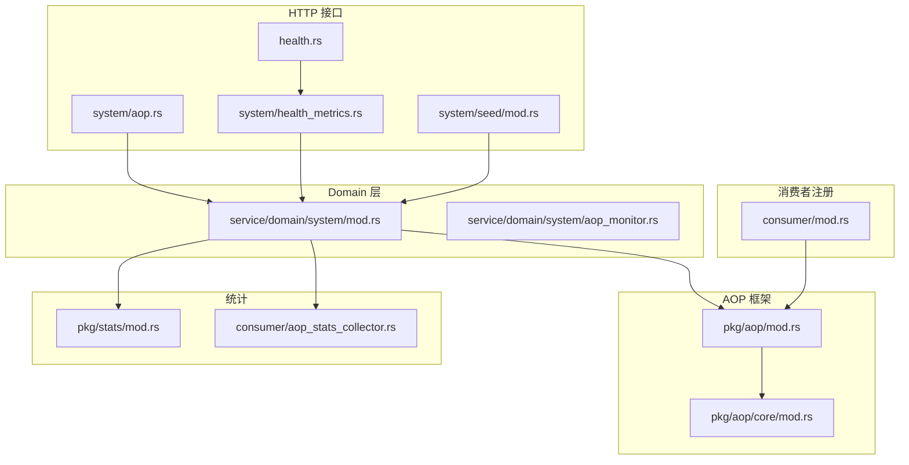
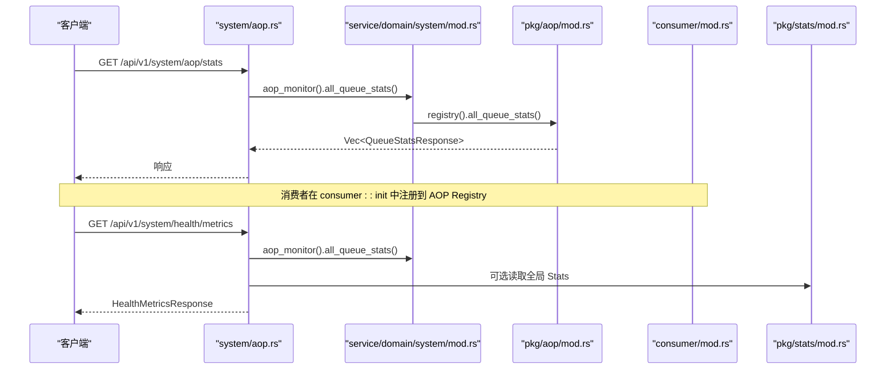
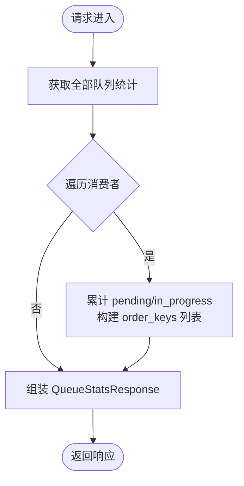
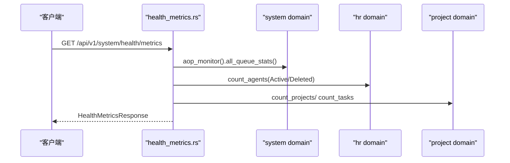
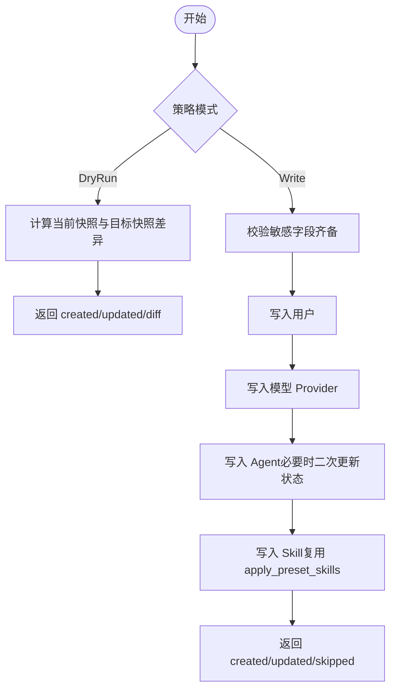
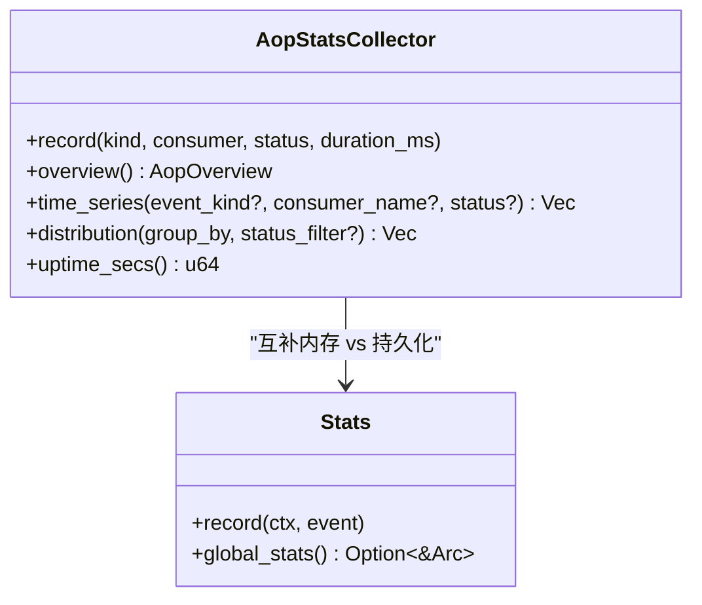
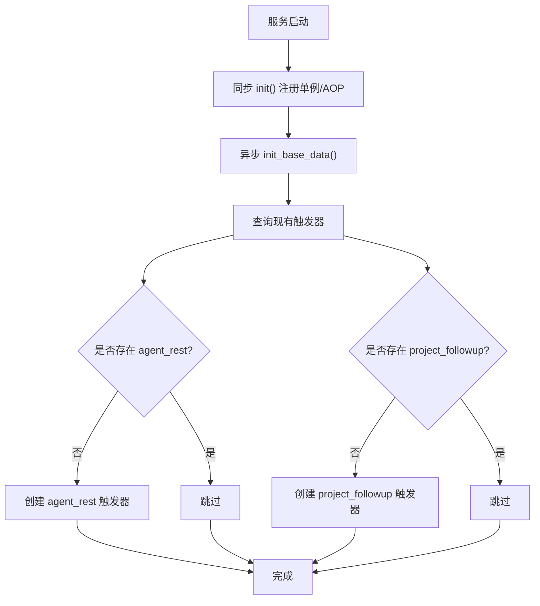
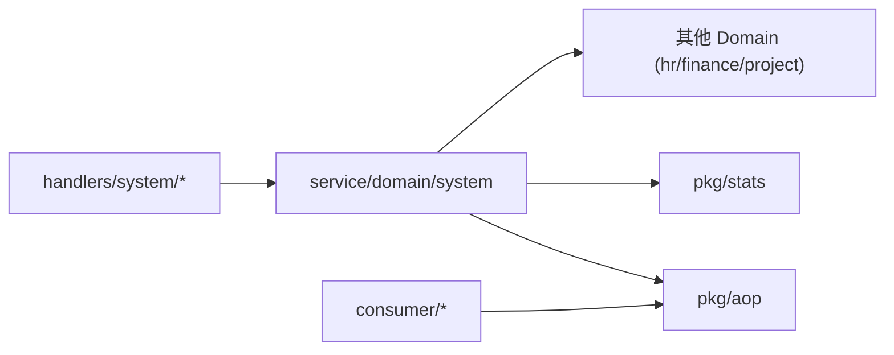

# System 领域编排

<cite>
**本文引用的文件**
- [src/handlers/system/mod.rs](file://src/handlers/system/mod.rs)
- [src/handlers/system/aop.rs](file://src/handlers/system/aop.rs)
- [src/handlers/system/health_metrics.rs](file://src/handlers/system/health_metrics.rs)
- [src/handlers/system/seed/mod.rs](file://src/handlers/system/seed/mod.rs)
- [src/consumer/mod.rs](file://src/consumer/mod.rs)
- [src/pkg/aop/mod.rs](file://src/pkg/aop/mod.rs)
- [src/pkg/aop/core/mod.rs](file://src/pkg/aop/core/mod.rs)
- [src/service/domain/system/mod.rs](file://src/service/domain/system/mod.rs)
- [src/service/domain/system/aop_monitor.rs](file://src/service/domain/system/aop_monitor.rs)
- [src/consumer/aop_stats_collector.rs](file://src/consumer/aop_stats_collector.rs)
- [src/pkg/stats/mod.rs](file://src/pkg/stats/mod.rs)
- [src/handlers/health.rs](file://src/handlers/health.rs)
</cite>

## 目录
1. [简介](#简介)
2. [项目结构](#项目结构)
3. [核心组件](#核心组件)
4. [架构总览](#架构总览)
5. [详细组件分析](#详细组件分析)
6. [依赖关系分析](#依赖关系分析)
7. [性能考量](#性能考量)
8. [故障排查指南](#故障排查指南)
9. [结论](#结论)
10. [附录](#附录)

## 简介
本编排文档聚焦 System 领域的系统级功能编排，围绕 AOP 监控、统计收集与种子数据管理三大核心能力展开。目标包括：
- 系统监控编排：AOP 队列健康、事件明细查询、消费者状态聚合
- 统计数据聚合：内存实时指标（AOP）与持久化统计（DuckDB）协同
- 种子数据加载：跨域快照导出/导入、敏感字段处理、幂等初始化
- 健康检查与默认配置：统一健康指标端点、系统级定时任务初始化
- 稳定性与可观测性：通过 AOP Hook、Stats 记录、日志与时序聚合保障

## 项目结构
System 领域在 HTTP Handler 层暴露接口，委托 Domain 层进行编排，Domain 再调用 DAL/DAO 完成具体业务与持久化。AOP 与 Stats 作为 pkg 通用基础设施被广泛复用。

图示来源
- [src/handlers/system/aop.rs:14-145](file://src/handlers/system/aop.rs#L14-L145)
- [src/handlers/system/health_metrics.rs:28-134](file://src/handlers/system/health_metrics.rs#L28-L134)
- [src/handlers/system/seed/mod.rs:273-671](file://src/handlers/system/seed/mod.rs#L273-L671)
- [src/service/domain/system/mod.rs:20-114](file://src/service/domain/system/mod.rs#L20-L114)
- [src/service/domain/system/aop_monitor.rs:7-27](file://src/service/domain/system/aop_monitor.rs#L7-L27)
- [src/pkg/aop/mod.rs:33-60](file://src/pkg/aop/mod.rs#L33-L60)
- [src/pkg/aop/core/mod.rs:1-14](file://src/pkg/aop/core/mod.rs#L1-L14)
- [src/consumer/mod.rs:16-37](file://src/consumer/mod.rs#L16-L37)
- [src/pkg/stats/mod.rs:152-170](file://src/pkg/stats/mod.rs#L152-L170)
- [src/consumer/aop_stats_collector.rs:43-196](file://src/consumer/aop_stats_collector.rs#L43-L196)

章节来源
- [src/handlers/system/mod.rs:1-13](file://src/handlers/system/mod.rs#L1-L13)
- [src/handlers/system/aop.rs:14-145](file://src/handlers/system/aop.rs#L14-L145)
- [src/handlers/system/health_metrics.rs:28-134](file://src/handlers/system/health_metrics.rs#L28-L134)
- [src/handlers/system/seed/mod.rs:273-671](file://src/handlers/system/seed/mod.rs#L273-L671)
- [src/service/domain/system/mod.rs:20-114](file://src/service/domain/system/mod.rs#L20-L114)
- [src/pkg/aop/mod.rs:33-60](file://src/pkg/aop/mod.rs#L33-L60)
- [src/consumer/mod.rs:16-37](file://src/consumer/mod.rs#L16-L37)
- [src/pkg/stats/mod.rs:152-170](file://src/pkg/stats/mod.rs#L152-L170)
- [src/consumer/aop_stats_collector.rs:43-196](file://src/consumer/aop_stats_collector.rs#L43-L196)

## 核心组件
- AOP 事件中心与调度：提供全局 Registry、发布/消费、队列监控与统计 Hook，纯框架无业务感知
- AOP 监控 API：暴露所有消费者队列统计、事件列表与详情
- 健康指标聚合：统一返回后端在线、AOP 队列积压、Agent/Project/Task 计数与运行时长
- 种子数据管理：跨域快照导出/导入、敏感字段解析、幂等写入与 DryRun 校验
- 统计收集：内存运行时统计（AOP）+ DuckDB 持久化统计（通用 Stats），宏简化埋点
- 系统基础数据：启动时确保系统级 Cron 触发器存在（agent_rest、project_followup）

章节来源
- [src/pkg/aop/mod.rs:33-60](file://src/pkg/aop/mod.rs#L33-L60)
- [src/handlers/system/aop.rs:14-145](file://src/handlers/system/aop.rs#L14-L145)
- [src/handlers/system/health_metrics.rs:28-134](file://src/handlers/system/health_metrics.rs#L28-L134)
- [src/handlers/system/seed/mod.rs:273-671](file://src/handlers/system/seed/mod.rs#L273-L671)
- [src/pkg/stats/mod.rs:1-175](file://src/pkg/stats/mod.rs#L1-L175)
- [src/service/domain/system/mod.rs:34-46](file://src/service/domain/system/mod.rs#L34-L46)

## 架构总览
System 领域采用“Handler → Domain → DAL/DAO”的单向调用，AOP 与 Stats 作为 pkg 基础设施贯穿全链路。

图示来源
- [src/handlers/system/aop.rs:14-41](file://src/handlers/system/aop.rs#L14-L41)
- [src/service/domain/system/aop_monitor.rs:7-27](file://src/service/domain/system/aop_monitor.rs#L7-L27)
- [src/pkg/aop/mod.rs:33-60](file://src/pkg/aop/mod.rs#L33-L60)
- [src/consumer/mod.rs:16-37](file://src/consumer/mod.rs#L16-L37)
- [src/handlers/system/health_metrics.rs:28-134](file://src/handlers/system/health_metrics.rs#L28-L134)
- [src/pkg/stats/mod.rs:152-170](file://src/pkg/stats/mod.rs#L152-L170)

## 详细组件分析

### AOP 监控编排
- 职责：提供队列统计、事件列表与详情查询；对接 AOP Registry 获取各消费者队列状态
- 关键流程：
  - 获取全部队列统计：遍历所有消费者，汇总 pending/in_progress、有序键分布与最老事件年龄
  - 按消费者查询队列统计与事件列表：支持状态过滤、分页限制
  - 事件详情：返回摘要与负载预览
- 错误处理：未找到消费者或事件时返回 404

图示来源
- [src/handlers/system/aop.rs:14-41](file://src/handlers/system/aop.rs#L14-L41)
- [src/service/domain/system/aop_monitor.rs:7-27](file://src/service/domain/system/aop_monitor.rs#L7-L27)

章节来源
- [src/handlers/system/aop.rs:14-145](file://src/handlers/system/aop.rs#L14-L145)
- [src/service/domain/system/aop_monitor.rs:7-27](file://src/service/domain/system/aop_monitor.rs#L7-L27)

### 健康指标聚合编排
- 职责：为前端 HUD 提供单一聚合端点，避免多次并发请求
- 关键维度：
  - backend_online：handler 能响应即 true
  - aop_pending / aop_in_progress：聚合所有消费者队列
  - uptime_secs：首次调用时初始化近似进程运行时长
  - active/total agents/projects/tasks：通过对应 Domain 计数
- 错误处理：计数失败使用默认值 0，保证可用性

图示来源
- [src/handlers/system/health_metrics.rs:28-134](file://src/handlers/system/health_metrics.rs#L28-L134)

章节来源
- [src/handlers/system/health_metrics.rs:28-134](file://src/handlers/system/health_metrics.rs#L28-L134)

### 种子数据管理编排
- 职责：跨域快照导出/导入、敏感字段处理、幂等写入、DryRun 校验
- 导出流程：
  - 组织、用户、模型 Provider、Agent、Skill（含文件内容）依次拉取并转换为 SeedSnapshot
  - 敏感字段以占位符表示，保证导出安全
- 导入流程：
  - DryRun：计算 diff 并返回新增/更新数量
  - 实际写入：校验敏感字段齐备后，按顺序写入用户、Provider、Agent、Skill
  - Agent 创建绕过状态不变量：先以中间态创建，再更新为目标状态
  - Skill 导入复用预设技能逻辑，支持 skip_existing
- 权限控制：仅 SuperAdmin 可执行高危操作

图示来源
- [src/handlers/system/seed/mod.rs:273-671](file://src/handlers/system/seed/mod.rs#L273-L671)

章节来源
- [src/handlers/system/seed/mod.rs:273-671](file://src/handlers/system/seed/mod.rs#L273-L671)

### 统计收集与 AOP 指标
- 内存运行时统计：AopStatsCollector 基于 RuntimeStatsCollector，提供概览、时序、分布查询
- 持久化统计：Stats 模块基于 DuckDB，支持复杂 SQL 查询；宏 record_event! 简化埋点
- 全局访问：当无 RequestContext 场景（如 AOP 消费者）可通过全局 Stats 单例访问
- 指标维度：event_kind、consumer_name、status、时间桶（分钟）

图示来源
- [src/consumer/aop_stats_collector.rs:43-196](file://src/consumer/aop_stats_collector.rs#L43-L196)
- [src/pkg/stats/mod.rs:1-175](file://src/pkg/stats/mod.rs#L1-L175)

章节来源
- [src/consumer/aop_stats_collector.rs:43-196](file://src/consumer/aop_stats_collector.rs#L43-L196)
- [src/pkg/stats/mod.rs:1-175](file://src/pkg/stats/mod.rs#L1-L175)

### 系统基础数据与定时任务
- 两阶段初始化：同步 init 注册单例与 AOP producer/consumer；异步 init_base_data 幂等注入默认基础数据
- 系统级定时任务：确保 agent_rest（每 4h）、project_followup（每 1h）触发器存在，若已存在则跳过
- 幂等性：通过 payload 字符串匹配 action 去重，避免重复创建

图示来源
- [src/service/domain/system/mod.rs:34-46](file://src/service/domain/system/mod.rs#L34-L46)
- [src/service/domain/system/mod.rs:358-415](file://src/service/domain/system/mod.rs#L358-L415)

章节来源
- [src/service/domain/system/mod.rs:34-46](file://src/service/domain/system/mod.rs#L34-L46)
- [src/service/domain/system/mod.rs:358-415](file://src/service/domain/system/mod.rs#L358-L415)

## 依赖关系分析
- Handler 层仅负责参数校验与结果映射，不直接访问 DAO/DAL
- Domain 层组合多个子域（system/hr/finance/project）完成编排
- AOP 与 Stats 作为 pkg 基础设施，被 Domain 与 Handler 共同依赖
- 消费者在 consumer::init 中集中注册，避免分散耦合

图示来源
- [src/handlers/system/aop.rs:14-145](file://src/handlers/system/aop.rs#L14-L145)
- [src/service/domain/system/mod.rs:20-114](file://src/service/domain/system/mod.rs#L20-L114)
- [src/consumer/mod.rs:16-37](file://src/consumer/mod.rs#L16-L37)

章节来源
- [src/handlers/system/aop.rs:14-145](file://src/handlers/system/aop.rs#L14-L145)
- [src/service/domain/system/mod.rs:20-114](file://src/service/domain/system/mod.rs#L20-L114)
- [src/consumer/mod.rs:16-37](file://src/consumer/mod.rs#L16-L37)

## 性能考量
- AOP 队列监控：all_queue_stats 为 O(N) 遍历消费者，N 为注册消费者数，通常较小
- 健康指标聚合：多域计数并行度有限，但单次请求开销可控；失败回退为 0 保证可用性
- 种子数据导入：按实体顺序写入，Skill 文件内容优先从内存/内嵌读取，URL 抓取限流与大小限制
- 统计采集：内存运行时统计低开销；持久化统计适合离线分析与复杂查询

[本节为通用指导，无需特定文件引用]

## 故障排查指南
- AOP 队列堆积：通过 system/aop/stats 查看 pending/in_progress 与 oldest_event_age_secs，定位慢消费者
- 事件失败：通过 system/aop/{consumer}/events/{event_id} 查看事件详情与负载预览
- 健康指标异常：检查各域计数是否成功，关注 AOP 积压对整体健康的影响
- 种子导入失败：确认敏感字段是否齐备；DryRun 模式下先验证 diff；Agent 状态需经中间态更新
- 系统定时任务缺失：检查 ensure_system_cron_triggers 是否执行成功，确认 payload 去重逻辑

章节来源
- [src/handlers/system/aop.rs:43-145](file://src/handlers/system/aop.rs#L43-L145)
- [src/handlers/system/health_metrics.rs:28-134](file://src/handlers/system/health_metrics.rs#L28-L134)
- [src/handlers/system/seed/mod.rs:420-671](file://src/handlers/system/seed/mod.rs#L420-L671)
- [src/service/domain/system/mod.rs:358-415](file://src/service/domain/system/mod.rs#L358-L415)

## 结论
System 领域通过清晰的 Handler→Domain→DAL/DAO 分层与 AOP/Stats 基础设施，实现了高内聚、低耦合的系统级编排。AOP 监控与健康指标聚合提供了强大的可观测性；种子数据管理保障了跨环境一致性与可迁移性；系统基础数据的幂等初始化确保了稳定启动。结合内存与持久化统计，系统在性能与可观测性之间取得平衡。

[本节为总结，无需特定文件引用]

## 附录
- 健康检查端点：/api/v1/health 返回版本与状态
- 健康指标聚合端点：/api/v1/system/health/metrics 提供综合指标
- AOP 监控端点：/api/v1/system/aop/stats 及消费者级事件查询
- 种子数据端点：导出/导入/差异对比/默认模板获取

章节来源
- [src/handlers/health.rs:1-16](file://src/handlers/health.rs#L1-L16)
- [src/handlers/system/health_metrics.rs:28-134](file://src/handlers/system/health_metrics.rs#L28-L134)
- [src/handlers/system/aop.rs:14-145](file://src/handlers/system/aop.rs#L14-L145)
- [src/handlers/system/seed/mod.rs:273-671](file://src/handlers/system/seed/mod.rs#L273-L671)