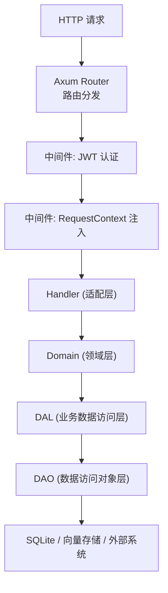
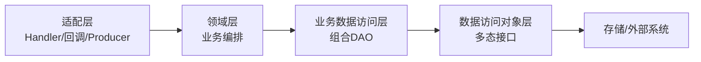
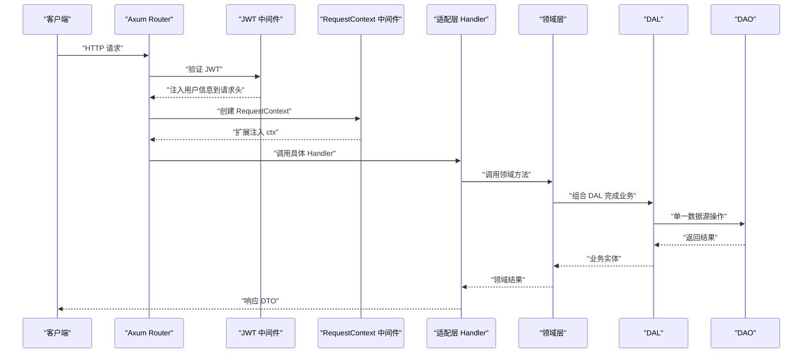
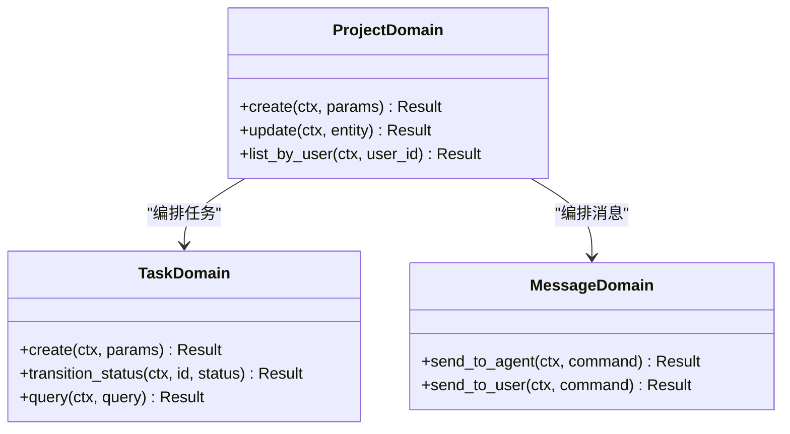
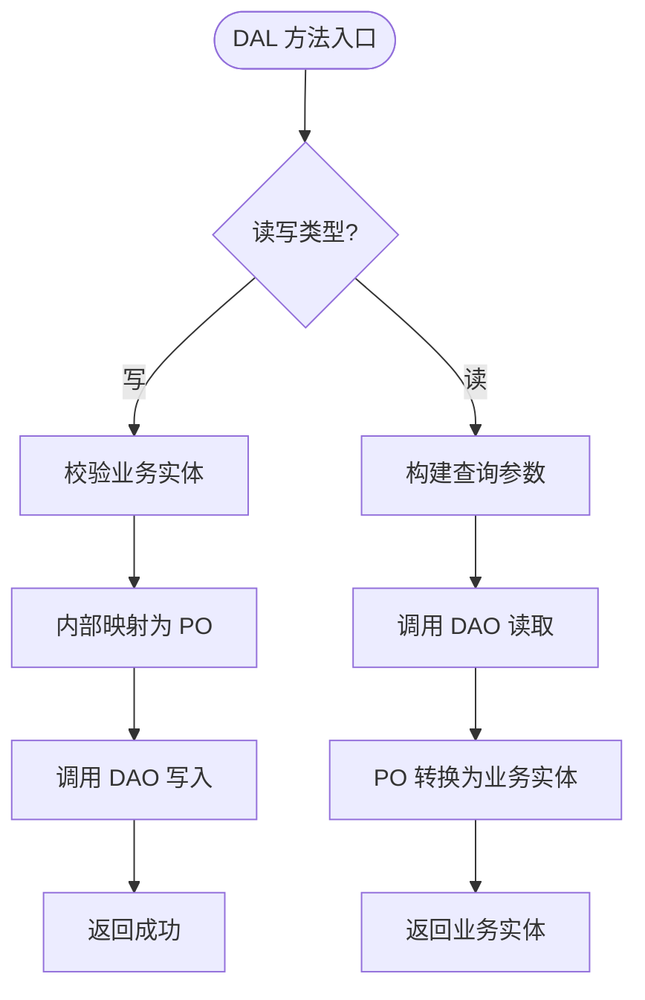
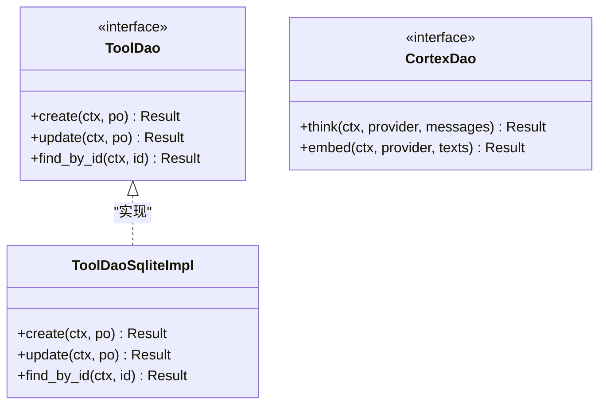
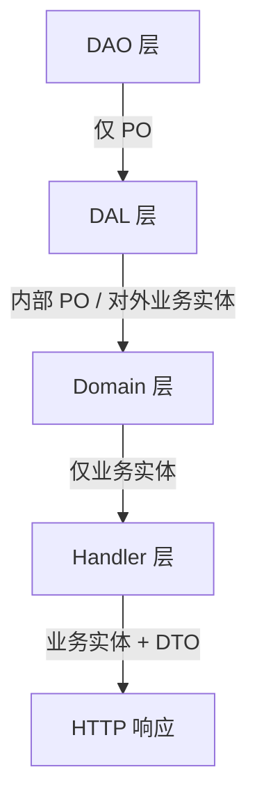
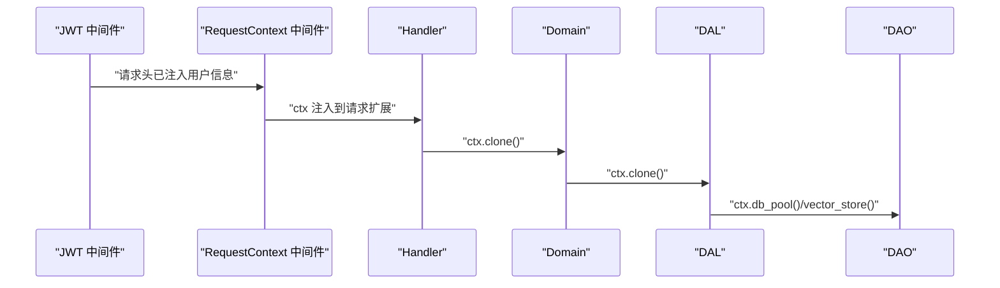
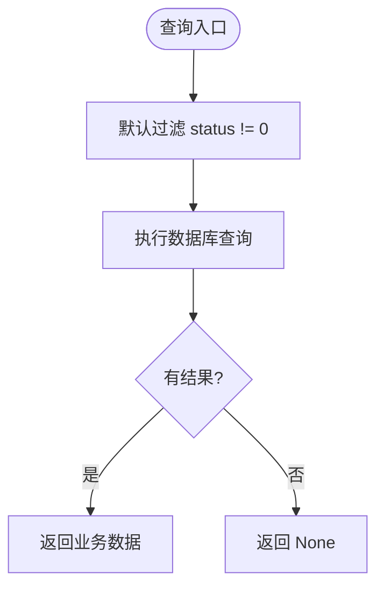
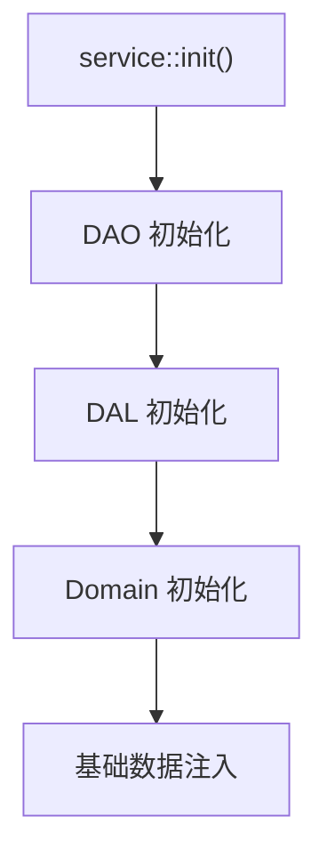

# 分层架构设计

<cite>
**本文引用的文件**
- [src/main.rs](file://src/main.rs)
- [src/lib.rs](file://src/lib.rs)
- [src/router.rs](file://src/router.rs)
- [src/middleware/request_context.rs](file://src/middleware/request_context.rs)
- [src/pkg/request_context.rs](file://src/pkg/request_context.rs)
- [src/service/mod.rs](file://src/service/mod.rs)
- [src/service/dal/mod.rs](file://src/service/dal/mod.rs)
- [src/service/dao/mod.rs](file://src/service/dao/mod.rs)
- [docs/ARCHITECTURE.md](file://docs/ARCHITECTURE.md)
- [docs/project_management_design.md](file://docs/project_management_design.md)
- [docs/external_agent_design.md](file://docs/external_agent_design.md)
</cite>

## 目录
1. [引言](#引言)
2. [项目结构](#项目结构)
3. [核心组件](#核心组件)
4. [架构总览](#架构总览)
5. [详细组件分析](#详细组件分析)
6. [依赖关系分析](#依赖关系分析)
7. [性能考量](#性能考量)
8. [故障排查指南](#故障排查指南)
9. [结论](#结论)
10. [附录](#附录)

## 引言
本文件面向 AI Orz 系统的四层严格单向依赖分层架构：Adapter（适配层）→ Domain（领域层）→ DAL（业务数据访问层）→ DAO（数据访问对象层）。文档将阐明每层的职责边界、交互规范与关键实现细节，包括 Handler 与用户 Action 的对应关系、Domain 的业务编排能力、DAL 的组合逻辑、DAO 的多态接口设计；并说明 PO 与业务实体的分层规范、RequestContext 跨层传递机制、软删除设计范式等。同时提供分层架构图与依赖关系图，帮助团队避免反模式并保持代码可维护性。

## 项目结构
后端服务采用清晰的分层组织：
- 入口与路由：main.rs → lib.rs → router.rs
- 中间件：JWT 认证与 RequestContext 注入
- Service 层：DAO → DAL → Domain，按模块划分
- 公共包：pkg（存储、日志、统计、AOP 等）
- 前端：Dioxus 应用，通过 common API 与后端交互

图表来源
- [src/router.rs:12-59](file://src/router.rs#L12-L59)
- [src/middleware/request_context.rs:20-40](file://src/middleware/request_context.rs#L20-L40)
- [src/service/dao/mod.rs:29-55](file://src/service/dao/mod.rs#L29-L55)

章节来源
- [src/main.rs:1-5](file://src/main.rs#L1-L5)
- [src/lib.rs:114-175](file://src/lib.rs#L114-L175)
- [src/router.rs:12-59](file://src/router.rs#L12-L59)
- [src/service/mod.rs:6-23](file://src/service/mod.rs#L6-L23)

## 核心组件
- 适配器层（Adapter）：包含 HTTP Handler、公开回调端点、AOP Producer，负责协议转换与 DTO 映射，直接调用 Domain 完成业务处理。
- 领域层（Domain）：聚合根与业务规则编排，组合多个 DAL 完成复杂业务流程，不感知持久化细节。
- 业务数据访问层（DAL）：组合多个 DAO，封装业务级数据操作，对外暴露业务实体接口。
- 数据访问对象层（DAO）：单一数据源 CRUD 与多态接口定义，屏蔽存储差异。
- 上下文（RequestContext）：贯穿请求生命周期的不可变上下文，携带用户、组织、业务维度信息与统一存储门面。

章节来源
- [docs/ARCHITECTURE.md:325-363](file://docs/ARCHITECTURE.md#L325-L363)
- [docs/ARCHITECTURE.md:398-486](file://docs/ARCHITECTURE.md#L398-L486)
- [src/pkg/request_context.rs:10-61](file://src/pkg/request_context.rs#L10-L61)

## 架构总览
四层严格单向依赖：Adapter → Domain → DAL → DAO。依赖方向自上而下，禁止反向依赖与跨层调用。

图表来源
- [docs/ARCHITECTURE.md:372-385](file://docs/ARCHITECTURE.md#L372-L385)
- [src/service/mod.rs:6-23](file://src/service/mod.rs#L6-L23)

章节来源
- [docs/ARCHITECTURE.md:325-363](file://docs/ARCHITECTURE.md#L325-L363)
- [src/service/mod.rs:6-23](file://src/service/mod.rs#L6-L23)

## 详细组件分析

### 适配器层（Handler/回调/Producer）
- 职责边界：每个 HTTP 接口对应一个用户 Action；公开回调端点与 AOP Producer 同属适配层，负责外部协议到内部操作的转换后直接调用 Domain。
- 交互规范：仅调用 Domain 方法，不直接访问 DAL/DAO；DTO ↔ Command/Query 转换在适配层完成。
- 路由与中间件：Axum Router 注册路由，先执行 JWT 认证再注入 RequestContext，确保受保护路由能获取用户身份。

图表来源
- [src/router.rs:12-59](file://src/router.rs#L12-L59)
- [src/middleware/request_context.rs:20-40](file://src/middleware/request_context.rs#L20-L40)
- [docs/external_agent_design.md:137-188](file://docs/external_agent_design.md#L137-L188)

章节来源
- [src/router.rs:12-59](file://src/router.rs#L12-L59)
- [docs/external_agent_design.md:137-188](file://docs/external_agent_design.md#L137-L188)

### 领域层（Domain）
- 职责边界：核心业务规则与流程编排，组合多个 DAL 完成业务目标；不感知 PO 与存储细节。
- 编排能力：以聚合根为中心，协调 Agent、Project、Task、Message 等领域子域，保证状态一致性与事务语义。
- 接口风格：所有异步方法统一携带 RequestContext，便于追踪与扩展。

图表来源
- [docs/ARCHITECTURE.md:325-363](file://docs/ARCHITECTURE.md#L325-L363)
- [docs/project_management_design.md:138-175](file://docs/project_management_design.md#L138-L175)

章节来源
- [docs/ARCHITECTURE.md:325-363](file://docs/ARCHITECTURE.md#L325-L363)
- [docs/project_management_design.md:138-175](file://docs/project_management_design.md#L138-L175)

### 业务数据访问层（DAL）
- 职责边界：组合多个 DAO 完成业务级数据操作；对外暴露业务实体接口，内部使用 PO。
- 组合逻辑：基础 DAL 实现通用逻辑，特殊需求通过继承或委托扩展（如 Codex/A2aAgentDal）。
- 接口风格：写操作接收实体引用，读操作接收 ID/参数，避免 N+1 查询与重复 IO。

图表来源
- [docs/project_management_design.md:138-175](file://docs/project_management_design.md#L138-L175)
- [src/service/dal/mod.rs:54-76](file://src/service/dal/mod.rs#L54-L76)

章节来源
- [docs/project_management_design.md:138-175](file://docs/project_management_design.md#L138-L175)
- [src/service/dal/mod.rs:54-76](file://src/service/dal/mod.rs#L54-L76)

### 数据访问对象层（DAO）
- 职责边界：单一数据源 CRUD 与多态接口定义；不同存储有不同实现，上层面向接口编程。
- 多态设计：例如 ToolDao 定义接口，ToolDaoSqliteImpl 提供 SQLite 实现；CortexDao 抽象模型调用，支持多种提供商。
- 初始化：各 DAO 模块在启动时集中初始化，确保单例与资源就绪。

图表来源
- [docs/ARCHITECTURE.md:341-352](file://docs/ARCHITECTURE.md#L341-L352)
- [src/service/dao/mod.rs:29-55](file://src/service/dao/mod.rs#L29-L55)

章节来源
- [docs/ARCHITECTURE.md:341-352](file://docs/ARCHITECTURE.md#L341-L352)
- [src/service/dao/mod.rs:29-55](file://src/service/dao/mod.rs#L29-L55)

### PO 与业务实体的分层规范
- 核心原则：PO 仅在 DAO/DAL 内部使用，绝对不对外暴露到 Domain 及以上。
- 业务实体内部持有 PO 字段，DAL 层通过 &xxx.po 传递给 DAO，零转换成本且高性能。
- Domain 层仅使用业务实体，完全无 PO 依赖；Handler 层使用业务实体 + DTO。

图表来源
- [docs/ARCHITECTURE.md:398-433](file://docs/ARCHITECTURE.md#L398-L433)
- [docs/project_management_design.md:165-199](file://docs/project_management_design.md#L165-L199)

章节来源
- [docs/ARCHITECTURE.md:398-433](file://docs/ARCHITECTURE.md#L398-L433)
- [docs/project_management_design.md:165-199](file://docs/project_management_design.md#L165-L199)

### RequestContext 跨层传递机制
- 中间件顺序：JWT 认证在外层先执行，RequestContext 注入在内层后执行，确保受保护路由能获取用户身份。
- 构造方式：从请求头提取用户、组织、角色等信息，生成不可变的 RequestContext，并通过 Extension 注入。
- 传递规范：所有异步方法携带 RequestContext，跨层传递统一使用 ctx.clone()，避免所有权移动问题。

图表来源
- [src/router.rs:96-136](file://src/router.rs#L96-L136)
- [src/middleware/request_context.rs:20-40](file://src/middleware/request_context.rs#L20-L40)
- [src/pkg/request_context.rs:295-356](file://src/pkg/request_context.rs#L295-L356)

章节来源
- [src/router.rs:96-136](file://src/router.rs#L96-L136)
- [src/middleware/request_context.rs:20-40](file://src/middleware/request_context.rs#L20-L40)
- [src/pkg/request_context.rs:295-356](file://src/pkg/request_context.rs#L295-L356)

### 软删除设计范式
- 约定：status = 0 视为软删除，常规查询默认过滤已删除记录。
- 典型场景：TaskStatus::Cancelled = 0，取消的任务在业务上视为“已删除”，不应出现在常规查询中。
- 历史追溯：需要查询历史或恢复时，使用 query 方法绕过过滤。

图表来源
- [docs/ARCHITECTURE.md:466-486](file://docs/ARCHITECTURE.md#L466-L486)
- [docs/project_management_design.md:501-513](file://docs/project_management_design.md#L501-L513)

章节来源
- [docs/ARCHITECTURE.md:466-486](file://docs/ARCHITECTURE.md#L466-L486)
- [docs/project_management_design.md:501-513](file://docs/project_management_design.md#L501-L513)

## 依赖关系分析
- 依赖方向：Adapter → Domain → DAL → DAO，严格单向，无反向依赖。
- 初始化顺序：service::init() 依次初始化 DAO → DAL → Domain，确保依赖就绪。
- 外部集成：DAO 层通过多态接口屏蔽存储差异，DAL 层组合多个 DAO 完成业务逻辑。

图表来源
- [src/service/mod.rs:6-23](file://src/service/mod.rs#L6-L23)

章节来源
- [src/service/mod.rs:6-23](file://src/service/mod.rs#L6-L23)

## 性能考量
- 写操作接收实体引用，避免重复查询与 clone 开销。
- DAL 层组合多个 DAO 时，尽量复用已查询到的实体，减少 N+1 查询。
- RequestContext 内部为 Arc 引用，clone 成本极低，适合跨层传递。
- 软删除默认过滤减少无效数据扫描，提升查询性能。

[本节为通用指导，无需特定文件分析]

## 故障排查指南
- 中间件顺序错误：若 RequestContext 无法读取用户信息，检查 JWT 中间件是否在 RequestContext 之前执行。
- 依赖未初始化：若 Domain 调用 DAL/DAO 失败，检查 service::init() 是否按顺序初始化。
- 软删除误判：若查询不到预期数据，确认是否被 status = 0 过滤，必要时使用 query 方法绕过。

章节来源
- [src/router.rs:96-136](file://src/router.rs#L96-L136)
- [src/service/mod.rs:6-23](file://src/service/mod.rs#L6-L23)
- [docs/ARCHITECTURE.md:466-486](file://docs/ARCHITECTURE.md#L466-L486)

## 结论
AI Orz 系统通过严格的四层单向依赖架构，实现了清晰的职责边界与高内聚低耦合的设计。Adapter 层专注协议转换，Domain 层聚焦业务编排，DAL 层组合 DAO 完成业务逻辑，DAO 层通过多态接口屏蔽存储差异。配合 RequestContext 跨层传递与软删除范式，系统在可维护性、可扩展性与性能方面均达到较高标准。遵循本设计原则可有效避免反模式，保持代码长期健康演进。

[本节为总结性内容，无需特定文件分析]

## 附录
- 最佳实践：严格分层不跨级调用，所有 service 层方法必须传递 RequestContext，原始细节不占内存。
- 测试规范：每个 DAO/DAL/Domain 模块对应单元测试，独立临时 SQLite 环境，互不干扰。

章节来源
- [docs/ARCHITECTURE.md:356-363](file://docs/ARCHITECTURE.md#L356-L363)
- [docs/ARCHITECTURE.md:562-568](file://docs/ARCHITECTURE.md#L562-L568)