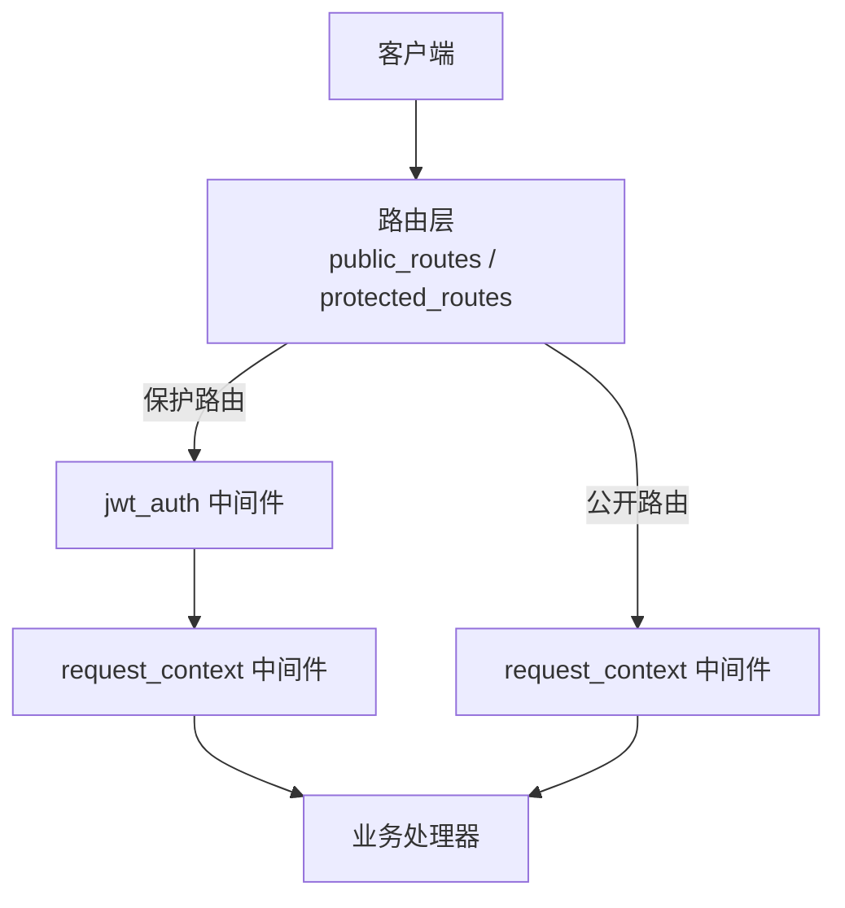
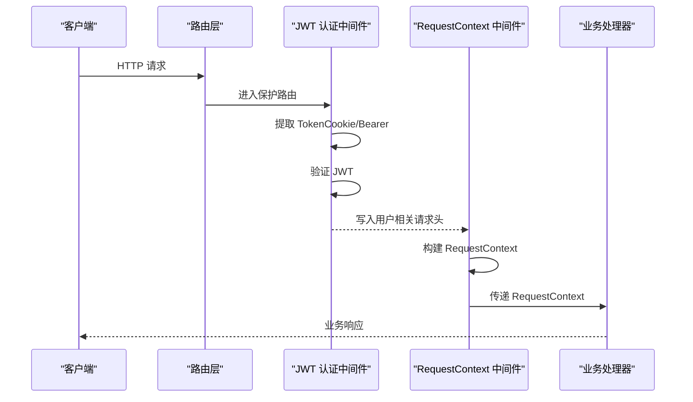
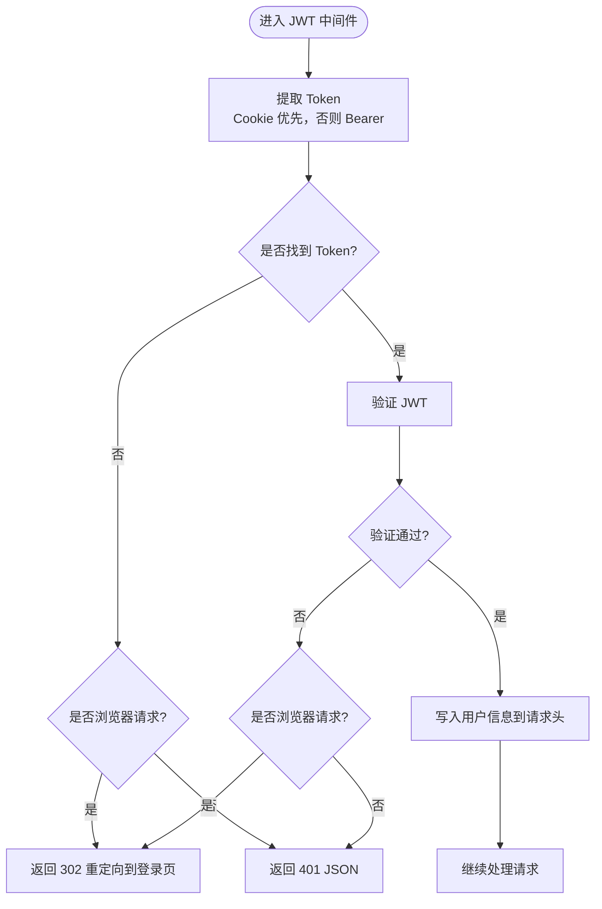
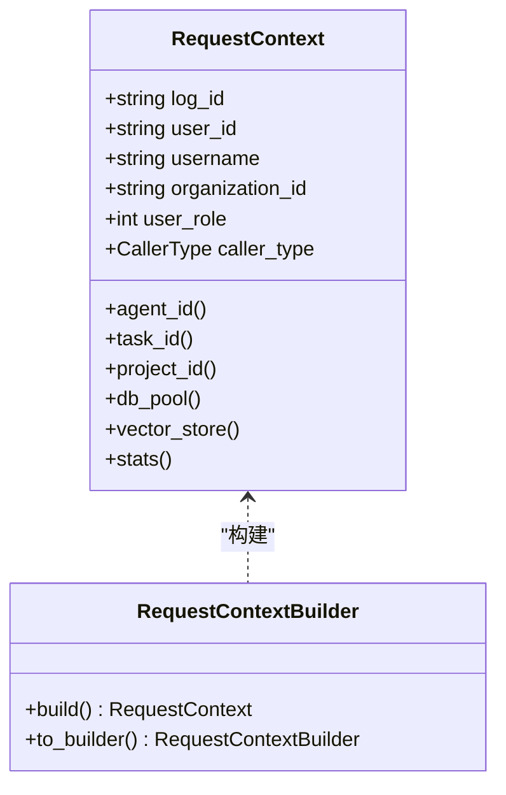
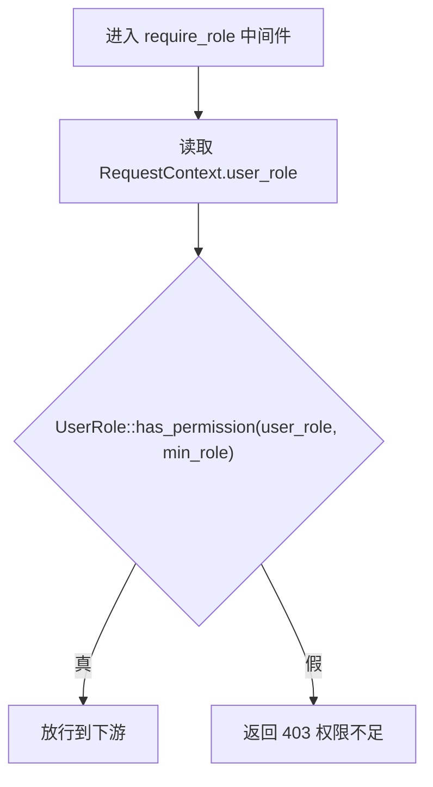
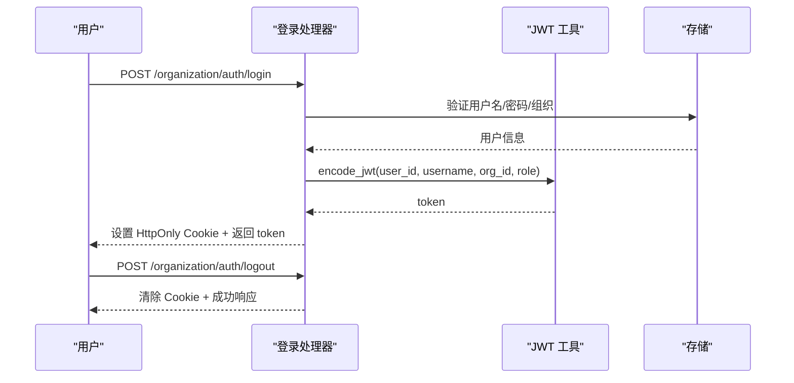
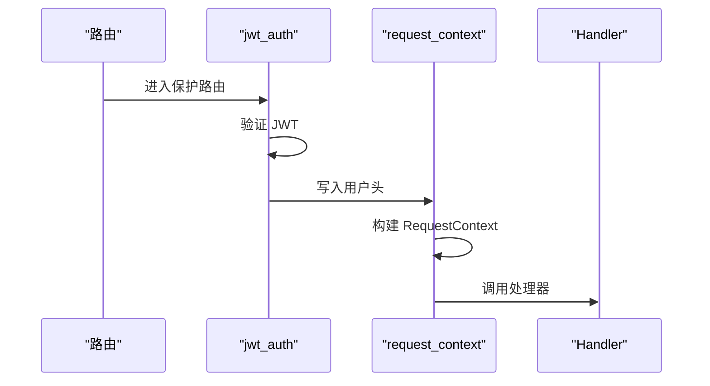
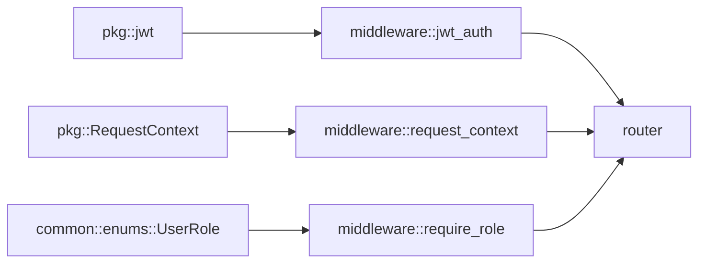

# 安全架构设计

<cite>
**本文引用的文件**
- [src/middleware/jwt_auth.rs](file://src/middleware/jwt_auth.rs)
- [src/middleware/request_context.rs](file://src/middleware/request_context.rs)
- [src/middleware/require_role.rs](file://src/middleware/require_role.rs)
- [src/pkg/jwt.rs](file://src/pkg/jwt.rs)
- [src/pkg/request_context.rs](file://src/pkg/request_context.rs)
- [src/router.rs](file://src/router.rs)
- [common/src/api/auth.rs](file://common/src/api/auth.rs)
- [src/handlers/organization/auth/login.rs](file://src/handlers/organization/auth/login.rs)
- [src/handlers/organization/auth/logout.rs](file://src/handlers/organization/auth/logout.rs)
- [common/src/enums/user.rs](file://common/src/enums/user.rs)
</cite>

## 目录
1. [简介](#简介)
2. [项目结构与安全边界](#项目结构与安全边界)
3. [核心组件](#核心组件)
4. [架构总览](#架构总览)
5. [详细组件分析](#详细组件分析)
6. [依赖关系分析](#依赖关系分析)
7. [性能与安全性考量](#性能与安全性考量)
8. [故障排查指南](#故障排查指南)
9. [结论](#结论)
10. [附录：配置与扩展指南](#附录：配置与扩展指南)

## 简介
本设计文档阐述 AI Orz 系统的安全架构，重点包括：
- 基于 JWT + HttpOnly Cookie 的认证方案（浏览器与 API 双模式）
- 中间件洋葱模型的执行顺序（JWT 认证外层先执行，RequestContext 注入内层后执行）
- 组织用户权限体系（SuperAdmin → Admin → Member）及权限校验中间件
- RequestContext 自动注入当前登录用户信息与组织 ID 的机制
- 保护路由与公共路由的区别，以及 RequestContext 在请求处理链中的作用
- 提供认证流程图、权限控制图、中间件执行顺序图，并给出安全配置与扩展建议

## 项目结构与安全边界
- 公开路由（无需 JWT）：初始化、登录/登出、组织列表查询、A2A 公开发现端点等
- 保护路由（需要有效 JWT）：HR、Finance、System、Organization、Project、Task、User 等
- 中间件分层：
  - 外层：jwt_auth_middleware 负责提取并验证 JWT，将用户信息写入请求头
  - 内层：request_context_middleware 从请求头构建 RequestContext 并注入到请求扩展
  - 可选：require_role_middleware 进行角色权限校验

图表来源
- [src/router.rs:12-59](file://src/router.rs#L12-L59)
- [src/router.rs:61-136](file://src/router.rs#L61-L136)

章节来源
- [src/router.rs:12-136](file://src/router.rs#L12-L136)

## 核心组件
- JWT 工具模块：负责 Claims 定义、签发与解码、全局配置管理
- JWT 认证中间件：双模式认证（Cookie 优先，Bearer 回退），失败时按浏览器/API 返回不同响应
- RequestContext 中间件：从请求头构建 RequestContext，注入 LogId、用户信息、调用方类型等
- 角色权限中间件：基于 UserRole 的继承关系进行最小权限校验
- 路由装配：区分 public/protected，统一注入 RequestContext，按需附加 require_role

章节来源
- [src/pkg/jwt.rs:11-136](file://src/pkg/jwt.rs#L11-L136)
- [src/middleware/jwt_auth.rs:25-87](file://src/middleware/jwt_auth.rs#L25-L87)
- [src/middleware/request_context.rs:16-40](file://src/middleware/request_context.rs#L16-L40)
- [src/middleware/require_role.rs:16-38](file://src/middleware/require_role.rs#L16-L38)
- [src/router.rs:61-136](file://src/router.rs#L61-L136)

## 架构总览
整体请求处理流程（以保护路由为例）：
1. 客户端发起请求（携带 Cookie 或 Authorization: Bearer）
2. jwt_auth_middleware 提取并验证 JWT，将 user_id、username、organization_id、user_role、caller_type 写入请求头
3. request_context_middleware 从请求头构建 RequestContext，注入到请求扩展
4. 可选 require_role_middleware 校验角色权限
5. 进入具体 Handler 执行业务逻辑

图表来源
- [src/middleware/jwt_auth.rs:36-87](file://src/middleware/jwt_auth.rs#L36-L87)
- [src/middleware/request_context.rs:20-40](file://src/middleware/request_context.rs#L20-L40)
- [src/router.rs:96-136](file://src/router.rs#L96-L136)

## 详细组件分析

### JWT 认证中间件（双模式）
- 认证顺序：优先从 Cookie 提取 token；若无则从 Authorization: Bearer 提取
- 验证失败：
  - 浏览器请求：302 重定向到登录页
  - API 请求：返回 401 JSON
- 通过后将用户信息写入请求头，供后续 RequestContext 使用

图表来源
- [src/middleware/jwt_auth.rs:36-87](file://src/middleware/jwt_auth.rs#L36-L87)
- [src/middleware/jwt_auth.rs:89-156](file://src/middleware/jwt_auth.rs#L89-L156)

章节来源
- [src/middleware/jwt_auth.rs:25-156](file://src/middleware/jwt_auth.rs#L25-L156)

### RequestContext 自动注入机制
- 从请求头提取：log_id、user_id、username、organization_id、user_role、caller_type
- 生成 log_id：若未提供则自动生成
- 注入到请求扩展：Handler 可通过 Extension<RequestContext> 获取
- 支持 System 调用方场景：new_system() 创建无操作者 ID 的上下文

图表来源
- [src/pkg/request_context.rs:22-61](file://src/pkg/request_context.rs#L22-L61)
- [src/pkg/request_context.rs:271-356](file://src/pkg/request_context.rs#L271-L356)

章节来源
- [src/middleware/request_context.rs:16-40](file://src/middleware/request_context.rs#L16-L40)
- [src/pkg/request_context.rs:295-356](file://src/pkg/request_context.rs#L295-L356)

### 角色权限体系与校验
- 角色层级：SuperAdmin → Admin → Member（上级拥有下级所有权限）
- 校验逻辑：从 min_role 向上遍历祖先链，若路径包含 user_role 则通过
- 中间件：require_role_middleware 根据最小角色要求拦截请求

图表来源
- [src/middleware/require_role.rs:20-38](file://src/middleware/require_role.rs#L20-L38)
- [common/src/enums/user.rs:54-99](file://common/src/enums/user.rs#L54-L99)

章节来源
- [common/src/enums/user.rs:8-99](file://common/src/enums/user.rs#L8-L99)
- [src/middleware/require_role.rs:16-38](file://src/middleware/require_role.rs#L16-L38)

### 认证流程（登录/登出）
- 登录：验证用户名密码 → 签发 JWT → 设置 HttpOnly Cookie → 返回 token（用于 API 调用）
- 登出：清除 Cookie（max_age=0）→ 返回成功

图表来源
- [src/handlers/organization/auth/login.rs:20-68](file://src/handlers/organization/auth/login.rs#L20-L68)
- [src/handlers/organization/auth/logout.rs:17-39](file://src/handlers/organization/auth/logout.rs#L17-L39)
- [src/pkg/jwt.rs:70-100](file://src/pkg/jwt.rs#L70-L100)

章节来源
- [src/handlers/organization/auth/login.rs:18-68](file://src/handlers/organization/auth/login.rs#L18-L68)
- [src/handlers/organization/auth/logout.rs:15-39](file://src/handlers/organization/auth/logout.rs#L15-L39)
- [common/src/api/auth.rs:5-38](file://common/src/api/auth.rs#L5-L38)

### 中间件执行顺序（洋葱模型）
- 保护路由：jwt_auth（外层，先执行）→ request_context（内层，后执行）
- 公开路由：仅 request_context（用于 log_id 等上下文）
- 特殊路由：如 A2A JSON-RPC/SSE 单独组合中间件

图表来源
- [src/router.rs:96-136](file://src/router.rs#L96-L136)
- [src/middleware/jwt_auth.rs:36-87](file://src/middleware/jwt_auth.rs#L36-L87)
- [src/middleware/request_context.rs:20-40](file://src/middleware/request_context.rs#L20-L40)

章节来源
- [src/router.rs:12-59](file://src/router.rs#L12-L59)
- [src/router.rs:96-136](file://src/router.rs#L96-L136)

## 依赖关系分析
- 中间件依赖：
  - jwt_auth_middleware 依赖 pkg::jwt（签名/验签）
  - request_context_middleware 依赖 pkg::RequestContext（构建上下文）
  - require_role_middleware 依赖 common::enums::UserRole（权限判断）
- 路由依赖：
  - public_routes 仅注入 RequestContext
  - protected_routes 注入 RequestContext + jwt_auth，并按需添加 require_role
- 处理器依赖：
  - 登录/登出处理器依赖 JWT 工具与 Cookie 库
  - 业务处理器通过 Extension<RequestContext> 获取上下文

图表来源
- [src/middleware/jwt_auth.rs:8-17](file://src/middleware/jwt_auth.rs#L8-L17)
- [src/middleware/request_context.rs:6-14](file://src/middleware/request_context.rs#L6-L14)
- [src/middleware/require_role.rs:6-14](file://src/middleware/require_role.rs#L6-L14)
- [src/router.rs:1-9](file://src/router.rs#L1-L9)

章节来源
- [src/middleware/jwt_auth.rs:8-17](file://src/middleware/jwt_auth.rs#L8-L17)
- [src/middleware/request_context.rs:6-14](file://src/middleware/request_context.rs#L6-L14)
- [src/middleware/require_role.rs:6-14](file://src/middleware/require_role.rs#L6-L14)
- [src/router.rs:1-9](file://src/router.rs#L1-L9)

## 性能与安全性考量
- 性能
  - JWT 验签为轻量级操作，适合放在外层中间件
  - RequestContext 构建仅解析请求头，开销极小
  - 角色校验为 O(n) 祖先链遍历，n≤3，可忽略
- 安全性
  - Cookie 设置为 HttpOnly，防止 XSS 窃取
  - 双模式认证兼顾浏览器与 API 场景
  - 角色权限采用最小权限原则，逐级继承
  - 敏感操作（如备份恢复）在 handler 内部二次校验 SuperAdmin

[本节为通用指导，不直接分析具体文件]

## 故障排查指南
- 401 未认证
  - 检查 Cookie 是否携带 ai_orz_jwt
  - 检查 Authorization: Bearer 是否正确
  - 查看 JWT 是否过期或签名无效
- 403 权限不足
  - 确认用户角色是否满足最小角色要求
  - 检查 RequestContext.user_role 是否正确注入
- 登录失败
  - 验证用户名/密码/组织 ID 是否正确
  - 检查 JWT 签发是否成功
- 日志追踪
  - 确认 LogId 是否在请求头中传递
  - 检查 RequestContext 是否正确构建

章节来源
- [src/middleware/jwt_auth.rs:139-156](file://src/middleware/jwt_auth.rs#L139-L156)
- [src/middleware/require_role.rs:20-38](file://src/middleware/require_role.rs#L20-L38)
- [src/middleware/request_context.rs:20-40](file://src/middleware/request_context.rs#L20-L40)

## 结论
AI Orz 系统采用 JWT + HttpOnly Cookie 的双模式认证，结合 RequestContext 自动注入与基于角色的权限控制，形成清晰、可扩展的安全架构。中间件洋葱模型确保认证在前、上下文注入在后，既保障安全又便于业务开发。通过合理的路由划分与权限校验，系统能够有效保护敏感资源，同时保持对公开接口的友好访问。

[本节为总结性内容，不直接分析具体文件]

## 附录：配置与扩展指南
- 安全配置
  - JWT 密钥应强随机且定期轮换
  - Cookie 的 secure 标志应根据部署环境（HTTPS）启用
  - 默认过期时间可根据业务需求调整
- 扩展点
  - 新增角色：在 UserRole 中扩展，并更新 has_permission 逻辑
  - 新增中间件：遵循洋葱模型，注意执行顺序
  - 新增保护路由：在 protected_routes 中添加，并按需附加 require_role
- 最佳实践
  - 所有敏感操作应在 handler 内进行二次校验
  - 使用 RequestContext 传递上下文，避免全局状态
  - 记录关键操作的 LogId，便于审计与追踪

章节来源
- [src/pkg/jwt.rs:52-100](file://src/pkg/jwt.rs#L52-L100)
- [common/src/enums/user.rs:8-99](file://common/src/enums/user.rs#L8-L99)
- [src/router.rs:96-136](file://src/router.rs#L96-L136)