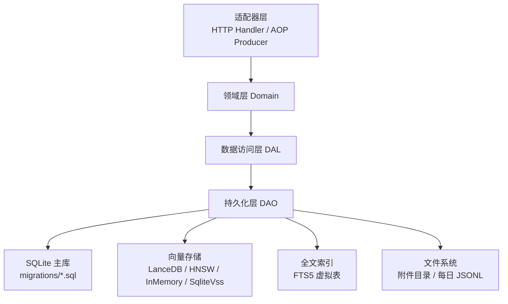
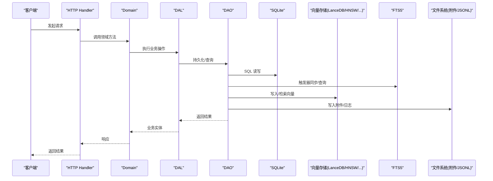
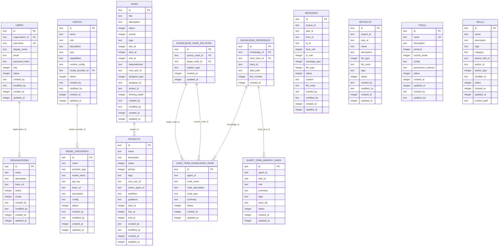
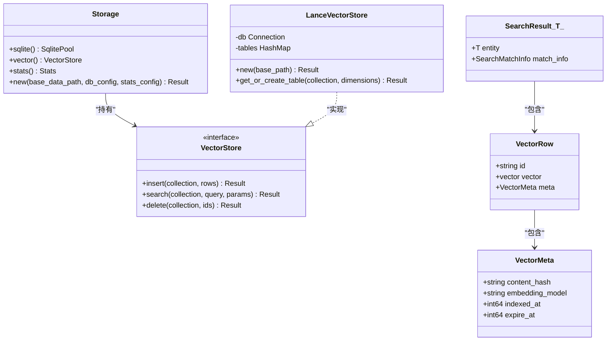
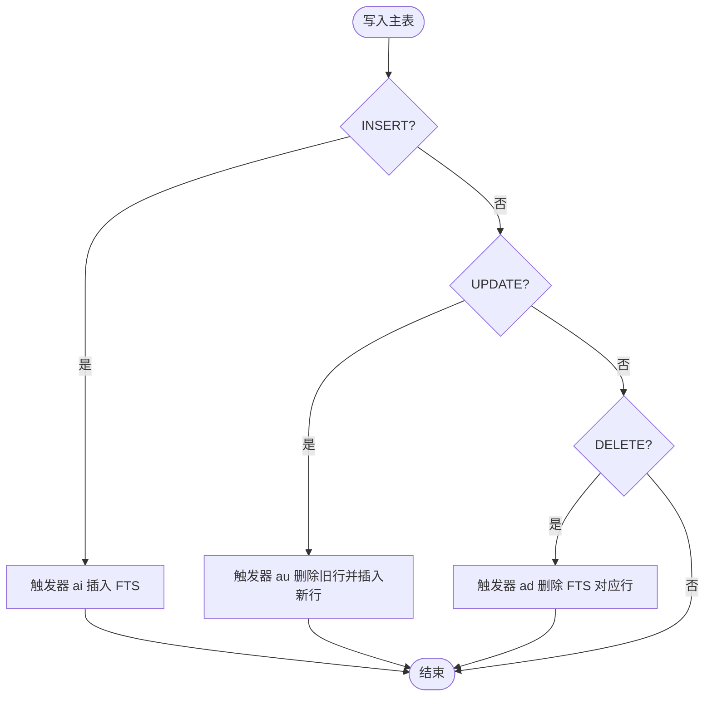
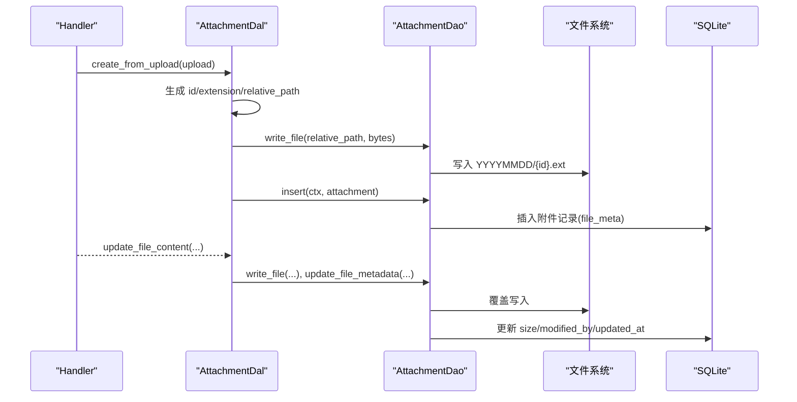
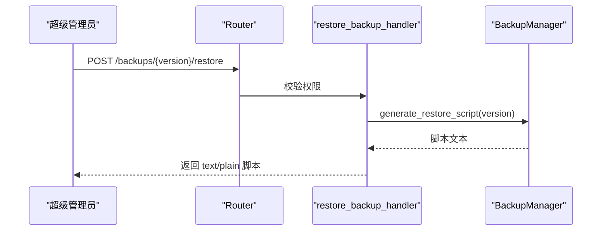
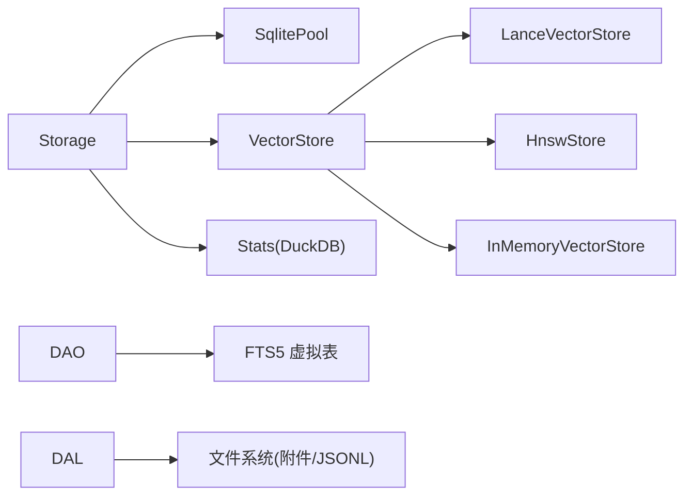

# 数据存储架构

<cite>
**本文引用的文件**
- [src/pkg/storage/mod.rs](file://src/pkg/storage/mod.rs)
- [src/pkg/storage/lance.rs](file://src/pkg/storage/lance.rs)
- [src/pkg/storage/fts5.rs](file://src/pkg/storage/fts5.rs)
- [migrations/20260420000000_initial.sql](file://migrations/20260420000000_initial.sql)
- [migrations/20260712000000_memory_fts5.sql](file://migrations/20260712000000_memory_fts5.sql)
- [migrations/20260712000001_entity_fts5.sql](file://migrations/20260712000001_entity_fts5.sql)
- [src/models/vector.rs](file://src/models/vector.rs)
- [src/pkg/daily_jsonl.rs](file://src/pkg/daily_jsonl.rs)
- [src/service/dal/attachment.rs](file://src/service/dal/attachment.rs)
- [src/handlers/system/backup/restore_backup.rs](file://src/handlers/system/backup/restore_backup.rs)
- [src/router.rs](file://src/router.rs)
</cite>

## 目录
1. [简介](#简介)
2. [项目结构](#项目结构)
3. [核心组件](#核心组件)
4. [架构总览](#架构总览)
5. [详细组件分析](#详细组件分析)
6. [依赖关系分析](#依赖关系分析)
7. [性能考虑](#性能考虑)
8. [故障排查指南](#故障排查指南)
9. [结论](#结论)
10. [附录：迁移与扩展指南](#附录：迁移与扩展指南)

## 简介
本文件面向 AI Orz 系统的数据存储架构，聚焦 SQLite 主数据库、向量搜索（LanceDB + Fastembed）、全文搜索（FTS5）、文件存储策略（附件与按天 Markdown/JSONL 长期记忆）、数据一致性、备份恢复与性能优化。文档提供架构图、存储层级图与数据处理流程图，并给出迁移与扩展建议。

## 项目结构
AI Orz 采用四层单向调用：Adapter → Domain → DAL → DAO。存储相关能力集中在 pkg/storage（统一门面与后端选择）、DAO/DAL（SQLite 访问与业务封装）、以及文件系统（附件与日志/记忆）。

图表来源
- [src/pkg/storage/mod.rs:1-212](file://src/pkg/storage/mod.rs#L1-L212)
- [migrations/20260420000000_initial.sql:1-273](file://migrations/20260420000000_initial.sql#L1-L273)
- [migrations/20260712000000_memory_fts5.sql:1-92](file://migrations/20260712000000_memory_fts5.sql#L1-L92)
- [migrations/20260712000001_entity_fts5.sql:1-246](file://migrations/20260712000001_entity_fts5.sql#L1-L246)
- [src/pkg/daily_jsonl.rs:1-110](file://src/pkg/daily_jsonl.rs#L1-L110)

章节来源
- [src/pkg/storage/mod.rs:1-212](file://src/pkg/storage/mod.rs#L1-L212)
- [migrations/20260420000000_initial.sql:1-273](file://migrations/20260420000000_initial.sql#L1-L273)

## 核心组件
- 统一存储门面 Storage：管理 SQLite 连接池、自动运行 migrations、根据配置选择向量存储后端（InMemory/HNSW/LanceDB/SqliteVss），并初始化 DuckDB Stats。
- 向量存储抽象与实现：VectorStore trait 及 LanceVectorStore、HnswStore、InMemoryVectorStore、SqliteVssStore；通用数据结构 VectorRow/VectorMeta/SearchResult 等。
- 全文搜索工具：FTS5 工具函数与迁移脚本，为多张主表创建 trigram 分词的 FTS5 虚拟表与触发器。
- 文件存储：附件按日期子目录组织（YYYYMMDD/{id}.ext），长期记忆/追踪使用按天 JSONL 文件（{base_path}/{YYYYMMDD}.jsonl）。
- 备份恢复：通过系统 API 生成恢复脚本，仅超级管理员可调用。

章节来源
- [src/pkg/storage/mod.rs:1-212](file://src/pkg/storage/mod.rs#L1-L212)
- [src/models/vector.rs:1-192](file://src/models/vector.rs#L1-L192)
- [src/pkg/storage/fts5.rs:1-45](file://src/pkg/storage/fts5.rs#L1-L45)
- [src/pkg/daily_jsonl.rs:1-110](file://src/pkg/daily_jsonl.rs#L1-L110)
- [src/handlers/system/backup/restore_backup.rs:1-35](file://src/handlers/system/backup/restore_backup.rs#L1-L35)

## 架构总览
下图展示从请求到数据落盘的全链路：Handler → Domain → DAL → DAO → SQLite/FTS5/向量存储/文件系统。

图表来源
- [src/pkg/storage/mod.rs:50-122](file://src/pkg/storage/mod.rs#L50-L122)
- [migrations/20260712000000_memory_fts5.sql:32-79](file://migrations/20260712000000_memory_fts5.sql#L32-L79)
- [migrations/20260712000001_entity_fts5.sql:68-217](file://migrations/20260712000001_entity_fts5.sql#L68-L217)
- [src/pkg/storage/lance.rs:43-104](file://src/pkg/storage/lance.rs#L43-L104)
- [src/pkg/daily_jsonl.rs:54-73](file://src/pkg/daily_jsonl.rs#L54-L73)

## 详细组件分析

### SQLite 主数据库设计
- 初始 Schema：包含组织、用户、Agent、模型服务商、任务、项目、短期记忆索引、长期知识节点、知识引用、消息、工件、工具、技能等核心表，并提供常用索引。
- 迁移策略：所有变更以时间戳命名的 SQL 迁移文件存放于 migrations/，启动时由 sqlx::migrate! 自动执行，保证增量升级与幂等性。
- 索引优化：针对高频查询字段建立索引（如 messages.created_at、short_term_memory_index.agent_id/tags、knowledge_node_relation/source/target 等）。

图表来源
- [migrations/20260420000000_initial.sql:9-273](file://migrations/20260420000000_initial.sql#L9-L273)

章节来源
- [migrations/20260420000000_initial.sql:9-273](file://migrations/20260420000000_initial.sql#L9-L273)

### 向量搜索集成（LanceDB + Fastembed）
- 后端选择：Storage::new 根据配置选择 InMemory/HNSW/LanceDB/SqliteVss。默认推荐纯 Rust 内存或 HNSW；生产环境可使用 LanceDB 获得高性能嵌入式向量检索。
- LanceDB 实现：懒加载表，固定维度 FixedSizeListArray，元数据包含内容哈希、嵌入模型、索引时间与过期时间，支持过滤与持久化。
- 通用数据结构：VectorRow/VectorMeta/VectorIndexParams/SearchResult<T> 等，统一各 DAO 的向量化流程与匹配信息。

图表来源
- [src/pkg/storage/mod.rs:36-122](file://src/pkg/storage/mod.rs#L36-L122)
- [src/pkg/storage/lance.rs:26-104](file://src/pkg/storage/lance.rs#L26-L104)
- [src/models/vector.rs:9-136](file://src/models/vector.rs#L9-L136)

章节来源
- [src/pkg/storage/mod.rs:36-122](file://src/pkg/storage/mod.rs#L36-L122)
- [src/pkg/storage/lance.rs:26-104](file://src/pkg/storage/lance.rs#L26-L104)
- [src/models/vector.rs:9-136](file://src/models/vector.rs#L9-L136)

### 全文搜索（FTS5）实现与应用场景
- 迁移脚本：为短期记忆、知识节点、skills/tools/messages/tasks/projects/agents 等表创建 FTS5 虚拟表，并使用 trigram 分词器支持中英文混合检索。
- 触发器：AFTER INSERT/UPDATE/DELETE 自动同步主表到 FTS5 虚拟表，确保索引一致。
- 工具函数：escape_fts5_keyword 将用户输入转义并包裹为短语匹配，避免空格被解释为 AND。

图表来源
- [migrations/20260712000000_memory_fts5.sql:32-79](file://migrations/20260712000000_memory_fts5.sql#L32-L79)
- [migrations/20260712000001_entity_fts5.sql:68-217](file://migrations/20260712000001_entity_fts5.sql#L68-L217)
- [src/pkg/storage/fts5.rs:6-18](file://src/pkg/storage/fts5.rs#L6-L18)

章节来源
- [migrations/20260712000000_memory_fts5.sql:1-92](file://migrations/20260712000000_memory_fts5.sql#L1-L92)
- [migrations/20260712000001_entity_fts5.sql:1-246](file://migrations/20260712000001_entity_fts5.sql#L1-L246)
- [src/pkg/storage/fts5.rs:1-45](file://src/pkg/storage/fts5.rs#L1-L45)

### 文件存储策略（附件与按天 Markdown/JSONL 长期记忆）
- 附件存储：DAL 层生成相对路径 YYYYMMDD/{id}.ext，写文件后更新元数据（大小、修改人、时间），并提供读取与删除接口。
- 长期记忆原始细节：DailyJsonlWriter 按天写入 {base_path}/{YYYYMMDD}.jsonl，每行一个 JSON 对象，支持追加、按行号读取与反序列化。

图表来源
- [src/service/dal/attachment.rs:94-196](file://src/service/dal/attachment.rs#L94-L196)
- [src/pkg/daily_jsonl.rs:54-73](file://src/pkg/daily_jsonl.rs#L54-L73)

章节来源
- [src/service/dal/attachment.rs:94-196](file://src/service/dal/attachment.rs#L94-L196)
- [src/pkg/daily_jsonl.rs:1-110](file://src/pkg/daily_jsonl.rs#L1-L110)

### 数据一致性保证
- 事务与原子性：SQL 写操作在 DAO 层通过 sqlx 事务保障；FTS5 通过触发器与主表同事务保持一致。
- 向量索引一致性：VectorIndexParams 使用内容哈希判断是否需要重索引，避免重复计算与不一致。
- 事件驱动异步：状态变更后发布 AOP 事件（如 TaskStatusChangedEvent），消费者异步处理，不阻塞主事务。

章节来源
- [src/pkg/storage/mod.rs:64-76](file://src/pkg/storage/mod.rs#L64-L76)
- [migrations/20260712000000_memory_fts5.sql:32-79](file://migrations/20260712000000_memory_fts5.sql#L32-L79)
- [src/models/vector.rs:54-92](file://src/models/vector.rs#L54-L92)
- [src/service/dal/task.rs:619-650](file://src/service/dal/task.rs#L619-L650)

### 备份恢复机制
- 备份列表与删除：路由注册 /api/v1/system/backups 系列端点。
- 恢复脚本：POST /api/v1/system/backups/{version}/restore 仅超级管理员可调用，返回 bash 脚本用于离线恢复。

图表来源
- [src/router.rs:637-646](file://src/router.rs#L637-L646)
- [src/handlers/system/backup/restore_backup.rs:1-35](file://src/handlers/system/backup/restore_backup.rs#L1-L35)

章节来源
- [src/router.rs:637-646](file://src/router.rs#L637-L646)
- [src/handlers/system/backup/restore_backup.rs:1-35](file://src/handlers/system/backup/restore_backup.rs#L1-L35)

## 依赖关系分析
- Storage 作为门面，聚合 SQLitePool、向量存储后端与 Stats，对外暴露统一接口。
- 向量存储后端通过配置注入，解耦具体实现（LanceDB/HNSW/InMemory/SqliteVss）。
- FTS5 与主表通过触发器耦合，迁移脚本负责建表与回填。
- 附件与 JSONL 文件通过 DAL 层统一管理，DAO 层专注路径与 IO 规则。

图表来源
- [src/pkg/storage/mod.rs:36-122](file://src/pkg/storage/mod.rs#L36-L122)
- [migrations/20260712000000_memory_fts5.sql:12-29](file://migrations/20260712000000_memory_fts5.sql#L12-L29)
- [src/pkg/daily_jsonl.rs:14-41](file://src/pkg/daily_jsonl.rs#L14-L41)

章节来源
- [src/pkg/storage/mod.rs:36-122](file://src/pkg/storage/mod.rs#L36-L122)

## 性能考虑
- SQLite 连接池：最大连接数限制为 5，适合单文件写并发有限场景。
- 向量索引：LanceDB 内置 HNSW，支持百万级向量快速检索；InMemory/HNSW 适用于轻量或无外部依赖场景。
- 全文搜索：trigram 分词器对中英文友好，触发器保证实时同步，减少额外维护成本。
- 文件 I/O：附件按日期分区，降低单目录文件数量；JSONL 追加写入，顺序 IO 高效。
- 统计：DuckDB Stats 批量写入，降低频繁写开销。

章节来源
- [src/pkg/storage/mod.rs:64-102](file://src/pkg/storage/mod.rs#L64-L102)
- [src/pkg/storage/lance.rs:1-8](file://src/pkg/storage/lance.rs#L1-L8)
- [migrations/20260712000000_memory_fts5.sql:1-10](file://migrations/20260712000000_memory_fts5.sql#L1-L10)
- [src/pkg/daily_jsonl.rs:54-73](file://src/pkg/daily_jsonl.rs#L54-L73)

## 故障排查指南
- 向量存储连接失败：检查 LanceDB 目录是否存在且可写，确认配置选择的后端类型。
- FTS5 索引不同步：检查触发器是否生效，确认主表 rowid 与 FTS5 关联逻辑。
- 附件写入失败：验证相对路径生成规则与目录权限，防止路径穿越攻击。
- 备份恢复失败：确认版本存在且脚本执行权限正确，检查磁盘空间与目标路径。

章节来源
- [src/pkg/storage/lance.rs:43-104](file://src/pkg/storage/lance.rs#L43-L104)
- [migrations/20260712000000_memory_fts5.sql:32-79](file://migrations/20260712000000_memory_fts5.sql#L32-L79)
- [src/service/dal/attachment.rs:94-196](file://src/service/dal/attachment.rs#L94-L196)
- [src/handlers/system/backup/restore_backup.rs:1-35](file://src/handlers/system/backup/restore_backup.rs#L1-L35)

## 结论
AI Orz 的数据存储架构以 SQLite 为核心，结合 FTS5 全文检索与多种向量存储后端（默认 LanceDB），并通过 DAL/DAO 分层与统一门面 Storage 实现高内聚、低耦合。附件与长期记忆采用按天文件组织，便于归档与检索。迁移脚本与触发器保障数据一致性与可扩展性，备份恢复机制满足运维需求。整体设计兼顾性能、可维护性与可观测性。

## 附录：迁移与扩展指南
- 新增表或字段：在 migrations/ 下添加新的 SQL 迁移文件，遵循命名规范；必要时补充索引。
- 新增向量集合：实现 Vectorizable trait，定义 collection 名称与向量化文本；在 DAO 中调用向量存储进行索引与检索。
- 新增 FTS5 索引：参照现有迁移脚本，创建虚拟表与触发器，并在迁移末尾回填存量数据。
- 扩展文件存储：遵循 DAL 层的相对路径生成规则，确保目录结构与权限正确。
- 扩展备份恢复：在 System Domain 中实现 BackupManager 接口，生成对应的备份/恢复脚本。

章节来源
- [migrations/20260712000001_entity_fts5.sql:219-246](file://migrations/20260712000001_entity_fts5.sql#L219-L246)
- [src/models/vector.rs:138-168](file://src/models/vector.rs#L138-L168)
- [src/service/dal/attachment.rs:192-196](file://src/service/dal/attachment.rs#L192-L196)