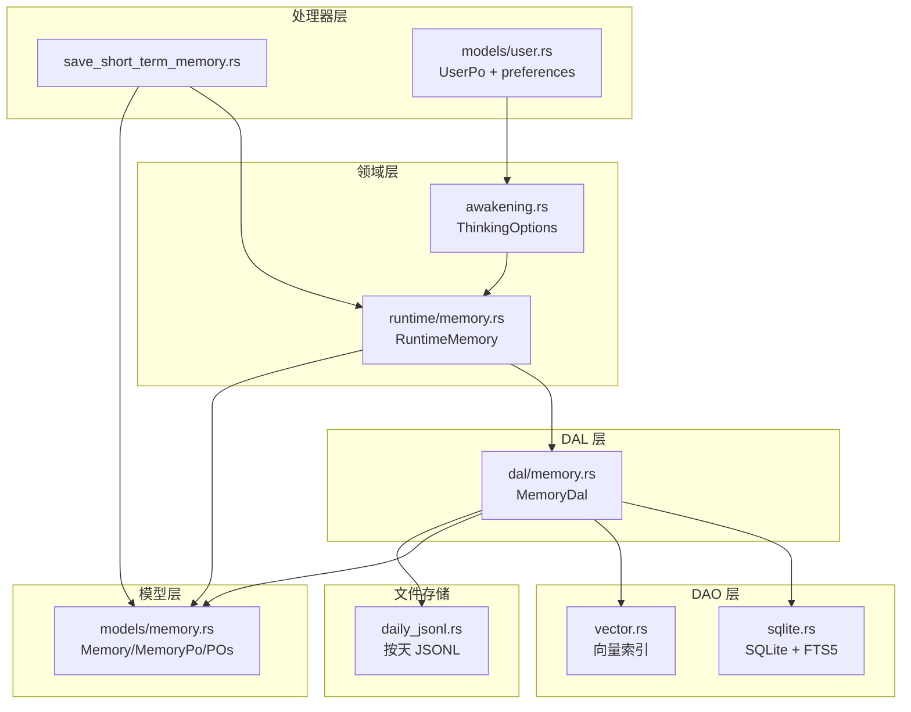
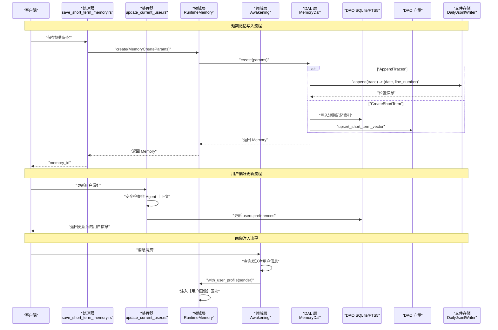
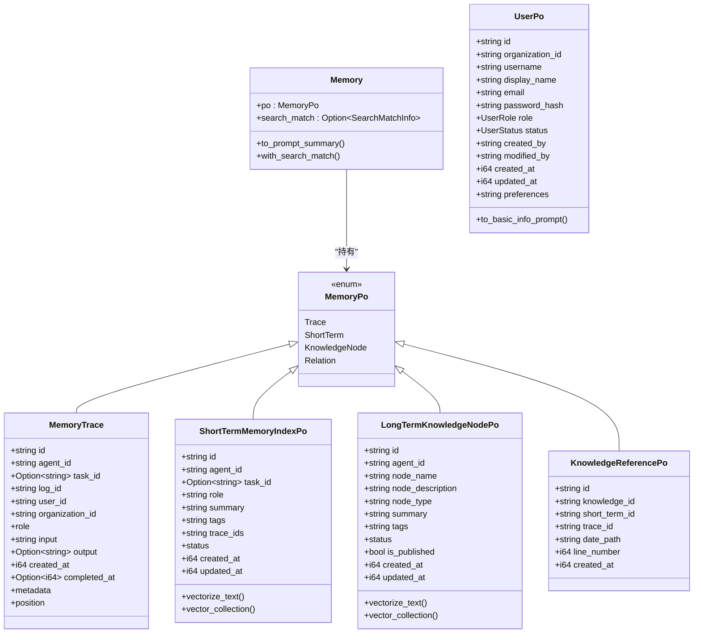
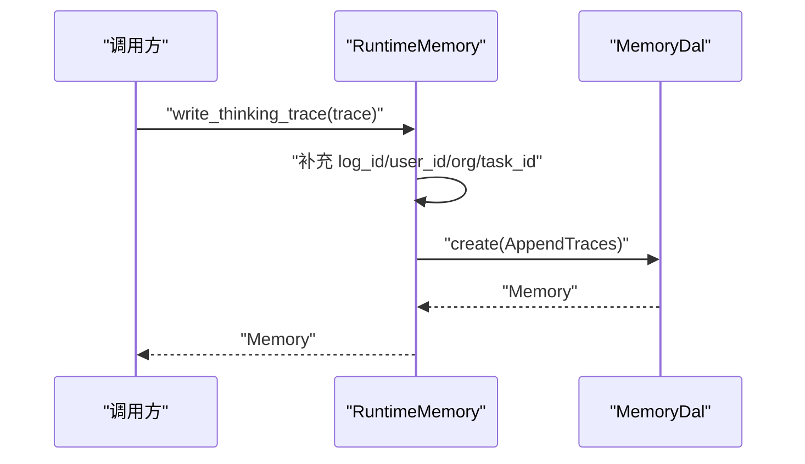
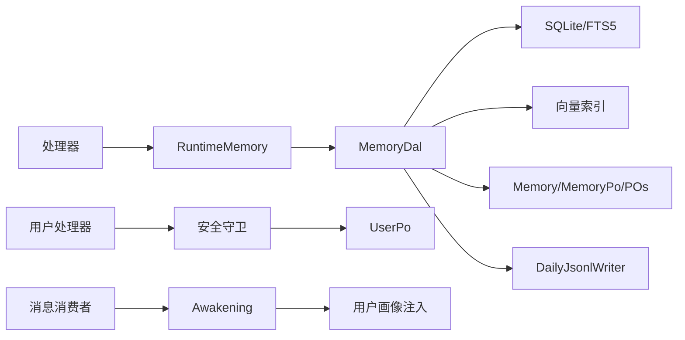

# 记忆系统架构

<cite>
**本文引用的文件**
- [src/service/dal/memory.rs](file://src/service/dal/memory.rs)
- [src/models/memory.rs](file://src/models/memory.rs)
- [src/service/domain/runtime/memory.rs](file://src/service/domain/runtime/memory.rs)
- [src/pkg/daily_jsonl.rs](file://src/pkg/daily_jsonl.rs)
- [src/handlers/hr/agent/save_short_term_memory.rs](file://src/handlers/hr/agent/save_short_term_memory.rs)
- [src/service/dal/mod.rs](file://src/service/dal/mod.rs)
- [docs/superpowers/specs/enhance-memory-search/checklist.md](file://docs/superpowers/specs/enhance-memory-search/checklist.md)
- [migrations/20260810000000_users_preferences.sql](file://migrations/20260810000000_users_preferences.sql)
- [src/models/user.rs](file://src/models/user.rs)
- [src/handlers/user/profile/update_current_user.rs](file://src/handlers/user/profile/update_current_user.rs)
- [common/src/api/user.rs](file://common/src/api/user.rs)
- [src/consumer/message.rs](file://src/consumer/message.rs)
- [src/service/domain/runtime/awakening.rs](file://src/service/domain/runtime/awakening.rs)
- [src/service/domain/system/seed/skills/TEMPLATE_MEMORY_COGNITION/skill.md](file://src/service/domain/system/seed/skills/TEMPLATE_MEMORY_COGNITION/skill.md)
- [src/service/domain/system/seed/skills/TEMPLATE_COMMUNICATION/skill.md](file://src/service/domain/system/seed/skills/TEMPLATE_COMMUNICATION/skill.md)
- [tests/integration/preset_skills_test.rs](file://tests/integration/preset_skills_test.rs)
</cite>

## 更新摘要
**变更内容**
- 新增用户偏好沉淀机制章节，详细说明双源画像设计（用户表自述 + 组织级图谱总结）
- 更新消息消费链路，说明唤醒时自动注入用户画像到 Prompt 的实现
- 补充技能约定中的「用户偏好沉淀」小节与行为准则更新
- 增强 DAL 层检索能力说明，包含 tags OR 语义过滤与 FTS5 trigram 索引
- 更新前端展示规范，统一 MarkdownRenderer 渲染偏好内容与知识节点详情
- 新增用户偏好安全守卫机制，确保 Agent 无法直接写入用户表

## 目录
1. [简介](#简介)
2. [项目结构](#项目结构)
3. [核心组件](#核心组件)
4. [架构总览](#架构总览)
5. [详细组件分析](#详细组件分析)
6. [用户偏好沉淀机制](#用户偏好沉淀机制)
7. [依赖关系分析](#依赖关系分析)
8. [性能考量](#性能考量)
9. [故障排查指南](#故障排查指南)
10. [结论](#结论)
11. [附录](#附录)

## 简介
本文件为 AI Orz 系统的"记忆系统"架构文档，聚焦四层记忆体系设计：核心认知（Core Memory）、工作记忆（Working Memory）、短期记忆（Short-Term Memory）、长期知识（Long-Term Knowledge）。文档说明每种记忆的存储位置、访问方式与生命周期管理；阐述运行时记忆（Runtime Memory）的"最薄封装"设计原则——100% 复用 DAL 层方法与结构体，零重复定义核心接口；并详细说明文件存储结构（按天 JSONL 文件）、索引机制（FTS5 + 向量）、检索策略（混合排序）与性能优化。

**更新** 本次更新新增了用户偏好沉淀机制，实现了声明式用户自述偏好与推断式 Agent 观察总结的双源画像体系，并在唤醒链路中自动注入用户画像到 Prompt。该机制通过 users.preferences 字段承载用户自述偏好（权威自述），同时通过知识图谱的 user_preference tag 承载 Agent 观察总结（可演进、可修正），形成完整的用户画像双源架构。

## 项目结构
记忆系统横跨模型层、DAL 层、DAO 层、领域层与处理器层，关键路径如下：
- 模型层：MemoryTrace、ShortTermMemoryIndexPo、LongTermKnowledgeNodePo、KnowledgeReferencePo、Memory/MemoryPo、MemoryCreateParams、UserPo（含 preferences 字段）
- DAL 层：MemoryDal（统一搜索、查询、创建/更新/删除、图谱遍历、沉淀、重建向量）
- DAO 层：SQLite 持久化、FTS5 全文检索、向量索引维护（集合名 memory:short_term / memory:knowledge_node）
- 领域层：RuntimeDomainImpl::RuntimeMemory（最薄封装，直接委托 DAL）
- 处理器层：保存短期记忆等 HTTP 入口，构造参数后调用 RuntimeDomain/DAL
- 文件存储：DailyJsonlWriter 按天写入 {YYYYMMDD}.jsonl，用于原始记忆追踪

**图表来源**
- [src/handlers/hr/agent/save_short_term_memory.rs:30-57](file://src/handlers/hr/agent/save_short_term_memory.rs#L30-L57)
- [src/handlers/user/profile/update_current_user.rs:51-57](file://src/handlers/user/profile/update_current_user.rs#L51-L57)
- [src/service/domain/runtime/memory.rs:11-119](file://src/service/domain/runtime/memory.rs#L11-L119)
- [src/service/domain/runtime/awakening.rs:95-108](file://src/service/domain/runtime/awakening.rs#L95-L108)
- [src/service/dal/memory.rs:70-177](file://src/service/dal/memory.rs#L70-L177)
- [src/models/memory.rs:15-424](file://src/models/memory.rs#L15-L424)
- [src/models/user.rs:37-42](file://src/models/user.rs#L37-L42)
- [src/pkg/daily_jsonl.rs:1-110](file://src/pkg/daily_jsonl.rs#L1-L110)

**章节来源**
- [src/service/dal/mod.rs:1-52](file://src/service/dal/mod.rs#L1-L52)

## 核心组件
- 四层记忆类型
  - 核心认知（Core Memory）：以"知识节点"形式沉淀的核心事实与概念，存储在 SQLite 的 LongTermKnowledgeNodePo，支持发布与共享，具备向量索引与 FTS5 索引。
  - 工作记忆（Working Memory）：当前会话/任务上下文中的短期聚合摘要，对应 ShortTermMemoryIndexPo，作为 Agent 思考时的即时参考。
  - 短期记忆（Short-Term Memory）：对多条原始记忆细节进行归纳后的索引条目，包含 summary/tags/trace_ids，可被沉淀为长期知识。
  - 长期知识（Long-Term Knowledge）：从短期记忆中沉淀出的稳定知识节点，附带引用指向原始 trace 位置，支持图谱关系与推荐起点。
- 运行时记忆（Runtime Memory）：领域层的最薄封装，直接委托 DAL 方法，不引入额外抽象或重复接口。
- 存储与索引
  - 原始记忆追踪：按天 JSONL 文件（{base_path}/{YYYYMMDD}.jsonl），通过 DailyJsonlWriter 追加与定位行号。
  - 短期记忆索引：SQLite 表 + FTS5 全文索引 + 向量集合 memory:short_term。
  - 长期知识节点：SQLite 表 + FTS5 全文索引 + 向量集合 memory:knowledge_node + 关系表。
- 检索策略
  - 混合搜索：关键词命中（FTS5 BM25）+ 向量语义相似度，结果按 Hybrid → Vector → Keyword 分组排序，组内分别按向量距离升序或 fts_rank 升序。
  - 阈值控制：向量距离阈值可配置（默认 0.8），空 agent_id 时短期记忆走全局搜索，知识节点仅返回 published。
- 用户偏好双源机制
  - 声明式自述：users.preferences 字段，仅用户本人可通过 update_current_user 修改，Agent 无写入路径。
  - 推断式总结：知识图谱中以 user_preference tag 标记的节点，由 Agent 观察总结，可演进修正。
  - 画像注入：唤醒链路自动拼装用户画像（基础信息 + 自述偏好）注入 Prompt。

**章节来源**
- [src/models/memory.rs:15-424](file://src/models/memory.rs#L15-L424)
- [src/service/dal/memory.rs:70-177](file://src/service/dal/memory.rs#L70-L177)
- [src/service/domain/runtime/memory.rs:11-119](file://src/service/domain/runtime/memory.rs#L11-L119)
- [src/pkg/daily_jsonl.rs:1-110](file://src/pkg/daily_jsonl.rs#L1-L110)
- [docs/superpowers/specs/enhance-memory-search/checklist.md:18-59](file://docs/superpowers/specs/enhance-memory-search/checklist.md#L18-L59)
- [src/models/user.rs:37-42](file://src/models/user.rs#L37-L42)
- [common/src/api/user.rs:31-33](file://common/src/api/user.rs#L31-L33)

## 架构总览
下图展示记忆系统在请求处理中的端到端流程：处理器接收请求，构建 MemoryCreateParams，经 RuntimeMemory 最薄封装委托至 DAL，DAL 协调 DAO 完成 SQLite/FTS5/向量索引操作，必要时落盘 JSONL 原始追踪。同时，用户偏好更新通过独立的 update_current_user 处理器处理，在消息消费链路中自动注入用户画像。

**图表来源**
- [src/handlers/hr/agent/save_short_term_memory.rs:30-57](file://src/handlers/hr/agent/save_short_term_memory.rs#L30-L57)
- [src/handlers/user/profile/update_current_user.rs:51-57](file://src/handlers/user/profile/update_current_user.rs#L51-L57)
- [src/service/domain/runtime/memory.rs:39-67](file://src/service/domain/runtime/memory.rs#L39-L67)
- [src/service/domain/runtime/awakening.rs:95-108](file://src/service/domain/runtime/awakening.rs#L95-L108)
- [src/consumer/message.rs:340-346](file://src/consumer/message.rs#L340-346)
- [src/service/dal/memory.rs:377-390](file://src/service/dal/memory.rs#L377-L390)
- [src/pkg/daily_jsonl.rs:54-73](file://src/pkg/daily_jsonl.rs#L54-L73)

## 详细组件分析

### 模型层：记忆实体与用户模型
- MemoryTrace：原始记忆追踪，包含角色、输入输出、时间戳、元数据与物理位置（日期文件名 + 行号）。
- ShortTermMemoryIndexPo：短期记忆索引，summary/tags/trace_ids/status，实现 Vectorizable 以生成向量文本与集合名。
- LongTermKnowledgeNodePo：长期知识节点，node_description/summary/tags/is_published，实现 Vectorizable。
- KnowledgeReferencePo：知识节点引用原始短期索引与 trace 位置，支持溯源。
- Memory/MemoryPo：业务实体包装 PO 与 SearchMatchInfo，统一对外返回。
- MemoryCreateParams：统一写入参数，区分 AppendTraces/CreateShortTerm/CreateKnowledgeNode/CreateRelations。
- UserPo：用户模型，新增 preferences 字段承载用户自述偏好，to_basic_info_prompt() 方法支持偏好注入。

**图表来源**
- [src/models/memory.rs:15-424](file://src/models/memory.rs#L15-L424)
- [src/models/user.rs:12-42](file://src/models/user.rs#L12-L42)

**章节来源**
- [src/models/memory.rs:15-424](file://src/models/memory.rs#L15-L424)
- [src/models/user.rs:12-42](file://src/models/user.rs#L12-L42)

### DAL 层：MemoryDal 统一编排
- 统一搜索 search：根据 filters.memory_type 选择短期/知识节点/关系搜索，合并结果并按 Hybrid → Vector → Keyword 排序。
- 通用查询 query：组合 DAO 查询短期与知识节点，转换为 Memory 业务实体，支持 tags OR 语义过滤。
- 推荐起点 recommend_seed_nodes：统计节点度数（入边+出边）返回 Top N。
- 创建/更新/删除 create/update/delete：按 MemoryCreateParams 变体分发，自动向量化或级联删除。
- 图谱遍历 traverse_knowledge_graph：BFS/DFS 遍历种子节点，限制深度与宽度，返回节点与关系。
- 沉淀 settle_short_term_to_long_term：将活跃短期记忆总结为知识节点，建立引用并标记已沉淀。
- 重建 rebuild_vectors：检测集合 model_provider_id，清空并重建向量索引。

**图表来源**
- [src/service/dal/memory.rs:190-276](file://src/service/dal/memory.rs#L190-L276)

**章节来源**
- [src/service/dal/memory.rs:70-177](file://src/service/dal/memory.rs#L70-L177)
- [src/service/dal/memory.rs:190-276](file://src/service/dal/memory.rs#L190-L276)

### 领域层：RuntimeMemory 最薄封装
- get_recent_context：按 agent_id 查询近期短期记忆。
- write_thinking_trace：补充上下文信息后，调用 DAL 写入原始追踪。
- search/query/recommend_seed_nodes/create/update/delete/traverse_graph：全部直接委托 DAL，无重复接口定义。
- ThinkingOptions：新增 with_user_profile 方法，支持用户画像注入。

**图表来源**
- [src/service/domain/runtime/memory.rs:39-67](file://src/service/domain/runtime/memory.rs#L39-L67)
- [src/service/dal/memory.rs:377-390](file://src/service/dal/memory.rs#L377-L390)

**章节来源**
- [src/service/domain/runtime/memory.rs:11-119](file://src/service/domain/runtime/memory.rs#L11-L119)

### 处理器层：保存短期记忆与用户偏好更新
- 短期记忆：构造 ShortTermMemoryIndexPo，设置 agent_id/task_id/role/summary/tags/trace_ids/status，使用 MemoryCreateParams::CreateShortTerm 调用 runtime_domain().memory().create。
- 用户偏好更新：update_current_user 处理器包含安全守卫，仅在非 Agent 上下文中允许更新 preferences 字段，防止 Agent 直接写入用户表。

**章节来源**
- [src/handlers/hr/agent/save_short_term_memory.rs:30-57](file://src/handlers/hr/agent/save_short_term_memory.rs#L30-L57)
- [src/handlers/user/profile/update_current_user.rs:51-57](file://src/handlers/user/profile/update_current_user.rs#L51-L57)

### 文件存储：按天 JSONL
- DailyJsonlWriter 按日期分区写入 {YYYYMMDD}.jsonl，每次 append 返回 (date_path, line_number)。
- 支持 read_line/read_line_json 按行读取与反序列化。
- 用于 MemoryTrace 的物理位置记录，支撑溯源与引用。

**章节来源**
- [src/pkg/daily_jsonl.rs:1-110](file://src/pkg/daily_jsonl.rs#L1-L110)

## 用户偏好沉淀机制

### 设计原则
- **声明 > 推断**：users.preferences 只由用户本人写入，是权威自述；图谱节点是 Agent 观察推断，可演进、可修正。
- **Agent 不写用户表**：不给 Agent 开放任何 users 表写入路径（`update_user` 本就刻意不注册为 Agent 工具）。
- **tag 只表种类**：偏好节点统一打 `user_preference` tag（纯过滤作用）；被观察用户的 user_id 放入 `node_name`（FTS5 trigram 已索引该列，可精确检索），不进 tag。
- **注入不靠 Agent 自觉**：唤醒链路服务端自动拼装画像，Agent 无感知。
- **展示统一 Markdown**：用户偏好、知识节点详情、短期记忆内容的展示态一律走 `MarkdownRenderer` 组件（编辑态 textarea）。

### 后端：users 表新增 preferences 字段

#### 迁移（新建 migrations/20260810000000_users_preferences.sql）
`ALTER TABLE users ADD COLUMN preferences TEXT NOT NULL DEFAULT '';`（STRICT 表，空字符串表示未设置，内容由用户自填 Markdown/纯文本）。

#### 模型与 DAO
- UserPo 新增 `pub preferences: String`，同步更新 UserDao 读写 SQL（select 列表、insert、update）与全部构造点；sqlx 离线数据需重新生成。
- `to_basic_info_prompt()` 增加【用户偏好】行：preferences 非空时拼入，空则不拼（保持 Prompt 干净）。

#### common DTO（单一事实源）
- `UpdateCurrentUserRequest` 新增 `pub preferences: Option<String>`（None=不修改）；`UserInfoResponse` 新增 `preferences` 字段供前端回显。
- **安全守卫**：update_current_user 已注册为 Agent 工具，新增字段会暴露给 LLM。handler 内需守卫：`ctx.agent_id` 为 Some（Agent 上下文调用）时忽略 preferences 字段，只允许真人 HTTP 会话修改。
- `UpdateUserRequest`（管理员接口）**不加** preferences 字段，维持现有边界。

### 图谱侧：用户偏好节点的写入约定（纯技能文档，零代码改动）

检索能力已具备：`query_memory`/`search_memory` 支持 tags OR 语义过滤（`MemoryQuery.tags`），FTS5 索引覆盖 node_name/summary/node_description/tags，node_name 中写 user_id 即可按用户检索。

#### 修改 TEMPLATE_MEMORY_COGNITION/skill.md
新增「用户偏好沉淀」小节，约定：
- 对话中发现用户的习惯/偏好/沟通风格 → 短期记忆先记（tags 含「用户偏好」），沉淀时建知识节点。
- 节点规范：`tags` 必须含 `user_preference` 与 `published`（用户偏好天然跨 Agent 共享）；`node_type` 用 `fact`；**`node_name` 固定格式**：`用户偏好-{display_name}（{user_id}）`，user_id 放名称不进 tag；`node_description` 用 Markdown 写具体偏好内容与观察依据（前端统一 Markdown 渲染）。
- 同一用户的偏好优先 `update_memory` 更新既有节点（先按 `tags=["user_preference"]` + query 检索定位），不重复建节点；认知反转时用 opposite 关系保留演进痕迹。

#### 修改 TEMPLATE_COMMUNICATION/skill.md
行为准则增加一条：沟通中留意用户表达的偏好与习惯，按记忆认知技能的「用户偏好沉淀」规范记录；回复风格优先遵循【用户画像】中已有的偏好。

两份技能内容变化需同步更新 tests/integration/preset_skills_test.rs 的内容断言。

### Prompt 注入：接通预留的 user_profile 钩子

现状：ThinkingOptions.user_profile 预留字段无人赋值；PromptBuilder 的【用户画像】区块已实现（有值即拼装，唤醒/沉淀场景都拼）。

#### 改动点
- ThinkingOptions 增加 builder 方法 `with_user_profile(user: UserPo)`，更新字段注释（去掉「预留」）。
- consumer/message.rs 构建 thinking_options 处：按 `message.po.from_id`（from_role=User 时）经 organization domain 查 UserPo，赋值 user_profile。查询失败仅记日志不阻塞唤醒。

本期 Prompt 画像 = 用户基础信息 + 用户自述 preferences。图谱侧偏好节点暂靠 Agent 通过 `query_memory(tags=["user_preference"])` 主动检索（技能中已引导）；服务端自动注入图谱节点留作后续迭代（避免本期引入唤醒链路的检索开销与截断策略决策）。

### 前端：个人资料页偏好编辑 + Markdown 渲染统一

#### 个人资料页（frontend/src/pages/user/ 下 profile 页面）
- 新增「我的偏好」区块：编辑态 textarea（Markdown 书写），展示态用 MarkdownRenderer 渲染；加载时回显 UserInfoResponse.preferences，保存走 update_current_user。

#### Markdown 渲染覆盖确认（现状已达标，无需新改动）
- memory_search.rs：短期记忆/知识节点展开态已用 MarkdownRenderer 渲染完整内容与摘要（折叠态为纯文本截断预览，属正常列表摘要形态，保留）。
- knowledge_graph.rs：节点详情侧边栏 content/summary 已用 MarkdownRenderer 渲染。
- 本期仅需保证新增的偏好展示与技能约定中「node_description 用 Markdown 书写」两处对齐该统一规范。

图谱侧 Agent 总结的「采纳晋升」按钮不在本期范围（现有记忆搜索页已可按 tags 检索浏览），留作后续迭代。

**章节来源**
- [migrations/20260810000000_users_preferences.sql:1-13](file://migrations/20260810000000_users_preferences.sql#L1-L13)
- [src/models/user.rs:37-42](file://src/models/user.rs#L37-L42)
- [src/models/user.rs:50-71](file://src/models/user.rs#L50-L71)
- [common/src/api/user.rs:31-33](file://common/src/api/user.rs#L31-L33)
- [common/src/api/user.rs:44-53](file://common/src/api/user.rs#L44-L53)
- [src/handlers/user/profile/update_current_user.rs:51-57](file://src/handlers/user/profile/update_current_user.rs#L51-L57)
- [src/service/domain/system/seed/skills/TEMPLATE_MEMORY_COGNITION/skill.md:47-61](file://src/service/domain/system/seed/skills/TEMPLATE_MEMORY_COGNITION/skill.md#L47-L61)
- [src/service/domain/system/seed/skills/TEMPLATE_COMMUNICATION/skill.md:76-77](file://src/service/domain/system/seed/skills/TEMPLATE_COMMUNICATION/skill.md#L76-L77)
- [src/consumer/message.rs:340-346](file://src/consumer/message.rs#L340-346)
- [src/service/domain/runtime/awakening.rs:95-108](file://src/service/domain/runtime/awakening.rs#L95-L108)
- [tests/integration/preset_skills_test.rs:169-199](file://tests/integration/preset_skills_test.rs#L169-L199)

## 依赖关系分析
- 模块耦合
  - RuntimeMemory 依赖 DAL（MemoryDal），无业务逻辑重复。
  - DAL 依赖 DAO（SQLite/FTS5/向量）与模型层（Memory/MemoryPo/POs）。
  - 处理器依赖 RuntimeMemory 与模型层参数构造。
- 外部依赖
  - 向量集合命名：memory:short_term、memory:knowledge_node。
  - FTS5 全文检索：BM25 相关性排序。
- 潜在循环依赖
  - 通过 DAL 单例与 DAO trait 解耦，避免循环。
- 集成点
  - Embedding Provider 切换与重建：rebuild_vectors 检测集合 provider_id 并重建。
  - 全局搜索与过滤：空 agent_id 时短期记忆不过滤，知识节点仅返回 published。
  - 用户偏好安全边界：Agent 上下文检测防止直接写入用户表。

**图表来源**
- [src/service/dal/memory.rs:70-177](file://src/service/dal/memory.rs#L70-L177)
- [src/models/memory.rs:15-424](file://src/models/memory.rs#L15-L424)
- [src/pkg/daily_jsonl.rs:1-110](file://src/pkg/daily_jsonl.rs#L1-L110)
- [src/handlers/user/profile/update_current_user.rs:51-57](file://src/handlers/user/profile/update_current_user.rs#L51-L57)
- [src/consumer/message.rs:340-346](file://src/consumer/message.rs#L340-346)

**章节来源**
- [src/service/dal/memory.rs:70-177](file://src/service/dal/memory.rs#L70-L177)
- [src/models/memory.rs:15-424](file://src/models/memory.rs#L15-L424)

## 性能考量
- 混合搜索排序
  - Hybrid 优先，Vector 次之，Keyword 最后；组内按向量距离或 fts_rank 升序。
  - 向量距离阈值可配置（默认 0.8），避免低质量召回。
- 向量重建
  - 检测集合 model_provider_id，按需清空并重建，单条失败不影响整体。
- 文件 I/O
  - 按天分片减少单文件大小，append 模式降低锁竞争；行号定位支持随机读取。
- 降级策略
  - 向量化失败降级为关键词搜索；向量索引删除失败不影响主流程。
- 分页与截断
  - 搜索结果应用 limit，避免大结果集拖慢响应。
- 用户偏好查询优化
  - FTS5 trigram 索引支持 node_name 精确检索，避免全表扫描。
  - tags OR 语义过滤利用 SQLite JSON 数组列的高效查询。

**章节来源**
- [docs/superpowers/specs/enhance-memory-search/checklist.md:18-59](file://docs/superpowers/specs/enhance-memory-search/checklist.md#L18-L59)
- [src/service/dal/memory.rs:654-799](file://src/service/dal/memory.rs#L654-L799)
- [src/pkg/daily_jsonl.rs:54-73](file://src/pkg/daily_jsonl.rs#L54-L73)

## 故障排查指南
- 向量索引异常
  - 现象：更新/删除/重建时日志 warn 向量索引失败。
  - 排查：检查 Embedding Provider 是否可用；确认集合 model_provider_id 一致；查看向量集合是否存在。
- FTS5 搜索无结果
  - 现象：关键词搜索为空。
  - 排查：确认关键词非空；检查 FTS5 索引是否重建；验证特殊字符转义。
- 短期记忆未沉淀
  - 现象：settle_short_term_to_long_term 返回空。
  - 排查：确认存在 status=Active 的短期记忆；检查 agent_id 过滤；查看日志"无未沉淀的短期记忆"。
- 原始追踪不可读
  - 现象：按 date_path + line_number 读取失败。
  - 排查：确认文件存在；行号范围正确；JSONL 格式完整。
- 用户偏好沉淀问题
  - 现象：Agent 无法写入用户偏好或画像未注入。
  - 排查：确认 preferences 字段权限守卫；检查 user_profile 注入逻辑；验证技能约定中的节点格式。
- 用户偏好安全边界
  - 现象：Agent 尝试通过 update_current_user 写入 preferences。
  - 排查：检查 ctx.agent_id 检测逻辑；确认 handler 中的安全守卫正常工作。

**章节来源**
- [src/service/dal/memory.rs:400-506](file://src/service/dal/memory.rs#L400-L506)
- [src/service/dal/memory.rs:654-799](file://src/service/dal/memory.rs#L654-L799)
- [src/pkg/daily_jsonl.rs:75-103](file://src/pkg/daily_jsonl.rs#L75-L103)
- [src/handlers/user/profile/update_current_user.rs:51-57](file://src/handlers/user/profile/update_current_user.rs#L51-L57)

## 结论
AI Orz 的记忆系统采用四层设计，清晰划分短期与长期知识的生命周期与职责；DAL 层承担跨 DAO 的流程编排与混合检索策略；领域层 RuntimeMemory 坚持"最薄封装"，100% 复用 DAL 方法与结构体，零重复定义核心接口；文件存储按天分片，结合 FTS5 与向量索引实现高效检索与溯源。通过阈值控制、降级策略与重建机制，系统在可用性、可扩展性与性能之间取得平衡。

**更新** 本次新增的用户偏好沉淀机制进一步完善了记忆系统的画像能力，通过声明式自述与推断式总结的双源设计，既保证了用户自主权，又实现了 Agent 观察的持续演进。唤醒链路的自动画像注入让 Agent 能够基于完整的用户上下文提供更个性化的服务。安全守卫机制确保了用户数据的隐私与安全，防止 Agent 直接修改用户偏好。

## 附录
- 术语
  - Core Memory：核心认知，以知识节点形式沉淀的稳定知识。
  - Working Memory：工作记忆，当前会话/任务的短期聚合摘要。
  - Short-Term Memory：短期记忆，对原始细节的归纳索引，可沉淀为长期知识。
  - Long-Term Knowledge：长期知识，从短期记忆沉淀的知识节点，支持图谱关系与发布共享。
  - Runtime Memory：运行时记忆，领域层对 DAL 的最薄封装。
  - 用户偏好沉淀：双源画像机制，用户表自述偏好 + 图谱推断总结。
  - 声明式画像：用户通过 preferences 字段主动填写的偏好信息。
  - 推断式画像：Agent 通过观察对话总结的用户偏好信息。
- 关键路径
  - 写入：处理器 → RuntimeMemory → DAL → DAO（SQLite/FTS5/向量）→ 文件存储（JSONL）
  - 检索：DAL 统一 search → 混合排序 → 返回 Memory 列表
  - 沉淀：DAL 批量处理 Active 短期记忆 → 创建知识节点 → 标记已沉淀
  - 画像注入：消息消费 → 查询用户 → 构建 ThinkingOptions → 注入 Prompt
  - 偏好更新：用户接口 → 安全守卫 → 数据库更新 → 前端回显