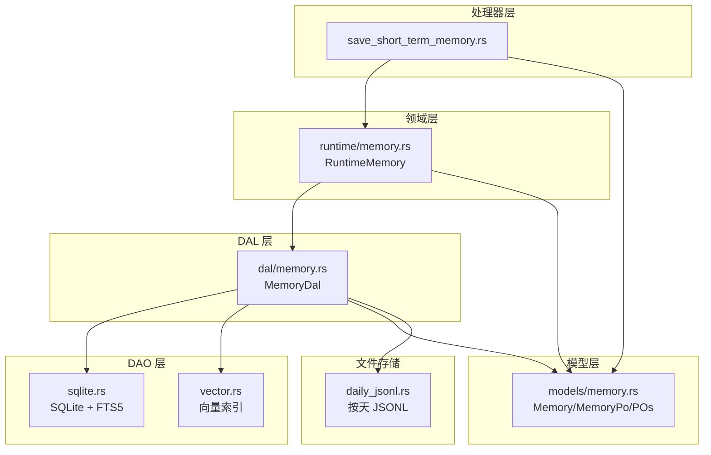
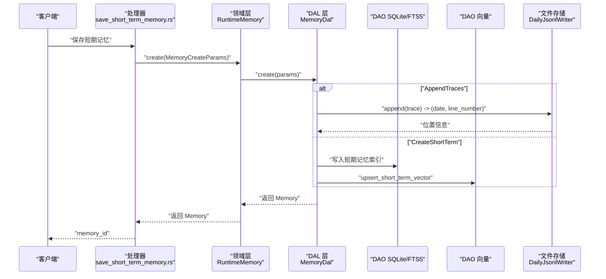
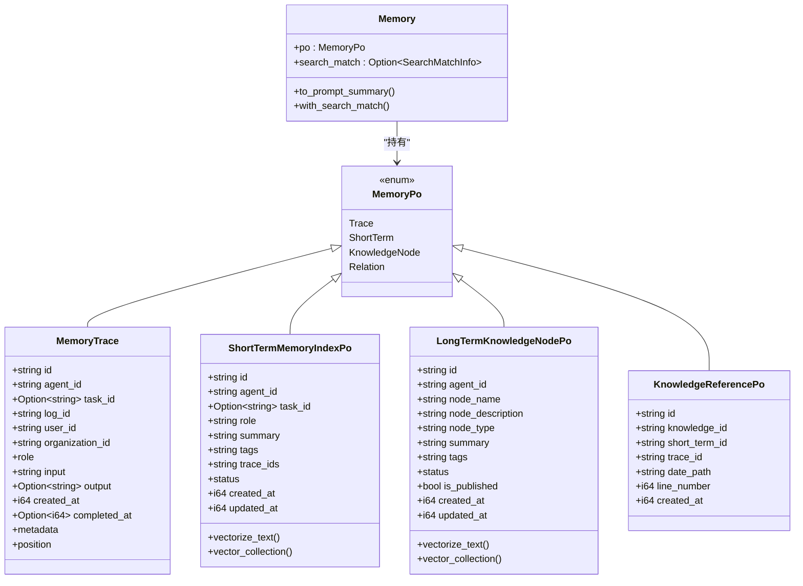
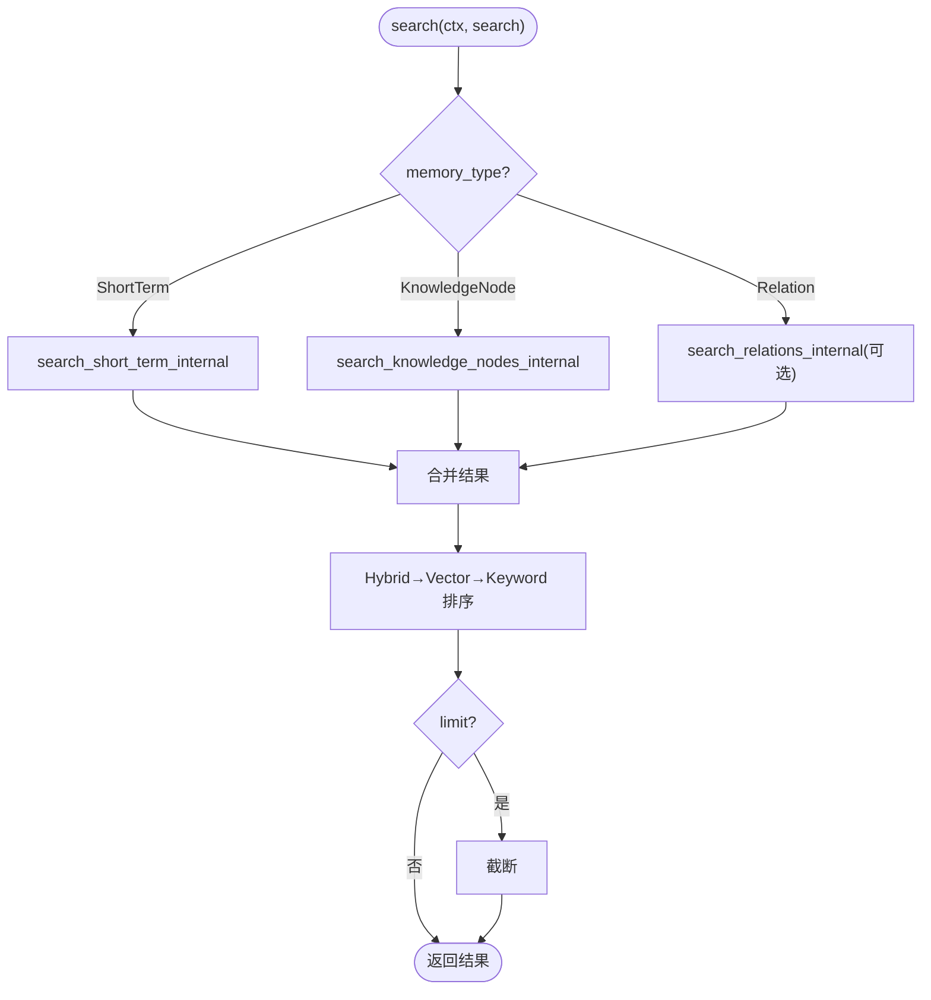
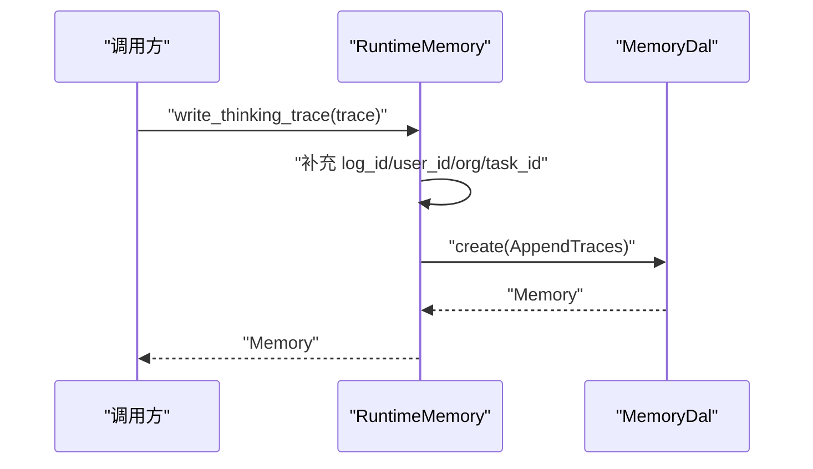
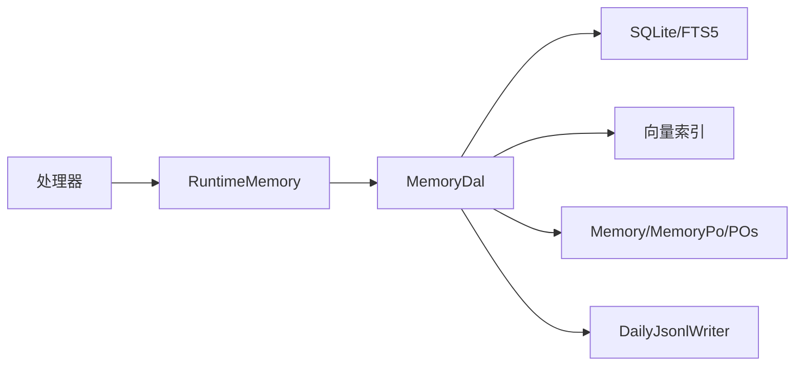

# 记忆系统架构

<cite>
**本文引用的文件**
- [src/service/dal/memory.rs](file://src/service/dal/memory.rs)
- [src/models/memory.rs](file://src/models/memory.rs)
- [src/service/domain/runtime/memory.rs](file://src/service/domain/runtime/memory.rs)
- [src/pkg/daily_jsonl.rs](file://src/pkg/daily_jsonl.rs)
- [src/handlers/hr/agent/save_short_term_memory.rs](file://src/handlers/hr/agent/save_short_term_memory.rs)
- [src/service/dal/mod.rs](file://src/service/dal/mod.rs)
- [docs/superpowers/specs/enhance-memory-search/checklist.md](file://docs/superpowers/specs/enhance-memory-search/checklist.md)
</cite>

## 目录
1. [简介](#简介)
2. [项目结构](#项目结构)
3. [核心组件](#核心组件)
4. [架构总览](#架构总览)
5. [详细组件分析](#详细组件分析)
6. [依赖关系分析](#依赖关系分析)
7. [性能考量](#性能考量)
8. [故障排查指南](#故障排查指南)
9. [结论](#结论)
10. [附录](#附录)

## 简介
本文件为 AI Orz 系统的“记忆系统”架构文档，聚焦四层记忆体系设计：核心认知（Core Memory）、工作记忆（Working Memory）、短期记忆（Short-Term Memory）、长期知识（Long-Term Knowledge）。文档说明每种记忆的存储位置、访问方式与生命周期管理；阐述运行时记忆（Runtime Memory）的“最薄封装”设计原则——100% 复用 DAL 层方法与结构体，零重复定义核心接口；并详细说明文件存储结构（按天 JSONL 文件）、索引机制（FTS5 + 向量）、检索策略（混合排序）与性能优化。文末提供架构图与数据流图，便于快速理解与落地。

## 项目结构
记忆系统横跨模型层、DAL 层、DAO 层、领域层与处理器层，关键路径如下：
- 模型层：MemoryTrace、ShortTermMemoryIndexPo、LongTermKnowledgeNodePo、KnowledgeReferencePo、Memory/MemoryPo、MemoryCreateParams
- DAL 层：MemoryDal（统一搜索、查询、创建/更新/删除、图谱遍历、沉淀、重建向量）
- DAO 层：SQLite 持久化、FTS5 全文检索、向量索引维护（集合名 memory:short_term / memory:knowledge_node）
- 领域层：RuntimeDomainImpl::RuntimeMemory（最薄封装，直接委托 DAL）
- 处理器层：保存短期记忆等 HTTP 入口，构造参数后调用 RuntimeDomain/DAL
- 文件存储：DailyJsonlWriter 按天写入 {YYYYMMDD}.jsonl，用于原始记忆追踪

图表来源
- [src/handlers/hr/agent/save_short_term_memory.rs:30-57](file://src/handlers/hr/agent/save_short_term_memory.rs#L30-L57)
- [src/service/domain/runtime/memory.rs:11-119](file://src/service/domain/runtime/memory.rs#L11-L119)
- [src/service/dal/memory.rs:70-177](file://src/service/dal/memory.rs#L70-L177)
- [src/models/memory.rs:15-424](file://src/models/memory.rs#L15-L424)
- [src/pkg/daily_jsonl.rs:1-110](file://src/pkg/daily_jsonl.rs#L1-L110)

章节来源
- [src/service/dal/mod.rs:1-52](file://src/service/dal/mod.rs#L1-L52)

## 核心组件
- 四层记忆类型
  - 核心认知（Core Memory）：以“知识节点”形式沉淀的核心事实与概念，存储在 SQLite 的 LongTermKnowledgeNodePo，支持发布与共享，具备向量索引与 FTS5 索引。
  - 工作记忆（Working Memory）：当前会话/任务上下文中的短期聚合摘要，对应 ShortTermMemoryIndexPo，作为 Agent 思考时的即时参考。
  - 短期记忆（Short-Term Memory）：对多条原始记忆细节进行归纳后的索引条目，包含 summary/tags/trace_ids，可被沉淀为长期知识。
  - 长期知识（Long-Term Knowledge）：从短期记忆中沉淀出的稳定知识节点，附带引用指向原始 trace 位置，支持图谱关系与推荐起点。
- 运行时记忆（Runtime Memory）：领域层的最薄封装，直接委托 DAL 方法，不引入额外抽象或重复接口。
- 存储与索引
  - 原始记忆追踪：按天 JSONL 文件（{base_path}/{YYYYMMDD}.jsonl），通过 DailyJsonlWriter 追加与定位行号。
  - 短期记忆索引：SQLite 表 + FTS5 全文索引 + 向量集合 memory:short_term。
  - 长期知识节点：SQLite 表 + FTS5 全文索引 + 向量集合 memory:knowledge_node + 关系表。
- 检索策略
  - 混合搜索：关键词命中（FTS5 BM25）+ 向量语义相似度，结果按 Hybrid → Vector → Keyword 分组排序，组内分别按向量距离升序或 fts_rank 升序。
  - 阈值控制：向量距离阈值可配置（默认 0.8），空 agent_id 时短期记忆走全局搜索，知识节点仅返回 published。

章节来源
- [src/models/memory.rs:15-424](file://src/models/memory.rs#L15-L424)
- [src/service/dal/memory.rs:70-177](file://src/service/dal/memory.rs#L70-L177)
- [src/service/domain/runtime/memory.rs:11-119](file://src/service/domain/runtime/memory.rs#L11-L119)
- [src/pkg/daily_jsonl.rs:1-110](file://src/pkg/daily_jsonl.rs#L1-L110)
- [docs/superpowers/specs/enhance-memory-search/checklist.md:18-59](file://docs/superpowers/specs/enhance-memory-search/checklist.md#L18-L59)

## 架构总览
下图展示记忆系统在请求处理中的端到端流程：处理器接收请求，构建 MemoryCreateParams，经 RuntimeMemory 最薄封装委托至 DAL，DAL 协调 DAO 完成 SQLite/FTS5/向量索引操作，必要时落盘 JSONL 原始追踪。

图表来源
- [src/handlers/hr/agent/save_short_term_memory.rs:30-57](file://src/handlers/hr/agent/save_short_term_memory.rs#L30-L57)
- [src/service/domain/runtime/memory.rs:39-67](file://src/service/domain/runtime/memory.rs#L39-L67)
- [src/service/dal/memory.rs:377-390](file://src/service/dal/memory.rs#L377-L390)
- [src/pkg/daily_jsonl.rs:54-73](file://src/pkg/daily_jsonl.rs#L54-L73)

## 详细组件分析

### 模型层：记忆实体与 PO
- MemoryTrace：原始记忆追踪，包含角色、输入输出、时间戳、元数据与物理位置（日期文件名 + 行号）。
- ShortTermMemoryIndexPo：短期记忆索引，summary/tags/trace_ids/status，实现 Vectorizable 以生成向量文本与集合名。
- LongTermKnowledgeNodePo：长期知识节点，node_description/summary/tags/is_published，实现 Vectorizable。
- KnowledgeReferencePo：知识节点引用原始短期索引与 trace 位置，支持溯源。
- Memory/MemoryPo：业务实体包装 PO 与 SearchMatchInfo，统一对外返回。
- MemoryCreateParams：统一写入参数，区分 AppendTraces/CreateShortTerm/CreateKnowledgeNode/CreateRelations。

图表来源
- [src/models/memory.rs:15-424](file://src/models/memory.rs#L15-L424)

章节来源
- [src/models/memory.rs:15-424](file://src/models/memory.rs#L15-L424)

### DAL 层：MemoryDal 统一编排
- 统一搜索 search：根据 filters.memory_type 选择短期/知识节点/关系搜索，合并结果并按 Hybrid → Vector → Keyword 排序。
- 通用查询 query：组合 DAO 查询短期与知识节点，转换为 Memory 业务实体。
- 推荐起点 recommend_seed_nodes：统计节点度数（入边+出边）返回 Top N。
- 创建/更新/删除 create/update/delete：按 MemoryCreateParams 变体分发，自动向量化或级联删除。
- 图谱遍历 traverse_knowledge_graph：BFS/DFS 遍历种子节点，限制深度与宽度，返回节点与关系。
- 沉淀 settle_short_term_to_long_term：将活跃短期记忆总结为知识节点，建立引用并标记已沉淀。
- 重建 rebuild_vectors：检测集合 model_provider_id，清空并重建向量索引。

图表来源
- [src/service/dal/memory.rs:190-276](file://src/service/dal/memory.rs#L190-L276)

章节来源
- [src/service/dal/memory.rs:70-177](file://src/service/dal/memory.rs#L70-L177)
- [src/service/dal/memory.rs:190-276](file://src/service/dal/memory.rs#L190-L276)

### 领域层：RuntimeMemory 最薄封装
- get_recent_context：按 agent_id 查询近期短期记忆。
- write_thinking_trace：补充上下文信息后，调用 DAL 写入原始追踪。
- search/query/recommend_seed_nodes/create/update/delete/traverse_graph：全部直接委托 DAL，无重复接口定义。

图表来源
- [src/service/domain/runtime/memory.rs:39-67](file://src/service/domain/runtime/memory.rs#L39-L67)
- [src/service/dal/memory.rs:377-390](file://src/service/dal/memory.rs#L377-L390)

章节来源
- [src/service/domain/runtime/memory.rs:11-119](file://src/service/domain/runtime/memory.rs#L11-L119)

### 处理器层：保存短期记忆
- 构造 ShortTermMemoryIndexPo，设置 agent_id/task_id/role/summary/tags/trace_ids/status。
- 使用 MemoryCreateParams::CreateShortTerm 调用 runtime_domain().memory().create。
- 返回 memory_id。

章节来源
- [src/handlers/hr/agent/save_short_term_memory.rs:30-57](file://src/handlers/hr/agent/save_short_term_memory.rs#L30-L57)

### 文件存储：按天 JSONL
- DailyJsonlWriter 按日期分区写入 {YYYYMMDD}.jsonl，每次 append 返回 (date_path, line_number)。
- 支持 read_line/read_line_json 按行读取与反序列化。
- 用于 MemoryTrace 的物理位置记录，支撑溯源与引用。

章节来源
- [src/pkg/daily_jsonl.rs:1-110](file://src/pkg/daily_jsonl.rs#L1-L110)

## 依赖关系分析
- 模块耦合
  - RuntimeMemory 依赖 DAL（MemoryDal），无业务逻辑重复。
  - DAL 依赖 DAO（SQLite/FTS5/向量）与模型层（Memory/MemoryPo/POs）。
  - 处理器依赖 RuntimeMemory 与模型层参数构造。
- 外部依赖
  - 向量集合命名：memory:short_term、memory:knowledge_node。
  - FTS5 全文检索：BM25 相关性排序。
- 潜在循环依赖
  - 通过 DAL 单例与 DAO trait 解耦，避免循环。
- 集成点
  - Embedding Provider 切换与重建：rebuild_vectors 检测集合 provider_id 并重建。
  - 全局搜索与过滤：空 agent_id 时短期记忆不过滤，知识节点仅返回 published。

图表来源
- [src/service/dal/memory.rs:70-177](file://src/service/dal/memory.rs#L70-L177)
- [src/models/memory.rs:15-424](file://src/models/memory.rs#L15-L424)
- [src/pkg/daily_jsonl.rs:1-110](file://src/pkg/daily_jsonl.rs#L1-L110)

章节来源
- [src/service/dal/memory.rs:70-177](file://src/service/dal/memory.rs#L70-L177)
- [src/models/memory.rs:15-424](file://src/models/memory.rs#L15-L424)

## 性能考量
- 混合搜索排序
  - Hybrid 优先，Vector 次之，Keyword 最后；组内按向量距离或 fts_rank 升序。
  - 向量距离阈值可配置（默认 0.8），避免低质量召回。
- 向量重建
  - 检测集合 model_provider_id，按需清空并重建，单条失败不影响整体。
- 文件 I/O
  - 按天分片减少单文件大小，append 模式降低锁竞争；行号定位支持随机读取。
- 降级策略
  - 向量化失败降级为关键词搜索；向量索引删除失败不影响主流程。
- 分页与截断
  - 搜索结果应用 limit，避免大结果集拖慢响应。

章节来源
- [docs/superpowers/specs/enhance-memory-search/checklist.md:18-59](file://docs/superpowers/specs/enhance-memory-search/checklist.md#L18-L59)
- [src/service/dal/memory.rs:654-799](file://src/service/dal/memory.rs#L654-L799)
- [src/pkg/daily_jsonl.rs:54-73](file://src/pkg/daily_jsonl.rs#L54-L73)

## 故障排查指南
- 向量索引异常
  - 现象：更新/删除/重建时日志 warn 向量索引失败。
  - 排查：检查 Embedding Provider 是否可用；确认集合 model_provider_id 一致；查看向量集合是否存在。
- FTS5 搜索无结果
  - 现象：关键词搜索为空。
  - 排查：确认关键词非空；检查 FTS5 索引是否重建；验证特殊字符转义。
- 短期记忆未沉淀
  - 现象：settle_short_term_to_long_term 返回空。
  - 排查：确认存在 status=Active 的短期记忆；检查 agent_id 过滤；查看日志“无未沉淀的短期记忆”。
- 原始追踪不可读
  - 现象：按 date_path + line_number 读取失败。
  - 排查：确认文件存在；行号范围正确；JSONL 格式完整。

章节来源
- [src/service/dal/memory.rs:400-506](file://src/service/dal/memory.rs#L400-L506)
- [src/service/dal/memory.rs:654-799](file://src/service/dal/memory.rs#L654-L799)
- [src/pkg/daily_jsonl.rs:75-103](file://src/pkg/daily_jsonl.rs#L75-L103)

## 结论
AI Orz 的记忆系统采用四层设计，清晰划分短期与长期知识的生命周期与职责；DAL 层承担跨 DAO 的流程编排与混合检索策略；领域层 RuntimeMemory 坚持“最薄封装”，100% 复用 DAL 方法与结构体，零重复定义核心接口；文件存储按天分片，结合 FTS5 与向量索引实现高效检索与溯源。通过阈值控制、降级策略与重建机制，系统在可用性、可扩展性与性能之间取得平衡。

## 附录
- 术语
  - Core Memory：核心认知，以知识节点形式沉淀的稳定知识。
  - Working Memory：工作记忆，当前会话/任务的短期聚合摘要。
  - Short-Term Memory：短期记忆，对原始细节的归纳索引，可沉淀为长期知识。
  - Long-Term Knowledge：长期知识，从短期记忆沉淀的知识节点，支持图谱关系与发布共享。
  - Runtime Memory：运行时记忆，领域层对 DAL 的最薄封装。
- 关键路径
  - 写入：处理器 → RuntimeMemory → DAL → DAO（SQLite/FTS5/向量）→ 文件存储（JSONL）
  - 检索：DAL 统一 search → 混合排序 → 返回 Memory 列表
  - 沉淀：DAL 批量处理 Active 短期记忆 → 创建知识节点 → 标记已沉淀