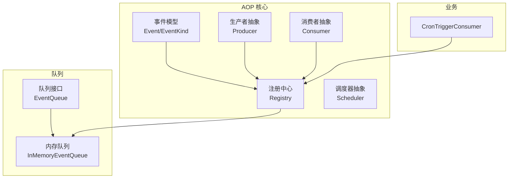
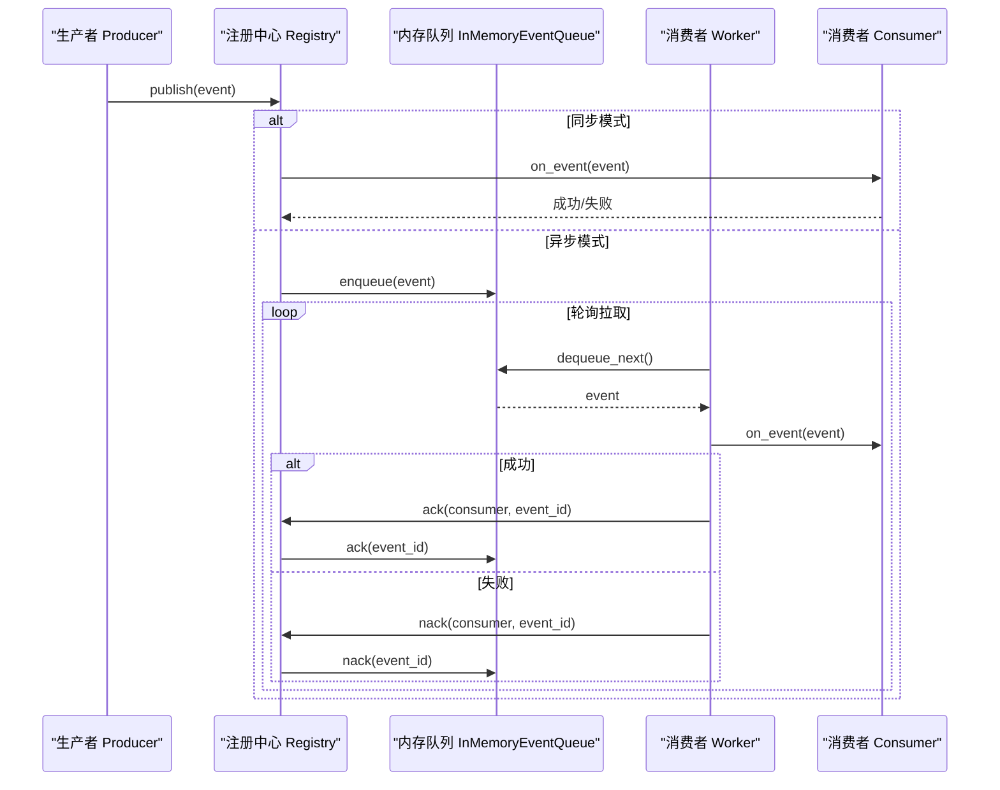
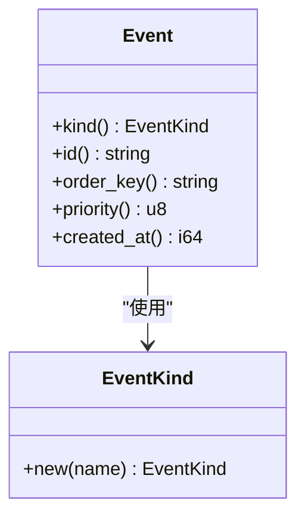
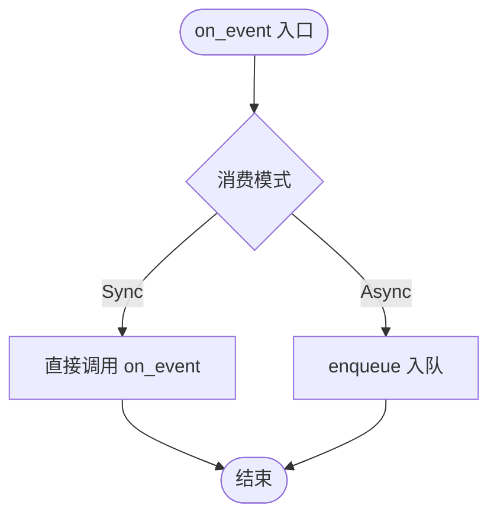
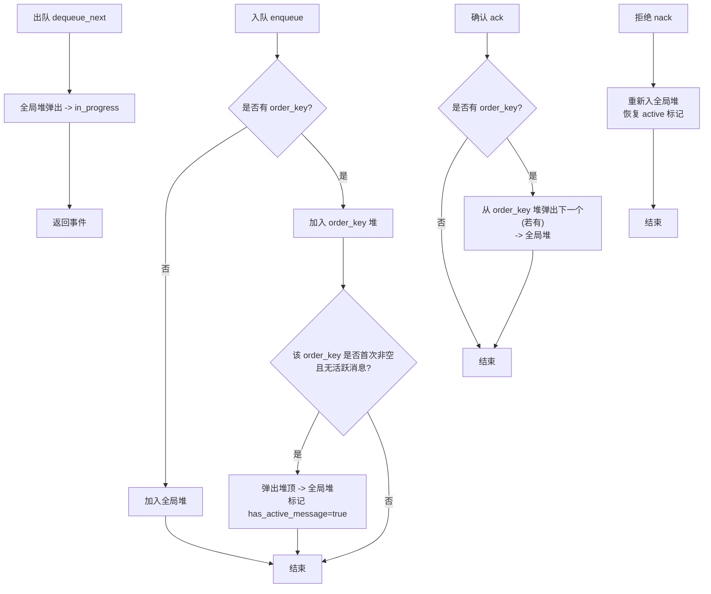
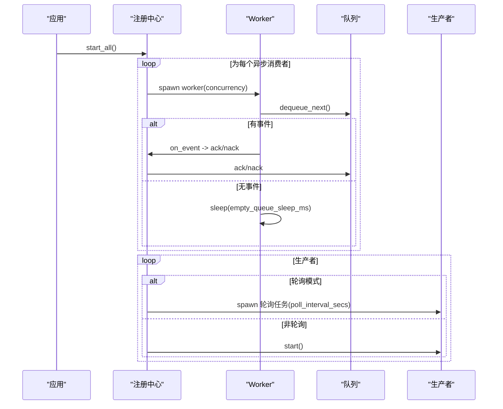
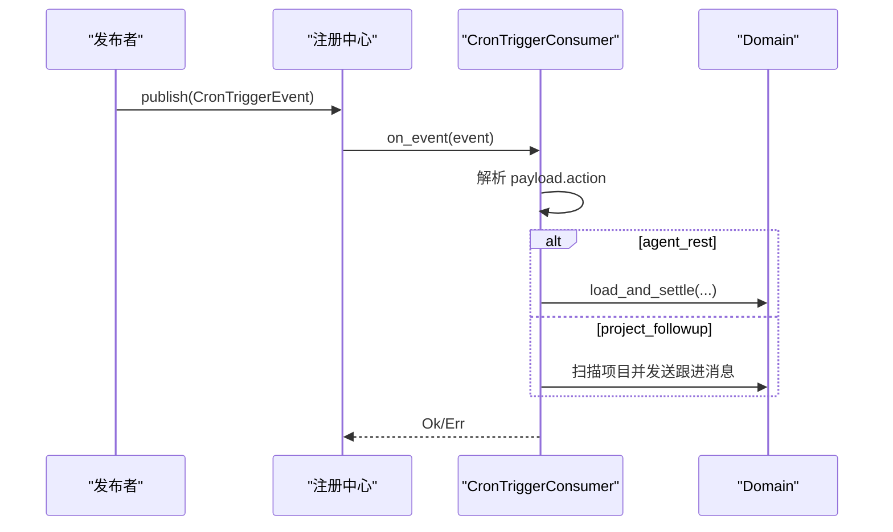
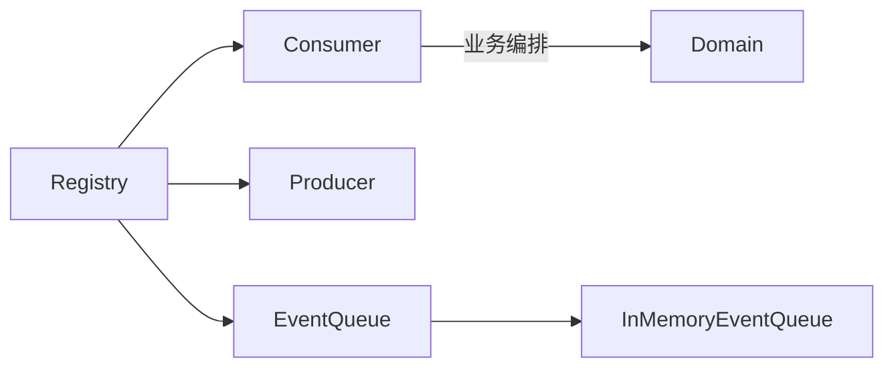

# 事件调度器

<cite>
**本文引用的文件**
- [src/pkg/aop/core/mod.rs](file://src/pkg/aop/core/mod.rs)
- [src/pkg/aop/core/event.rs](file://src/pkg/aop/core/event.rs)
- [src/pkg/aop/core/consumer.rs](file://src/pkg/aop/core/consumer.rs)
- [src/pkg/aop/core/producer.rs](file://src/pkg/aop/core/producer.rs)
- [src/pkg/aop/core/scheduler.rs](file://src/pkg/aop/core/scheduler.rs)
- [src/pkg/aop/core/registry.rs](file://src/pkg/aop/core/registry.rs)
- [src/pkg/aop/queue/mod.rs](file://src/pkg/aop/queue/mod.rs)
- [src/pkg/aop/queue/in_memory.rs](file://src/pkg/aop/queue/in_memory.rs)
- [src/consumer/scheduler.rs](file://src/consumer/scheduler.rs)
</cite>

## 目录
1. [简介](#简介)
2. [项目结构](#项目结构)
3. [核心组件](#核心组件)
4. [架构总览](#架构总览)
5. [详细组件分析](#详细组件分析)
6. [依赖关系分析](#依赖关系分析)
7. [性能与并发特性](#性能与并发特性)
8. [配置与调优指南](#配置与调优指南)
9. [监控与调试](#监控与调试)
10. [故障排查](#故障排查)
11. [结论](#结论)

## 简介
本文件面向 AOP 事件调度器的设计与实现，系统性说明其工作原理、轮询机制、任务调度与并发控制策略；解释事件处理的优先级排序算法（基于 order_key 的有序处理与基于 priority 的优先级调度）；文档化生命周期管理（启动、停止、资源清理）；说明错误处理机制（失败重试、退避、超时控制与异常恢复）；给出关键配置项与调优建议；并提供监控与调试方法，包括指标采集与故障诊断工具的使用。

## 项目结构
AOP 事件系统位于 src/pkg/aop 下，采用“核心接口 + 队列实现 + 注册中心”的分层设计：
- 核心接口：事件模型、生产者/消费者抽象、调度器抽象、注册中心
- 队列实现：内存队列 InMemoryEventQueue（支持按 order_key 有序、priority 优先）
- 业务消费者：CronTriggerConsumer（订阅 cron.trigger 事件并编排 Domain 逻辑）
- 注册中心：Registry（负责发布、路由、异步消费 worker 启动、轮询生产者调度）

图表来源
- [src/pkg/aop/core/mod.rs:1-14](file://src/pkg/aop/core/mod.rs#L1-L14)
- [src/pkg/aop/core/event.rs:1-25](file://src/pkg/aop/core/event.rs#L1-L25)
- [src/pkg/aop/core/producer.rs:1-36](file://src/pkg/aop/core/producer.rs#L1-L36)
- [src/pkg/aop/core/consumer.rs:1-72](file://src/pkg/aop/core/consumer.rs#L1-L72)
- [src/pkg/aop/core/registry.rs:1-561](file://src/pkg/aop/core/registry.rs#L1-L561)
- [src/pkg/aop/queue/mod.rs:1-107](file://src/pkg/aop/queue/mod.rs#L1-L107)
- [src/pkg/aop/queue/in_memory.rs:1-449](file://src/pkg/aop/queue/in_memory.rs#L1-L449)
- [src/consumer/scheduler.rs:1-211](file://src/consumer/scheduler.rs#L1-L211)

章节来源
- [src/pkg/aop/core/mod.rs:1-14](file://src/pkg/aop/core/mod.rs#L1-L14)
- [src/pkg/aop/core/event.rs:1-25](file://src/pkg/aop/core/event.rs#L1-L25)
- [src/pkg/aop/core/consumer.rs:1-72](file://src/pkg/aop/core/consumer.rs#L1-L72)
- [src/pkg/aop/core/producer.rs:1-36](file://src/pkg/aop/core/producer.rs#L1-L36)
- [src/pkg/aop/core/registry.rs:1-561](file://src/pkg/aop/core/registry.rs#L1-L561)
- [src/pkg/aop/queue/mod.rs:1-107](file://src/pkg/aop/queue/mod.rs#L1-L107)
- [src/pkg/aop/queue/in_memory.rs:1-449](file://src/pkg/aop/queue/in_memory.rs#L1-L449)
- [src/consumer/scheduler.rs:1-211](file://src/consumer/scheduler.rs#L1-L211)

## 核心组件
- 事件模型 Event/EventKind：定义事件类型、ID、order_key、priority、created_at 等元信息，供统一注入到 JSON 中以便队列与监控读取。
- 生产者 Producer：可轮询或自管生命周期，通过 poll_interval_secs 决定由 Registry 定时调用 poll() 还是自行 start()。
- 消费者 Consumer：支持同步 Sync 与异步 Async 两种模式；Async 模式具备 ack/nack、concurrency、empty_queue_sleep_ms、error_retry_sleep_ms 等能力。
- 队列 EventQueue：提供 enqueue/dequeue_next/ack/nack/stats/query_events/get_event 等能力；InMemoryEventQueue 实现内存中的有序优先队列。
- 注册中心 Registry：维护消费者/生产者集合，负责发布路由、异步 worker 启动、轮询生产者调度、指标埋点、队列统计与查询。

章节来源
- [src/pkg/aop/core/event.rs:1-25](file://src/pkg/aop/core/event.rs#L1-L25)
- [src/pkg/aop/core/consumer.rs:1-72](file://src/pkg/aop/core/consumer.rs#L1-L72)
- [src/pkg/aop/core/producer.rs:1-36](file://src/pkg/aop/core/producer.rs#L1-L36)
- [src/pkg/aop/queue/mod.rs:1-107](file://src/pkg/aop/queue/mod.rs#L1-L107)
- [src/pkg/aop/core/registry.rs:1-561](file://src/pkg/aop/core/registry.rs#L1-L561)

## 架构总览
AOP 事件调度器以 Registry 为中心，协调 Producer 生产事件、Consumer 消费事件、EventQueue 承载消息流转。同步消费者在发布线程直接执行 on_event；异步消费者入队后由多 worker 拉取处理，并通过 ack/nack 完成确认与重试。

图表来源
- [src/pkg/aop/core/registry.rs:97-206](file://src/pkg/aop/core/registry.rs#L97-L206)
- [src/pkg/aop/core/registry.rs:260-487](file://src/pkg/aop/core/registry.rs#L260-L487)
- [src/pkg/aop/queue/in_memory.rs:104-267](file://src/pkg/aop/queue/in_memory.rs#L104-L267)

## 详细组件分析

### 事件模型与元数据注入
- Event trait 暴露 kind/id/order_key/priority/created_at，用于统一元数据提取。
- Registry.publish 将元字段注入到事件 JSON 顶层，确保队列与监控一致读取。

图表来源
- [src/pkg/aop/core/event.rs:1-25](file://src/pkg/aop/core/event.rs#L1-L25)
- [src/pkg/aop/core/registry.rs:116-142](file://src/pkg/aop/core/registry.rs#L116-L142)

章节来源
- [src/pkg/aop/core/event.rs:1-25](file://src/pkg/aop/core/event.rs#L1-L25)
- [src/pkg/aop/core/registry.rs:97-206](file://src/pkg/aop/core/registry.rs#L97-L206)

### 消费者抽象与模式
- ConsumeMode::Sync：发布时立即调用 on_event，适合轻量处理。
- ConsumeMode::Async：事件入队，由 worker 拉取处理；支持 concurrency、空队列休眠、错误重试休眠。
- should_consume 可用于过滤事件。

图表来源
- [src/pkg/aop/core/consumer.rs:1-72](file://src/pkg/aop/core/consumer.rs#L1-L72)
- [src/pkg/aop/core/registry.rs:144-206](file://src/pkg/aop/core/registry.rs#L144-L206)

章节来源
- [src/pkg/aop/core/consumer.rs:1-72](file://src/pkg/aop/core/consumer.rs#L1-L72)
- [src/pkg/aop/core/registry.rs:144-206](file://src/pkg/aop/core/registry.rs#L144-L206)

### 内存队列与优先级/有序处理
- 数据结构：全局 BinaryHeap + 每个 order_key 一个 BinaryHeap + in_progress 映射 + has_active_message 标记。
- 入队：无 order_key 进入全局堆；有 order_key 进入对应堆，若该 order_key 之前为空且当前无活跃消息，则将堆顶推入全局堆并标记 active。
- 出队：从全局堆弹出，放入 in_progress。
- 确认/拒绝：ack 移除事件并从对应 order_key 堆弹出下一个（若有），nack 重新入全局堆并恢复 active 标记。
- 排序规则：先按 priority 降序，再按 created_at 降序（更晚创建者优先）。

图表来源
- [src/pkg/aop/queue/in_memory.rs:104-267](file://src/pkg/aop/queue/in_memory.rs#L104-L267)

章节来源
- [src/pkg/aop/queue/in_memory.rs:1-449](file://src/pkg/aop/queue/in_memory.rs#L1-L449)

### 注册中心与生命周期管理
- 启动 start_all：
  - 原子标记 started，避免重复启动。
  - 为每个 Async 消费者启动 concurrency 个 worker，循环 dequeue_for -> on_event -> ack/nack。
  - 对 Producer：poll_interval_secs > 0 则 spawn 轮询任务；否则调用 start()。
- 停止 stop：当前未暴露显式 stop_all；可通过外部进程终止或扩展实现优雅关闭。
- 资源清理：clear 仅暴露于队列接口；Registry 未提供集中清理 API。

图表来源
- [src/pkg/aop/core/registry.rs:260-487](file://src/pkg/aop/core/registry.rs#L260-L487)

章节来源
- [src/pkg/aop/core/registry.rs:260-487](file://src/pkg/aop/core/registry.rs#L260-L487)

### 业务消费者示例：CronTriggerConsumer
- 订阅事件：cron.trigger
- 消费模式：Sync（发布即处理）
- 动作分发：agent_rest、project_followup 等，调用 Domain 层完成记忆沉淀与项目跟进通知。

图表来源
- [src/consumer/scheduler.rs:1-211](file://src/consumer/scheduler.rs#L1-L211)

章节来源
- [src/consumer/scheduler.rs:1-211](file://src/consumer/scheduler.rs#L1-L211)

## 依赖关系分析
- Registry 依赖：
  - Consumer/Producer 抽象
  - EventQueue 抽象及 InMemoryEventQueue 实现
  - RequestContext（跨层上下文）
  - 指标钩子 AopMetricsHook（可选）
- InMemoryEventQueue 依赖：
  - std::collections::{BinaryHeap, HashMap}
  - std::sync::Mutex
  - UnsafeCell 用于内部可变访问
- 业务消费者依赖 Domain 层服务（单向调用，符合分层规范）

图表来源
- [src/pkg/aop/core/registry.rs:1-561](file://src/pkg/aop/core/registry.rs#L1-L561)
- [src/pkg/aop/queue/mod.rs:1-107](file://src/pkg/aop/queue/mod.rs#L1-L107)
- [src/pkg/aop/queue/in_memory.rs:1-449](file://src/pkg/aop/queue/in_memory.rs#L1-L449)
- [src/consumer/scheduler.rs:1-211](file://src/consumer/scheduler.rs#L1-L211)

章节来源
- [src/pkg/aop/core/registry.rs:1-561](file://src/pkg/aop/core/registry.rs#L1-L561)
- [src/pkg/aop/queue/mod.rs:1-107](file://src/pkg/aop/queue/mod.rs#L1-L107)
- [src/pkg/aop/queue/in_memory.rs:1-449](file://src/pkg/aop/queue/in_memory.rs#L1-L449)
- [src/consumer/scheduler.rs:1-211](file://src/consumer/scheduler.rs#L1-L211)

## 性能与并发特性
- 并发模型：
  - 同步消费者：单线程顺序执行，低开销但可能阻塞发布方。
  - 异步消费者：每个消费者可配置 concurrency（默认 1），多个 worker 并行拉取处理。
- 队列复杂度：
  - 入队/出队/确认/拒绝均为 O(log N)（BinaryHeap）。
  - order_key 维度隔离，避免不同 key 间竞争。
- 锁粒度：
  - InMemoryEventQueue 使用 Mutex 保护共享状态，临界区尽量短。
- 吞吐与延迟：
  - 高优先级事件优先处理；同优先级内较晚创建的事件优先。
  - 空队列时 worker 休眠 empty_queue_sleep_ms 降低 CPU 占用。
  - 处理失败后休眠 error_retry_sleep_ms 避免紧密自旋。

[本节为通用性能讨论，不直接分析具体文件]

## 配置与调优指南
- 消费者并发数 concurrency：
  - 适用于异步消费者；根据 CPU 与下游 IO 能力调整，避免过度并发导致争用。
- 空队列休眠 empty_queue_sleep_ms：
  - 控制空闲时的轮询频率；值越大越省电，但延迟略增。
- 错误重试休眠 error_retry_sleep_ms：
  - 控制失败后的退避间隔；值越大越能缓解下游压力，但重试延迟增加。
- 生产者轮询间隔 poll_interval_secs：
  - 大于 0 表示轮询模式；根据上游数据到达频率设置，兼顾实时性与负载。
- 事件优先级 priority：
  - 数值越大优先级越高；结合 order_key 保证同一 key 内的有序性。
- 事件有序键 order_key：
  - 用于限制同一业务实体（如某个 Agent/项目）的顺序处理；避免乱序导致的竞态。

[本节为通用配置指导，不直接分析具体文件]

## 监控与调试
- 指标埋点：
  - Registry 在发布、消费开始、成功、失败处调用 AopMetricsHook，便于收集吞吐、延迟、错误率等指标。
- 队列统计：
  - QueueStats：pending_count、in_progress_count、各 order_key 的 pending 数量、最老事件年龄。
  - all_queue_stats / queue_stats：聚合或指定消费者的队列统计。
- 事件查询：
  - query_events：支持按 order_key、status、分页过滤。
  - get_event：获取单个事件的脱敏预览（前 200 字符）。
- 日志定位：
  - 关键路径均有 sys_info/sys_warn/sys_error 日志，包含 consumer_name、event_id、错误信息等。

章节来源
- [src/pkg/aop/core/registry.rs:489-553](file://src/pkg/aop/core/registry.rs#L489-L553)
- [src/pkg/aop/queue/mod.rs:10-107](file://src/pkg/aop/queue/mod.rs#L10-L107)
- [src/pkg/aop/queue/in_memory.rs:300-449](file://src/pkg/aop/queue/in_memory.rs#L300-L449)

## 故障排查
- 常见问题
  - 事件堆积：检查队列 stats 的 pending_count 与 oldest_event_age_secs；适当提升 concurrency 或优化 on_event 耗时。
  - 死锁/卡住：确认 ack/nack 均被正确调用；Registry 会在成功/失败后分别调用 queue.ack/nack，避免事件滞留 in_progress。
  - 顺序错乱：检查 order_key 是否正确设置；同一 order_key 内严格有序，不同 key 之间按 priority 与 created_at 排序。
  - 高频重试：关注 error_retry_sleep_ms 是否过小；过大错误会导致频繁重试与 CPU 占用。
- 诊断步骤
  - 使用 queue_stats 查看各消费者队列健康度。
  - 使用 query_events 筛选 Pending/Processing 事件，定位问题事件。
  - 使用 get_event 查看事件内容预览，核对 payload 与元数据。
  - 结合日志中的 consumer_name、event_id、错误栈快速定位。

章节来源
- [src/pkg/aop/core/registry.rs:260-487](file://src/pkg/aop/core/registry.rs#L260-L487)
- [src/pkg/aop/queue/in_memory.rs:208-267](file://src/pkg/aop/queue/in_memory.rs#L208-L267)
- [src/pkg/aop/queue/in_memory.rs:300-449](file://src/pkg/aop/queue/in_memory.rs#L300-L449)

## 结论
AOP 事件调度器通过清晰的抽象与解耦，实现了灵活的事件路由、有序的优先级调度与可控的并发处理。内存队列以 order_key 隔离与 priority 排序保障关键业务的一致性；注册中心统一管理生命周期与指标埋点，便于运维观测与调优。实际使用中应合理配置 concurrency、sleep 参数与 poll_interval，并结合监控与日志进行持续优化。