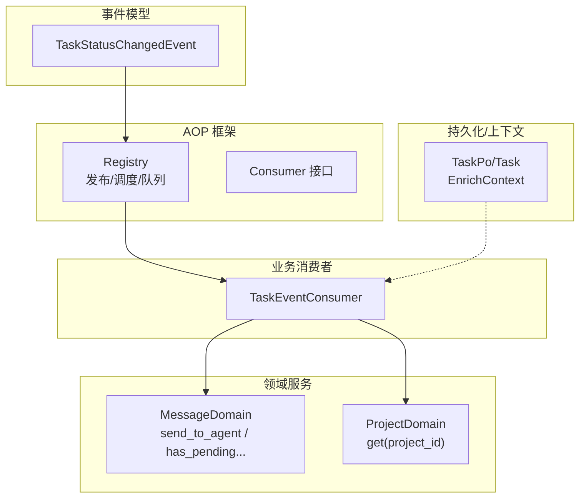
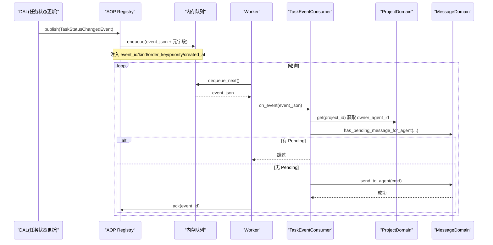
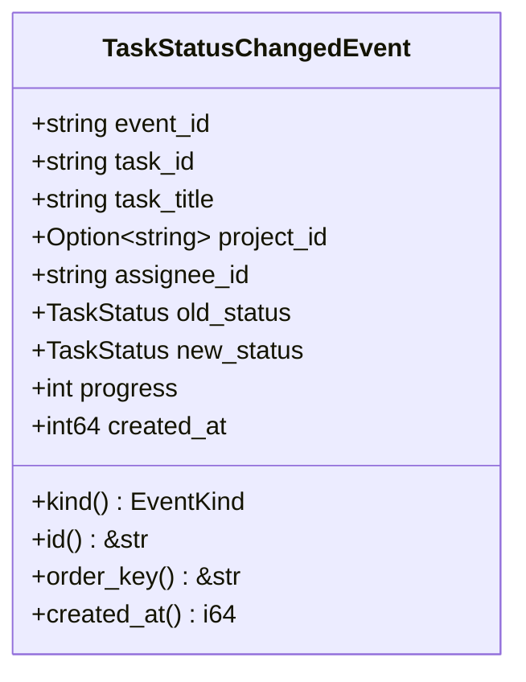
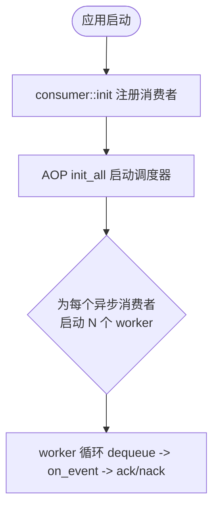
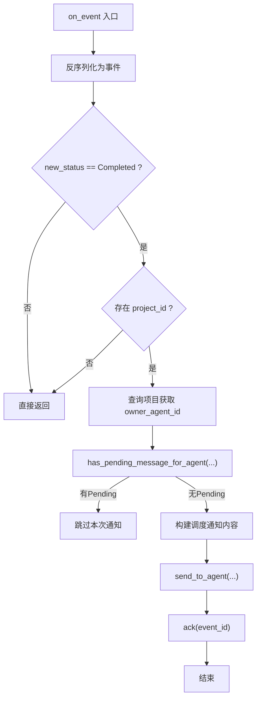
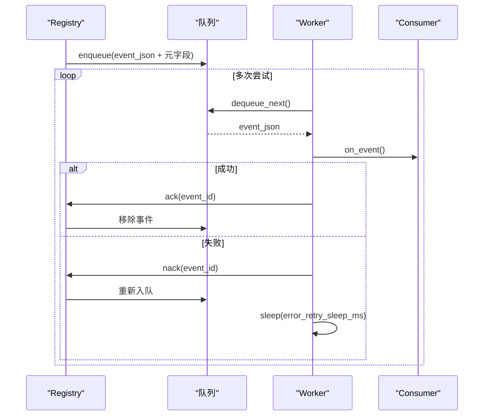
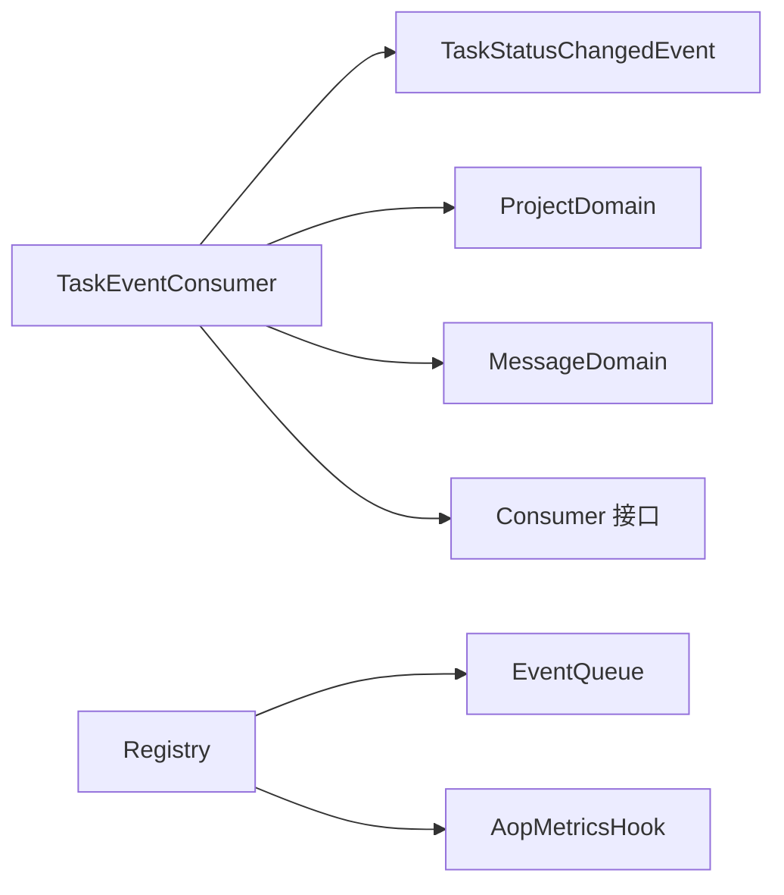

# 任务事件消费者

<cite>
**本文引用的文件**
- [task_event_consumer.rs](file://src/consumer/task_event_consumer.rs)
- [mod.rs（consumer）](file://src/consumer/mod.rs)
- [mod.rs（AOP）](file://src/pkg/aop/mod.rs)
- [registry.rs](file://src/pkg/aop/core/registry.rs)
- [consumer.rs](file://src/pkg/aop/core/consumer.rs)
- [task_status.rs](file://src/models/events/task_status.rs)
- [mod.rs（events）](file://src/models/events/mod.rs)
- [task.rs](file://src/models/task.rs)
- [project/mod.rs](file://src/service/domain/project/mod.rs)
- [message/mod.rs](file://src/service/domain/message/mod.rs)
</cite>

## 目录
1. [简介](#简介)
2. [项目结构](#项目结构)
3. [核心组件](#核心组件)
4. [架构总览](#架构总览)
5. [详细组件分析](#详细组件分析)
6. [依赖关系分析](#依赖关系分析)
7. [性能与并发优化](#性能与并发优化)
8. [故障排查指南](#故障排查指南)
9. [结论](#结论)
10. [附录：配置、监控与集成](#附录配置监控与集成)

## 简介
本文件面向“任务事件消费者”，系统性说明任务事件的监听、解析与处理流程，覆盖状态变更、进度更新与完成通知的处理逻辑；解释事件去重、排序与一致性保证机制；说明失败重试、错误分类与告警触发；给出性能优化、批量与异步策略；并提供配置、监控指标与故障排查指南；最后说明与任务调度器、通知系统与审计日志的集成方式。

## 项目结构
围绕任务事件消费的关键代码分布在以下位置：
- 事件模型定义：models/events/task_status.rs
- AOP 事件中心与调度：pkg/aop 下的 core 模块与入口
- 业务消费者注册：consumer/mod.rs
- 任务事件消费者实现：consumer/task_event_consumer.rs
- 消息投递与去重能力：service/domain/message/mod.rs
- 项目域查询（用于定位 Owner Agent）：service/domain/project/mod.rs
- 任务实体与上下文注入：models/task.rs

**图表来源**
- [task_status.rs:1-66](file://src/models/events/task_status.rs#L1-L66)
- [registry.rs:97-206](file://src/pkg/aop/core/registry.rs#L97-L206)
- [consumer.rs:24-72](file://src/pkg/aop/core/consumer.rs#L24-L72)
- [task_event_consumer.rs:38-137](file://src/consumer/task_event_consumer.rs#L38-L137)
- [message/mod.rs:107-117](file://src/service/domain/message/mod.rs#L107-L117)
- [project/mod.rs:131-133](file://src/service/domain/project/mod.rs#L131-L133)
- [task.rs:317-332](file://src/models/task.rs#L317-L332)

**章节来源**
- [task_event_consumer.rs:1-138](file://src/consumer/task_event_consumer.rs#L1-L138)
- [mod.rs（consumer）:1-43](file://src/consumer/mod.rs#L1-L43)
- [mod.rs（AOP）:1-61](file://src/pkg/aop/mod.rs#L1-L61)
- [registry.rs:1-561](file://src/pkg/aop/core/registry.rs#L1-L561)
- [consumer.rs:1-72](file://src/pkg/aop/core/consumer.rs#L1-L72)
- [task_status.rs:1-66](file://src/models/events/task_status.rs#L1-L66)
- [mod.rs（events）:1-21](file://src/models/events/mod.rs#L1-L21)
- [task.rs:1-343](file://src/models/task.rs#L1-L343)
- [project/mod.rs:1-539](file://src/service/domain/project/mod.rs#L1-L539)
- [message/mod.rs:1-378](file://src/service/domain/message/mod.rs#L1-L378)

## 核心组件
- 事件模型 TaskStatusChangedEvent：携带 task_id、project_id、old/new_status、progress 等字段，并实现 Event trait，提供 kind、id、order_key、created_at。
- AOP Registry：负责事件分发、序列化元信息注入、同步/异步消费模式路由、worker 启动、ack/nack、指标埋点。
- Consumer 接口：统一 on_event、consume_mode、concurrency、empty_queue_sleep_ms、error_retry_sleep_ms 等能力。
- TaskEventConsumer：订阅 task.status_changed，仅处理 Completed 状态，进行去重后向项目 Owner Agent 发送调度通知。
- MessageDomain：提供 send_to_agent 与 has_pending_message_for_agent，用于去重与投递。
- ProjectDomain：根据 project_id 获取项目以定位 owner_agent_id。
- TaskPo/Task：通过 EnrichContext 将 task_id、project_id 注入 RequestContext，便于后续链路追踪。

**章节来源**
- [task_status.rs:5-66](file://src/models/events/task_status.rs#L5-L66)
- [consumer.rs:6-72](file://src/pkg/aop/core/consumer.rs#L6-L72)
- [registry.rs:97-206](file://src/pkg/aop/core/registry.rs#L97-L206)
- [task_event_consumer.rs:38-137](file://src/consumer/task_event_consumer.rs#L38-L137)
- [message/mod.rs:107-117](file://src/service/domain/message/mod.rs#L107-L117)
- [project/mod.rs:131-133](file://src/service/domain/project/mod.rs#L131-L133)
- [task.rs:317-332](file://src/models/task.rs#L317-L332)

## 架构总览
任务事件从 DAL 层发布后，经 AOP 框架分发到已注册的消费者。TaskEventConsumer 以异步模式消费，对 Completed 状态进行过滤、去重，然后调用消息域向 Owner Agent 发送调度通知。

**图表来源**
- [registry.rs:97-206](file://src/pkg/aop/core/registry.rs#L97-L206)
- [registry.rs:208-449](file://src/pkg/aop/core/registry.rs#L208-L449)
- [task_event_consumer.rs:52-137](file://src/consumer/task_event_consumer.rs#L52-L137)
- [message/mod.rs:107-117](file://src/service/domain/message/mod.rs#L107-L117)
- [project/mod.rs:131-133](file://src/service/domain/project/mod.rs#L131-L133)

## 详细组件分析

### 事件模型与顺序键
- TaskStatusChangedEvent 实现了 Event trait，其中 order_key 基于 task_id，确保同一任务的顺序性。
- created_at 使用毫秒时间戳，便于时序分析与延迟度量。

**图表来源**
- [task_status.rs:5-66](file://src/models/events/task_status.rs#L5-L66)

**章节来源**
- [task_status.rs:5-66](file://src/models/events/task_status.rs#L5-L66)

### 消费者注册与生命周期
- consumer::init 在应用启动时注册所有业务消费者，包括 TaskEventConsumer。
- AOP init_all 启动调度器，为每个异步消费者创建 worker 循环拉取队列事件。

**图表来源**
- [mod.rs（consumer）:16-37](file://src/consumer/mod.rs#L16-L37)
- [mod.rs（AOP）:53-61](file://src/pkg/aop/mod.rs#L53-L61)
- [registry.rs:260-449](file://src/pkg/aop/core/registry.rs#L260-L449)

**章节来源**
- [mod.rs（consumer）:16-37](file://src/consumer/mod.rs#L16-L37)
- [mod.rs（AOP）:53-61](file://src/pkg/aop/mod.rs#L53-L61)
- [registry.rs:260-449](file://src/pkg/aop/core/registry.rs#L260-L449)

### 任务事件处理流程（核心）
- 反序列化为 TaskStatusChangedEvent。
- 仅当 new_status == Completed 时继续处理。
- 若缺少 project_id 则直接返回。
- 通过 ProjectDomain.get 获取项目，定位 owner_agent_id。
- 通过 MessageDomain.has_pending_message_for_agent 检查是否已有同类型 Pending 消息，避免重复通知。
- 构建任务调度通知内容并调用 send_to_agent 投递。
- 成功处理后由 worker 调用 ack，失败则 nack 并退避重试。

**图表来源**
- [task_event_consumer.rs:52-137](file://src/consumer/task_event_consumer.rs#L52-L137)
- [message/mod.rs:107-117](file://src/service/domain/message/mod.rs#L107-L117)
- [project/mod.rs:131-133](file://src/service/domain/project/mod.rs#L131-L133)

**章节来源**
- [task_event_consumer.rs:52-137](file://src/consumer/task_event_consumer.rs#L52-L137)

### 去重、排序与一致性保证
- 去重：通过 MessageDomain.has_pending_message_for_agent 针对特定 Agent 与消息类型进行 Pending 检测，避免重复调度通知。
- 排序：事件 order_key 基于 task_id，确保同一任务的事件按序处理，避免乱序导致的补偿或通知错乱。
- 一致性：
  - 发布前注入统一元字段（event_id、kind、order_key、priority、created_at），便于追踪与统计。
  - Worker 成功处理调用 ack 移除事件；失败调用 nack 并重试，配合 error_retry_sleep_ms 退避，避免紧密自旋。
  - 队列支持 stats、query_events、get_event 等诊断能力，便于定位卡死或堆积问题。

**图表来源**
- [registry.rs:97-206](file://src/pkg/aop/core/registry.rs#L97-L206)
- [registry.rs:208-449](file://src/pkg/aop/core/registry.rs#L208-L449)

**章节来源**
- [registry.rs:97-206](file://src/pkg/aop/core/registry.rs#L97-L206)
- [registry.rs:208-449](file://src/pkg/aop/core/registry.rs#L208-L449)

### 失败重试、错误分类与告警
- 重试机制：on_event 抛错时，worker 调用 nack 并将事件重新入队；每次失败后 sleep(error_retry_sleep_ms)，防止 CPU 自旋。
- 错误分类：
  - 反序列化失败：内部错误，记录并跳过该事件。
  - 业务条件不满足（非 Completed、无 project_id、无 owner_agent_id）：静默返回。
  - 网络/IO 错误（如 send_to_agent）：记录警告并交由重试机制恢复。
- 告警触发：
  - Registry 在 on_publish、on_consume_start/success/failure 处调用指标 Hook，可对接监控系统。
  - 关键路径（enqueue、dequeue、ack/nack）出现错误会记录系统级错误日志。

**章节来源**
- [task_event_consumer.rs:52-137](file://src/consumer/task_event_consumer.rs#L52-L137)
- [registry.rs:149-206](file://src/pkg/aop/core/registry.rs#L149-L206)
- [registry.rs:353-431](file://src/pkg/aop/core/registry.rs#L353-L431)

### 进度更新与完成通知
- 进度更新：事件包含 progress 字段，可用于前端或下游系统展示实时进度。
- 完成通知：仅当 new_status == Completed 时触发 Owner Agent 调度通知，驱动 Layer 2 补偿机制。

**章节来源**
- [task_status.rs:13-23](file://src/models/events/task_status.rs#L13-L23)
- [task_event_consumer.rs:60-137](file://src/consumer/task_event_consumer.rs#L60-L137)

### 与任务调度器、通知系统与审计日志的集成
- 任务调度器：通过向 Owner Agent 发送 TaskDispatchNotification，驱动 Agent Loop Engine 的补偿与后续执行。
- 通知系统：MessageDomain.send_to_agent 将消息持久化并投递至目标 Agent，后续由消息消费链路与渠道推送。
- 审计日志：事件元字段（event_id、kind、order_key、priority、created_at）统一注入，结合 Registry 指标 Hook 与系统日志，形成完整审计轨迹。

**章节来源**
- [task_event_consumer.rs:85-137](file://src/consumer/task_event_consumer.rs#L85-L137)
- [message/mod.rs:281-331](file://src/service/domain/message/mod.rs#L281-L331)
- [registry.rs:116-142](file://src/pkg/aop/core/registry.rs#L116-L142)

## 依赖关系分析
- TaskEventConsumer 依赖：
  - models/events/task_status.rs：事件模型与 Event trait 实现。
  - pkg/aop/core/consumer.rs：Consumer 接口与消费模式。
  - service/domain/project/mod.rs：项目查询以定位 Owner Agent。
  - service/domain/message/mod.rs：消息去重与投递。
- AOP Registry 依赖：
  - queue：内存队列实现，支持 enqueue/dequeue/ack/nack/stats。
  - metrics_hook：可选指标采集钩子。

**图表来源**
- [task_event_consumer.rs:38-137](file://src/consumer/task_event_consumer.rs#L38-L137)
- [task_status.rs:5-66](file://src/models/events/task_status.rs#L5-L66)
- [consumer.rs:24-72](file://src/pkg/aop/core/consumer.rs#L24-L72)
- [registry.rs:1-561](file://src/pkg/aop/core/registry.rs#L1-L561)

**章节来源**
- [task_event_consumer.rs:38-137](file://src/consumer/task_event_consumer.rs#L38-L137)
- [task_status.rs:5-66](file://src/models/events/task_status.rs#L5-L66)
- [consumer.rs:24-72](file://src/pkg/aop/core/consumer.rs#L24-L72)
- [registry.rs:1-561](file://src/pkg/aop/core/registry.rs#L1-L561)

## 性能与并发优化
- 异步消费：TaskEventConsumer 使用 ConsumeMode::Async，避免阻塞发布方。
- 并发控制：可通过 Consumer::concurrency 调整 worker 数量，提升吞吐。
- 空队列休眠：empty_queue_sleep_ms 控制空闲时的轮询间隔，降低 CPU 占用。
- 失败退避：error_retry_sleep_ms 在失败后休眠，避免紧密重试导致雪崩。
- 去重前置：在投递前检查 Pending 消息，减少不必要的 IO 与下游压力。
- 元字段注入：统一注入 event_id、kind、order_key、priority、created_at，便于监控与排障。

[本节为通用指导，无需具体文件引用]

## 故障排查指南
- 事件未消费：
  - 检查 consumer::init 是否注册了 TaskEventConsumer。
  - 检查 AOP init_all 是否启动调度器。
  - 查看队列长度与统计：registry.queue_len("task_event")。
- 事件堆积：
  - 观察 worker 是否运行：registry.start_all 输出日志。
  - 检查 on_event 是否频繁失败导致 nack 重试。
  - 调整 concurrency、empty_queue_sleep_ms、error_retry_sleep_ms。
- 重复通知：
  - 确认 has_pending_message_for_agent 是否正确返回。
  - 检查消息类型是否为 TaskDispatchNotification。
- 无法定位 Owner Agent：
  - 确认 project_id 是否存在且有效。
  - 检查项目是否设置了 owner_agent_id。
- 指标与日志：
  - 启用 AopMetricsHook 收集 on_publish/on_consume_* 指标。
  - 关注系统级错误日志（enqueue/dequeue/ack/nack）。

**章节来源**
- [mod.rs（consumer）:16-37](file://src/consumer/mod.rs#L16-L37)
- [mod.rs（AOP）:53-61](file://src/pkg/aop/mod.rs#L53-L61)
- [registry.rs:500-553](file://src/pkg/aop/core/registry.rs#L500-L553)
- [task_event_consumer.rs:60-137](file://src/consumer/task_event_consumer.rs#L60-L137)

## 结论
任务事件消费者基于 AOP 框架实现了高内聚、低耦合的事件驱动架构。通过严格的状态过滤、顺序键保障、去重机制与异步重试，确保了任务完成通知的正确性与可靠性。结合指标与日志，可快速定位问题并进行性能调优。

[本节为总结，无需具体文件引用]

## 附录：配置、监控与集成
- 配置项（通过 Consumer 接口默认值与可调参数）：
  - consume_mode：Async（推荐）
  - concurrency：建议根据负载调整（默认 1）
  - empty_queue_sleep_ms：空闲轮询间隔（默认 100ms）
  - error_retry_sleep_ms：失败重试退避（默认 1000ms）
- 监控指标：
  - on_publish：发布次数
  - on_consume_start/success/failure：消费耗时与成功率
  - 队列统计：长度、积压、事件详情
- 集成方式：
  - 任务调度器：通过 Owner Agent 的 TaskDispatchNotification 驱动补偿与执行。
  - 通知系统：MessageDomain 负责消息持久化与多渠道投递。
  - 审计日志：事件元字段与系统日志形成完整审计轨迹。

**章节来源**
- [consumer.rs:6-72](file://src/pkg/aop/core/consumer.rs#L6-L72)
- [registry.rs:149-206](file://src/pkg/aop/core/registry.rs#L149-L206)
- [registry.rs:500-553](file://src/pkg/aop/core/registry.rs#L500-L553)
- [task_event_consumer.rs:85-137](file://src/consumer/task_event_consumer.rs#L85-L137)
- [message/mod.rs:281-331](file://src/service/domain/message/mod.rs#L281-L331)