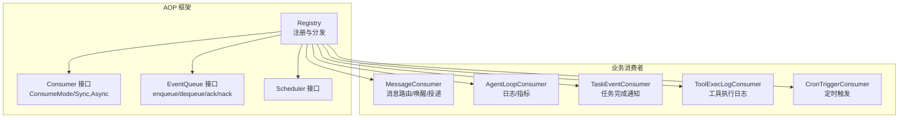
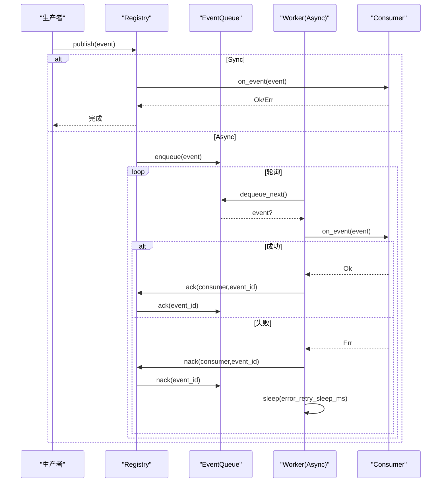
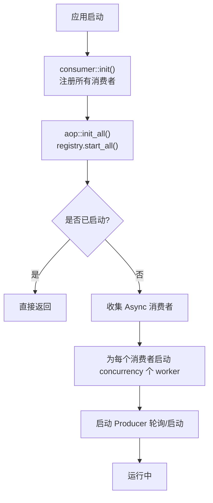
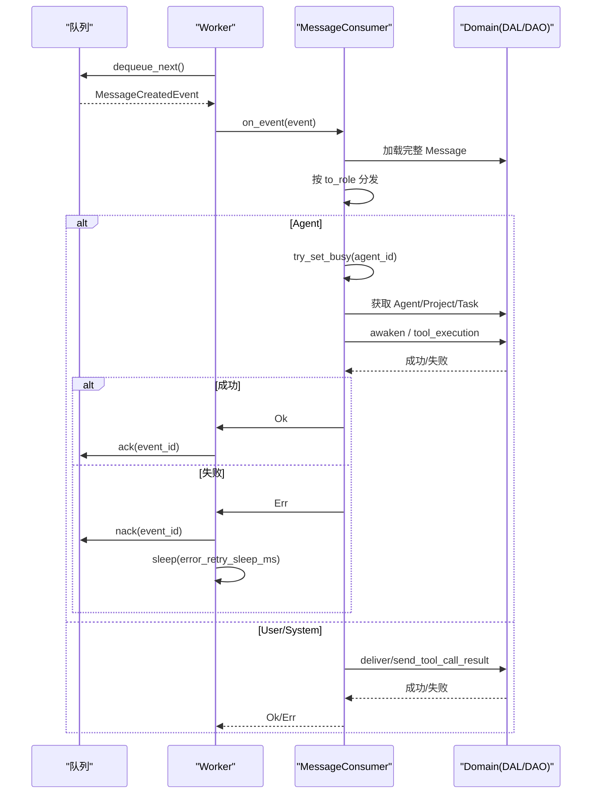
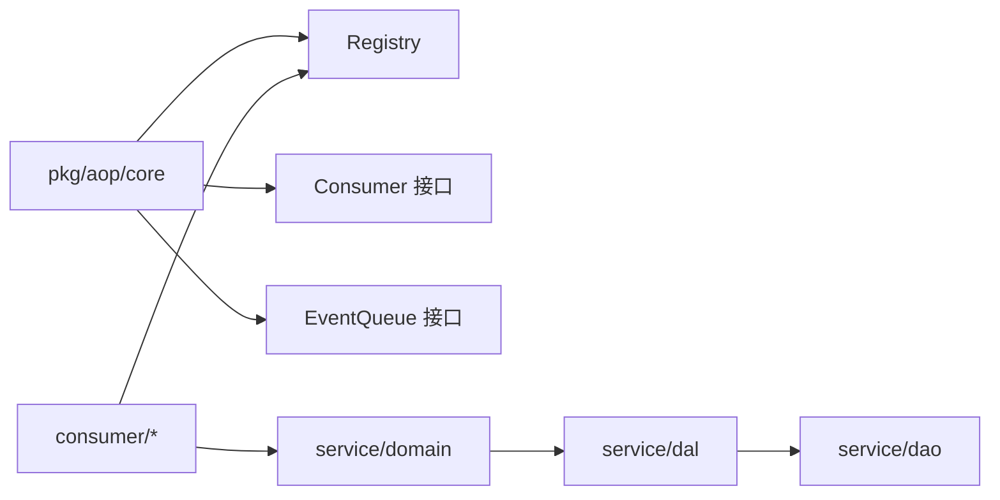

# 消费者接口规范

<cite>
**本文引用的文件**
- [src/consumer/mod.rs](file://src/consumer/mod.rs)
- [src/pkg/aop/mod.rs](file://src/pkg/aop/mod.rs)
- [src/pkg/aop/core/mod.rs](file://src/pkg/aop/core/mod.rs)
- [src/pkg/aop/core/consumer.rs](file://src/pkg/aop/core/consumer.rs)
- [src/pkg/aop/core/registry.rs](file://src/pkg/aop/core/registry.rs)
- [src/pkg/aop/core/scheduler.rs](file://src/pkg/aop/core/scheduler.rs)
- [src/pkg/aop/queue/mod.rs](file://src/pkg/aop/queue/mod.rs)
- [src/consumer/message.rs](file://src/consumer/message.rs)
- [src/consumer/agent_loop_consumer.rs](file://src/consumer/agent_loop_consumer.rs)
- [src/consumer/task_event_consumer.rs](file://src/consumer/task_event_consumer.rs)
- [src/consumer/tool_exec_log_consumer.rs](file://src/consumer/tool_exec_log_consumer.rs)
- [src/consumer/scheduler.rs](file://src/consumer/scheduler.rs)
</cite>

## 目录
1. [简介](#简介)
2. [项目结构](#项目结构)
3. [核心组件](#核心组件)
4. [架构总览](#架构总览)
5. [详细组件分析](#详细组件分析)
6. [依赖关系分析](#依赖关系分析)
7. [性能考量](#性能考量)
8. [故障排查指南](#故障排查指南)
9. [结论](#结论)
10. [附录：自定义消费者开发指南](#附录自定义消费者开发指南)

## 简介
本规范面向 AOP 消费者接口，定义统一的消费者抽象、消费模式（同步/异步）、生命周期方法实现要求、错误处理与重试策略、注册与启动顺序控制，以及性能优化、资源管理与监控集成方案。同时提供自定义消费者开发指南，涵盖接口实现规范、测试方法与部署配置建议。

## 项目结构
AOP 事件中心位于 pkg/aop，包含核心接口、注册中心、队列抽象与调度；业务消费者位于 consumer 模块，按事件类型订阅并编排领域逻辑。

图表来源
- [src/pkg/aop/core/registry.rs:1-120](file://src/pkg/aop/core/registry.rs#L1-L120)
- [src/pkg/aop/core/consumer.rs:1-72](file://src/pkg/aop/core/consumer.rs#L1-L72)
- [src/pkg/aop/queue/mod.rs:77-106](file://src/pkg/aop/queue/mod.rs#L77-L106)
- [src/consumer/message.rs:64-141](file://src/consumer/message.rs#L64-L141)
- [src/consumer/agent_loop_consumer.rs:26-96](file://src/consumer/agent_loop_consumer.rs#L26-L96)
- [src/consumer/task_event_consumer.rs:38-138](file://src/consumer/task_event_consumer.rs#L38-L138)
- [src/consumer/tool_exec_log_consumer.rs:26-53](file://src/consumer/tool_exec_log_consumer.rs#L26-L53)
- [src/consumer/scheduler.rs:39-95](file://src/consumer/scheduler.rs#L39-L95)

章节来源
- [src/pkg/aop/mod.rs:1-61](file://src/pkg/aop/mod.rs#L1-L61)
- [src/consumer/mod.rs:1-43](file://src/consumer/mod.rs#L1-L43)

## 核心组件
- Consumer 接口：定义 name、interested_events、should_consume、consume_mode、on_event，以及 Async 模式的 ack/nack、concurrency、empty_queue_sleep_ms、error_retry_sleep_ms。
- ConsumeMode：Sync（发布线程直接 on_event）与 Async（入队由 worker 拉取）。
- Registry：全局注册中心，负责消费者注册、事件分发、队列管理、worker 启动、ack/nack 协调与统计查询。
- EventQueue：队列抽象，支持 enqueue/dequeue/ack/nack/stats/query/get_event 等。
- Scheduler：周期性任务抽象（供 Producer 使用）。

章节来源
- [src/pkg/aop/core/consumer.rs:1-72](file://src/pkg/aop/core/consumer.rs#L1-L72)
- [src/pkg/aop/core/registry.rs:1-120](file://src/pkg/aop/core/registry.rs#L1-L120)
- [src/pkg/aop/queue/mod.rs:77-106](file://src/pkg/aop/queue/mod.rs#L77-L106)
- [src/pkg/aop/core/scheduler.rs:1-9](file://src/pkg/aop/core/scheduler.rs#L1-L9)

## 架构总览
AOP 框架解耦生产与消费：Producer 仅关注 publish，Consumer 专注业务编排。Registry 统一分发事件，根据 consume_mode 选择同步或异步路径；异步路径通过 EventQueue 缓冲并由多 worker 轮询消费，结合 ack/nack 保证可靠性。

图表来源
- [src/pkg/aop/core/registry.rs:97-206](file://src/pkg/aop/core/registry.rs#L97-L206)
- [src/pkg/aop/core/registry.rs:260-449](file://src/pkg/aop/core/registry.rs#L260-L449)
- [src/pkg/aop/queue/mod.rs:77-106](file://src/pkg/aop/queue/mod.rs#L77-L106)

## 详细组件分析

### 消费者抽象与消费模式
- 同步模式（Sync）：适合轻量、快速处理，避免额外队列开销。
- 异步模式（Async）：适合耗时操作，具备并发 worker、退避重试与确认机制。
- should_consume：可基于事件内容做细粒度过滤。
- 生命周期方法：
  - init：在 consumer::init 中完成注册（非接口方法）。
  - on_event：核心处理逻辑，必须幂等且健壮。
  - shutdown：当前框架未暴露显式 shutdown；可通过进程退出或外部信号停止 worker。

章节来源
- [src/pkg/aop/core/consumer.rs:1-72](file://src/pkg/aop/core/consumer.rs#L1-L72)
- [src/consumer/mod.rs:16-37](file://src/consumer/mod.rs#L16-L37)

### 注册流程与启动顺序
- 注册阶段：consumer::init 调用 aop::registry().register_consumer(...) 注册各消费者。
- 启动阶段：aop::init_all() 调用 registry.start_all()，为每个 Async 消费者启动 concurrency 个 worker，并按 interval 启动 Producer 轮询。
- 顺序约束：先注册消费者，再启动调度器；start_all 幂等，重复调用直接返回。

图表来源
- [src/consumer/mod.rs:16-37](file://src/consumer/mod.rs#L16-L37)
- [src/pkg/aop/mod.rs:53-61](file://src/pkg/aop/mod.rs#L53-L61)
- [src/pkg/aop/core/registry.rs:260-487](file://src/pkg/aop/core/registry.rs#L260-L487)

章节来源
- [src/consumer/mod.rs:16-37](file://src/consumer/mod.rs#L16-L37)
- [src/pkg/aop/mod.rs:53-61](file://src/pkg/aop/mod.rs#L53-L61)
- [src/pkg/aop/core/registry.rs:260-487](file://src/pkg/aop/core/registry.rs#L260-L487)

### 错误处理与重试策略
- 同步模式：on_event 抛出错误会被记录并通过 metrics hook 上报，无自动重试。
- 异步模式：
  - on_event 成功：调用 consumer.ack 与 queue.ack，从队列移除事件。
  - on_event 失败：调用 consumer.nack 与 queue.nack，事件重新入队等待重试；随后 sleep(error_retry_sleep_ms) 避免紧密自旋。
  - dequeue 失败：sleep(error_retry_sleep_ms)。
  - 队列为空：sleep(empty_queue_sleep_ms)。
- 业务侧需区分临时错误（返回 Err 以触发重试）与永久错误（如 not_found），必要时在业务层提前 return Ok 以避免无效重试。

章节来源
- [src/pkg/aop/core/registry.rs:156-206](file://src/pkg/aop/core/registry.rs#L156-L206)
- [src/pkg/aop/core/registry.rs:333-449](file://src/pkg/aop/core/registry.rs#L333-L449)
- [src/consumer/message.rs:114-141](file://src/consumer/message.rs#L114-L141)

### 典型消费者实现

#### MessageConsumer（消息路由与 Agent 唤醒）
- 模式：Async，concurrency=4，用于高吞吐的消息分发。
- 职责：解析 MESSAGE_CREATED 事件，按 to_role 分发到 Agent/User/System 分支；Agent 分支进行原子占用（try_set_busy）、上下文重建、唤醒与工具调用结果回写。
- 错误处理：用户消息投递全部失败时返回错误以触发重试；Agent 不存在返回永久错误不重试；Busy/Resting 状态冲突返回冲突错误触发重试。

图表来源
- [src/consumer/message.rs:64-141](file://src/consumer/message.rs#L64-L141)
- [src/consumer/message.rs:147-357](file://src/consumer/message.rs#L147-L357)
- [src/consumer/message.rs:359-477](file://src/consumer/message.rs#L359-L477)
- [src/pkg/aop/core/registry.rs:333-449](file://src/pkg/aop/core/registry.rs#L333-L449)

章节来源
- [src/consumer/message.rs:64-141](file://src/consumer/message.rs#L64-L141)
- [src/consumer/message.rs:147-357](file://src/consumer/message.rs#L147-L357)
- [src/consumer/message.rs:359-477](file://src/consumer/message.rs#L359-L477)

#### AgentLoopConsumer（同步日志/指标）
- 模式：Sync，订阅 agent.loop 与 agent.think.round，用于日志与观测。
- 特点：轻量、低延迟，适合对性能敏感的路径。

章节来源
- [src/consumer/agent_loop_consumer.rs:26-96](file://src/consumer/agent_loop_consumer.rs#L26-L96)

#### TaskEventConsumer（任务完成通知）
- 模式：Async，订阅 task.status_changed，仅在 Completed 时向 Owner Agent 发送通知。
- 去重：检查是否存在 Pending 的 TaskDispatchNotification，避免重复通知。

章节来源
- [src/consumer/task_event_consumer.rs:38-138](file://src/consumer/task_event_consumer.rs#L38-L138)

#### ToolExecLogConsumer（工具执行日志）
- 模式：Sync，订阅 agent.tool.executed，写入 JSONL 日志。
- 特点：简单可靠，不影响主流程。

章节来源
- [src/consumer/tool_exec_log_consumer.rs:26-53](file://src/consumer/tool_exec_log_consumer.rs#L26-L53)

#### CronTriggerConsumer（定时触发）
- 模式：Sync，订阅 cron.trigger，按 action 分发到 agent_rest 与 project_followup。
- 特性：预检查 Agent 运行时状态，避免无效重试堆积。

章节来源
- [src/consumer/scheduler.rs:39-95](file://src/consumer/scheduler.rs#L39-L95)
- [src/consumer/scheduler.rs:133-194](file://src/consumer/scheduler.rs#L133-L194)

## 依赖关系分析
- 耦合度：AOP 框架与业务消费者通过 Consumer 接口与 EventKind 解耦；业务消费者依赖 Domain/DAL/DAO 完成具体逻辑。
- 循环依赖：AOP 层不感知业务实体，避免反向依赖。
- 外部依赖：Tokio 协程、serde_json 序列化、Tracing/日志宏。

图表来源
- [src/pkg/aop/core/mod.rs:1-14](file://src/pkg/aop/core/mod.rs#L1-L14)
- [src/consumer/mod.rs:1-43](file://src/consumer/mod.rs#L1-L43)

章节来源
- [src/pkg/aop/core/mod.rs:1-14](file://src/pkg/aop/core/mod.rs#L1-L14)
- [src/consumer/mod.rs:1-43](file://src/consumer/mod.rs#L1-L43)

## 性能考量
- 消费模式选择：
  - 同步：适用于轻量、低延迟场景（如日志、指标）。
  - 异步：适用于耗时、可并行场景（如消息投递、Agent 唤醒）。
- 并发与退避：
  - 合理设置 concurrency（例如 MessageConsumer 为 4）。
  - empty_queue_sleep_ms 与 error_retry_sleep_ms 平衡 CPU 与延迟。
- 队列与确认：
  - 确保 ack/nack 成对调用，避免队列积压与 order_key 卡死。
- 上下文与序列化：
  - 最小化 on_event 中的序列化/反序列化成本；复用 RequestContext。
- 资源管理：
  - 避免在 on_event 中持有长连接或大对象；及时释放资源。
- 监控集成：
  - 通过 AopMetricsHook 采集 on_publish/on_consume_start/on_consume_success/on_consume_failure。
  - 使用 Registry 提供的 queue_stats/all_queue_stats 观察队列健康。

[本节为通用指导，无需特定文件引用]

## 故障排查指南
- 常见问题定位：
  - 队列堆积：检查 queue.stats 与 all_queue_stats，确认是否有大量 pending/in_progress。
  - 事件卡死：确认 ack/nack 是否被正确调用；order_key 相同的事件可能因未 ack 而阻塞后续事件。
  - 无限重试：检查业务错误分类，避免将永久错误（如 not_found）作为临时错误返回。
  - CPU 自旋：确认 on_event 失败后存在 sleep(error_retry_sleep_ms)，避免紧密循环。
- 诊断手段：
  - 使用 Registry::query_events 与 get_event 查看事件详情。
  - 结合 Tracing/日志定位 on_event 内部异常。
  - 通过 metrics hook 统计成功率与耗时分布。

章节来源
- [src/pkg/aop/core/registry.rs:500-553](file://src/pkg/aop/core/registry.rs#L500-L553)
- [src/pkg/aop/core/registry.rs:333-449](file://src/pkg/aop/core/registry.rs#L333-L449)

## 结论
AOP 消费者接口通过统一的 Consumer 抽象与 Registry 调度，实现了高内聚、低耦合的事件驱动架构。选择合适的消费模式、合理的并发与退避策略、严格的 ack/nack 语义与完善的监控集成，是构建稳定高效消费者的关键。

[本节为总结性内容，无需特定文件引用]

## 附录：自定义消费者开发指南

### 接口实现规范
- 实现 Consumer trait：
  - name：全局唯一标识，用于队列路由与日志追踪。
  - interested_events：声明感兴趣的事件类型列表。
  - should_consume：可选过滤，减少不必要处理。
  - consume_mode：根据场景选择 Sync 或 Async。
  - on_event：核心业务逻辑，必须幂等、健壮、可重试。
  - ack/nack：异步模式下实现确认与重试语义。
  - concurrency/empty_queue_sleep_ms/error_retry_sleep_ms：调优参数。

章节来源
- [src/pkg/aop/core/consumer.rs:1-72](file://src/pkg/aop/core/consumer.rs#L1-L72)

### 注册与启动
- 在 consumer::init 中注册消费者。
- 在应用启动时调用 aop::init_all() 启动调度器。

章节来源
- [src/consumer/mod.rs:16-37](file://src/consumer/mod.rs#L16-L37)
- [src/pkg/aop/mod.rs:53-61](file://src/pkg/aop/mod.rs#L53-L61)

### 测试方法
- 单元测试：
  - 构造事件 JSON，直接调用 on_event，验证副作用（如 DAL/DAO 调用）。
  - 模拟 Domain/DAL 返回值，覆盖成功/失败分支。
- 集成测试：
  - 使用 Registry::publish 发布事件，验证队列行为与 ack/nack。
  - 验证 queue.stats 与 query_events 的结果。

[本节为通用指导，无需特定文件引用]

### 部署配置
- 调整 concurrency、empty_queue_sleep_ms、error_retry_sleep_ms 以适应负载。
- 启用 AopMetricsHook 接入监控系统。
- 定期巡检队列健康与错误率。

[本节为通用指导，无需特定文件引用]