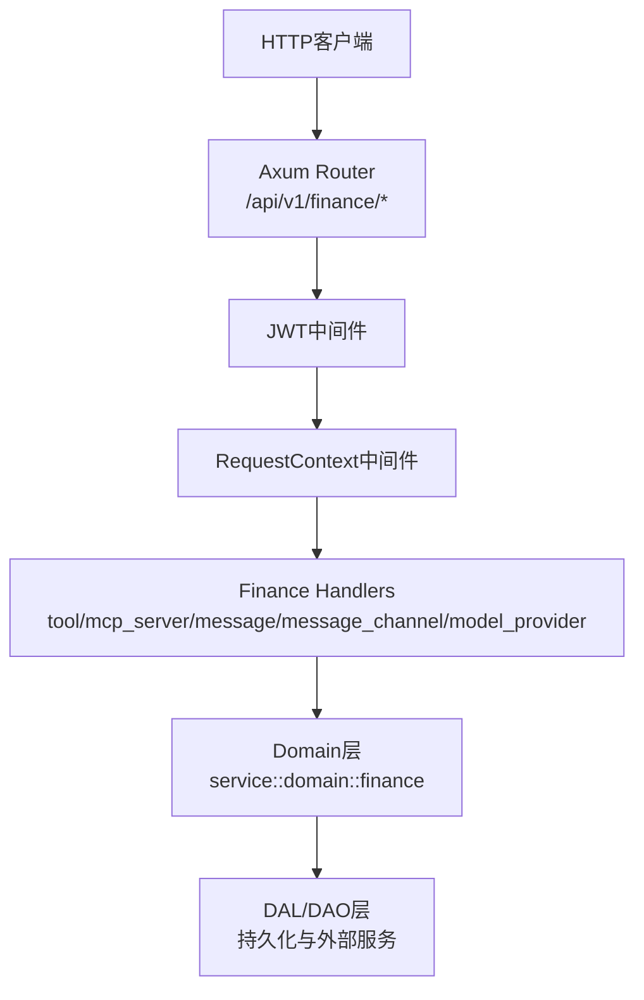
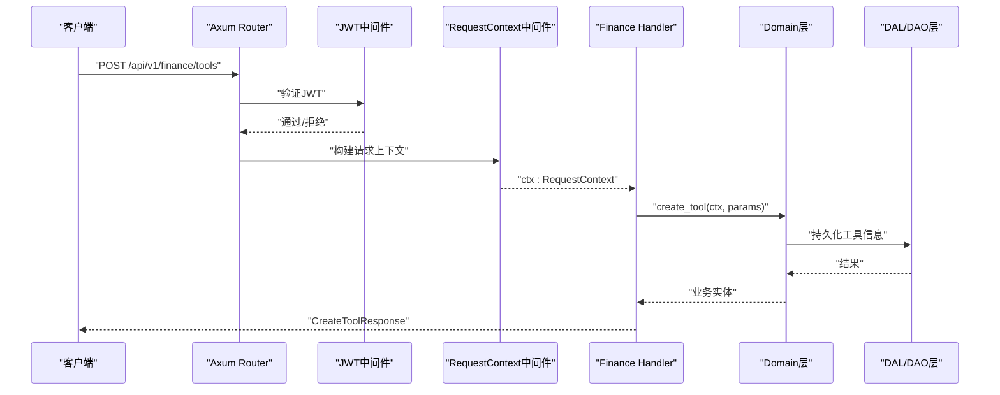
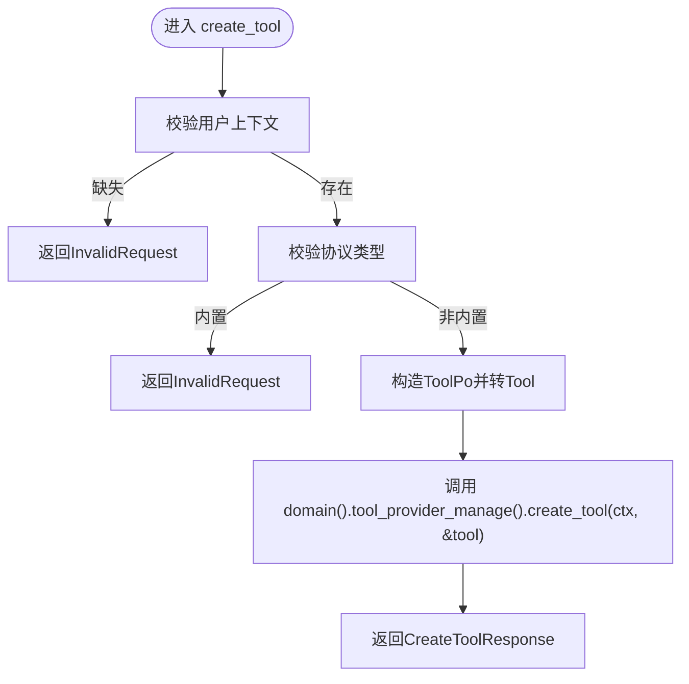
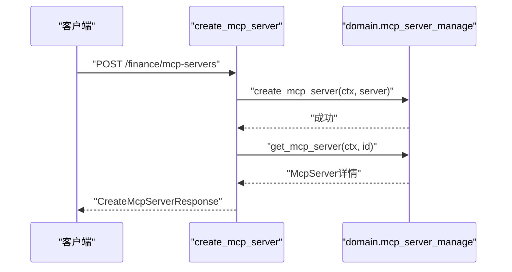
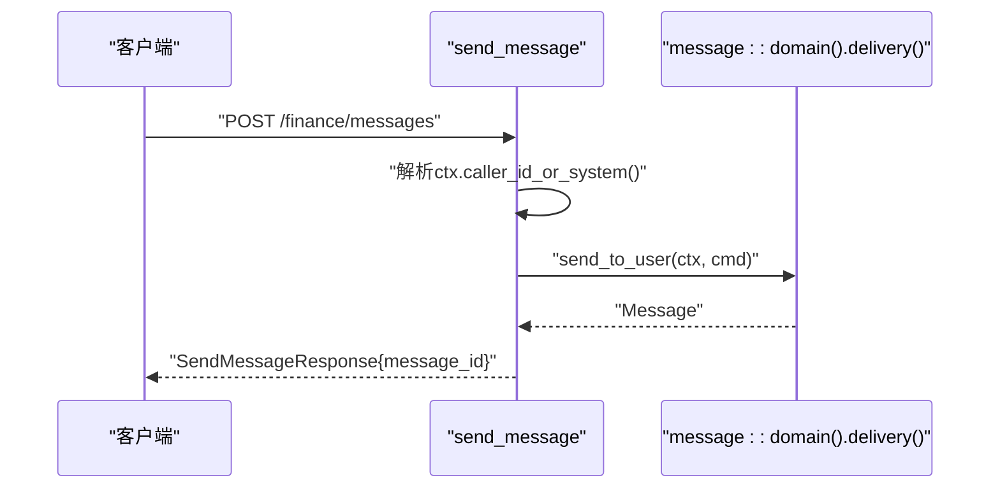
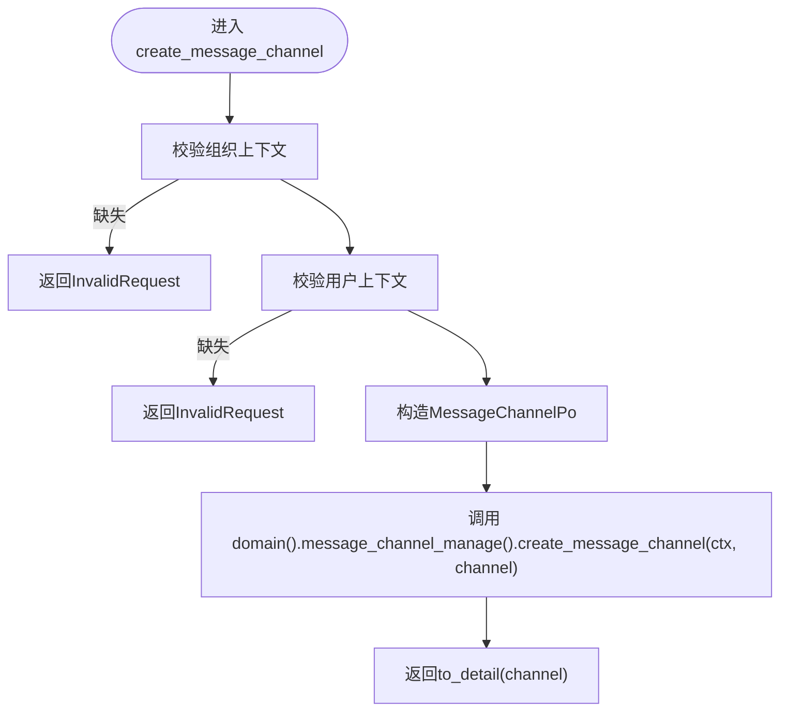
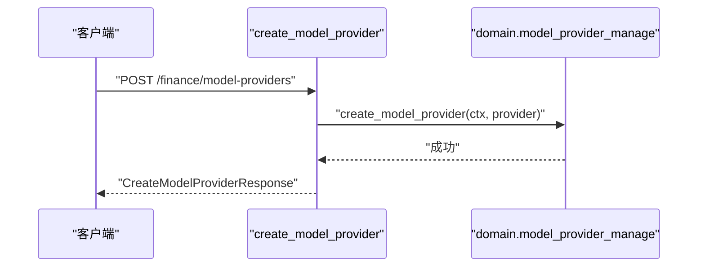
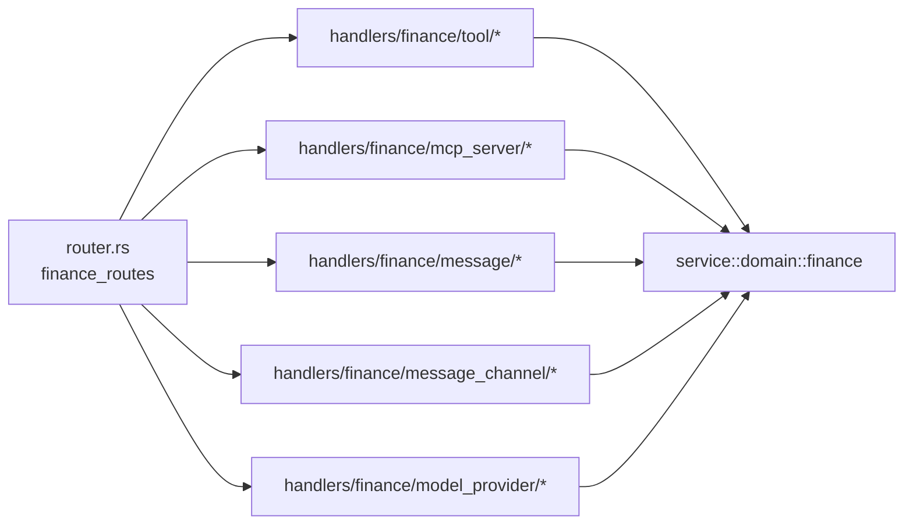

# Finance模块处理器

<cite>
**本文引用的文件**
- [src/handlers/finance/mod.rs](file://src/handlers/finance/mod.rs)
- [src/router.rs](file://src/router.rs)
- [common/src/api/mod.rs](file://common/src/api/mod.rs)
- [src/handlers/finance/tool/mod.rs](file://src/handlers/finance/tool/mod.rs)
- [src/handlers/finance/mcp_server/mod.rs](file://src/handlers/finance/mcp_server/mod.rs)
- [src/handlers/finance/message/mod.rs](file://src/handlers/finance/message/mod.rs)
- [src/handlers/finance/model_provider/mod.rs](file://src/handlers/finance/model_provider/mod.rs)
- [src/handlers/finance/message_channel/mod.rs](file://src/handlers/finance/message_channel/mod.rs)
- [src/handlers/finance/tool/create_tool.rs](file://src/handlers/finance/tool/create_tool.rs)
- [src/handlers/finance/mcp_server/create_mcp_server.rs](file://src/handlers/finance/mcp_server/create_mcp_server.rs)
- [src/handlers/finance/message/send_message.rs](file://src/handlers/finance/message/send_message.rs)
- [src/handlers/finance/model_provider/create_model_provider.rs](file://src/handlers/finance/model_provider/create_model_provider.rs)
- [src/handlers/finance/message_channel/create_message_channel.rs](file://src/handlers/finance/message_channel/create_message_channel.rs)
</cite>

## 目录
1. [简介](#简介)
2. [项目结构](#项目结构)
3. [核心组件](#核心组件)
4. [架构总览](#架构总览)
5. [详细组件分析](#详细组件分析)
6. [依赖分析](#依赖分析)
7. [性能考虑](#性能考虑)
8. [故障排查指南](#故障排查指南)
9. [结论](#结论)
10. [附录：API调用示例与集成指南](#附录api调用示例与集成指南)

## 简介
本文件面向 Finance（财务管理）模块的 HTTP 处理器，覆盖工具管理、MCP服务器管理、消息系统、模型提供商管理等核心能力。文档聚焦于各子模块处理器的职责分工、接口设计、参数绑定与响应格式；并梳理工具注册、执行与调试流程，MCP服务器连接管理，消息发送接收机制，以及模型提供商配置与测试能力。同时提供复杂业务场景的处理思路、错误处理策略、性能优化建议与集成指南。

## 项目结构
Finance 模块位于 handlers/finance，按功能域划分为多个子模块：
- tool：工具生命周期管理与调用调试
- mcp_server：MCP服务器配置与状态管理
- mcp_tool：MCP工具同步与查询
- message：消息发送、列表、搜索与SSE订阅
- message_channel：消息通道（如飞书、微信、邮件、Slack等）配置与管理
- model_provider：模型提供商配置、切换、测试与向量重建任务

路由统一在 router.rs 中注册到 /api/v1/finance 下，受 JWT 认证保护，部分端点额外要求管理员角色。

图表来源
- [src/router.rs:104-136](file://src/router.rs#L104-L136)
- [src/router.rs:415-601](file://src/router.rs#L415-L601)

章节来源
- [src/handlers/finance/mod.rs:1-15](file://src/handlers/finance/mod.rs#L1-L15)
- [src/router.rs:415-601](file://src/router.rs#L415-L601)

## 核心组件
- 工具管理（tool）
  - 职责：创建、查询、更新、删除工具；绑定/解绑至Agent；工具标签管理；工具调用入口与调试；工具调用记录查询。
  - 关键处理器：create_tool、list_tools、query_tools、search_tools、get_tool、update_tool、update_tool_status、delete_tool、bind_tool_to_agent、unbind_tool_from_agent、debug_call_tool、request_tool_call、send_tool_call_message、list_tool_tags、query_tool_call_entries、get_tool_call_entry。
- MCP服务器管理（mcp_server）
  - 职责：创建、查询、更新、删除MCP服务器；状态变更；用于后续工具发现与调用。
  - 关键处理器：create_mcp_server、list_mcp_servers、get_mcp_server、update_mcp_server、update_mcp_server_status、delete_mcp_server。
- MCP工具（mcp_tool）
  - 职责：按服务器同步工具清单；按服务器列出工具。
  - 关键处理器：sync_mcp_tools、list_mcp_tools_by_server。
- 消息系统（message）
  - 职责：向用户或Agent发送消息；消息列表与搜索；SSE订阅实时推送。
  - 关键处理器：send_message、send_message_to_agent、send_task_assignment_message、list_messages、search_messages、subscribe_sse。
- 消息通道（message_channel）
  - 职责：创建、查询、更新、删除消息通道；测试通道连通性；状态管理。
  - 关键处理器：create_message_channel、list_message_channels、get_message_channel、update_message_channel、update_message_channel_status、test_message_channel_connection、delete_message_channel。
- 模型提供商（model_provider）
  - 职责：创建、查询、更新、删除模型提供商；测试连接；切换嵌入模型；向量重建任务与进度查询；直接调用模型。
  - 关键处理器：create_model_provider、list_model_providers、get_model_provider、update_model_provider、delete_model_provider、test_connection、switch_embedding、rebuild_vectors_task、rebuild_progress、call_model。

章节来源
- [src/handlers/finance/tool/mod.rs:1-46](file://src/handlers/finance/tool/mod.rs#L1-L46)
- [src/handlers/finance/mcp_server/mod.rs:1-24](file://src/handlers/finance/mcp_server/mod.rs#L1-L24)
- [src/handlers/finance/message/mod.rs:1-17](file://src/handlers/finance/message/mod.rs#L1-L17)
- [src/handlers/finance/message_channel/mod.rs:1-22](file://src/handlers/finance/message_channel/mod.rs#L1-L22)
- [src/handlers/finance/model_provider/mod.rs:1-25](file://src/handlers/finance/model_provider/mod.rs#L1-L25)

## 架构总览
Finance 模块遵循四层单向调用：Adapter（HTTP Handler）→ Domain → DAL → DAO。Handler 仅负责参数校验、上下文提取与响应组装；业务逻辑下沉至 Domain，数据访问通过 DAL/DAO。所有公共方法首参为 ctx: RequestContext，跨层传递使用 ctx.clone()。

图表来源
- [src/router.rs:104-136](file://src/router.rs#L104-L136)
- [src/handlers/finance/tool/create_tool.rs:1-72](file://src/handlers/finance/tool/create_tool.rs#L1-L72)

章节来源
- [src/router.rs:104-136](file://src/router.rs#L104-L136)

## 详细组件分析

### 工具管理（tool）
- 职责与边界
  - 工具CRUD、标签管理、Agent绑定/解绑、调用调试、调用记录查询。
  - 内置工具由系统同步，管理接口禁止创建。
- 参数绑定与响应
  - 请求体使用 common::api::* 中的统一DTO；响应遵循 ApiResponse<T> 包装。
  - 分页查询返回 PagedResult<T>。
- 典型流程
  - 创建工具：校验用户上下文与协议类型，构造 ToolPo，转换为 Tool 后调用 domain().tool_provider_manage().create_tool(ctx, &tool)。
  - 调试调用：需管理员角色，便于安全隔离。
- 错误处理
  - 缺少用户上下文或非法协议时返回 InvalidRequest。
  - 权限不足时由 require_role_middleware 拦截。

图表来源
- [src/handlers/finance/tool/create_tool.rs:1-72](file://src/handlers/finance/tool/create_tool.rs#L1-L72)

章节来源
- [src/handlers/finance/tool/mod.rs:1-46](file://src/handlers/finance/tool/mod.rs#L1-L46)
- [src/handlers/finance/tool/create_tool.rs:1-72](file://src/handlers/finance/tool/create_tool.rs#L1-L72)
- [src/router.rs:557-601](file://src/router.rs#L557-L601)

### MCP服务器管理（mcp_server）
- 职责与边界
  - 管理MCP服务器配置（名称、传输方式、配置），支持启用/禁用与删除。
- 参数绑定与响应
  - 请求体使用 CreateMcpServerRequest；响应使用 to_detail 转换后的详情。
- 典型流程
  - 创建服务器：生成ID，构造 McpServer，调用 domain().mcp_server_manage().create_mcp_server(ctx, &server)，再获取详情返回。

图表来源
- [src/handlers/finance/mcp_server/create_mcp_server.rs:1-48](file://src/handlers/finance/mcp_server/create_mcp_server.rs#L1-L48)

章节来源
- [src/handlers/finance/mcp_server/mod.rs:1-24](file://src/handlers/finance/mcp_server/mod.rs#L1-L24)
- [src/handlers/finance/mcp_server/create_mcp_server.rs:1-48](file://src/handlers/finance/mcp_server/create_mcp_server.rs#L1-L48)
- [src/router.rs:525-548](file://src/router.rs#L525-L548)

### 消息系统（message）
- 职责与边界
  - 支持向用户、Agent发送消息；支持任务指派消息；提供消息列表、搜索与SSE订阅。
- 参数绑定与响应
  - 发送消息使用 SendMessageParams；响应包含 message_id。
- 典型流程
  - 发送消息：从 ctx 获取 from_agent_id_or_system，构造 SendToUserCommand，调用 message::domain().delivery().send_to_user(ctx, cmd)。

图表来源
- [src/handlers/finance/message/send_message.rs:1-41](file://src/handlers/finance/message/send_message.rs#L1-L41)

章节来源
- [src/handlers/finance/message/mod.rs:1-17](file://src/handlers/finance/message/mod.rs#L1-L17)
- [src/handlers/finance/message/send_message.rs:1-41](file://src/handlers/finance/message/send_message.rs#L1-L41)
- [src/router.rs:482-496](file://src/router.rs#L482-L496)

### 消息通道（message_channel）
- 职责与边界
  - 管理通知通道（飞书、微信、邮件、Slack、Webhook等），支持测试连通性与状态管理。
- 参数绑定与响应
  - 创建通道需要组织上下文；请求体包含多种通道特定字段；响应使用 to_detail。
- 典型流程
  - 创建通道：校验组织与用户上下文，构造 MessageChannelPo，调用 domain().message_channel_manage().create_message_channel(ctx, &channel)。

图表来源
- [src/handlers/finance/message_channel/create_message_channel.rs:1-79](file://src/handlers/finance/message_channel/create_message_channel.rs#L1-L79)

章节来源
- [src/handlers/finance/message_channel/mod.rs:1-22](file://src/handlers/finance/message_channel/mod.rs#L1-L22)
- [src/handlers/finance/message_channel/create_message_channel.rs:1-79](file://src/handlers/finance/message_channel/create_message_channel.rs#L1-L79)
- [src/router.rs:498-524](file://src/router.rs#L498-L524)

### 模型提供商（model_provider）
- 职责与边界
  - 管理AI推理提供商配置（名称、类型、能力、模型名、密钥、基础URL、描述、上下文长度等）；支持测试连接、切换嵌入模型、向量重建任务与进度查询、直接调用模型。
- 参数绑定与响应
  - 创建请求包含 provider_type、capability、max_context_length、recommended_context_length 等；响应封装配置脱敏后的字段。
- 典型流程
  - 创建提供商：构造 ModelProviderPo，设置配置，调用 domain().model_provider_manage().create_model_provider(ctx, &provider)。

图表来源
- [src/handlers/finance/model_provider/create_model_provider.rs:1-69](file://src/handlers/finance/model_provider/create_model_provider.rs#L1-L69)

章节来源
- [src/handlers/finance/model_provider/mod.rs:1-25](file://src/handlers/finance/model_provider/mod.rs#L1-L25)
- [src/handlers/finance/model_provider/create_model_provider.rs:1-69](file://src/handlers/finance/model_provider/create_model_provider.rs#L1-L69)
- [src/router.rs:446-480](file://src/router.rs#L446-L480)

## 依赖分析
- 路由依赖
  - finance_routes 将各处理器挂载到 /api/v1/finance/*，统一受 JWT 保护，部分端点附加 require_role_middleware（如 debug_call_tool）。
- 处理器依赖
  - 各处理器依赖 common::api 中的请求/响应DTO；依赖 service::domain::finance 提供的领域服务；依赖 crate::models 中的实体对象进行转换。
- 上下文与认证
  - 中间件顺序：jwt_auth → request_context → handler；确保 ctx 中包含用户与组织信息。

图表来源
- [src/router.rs:415-601](file://src/router.rs#L415-L601)

章节来源
- [src/router.rs:415-601](file://src/router.rs#L415-L601)
- [common/src/api/mod.rs:1-156](file://common/src/api/mod.rs#L1-L156)

## 性能考虑
- 批量操作与分页
  - 列表与查询接口建议使用分页参数 limit/offset，避免一次性返回大量数据。
- 异步与后台任务
  - 向量重建等耗时操作应通过后台任务提交，并提供进度查询接口（rebuild_progress）。
- SSE流式推送
  - 消息订阅使用 SSE，减少轮询开销，提升实时性。
- 缓存与降级
  - 工具与MCP工具清单可考虑缓存；向量检索支持多后端降级（LanceDB/HNSW/InMemory/SqliteVss）。
- 鉴权与限流
  - 敏感操作（如 debug_call_tool）限制管理员角色；必要时结合网关层限流。

[本节为通用指导，不直接分析具体文件]

## 故障排查指南
- 常见错误
  - 缺少用户/组织上下文：检查JWT与中间件链是否正确注入 ctx。
  - 内置工具创建失败：确认协议类型与权限控制。
  - 模型提供商测试失败：检查密钥、基础URL与网络可达性。
  - 消息通道测试失败：核对通道配置（如飞书/微信/邮件/Slack/Webhook）与凭据。
- 定位步骤
  - 查看日志ID（来自 RequestContext）追踪请求链路。
  - 检查 Domain/DAL 层抛出的错误码与消息。
  - 对敏感调试接口（如 debug_call_tool）确认管理员权限。

章节来源
- [src/handlers/finance/tool/create_tool.rs:1-72](file://src/handlers/finance/tool/create_tool.rs#L1-L72)
- [src/handlers/finance/model_provider/create_model_provider.rs:1-69](file://src/handlers/finance/model_provider/create_model_provider.rs#L1-L69)
- [src/handlers/finance/message_channel/create_message_channel.rs:1-79](file://src/handlers/finance/message_channel/create_message_channel.rs#L1-L79)

## 结论
Finance 模块以清晰的处理器分层与统一的中间件链，提供了工具、MCP服务器、消息系统与模型提供商的全生命周期管理能力。通过 Domain 层抽象与 DAL/DAO 的数据访问分离，保证了可扩展性与可维护性。建议在集成时严格遵循参数校验、权限控制与错误处理规范，并结合分页、SSE与后台任务优化性能与用户体验。

[本节为总结，不直接分析具体文件]

## 附录：API调用示例与集成指南
- 工具管理
  - 创建工具：POST /api/v1/finance/tools
    - 请求体：参考 common::api::CreateToolRequest
    - 响应：ApiResponse<CreateToolResponse>
  - 调试调用：POST /api/v1/finance/tools/{id}/debug-call（需管理员）
- MCP服务器管理
  - 创建服务器：POST /api/v1/finance/mcp-servers
    - 请求体：参考 common::api::CreateMcpServerRequest
    - 响应：ApiResponse<CreateMcpServerResponse>
  - 同步工具：POST /api/v1/finance/mcp-servers/{server_id}/tools/sync
- 消息系统
  - 发送消息：POST /api/v1/finance/messages
    - 请求体：参考 common::api::SendMessageParams
    - 响应：ApiResponse<SendMessageResponse>
  - 订阅SSE：GET /api/v1/finance/messages/sse
- 消息通道
  - 创建通道：POST /api/v1/finance/message-channels
    - 请求体：参考 common::api::CreateMessageChannelRequest
    - 响应：ApiResponse<CreateMessageChannelResponse>
  - 测试通道：POST /api/v1/finance/message-channels/{id}/test
- 模型提供商
  - 创建提供商：POST /api/v1/finance/model-providers
    - 请求体：参考 common::api::CreateModelProviderRequest
    - 响应：ApiResponse<CreateModelProviderResponse>
  - 测试连接：POST /api/v1/finance/model-providers/{id}/test
  - 切换嵌入：POST /api/v1/finance/model-providers/{id}/switch
  - 向量重建任务：POST /api/v1/finance/model-providers/{id}/rebuild-task
  - 重建进度：GET /api/v1/finance/model-providers/rebuild-progress
  - 直接调用模型：POST /api/v1/finance/model-providers/{id}/call

章节来源
- [src/router.rs:415-601](file://src/router.rs#L415-L601)
- [common/src/api/mod.rs:1-156](file://common/src/api/mod.rs#L1-L156)