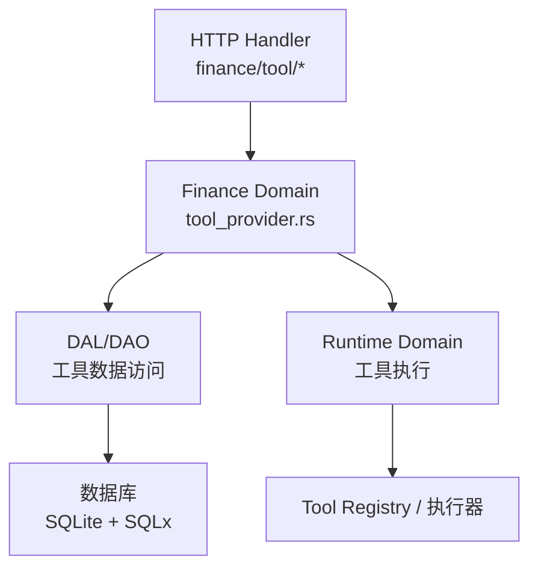
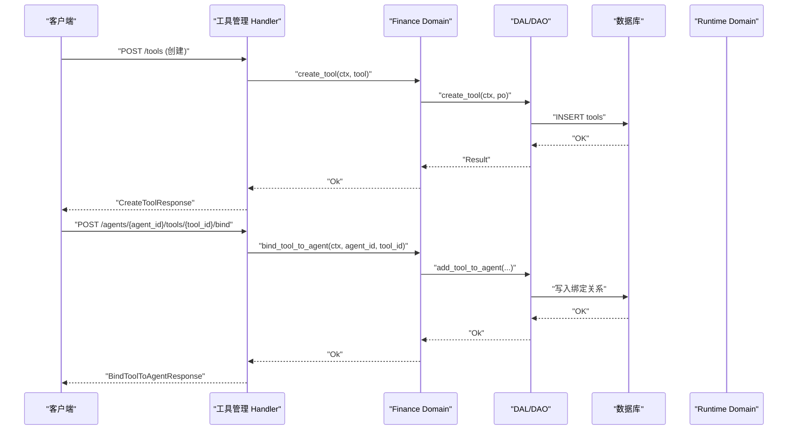
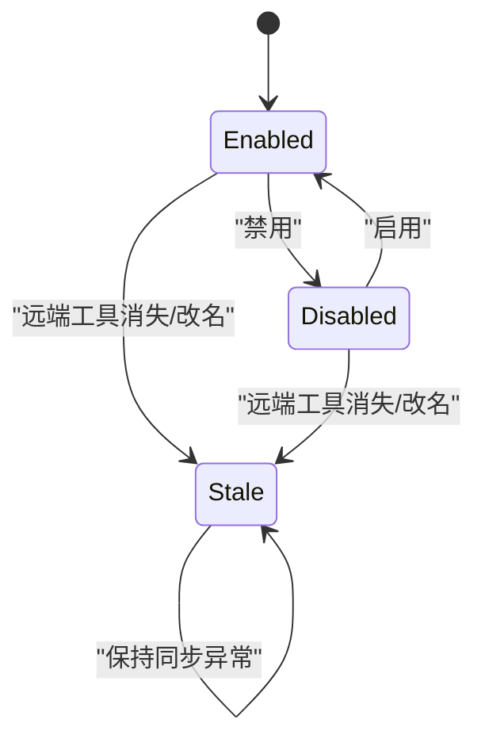
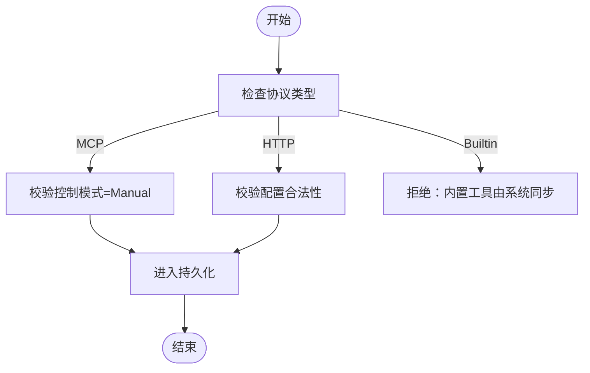
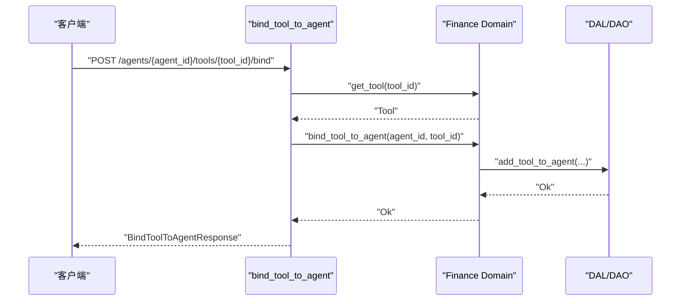
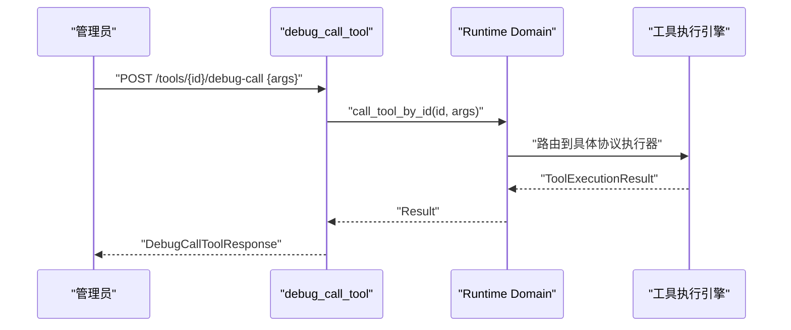
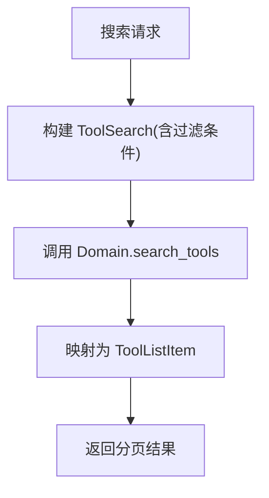
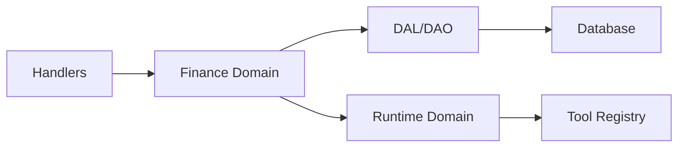

# 工具管理处理器

<cite>
**本文引用的文件**
- [common/src/api/tool.rs](file://common/src/api/tool.rs)
- [src/handlers/finance/tool/mod.rs](file://src/handlers/finance/tool/mod.rs)
- [src/handlers/finance/tool/create_tool.rs](file://src/handlers/finance/tool/create_tool.rs)
- [src/handlers/finance/tool/bind_tool_to_agent.rs](file://src/handlers/finance/tool/bind_tool_to_agent.rs)
- [src/handlers/finance/tool/unbind_tool_from_agent.rs](file://src/handlers/finance/tool/unbind_tool_from_agent.rs)
- [src/handlers/finance/tool/debug_call_tool.rs](file://src/handlers/finance/tool/debug_call_tool.rs)
- [src/handlers/finance/tool/request_tool_call.rs](file://src/handlers/finance/tool/request_tool_call.rs)
- [src/handlers/finance/tool/send_tool_call_message.rs](file://src/handlers/finance/tool/send_tool_call_message.rs)
- [src/handlers/finance/tool/search_tools.rs](file://src/handlers/finance/tool/search_tools.rs)
- [src/handlers/finance/tool/list_tool_tags.rs](file://src/handlers/finance/tool/list_tool_tags.rs)
- [src/models/tool.rs](file://src/models/tool.rs)
- [common/src/enums/tool.rs](file://common/src/enums/tool.rs)
- [src/service/domain/finance/tool_provider.rs](file://src/service/domain/finance/tool_provider.rs)
</cite>

## 目录
1. [简介](#简介)
2. [项目结构](#项目结构)
3. [核心组件](#核心组件)
4. [架构总览](#架构总览)
5. [详细组件分析](#详细组件分析)
6. [依赖关系分析](#依赖关系分析)
7. [性能考虑](#性能考虑)
8. [故障排查指南](#故障排查指南)
9. [结论](#结论)
10. [附录：API 与使用示例](#附录api-与使用示例)

## 简介
本文件面向“工具管理处理器”，系统化说明工具的 CRUD、与 Agent 的绑定/解绑、调试与调用、注册流程、参数校验、执行引擎集成、错误处理策略，以及标签管理、搜索查询、批量操作等高级能力。同时覆盖工具生命周期与状态控制、权限验证的实现要点，并提供 API 调用示例、请求响应格式说明和常见场景的代码路径指引。

## 项目结构
工具管理相关代码遵循四层单向调用：Adapter（HTTP Handler）→ Domain → DAL → DAO。Handler 层按方法粒度拆分，统一在 finance/tool 模块中组织；Domain 层负责业务规则与编排；DAL/DAO 负责数据访问；公共 DTO/枚举定义在 common 模块。

图表来源
- [src/handlers/finance/tool/mod.rs:1-46](file://src/handlers/finance/tool/mod.rs#L1-L46)
- [src/service/domain/finance/tool_provider.rs:1-166](file://src/service/domain/finance/tool_provider.rs#L1-L166)

章节来源
- [src/handlers/finance/tool/mod.rs:1-46](file://src/handlers/finance/tool/mod.rs#L1-L46)

## 核心组件
- 工具模型与状态
  - ToolPo：持久化对象，包含协议类型、控制模式、配置、参数 Schema、标签、状态、时间戳与创建/更新者。
  - Tool：完整实体，包含 PO、可执行工具对象、可选的搜索匹配信息与统计信息。
  - 状态机：Enabled/Disabled/Stale，支持有限迁移。
- 协议与控制模式
  - 协议：Builtin/Http/Mcp。
  - 控制模式：Auto（Rig 原生自动）、Manual（自建链路）。MCP 仅允许 Manual。
- 领域服务
  - Finance Domain 提供工具 CRUD、绑定/解绑、列表/搜索、标签聚合、内置工具同步等能力。
- Handler 接口
  - 创建、获取、更新、删除、状态切换、绑定/解绑、调试调用、同步/异步调用、搜索、标签列表等。

章节来源
- [src/models/tool.rs:57-202](file://src/models/tool.rs#L57-L202)
- [common/src/enums/tool.rs:9-162](file://common/src/enums/tool.rs#L9-L162)
- [src/service/domain/finance/tool_provider.rs:14-146](file://src/service/domain/finance/tool_provider.rs#L14-L146)

## 架构总览
工具管理的整体调用链如下：
- 管理面 CRUD：Handler → Finance Domain → DAL/DAO → DB。
- 绑定/解绑：Handler → Finance Domain → DAL/DAO（维护 Agent-Tool 关系），并校验内部工具不可绑定。
- 调试调用：Handler → Runtime Domain → 工具执行引擎（绕过 Agent 授权，管理员权限）。
- 同步/异步调用：Handler → Runtime Domain/Message 域 → 工具执行或消息投递。
- 搜索与标签：Handler → Finance Domain → DAL/DAO（FTS5 + 向量语义混合搜索）。

图表来源
- [src/handlers/finance/tool/create_tool.rs:1-72](file://src/handlers/finance/tool/create_tool.rs#L1-L72)
- [src/handlers/finance/tool/bind_tool_to_agent.rs:1-39](file://src/handlers/finance/tool/bind_tool_to_agent.rs#L1-L39)
- [src/service/domain/finance/tool_provider.rs:14-114](file://src/service/domain/finance/tool_provider.rs#L14-L114)

## 详细组件分析

### 工具模型与状态机
- ToolPo 字段涵盖名称、描述、协议、控制模式、配置、参数 Schema、标签、状态、时间戳与创建/更新者。
- Tool 封装了可执行对象与元数据，支持搜索匹配与统计信息。
- 状态迁移：
  - Enabled ↔ Disabled 双向可切换。
  - Stale 为同步异常态，管理面不允许手动切回正常业务路径。
- 默认值与填充：
  - Http/Mcp 默认 Manual；Builtin 默认 Auto。
  - 内置工具同步时填充协议与默认控制模式。

图表来源
- [src/models/tool.rs:163-202](file://src/models/tool.rs#L163-L202)
- [common/src/enums/tool.rs:58-105](file://common/src/enums/tool.rs#L58-L105)

章节来源
- [src/models/tool.rs:57-202](file://src/models/tool.rs#L57-L202)
- [common/src/enums/tool.rs:9-162](file://common/src/enums/tool.rs#L9-L162)

### 工具注册与参数校验
- 创建自定义工具（HTTP/MCP）：
  - 禁止通过管理接口创建内置工具。
  - 必填字段校验：名称、描述、协议、参数 Schema（动态工具）。
  - 可选字段：控制模式、是否启用、标签。
- 管理策略校验：
  - MCP 工具仅支持 Manual 控制模式。
  - HTTP 工具需校验配置合法性。
- 内置工具同步：
  - 将 registry 中的内置工具写入 DB，填充协议与默认控制模式。

图表来源
- [src/service/domain/finance/tool_provider.rs:148-166](file://src/service/domain/finance/tool_provider.rs#L148-L166)
- [src/handlers/finance/tool/create_tool.rs:12-62](file://src/handlers/finance/tool/create_tool.rs#L12-L62)

章节来源
- [src/handlers/finance/tool/create_tool.rs:1-72](file://src/handlers/finance/tool/create_tool.rs#L1-L72)
- [src/service/domain/finance/tool_provider.rs:14-66](file://src/service/domain/finance/tool_provider.rs#L14-L66)

### 工具与 Agent 的绑定/解绑
- 绑定：
  - 校验工具存在。
  - 禁止将 internal 标签的工具绑定给 Agent。
  - 记录 created_by（用户或系统）。
- 解绑：
  - 移除 Agent 与工具的绑定关系。
- 查询：
  - 获取 Agent 已绑定的工具 ID 列表与完整工具集合。

图表来源
- [src/handlers/finance/tool/bind_tool_to_agent.rs:1-39](file://src/handlers/finance/tool/bind_tool_to_agent.rs#L1-L39)
- [src/service/domain/finance/tool_provider.rs:73-114](file://src/service/domain/finance/tool_provider.rs#L73-L114)

章节来源
- [src/handlers/finance/tool/bind_tool_to_agent.rs:1-39](file://src/handlers/finance/tool/bind_tool_to_agent.rs#L1-L39)
- [src/service/domain/finance/tool_provider.rs:73-128](file://src/service/domain/finance/tool_provider.rs#L73-L128)

### 工具调试与调用
- 调试调用（管理员专用）：
  - 直接调用 runtime 的执行入口，跳过 Agent 授权。
  - 返回成功标志、结果、trace id 与状态文本。
- 同步调用（内部系统工具）：
  - 要求 Agent 上下文，立即返回结果。
- 异步调用（内部系统工具）：
  - 发送消息后立即返回，结果在下一轮 awaken 送达。

图表来源
- [src/handlers/finance/tool/debug_call_tool.rs:1-35](file://src/handlers/finance/tool/debug_call_tool.rs#L1-L35)
- [common/src/api/tool.rs:120-141](file://common/src/api/tool.rs#L120-L141)

章节来源
- [src/handlers/finance/tool/debug_call_tool.rs:1-35](file://src/handlers/finance/tool/debug_call_tool.rs#L1-L35)
- [src/handlers/finance/tool/request_tool_call.rs:1-54](file://src/handlers/finance/tool/request_tool_call.rs#L1-L54)
- [src/handlers/finance/tool/send_tool_call_message.rs:1-57](file://src/handlers/finance/tool/send_tool_call_message.rs#L1-L57)

### 搜索与标签管理
- 搜索工具：
  - 支持关键词（FTS5 + 向量语义混合搜索）与多条件过滤（ID、Agent、标签、协议、状态、MCP 服务器、仅启用）。
  - 排除 Stale 状态。
- 标签列表：
  - 列出所有启用工具的不重复标签，用于前端分类选择。

图表来源
- [src/handlers/finance/tool/search_tools.rs:1-53](file://src/handlers/finance/tool/search_tools.rs#L1-L53)
- [src/handlers/finance/tool/list_tool_tags.rs:1-28](file://src/handlers/finance/tool/list_tool_tags.rs#L1-L28)

章节来源
- [src/handlers/finance/tool/search_tools.rs:1-53](file://src/handlers/finance/tool/search_tools.rs#L1-L53)
- [src/handlers/finance/tool/list_tool_tags.rs:1-28](file://src/handlers/finance/tool/list_tool_tags.rs#L1-L28)

### 生命周期管理与权限验证
- 生命周期：
  - 创建后默认启用（可通过 enabled 控制）。
  - 支持启用/禁用切换；Stale 为同步异常态，管理面不主动恢复。
- 权限：
  - 调试调用需管理员及以上角色（路由层中间件校验）。
  - 绑定/解绑需具备相应 Agent 上下文与权限。
- 审计：
  - 创建/更新记录 created_by/updated_by。

章节来源
- [src/models/tool.rs:163-202](file://src/models/tool.rs#L163-L202)
- [src/handlers/finance/tool/debug_call_tool.rs:1-35](file://src/handlers/finance/tool/debug_call_tool.rs#L1-L35)

## 依赖关系分析
- Handler 依赖 Finance Domain 提供的工具管理能力。
- Finance Domain 依赖 DAL/DAO 进行数据访问，并依赖 Runtime Domain 进行工具执行。
- 工具执行依赖工具注册表与协议适配器（HTTP/MCP/Builtin）。
- 搜索依赖 FTS5 与向量存储后端。

图表来源
- [src/handlers/finance/tool/mod.rs:1-46](file://src/handlers/finance/tool/mod.rs#L1-L46)
- [src/service/domain/finance/tool_provider.rs:1-166](file://src/service/domain/finance/tool_provider.rs#L1-L166)

章节来源
- [src/handlers/finance/tool/mod.rs:1-46](file://src/handlers/finance/tool/mod.rs#L1-L46)
- [src/service/domain/finance/tool_provider.rs:1-166](file://src/service/domain/finance/tool_provider.rs#L1-L166)

## 性能考虑
- 搜索采用 FTS5 + 向量语义混合检索，建议合理设置分页与过滤条件以减少扫描范围。
- 列表与查询接口支持分页，避免一次性返回大量数据。
- 调试调用为同步阻塞，适合轻量快速工具；耗时任务建议使用异步消息方式。
- 标签聚合基于启用工具去重，注意数据量增长时的索引优化。

[本节为通用指导，不直接分析具体文件]

## 故障排查指南
- 创建失败：
  - 检查协议与控制模式组合是否符合约束（MCP 必须 Manual）。
  - 检查 HTTP 工具配置是否合法。
- 绑定失败：
  - 确认工具存在且非 internal 标签。
  - 检查 Agent 上下文与权限。
- 调试调用失败：
  - 确认管理员权限与工具状态。
  - 查看 trace id 对应的调用记录以定位问题。
- 搜索无结果：
  - 检查关键词与过滤条件；确认未排除必要状态。
  - 检查向量索引与 FTS5 分词器配置。

章节来源
- [src/service/domain/finance/tool_provider.rs:148-166](file://src/service/domain/finance/tool_provider.rs#L148-L166)
- [src/handlers/finance/tool/debug_call_tool.rs:1-35](file://src/handlers/finance/tool/debug_call_tool.rs#L1-L35)

## 结论
工具管理处理器提供了完整的工具生命周期管理能力，涵盖 CRUD、绑定/解绑、调试与调用、搜索与标签管理等。通过严格的协议与控制模式校验、状态机约束与权限控制，确保工具在安全可控的前提下被 Agent 使用。结合 FTS5 与向量语义搜索，提升了工具发现与匹配效率。

[本节为总结性内容，不直接分析具体文件]

## 附录：API 与使用示例
以下为常用接口的请求/响应结构与调用示例路径，便于快速上手与集成。

- 创建工具
  - 接口：POST /api/v1/tools
  - 请求体：CreateToolRequest（name、description、protocol、config、parameters_schema、tags、control_mode、enabled）
  - 响应：CreateToolResponse（id、name、description、tool_type、created_at）
  - 示例路径：[create_tool.rs:12-72](file://src/handlers/finance/tool/create_tool.rs#L12-L72)

- 获取工具详情
  - 接口：GET /api/v1/tools/{id}
  - 查询参数：with_stats、stats_time_start、stats_time_end、stats_interval
  - 响应：GetToolResponse（包含协议、控制模式、配置、Schema、标签、状态、时间戳等）
  - 示例路径：[common/src/api/tool.rs:45-103](file://common/src/api/tool.rs#L45-L103)

- 更新工具
  - 接口：PUT /api/v1/tools/{id}
  - 请求体：UpdateToolRequest（name、description、protocol、control_mode、config、parameters_schema、tags、enabled）
  - 响应：UpdateToolResponse（同 GetToolResponse）
  - 示例路径：[common/src/api/tool.rs:244-270](file://common/src/api/tool.rs#L244-L270)

- 更新工具状态
  - 接口：PATCH /api/v1/tools/{id}/status
  - 请求体：UpdateToolStatusRequest（id、status）
  - 响应：UpdateToolStatusResponse（同 GetToolResponse）
  - 示例路径：[common/src/api/tool.rs:272-283](file://common/src/api/tool.rs#L272-L283)

- 删除工具
  - 接口：DELETE /api/v1/tools/{id}
  - 响应：DeleteToolResponse（success）
  - 示例路径：[common/src/api/tool.rs:105-118](file://common/src/api/tool.rs#L105-L118)

- 绑定工具到 Agent
  - 接口：POST /api/v1/agents/{agent_id}/tools/{tool_id}/bind
  - 请求体：BindToolToAgentRequest（agent_id、tool_id）
  - 响应：BindToolToAgentResponse（success）
  - 示例路径：[bind_tool_to_agent.rs:9-39](file://src/handlers/finance/tool/bind_tool_to_agent.rs#L9-L39)

- 从 Agent 解绑工具
  - 接口：POST /api/v1/agents/{agent_id}/tools/{tool_id}/unbind
  - 请求体：UnbindToolFromAgentRequest（agent_id、tool_id）
  - 响应：UnbindToolFromAgentResponse（success）
  - 示例路径：[common/src/api/tool.rs:303-319](file://common/src/api/tool.rs#L303-L319)

- 调试调用工具（管理员）
  - 接口：POST /api/v1/tools/{id}/debug-call
  - 请求体：DebugCallToolRequest（id、args）
  - 响应：DebugCallToolResponse（success、result、tool_call_id、status）
  - 示例路径：[debug_call_tool.rs:12-35](file://src/handlers/finance/tool/debug_call_tool.rs#L12-L35)

- 同步调用工具（内部系统工具）
  - 接口：POST /api/v1/tools/call
  - 请求体：RequestToolCallParams（tool_id、params、project_id?、task_id?）
  - 响应：RequestToolCallResponse（tool_call_id、status、result）
  - 示例路径：[request_tool_call.rs:11-54](file://src/handlers/finance/tool/request_tool_call.rs#L11-L54)

- 异步调用工具（内部系统工具）
  - 接口：POST /api/v1/tools/call/message
  - 请求体：SendToolCallMessageParams（tool_id、tool_name、params、project_id?、task_id?）
  - 响应：SendToolCallMessageResponse（request_id、message_id、status）
  - 示例路径：[send_tool_call_message.rs:11-57](file://src/handlers/finance/tool/send_tool_call_message.rs#L11-L57)

- 搜索工具
  - 接口：POST /api/v1/tools/search
  - 请求体：SearchToolsRequest（keyword、ids、agent_id、tags、protocol、status、mcp_server_id、enabled_only、pagination）
  - 响应：PagedResult<ToolListItem>
  - 示例路径：[search_tools.rs:16-53](file://src/handlers/finance/tool/search_tools.rs#L16-L53)

- 列出工具标签
  - 接口：GET /api/v1/finance/tools/tags
  - 请求体：ListToolTagsRequest（空）
  - 响应：ListToolTagsResponse（tags）
  - 示例路径：[list_tool_tags.rs:11-28](file://src/handlers/finance/tool/list_tool_tags.rs#L11-L28)

- 查询工具调用轨迹
  - 接口：GET /api/v1/tools/calls
  - 查询参数：call_id、agent_id、project_id、task_id、tool_id、status、started_after、started_before、limit
  - 响应：Vec<ToolCallEntryDetail>
  - 示例路径：[common/src/api/tool.rs:321-366](file://common/src/api/tool.rs#L321-L366)

- 获取单条调用轨迹
  - 接口：GET /api/v1/tools/calls/{call_id}
  - 查询参数：tool_id、agent_id、project_id、task_id
  - 响应：ToolCallEntryDetail
  - 示例路径：[common/src/api/tool.rs:368-385](file://common/src/api/tool.rs#L368-L385)

章节来源
- [common/src/api/tool.rs:9-430](file://common/src/api/tool.rs#L9-L430)
- [src/handlers/finance/tool/create_tool.rs:12-72](file://src/handlers/finance/tool/create_tool.rs#L12-L72)
- [src/handlers/finance/tool/bind_tool_to_agent.rs:9-39](file://src/handlers/finance/tool/bind_tool_to_agent.rs#L9-L39)
- [src/handlers/finance/tool/debug_call_tool.rs:12-35](file://src/handlers/finance/tool/debug_call_tool.rs#L12-L35)
- [src/handlers/finance/tool/request_tool_call.rs:11-54](file://src/handlers/finance/tool/request_tool_call.rs#L11-L54)
- [src/handlers/finance/tool/send_tool_call_message.rs:11-57](file://src/handlers/finance/tool/send_tool_call_message.rs#L11-L57)
- [src/handlers/finance/tool/search_tools.rs:16-53](file://src/handlers/finance/tool/search_tools.rs#L16-L53)
- [src/handlers/finance/tool/list_tool_tags.rs:11-28](file://src/handlers/finance/tool/list_tool_tags.rs#L11-L28)