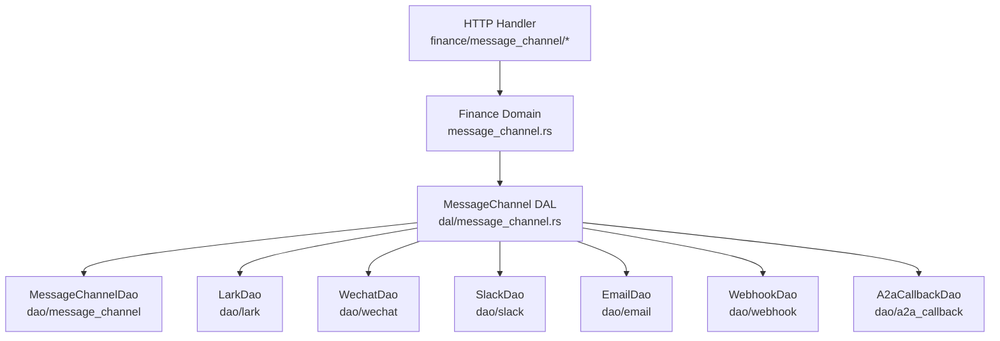
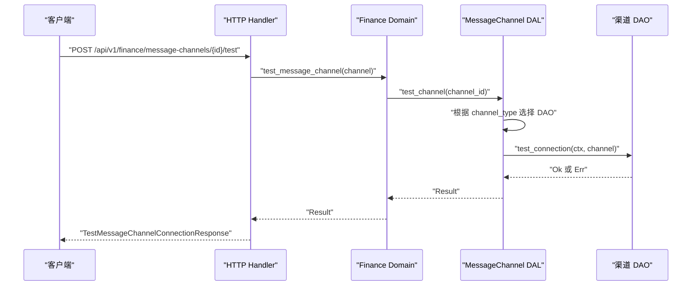
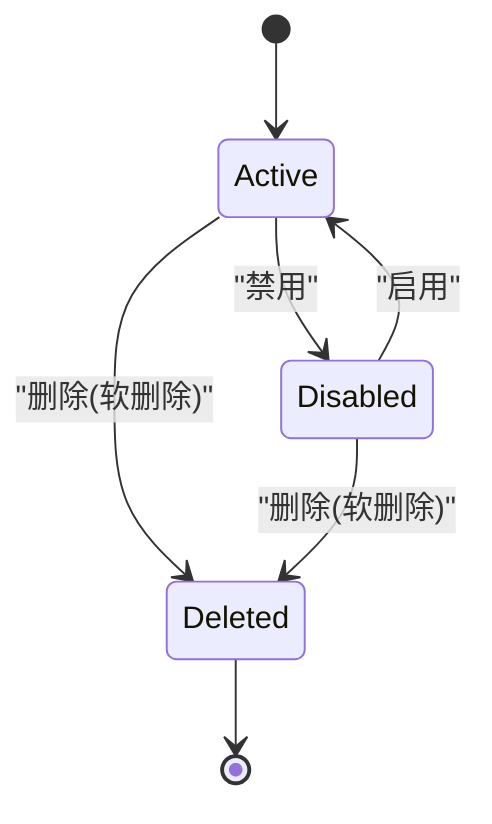
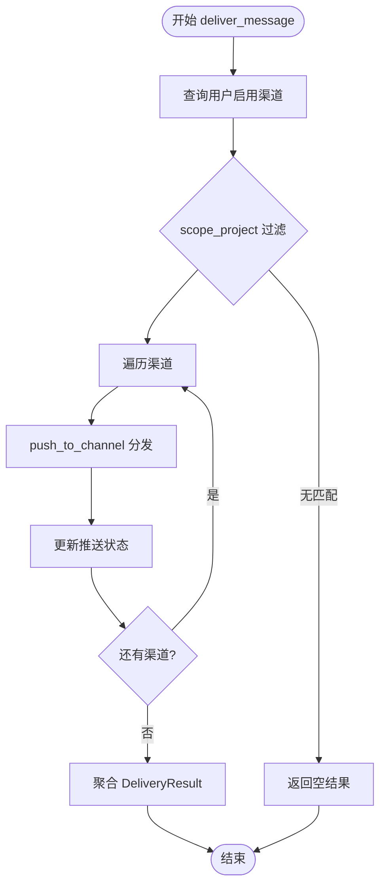
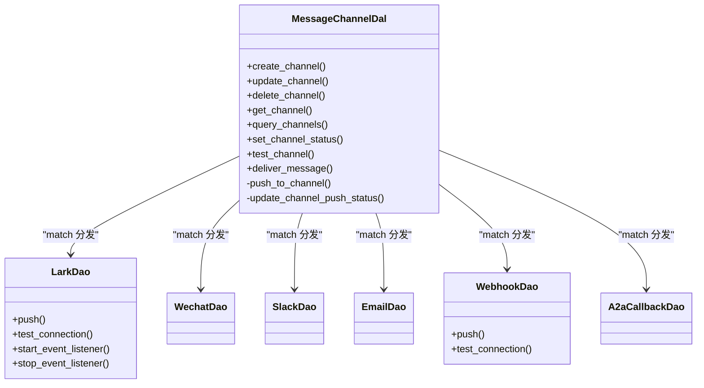
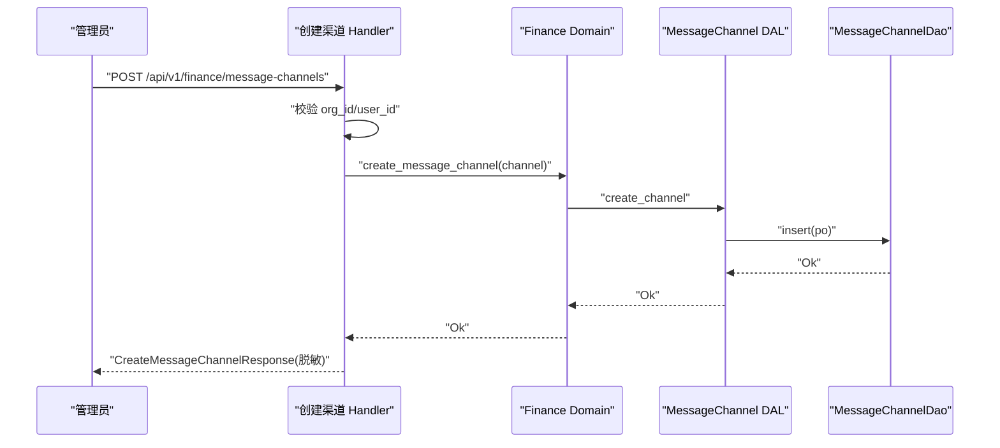
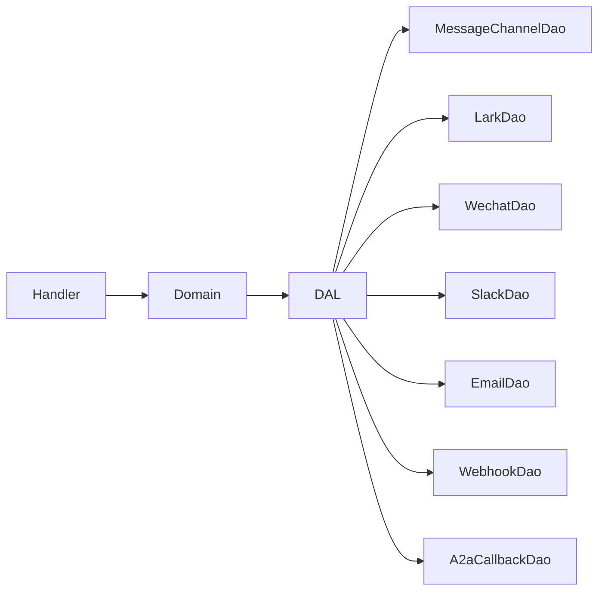

# 消息渠道管理处理器

<cite>
**本文引用的文件**
- [消息渠道设计文档](file://docs/message_channel_design.md)
- [ChannelType/ChannelStatus 枚举](file://common/src/enums/message_channel.rs)
- [MessageChannel 实体与配置](file://src/models/message_channel.rs)
- [消息渠道 DAL（统一分发）](file://src/service/dal/message_channel.rs)
- [消息渠道 DAO 接口与查询](file://src/service/dao/message_channel/mod.rs)
- [飞书渠道 DAO 接口](file://src/service/dao/lark/mod.rs)
- [通用 Webhook 渠道 DAO 接口](file://src/service/dao/webhook/mod.rs)
- [Finance Domain 消息渠道管理实现](file://src/service/domain/finance/message_channel.rs)
- [创建渠道 Handler](file://src/handlers/finance/message_channel/create_message_channel.rs)
- [测试连接 Handler](file://src/handlers/finance/message_channel/test_message_channel_connection.rs)
- [消息渠道 HTTP 模块汇总](file://src/handlers/finance/message_channel/mod.rs)
</cite>

## 目录
1. [简介](#简介)
2. [项目结构](#项目结构)
3. [核心组件](#核心组件)
4. [架构总览](#架构总览)
5. [详细组件分析](#详细组件分析)
6. [依赖关系分析](#依赖关系分析)
7. [性能与扩展性](#性能与扩展性)
8. [故障排查指南](#故障排查指南)
9. [结论](#结论)
10. [附录：配置示例与运维监控](#附录：配置示例与运维监控)

## 简介
本文件面向“消息渠道管理处理器”，围绕多渠道支持、渠道适配器模式、连接测试、状态管理与失败处理等能力，系统化说明从 HTTP Handler → Finance Domain → MessageChannel DAL → 各渠道 DAO 的调用链路与数据流。同时给出不同渠道的配置要点、连接测试方法以及运维监控建议，帮助读者快速上手并安全扩展新的消息渠道。

## 项目结构
消息渠道相关代码遵循严格四层单向调用：Adapter（HTTP Handler / 公开回调）→ Domain → DAL → DAO。Handler 仅做参数解析、上下文补全、权限校验与 DTO 组装；Domain 编排业务规则；DAL 统一整合配置管理与消息分发；DAO 负责具体渠道的持久化或外部协议交互。

图表来源
- [消息渠道设计文档:1-646](file://docs/message_channel_design.md#L1-L646)
- [消息渠道 DAL（统一分发）:1-407](file://src/service/dal/message_channel.rs#L1-L407)
- [消息渠道 DAO 接口与查询:1-98](file://src/service/dao/message_channel/mod.rs#L1-L98)
- [飞书渠道 DAO 接口:1-82](file://src/service/dao/lark/mod.rs#L1-L82)
- [通用 Webhook 渠道 DAO 接口:1-48](file://src/service/dao/webhook/mod.rs#L1-L48)

章节来源
- [消息渠道设计文档:52-71](file://docs/message_channel_design.md#L52-L71)
- [消息渠道 DAL（统一分发）:1-126](file://src/service/dal/message_channel.rs#L1-L126)

## 核心组件
- 渠道类型与状态
  - ChannelType：定义支持的推送渠道（如飞书、微信、Slack、邮件、通用 Webhook、A2A 回调）。
  - ChannelStatus：渠道生命周期状态（已删除、活跃、已禁用），并提供状态迁移约束。
- 渠道实体与配置
  - MessageChannelPo：持久化对象，承载渠道基础信息与扩展配置 JSON。
  - MessageChannel：业务实体，封装 PO 并提供便捷访问方法与状态迁移逻辑。
  - ChannelConfig：按渠道分类的扩展配置（如飞书 App ID/Secret、SMTP、Slack Token、Webhook 模板等）。
- DAL 统一分发
  - MessageChannelDal：对外暴露配置管理（CRUD、查询、状态设置、连接测试）与消息分发（deliver_message）。内部通过纯 match 将消息路由到对应渠道 DAO。
- 渠道 DAO
  - 每个渠道一个独立 DAO，提供 push 与 test_connection 等方法；飞书 DAO 还包含事件监听生命周期管理。
- Domain 编排
  - Finance Domain 的 MessageChannelManage 实现，将 Handler 请求委派给 DAL，保持 Handler 无业务细节。
- Handler 管理面
  - 按动作拆分：创建、查询、更新、删除、状态切换、连接测试；响应 DTO 脱敏敏感字段。

章节来源
- [ChannelType/ChannelStatus 枚举:9-122](file://common/src/enums/message_channel.rs#L9-L122)
- [MessageChannel 实体与配置:19-255](file://src/models/message_channel.rs#L19-L255)
- [消息渠道 DAL（统一分发）:60-126](file://src/service/dal/message_channel.rs#L60-L126)
- [飞书渠道 DAO 接口:42-77](file://src/service/dao/lark/mod.rs#L42-L77)
- [Finance Domain 消息渠道管理实现:11-72](file://src/service/domain/finance/message_channel.rs#L11-L72)
- [创建渠道 Handler:14-78](file://src/handlers/finance/message_channel/create_message_channel.rs#L14-L78)
- [测试连接 Handler:9-56](file://src/handlers/finance/message_channel/test_message_channel_connection.rs#L9-L56)

## 架构总览
下图展示一次“创建渠道 + 测试连接”的端到端调用序列，体现 Handler → Domain → DAL → 渠道 DAO 的单向调用与错误返回路径。

图表来源
- [测试连接 Handler:17-56](file://src/handlers/finance/message_channel/test_message_channel_connection.rs#L17-L56)
- [Finance Domain 消息渠道管理实现:63-71](file://src/service/domain/finance/message_channel.rs#L63-L71)
- [消息渠道 DAL（统一分发）:202-222](file://src/service/dal/message_channel.rs#L202-L222)
- [飞书渠道 DAO 接口:64-66](file://src/service/dao/lark/mod.rs#L64-L66)
- [通用 Webhook 渠道 DAO 接口:30-43](file://src/service/dao/webhook/mod.rs#L30-L43)

## 详细组件分析

### 渠道实体与状态机
- 实体职责
  - MessageChannelPo：存储渠道基础信息、扩展配置 JSON、状态与审计字段。
  - MessageChannel：提供 id/user_id/channel_type/status 等便捷访问，封装状态迁移规则。
- 状态迁移
  - Active ↔ Disabled 可互相切换；Deleted 为终态，不允许通过普通状态更新产生。
  - transition_status 会校验目标状态是否允许，并更新修改人与时间戳。

图表来源
- [ChannelType/ChannelStatus 枚举:82-122](file://common/src/enums/message_channel.rs#L82-L122)
- [MessageChannel 实体与配置:67-107](file://src/models/message_channel.rs#L67-L107)

章节来源
- [MessageChannel 实体与配置:19-113](file://src/models/message_channel.rs#L19-L113)

### DAL 统一分发与消息投递
- 配置管理
  - create/update/delete/get/query/set_status：统一委托给 MessageChannelDao。
- 连接测试
  - test_channel：读取渠道后按 channel_type 匹配对应 DAO 执行 test_connection。
- 消息投递
  - deliver_message：查询用户启用的渠道，按 scope_project 过滤后逐个 push_to_channel，并记录成功/失败详情。
  - push_to_channel：纯 match 分发到各渠道 DAO；新增渠道只需在 match 中加一行。
  - update_channel_push_status：根据结果更新 last_pushed_at 或 last_error。

图表来源
- [消息渠道 DAL（统一分发）:226-335](file://src/service/dal/message_channel.rs#L226-L335)

章节来源
- [消息渠道 DAL（统一分发）:60-126](file://src/service/dal/message_channel.rs#L60-L126)
- [消息渠道 DAL（统一分发）:226-335](file://src/service/dal/message_channel.rs#L226-L335)

### 渠道适配器模式与 DAO 边界
- 适配器模式
  - 每个渠道以独立 DAO 作为适配器，屏蔽外部协议差异（HTTP、WebSocket、SMTP 等）。
  - DAL 通过纯 match 调度，避免引入 trait 抽象带来的耦合。
- 飞书 DAO
  - 提供 push、test_connection、start_event_listener、stop_event_listener。
  - 事件回调通过 LarkEventHandler trait 注入，避免 DAO 反向依赖 Domain。
- 通用 Webhook DAO
  - 提供 push、test_connection；当前未实现时返回不支持错误，DAL 捕获并计入失败统计。

图表来源
- [消息渠道 DAL（统一分发）:131-142](file://src/service/dal/message_channel.rs#L131-L142)
- [消息渠道 DAL（统一分发）:299-313](file://src/service/dal/message_channel.rs#L299-L313)
- [飞书渠道 DAO 接口:42-77](file://src/service/dao/lark/mod.rs#L42-L77)
- [通用 Webhook 渠道 DAO 接口:10-43](file://src/service/dao/webhook/mod.rs#L10-L43)

章节来源
- [飞书渠道 DAO 接口:26-77](file://src/service/dao/lark/mod.rs#L26-L77)
- [通用 Webhook 渠道 DAO 接口:1-48](file://src/service/dao/webhook/mod.rs#L1-48)

### Handler 管理面与权限控制
- 创建渠道
  - 解析请求体，构造 MessageChannelPo/MessageChannel，调用 Domain 创建。
  - 组织与用户上下文校验，确保多租户隔离。
- 测试连接
  - 获取渠道并校验归属（org_id/user_id），调用 Domain.test_message_channel，返回 success/error。
- 响应脱敏
  - 查询与详情不返回敏感字段（access_token、secret、config_json 中的密钥），仅提供存在性布尔标志。

图表来源
- [创建渠道 Handler:22-78](file://src/handlers/finance/message_channel/create_message_channel.rs#L22-L78)
- [Finance Domain 消息渠道管理实现:14-20](file://src/service/domain/finance/message_channel.rs#L14-L20)
- [消息渠道 DAL（统一分发）:148-150](file://src/service/dal/message_channel.rs#L148-L150)
- [消息渠道 DAO 接口与查询:43-45](file://src/service/dao/message_channel/mod.rs#L43-L45)

章节来源
- [消息渠道设计文档:52-71](file://docs/message_channel_design.md#L52-L71)
- [创建渠道 Handler:22-78](file://src/handlers/finance/message_channel/create_message_channel.rs#L22-L78)
- [测试连接 Handler:17-56](file://src/handlers/finance/message_channel/test_message_channel_connection.rs#L17-L56)

### 多渠道支持与路由策略
- 渠道类型
  - 支持飞书、微信、Slack、邮件、通用 Webhook、A2A 回调。
- 路由策略
  - DAL 层通过 channel_type 进行精确匹配分发；新增渠道需同步更新 match 分支，编译期保证完整性。
- 范围过滤
  - 投递时按 scope_project 过滤：NULL 表示全局渠道，非空表示仅该项目可见。

章节来源
- [ChannelType/ChannelStatus 枚举:9-74](file://common/src/enums/message_channel.rs#L9-L74)
- [消息渠道 DAL（统一分发）:243-256](file://src/service/dal/message_channel.rs#L243-L256)

### 连接测试、心跳检测与自动重连
- 连接测试
  - 通过 /status 或 /test 触发 DAL.test_channel，调用对应 DAO.test_connection。
- 心跳检测
  - 飞书 DAO 提供 start_event_listener/stop_event_listener，用于维护 WebSocket 长连接与事件接收。
- 自动重连
  - 由外部事件监听器实现（DAO 内），重复启动返回冲突错误；停止时关闭连接并等待任务退出。

章节来源
- [飞书渠道 DAO 接口:67-76](file://src/service/dao/lark/mod.rs#L67-L76)
- [消息渠道 DAL（统一分发）:202-222](file://src/service/dal/message_channel.rs#L202-L222)

### 失败处理与重试策略
- 失败不重试
  - 设计原则：只记录 last_error，不做自动重试；后续可扩展 message_push_logs 表记录与重试。
- 聚合结果
  - deliver_message 返回 DeliveryResult，包含 total/success/failed/details，便于观测与告警。
- 未实现渠道
  - 通用 Webhook 当前返回 unsupported_operation，DAL 捕获并计入 failed，不影响其他渠道与 SSE。

章节来源
- [消息渠道设计文档:151-160](file://docs/message_channel_design.md#L151-L160)
- [消息渠道 DAL（统一分发）:340-391](file://src/service/dal/message_channel.rs#L340-L391)

## 依赖关系分析
- 单向依赖
  - Handler → Domain → DAL → DAO；禁止跨层调用与同层互调。
- 关键依赖
  - DAL 依赖所有渠道 DAO；DAO 之间相互独立。
  - Domain 仅依赖 DAL 暴露的公共方法。
- 潜在风险
  - 新增渠道需同步更新 DAL 的 match 分支，否则编译报错；这是编译期安全保障。

图表来源
- [消息渠道 DAL（统一分发）:131-142](file://src/service/dal/message_channel.rs#L131-L142)
- [消息渠道 DAO 接口与查询:40-89](file://src/service/dao/message_channel/mod.rs#L40-L89)

章节来源
- [消息渠道设计文档:410-453](file://docs/message_channel_design.md#L410-L453)

## 性能与扩展性
- 并发与阻塞
  - 推送失败不阻塞主流程；deliver_message 顺序遍历但每次 push 为异步 IO，整体不阻塞。
- 扩展新渠道
  - 步骤：新建 DAO → 在 DAL 结构体添加字段 → 在 test_channel/push_to_channel 的 match 中添加分支 → 编写单元测试。
- 资源管理
  - 飞书 WebSocket 长连接通过 start/stop 管理，避免资源泄漏。

章节来源
- [消息渠道 DAL（统一分发）:299-313](file://src/service/dal/message_channel.rs#L299-L313)
- [飞书渠道 DAO 接口:67-76](file://src/service/dao/lark/mod.rs#L67-L76)

## 故障排查指南
- 常见问题
  - 渠道不存在：test_channel 返回 NotFound，检查渠道 ID 与归属。
  - 权限不足：Handler 校验 org_id/user_id 不匹配时报错。
  - 渠道未实现：Webhook 当前返回 unsupported_operation，视为失败但不抛错。
- 定位方法
  - 查看 DeliveryResult.details 中 error 字段；检查 last_error 与 last_pushed_at。
  - 对飞书渠道，确认事件监听是否启动且未冲突。
- 恢复建议
  - 修正渠道配置（URL、Token、Secret）；必要时重置状态为 Active。

章节来源
- [测试连接 Handler:30-56](file://src/handlers/finance/message_channel/test_message_channel_connection.rs#L30-L56)
- [消息渠道 DAL（统一分发）:202-222](file://src/service/dal/message_channel.rs#L202-L222)
- [消息渠道设计文档:38-51](file://docs/message_channel_design.md#L38-L51)

## 结论
消息渠道管理处理器通过严格的分层与纯 match 分发，实现了多渠道的统一接入与管理。Handler 专注请求与响应，Domain 编排业务规则，DAL 统一整合配置与分发，DAO 屏蔽外部协议差异。该设计具备编译期安全性、易扩展性与良好的可观测性，适合在生产环境中持续演进。

## 附录：配置示例与运维监控
- 渠道配置要点
  - 飞书：App ID/Secret、加密密钥、验证令牌、open_id（私信场景）。
  - 微信：App ID/Secret、Open ID。
  - 邮件：SMTP Host/Port、用户名/密码、发件人/收件人。
  - Slack：Bot Token、频道 ID。
  - 通用 Webhook：HTTP 方法、Headers、Body 模板。
- 连接测试方法
  - 使用 /api/v1/finance/message-channels/{id}/test 触发 DAL.test_channel，观察 success/error。
- 运维监控建议
  - 关注 DeliveryResult.total/success/failed 指标。
  - 定期检查 last_error 与 last_pushed_at，识别异常渠道。
  - 对飞书渠道，监控事件监听状态与连接健康度。

章节来源
- [MessageChannel 实体与配置:197-255](file://src/models/message_channel.rs#L197-L255)
- [消息渠道 DAL（统一分发）:340-391](file://src/service/dal/message_channel.rs#L340-L391)
- [消息渠道设计文档:52-71](file://docs/message_channel_design.md#L52-L71)