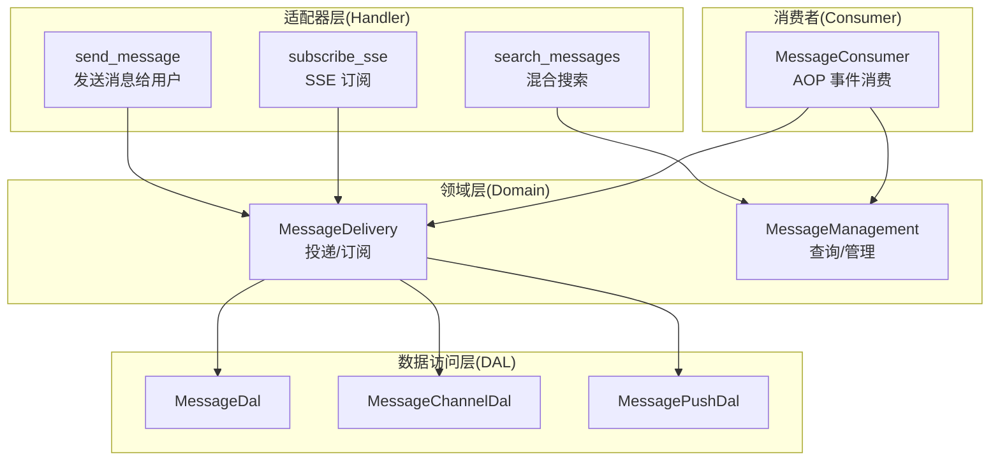
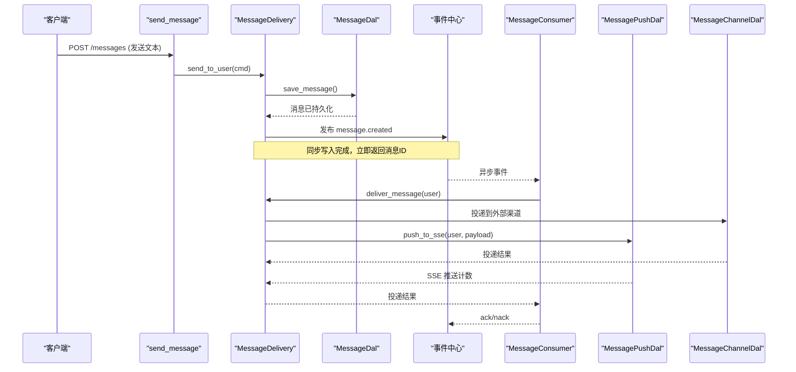
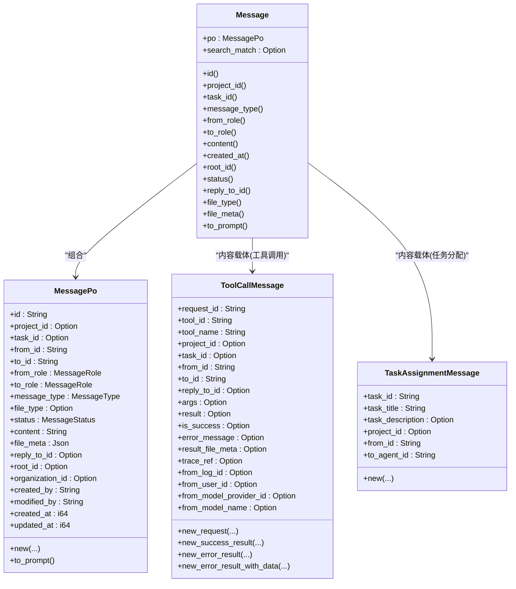
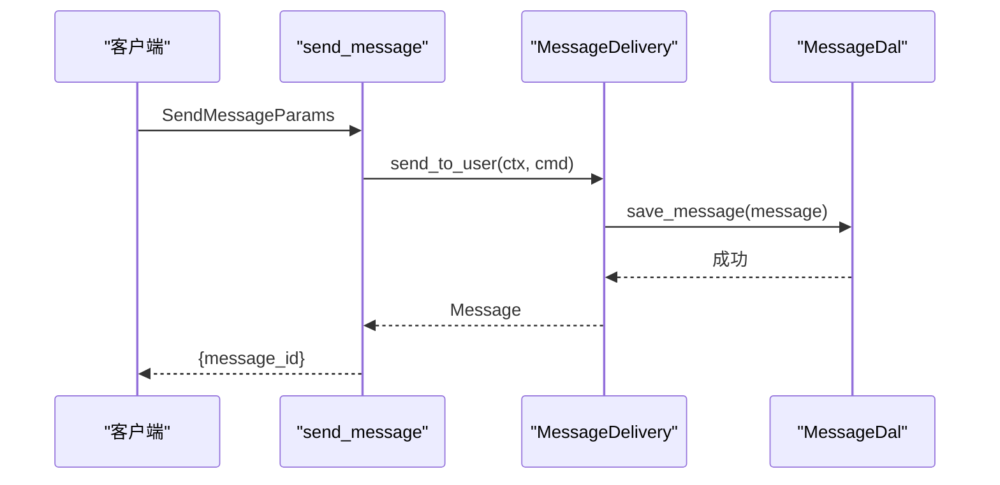
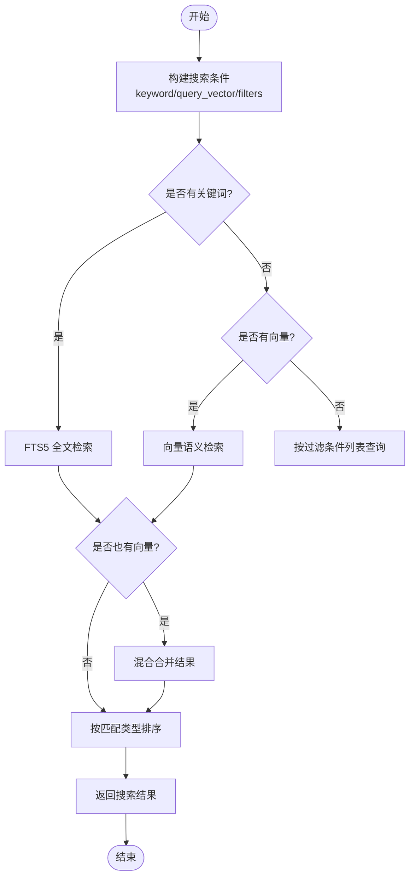
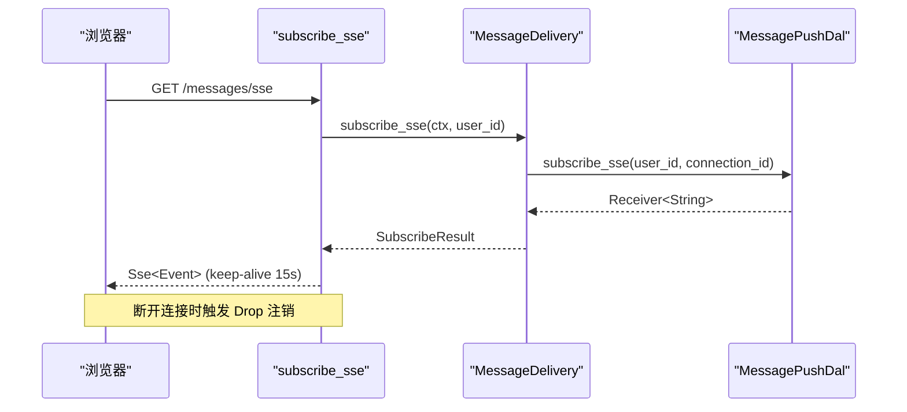
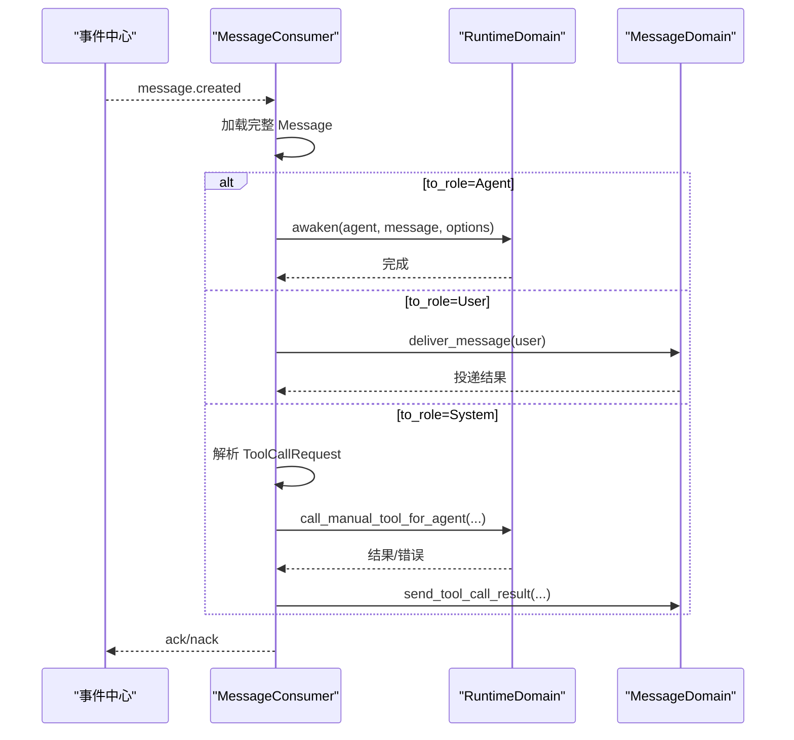
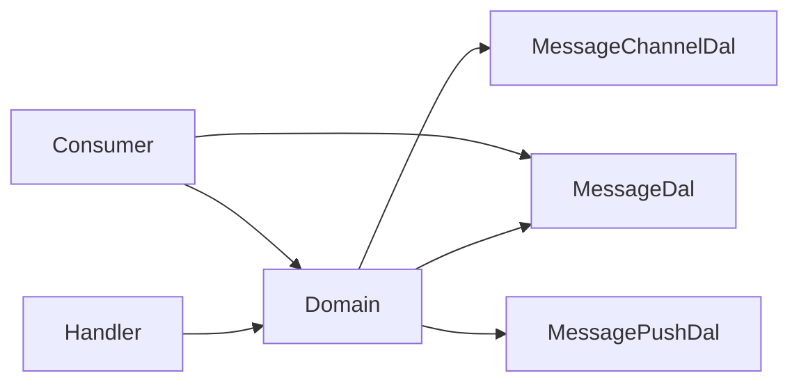

# 消息系统处理器

<cite>
**本文引用的文件**
- [src/handlers/finance/message/mod.rs](file://src/handlers/finance/message/mod.rs)
- [src/handlers/finance/message/send_message.rs](file://src/handlers/finance/message/send_message.rs)
- [src/handlers/finance/message/search_messages.rs](file://src/handlers/finance/message/search_messages.rs)
- [src/handlers/finance/message/subscribe_sse.rs](file://src/handlers/finance/message/subscribe_sse.rs)
- [src/models/message.rs](file://src/models/message.rs)
- [src/service/domain/message/mod.rs](file://src/service/domain/message/mod.rs)
- [src/service/domain/message/delivery.rs](file://src/service/domain/message/delivery.rs)
- [src/service/domain/message/management.rs](file://src/service/domain/message/management.rs)
- [src/consumer/message.rs](file://src/consumer/message.rs)
- [migrations/20260420000000_initial.sql](file://migrations/20260420000000_initial.sql)
- [migrations/20260508000000_message_channels.sql](file://migrations/20260508000000_message_channels.sql)
- [migrations/20260718000000_add_org_and_root_to_messages.sql](file://migrations/20260718000000_add_org_and_root_to_messages.sql)
</cite>

## 目录
1. [简介](#简介)
2. [项目结构](#项目结构)
3. [核心组件](#核心组件)
4. [架构总览](#架构总览)
5. [详细组件分析](#详细组件分析)
6. [依赖关系分析](#依赖关系分析)
7. [性能与可扩展性](#性能与可扩展性)
8. [故障排查指南](#故障排查指南)
9. [结论](#结论)
10. [附录：API 与最佳实践](#附录api-与最佳实践)

## 简介
本文件面向“消息系统处理器”，覆盖消息发送、接收、搜索、订阅等核心能力，重点说明 SSE 实时推送、消息队列处理、异步分发机制；文档化消息格式规范、路由规则、优先级处理、重试机制；并给出消息持久化、索引优化、分页查询、全文搜索的实现细节与使用建议。同时提供消息发送示例、实时订阅代码片段路径与检索最佳实践，帮助开发者快速集成与排障。

## 项目结构
消息系统遵循四层单向调用：Adapter（HTTP Handler / AOP Producer）→ Domain → DAL → DAO，禁止跨层调用与同层互调。Handler 仅负责参数校验与调用 Domain；Domain 编排业务逻辑并调用 DAL；DAL 封装领域数据访问；DAO 负责 SQL 与存储细节。

图表来源
- [src/handlers/finance/message/send_message.rs:1-41](file://src/handlers/finance/message/send_message.rs#L1-L41)
- [src/handlers/finance/message/search_messages.rs:1-79](file://src/handlers/finance/message/search_messages.rs#L1-L79)
- [src/handlers/finance/message/subscribe_sse.rs:1-93](file://src/handlers/finance/message/subscribe_sse.rs#L1-L93)
- [src/service/domain/message/mod.rs:1-378](file://src/service/domain/message/mod.rs#L1-L378)
- [src/consumer/message.rs:1-534](file://src/consumer/message.rs#L1-L534)

章节来源
- [src/handlers/finance/message/mod.rs:1-17](file://src/handlers/finance/message/mod.rs#L1-L17)

## 核心组件
- 消息实体与持久化对象
  - Message：业务实体，包装 MessagePo，支持 Event trait 进入事件总线，具备 order_key/priority 等调度元信息。
  - MessagePo：持久化对象，包含消息类型、角色、内容、附件元数据、回复链 root_id、组织上下文等。
- 领域接口
  - MessageDelivery：发送消息（用户/Agent）、工具调用请求/结果、任务分配、多渠道投递、SSE 订阅/取消。
  - MessageManagement：通用查询、按任务/项目列表、按 ID 获取、状态更新、删除、对话清理、混合搜索。
- HTTP 适配器
  - send_message：发送文本消息给用户，返回消息 ID。
  - search_messages：关键词 + 向量混合搜索，返回匹配类型与排序信息。
  - subscribe_sse：建立 SSE 流，自动清理连接。
- 消费者
  - MessageConsumer：订阅 message.created 事件，按 to_role 分发到 Agent 唤醒、用户投递或系统处理；支持并发、重试与 ack/nack。

章节来源
- [src/models/message.rs:18-247](file://src/models/message.rs#L18-L247)
- [src/service/domain/message/mod.rs:119-378](file://src/service/domain/message/mod.rs#L119-L378)
- [src/handlers/finance/message/send_message.rs:1-41](file://src/handlers/finance/message/send_message.rs#L1-L41)
- [src/handlers/finance/message/search_messages.rs:1-79](file://src/handlers/finance/message/search_messages.rs#L1-L79)
- [src/handlers/finance/message/subscribe_sse.rs:1-93](file://src/handlers/finance/message/subscribe_sse.rs#L1-L93)
- [src/consumer/message.rs:64-141](file://src/consumer/message.rs#L64-L141)

## 架构总览
消息从 Handler 进入 Domain，持久化后通过 AOP 事件中心发布 MESSAGE_CREATED；消费者异步消费，根据目标角色进行不同处理：
- 目标为 Agent：唤醒 Agent 执行任务，必要时通知用户。
- 目标为用户：多渠道投递（外部渠道 + SSE）。
- 目标为系统：解析工具调用请求，执行工具并回写结果。

图表来源
- [src/handlers/finance/message/send_message.rs:1-41](file://src/handlers/finance/message/send_message.rs#L1-L41)
- [src/service/domain/message/delivery.rs:160-208](file://src/service/domain/message/delivery.rs#L160-L208)
- [src/consumer/message.rs:78-128](file://src/consumer/message.rs#L78-L128)
- [src/service/domain/message/delivery.rs:381-436](file://src/service/domain/message/delivery.rs#L381-L436)

## 详细组件分析

### 消息实体与格式规范
- 消息类型与角色
  - 类型：Text、Image、File、Audio、Video、ToolCallRequest、ToolCallResult、ConfirmRequest、ConfirmResponse、TaskAssignment、TaskDispatchNotification、ProjectFollowupNotification。
  - 角色：User、Agent、System。
- 关键字段
  - id、project_id、task_id、from_id、to_id、from_role、to_role、message_type、content、file_meta、reply_to_id、root_id、organization_id、created_by/updated_at。
- 工具调用消息
  - ToolCallMessage：统一承载请求与结果，包含 request_id、tool_id、args/result、trace_ref、from_log_id/from_user_id/from_model_provider_id/from_model_name 等上下文回填字段。
- 任务分配消息
  - TaskAssignmentMessage：携带 task_id、task_title、project_id、from_id、to_agent_id。

图表来源
- [src/models/message.rs:18-247](file://src/models/message.rs#L18-L247)
- [src/models/message.rs:249-400](file://src/models/message.rs#L249-L400)
- [src/models/message.rs:402-571](file://src/models/message.rs#L402-L571)
- [src/models/message.rs:573-612](file://src/models/message.rs#L573-L612)

章节来源
- [src/models/message.rs:18-612](file://src/models/message.rs#L18-L612)

### 发送消息（用户）
- 入口：send_message_handler
- 流程：构造 SendToUserCommand → Domain.delivery.send_to_user → 持久化 → 返回消息 ID。
- 特性：支持 project_id/task_id/reply_to_id；自动设置 from_role=Agent、to_role=User、type=Text。

图表来源
- [src/handlers/finance/message/send_message.rs:1-41](file://src/handlers/finance/message/send_message.rs#L1-L41)
- [src/service/domain/message/delivery.rs:160-208](file://src/service/domain/message/delivery.rs#L160-L208)

章节来源
- [src/handlers/finance/message/send_message.rs:1-41](file://src/handlers/finance/message/send_message.rs#L1-L41)
- [src/service/domain/message/delivery.rs:160-208](file://src/service/domain/message/delivery.rs#L160-L208)

### 混合搜索（关键词 + 向量语义）
- 入口：search_messages_handler
- 流程：构建 MessageSearch（keyword/query_vector/top_k/filters）→ Domain.management.search → 转换为搜索结果（含 match_type、fts_rank、vector_distance）。
- 策略：keyword 存在走 FTS5；query_vector 存在走向量；两者都有则混合合并。

图表来源
- [src/handlers/finance/message/search_messages.rs:1-79](file://src/handlers/finance/message/search_messages.rs#L1-L79)
- [src/service/domain/message/mod.rs:333-378](file://src/service/domain/message/mod.rs#L333-L378)

章节来源
- [src/handlers/finance/message/search_messages.rs:1-79](file://src/handlers/finance/message/search_messages.rs#L1-L79)
- [src/service/domain/message/mod.rs:333-378](file://src/service/domain/message/mod.rs#L333-L378)

### SSE 实时推送与订阅
- 入口：subscribe_sse_handler
- 流程：创建连接 ID → Domain.delivery.subscribe_sse → BroadcastStream 映射为 SSE Event → Drop 时自动注销连接。
- 保活：每 15 秒发送 keep-alive。

图表来源
- [src/handlers/finance/message/subscribe_sse.rs:1-93](file://src/handlers/finance/message/subscribe_sse.rs#L1-L93)
- [src/service/domain/message/delivery.rs:438-459](file://src/service/domain/message/delivery.rs#L438-L459)

章节来源
- [src/handlers/finance/message/subscribe_sse.rs:1-93](file://src/handlers/finance/message/subscribe_sse.rs#L1-L93)
- [src/service/domain/message/delivery.rs:438-459](file://src/service/domain/message/delivery.rs#L438-L459)

### 消息队列与异步分发
- 事件模型：MESSAGE_CREATED 事件由持久化后发布，消费者订阅并异步处理。
- 分发规则：
  - to_role=Agent：唤醒 Agent，检查任务状态与思考深度限制，必要时通知用户。
  - to_role=User：多渠道投递（外部渠道 + SSE），任一失败则 nack 重试。
  - to_role=System：解析 ToolCallRequest，执行工具并写回 ToolCallResult。
- 并发与重试：
  - 并发度：4。
  - 空队列休眠：100ms。
  - 错误重试休眠：1000ms。
  - ack：处理成功标记为 Processed；nack：恢复为 Pending 以便重试。

图表来源
- [src/consumer/message.rs:78-128](file://src/consumer/message.rs#L78-L128)
- [src/consumer/message.rs:147-357](file://src/consumer/message.rs#L147-L357)
- [src/consumer/message.rs:359-477](file://src/consumer/message.rs#L359-L477)

章节来源
- [src/consumer/message.rs:64-141](file://src/consumer/message.rs#L64-L141)
- [src/consumer/message.rs:147-477](file://src/consumer/message.rs#L147-L477)

### 持久化与索引优化
- 表结构
  - messages：基础消息表，包含 content、file_meta、reply_to_id、root_id、organization_id 等。
  - message_channels：消息渠道配置与投递记录。
- 索引与搜索
  - FTS5：用于全文检索，结合 trigram 分词器。
  - 向量索引：LanceDB/HNSW/InMemory/SqliteVss 多后端降级，Vectorizable trait 将 content 作为向量化文本。
- 分页与排序
  - 通过 MessageQuery 的 limit/offset 实现分页；搜索结果按 match_type、fts_rank、vector_distance 综合排序。

章节来源
- [migrations/20260420000000_initial.sql:1-200](file://migrations/20260420000000_initial.sql#L1-L200)
- [migrations/20260508000000_message_channels.sql:1-200](file://migrations/20260508000000_message_channels.sql#L1-L200)
- [migrations/20260718000000_add_org_and_root_to_messages.sql:1-200](file://migrations/20260718000000_add_org_and_root_to_messages.sql#L1-L200)
- [src/models/message.rs:640-651](file://src/models/message.rs#L640-L651)

## 依赖关系分析
- 耦合与内聚
  - Handler 仅依赖 Domain 接口，低耦合。
  - Domain 聚合多个 DAL 接口，职责清晰。
  - Consumer 依赖 Domain 与 DAL，解耦于 AOP 框架。
- 外部依赖
  - Axum：HTTP 服务与 SSE。
  - sqlx：SQLite 查询与缓存。
  - LanceDB/HNSW/InMemory/SqliteVss：向量检索后端。
  - FTS5：全文检索。

图表来源
- [src/handlers/finance/message/mod.rs:1-17](file://src/handlers/finance/message/mod.rs#L1-L17)
- [src/service/domain/message/mod.rs:1-66](file://src/service/domain/message/mod.rs#L1-L66)
- [src/consumer/message.rs:1-63](file://src/consumer/message.rs#L1-L63)

章节来源
- [src/handlers/finance/message/mod.rs:1-17](file://src/handlers/finance/message/mod.rs#L1-L17)
- [src/service/domain/message/mod.rs:1-66](file://src/service/domain/message/mod.rs#L1-L66)
- [src/consumer/message.rs:1-63](file://src/consumer/message.rs#L1-L63)

## 性能与可扩展性
- 并发与背压
  - 消费者并发度 4，空队列短休眠避免忙轮询。
  - SSE 使用 BroadcastStream，连接自动清理防止内存泄漏。
- 索引与查询
  - FTS5 + trigram 提升中文检索效果。
  - 向量检索支持多后端降级，保障可用性。
- 扩展点
  - Domain 可注入权限校验、数据过滤等规则。
  - 多渠道投递可扩展新的渠道适配器。

[本节为通用指导，不直接分析具体文件]

## 故障排查指南
- 常见问题
  - 所有渠道投递失败：消费者返回错误并 nack 重试，需检查外部渠道与 SSE 推送。
  - Agent 忙碌：尝试占用失败会重试，检查 Agent 状态与任务生命周期。
  - 工具调用结果过大：超过内联限制会被截断，建议使用 result_file_meta 存储大结果。
- 定位步骤
  - 查看消息状态：Pending/Processed。
  - 检查 SSE 连接是否被正确注销。
  - 核对 ToolCallMessage 的上下文字段是否回填。

章节来源
- [src/consumer/message.rs:359-389](file://src/consumer/message.rs#L359-L389)
- [src/consumer/message.rs:147-196](file://src/consumer/message.rs#L147-L196)
- [src/service/domain/message/delivery.rs:271-330](file://src/service/domain/message/delivery.rs#L271-L330)

## 结论
消息系统以清晰的层次划分与事件驱动架构实现了高可靠的消息收发、实时推送与混合搜索。通过 Domain 抽象、DAL 解耦与消费者异步处理，系统在可扩展性与稳定性方面具备良好基础。建议在生产环境关注索引优化、渠道健康监控与 SSE 连接治理。

[本节为总结，不直接分析具体文件]

## 附录：API 与最佳实践
- 消息发送示例
  - 路径：POST /api/v1/finance/messages
  - 入参：SendMessageParams（to_user_id、content、project_id、task_id、reply_to_id）
  - 出参：SendMessageResponse（message_id）
  - 参考实现路径：[send_message.rs:1-41](file://src/handlers/finance/message/send_message.rs#L1-L41)
- 实时订阅代码
  - 路径：GET /api/v1/finance/messages/sse
  - 行为：建立 SSE 流，每 15 秒保活，断开自动注销
  - 参考实现路径：[subscribe_sse.rs:1-93](file://src/handlers/finance/message/subscribe_sse.rs#L1-L93)
- 消息检索最佳实践
  - 优先使用 keyword 走 FTS5；需要语义理解时加入 query_vector；两者并存启用混合搜索。
  - 合理设置 limit/top_k，避免全量扫描。
  - 参考实现路径：[search_messages.rs:1-79](file://src/handlers/finance/message/search_messages.rs#L1-L79)

章节来源
- [src/handlers/finance/message/send_message.rs:1-41](file://src/handlers/finance/message/send_message.rs#L1-L41)
- [src/handlers/finance/message/subscribe_sse.rs:1-93](file://src/handlers/finance/message/subscribe_sse.rs#L1-L93)
- [src/handlers/finance/message/search_messages.rs:1-79](file://src/handlers/finance/message/search_messages.rs#L1-L79)