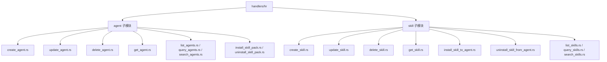
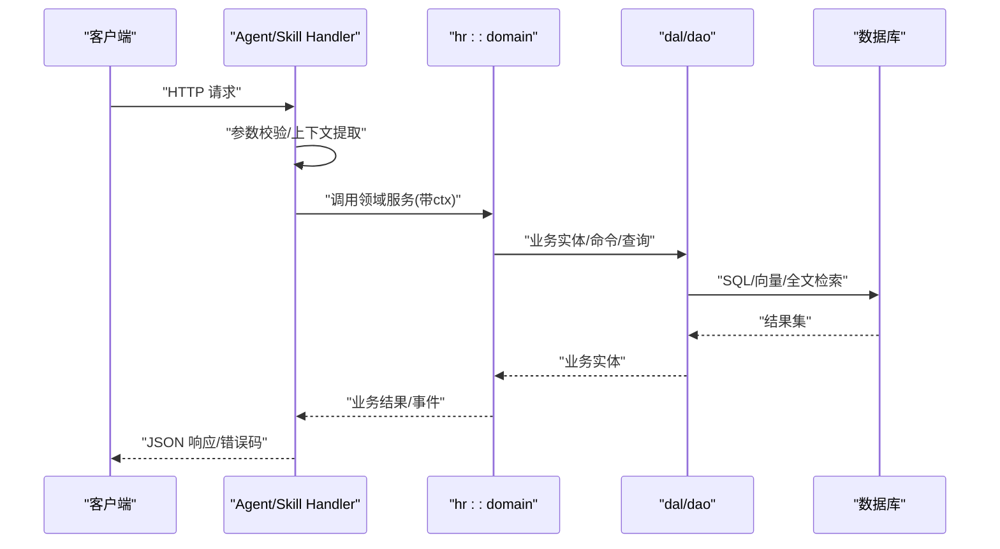
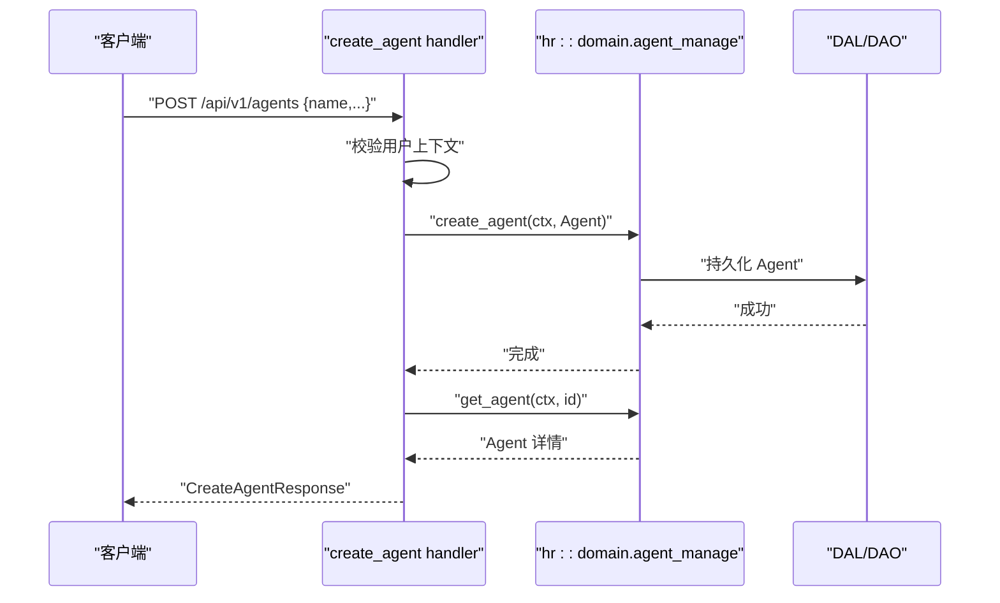
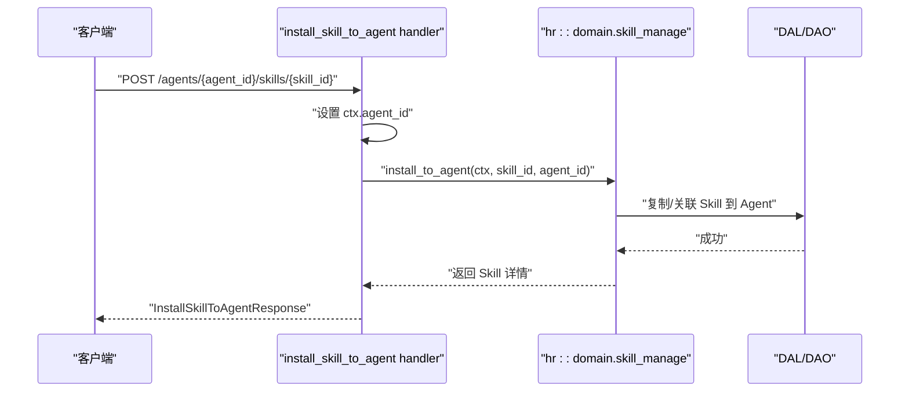
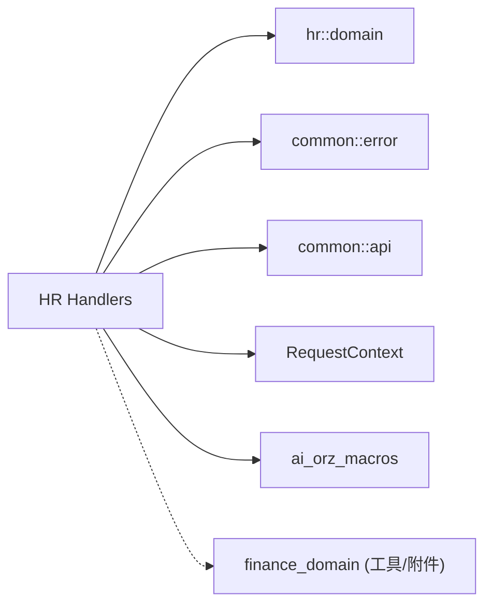

# HR模块处理器

<cite>
**本文引用的文件**
- [src/handlers/hr/mod.rs](file://src/handlers/hr/mod.rs)
- [src/handlers/hr/agent/mod.rs](file://src/handlers/hr/agent/mod.rs)
- [src/handlers/hr/skill/mod.rs](file://src/handlers/hr/skill/mod.rs)
- [src/handlers/hr/agent/create_agent.rs](file://src/handlers/hr/agent/create_agent.rs)
- [src/handlers/hr/agent/update_agent.rs](file://src/handlers/hr/agent/update_agent.rs)
- [src/handlers/hr/agent/delete_agent.rs](file://src/handlers/hr/agent/delete_agent.rs)
- [src/handlers/hr/agent/get_agent.rs](file://src/handlers/hr/agent/get_agent.rs)
- [src/handlers/hr/skill/create_skill.rs](file://src/handlers/hr/skill/create_skill.rs)
- [src/handlers/hr/skill/update_skill.rs](file://src/handlers/hr/skill/update_skill.rs)
- [src/handlers/hr/skill/delete_skill.rs](file://src/handlers/hr/skill/delete_skill.rs)
- [src/handlers/hr/skill/get_skill.rs](file://src/handlers/hr/skill/get_skill.rs)
- [src/handlers/hr/skill/install_skill_to_agent.rs](file://src/handlers/hr/skill/install_skill_to_agent.rs)
- [src/handlers/hr/skill/uninstall_skill_from_agent.rs](file://src/handlers/hr/skill/uninstall_skill_from_agent.rs)
</cite>

## 目录
1. [简介](#简介)
2. [项目结构](#项目结构)
3. [核心组件](#核心组件)
4. [架构总览](#架构总览)
5. [详细组件分析](#详细组件分析)
6. [依赖关系分析](#依赖关系分析)
7. [性能与并发](#性能与并发)
8. [故障排查指南](#故障排查指南)
9. [结论](#结论)
10. [附录：API 参考与最佳实践](#附录api-参考与最佳实践)

## 简介
本文件面向 HR（人力资源）模块的 HTTP 处理器，聚焦 Agent 管理与 Skill 管理两大能力。内容覆盖：
- Agent 的创建、更新、删除、查询等 CRUD 操作
- Skill 的安装、卸载、配置与文件管理
- 参数校验、业务逻辑调用、错误处理与响应格式
- 与领域服务层（Domain/DAL/DAO）的交互模式、事务与并发控制策略
- API 调用示例、请求/响应结构与错误码说明
- 处理器开发规范与最佳实践

本模块严格遵循四层单向调用：Adapter（HTTP Handler）→ Domain → DAL → DAO，禁止跨层调用与同层互调；所有公共方法首参为 RequestContext，跨层传递使用 ctx.clone()。

## 项目结构
HR 模块位于 handlers/hr，按功能域划分为 agent 与 skill 两个子模块，每个子模块按方法粒度拆分处理器文件，便于维护与测试。

图表来源
- [src/handlers/hr/agent/mod.rs:1-28](file://src/handlers/hr/agent/mod.rs#L1-L28)
- [src/handlers/hr/skill/mod.rs:1-19](file://src/handlers/hr/skill/mod.rs#L1-L19)

章节来源
- [src/handlers/hr/mod.rs:1-11](file://src/handlers/hr/mod.rs#L1-L11)
- [src/handlers/hr/agent/mod.rs:1-55](file://src/handlers/hr/agent/mod.rs#L1-L55)
- [src/handlers/hr/skill/mod.rs:1-36](file://src/handlers/hr/skill/mod.rs#L1-L36)

## 核心组件
- Agent 处理器：提供 Agent 生命周期与运行时信息读取、技能包安装/卸载、记忆体管理等接口。
- Skill 处理器：提供 Skill 元数据与文件管理、向 Agent 安装/卸载 Skill 副本、Skill 搜索与列表等接口。
- 统一宏驱动：通过 generate_http_handler 与 register_handler_tool 自动生成路由绑定与工具注册，简化处理器实现。

章节来源
- [src/handlers/hr/agent/mod.rs:30-54](file://src/handlers/hr/agent/mod.rs#L30-L54)
- [src/handlers/hr/skill/mod.rs:21-35](file://src/handlers/hr/skill/mod.rs#L21-L35)

## 架构总览
Handler 作为 Adapter 层，仅负责参数解析、权限上下文提取、调用 Domain 服务并返回标准化响应。Domain 层封装业务规则，DAL/DAO 负责持久化。

图表来源
- [src/handlers/hr/agent/create_agent.rs:18-41](file://src/handlers/hr/agent/create_agent.rs#L18-L41)
- [src/handlers/hr/skill/create_skill.rs:22-82](file://src/handlers/hr/skill/create_skill.rs#L22-L82)

章节来源
- [src/handlers/hr/agent/create_agent.rs:1-60](file://src/handlers/hr/agent/create_agent.rs#L1-L60)
- [src/handlers/hr/skill/create_skill.rs:1-92](file://src/handlers/hr/skill/create_skill.rs#L1-L92)

## 详细组件分析

### Agent 管理处理器
- 创建 Agent：POST /api/v1/agents
  - 参数：名称、角色、描述、能力、灵魂、模型提供者 ID 等
  - 校验：用户上下文必须存在
  - 流程：构造 AgentPo → 转为 Agent → 调用 domain.agent_manage().create_agent(ctx, &agent) → 获取已创建记录并返回
  - 错误：缺少用户上下文、领域服务异常
  - 响应：CreateAgentResponse（id、name、description、created_at）

- 更新 Agent：PUT /api/v1/agents/{id}
  - 参数：可更新 name/description/capabilities/soul/model_provider_id
  - 流程：get_agent → enrich_ctx → 字段合并 → update_agent(ctx, &agent) → 返回 UpdateAgentResponse
  - 注意：capabilities 以 JSON 字符串持久化，返回时序列化为数组

- 删除 Agent：DELETE /api/v1/agents/{id}
  - 流程：get_agent → enrich_ctx → delete_agent(ctx, &agent) → 返回成功标志

- 获取 Agent 详情：GET /api/v1/agents/{id}
  - 参数：with_stats、with_model_call_stats、stats_time_start/end、stats_interval
  - 流程：构建 AgentFetchOptions → get_agent(ctx, id, options) → 组装外部配置、运行时状态、绑定工具列表、统计信息 → 返回 GetAgentResponse

图表来源
- [src/handlers/hr/agent/create_agent.rs:18-47](file://src/handlers/hr/agent/create_agent.rs#L18-L47)

章节来源
- [src/handlers/hr/agent/create_agent.rs:1-60](file://src/handlers/hr/agent/create_agent.rs#L1-L60)
- [src/handlers/hr/agent/update_agent.rs:1-87](file://src/handlers/hr/agent/update_agent.rs#L1-L87)
- [src/handlers/hr/agent/delete_agent.rs:1-35](file://src/handlers/hr/agent/delete_agent.rs#L1-L35)
- [src/handlers/hr/agent/get_agent.rs:1-138](file://src/handlers/hr/agent/get_agent.rs#L1-L138)

### Skill 管理处理器
- 创建 Skill：POST /api/v1/skills
  - 参数：name、description、tags、category、status、content、initial_files
  - 校验：用户上下文、name 非空、文件名合法性（防路径遍历）
  - 流程：生成 skill_id → 构造 SkillPo → 附加初始文件（含 skill.md）→ create_skill(ctx, &skill) → get_skill(ctx, id) → 返回 CreateSkillResponse

- 更新 Skill：PUT /api/v1/skills/{skill_id}
  - 参数：name、description、tags、category、status、content、files（attachment_id + target_path）
  - 校验：用户上下文、name/category 非空、attachment_id 与目标路径非空、附件存在且可读
  - 流程：get_skill → 更新元数据 → 将 content 写入 skill.md → 从附件读取二进制写入目标路径 → update_skill(ctx, params) → get_skill(ctx, id) → 返回 UpdateSkillResponse

- 删除 Skill：DELETE /api/v1/skills/{skill_id}
  - 流程：get_skill → delete_skill(ctx, id) → 返回成功

- 获取 Skill 详情：GET /api/v1/skills/{skill_id}
  - 流程：get_skill(ctx, id) → to_detail(...) → 返回 GetSkillResponse

- 安装 Skill 到 Agent：POST /api/v1/agents/{agent_id}/skills/{skill_id}
  - 流程：设置 ctx.agent_id → install_to_agent(ctx, skill_id, agent_id) → 返回 InstallSkillToAgentResponse

- 从 Agent 卸载 Skill：DELETE /api/v1/hr/agents/{agent_id}/skills/{skill_id}
  - 流程：设置 ctx.agent_id → uninstall_from_agent(ctx, skill_id, agent_id) → 返回 UninstallSkillFromAgentResponse

图表来源
- [src/handlers/hr/skill/install_skill_to_agent.rs:20-35](file://src/handlers/hr/skill/install_skill_to_agent.rs#L20-L35)

章节来源
- [src/handlers/hr/skill/create_skill.rs:1-92](file://src/handlers/hr/skill/create_skill.rs#L1-L92)
- [src/handlers/hr/skill/update_skill.rs:1-127](file://src/handlers/hr/skill/update_skill.rs#L1-L127)
- [src/handlers/hr/skill/delete_skill.rs:1-34](file://src/handlers/hr/skill/delete_skill.rs#L1-L34)
- [src/handlers/hr/skill/get_skill.rs:1-31](file://src/handlers/hr/skill/get_skill.rs#L1-L31)
- [src/handlers/hr/skill/install_skill_to_agent.rs:1-37](file://src/handlers/hr/skill/install_skill_to_agent.rs#L1-L37)
- [src/handlers/hr/skill/uninstall_skill_from_agent.rs:1-35](file://src/handlers/hr/skill/uninstall_skill_from_agent.rs#L1-L35)

### 参数验证与错误处理
- 通用校验：
  - 用户上下文 ctx.uid() 必须非空，否则返回 InvalidRequest
  - 必填字段为空时返回 InvalidRequest（如 name、category、attachment_id、target_path）
  - 文件名需通过 validate_skill_import_target_path 校验，防止路径遍历
- 资源不存在：
  - get_agent/get_skill 未找到时返回 NotFound
- 领域服务异常：
  - 透传领域服务错误，由上层统一转换为 HTTP 响应

章节来源
- [src/handlers/hr/agent/create_agent.rs:18-25](file://src/handlers/hr/agent/create_agent.rs#L18-L25)
- [src/handlers/hr/skill/create_skill.rs:22-32](file://src/handlers/hr/skill/create_skill.rs#L22-L32)
- [src/handlers/hr/skill/update_skill.rs:22-74](file://src/handlers/hr/skill/update_skill.rs#L22-L74)
- [src/handlers/hr/agent/get_agent.rs:24-46](file://src/handlers/hr/agent/get_agent.rs#L24-L46)
- [src/handlers/hr/skill/get_skill.rs:20-27](file://src/handlers/hr/skill/get_skill.rs#L20-L27)

### 与领域服务层的交互模式
- 调用入口：domain().agent_manage()/domain().skill_manage()
- 输入：Command/Query（如 Agent、Skill 实体或参数对象）
- 输出：业务实体（内部持有 po 字段），不暴露 PO
- 上下文：所有方法首参为 ctx: RequestContext，跨层使用 ctx.clone()
- 事务：由领域服务在 DAL/DAO 层组织事务边界，Handler 不直接管理事务
- 并发：领域服务内部对写操作进行串行化或锁保护，Handler 侧无额外并发控制

章节来源
- [src/handlers/hr/agent/create_agent.rs:38-41](file://src/handlers/hr/agent/create_agent.rs#L38-L41)
- [src/handlers/hr/skill/create_skill.rs:79-82](file://src/handlers/hr/skill/create_skill.rs#L79-L82)
- [src/handlers/hr/skill/update_skill.rs:106-117](file://src/handlers/hr/skill/update_skill.rs#L106-L117)

## 依赖关系分析
- Handler 依赖：
  - common::api：请求/响应结构体
  - common::error：Result、bail_err、err
  - crate::pkg::RequestContext：请求上下文
  - crate::service::domain::hr：领域服务
  - ai_orz_macros：generate_http_handler、register_handler_tool
- 横向依赖：
  - get_agent 中调用 finance_domain().tool_provider_manage() 获取绑定工具列表
  - update_skill 中调用 finance_domain().attachment_manage() 读取附件内容

图表来源
- [src/handlers/hr/agent/get_agent.rs:100-104](file://src/handlers/hr/agent/get_agent.rs#L100-L104)
- [src/handlers/hr/skill/update_skill.rs:76-92](file://src/handlers/hr/skill/update_skill.rs#L76-L92)

章节来源
- [src/handlers/hr/agent/get_agent.rs:1-138](file://src/handlers/hr/agent/get_agent.rs#L1-L138)
- [src/handlers/hr/skill/update_skill.rs:1-127](file://src/handlers/hr/skill/update_skill.rs#L1-L127)

## 性能与并发
- 查询优化：
  - get_agent 支持 with_stats、with_model_call_stats、stats_time_range、stats_interval，按需加载统计，避免冗余 IO
- 批量与分页：
  - list/query/search 系列接口建议结合 DAL 的分页与索引优化（具体实现位于 DAL/DAO）
- 并发控制：
  - 写操作（创建/更新/删除/安装/卸载）由领域服务保证原子性与一致性，Handler 不引入额外锁
- I/O 优化：
  - update_skill 通过附件读取后直接写入目标路径，减少内存拷贝；大文件场景建议关注流式处理（DAL/DAO 层）

[本节为通用指导，不直接分析具体文件]

## 故障排查指南
- 常见错误码与原因：
  - InvalidRequest：缺少用户上下文、必填字段为空、附件不存在或无权访问、文件名非法
  - NotFound：Agent/Skill 不存在
  - 领域服务异常：持久化失败、约束冲突、外部依赖不可用
- 定位步骤：
  - 检查请求参数是否完整、类型是否正确
  - 确认 ctx.uid() 与 ctx.agent_id() 是否有效
  - 查看领域服务日志与 DAL/DAO 层 SQL/IO 错误
  - 对于 Skill 更新，确认 attachment_id 对应附件存在且可读
- 恢复建议：
  - 修正请求参数后重试
  - 修复权限或资源缺失问题
  - 若为领域服务异常，检查数据库连接、存储路径与外部依赖可用性

章节来源
- [src/handlers/hr/agent/create_agent.rs:22-25](file://src/handlers/hr/agent/create_agent.rs#L22-L25)
- [src/handlers/hr/skill/create_skill.rs:26-32](file://src/handlers/hr/skill/create_skill.rs#L26-L32)
- [src/handlers/hr/skill/update_skill.rs:68-92](file://src/handlers/hr/skill/update_skill.rs#L68-L92)
- [src/handlers/hr/agent/get_agent.rs:42-46](file://src/handlers/hr/agent/get_agent.rs#L42-L46)
- [src/handlers/hr/skill/get_skill.rs:21-27](file://src/handlers/hr/skill/get_skill.rs#L21-L27)

## 结论
HR 模块处理器以清晰的职责划分与严格的分层架构实现了 Agent 与 Skill 的全生命周期管理。通过宏驱动的处理器定义，代码简洁且易于扩展；参数校验与错误处理一致性强；与领域服务的交互遵循统一的上下文与实体契约。建议在新增接口时遵循现有模式，保持 Handler 薄、领域厚、DAL/DAO 专注持久化的设计原则。

[本节为总结性内容，不直接分析具体文件]

## 附录：API 参考与最佳实践

### API 概览
- Agent
  - POST /api/v1/agents：创建 Agent
  - PUT /api/v1/agents/{id}：更新 Agent
  - DELETE /api/v1/agents/{id}：删除 Agent
  - GET /api/v1/agents/{id}：获取 Agent 详情（可选统计）
  - 其他：列表/查询/搜索、记忆体管理、技能包安装/卸载
- Skill
  - POST /api/v1/skills：创建 Skill（支持初始内容与多文件）
  - PUT /api/v1/skills/{skill_id}：更新 Skill（元数据、主内容、附件导入）
  - DELETE /api/v1/skills/{skill_id}：删除 Skill
  - GET /api/v1/skills/{skill_id}：获取 Skill 详情
  - POST /api/v1/agents/{agent_id}/skills/{skill_id}：安装 Skill 到 Agent
  - DELETE /api/v1/hr/agents/{agent_id}/skills/{skill_id}：从 Agent 卸载 Skill 副本
  - 其他：列表/查询/搜索、标签与文件管理

章节来源
- [src/handlers/hr/agent/mod.rs:30-54](file://src/handlers/hr/agent/mod.rs#L30-L54)
- [src/handlers/hr/skill/mod.rs:21-35](file://src/handlers/hr/skill/mod.rs#L21-L35)

### 请求/响应结构要点
- Agent 创建/更新：
  - 请求包含 name、roles、description、capabilities、soul、model_provider_id 等
  - 响应返回 id、name、description、capabilities、soul、kind、model_provider_id、updated_at 等
- Skill 创建/更新：
  - 请求包含 name、description、tags、category、status、content、initial_files/files（attachment_id + target_path）
  - 响应返回 Skill 详情（to_detail）
- 安装/卸载：
  - 请求携带 agent_id、skill_id
  - 响应返回操作结果与 Skill 详情（安装时）

章节来源
- [src/handlers/hr/agent/create_agent.rs:18-59](file://src/handlers/hr/agent/create_agent.rs#L18-L59)
- [src/handlers/hr/agent/update_agent.rs:20-86](file://src/handlers/hr/agent/update_agent.rs#L20-L86)
- [src/handlers/hr/skill/create_skill.rs:22-90](file://src/handlers/hr/skill/create_skill.rs#L22-L90)
- [src/handlers/hr/skill/update_skill.rs:22-125](file://src/handlers/hr/skill/update_skill.rs#L22-L125)
- [src/handlers/hr/skill/install_skill_to_agent.rs:20-35](file://src/handlers/hr/skill/install_skill_to_agent.rs#L20-L35)
- [src/handlers/hr/skill/uninstall_skill_from_agent.rs:20-33](file://src/handlers/hr/skill/uninstall_skill_from_agent.rs#L20-L33)

### 错误码说明
- InvalidRequest：参数校验失败（缺用户上下文、必填字段为空、附件无效、文件名非法）
- NotFound：资源不存在（Agent/Skill）
- 领域服务异常：由领域服务抛出，Handler 透传

章节来源
- [src/handlers/hr/agent/create_agent.rs:22-25](file://src/handlers/hr/agent/create_agent.rs#L22-L25)
- [src/handlers/hr/skill/create_skill.rs:26-32](file://src/handlers/hr/skill/create_skill.rs#L26-L32)
- [src/handlers/hr/skill/update_skill.rs:68-92](file://src/handlers/hr/skill/update_skill.rs#L68-L92)
- [src/handlers/hr/agent/get_agent.rs:42-46](file://src/handlers/hr/agent/get_agent.rs#L42-L46)
- [src/handlers/hr/skill/get_skill.rs:21-27](file://src/handlers/hr/skill/get_skill.rs#L21-L27)

### 处理器开发规范与最佳实践
- 分层与调用方向：
  - Handler 仅做参数校验、上下文提取、调用 Domain、返回响应
  - 禁止 Handler 直接访问 DAL/DAO 或跨层调用
- 上下文与命名：
  - 所有 Domain 方法首参为 ctx: RequestContext，跨层使用 ctx.clone()
  - 命名遵循 snake_case，Trait 不加后缀，实现类加 Impl 后缀
- 参数校验：
  - 统一使用 bail_err!/err! 返回标准错误
  - 对敏感输入（如文件名）进行合法性校验，防止路径遍历
- 事务与并发：
  - 事务边界在领域服务内管理，Handler 不显式开启/提交事务
  - 写操作由领域服务保证原子性，Handler 无需额外并发控制
- 宏与工具：
  - 使用 generate_http_handler 与 register_handler_tool 简化路由与工具注册
  - 复用 common::api 的请求/响应结构，保持接口一致性

章节来源
- [src/handlers/hr/agent/create_agent.rs:18-41](file://src/handlers/hr/agent/create_agent.rs#L18-L41)
- [src/handlers/hr/skill/create_skill.rs:22-82](file://src/handlers/hr/skill/create_skill.rs#L22-L82)
- [src/handlers/hr/skill/update_skill.rs:22-117](file://src/handlers/hr/skill/update_skill.rs#L22-L117)