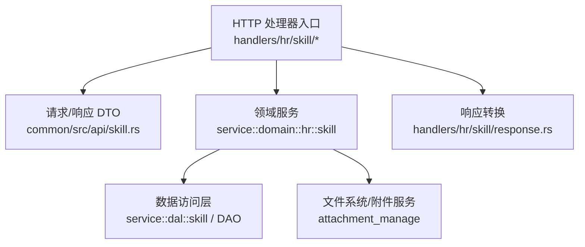
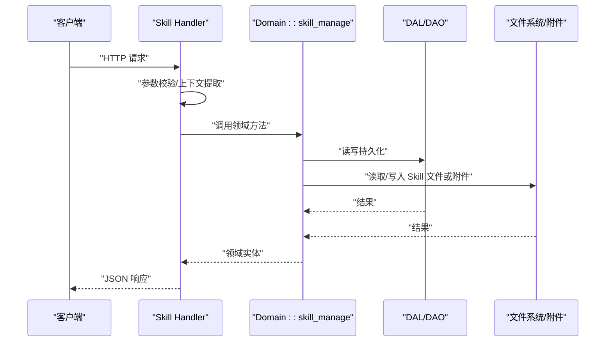
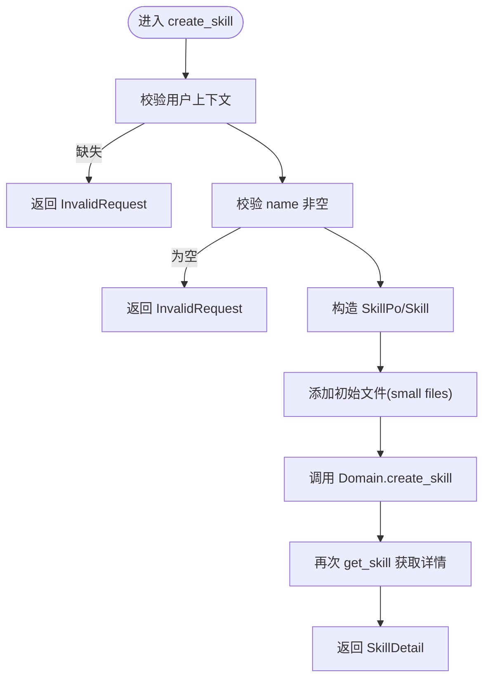
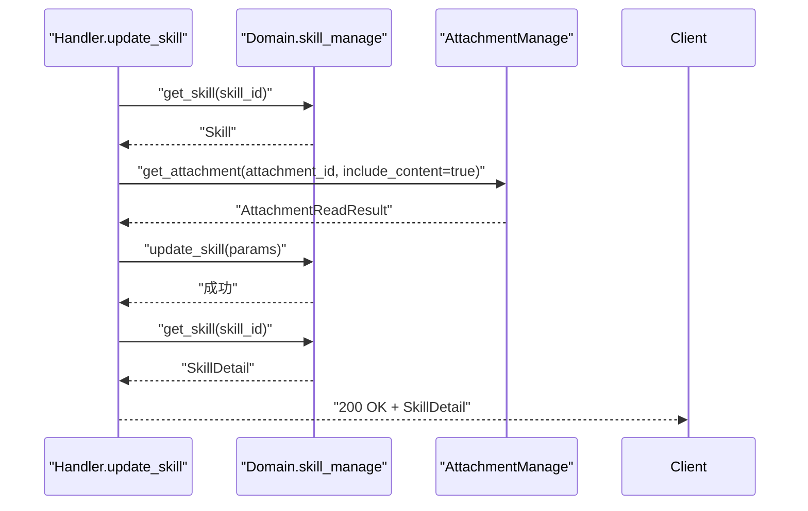
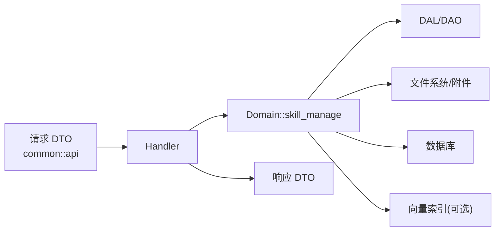

# Skill处理器

<cite>
**本文引用的文件**
- [src/handlers/hr/skill/mod.rs](file://src/handlers/hr/skill/mod.rs)
- [src/handlers/hr/skill/create_skill.rs](file://src/handlers/hr/skill/create_skill.rs)
- [src/handlers/hr/skill/update_skill.rs](file://src/handlers/hr/skill/update_skill.rs)
- [src/handlers/hr/skill/delete_skill.rs](file://src/handlers/hr/skill/delete_skill.rs)
- [src/handlers/hr/skill/get_skill.rs](file://src/handlers/hr/skill/get_skill.rs)
- [src/handlers/hr/skill/list_skills.rs](file://src/handlers/hr/skill/list_skills.rs)
- [src/handlers/hr/skill/query_skills.rs](file://src/handlers/hr/skill/query_skills.rs)
- [src/handlers/hr/skill/search_skills.rs](file://src/handlers/hr/skill/search_skills.rs)
- [src/handlers/hr/skill/install_skill_to_agent.rs](file://src/handlers/hr/skill/install_skill_to_agent.rs)
- [src/handlers/hr/skill/uninstall_skill_from_agent.rs](file://src/handlers/hr/skill/uninstall_skill_from_agent.rs)
- [src/handlers/hr/skill/list_skill_files.rs](file://src/handlers/hr/skill/list_skill_files.rs)
- [src/handlers/hr/skill/get_skill_file_content.rs](file://src/handlers/hr/skill/get_skill_file_content.rs)
- [src/handlers/hr/skill/update_skill_file_content.rs](file://src/handlers/hr/skill/update_skill_file_content.rs)
- [common/src/api/skill.rs](file://common/src/api/skill.rs)
- [src/models/skill.rs](file://src/models/skill.rs)
</cite>

## 目录
1. [简介](#简介)
2. [项目结构](#项目结构)
3. [核心组件](#核心组件)
4. [架构总览](#架构总览)
5. [详细组件分析](#详细组件分析)
6. [依赖关系分析](#依赖关系分析)
7. [性能考虑](#性能考虑)
8. [故障排查指南](#故障排查指南)
9. [结论](#结论)
10. [附录：API 规范与示例](#附录api-规范与示例)

## 简介
本文件面向后端开发者与集成方，系统化说明 Skill 管理相关的 HTTP 处理器实现。内容覆盖 Skill 的创建、更新、删除、查询、搜索、文件内容管理、标签聚合、以及 Skill 与 Agent 的绑定/解绑机制；同时给出参数校验、业务逻辑调用路径、错误处理策略、响应格式与典型 API 调用示例，并总结开发规范与最佳实践。

## 项目结构
Skill 处理器位于 handlers/hr/skill 目录，采用“按方法粒度拆分”的组织方式，每个 HTTP 端点独立一个文件，统一通过宏生成路由与工具注册。DTO 定义集中在 common/src/api/skill.rs，领域模型在 src/models/skill.rs。

图表来源
- [src/handlers/hr/skill/mod.rs:1-36](file://src/handlers/hr/skill/mod.rs#L1-L36)
- [common/src/api/skill.rs:1-466](file://common/src/api/skill.rs#L1-L466)
- [src/models/skill.rs:1-193](file://src/models/skill.rs#L1-L193)

章节来源
- [src/handlers/hr/skill/mod.rs:1-36](file://src/handlers/hr/skill/mod.rs#L1-L36)

## 核心组件
- 请求/响应 DTO：统一在 common/src/api/skill.rs 中定义，包含创建、更新、查询、搜索、文件操作、Agent 安装/卸载等全部接口契约。
- 领域模型：src/models/skill.rs 定义了 SkillPo（持久化对象）与 Skill（业务实体），并提供向量化能力与常用方法。
- HTTP 处理器：handlers/hr/skill 下各文件分别实现具体端点，负责参数校验、上下文提取、调用领域服务、转换响应。
- 响应转换：handlers/hr/skill/response.rs 将领域模型转换为对外 DTO。

章节来源
- [common/src/api/skill.rs:1-466](file://common/src/api/skill.rs#L1-L466)
- [src/models/skill.rs:1-193](file://src/models/skill.rs#L1-L193)
- [src/handlers/hr/skill/response.rs:1-47](file://src/handlers/hr/skill/response.rs#L1-L47)

## 架构总览
遵循四层单向调用：Adapter（HTTP Handler）→ Domain → DAL → DAO。Handler 仅做参数校验与上下文装配，不直接访问数据库或文件系统；所有业务规则在 Domain 层实现。

图表来源
- [src/handlers/hr/skill/create_skill.rs:1-92](file://src/handlers/hr/skill/create_skill.rs#L1-L92)
- [src/handlers/hr/skill/update_skill.rs:1-127](file://src/handlers/hr/skill/update_skill.rs#L1-L127)
- [src/handlers/hr/skill/get_skill.rs:1-31](file://src/handlers/hr/skill/get_skill.rs#L1-L31)

## 详细组件分析

### 创建 Skill（POST /api/v1/skills）
- 职责：创建新 Skill，支持初始主内容 skill.md 与多文件 initial_files。
- 参数校验：
  - 必须存在用户上下文 uid。
  - name 不能为空。
  - category 为空时默认 uncategorized。
  - initial_files 中的文件名需通过目标路径校验，防止路径遍历。
- 业务逻辑：
  - 构造 SkillPo 与 Skill 实体，注入初始文件。
  - 调用 domain().skill_manage().create_skill() 持久化。
  - 再获取刚创建的 Skill 详情返回。
- 错误处理：缺少用户上下文或非法名称时返回 InvalidRequest；其他异常由上层统一处理。
- 响应：CreateSkillResponse（即 SkillDetail）。

图表来源
- [src/handlers/hr/skill/create_skill.rs:1-92](file://src/handlers/hr/skill/create_skill.rs#L1-L92)

章节来源
- [src/handlers/hr/skill/create_skill.rs:1-92](file://src/handlers/hr/skill/create_skill.rs#L1-L92)
- [common/src/api/skill.rs:11-28](file://common/src/api/skill.rs#L11-L28)

### 更新 Skill（PUT /api/v1/skills/{skill_id}）
- 职责：更新元数据（name/description/tags/category/status）、主内容 skill.md、导入附加文件。
- 参数校验：
  - 必须存在用户上下文 uid。
  - name 与 category 若提供则不能为空。
  - files 中 attachment_id 与 target_path 不能为空。
  - 附件需存在且可读取。
- 业务逻辑：
  - 先 get_skill 获取现有实体，再按需更新字段与时间戳。
  - 将 content 映射为 skill.md 写入列表。
  - 通过 finance_domain().attachment_manage().get_attachment() 读取附件内容，组装为 SkillFileImport。
  - 调用 domain().skill_manage().update_skill() 完成持久化与文件落盘。
- 错误处理：找不到 Skill 或附件时返回相应错误；非法输入返回 InvalidRequest。
- 响应：UpdateSkillResponse（即 SkillDetail）。

图表来源
- [src/handlers/hr/skill/update_skill.rs:1-127](file://src/handlers/hr/skill/update_skill.rs#L1-L127)

章节来源
- [src/handlers/hr/skill/update_skill.rs:1-127](file://src/handlers/hr/skill/update_skill.rs#L1-L127)
- [common/src/api/skill.rs:60-86](file://common/src/api/skill.rs#L60-L86)

### 删除 Skill（DELETE /api/v1/skills/{skill_id}）
- 职责：删除指定 Skill（不可恢复）。
- 流程：先 get_skill 确认存在，再调用 delete_skill。
- 错误处理：不存在时返回 NotFound。
- 响应：无体（204/200 语义由框架决定）。

章节来源
- [src/handlers/hr/skill/delete_skill.rs:1-34](file://src/handlers/hr/skill/delete_skill.rs#L1-L34)

### 获取 Skill 详情（GET /api/v1/skills/{skill_id}）
- 职责：返回 Skill 的完整元数据与文件摘要。
- 流程：get_skill -> to_detail 转换。
- 错误处理：不存在时返回 NotFound。

章节来源
- [src/handlers/hr/skill/get_skill.rs:1-31](file://src/handlers/hr/skill/get_skill.rs#L1-L31)
- [src/handlers/hr/skill/response.rs:21-38](file://src/handlers/hr/skill/response.rs#L21-L38)

### 列出 Skill（GET /api/v1/skills）
- 职责：分页列出公开 Skill，默认排除 Expired。
- 流程：list 是语法糖，内部调用 query_skills 并固定 exclude_status=Expired。
- 响应：PagedResult<SkillListItem>。

章节来源
- [src/handlers/hr/skill/list_skills.rs:1-41](file://src/handlers/hr/skill/list_skills.rs#L1-L41)
- [common/src/api/skill.rs:266-280](file://common/src/api/skill.rs#L266-L280)

### 通用查询（POST /api/v1/hr/skills/query）
- 职责：支持 ids、keyword、status、category、author_id、parent_skill_id、tags、分页等组合过滤。
- 行为：当未显式传入 status 时，默认排除 Expired。
- 响应：PagedResult<SkillListItem>。

章节来源
- [src/handlers/hr/skill/query_skills.rs:1-50](file://src/handlers/hr/skill/query_skills.rs#L1-L50)
- [common/src/api/skill.rs:282-302](file://common/src/api/skill.rs#L282-L302)

### 搜索 Skill（POST /api/v1/skills/search）
- 职责：基于关键词进行 FTS5 + 向量语义混合搜索，并支持同等的过滤条件与分页。
- 行为：当未显式传入 status 时，默认排除 Expired。
- 响应：PagedResult<SkillListItem>。

章节来源
- [src/handlers/hr/skill/search_skills.rs:1-50](file://src/handlers/hr/skill/search_skills.rs#L1-L50)
- [common/src/api/skill.rs:307-330](file://common/src/api/skill.rs#L307-L330)

### 安装 Skill 到 Agent（POST /api/v1/agents/{agent_id}/skills/{skill_id}）
- 职责：为指定 Agent 安装一个公开 Skill，创建私有副本。
- 流程：将 ctx 切换为 agent_id 上下文，调用 install_to_agent，返回副本详情。
- 响应：InstallSkillToAgentResponse（含 agent_id、source_skill_id、skill）。

章节来源
- [src/handlers/hr/skill/install_skill_to_agent.rs:1-37](file://src/handlers/hr/skill/install_skill_to_agent.rs#L1-L37)
- [common/src/api/skill.rs:173-193](file://common/src/api/skill.rs#L173-L193)

### 从 Agent 卸载 Skill（DELETE /api/v1/hr/agents/{agent_id}/skills/{skill_id}）
- 职责：删除 Agent 的 Skill 私有副本（DB 记录 + 文件目录）。
- 适用场景：仅适用于 parent_skill_id 不为空的副本。
- 响应：UninstallSkillFromAgentResponse（含 agent_id、skill_id、deleted）。

章节来源
- [src/handlers/hr/skill/uninstall_skill_from_agent.rs:1-35](file://src/handlers/hr/skill/uninstall_skill_from_agent.rs#L1-L35)
- [common/src/api/skill.rs:445-465](file://common/src/api/skill.rs#L445-L465)

### 列出 Skill 文件（GET /api/v1/skills/{skill_id}/files）
- 职责：返回 Skill 的文件清单（文件名、大小、是否已预读内容）。
- 错误处理：Skill 不存在返回 NotFound。
- 响应：ListSkillFilesResponse。

章节来源
- [src/handlers/hr/skill/list_skill_files.rs:1-44](file://src/handlers/hr/skill/list_skill_files.rs#L1-L44)
- [common/src/api/skill.rs:195-208](file://common/src/api/skill.rs#L195-L208)

### 读取 Skill 文件内容（GET /api/v1/skills/{skill_id}/files/{filename}）
- 职责：读取指定文本文件内容。
- 错误处理：文件不存在返回 NotFound。
- 响应：GetSkillFileContentResponse。

章节来源
- [src/handlers/hr/skill/get_skill_file_content.rs:1-39](file://src/handlers/hr/skill/get_skill_file_content.rs#L1-L39)
- [common/src/api/skill.rs:210-227](file://common/src/api/skill.rs#L210-L227)

### 更新 Skill 文件内容（PUT /api/v1/skills/{skill_id}/files/{filename}）
- 职责：创建或覆盖文本文件内容，支持乐观锁 expected_updated_at。
- 行为：若时间戳不匹配，应返回冲突（409 Conflict）。
- 响应：UpdateSkillFileContentResponse。

章节来源
- [src/handlers/hr/skill/update_skill_file_content.rs:1-35](file://src/handlers/hr/skill/update_skill_file_content.rs#L1-L35)
- [common/src/api/skill.rs:229-249](file://common/src/api/skill.rs#L229-L249)

### 标签系统（GET /api/v1/skills/tags）
- 职责：聚合已发布 Skill 的不重复标签列表，用于前端筛选。
- 响应：ListSkillTagsResponse。

章节来源
- [common/src/api/skill.rs:434-443](file://common/src/api/skill.rs#L434-L443)

## 依赖关系分析
- Handler 依赖：
  - common::api 中的 DTO 类型。
  - crate::models::skill 中的 Skill/SkillPo。
  - service::domain::hr::domain 提供的 skill_manage 接口。
  - 更新流程中依赖 finance_domain 的 attachment_manage。
- 数据流向：
  - 请求 DTO → Handler 校验 → Domain → DAL/DAO → DB/FS → 返回领域实体 → Handler 转换为 DTO。

图表来源
- [src/handlers/hr/skill/create_skill.rs:1-92](file://src/handlers/hr/skill/create_skill.rs#L1-L92)
- [src/handlers/hr/skill/update_skill.rs:1-127](file://src/handlers/hr/skill/update_skill.rs#L1-L127)
- [src/models/skill.rs:107-150](file://src/models/skill.rs#L107-L150)

章节来源
- [src/handlers/hr/skill/create_skill.rs:1-92](file://src/handlers/hr/skill/create_skill.rs#L1-L92)
- [src/handlers/hr/skill/update_skill.rs:1-127](file://src/handlers/hr/skill/update_skill.rs#L1-L127)
- [src/models/skill.rs:107-150](file://src/models/skill.rs#L107-L150)

## 性能考虑
- 列表与搜索：
  - list 默认排除 Expired，减少无效数据。
  - search 使用 FTS5 + 向量语义混合检索，适合复杂关键词场景。
- 文件读取：
  - 小文件预读，大文件按需加载，避免一次性 IO 压力。
- 并发与一致性：
  - 文件更新支持乐观锁（expected_updated_at），降低写冲突风险。
- 资源隔离：
  - 安装到 Agent 会创建私有副本，避免共享状态污染。

[本节为通用指导，无需特定文件引用]

## 故障排查指南
- 常见错误与定位：
  - InvalidRequest：通常由参数校验失败引起（如 name/category/attachment_id/target_path 为空）。
  - NotFound：Skill 或文件不存在。
  - Conflict：文件更新时 expected_updated_at 不匹配。
- 排查步骤：
  - 检查请求参数是否符合 DTO 约束。
  - 确认用户上下文是否存在（uid 是否为空）。
  - 核对 Skill ID 与文件路径是否正确。
  - 查看 Domain/DAL 返回的错误信息以定位根因。

章节来源
- [src/handlers/hr/skill/create_skill.rs:22-32](file://src/handlers/hr/skill/create_skill.rs#L22-L32)
- [src/handlers/hr/skill/update_skill.rs:37-54](file://src/handlers/hr/skill/update_skill.rs#L37-L54)
- [src/handlers/hr/skill/update_skill_file_content.rs:18-31](file://src/handlers/hr/skill/update_skill_file_content.rs#L18-L31)

## 结论
Skill 处理器以清晰的层次划分与严格的参数校验保障稳定性；通过 Domain 抽象出复杂的文件与权限逻辑，Handler 保持轻量。结合 FTS5 与向量搜索，既能满足精确过滤也能支持语义检索。建议后续继续完善错误码文档与监控埋点，提升可观测性。

[本节为总结性内容，无需特定文件引用]

## 附录：API 规范与示例

### 公共数据结构
- 分页：PaginationParams（limit、offset）
- 列表项：SkillListItem（id、name、description、tags、category、parent_skill_id、author_id、author_type、status、created_at、updated_at）
- 详情：SkillDetail（在 SkillListItem 基础上增加 modifier_id、content、files）
- 文件项：SkillFileItem（filename、file_size、has_content）

章节来源
- [common/src/api/skill.rs:99-157](file://common/src/api/skill.rs#L99-L157)
- [common/src/api/skill.rs:195-208](file://common/src/api/skill.rs#L195-L208)

### 典型 API 调用示例

- 创建 Skill
  - 方法：POST
  - 路径：/api/v1/skills
  - 请求体：CreateSkillRequest（name、description、tags、category、status、content、initial_files）
  - 响应：SkillDetail

- 更新 Skill
  - 方法：PUT
  - 路径：/api/v1/skills/{skill_id}
  - 请求体：UpdateSkillRequest（name、description、tags、category、status、content、files）
  - 响应：SkillDetail

- 删除 Skill
  - 方法：DELETE
  - 路径：/api/v1/skills/{skill_id}
  - 响应：无体

- 获取 Skill 详情
  - 方法：GET
  - 路径：/api/v1/skills/{skill_id}
  - 响应：SkillDetail

- 列出 Skill
  - 方法：GET
  - 路径：/api/v1/skills?limit=&offset=
  - 响应：PagedResult<SkillListItem>

- 通用查询
  - 方法：POST
  - 路径：/api/v1/hr/skills/query
  - 请求体：SkillQueryRequest（ids、keyword、status、category、author_id、parent_skill_id、tags、pagination）
  - 响应：PagedResult<SkillListItem>

- 搜索 Skill
  - 方法：POST
  - 路径：/api/v1/skills/search
  - 请求体：SearchSkillsRequest（keyword、ids、status、category、author_id、parent_skill_id、tags、pagination）
  - 响应：PagedResult<SkillListItem>

- 安装 Skill 到 Agent
  - 方法：POST
  - 路径：/api/v1/agents/{agent_id}/skills/{skill_id}
  - 请求体：InstallSkillToAgentRequest（skill_id、agent_id）
  - 响应：InstallSkillToAgentResponse

- 从 Agent 卸载 Skill
  - 方法：DELETE
  - 路径：/api/v1/hr/agents/{agent_id}/skills/{skill_id}
  - 请求体：UninstallSkillFromAgentRequest（agent_id、skill_id）
  - 响应：UninstallSkillFromAgentResponse

- 列出 Skill 文件
  - 方法：GET
  - 路径：/api/v1/skills/{skill_id}/files
  - 响应：ListSkillFilesResponse

- 读取 Skill 文件内容
  - 方法：GET
  - 路径：/api/v1/skills/{skill_id}/files/{filename}
  - 响应：GetSkillFileContentResponse

- 更新 Skill 文件内容
  - 方法：PUT
  - 路径：/api/v1/skills/{skill_id}/files/{filename}
  - 请求体：UpdateSkillFileContentRequest（skill_id、filename、content、expected_updated_at）
  - 响应：UpdateSkillFileContentResponse

- 列出标签
  - 方法：GET
  - 路径：/api/v1/skills/tags
  - 响应：ListSkillTagsResponse

章节来源
- [common/src/api/skill.rs:11-466](file://common/src/api/skill.rs#L11-L466)

### 错误码与含义
- InvalidRequest：参数校验失败（如必填为空、格式不合法）。
- NotFound：资源不存在（Skill、文件等）。
- Conflict：乐观锁冲突（文件更新时 expected_updated_at 不匹配）。
- 其他：由框架或底层服务抛出的异常（如权限不足、IO 错误）。

章节来源
- [src/handlers/hr/skill/create_skill.rs:22-32](file://src/handlers/hr/skill/create_skill.rs#L22-L32)
- [src/handlers/hr/skill/update_skill.rs:37-54](file://src/handlers/hr/skill/update_skill.rs#L37-L54)
- [src/handlers/hr/skill/update_skill_file_content.rs:18-31](file://src/handlers/hr/skill/update_skill_file_content.rs#L18-L31)

### 开发规范与最佳实践
- 分层与调用方向：严格 Adapter → Domain → DAL → DAO，禁止跨层与同层互调。
- 上下文传递：所有 Domain 方法首参为 ctx: RequestContext，跨层使用 ctx.clone()。
- 命名规范：函数/变量 snake_case；Trait 不加后缀，实现类加 Impl 后缀。
- PO 暴露边界：PO 仅在 DAO/DAL 内部使用，Domain 及以上使用业务实体。
- 工具与基础设施：通用能力放入 pkg 对应子模块，禁止在业务 DAO 中定义通用工具。
- 启动初始化：两阶段 init（同步注册单例与 AOP producer/consumer；异步幂等注入基础数据）。
- 质量门槛：clippy -D warnings 零容忍；覆盖率 PR 38% / main 45%；集成测试位于 tests/integration。
- 安全与健壮性：
  - 对文件路径进行合法性校验，防止路径遍历。
  - 文件更新支持乐观锁，避免并发覆盖。
  - 附件导入前校验存在性与可读性。

[本节为通用指导，无需特定文件引用]