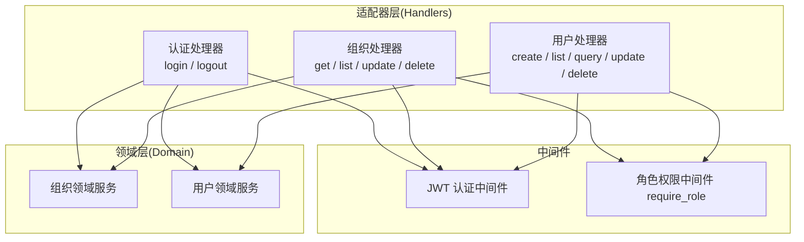
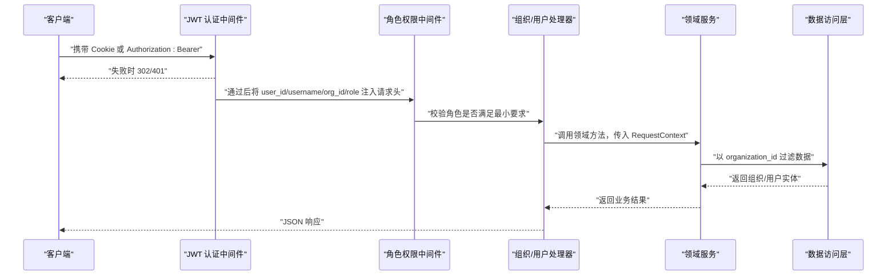
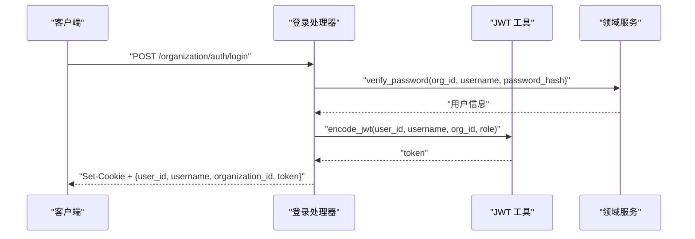
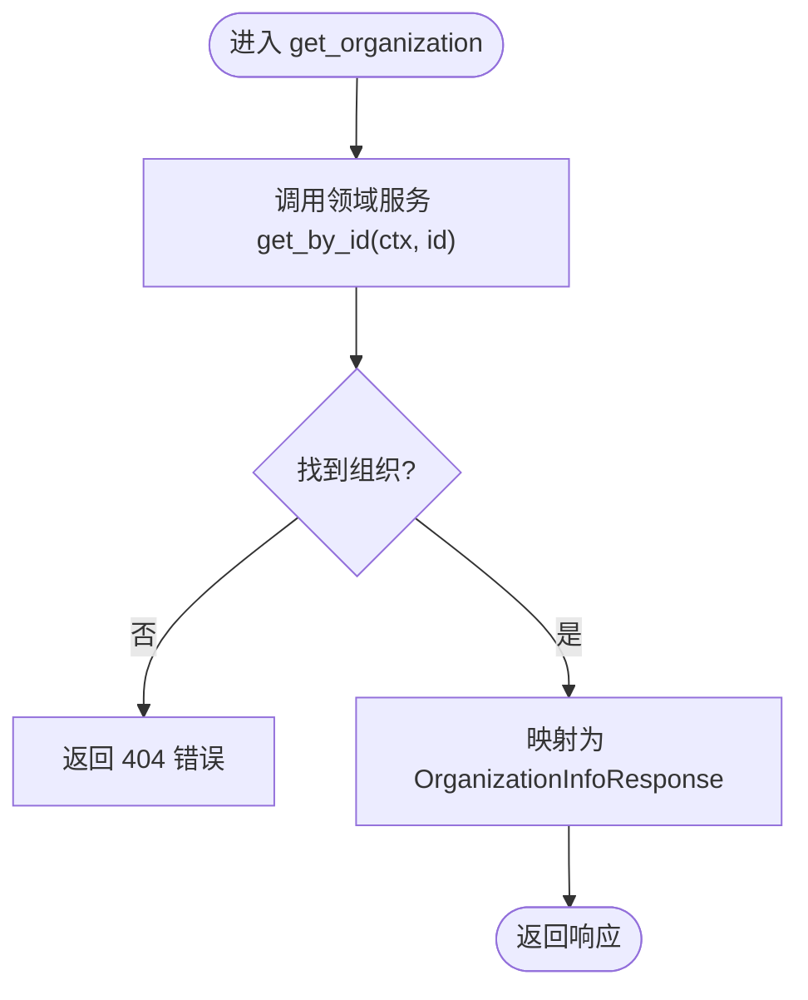
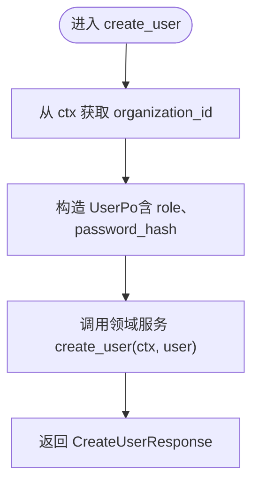
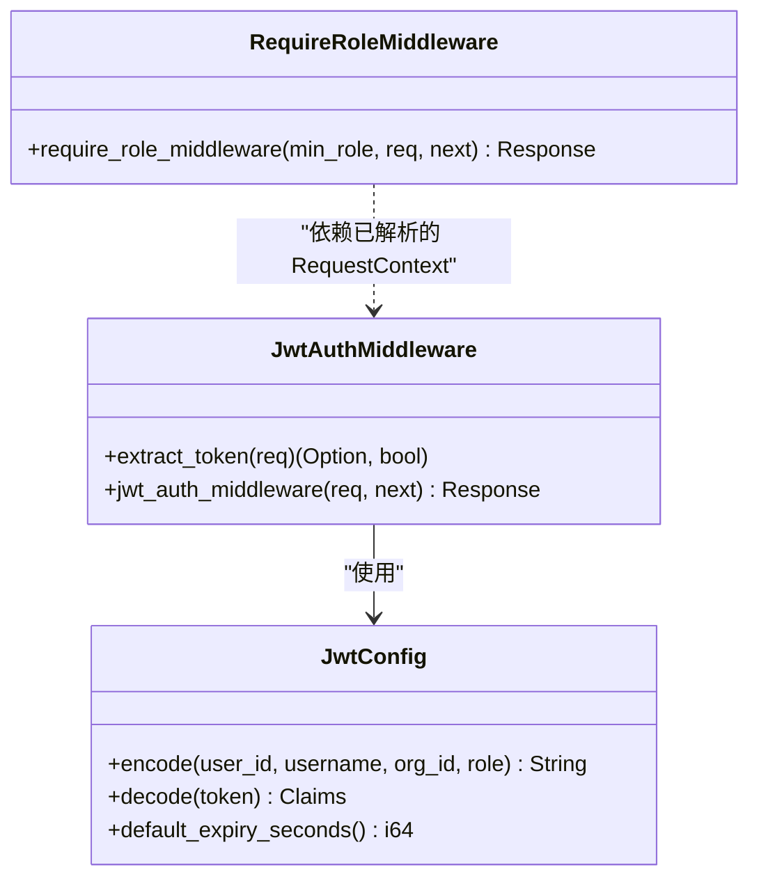
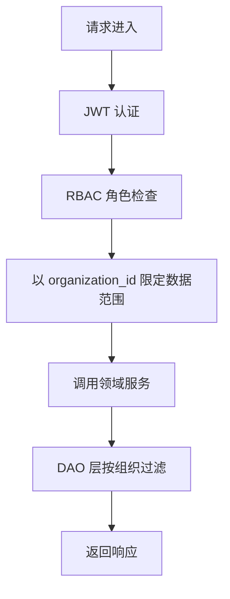
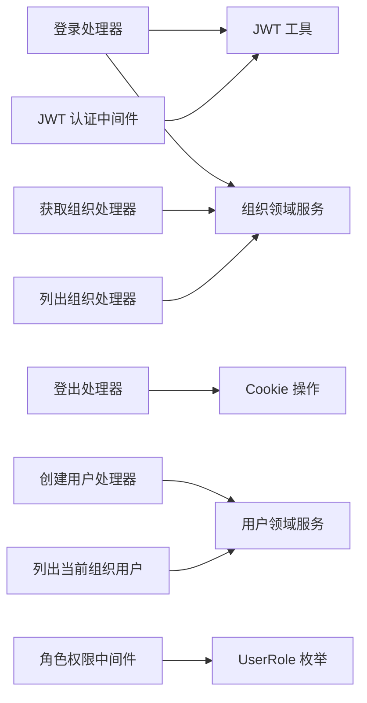

# Organization模块处理器

<cite>
**本文引用的文件**
- [src/handlers/organization/mod.rs](file://src/handlers/organization/mod.rs)
- [src/handlers/organization/auth/login.rs](file://src/handlers/organization/auth/login.rs)
- [src/handlers/organization/auth/logout.rs](file://src/handlers/organization/auth/logout.rs)
- [src/handlers/organization/organizations/get_organization.rs](file://src/handlers/organization/organizations/get_organization.rs)
- [src/handlers/organization/organizations/list_organizations.rs](file://src/handlers/organization/organizations/list_organizations.rs)
- [src/handlers/organization/user/create_user.rs](file://src/handlers/organization/user/create_user.rs)
- [src/handlers/organization/user/list_users_by_current_organization.rs](file://src/handlers/organization/user/list_users_by_current_organization.rs)
- [common/src/api/organization.rs](file://common/src/api/organization.rs)
- [src/middleware/jwt_auth.rs](file://src/middleware/jwt_auth.rs)
- [src/middleware/require_role.rs](file://src/middleware/require_role.rs)
- [src/pkg/jwt.rs](file://src/pkg/jwt.rs)
</cite>

## 目录
1. [简介](#简介)
2. [项目结构](#项目结构)
3. [核心组件](#核心组件)
4. [架构总览](#架构总览)
5. [详细组件分析](#详细组件分析)
6. [依赖关系分析](#依赖关系分析)
7. [性能考虑](#性能考虑)
8. [故障排查指南](#故障排查指南)
9. [结论](#结论)
10. [附录](#附录)

## 简介
本文件聚焦于 Organization（组织管理）模块的 HTTP 处理器实现，覆盖以下能力：
- 认证与授权：用户登录/登出、JWT 令牌签发与校验、Cookie/Bearer 双模式认证、基于角色的访问控制（RBAC）。
- 组织管理：组织的查询、列表、更新等 CRUD 操作。
- 用户管理：在当前组织内创建、查询、列出用户，以及按组织维度隔离数据。
- 多租户数据隔离：通过 RequestContext 中的 organization_id 在请求链路中贯穿，确保所有数据访问均限定到当前组织边界。
- 会话管理：浏览器 Cookie 与会话过期策略；API 调用的 Bearer Token 鉴权。

本模块严格遵循四层单向调用：Adapter（HTTP Handler）→ Domain → DAL → DAO，禁止跨层调用与同层互调。Domain 层输入为 Command/Query，输出为业务实体与内部事件；DAL 对外接口统一使用业务实体，不暴露持久化对象。

## 项目结构
Organization 模块位于 handlers/organization，包含认证、组织管理、用户管理、当前组织信息管理等子模块。各处理器通过宏 generate_http_handler 生成路由绑定，并通过 register_handler_tool 注册为可被 Agent 调用的工具（部分敏感接口如创建用户未注册为工具）。

图表来源
- [src/handlers/organization/auth/login.rs:18-68](file://src/handlers/organization/auth/login.rs#L18-L68)
- [src/handlers/organization/auth/logout.rs:15-39](file://src/handlers/organization/auth/logout.rs#L15-L39)
- [src/handlers/organization/organizations/get_organization.rs:17-47](file://src/handlers/organization/organizations/get_organization.rs#L17-L47)
- [src/handlers/organization/organizations/list_organizations.rs:17-39](file://src/handlers/organization/organizations/list_organizations.rs#L17-L39)
- [src/handlers/organization/user/create_user.rs:14-58](file://src/handlers/organization/user/create_user.rs#L14-L58)
- [src/handlers/organization/user/list_users_by_current_organization.rs:16-59](file://src/handlers/organization/user/list_users_by_current_organization.rs#L16-L59)
- [src/middleware/jwt_auth.rs:36-87](file://src/middleware/jwt_auth.rs#L36-L87)
- [src/middleware/require_role.rs:20-38](file://src/middleware/require_role.rs#L20-L38)

章节来源
- [src/handlers/organization/mod.rs:1-15](file://src/handlers/organization/mod.rs#L1-L15)

## 核心组件
- JWT 认证中间件：支持 Cookie 与 Authorization: Bearer 双模式提取 token，验证后将用户标识、用户名、组织 ID、角色注入请求头，供后续 request_context_middleware 构建 RequestContext。
- 角色权限中间件：基于 RBAC 的最小角色检查，若当前用户角色不满足最低要求则返回 403。
- 认证处理器：登录时校验密码并签发 JWT，设置 HttpOnly Cookie；登出时清空 Cookie。
- 组织处理器：提供组织信息查询、列表等只读能力，结合上下文组织边界进行数据过滤。
- 用户处理器：在当前组织内创建用户、列出当前组织用户等，严格以 RequestContext.organization_id 作为数据隔离键。

章节来源
- [src/middleware/jwt_auth.rs:1-156](file://src/middleware/jwt_auth.rs#L1-L156)
- [src/middleware/require_role.rs:1-39](file://src/middleware/require_role.rs#L1-L39)
- [src/handlers/organization/auth/login.rs:18-68](file://src/handlers/organization/auth/login.rs#L18-L68)
- [src/handlers/organization/auth/logout.rs:15-39](file://src/handlers/organization/auth/logout.rs#L15-L39)
- [src/handlers/organization/organizations/get_organization.rs:17-47](file://src/handlers/organization/organizations/get_organization.rs#L17-L47)
- [src/handlers/organization/organizations/list_organizations.rs:17-39](file://src/handlers/organization/organizations/list_organizations.rs#L17-L39)
- [src/handlers/organization/user/create_user.rs:14-58](file://src/handlers/organization/user/create_user.rs#L14-L58)
- [src/handlers/organization/user/list_users_by_current_organization.rs:16-59](file://src/handlers/organization/user/list_users_by_current_organization.rs#L16-L59)

## 架构总览
下图展示了从请求进入、认证授权、到领域服务处理的完整流程，体现多租户隔离与 RBAC 控制点。

图表来源
- [src/middleware/jwt_auth.rs:36-87](file://src/middleware/jwt_auth.rs#L36-L87)
- [src/middleware/require_role.rs:20-38](file://src/middleware/require_role.rs#L20-L38)
- [src/handlers/organization/organizations/get_organization.rs:17-47](file://src/handlers/organization/organizations/get_organization.rs#L17-L47)
- [src/handlers/organization/user/list_users_by_current_organization.rs:16-59](file://src/handlers/organization/user/list_users_by_current_organization.rs#L16-L59)

## 详细组件分析

### 认证处理器（登录/登出）
- 登录流程：
  - 接收 LoginRequest，调用领域服务验证用户名与密码哈希。
  - 签发 JWT，包含 user_id、username、organization_id、role 及过期时间。
  - 设置 HttpOnly Cookie（浏览器场景），同时返回包含 token 的 JSON 响应。
- 登出流程：
  - 清空 Cookie（max_age=0），返回成功响应。

图表来源
- [src/handlers/organization/auth/login.rs:18-68](file://src/handlers/organization/auth/login.rs#L18-L68)
- [src/pkg/jwt.rs:70-105](file://src/pkg/jwt.rs#L70-L105)

章节来源
- [src/handlers/organization/auth/login.rs:18-68](file://src/handlers/organization/auth/login.rs#L18-L68)
- [src/handlers/organization/auth/logout.rs:15-39](file://src/handlers/organization/auth/logout.rs#L15-L39)
- [src/pkg/jwt.rs:11-136](file://src/pkg/jwt.rs#L11-L136)

### 组织处理器（CRUD）
- 获取组织信息：根据 organization_id 查询组织，不存在返回 404。
- 列出所有组织：返回系统内所有组织列表（用于登录页选择）。
- 更新/删除组织：由管理员执行，需配合角色权限中间件限制。

图表来源
- [src/handlers/organization/organizations/get_organization.rs:17-47](file://src/handlers/organization/organizations/get_organization.rs#L17-L47)

章节来源
- [src/handlers/organization/organizations/get_organization.rs:17-47](file://src/handlers/organization/organizations/get_organization.rs#L17-L47)
- [src/handlers/organization/organizations/list_organizations.rs:17-39](file://src/handlers/organization/organizations/list_organizations.rs#L17-L39)
- [common/src/api/organization.rs:142-244](file://common/src/api/organization.rs#L142-L244)

### 用户处理器（组织内用户管理）
- 创建用户：在当前组织内创建新用户，角色转换与 UserPo 构造后交由领域服务处理。
- 列出当前组织用户：以 RequestContext.organization_id 为过滤条件，返回组织内用户列表。

图表来源
- [src/handlers/organization/user/create_user.rs:14-58](file://src/handlers/organization/user/create_user.rs#L14-L58)

章节来源
- [src/handlers/organization/user/create_user.rs:14-58](file://src/handlers/organization/user/create_user.rs#L14-L58)
- [src/handlers/organization/user/list_users_by_current_organization.rs:16-59](file://src/handlers/organization/user/list_users_by_current_organization.rs#L16-L59)

### 认证与授权机制
- JWT 认证中间件：
  - 优先从 Cookie 提取 token（浏览器场景），否则从 Authorization: Bearer 提取（API 场景）。
  - 验证失败时，浏览器请求返回 302 重定向到登录页，API 请求返回 401 JSON。
  - 验证通过后，将 user_id、username、organization_id、role 注入请求头，供后续中间件与处理器使用。
- 角色权限中间件：
  - 读取 RequestContext 中的用户角色，判断是否满足最小角色要求。
  - 不满足时返回 403 权限不足。

图表来源
- [src/middleware/jwt_auth.rs:36-156](file://src/middleware/jwt_auth.rs#L36-L156)
- [src/middleware/require_role.rs:20-38](file://src/middleware/require_role.rs#L20-L38)
- [src/pkg/jwt.rs:52-136](file://src/pkg/jwt.rs#L52-L136)

章节来源
- [src/middleware/jwt_auth.rs:1-156](file://src/middleware/jwt_auth.rs#L1-L156)
- [src/middleware/require_role.rs:1-39](file://src/middleware/require_role.rs#L1-L39)
- [src/pkg/jwt.rs:1-159](file://src/pkg/jwt.rs#L1-L159)

### 多租户数据隔离与 RBAC 权限模型
- 多租户隔离：
  - 登录成功后，JWT 中包含 organization_id；JWT 中间件将其注入请求头，后续 RequestContext 持有该值。
  - 所有处理器在调用领域服务时，均以 RequestContext.organization_id 作为数据访问边界，确保跨组织数据不可见。
- RBAC 权限模型：
  - 角色继承：用户角色在最小角色的祖先链上即可访问（上级角色满足下级要求）。
  - 关键写操作（如更新/删除组织、创建用户）应通过 require_role_middleware 限制最小角色（例如 Admin/SuperAdmin）。

图表来源
- [src/middleware/jwt_auth.rs:56-84](file://src/middleware/jwt_auth.rs#L56-L84)
- [src/middleware/require_role.rs:20-38](file://src/middleware/require_role.rs#L20-L38)
- [src/handlers/organization/user/list_users_by_current_organization.rs:21-32](file://src/handlers/organization/user/list_users_by_current_organization.rs#L21-L32)

章节来源
- [src/middleware/jwt_auth.rs:56-84](file://src/middleware/jwt_auth.rs#L56-L84)
- [src/middleware/require_role.rs:20-38](file://src/middleware/require_role.rs#L20-L38)
- [src/handlers/organization/user/list_users_by_current_organization.rs:21-32](file://src/handlers/organization/user/list_users_by_current_organization.rs#L21-L32)

### 会话管理与安全策略
- 会话管理：
  - 浏览器场景：使用 HttpOnly Cookie 存储 JWT，避免 XSS 窃取；设置 SameSite=Lax 与默认过期时间。
  - API 场景：Authorization: Bearer 传递 token，无状态鉴权。
- 安全策略：
  - 登录接口仅验证密码哈希，不暴露敏感字段。
  - 创建用户处理器未注册为 Agent 工具，防止自动化滥用。
  - 所有写操作建议通过 require_role_middleware 限制最小角色。

章节来源
- [src/handlers/organization/auth/login.rs:40-54](file://src/handlers/organization/auth/login.rs#L40-L54)
- [src/handlers/organization/auth/logout.rs:18-30](file://src/handlers/organization/auth/logout.rs#L18-L30)
- [src/handlers/organization/user/create_user.rs:12-14](file://src/handlers/organization/user/create_user.rs#L12-L14)

## 依赖关系分析
- 处理器依赖：
  - 认证处理器依赖 JWT 工具与领域服务。
  - 组织/用户处理器依赖领域服务，并通过 RequestContext 获取组织边界。
- 中间件依赖：
  - JWT 认证中间件依赖 JWT 工具与 Cookie 解析。
  - 角色权限中间件依赖 RequestContext 与 UserRole 枚举。
- DTO 定义：
  - 组织相关请求/响应 DTO 集中在 common/src/api/organization.rs。

图表来源
- [src/handlers/organization/auth/login.rs:18-68](file://src/handlers/organization/auth/login.rs#L18-L68)
- [src/handlers/organization/auth/logout.rs:15-39](file://src/handlers/organization/auth/logout.rs#L15-L39)
- [src/handlers/organization/organizations/get_organization.rs:17-47](file://src/handlers/organization/organizations/get_organization.rs#L17-L47)
- [src/handlers/organization/organizations/list_organizations.rs:17-39](file://src/handlers/organization/organizations/list_organizations.rs#L17-L39)
- [src/handlers/organization/user/create_user.rs:14-58](file://src/handlers/organization/user/create_user.rs#L14-L58)
- [src/handlers/organization/user/list_users_by_current_organization.rs:16-59](file://src/handlers/organization/user/list_users_by_current_organization.rs#L16-L59)
- [src/middleware/jwt_auth.rs:36-87](file://src/middleware/jwt_auth.rs#L36-L87)
- [src/middleware/require_role.rs:20-38](file://src/middleware/require_role.rs#L20-L38)

章节来源
- [common/src/api/organization.rs:1-244](file://common/src/api/organization.rs#L1-L244)
- [src/middleware/jwt_auth.rs:36-87](file://src/middleware/jwt_auth.rs#L36-L87)
- [src/middleware/require_role.rs:20-38](file://src/middleware/require_role.rs#L20-L38)

## 性能考虑
- JWT 解码与验证为轻量级 CPU 操作，建议在高频路径中复用配置单例（已实现）。
- 列表接口返回数据量较大时，应在领域/DAL 层增加分页与过滤参数，减少网络传输与前端渲染压力。
- 浏览器 Cookie 模式与 Bearer 模式共用同一认证逻辑，避免重复计算。
- 对敏感写操作（更新/删除组织、创建用户）务必启用角色权限中间件，降低误操作风险。

[本节为通用指导，无需特定文件引用]

## 故障排查指南
- 401 未认证：
  - 检查 Cookie 是否包含 ai_orz_jwt，或 Authorization 头是否正确携带 Bearer token。
  - 确认 JWT 签名密钥与过期时间配置正确。
- 403 权限不足：
  - 检查当前用户角色是否满足最小角色要求，必要时调整 require_role_middleware 的最小角色。
- 404 组织不存在：
  - 确认 organization_id 有效且属于当前用户可见范围。
- 登录失败：
  - 验证用户名与密码哈希是否正确，领域服务是否返回用户信息。

章节来源
- [src/middleware/jwt_auth.rs:139-156](file://src/middleware/jwt_auth.rs#L139-L156)
- [src/middleware/require_role.rs:29-35](file://src/middleware/require_role.rs#L29-L35)
- [src/handlers/organization/organizations/get_organization.rs:27-27](file://src/handlers/organization/organizations/get_organization.rs#L27-L27)

## 结论
Organization 模块通过 JWT 认证与 RBAC 权限控制，实现了安全的组织与用户管理能力。多租户数据隔离以 RequestContext.organization_id 为核心，贯穿处理器与领域服务，确保数据边界清晰。建议在生产环境中：
- 启用 HTTPS 并将 Cookie secure=true。
- 合理设置 JWT 过期时间与刷新策略。
- 对所有写操作启用 require_role_middleware，最小权限原则。
- 在列表接口引入分页与过滤，提升性能与用户体验。

[本节为总结性内容，无需特定文件引用]

## 附录
- 常见 API 示例（路径与职责）：
  - POST /organization/auth/login：用户登录，返回 JWT 与 Cookie。
  - POST /organization/auth/logout：用户登出，清空 Cookie。
  - GET /api/v1/organizations/{id}：获取组织基本信息。
  - GET /api/v1/organizations：列出所有组织。
  - POST /api/v1/organizations/users：在当前组织内创建用户。
  - GET /api/v1/organizations/users：列出当前组织用户。

章节来源
- [src/handlers/organization/auth/login.rs:18-68](file://src/handlers/organization/auth/login.rs#L18-L68)
- [src/handlers/organization/auth/logout.rs:15-39](file://src/handlers/organization/auth/logout.rs#L15-L39)
- [src/handlers/organization/organizations/get_organization.rs:17-47](file://src/handlers/organization/organizations/get_organization.rs#L17-L47)
- [src/handlers/organization/organizations/list_organizations.rs:17-39](file://src/handlers/organization/organizations/list_organizations.rs#L17-L39)
- [src/handlers/organization/user/create_user.rs:14-58](file://src/handlers/organization/user/create_user.rs#L14-L58)
- [src/handlers/organization/user/list_users_by_current_organization.rs:16-59](file://src/handlers/organization/user/list_users_by_current_organization.rs#L16-L59)