# Project模块处理器

<cite>
**本文引用的文件**
- [src/handlers/project/mod.rs](file://src/handlers/project/mod.rs)
- [common/src/api/project.rs](file://common/src/api/project.rs)
- [common/src/api/task.rs](file://common/src/api/task.rs)
- [common/src/api/artifact.rs](file://common/src/api/artifact.rs)
- [src/handlers/project/projects/create_project.rs](file://src/handlers/project/projects/create_project.rs)
- [src/handlers/project/projects/update_project_status.rs](file://src/handlers/project/projects/update_project_status.rs)
- [src/handlers/project/task/create_task.rs](file://src/handlers/project/task/create_task.rs)
- [src/handlers/project/task/update_task_status.rs](file://src/handlers/project/task/update_task_status.rs)
- [src/handlers/project/task/update_task_progress.rs](file://src/handlers/project/task/update_task_progress.rs)
- [src/handlers/project/artifact/create_artifact.rs](file://src/handlers/project/artifact/create_artifact.rs)
- [src/handlers/project/artifact/get_artifact_content.rs](file://src/handlers/project/artifact/get_artifact_content.rs)
- [src/handlers/project/artifact/update_artifact.rs](file://src/handlers/project/artifact/update_artifact.rs)
</cite>

## 目录
1. [简介](#简介)
2. [项目结构](#项目结构)
3. [核心组件](#核心组件)
4. [架构总览](#架构总览)
5. [详细组件分析](#详细组件分析)
6. [依赖关系分析](#依赖关系分析)
7. [性能考量](#性能考量)
8. [故障排查指南](#故障排查指南)
9. [结论](#结论)
10. [附录：API参考与示例](#附录api参考与示例)

## 简介
本文件为 Project（项目管理）模块的 HTTP 处理器文档，覆盖项目、任务与工件三大实体的创建、查询、更新、删除、状态流转、进度跟踪、版本控制与内容管理。文档严格遵循四层单向调用规范：Adapter（HTTP Handler/公开回调/AOP Producer）→ Domain → DAL → DAO，Handler 仅负责参数校验、上下文装配与调用领域服务，业务规则在 Domain 层实现，数据访问在 DAL/DAO 层完成。所有公共方法首参为 RequestContext，跨层通过 ctx.clone() 传递。

## 项目结构
Project 模块位于 handlers/project 下，按资源维度划分为 projects、task、artifact 三个子模块；DTO 定义集中在 common/src/api 对应文件中，便于前后端共享。

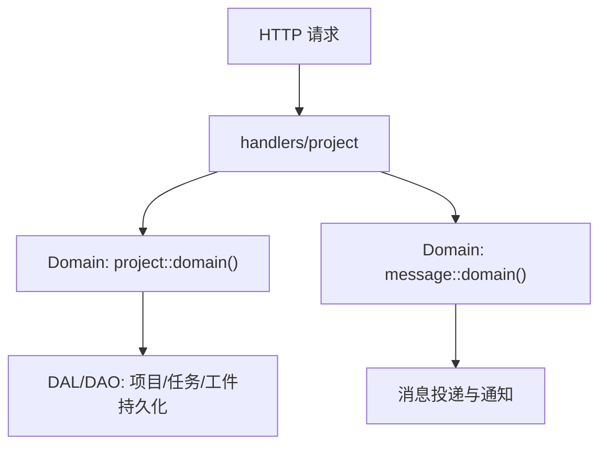

图表来源
- [src/handlers/project/mod.rs:1-6](file://src/handlers/project/mod.rs#L1-L6)
- [common/src/api/project.rs:1-255](file://common/src/api/project.rs#L1-L255)
- [common/src/api/task.rs:1-299](file://common/src/api/task.rs#L1-L299)
- [common/src/api/artifact.rs:1-269](file://common/src/api/artifact.rs#L1-L269)

章节来源
- [src/handlers/project/mod.rs:1-6](file://src/handlers/project/mod.rs#L1-L6)

## 核心组件
- 项目处理器：创建、获取、列表、搜索、更新、状态流转。
- 任务处理器：创建、获取、列表、搜索、更新、状态流转、进度更新。
- 工件处理器：创建（附件引用/生成内容）、获取详情、列出、查询、读取文本内容、更新内容与元数据（支持乐观锁）。

章节来源
- [common/src/api/project.rs:10-255](file://common/src/api/project.rs#L10-L255)
- [common/src/api/task.rs:10-299](file://common/src/api/task.rs#L10-L299)
- [common/src/api/artifact.rs:9-269](file://common/src/api/artifact.rs#L9-L269)

## 架构总览
本项目采用严格的分层架构：
- Adapter 层：HTTP 处理器，负责参数解析、基础校验、上下文构建、调用领域服务并返回响应。
- Domain 层：承载业务规则（如状态机、依赖校验、权限边界），对外暴露统一接口。
- DAL/DAO 层：数据访问抽象与具体实现，PO 对象仅在内部使用，不暴露到上层。
- 通用工具：日志、AOP、存储等放在 src/pkg/，无业务感知。

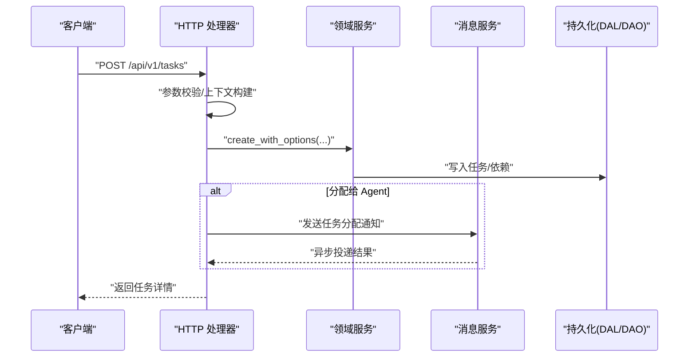

图表来源
- [src/handlers/project/task/create_task.rs:21-85](file://src/handlers/project/task/create_task.rs#L21-L85)
- [common/src/api/task.rs:10-36](file://common/src/api/task.rs#L10-L36)

## 详细组件分析

### 项目处理器
- 创建项目：校验用户上下文，透传 owner_agent_id，调用领域服务创建项目并返回详情。
- 更新项目状态：先获取项目实体，再执行状态转换，确保状态机合法性由领域层校验。

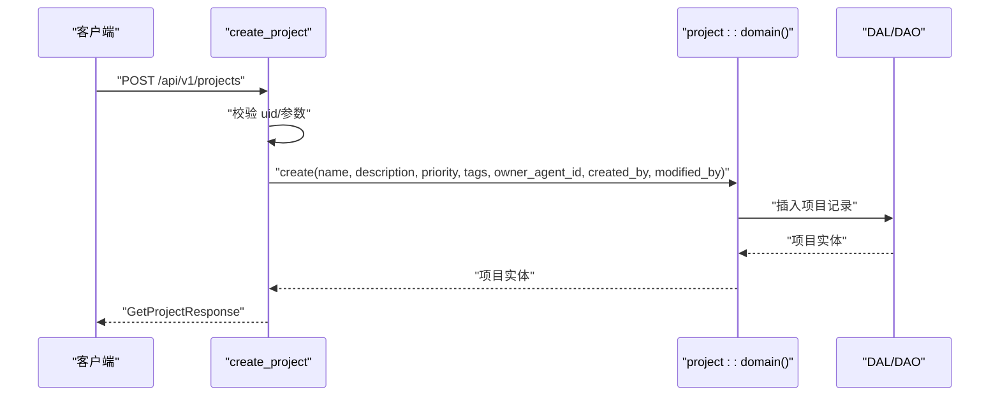

图表来源
- [src/handlers/project/projects/create_project.rs:22-46](file://src/handlers/project/projects/create_project.rs#L22-L46)
- [common/src/api/project.rs:10-31](file://common/src/api/project.rs#L10-L31)

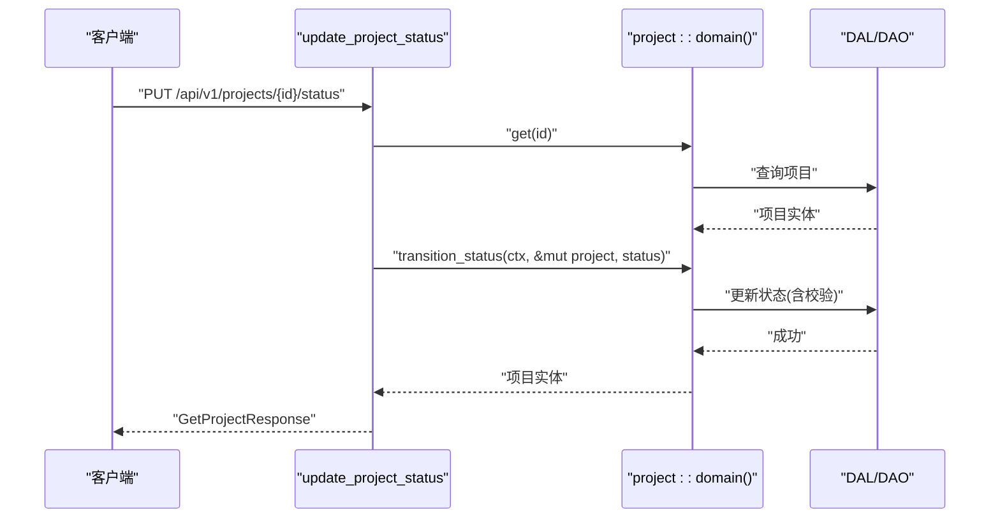

图表来源
- [src/handlers/project/projects/update_project_status.rs:21-42](file://src/handlers/project/projects/update_project_status.rs#L21-L42)
- [common/src/api/project.rs:192-205](file://common/src/api/project.rs#L192-L205)

章节来源
- [src/handlers/project/projects/create_project.rs:1-47](file://src/handlers/project/projects/create_project.rs#L1-L47)
- [src/handlers/project/projects/update_project_status.rs:1-43](file://src/handlers/project/projects/update_project_status.rs#L1-L43)
- [common/src/api/project.rs:10-255](file://common/src/api/project.rs#L10-L255)

### 任务处理器
- 创建任务：校验标题、负责人 ID，构建 RequestContext（携带 project_id），调用领域服务创建任务；若分配给 Agent，则通过消息服务发送任务分配通知。
- 更新任务状态：获取任务后执行状态转换，确保状态机合法性。
- 更新任务进度：直接调用领域服务更新进度。

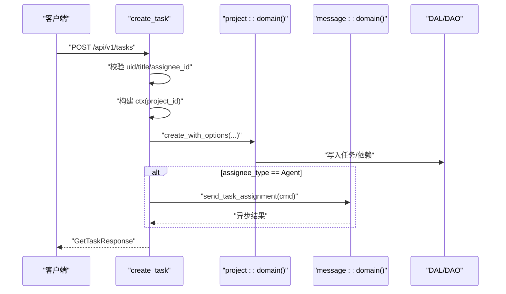

图表来源
- [src/handlers/project/task/create_task.rs:21-85](file://src/handlers/project/task/create_task.rs#L21-L85)
- [common/src/api/task.rs:10-36](file://common/src/api/task.rs#L10-L36)

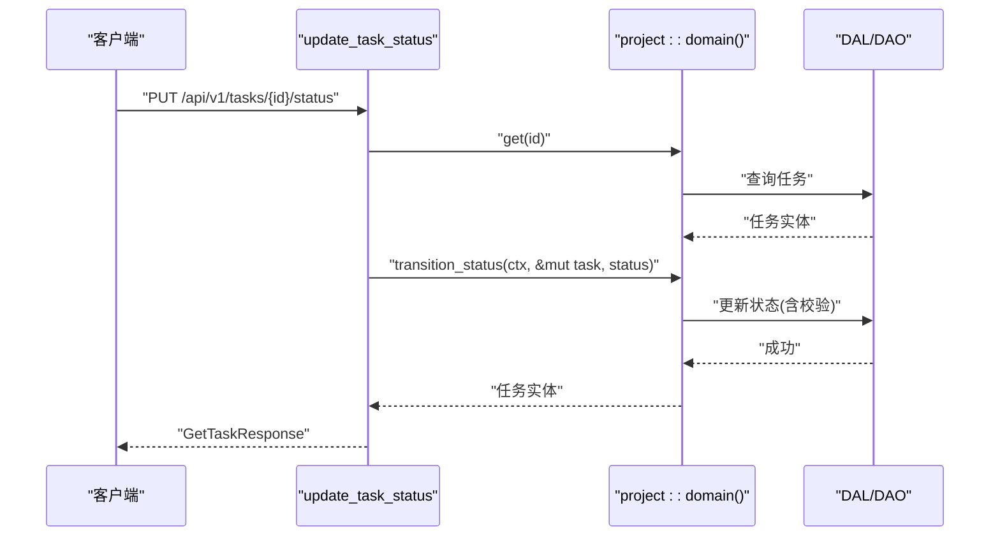

图表来源
- [src/handlers/project/task/update_task_status.rs:21-40](file://src/handlers/project/task/update_task_status.rs#L21-L40)
- [common/src/api/task.rs:219-232](file://common/src/api/task.rs#L219-L232)

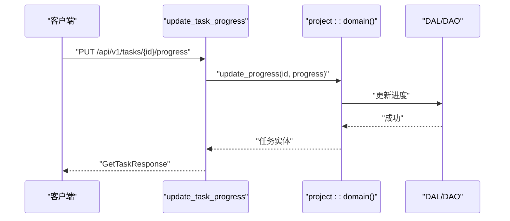

图表来源
- [src/handlers/project/task/update_task_progress.rs:19-29](file://src/handlers/project/task/update_task_progress.rs#L19-L29)
- [common/src/api/task.rs:234-245](file://common/src/api/task.rs#L234-L245)

章节来源
- [src/handlers/project/task/create_task.rs:1-86](file://src/handlers/project/task/create_task.rs#L1-L86)
- [src/handlers/project/task/update_task_status.rs:1-41](file://src/handlers/project/task/update_task_status.rs#L1-L41)
- [src/handlers/project/task/update_task_progress.rs:1-30](file://src/handlers/project/task/update_task_progress.rs#L1-L30)
- [common/src/api/task.rs:10-299](file://common/src/api/task.rs#L10-L299)

### 工件处理器
- 创建工件：根据 source_type 分支处理。Attachment 模式需校验 attachment_id 并复用附件元信息；GeneratedContent 模式需校验 content/file_name/mime_type 并限制大小；RemoteUrl 暂不支持。
- 读取工件内容：仅适用于 GeneratedContent 类型，读取字节并校验 UTF-8，返回文本内容。
- 更新工件：支持部分更新内容与元数据，支持乐观锁（expected_updated_at）。

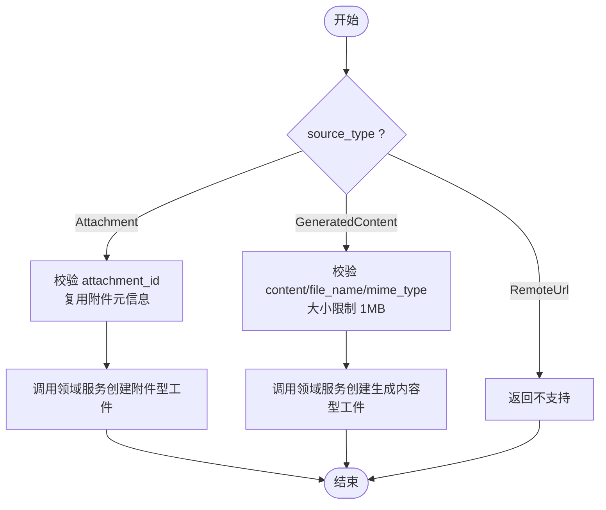

图表来源
- [src/handlers/project/artifact/create_artifact.rs:22-53](file://src/handlers/project/artifact/create_artifact.rs#L22-L53)
- [common/src/api/artifact.rs:9-45](file://common/src/api/artifact.rs#L9-L45)

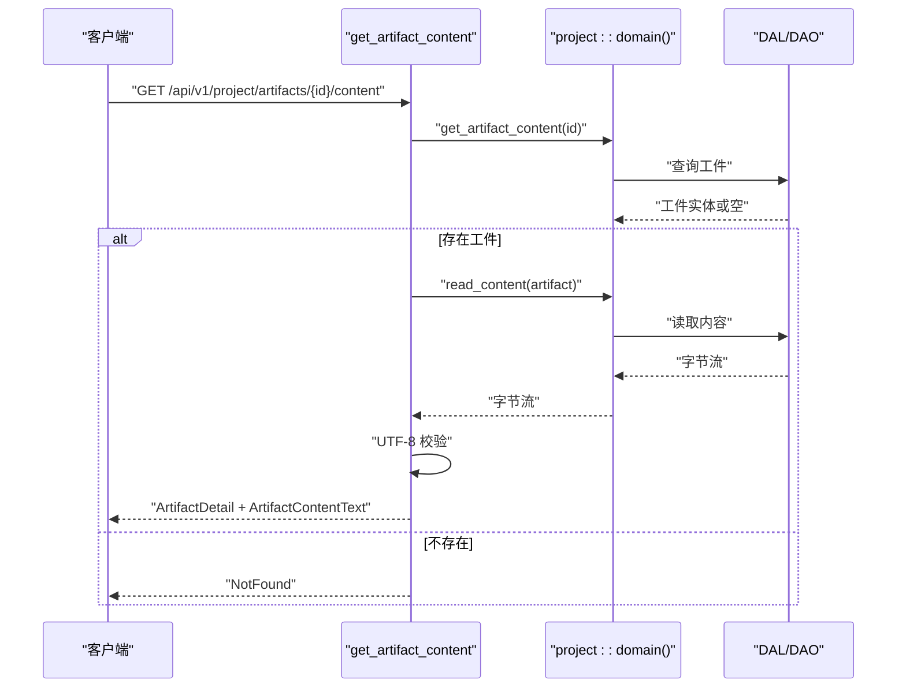

图表来源
- [src/handlers/project/artifact/get_artifact_content.rs:19-67](file://src/handlers/project/artifact/get_artifact_content.rs#L19-L67)
- [common/src/api/artifact.rs:161-193](file://common/src/api/artifact.rs#L161-L193)

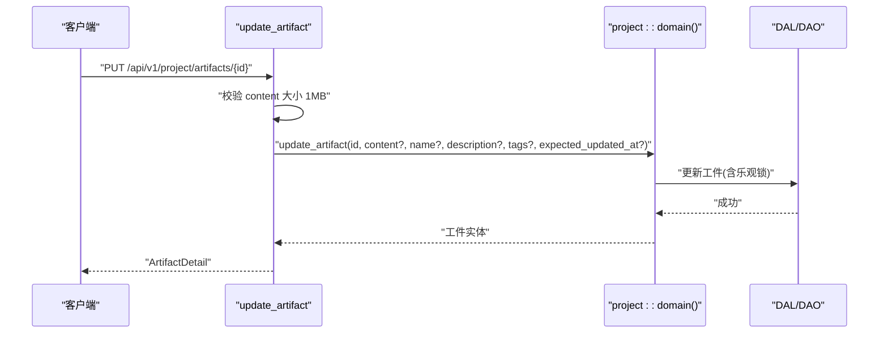

图表来源
- [src/handlers/project/artifact/update_artifact.rs:21-53](file://src/handlers/project/artifact/update_artifact.rs#L21-L53)
- [common/src/api/artifact.rs:195-216](file://common/src/api/artifact.rs#L195-L216)

章节来源
- [src/handlers/project/artifact/create_artifact.rs:1-146](file://src/handlers/project/artifact/create_artifact.rs#L1-L146)
- [src/handlers/project/artifact/get_artifact_content.rs:1-68](file://src/handlers/project/artifact/get_artifact_content.rs#L1-L68)
- [src/handlers/project/artifact/update_artifact.rs:1-54](file://src/handlers/project/artifact/update_artifact.rs#L1-L54)
- [common/src/api/artifact.rs:9-269](file://common/src/api/artifact.rs#L9-L269)

## 依赖关系分析
- Handler 对 Domain 的依赖是单向的，且不直接访问 DAL/DAO。
- 任务创建时可能依赖消息服务进行通知，属于跨域协作，但仍在 Adapter 层触发。
- DTO 定义在 common 中，被前端与后端共享，保证契约一致。

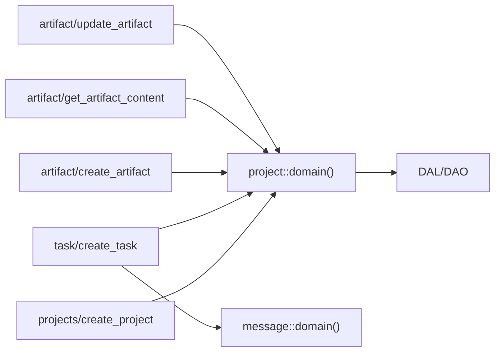

图表来源
- [src/handlers/project/projects/create_project.rs:22-46](file://src/handlers/project/projects/create_project.rs#L22-L46)
- [src/handlers/project/task/create_task.rs:21-85](file://src/handlers/project/task/create_task.rs#L21-L85)
- [src/handlers/project/artifact/create_artifact.rs:22-53](file://src/handlers/project/artifact/create_artifact.rs#L22-L53)
- [src/handlers/project/artifact/get_artifact_content.rs:19-67](file://src/handlers/project/artifact/get_artifact_content.rs#L19-L67)
- [src/handlers/project/artifact/update_artifact.rs:21-53](file://src/handlers/project/artifact/update_artifact.rs#L21-L53)

章节来源
- [src/handlers/project/mod.rs:1-6](file://src/handlers/project/mod.rs#L1-L6)

## 性能考量
- 分页与过滤：列表与查询接口均支持分页参数，避免全量拉取；建议前端合理设置 limit/offset。
- 按需加载：项目/任务详情支持 with_stats、with_model_call_stats、with_task_graph、with_artifacts、with_progress_summary 等开关，减少不必要的数据组装与网络传输。
- 内容大小限制：生成的文本内容限制为 1MB，防止过大负载影响性能与稳定性。
- 状态与进度更新：尽量批量更新或合并多次变更，降低数据库写放大。
- 向量与全文检索：项目/任务搜索支持 FTS5 + 向量语义混合搜索，注意索引维护与查询复杂度。

[本节为通用指导，不直接分析具体文件]

## 故障排查指南
- 缺少用户上下文：当 uid 为空时，处理器会返回无效请求错误；请检查认证中间件是否正确注入 RequestContext。
- 参数校验失败：标题、负责人 ID、project_id、name、attachment_id、content/file_name 等关键字段为空将返回 InvalidRequest；请核对请求体字段。
- 工件内容非 UTF-8：读取生成内容型工件时，若非 UTF-8 文本将返回无效请求错误；请确认编码。
- 远程 URL 工件暂不支持：当前 create_artifact 对 RemoteUrl 返回不支持操作；请使用 Attachment 或 GeneratedContent 模式。
- 乐观锁冲突：更新工件时若 expected_updated_at 与当前不一致，将返回冲突；请刷新后再编辑。

章节来源
- [src/handlers/project/projects/create_project.rs:22-46](file://src/handlers/project/projects/create_project.rs#L22-L46)
- [src/handlers/project/task/create_task.rs:21-85](file://src/handlers/project/task/create_task.rs#L21-L85)
- [src/handlers/project/artifact/create_artifact.rs:22-53](file://src/handlers/project/artifact/create_artifact.rs#L22-L53)
- [src/handlers/project/artifact/get_artifact_content.rs:19-67](file://src/handlers/project/artifact/get_artifact_content.rs#L19-L67)
- [src/handlers/project/artifact/update_artifact.rs:21-53](file://src/handlers/project/artifact/update_artifact.rs#L21-L53)

## 结论
Project 模块通过清晰的 Handler-Domain-DAL/DAO 分层，实现了项目、任务与工件的全生命周期管理。处理器专注于参数校验、上下文构建与领域调用；业务规则（状态机、依赖校验、权限边界）在 Domain 层实现；数据访问在 DAL/DAO 层完成。通过分页、按需加载、内容大小限制与乐观锁等机制，兼顾了功能完整性与性能稳定性。建议在集成测试中覆盖关键路径（创建、状态流转、进度更新、工件读写），并结合监控指标优化热点接口。

[本节为总结性内容，不直接分析具体文件]

## 附录：API参考与示例
以下为常用 API 的请求/响应结构与典型调用流程说明（以路径与字段为主，不包含代码片段）：

- 项目
  - POST /api/v1/projects
    - 请求体：CreateProjectRequest（name, description, priority, tags, owner_agent_id）
    - 响应：GetProjectResponse
    - 流程：校验 uid → 调用 project::domain().project_manage().create(...) → 返回详情
  - PUT /api/v1/projects/{id}/status
    - 请求体：UpdateProjectStatusRequest（id, status）
    - 响应：GetProjectResponse
    - 流程：获取项目 → transition_status(...) → 返回详情

- 任务
  - POST /api/v1/tasks
    - 请求体：CreateTaskRequest（title, description, priority, tags, root_user_id, assignee_type, assignee_id, project_id, due_at, dependencies）
    - 响应：GetTaskResponse
    - 流程：校验 uid/title/assignee_id → 构建 ctx(project_id) → create_with_options(...) → 若分配给 Agent 则发送通知 → 返回详情
  - PUT /api/v1/tasks/{id}/status
    - 请求体：UpdateTaskStatusRequest（id, status）
    - 响应：GetTaskResponse
    - 流程：获取任务 → transition_status(...) → 返回详情
  - PUT /api/v1/tasks/{id}/progress
    - 请求体：UpdateTaskProgressRequest（id, progress）
    - 响应：GetTaskResponse
    - 流程：update_progress(...) → 返回详情

- 工件
  - POST /api/v1/project/artifacts
    - 请求体：CreateArtifactRequest（project_id, task_id, name, description, source_type, attachment_id?, content?, file_name?, mime_type?, file_type?, tags?）
    - 响应：ArtifactDetail
    - 流程：按 source_type 分支处理（Attachment/GeneratedContent/RemoteUrl）→ 调用领域服务创建 → 返回详情
  - GET /api/v1/project/artifacts/{id}/content
    - 响应：GetArtifactContentResponse（artifact, content）
    - 流程：get_artifact_content(...) → read_content(...) → UTF-8 校验 → 返回文本内容
  - PUT /api/v1/project/artifacts/{id}
    - 请求体：UpdateArtifactRequest（artifact_id, content?, name?, description?, tags?, expected_updated_at?）
    - 响应：ArtifactDetail
    - 流程：校验 content 大小 → update_artifact(...)（含乐观锁）→ 返回详情

章节来源
- [common/src/api/project.rs:10-255](file://common/src/api/project.rs#L10-L255)
- [common/src/api/task.rs:10-299](file://common/src/api/task.rs#L10-L299)
- [common/src/api/artifact.rs:9-269](file://common/src/api/artifact.rs#L9-L269)
- [src/handlers/project/projects/create_project.rs:22-46](file://src/handlers/project/projects/create_project.rs#L22-L46)
- [src/handlers/project/projects/update_project_status.rs:21-42](file://src/handlers/project/projects/update_project_status.rs#L21-L42)
- [src/handlers/project/task/create_task.rs:21-85](file://src/handlers/project/task/create_task.rs#L21-L85)
- [src/handlers/project/task/update_task_status.rs:21-40](file://src/handlers/project/task/update_task_status.rs#L21-L40)
- [src/handlers/project/task/update_task_progress.rs:19-29](file://src/handlers/project/task/update_task_progress.rs#L19-L29)
- [src/handlers/project/artifact/create_artifact.rs:22-53](file://src/handlers/project/artifact/create_artifact.rs#L22-L53)
- [src/handlers/project/artifact/get_artifact_content.rs:19-67](file://src/handlers/project/artifact/get_artifact_content.rs#L19-L67)
- [src/handlers/project/artifact/update_artifact.rs:21-53](file://src/handlers/project/artifact/update_artifact.rs#L21-L53)