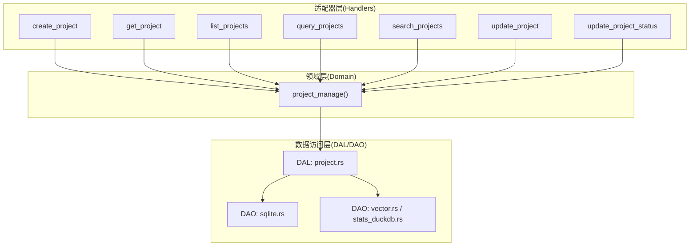
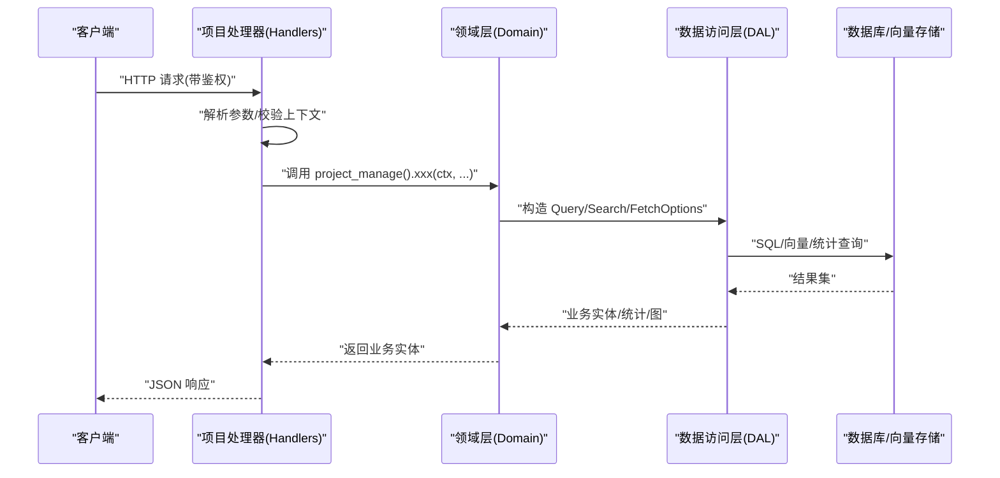
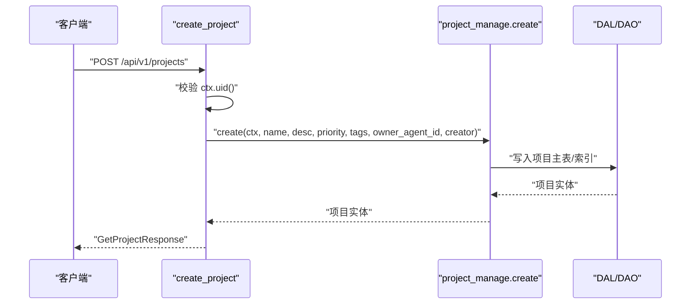
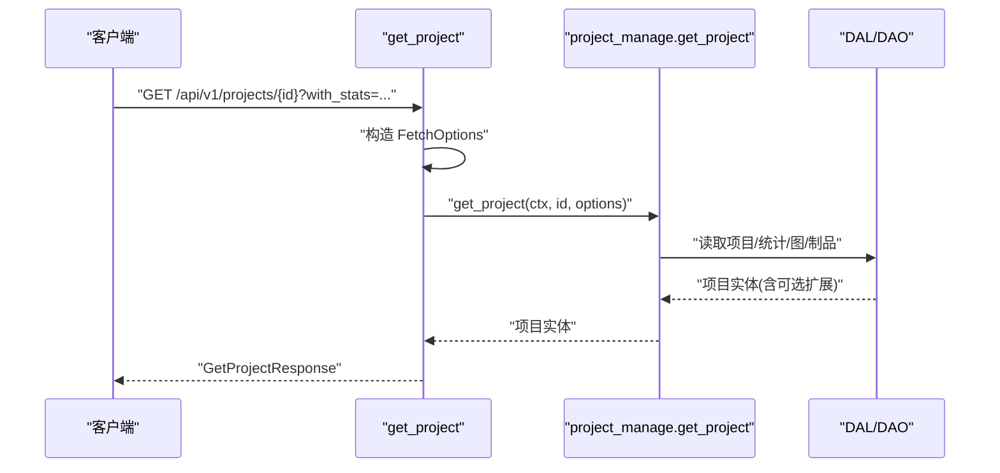
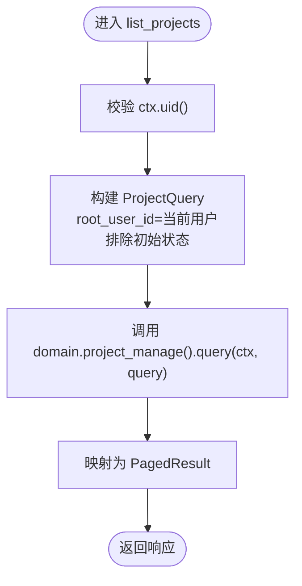
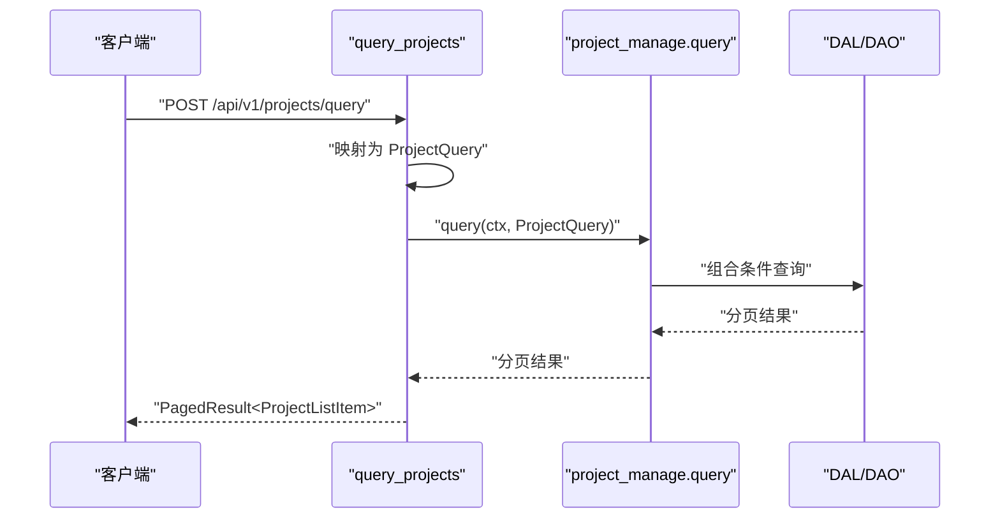
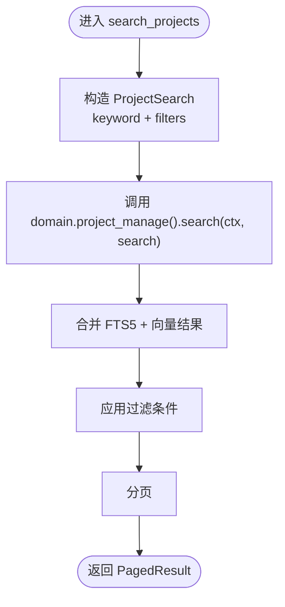
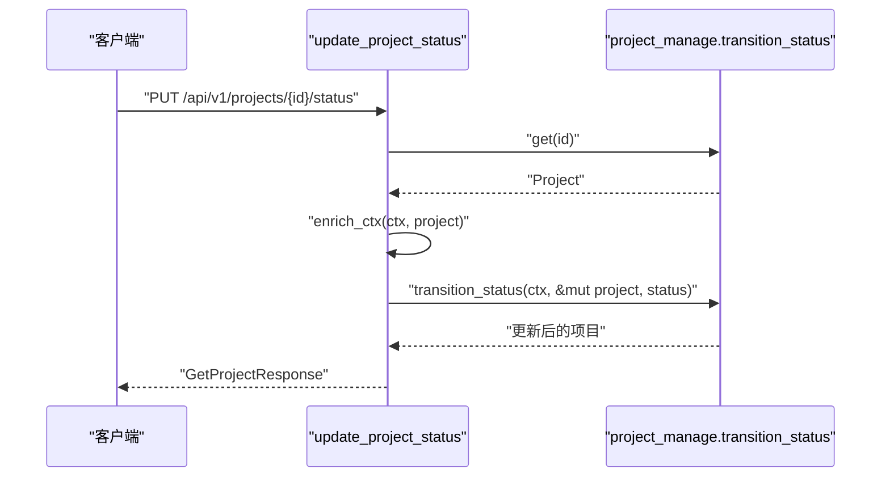
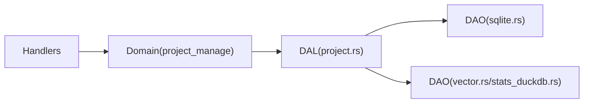

# 项目处理器

<cite>
**本文引用的文件**
- [src/handlers/project/mod.rs](file://src/handlers/project/mod.rs)
- [src/handlers/project/projects/mod.rs](file://src/handlers/project/projects/mod.rs)
- [src/handlers/project/projects/create_project.rs](file://src/handlers/project/projects/create_project.rs)
- [src/handlers/project/projects/get_project.rs](file://src/handlers/project/projects/get_project.rs)
- [src/handlers/project/projects/list_projects.rs](file://src/handlers/project/projects/list_projects.rs)
- [src/handlers/project/projects/query_projects.rs](file://src/handlers/project/projects/query_projects.rs)
- [src/handlers/project/projects/search_projects.rs](file://src/handlers/project/projects/search_projects.rs)
- [src/handlers/project/projects/update_project.rs](file://src/handlers/project/projects/update_project.rs)
- [src/handlers/project/projects/update_project_status.rs](file://src/handlers/project/projects/update_project_status.rs)
- [src/handlers/project/projects/response.rs](file://src/handlers/project/projects/response.rs)
- [src/service/domain/project/mod.rs](file://src/service/domain/project/mod.rs)
- [src/service/domain/project/service.rs](file://src/service/domain/project/service.rs)
- [src/service/dal/project.rs](file://src/service/dal/project.rs)
- [src/service/dao/project/mod.rs](file://src/service/dao/project/mod.rs)
- [src/service/dao/project/sqlite.rs](file://src/service/dao/project/sqlite.rs)
- [src/middleware/jwt_auth.rs](file://src/middleware/jwt_auth.rs)
- [src/middleware/request_context.rs](file://src/middleware/request_context.rs)
- [common/src/api/project.rs](file://common/src/api/project.rs)
- [common/src/enums/project.rs](file://common/src/enums/project.rs)
</cite>

## 目录
1. [简介](#简介)
2. [项目结构](#项目结构)
3. [核心组件](#核心组件)
4. [架构总览](#架构总览)
5. [详细组件分析](#详细组件分析)
6. [依赖关系分析](#依赖关系分析)
7. [性能考虑](#性能考虑)
8. [故障排查指南](#故障排查指南)
9. [结论](#结论)
10. [附录：API 参考与最佳实践](#附录api-参考与最佳实践)

## 简介
本章节面向“项目处理器”模块，覆盖项目的完整生命周期管理（创建、查询、更新、删除/状态流转），以及搜索、分页、认证与权限控制、错误处理策略。该模块严格遵循四层单向调用：Adapter（HTTP Handler）→ Domain → DAL → DAO，禁止跨层与同层互调；所有服务方法以 RequestContext 作为首参，跨层传递使用 ctx.clone()。

## 项目结构
项目处理器位于 handlers/project 下，按 HTTP 方法粒度拆分到独立文件，便于维护与测试。Handler 通过宏生成路由并注册为工具，统一将请求参数解析为 common::api 中的 DTO，再委托给 service::domain::project 的业务能力。Domain 组合 DAL/DAO 完成数据访问与统计、向量/全文检索等复杂逻辑。

图表来源
- [src/handlers/project/projects/create_project.rs:1-47](file://src/handlers/project/projects/create_project.rs#L1-L47)
- [src/handlers/project/projects/get_project.rs:1-54](file://src/handlers/project/projects/get_project.rs#L1-L54)
- [src/handlers/project/projects/list_projects.rs:1-44](file://src/handlers/project/projects/list_projects.rs#L1-L44)
- [src/handlers/project/projects/query_projects.rs:1-44](file://src/handlers/project/projects/query_projects.rs#L1-L44)
- [src/handlers/project/projects/search_projects.rs:1-44](file://src/handlers/project/projects/search_projects.rs#L1-L44)
- [src/handlers/project/projects/update_project.rs:1-41](file://src/handlers/project/projects/update_project.rs#L1-L41)
- [src/handlers/project/projects/update_project_status.rs:1-43](file://src/handlers/project/projects/update_project_status.rs#L1-L43)
- [src/service/dal/project.rs:1-200](file://src/service/dal/project.rs#L1-L200)
- [src/service/dao/project/sqlite.rs:1-200](file://src/service/dao/project/sqlite.rs#L1-L200)

章节来源
- [src/handlers/project/mod.rs:1-6](file://src/handlers/project/mod.rs#L1-L6)
- [src/handlers/project/projects/mod.rs:1-20](file://src/handlers/project/projects/mod.rs#L1-L20)

## 核心组件
- 适配器层（Handlers）
  - create_project：创建项目，透传 owner_agent_id，校验用户上下文。
  - get_project：获取项目详情，支持可选统计、任务图、制品、进度摘要等扩展字段。
  - list_projects：列表语法糖，固定 root_user_id=当前用户且排除初始状态，仅支持分页过滤。
  - query_projects：通用条件查询，支持 ids、keyword、status_in、owner_agent_id、root_user_id、pagination。
  - search_projects：语义+关键词混合搜索（FTS5 + 向量），同时支持过滤与分页。
  - update_project：更新基础信息与执行计划/结果。
  - update_project_status：状态流转，先读取实体，再 enrich_ctx 后调用领域状态机。
- 领域层（Domain）
  - project_manage()：聚合业务操作，封装 DAL/DAO 调用，负责状态机、事务边界、事件发布等。
- 数据访问层（DAL/DAO）
  - DAL：定义 ProjectQuery/ProjectSearch/FetchOptions 等查询对象，协调 SQL 与向量/统计后端。
  - DAO：SQLite 持久化、DuckDB 统计、LanceDB/HNSW/SqliteVss 向量存储。

章节来源
- [src/handlers/project/projects/create_project.rs:1-47](file://src/handlers/project/projects/create_project.rs#L1-L47)
- [src/handlers/project/projects/get_project.rs:1-54](file://src/handlers/project/projects/get_project.rs#L1-L54)
- [src/handlers/project/projects/list_projects.rs:1-44](file://src/handlers/project/projects/list_projects.rs#L1-L44)
- [src/handlers/project/projects/query_projects.rs:1-44](file://src/handlers/project/projects/query_projects.rs#L1-L44)
- [src/handlers/project/projects/search_projects.rs:1-44](file://src/handlers/project/projects/search_projects.rs#L1-L44)
- [src/handlers/project/projects/update_project.rs:1-41](file://src/handlers/project/projects/update_project.rs#L1-L41)
- [src/handlers/project/projects/update_project_status.rs:1-43](file://src/handlers/project/projects/update_project_status.rs#L1-L43)
- [src/service/domain/project/service.rs:1-200](file://src/service/domain/project/service.rs#L1-L200)
- [src/service/dal/project.rs:1-200](file://src/service/dal/project.rs#L1-L200)
- [src/service/dao/project/mod.rs:1-200](file://src/service/dao/project/mod.rs#L1-L200)

## 架构总览
下图展示了从 HTTP 请求到数据落库的完整链路，体现 Adapter→Domain→DAL→DAO 的单向依赖与职责分离。

图表来源
- [src/handlers/project/projects/query_projects.rs:1-44](file://src/handlers/project/projects/query_projects.rs#L1-L44)
- [src/handlers/project/projects/search_projects.rs:1-44](file://src/handlers/project/projects/search_projects.rs#L1-L44)
- [src/service/dal/project.rs:1-200](file://src/service/dal/project.rs#L1-L200)
- [src/service/dao/project/sqlite.rs:1-200](file://src/service/dao/project/sqlite.rs#L1-L200)

## 详细组件分析

### 创建项目（POST /api/v1/projects）
- 功能：创建新项目，透传 owner_agent_id，记录创建人。
- 认证：需要有效的 RequestContext 用户 ID。
- 输入：CreateProjectRequest（名称、描述、优先级、标签、owner_agent_id）。
- 输出：GetProjectResponse（项目详情）。
- 关键流程：
  - 校验 ctx.uid() 非空。
  - 调用 domain.project_manage().create(...)。
  - 转换为响应对象返回。

图表来源
- [src/handlers/project/projects/create_project.rs:1-47](file://src/handlers/project/projects/create_project.rs#L1-L47)
- [src/service/dal/project.rs:1-200](file://src/service/dal/project.rs#L1-L200)

章节来源
- [src/handlers/project/projects/create_project.rs:1-47](file://src/handlers/project/projects/create_project.rs#L1-L47)
- [src/handlers/project/projects/response.rs:1-52](file://src/handlers/project/projects/response.rs#L1-L52)

### 获取项目详情（GET /api/v1/projects/{id}）
- 功能：根据 ID 获取项目详情，支持可选统计、模型调用统计、任务图、制品、进度摘要。
- 认证：需要有效的 RequestContext。
- 输入：路径参数 id，查询参数 with_stats、with_model_call_stats、stats_time_start/end、stats_interval、with_task_graph、with_artifacts、with_progress_summary。
- 输出：GetProjectResponse。
- 关键流程：
  - 构造 ProjectFetchOptions。
  - 调用 domain.project_manage().get_project(...)。
  - 不存在时返回 404。

图表来源
- [src/handlers/project/projects/get_project.rs:1-54](file://src/handlers/project/projects/get_project.rs#L1-L54)
- [src/service/dal/project.rs:1-200](file://src/service/dal/project.rs#L1-L200)

章节来源
- [src/handlers/project/projects/get_project.rs:1-54](file://src/handlers/project/projects/get_project.rs#L1-L54)
- [src/handlers/project/projects/response.rs:1-52](file://src/handlers/project/projects/response.rs#L1-L52)

### 项目列表（GET /api/v1/projects）
- 功能：列出当前用户的可见项目，默认排除初始状态，仅支持分页。
- 认证：需要有效的 RequestContext。
- 输入：ListProjectsRequest（分页参数）。
- 输出：PagedResult<ProjectListItem>。
- 关键流程：
  - 固定 root_user_id=ctx.uid()，排除 status=0。
  - 调用 domain.project_manage().query(...)。

图表来源
- [src/handlers/project/projects/list_projects.rs:1-44](file://src/handlers/project/projects/list_projects.rs#L1-L44)

章节来源
- [src/handlers/project/projects/list_projects.rs:1-44](file://src/handlers/project/projects/list_projects.rs#L1-L44)

### 通用查询（POST /api/v1/projects/query）
- 功能：支持完整过滤条件（ids、keyword、status_in、owner_agent_id、root_user_id、pagination）。
- 认证：需要有效的 RequestContext。
- 输入：ProjectQueryRequest。
- 输出：PagedResult<ProjectListItem>。
- 关键流程：
  - 将请求体映射为 ProjectQuery。
  - 调用 domain.project_manage().query(...)。

图表来源
- [src/handlers/project/projects/query_projects.rs:1-44](file://src/handlers/project/projects/query_projects.rs#L1-L44)
- [src/service/dal/project.rs:1-200](file://src/service/dal/project.rs#L1-L200)

章节来源
- [src/handlers/project/projects/query_projects.rs:1-44](file://src/handlers/project/projects/query_projects.rs#L1-L44)

### 搜索（POST /api/v1/projects/search）
- 功能：语义相关性搜索（FTS5 + 向量），同时支持过滤与分页。
- 认证：需要有效的 RequestContext。
- 输入：SearchProjectsRequest（keyword、filters、pagination）。
- 输出：PagedResult<ProjectListItem>。
- 关键流程：
  - 构造 ProjectSearch（包含 keyword 与 filters）。
  - 调用 domain.project_manage().search(...)。

图表来源
- [src/handlers/project/projects/search_projects.rs:1-44](file://src/handlers/project/projects/search_projects.rs#L1-L44)
- [src/service/dal/project.rs:1-200](file://src/service/dal/project.rs#L1-L200)

章节来源
- [src/handlers/project/projects/search_projects.rs:1-44](file://src/handlers/project/projects/search_projects.rs#L1-L44)

### 更新项目基本信息（PUT /api/v1/projects/{id}）
- 功能：更新名称、描述、优先级、标签、执行计划/结果等。
- 认证：需要有效的 RequestContext。
- 输入：UpdateProjectRequest（id、name、description、priority、tags、execution_plan、execution_result）。
- 输出：GetProjectResponse。
- 关键流程：
  - 提取 modified_by=ctx.uid()。
  - 调用 domain.project_manage().update_basic(...)。

章节来源
- [src/handlers/project/projects/update_project.rs:1-41](file://src/handlers/project/projects/update_project.rs#L1-L41)
- [src/handlers/project/projects/response.rs:1-52](file://src/handlers/project/projects/response.rs#L1-L52)

### 更新项目状态（PUT /api/v1/projects/{id}/status）
- 功能：状态流转，基于领域状态机进行转换。
- 认证：需要有效的 RequestContext。
- 输入：UpdateProjectStatusRequest（id、status）。
- 输出：GetProjectResponse。
- 关键流程：
  - 读取项目实体，若不存在返回 404。
  - enrich_ctx 注入项目上下文。
  - 调用 domain.project_manage().transition_status(ctx, &mut project, status)。

图表来源
- [src/handlers/project/projects/update_project_status.rs:1-43](file://src/handlers/project/projects/update_project_status.rs#L1-L43)

章节来源
- [src/handlers/project/projects/update_project_status.rs:1-43](file://src/handlers/project/projects/update_project_status.rs#L1-L43)

### 删除项目
- 说明：当前处理器未暴露显式删除接口。若需删除，可通过状态机将项目置为不可见或归档状态，或在领域层提供软删除能力。建议遵循现有状态机设计，避免硬删除导致关联数据不一致。

## 依赖关系分析
- 耦合与内聚
  - Handlers 仅依赖 common::api 与 service::domain::project，保持高内聚低耦合。
  - Domain 聚合 DAL/DAO，屏蔽底层实现细节（SQLite/DuckDB/LanceDB）。
- 外部依赖
  - Axum 路由与参数绑定（由 generate_http_handler 宏生成）。
  - sqlx 离线查询缓存（.sqlx 目录）保障查询稳定性。
  - 向量存储 LanceDB/HNSW/SqliteVss 多后端降级。
  - 全文搜索 FTS5 + trigram。

图表来源
- [src/handlers/project/projects/mod.rs:1-20](file://src/handlers/project/projects/mod.rs#L1-L20)
- [src/service/dal/project.rs:1-200](file://src/service/dal/project.rs#L1-L200)
- [src/service/dao/project/mod.rs:1-200](file://src/service/dao/project/mod.rs#L1-L200)

章节来源
- [src/service/dal/project.rs:1-200](file://src/service/dal/project.rs#L1-L200)
- [src/service/dao/project/mod.rs:1-200](file://src/service/dao/project/mod.rs#L1-L200)

## 性能考虑
- 查询优化
  - 列表与查询优先使用 ProjectQuery 的条件过滤，减少不必要字段加载。
  - 详情接口按需启用 with_stats、with_model_call_stats、with_task_graph、with_artifacts、with_progress_summary，避免全量加载。
- 搜索优化
  - 搜索接口结合 FTS5 与向量检索，建议在高频关键字上建立合适的分词与索引。
  - 对大结果集务必设置合理的 pagination，避免一次性返回过多数据。
- 统计与向量
  - DuckDB 用于统计聚合，注意时间范围与分组粒度（hourly/daily）。
  - 向量后端可配置降级策略（LanceDB → HNSW → InMemory/SqliteVss），在资源紧张时自动切换。
- 并发与事务
  - 状态流转应保证事务一致性，避免并发更新导致的状态冲突。
  - 长耗时操作（如重建向量）建议异步化并通过任务进度接口反馈。

## 故障排查指南
- 常见错误
  - 缺少用户上下文：创建/列表等接口会校验 ctx.uid()，为空时返回 InvalidRequest。
  - 项目不存在：get_project 与 update_project_status 在找不到项目时返回 404。
  - 状态非法：transition_status 会依据状态机拒绝非法转换，返回相应错误码。
- 定位步骤
  - 检查请求是否携带有效鉴权头（JWT）。
  - 核对 URL 模式与参数命名是否与 API 一致。
  - 查看 Domain 日志与 DAL/DAO 层 SQL/向量查询日志，确认查询条件是否正确。
  - 对于搜索问题，验证 FTS5 索引与向量索引是否已构建成功。

章节来源
- [src/handlers/project/projects/create_project.rs:1-47](file://src/handlers/project/projects/create_project.rs#L1-L47)
- [src/handlers/project/projects/get_project.rs:1-54](file://src/handlers/project/projects/get_project.rs#L1-L54)
- [src/handlers/project/projects/update_project_status.rs:1-43](file://src/handlers/project/projects/update_project_status.rs#L1-L43)

## 结论
项目处理器模块通过清晰的层次划分与统一的 RequestContext 传递，实现了项目的全生命周期管理。Handler 专注参数解析与响应映射，Domain 负责业务规则与状态机，DAL/DAO 屏蔽存储细节并提供高性能查询与搜索。配合分页、按需加载与多后端降级策略，可在保证一致性的前提下获得良好的性能表现。

## 附录：API 参考与最佳实践

### HTTP 端点总览
- POST /api/v1/projects
  - 功能：创建项目
  - 认证：需要 JWT
  - 请求体：CreateProjectRequest
  - 响应：GetProjectResponse
- GET /api/v1/projects
  - 功能：列出当前用户项目（排除初始状态）
  - 认证：需要 JWT
  - 查询参数：分页
  - 响应：PagedResult<ProjectListItem>
- GET /api/v1/projects/{id}
  - 功能：获取项目详情
  - 认证：需要 JWT
  - 查询参数：with_stats、with_model_call_stats、stats_time_start、stats_time_end、stats_interval、with_task_graph、with_artifacts、with_progress_summary
  - 响应：GetProjectResponse
- POST /api/v1/projects/query
  - 功能：通用条件查询
  - 认证：需要 JWT
  - 请求体：ProjectQueryRequest
  - 响应：PagedResult<ProjectListItem>
- POST /api/v1/projects/search
  - 功能：语义+关键词搜索
  - 认证：需要 JWT
  - 请求体：SearchProjectsRequest
  - 响应：PagedResult<ProjectListItem>
- PUT /api/v1/projects/{id}
  - 功能：更新项目基本信息
  - 认证：需要 JWT
  - 请求体：UpdateProjectRequest
  - 响应：GetProjectResponse
- PUT /api/v1/projects/{id}/status
  - 功能：状态流转
  - 认证：需要 JWT
  - 请求体：UpdateProjectStatusRequest
  - 响应：GetProjectResponse

### 数据模型与枚举
- 项目状态：参见 common/src/enums/project.rs
- 项目相关请求/响应：参见 common/src/api/project.rs

### 认证与权限
- 认证：通过中间件 jwt_auth 解析 JWT，填充 RequestContext。
- 权限：列表接口默认限制为当前用户可见；如需组织级权限，请在 Domain 层结合组织上下文进行校验。

### 数据验证规则
- 必填字段：ID、名称等关键标识需在 Domain 层进行合法性校验。
- 类型与范围：优先级、状态值需符合枚举约束；时间范围需满足 start <= end。
- 上下文：所有写操作必须携带有效的 ctx.uid()。

### 错误处理策略
- 参数错误：InvalidRequest
- 资源不存在：not_found
- 状态非法：状态机拒绝时的专用错误码
- 系统错误：DAL/DAO 层异常向上抛出，统一由 Axum 错误处理转为 HTTP 响应

### 最佳实践
- 使用 query 接口进行复杂过滤，search 接口进行语义检索。
- 详情接口按需开启扩展字段，避免不必要的统计与图计算。
- 分页参数合理设置，避免过大 page_size。
- 状态变更走 transition_status，确保一致性。
- 长耗时任务异步化，并通过任务进度接口反馈。