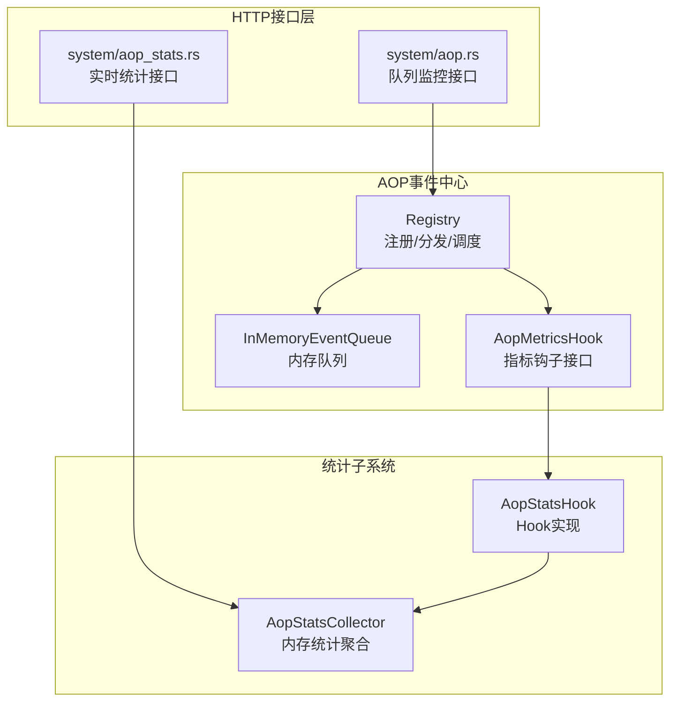
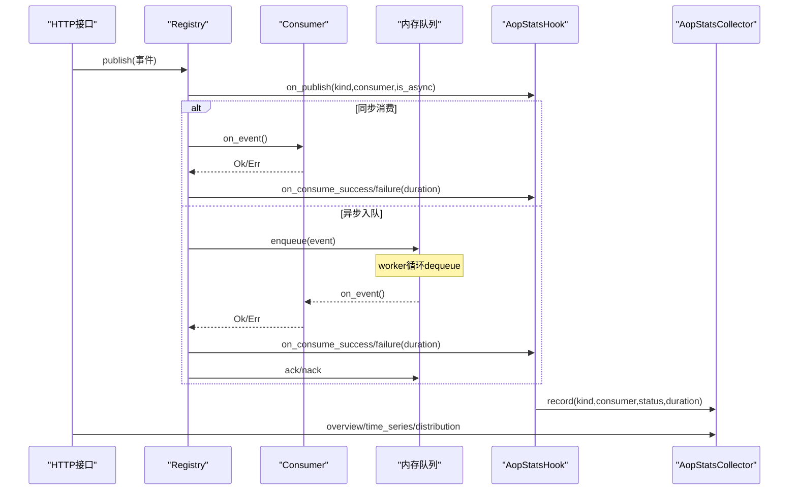
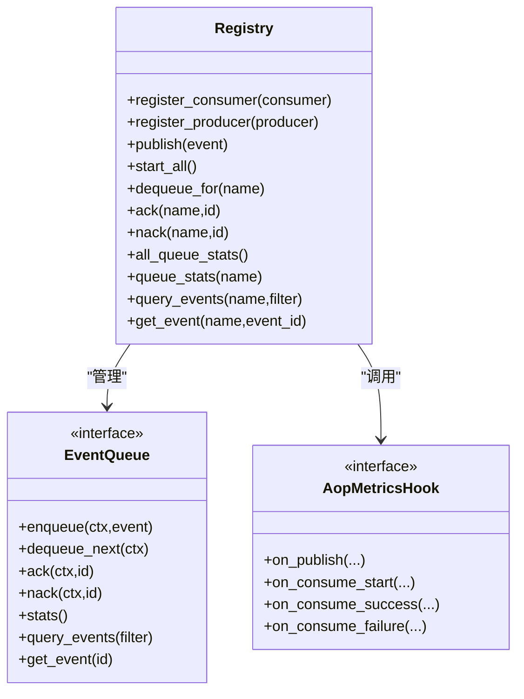
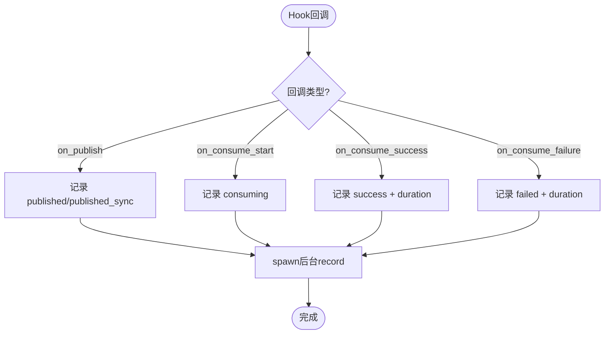
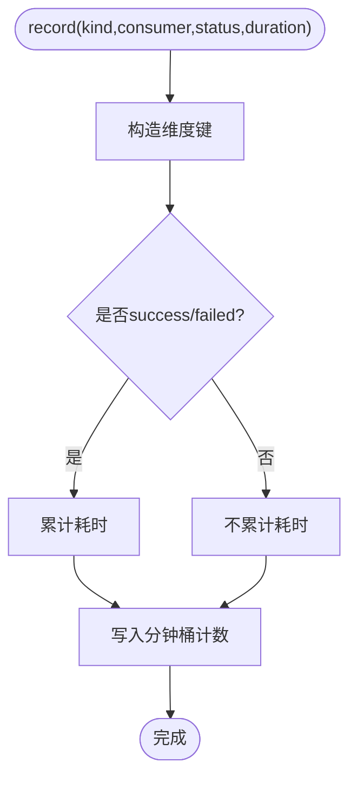
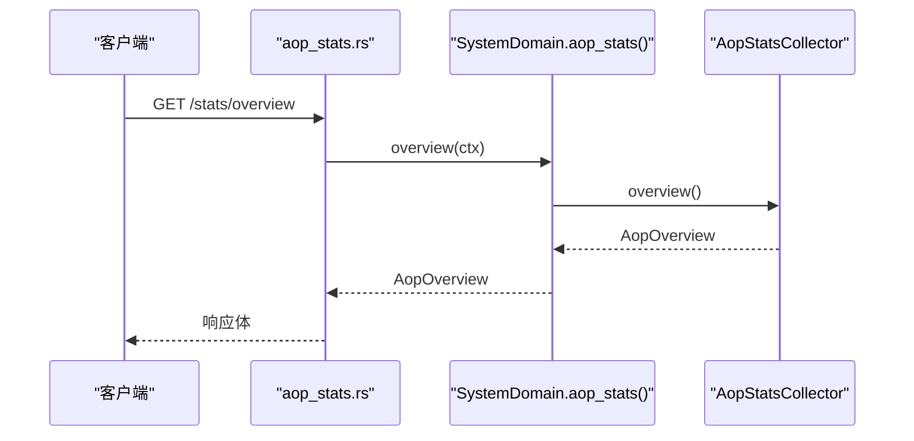
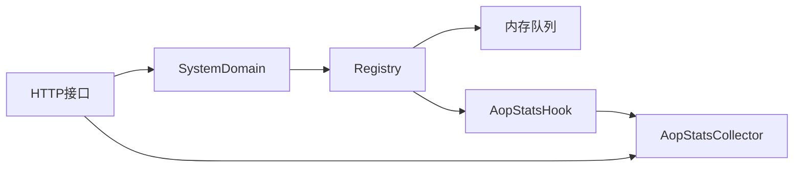

# AOP监控处理器

<cite>
**本文引用的文件**
- [src/handlers/system/aop.rs](file://src/handlers/system/aop.rs)
- [src/handlers/system/aop_stats.rs](file://src/handlers/system/aop_stats.rs)
- [src/pkg/aop/mod.rs](file://src/pkg/aop/mod.rs)
- [src/pkg/aop/core/registry.rs](file://src/pkg/aop/core/registry.rs)
- [src/pkg/aop/core/metrics_hook.rs](file://src/pkg/aop/core/metrics_hook.rs)
- [src/consumer/aop_stats_collector.rs](file://src/consumer/aop_stats_collector.rs)
- [src/consumer/aop_stats_hook.rs](file://src/consumer/aop_stats_hook.rs)
- [common/src/api/log_stats.rs](file://common/src/api/log_stats.rs)
</cite>

## 目录
1. [简介](#简介)
2. [项目结构](#项目结构)
3. [核心组件](#核心组件)
4. [架构总览](#架构总览)
5. [详细组件分析](#详细组件分析)
6. [依赖关系分析](#依赖关系分析)
7. [性能与高可用设计](#性能与高可用设计)
8. [故障排查指南](#故障排查指南)
9. [结论](#结论)
10. [附录：API与使用示例](#附录api与使用示例)

## 简介
本文件面向AOP（面向切面）监控处理器，系统性说明该系统的HTTP接口实现、事件处理流程、监控钩子注册机制、性能指标采集方法、存储结构与查询接口、报表生成能力，以及高可用设计、数据压缩策略与查询优化。同时提供API使用示例、自定义监控指标配置方法与告警规则设置建议，并给出监控数据导出与第三方系统集成方案。

## 项目结构
AOP监控由“生产-消费事件中心”、“统计收集器”、“HTTP接口层”三部分组成：
- 事件中心位于 pkg/aop，负责事件分发、消费者注册、异步队列调度与指标Hook注入点。
- 统计收集器位于 consumer/aop_stats_collector.rs，基于内存运行时收集器聚合概览、时序、分布三类指标。
- HTTP接口位于 handlers/system/aop*.rs，暴露系统管理端点用于查看队列状态、事件列表与实时统计。

图表来源
- [src/handlers/system/aop.rs:14-145](file://src/handlers/system/aop.rs#L14-L145)
- [src/handlers/system/aop_stats.rs:16-73](file://src/handlers/system/aop_stats.rs#L16-L73)
- [src/pkg/aop/core/registry.rs:97-206](file://src/pkg/aop/core/registry.rs#L97-L206)
- [src/consumer/aop_stats_hook.rs:35-82](file://src/consumer/aop_stats_hook.rs#L35-L82)
- [src/consumer/aop_stats_collector.rs:54-196](file://src/consumer/aop_stats_collector.rs#L54-L196)

章节来源
- [src/handlers/system/aop.rs:14-145](file://src/handlers/system/aop.rs#L14-L145)
- [src/handlers/system/aop_stats.rs:16-73](file://src/handlers/system/aop_stats.rs#L16-L73)
- [src/pkg/aop/mod.rs:1-61](file://src/pkg/aop/mod.rs#L1-L61)

## 核心组件
- AOP事件中心（Registry）：统一注册消费者/生产者，发布事件时注入元信息到JSON顶层，按消费者模式（同步/异步）分发；在关键生命周期节点触发指标Hook。
- 指标Hook（AopMetricsHook + AopStatsHook）：定义on_publish/on_consume_start/on_consume_success/on_consume_failure四个回调；业务实现通过后台任务写入统计收集器，避免阻塞主流程。
- 统计收集器（AopStatsCollector）：纯内存实现，维护分钟级桶的计数与耗时累计，提供overview/time_series/distribution三种查询视图。
- HTTP接口：
  - 队列监控：获取所有消费者队列统计、指定消费者队列统计、事件列表与详情。
  - 实时统计：概览、时间序列、分布三个只读接口，直接读取内存快照，零DB开销。

章节来源
- [src/pkg/aop/core/registry.rs:97-206](file://src/pkg/aop/core/registry.rs#L97-L206)
- [src/pkg/aop/core/metrics_hook.rs:16-89](file://src/pkg/aop/core/metrics_hook.rs#L16-L89)
- [src/consumer/aop_stats_hook.rs:35-82](file://src/consumer/aop_stats_hook.rs#L35-L82)
- [src/consumer/aop_stats_collector.rs:54-196](file://src/consumer/aop_stats_collector.rs#L54-L196)
- [src/handlers/system/aop.rs:14-145](file://src/handlers/system/aop.rs#L14-L145)
- [src/handlers/system/aop_stats.rs:16-73](file://src/handlers/system/aop_stats.rs#L16-L73)

## 架构总览
AOP监控采用“事件驱动+内存统计”的轻量架构：
- 发布侧：Registry在序列化事件后注入元字段，按消费者兴趣路由；对每个消费者调用Hook.on_publish。
- 消费侧：同步模式直接执行并记录成功/失败；异步模式入队并由worker轮询，执行前后分别记录开始与结束，失败时nack并重试退避。
- 统计侧：Hook将事件维度（event_kind, consumer_name, status）与耗时写入内存收集器；HTTP接口直接读取快照，提供概览、时序、分布三类视图。

图表来源
- [src/pkg/aop/core/registry.rs:97-206](file://src/pkg/aop/core/registry.rs#L97-L206)
- [src/pkg/aop/core/registry.rs:333-444](file://src/pkg/aop/core/registry.rs#L333-L444)
- [src/consumer/aop_stats_hook.rs:35-82](file://src/consumer/aop_stats_hook.rs#L35-L82)
- [src/consumer/aop_stats_collector.rs:61-196](file://src/consumer/aop_stats_collector.rs#L61-L196)

## 详细组件分析

### Registry（事件中心）
- 职责：注册消费者/生产者、发布事件、启动异步消费者worker、管理内存队列、暴露队列统计与事件查询。
- 关键点：
  - 发布时向事件JSON注入event_id/kind/order_key/priority/created_at等元字段，供队列与监控一致读取。
  - 同步/异步两种消费模式：同步直接调用；异步入队并由多worker轮询，支持空队列sleep与错误重试sleep。
  - 指标Hook在publish、consume_start、consume_success、consume_failure四阶段触发。
  - 提供all_queue_stats/queue_stats/query_events/get_event等内部查询能力，被系统接口复用。

图表来源
- [src/pkg/aop/core/registry.rs:11-561](file://src/pkg/aop/core/registry.rs#L11-L561)
- [src/pkg/aop/core/metrics_hook.rs:57-89](file://src/pkg/aop/core/metrics_hook.rs#L57-L89)

章节来源
- [src/pkg/aop/core/registry.rs:97-206](file://src/pkg/aop/core/registry.rs#L97-L206)
- [src/pkg/aop/core/registry.rs:260-487](file://src/pkg/aop/core/registry.rs#L260-L487)
- [src/pkg/aop/core/registry.rs:509-553](file://src/pkg/aop/core/registry.rs#L509-L553)

### AopStatsHook（统计采集Hook）
- 职责：实现AopMetricsHook，在四个回调中调用AopStatsCollector.record，并通过tokio::spawn后台执行record，避免阻塞AOP主流程。
- 行为：
  - on_publish区分is_async，记录published或published_sync。
  - on_consume_start记录consuming。
  - on_consume_success/on_consume_failure记录success/failed并附带duration_ms。

图表来源
- [src/consumer/aop_stats_hook.rs:35-82](file://src/consumer/aop_stats_hook.rs#L35-L82)

章节来源
- [src/consumer/aop_stats_hook.rs:1-118](file://src/consumer/aop_stats_hook.rs#L1-L118)

### AopStatsCollector（内存统计聚合）
- 职责：维护分钟级桶的计数与耗时累计，提供overview/time_series/distribution三类查询。
- 数据结构：
  - 维度键：(event_kind, consumer_name, status)。
  - 概览：累计published/consumed/success/failed与平均耗时。
  - 时序：滑动窗口内每分钟桶的调用次数，支持按kind/consumer/status过滤。
  - 分布：按consumer/status/kind分组，支持status过滤并按值降序。
- 复杂度：snapshot遍历桶与维度组合，时间复杂度O(Buckets × Dimensions)，空间占用约数十KB。

图表来源
- [src/consumer/aop_stats_collector.rs:61-72](file://src/consumer/aop_stats_collector.rs#L61-L72)

章节来源
- [src/consumer/aop_stats_collector.rs:16-196](file://src/consumer/aop_stats_collector.rs#L16-L196)

### HTTP接口层
- 队列监控接口（/api/v1/system/aop/*）：
  - GET /api/v1/system/aop/stats：返回所有消费者队列的pending/in_progress、order_keys明细与最老事件年龄。
  - GET /api/v1/system/aop/{consumer}/stats：返回指定消费者队列统计。
  - GET /api/v1/system/aop/{consumer}/events：分页列出事件摘要，支持status与order_key过滤。
  - GET /api/v1/system/aop/{consumer}/events/{event_id}：返回事件详情与payload预览。
- 实时统计接口（/api/v1/system/aop/stats/*）：
  - GET /api/v1/system/aop/stats/overview：概览（总数、成功率、平均耗时）。
  - GET /api/v1/system/aop/stats/time-series：时间序列（分钟粒度），支持event_kind/consumer_name/status过滤。
  - GET /api/v1/system/aop/stats/distribution：分布（按consumer/status/kind），支持status过滤。

图表来源
- [src/handlers/system/aop_stats.rs:16-30](file://src/handlers/system/aop_stats.rs#L16-L30)
- [src/consumer/aop_stats_collector.rs:74-111](file://src/consumer/aop_stats_collector.rs#L74-L111)

章节来源
- [src/handlers/system/aop.rs:14-145](file://src/handlers/system/aop.rs#L14-L145)
- [src/handlers/system/aop_stats.rs:16-73](file://src/handlers/system/aop_stats.rs#L16-L73)

## 依赖关系分析
- 模块耦合：
  - HTTP接口仅依赖domain().aop_monitor()/aop_stats()，无业务实体感知。
  - Registry依赖AopMetricsHook（可空），默认零开销；依赖内存队列实现。
  - AopStatsHook依赖AopStatsCollector，通过后台任务解耦。
- 外部依赖：
  - 统计查询DTO定义于common模块（如日志统计DTO可作为参考结构）。
- 潜在风险：
  - 内存统计重启即丢失，需结合持久化方案做长期趋势分析。
  - 高并发下Hook后台任务堆积可能影响延迟，需评估并发度与背压策略。

图表来源
- [src/handlers/system/aop_stats.rs:16-73](file://src/handlers/system/aop_stats.rs#L16-L73)
- [src/pkg/aop/core/registry.rs:97-206](file://src/pkg/aop/core/registry.rs#L97-L206)
- [src/consumer/aop_stats_hook.rs:35-82](file://src/consumer/aop_stats_hook.rs#L35-L82)
- [src/consumer/aop_stats_collector.rs:54-196](file://src/consumer/aop_stats_collector.rs#L54-L196)

章节来源
- [common/src/api/log_stats.rs:1-77](file://common/src/api/log_stats.rs#L1-L77)

## 性能与高可用设计
- 性能特性
  - 实时统计为纯内存快照，零DB查询，毫秒级响应。
  - Hook记录通过tokio::spawn后台执行，避免阻塞AOP主路径。
  - 统计聚合按分钟桶聚合，降低内存与计算压力。
- 高可用设计
  - 异步消费者支持多worker并发，空队列与错误场景均有sleep退避，避免CPU自旋。
  - 失败事件通过nack重入队，配合error_retry_sleep_ms实现指数退避式重试。
  - Registry.start_all幂等，重复调用安全。
- 数据压缩策略
  - 当前为内存分钟级聚合，未启用磁盘压缩；如需持久化，建议在落库前按天/小时分片并采用列存或压缩格式（例如Parquet/Arrow）。
- 查询优化
  - 统计接口按维度过滤在内存中完成，适合短期窗口；长周期查询应引入DuckDB/SQLite等后端进行预聚合与索引。
  - 事件列表查询限制limit上限（最大1000），防止大结果集拖慢接口。

[本节为通用指导，无需特定文件引用]

## 故障排查指南
- 常见问题定位
  - 队列积压：通过GET /api/v1/system/aop/stats查看各消费者pending_count与oldest_event_age_secs，定位瓶颈消费者。
  - 事件卡死：检查同order_key的事件是否长时间停留在in_progress；确认消费者是否正确调用ack/nack。
  - 统计缺失：确认Hook已注入且后台record任务正常执行；必要时增加日志观察on_*回调触发。
- 诊断步骤
  - 使用GET /api/v1/system/aop/{consumer}/events列出待处理事件，筛选status=pending/processing。
  - 使用GET /api/v1/system/aop/{consumer}/events/{event_id}查看事件详情与payload_preview。
  - 使用GET /api/v1/system/aop/stats/time-series与distribution分析异常时段与分布。
- 恢复建议
  - 调整消费者并发度与empty_queue_sleep_ms/error_retry_sleep_ms参数。
  - 修复消费者逻辑错误，确保成功/失败路径均正确上报Hook。

章节来源
- [src/handlers/system/aop.rs:43-145](file://src/handlers/system/aop.rs#L43-L145)
- [src/pkg/aop/core/registry.rs:333-444](file://src/pkg/aop/core/registry.rs#L333-L444)

## 结论
AOP监控系统以“事件驱动+内存统计”为核心，提供低侵入、高性能的指标采集与可视化能力。通过Registry的生命周期Hook与AopStatsCollector的分钟级聚合，实现了概览、时序、分布三类实时监控；HTTP接口直接读取内存快照，满足运维与排障需求。未来可通过持久化与预聚合进一步提升长周期分析与查询性能。

[本节为总结性内容，无需特定文件引用]

## 附录：API与使用示例

### HTTP接口清单
- 队列监控
  - GET /api/v1/system/aop/stats
  - GET /api/v1/system/aop/{consumer}/stats
  - GET /api/v1/system/aop/{consumer}/events?status={pending|processing}&order_key=...&limit=...&offset=...
  - GET /api/v1/system/aop/{consumer}/events/{event_id}
- 实时统计
  - GET /api/v1/system/aop/stats/overview
  - GET /api/v1/system/aop/stats/time-series?event_kind=...&consumer_name=...&status=...
  - GET /api/v1/system/aop/stats/distribution?group_by={consumer|status|kind}&status=...

章节来源
- [src/handlers/system/aop.rs:14-145](file://src/handlers/system/aop.rs#L14-L145)
- [src/handlers/system/aop_stats.rs:16-73](file://src/handlers/system/aop_stats.rs#L16-L73)

### 自定义监控指标配置
- 实现AopMetricsHook并在启动时注入到Registry，即可在事件生命周期中采集自定义指标。
- 推荐做法：将统计写入AopStatsCollector或通过Hook扩展其他指标后端（如Prometheus/时序数据库）。

章节来源
- [src/pkg/aop/core/metrics_hook.rs:57-89](file://src/pkg/aop/core/metrics_hook.rs#L57-L89)
- [src/consumer/aop_stats_hook.rs:15-33](file://src/consumer/aop_stats_hook.rs#L15-L33)

### 告警规则设置建议
- 基于实时统计阈值：
  - 失败率超过阈值（total_failed / total_consumed）。
  - 平均耗时超过阈值（avg_duration_ms）。
  - 队列积压超过阈值（pending_count或oldest_event_age_secs）。
- 基于事件查询：
  - 某消费者长时间无成功事件（time-series连续N分钟call_count为0）。
  - 某order_key事件长期处于in_progress。

[本节为通用实践，无需特定文件引用]

### 监控数据导出与第三方集成
- 导出方式：
  - 通过HTTP接口拉取overview/time-series/distribution数据，前端或批处理脚本定时采集并落盘。
  - 事件列表与详情可用于审计与回溯。
- 第三方集成：
  - 将Hook接入外部指标系统（如Prometheus Exporter），或在AopStatsCollector基础上增加持久化适配器（DuckDB/SQLite/对象存储）。
  - 结合日志统计DTO结构（如common/src/api/log_stats.rs）统一输出格式，便于对接现有监控平台。

章节来源
- [common/src/api/log_stats.rs:1-77](file://common/src/api/log_stats.rs#L1-L77)