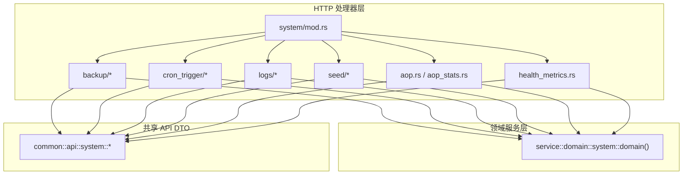
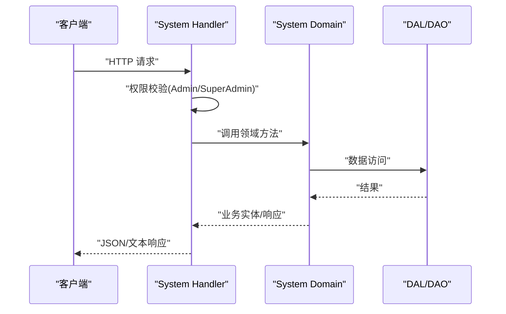
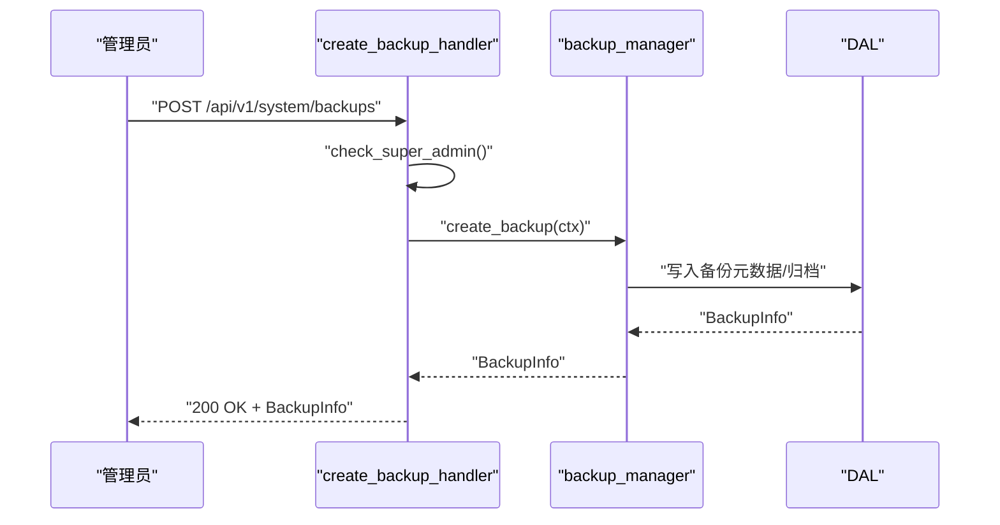
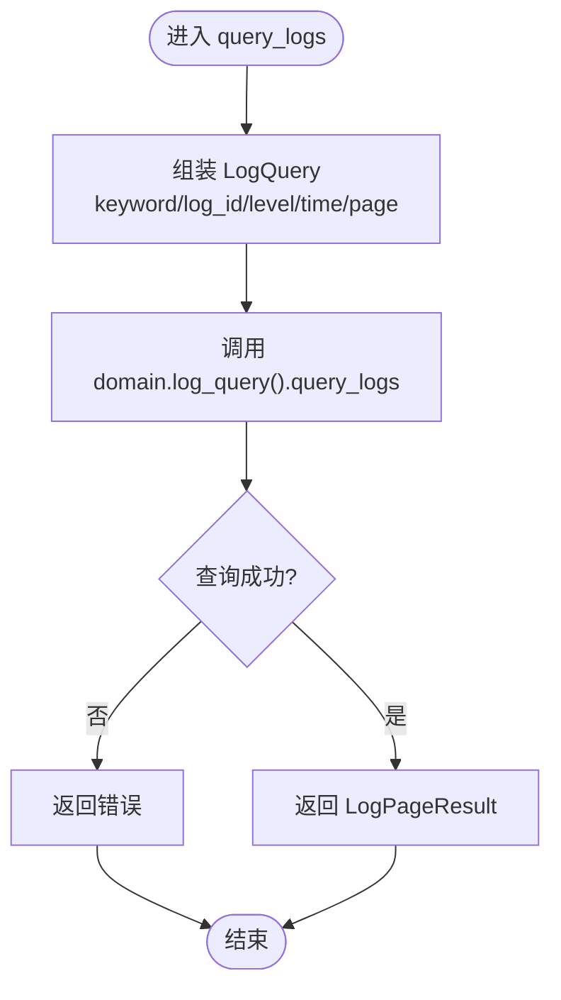
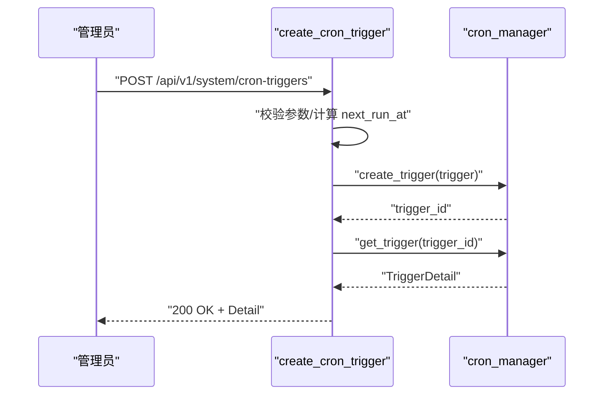
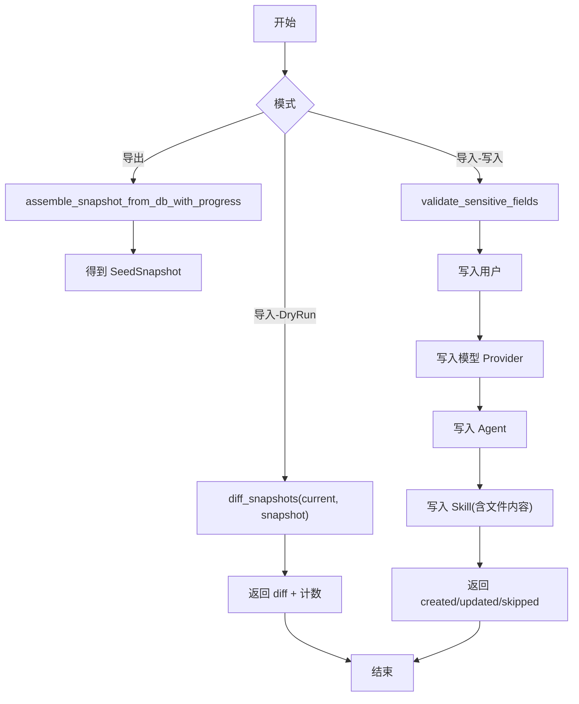
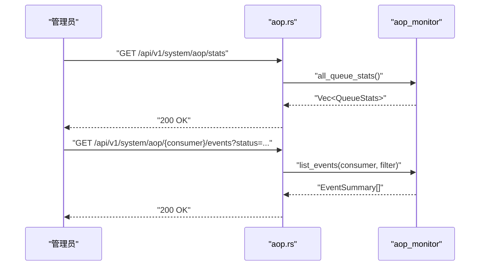
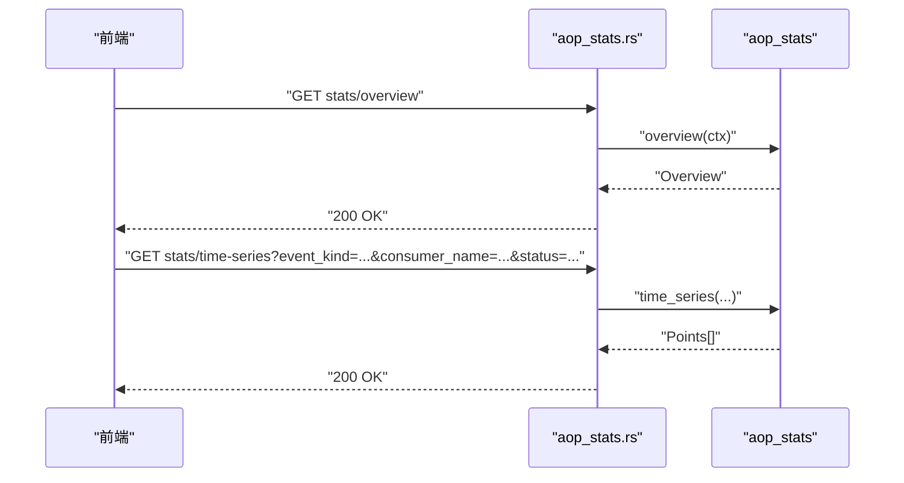
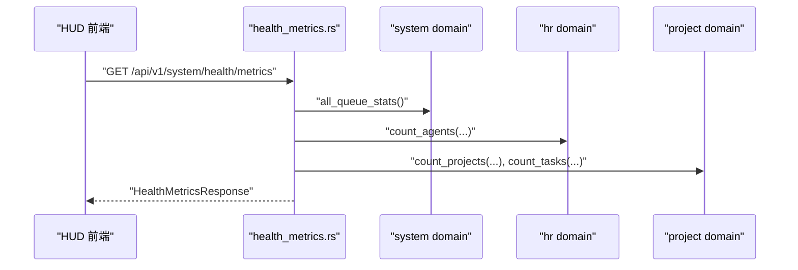
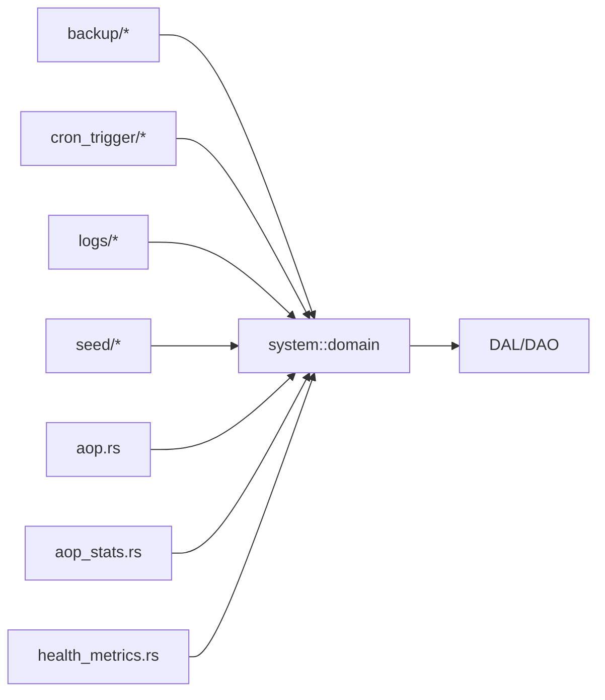

# System模块处理器

<cite>
**本文引用的文件**
- [src/handlers/system/mod.rs](file://src/handlers/system/mod.rs)
- [src/handlers/system/backup/mod.rs](file://src/handlers/system/backup/mod.rs)
- [src/handlers/system/backup/create_backup.rs](file://src/handlers/system/backup/create_backup.rs)
- [src/handlers/system/backup/list_backups.rs](file://src/handlers/system/backup/list_backups.rs)
- [src/handlers/system/backup/restore_backup.rs](file://src/handlers/system/backup/restore_backup.rs)
- [src/handlers/system/cron_trigger/mod.rs](file://src/handlers/system/cron_trigger/mod.rs)
- [src/handlers/system/cron_trigger/create_cron_trigger.rs](file://src/handlers/system/cron_trigger/create_cron_trigger.rs)
- [src/handlers/system/logs/query_logs.rs](file://src/handlers/system/logs/query_logs.rs)
- [src/handlers/system/seed/mod.rs](file://src/handlers/system/seed/mod.rs)
- [src/handlers/system/aop.rs](file://src/handlers/system/aop.rs)
- [src/handlers/system/aop_stats.rs](file://src/handlers/system/aop_stats.rs)
- [src/handlers/system/health_metrics.rs](file://src/handlers/system/health_metrics.rs)
- [common/src/api/system.rs](file://common/src/api/system.rs)
</cite>

## 目录
1. [简介](#简介)
2. [项目结构](#项目结构)
3. [核心组件](#核心组件)
4. [架构总览](#架构总览)
5. [详细组件分析](#详细组件分析)
6. [依赖关系分析](#依赖关系分析)
7. [性能考量](#性能考量)
8. [故障排查指南](#故障排查指南)
9. [结论](#结论)
10. [附录：API示例与最佳实践](#附录api示例与最佳实践)

## 简介
本文件面向 System（系统管理）模块的 HTTP 处理器，覆盖备份恢复、日志查询、定时任务、种子数据管理、AOP 队列监控与实时统计、系统健康指标聚合等系统级能力。文档从四层单向调用视角说明 Handler → Domain → DAL → DAO 的职责边界，解释管理员权限控制、系统资源管理、异步任务调度与监控指标收集的实现方式，并给出运维最佳实践与安全建议。

## 项目结构
System 模块按功能域拆分到 handlers/system 下，每个子域进一步按方法粒度拆分为独立文件，便于权限校验、路由绑定与维护。

图表来源
- [src/handlers/system/mod.rs:1-13](file://src/handlers/system/mod.rs#L1-L13)
- [common/src/api/system.rs:1-239](file://common/src/api/system.rs#L1-L239)

章节来源
- [src/handlers/system/mod.rs:1-13](file://src/handlers/system/mod.rs#L1-L13)

## 核心组件
- 备份恢复：创建备份、列出备份、生成恢复脚本；高危操作二次校验 SuperAdmin。
- 日志查询：分页、关键词、级别、时间范围过滤的应用日志检索。
- 定时任务：一次性与间隔触发器创建与管理（Cron 表达式暂不支持）。
- 种子数据：导出/导入组织、用户、模型 Provider、Agent、Skill 的快照，支持差异对比与敏感字段注入。
- AOP 队列监控：查看各消费者队列状态、事件列表与详情。
- AOP 实时统计：概览、时序、分布三类内存统计接口。
- 健康指标：聚合后端在线、AOP 队列积压、活跃 Agent/项目/任务数、运行时长等。

章节来源
- [src/handlers/system/backup/mod.rs:1-33](file://src/handlers/system/backup/mod.rs#L1-L33)
- [src/handlers/system/logs/query_logs.rs:1-29](file://src/handlers/system/logs/query_logs.rs#L1-L29)
- [src/handlers/system/cron_trigger/create_cron_trigger.rs:1-68](file://src/handlers/system/cron_trigger/create_cron_trigger.rs#L1-L68)
- [src/handlers/system/seed/mod.rs:1-675](file://src/handlers/system/seed/mod.rs#L1-L675)
- [src/handlers/system/aop.rs:1-145](file://src/handlers/system/aop.rs#L1-L145)
- [src/handlers/system/aop_stats.rs:1-73](file://src/handlers/system/aop_stats.rs#L1-L73)
- [src/handlers/system/health_metrics.rs:1-135](file://src/handlers/system/health_metrics.rs#L1-L135)
- [common/src/api/system.rs:1-239](file://common/src/api/system.rs#L1-L239)

## 架构总览
System 模块严格遵循 Adapter→Domain→DAL→DAO 单向调用。Handler 仅负责参数解析、权限校验与编排；Domain 封装业务规则；DAL/DAO 负责持久化。

图表来源
- [src/handlers/system/backup/create_backup.rs:1-27](file://src/handlers/system/backup/create_backup.rs#L1-L27)
- [src/handlers/system/seed/mod.rs:273-409](file://src/handlers/system/seed/mod.rs#L273-L409)
- [src/handlers/system/aop.rs:14-41](file://src/handlers/system/aop.rs#L14-L41)

## 详细组件分析

### 备份恢复
- 职责：提供备份创建、备份列表、恢复脚本生成；对创建/删除/恢复等高危操作进行 SuperAdmin 二次校验。
- 权限：路由层要求 Admin/SuperAdmin；handler 内部 check_super_admin 再次限制为 SuperAdmin。
- 存储：备份信息通过 DAL 返回，恢复脚本以 text/plain 返回供运维执行。

图表来源
- [src/handlers/system/backup/create_backup.rs:1-27](file://src/handlers/system/backup/create_backup.rs#L1-L27)
- [src/handlers/system/backup/mod.rs:19-32](file://src/handlers/system/backup/mod.rs#L19-L32)

章节来源
- [src/handlers/system/backup/mod.rs:1-33](file://src/handlers/system/backup/mod.rs#L1-L33)
- [src/handlers/system/backup/create_backup.rs:1-27](file://src/handlers/system/backup/create_backup.rs#L1-L27)
- [src/handlers/system/backup/list_backups.rs:1-22](file://src/handlers/system/backup/list_backups.rs#L1-L22)
- [src/handlers/system/backup/restore_backup.rs:1-36](file://src/handlers/system/backup/restore_backup.rs#L1-L36)

### 日志查询
- 职责：分页查询应用日志，支持关键词、日志 ID、级别、起止时间过滤。
- 权限：路由层要求 Admin/SuperAdmin。
- 数据流：Handler 组装 LogQuery 后交由 Domain.log_query().query_logs 处理。

图表来源
- [src/handlers/system/logs/query_logs.rs:1-29](file://src/handlers/system/logs/query_logs.rs#L1-L29)

章节来源
- [src/handlers/system/logs/query_logs.rs:1-29](file://src/handlers/system/logs/query_logs.rs#L1-L29)

### 定时任务（Cron Trigger）
- 职责：创建一次性或间隔型触发器；Cron 表达式类型当前不支持。
- 权限：路由层要求 Admin/SuperAdmin。
- 行为：根据类型计算 next_run_at，持久化触发器并返回详情。

图表来源
- [src/handlers/system/cron_trigger/create_cron_trigger.rs:1-68](file://src/handlers/system/cron_trigger/create_cron_trigger.rs#L1-L68)

章节来源
- [src/handlers/system/cron_trigger/mod.rs:1-21](file://src/handlers/system/cron_trigger/mod.rs#L1-L21)
- [src/handlers/system/cron_trigger/create_cron_trigger.rs:1-68](file://src/handlers/system/cron_trigger/create_cron_trigger.rs#L1-L68)

### 种子数据管理
- 职责：导出/导入组织、用户、模型 Provider、Agent、Skill 的快照；支持差异对比、DryRun、敏感字段注入与跳过策略。
- 权限：路由层要求 Admin/SuperAdmin；load/apply-default/delete 等高危操作在 handler 内二次校验 SuperAdmin。
- 关键流程：
  - 导出：assemble_snapshot_from_db[_with_progress] 拉取多域数据并组装 SeedSnapshot。
  - 导入：apply_snapshot_to_db[_with_progress] 按策略 upsert，支持 DryRun 仅计算 diff。
  - 技能文件：resolve_skill_file_content 支持 content/ref_path/url 三种来源，url 抓取限 30s/1MB。

图表来源
- [src/handlers/system/seed/mod.rs:273-409](file://src/handlers/system/seed/mod.rs#L273-L409)
- [src/handlers/system/seed/mod.rs:420-671](file://src/handlers/system/seed/mod.rs#L420-L671)

章节来源
- [src/handlers/system/seed/mod.rs:1-675](file://src/handlers/system/seed/mod.rs#L1-L675)

### AOP 队列监控
- 职责：查看所有消费者队列统计、按消费者查询队列、列出事件与获取事件详情。
- 权限：由路由层统一保护（通常为 Admin/SuperAdmin）。
- 数据源：SystemDomain.aop_monitor() 提供队列与事件读取。

图表来源
- [src/handlers/system/aop.rs:14-145](file://src/handlers/system/aop.rs#L14-L145)

章节来源
- [src/handlers/system/aop.rs:1-145](file://src/handlers/system/aop.rs#L1-L145)
- [common/src/api/system.rs:55-191](file://common/src/api/system.rs#L55-L191)

### AOP 实时统计
- 职责：提供概览、时序、分布三类统计，直接读取内存中的 AopStatsCollector 快照，零 DB 查询。
- 权限：由路由层统一保护。
- 特点：毫秒级响应，适合前端仪表盘刷新。

图表来源
- [src/handlers/system/aop_stats.rs:1-73](file://src/handlers/system/aop_stats.rs#L1-L73)

章节来源
- [src/handlers/system/aop_stats.rs:1-73](file://src/handlers/system/aop_stats.rs#L1-L73)
- [common/src/api/system.rs:100-239](file://common/src/api/system.rs#L100-L239)

### 系统健康指标
- 职责：聚合后端在线、AOP 队列积压、活跃 Agent/项目/任务数、进程运行时长等，供 HUD 展示。
- 实现要点：
  - uptime_secs：首次调用时初始化 OnceLock<Instant> 近似进程运行时长。
  - 各维度通过对应 Domain 的 count_* 接口聚合，失败降级为 0。
- 权限：由路由层统一保护。

图表来源
- [src/handlers/system/health_metrics.rs:1-135](file://src/handlers/system/health_metrics.rs#L1-L135)

章节来源
- [src/handlers/system/health_metrics.rs:1-135](file://src/handlers/system/health_metrics.rs#L1-L135)
- [common/src/api/system.rs:1-33](file://common/src/api/system.rs#L1-L33)

## 依赖关系分析
- Handler 仅依赖 common::api DTO 与 crate::pkg::RequestContext，并通过 service::domain::system::domain() 访问领域服务。
- 备份、日志、定时任务、种子数据、AOP 监控与健康指标均通过同一入口 domain() 解耦具体实现。
- 权限控制采用“路由层角色检查 + handler 内部高危操作二次校验”的组合策略。

图表来源
- [src/handlers/system/backup/create_backup.rs:1-27](file://src/handlers/system/backup/create_backup.rs#L1-L27)
- [src/handlers/system/cron_trigger/create_cron_trigger.rs:1-68](file://src/handlers/system/cron_trigger/create_cron_trigger.rs#L1-L68)
- [src/handlers/system/logs/query_logs.rs:1-29](file://src/handlers/system/logs/query_logs.rs#L1-L29)
- [src/handlers/system/seed/mod.rs:273-409](file://src/handlers/system/seed/mod.rs#L273-L409)
- [src/handlers/system/aop.rs:14-41](file://src/handlers/system/aop.rs#L14-L41)
- [src/handlers/system/aop_stats.rs:17-30](file://src/handlers/system/aop_stats.rs#L17-L30)
- [src/handlers/system/health_metrics.rs:33-49](file://src/handlers/system/health_metrics.rs#L33-L49)

章节来源
- [src/handlers/system/mod.rs:1-13](file://src/handlers/system/mod.rs#L1-L13)

## 性能考量
- AOP 实时统计：直接读取内存统计，无 DB 查询，适合高频刷新。
- 健康指标：对跨域统计做失败降级为 0，避免单点慢查询拖垮整体响应。
- 种子数据导入：支持进度回调与 DryRun，便于大对象导入时的可观测性与回滚前验证。
- 日志查询：分页默认 page_size 较小，避免大数据量传输。

[本节为通用指导，不直接分析具体文件]

## 故障排查指南
- 权限不足：确认路由层已配置 require_role_middleware(UserRole::Admin)，高危操作需满足 SuperAdmin 二次校验。
- 备份恢复失败：检查备份是否存在、恢复脚本是否被正确执行；关注文本响应是否为 text/plain。
- 定时任务未触发：确认 trigger_type 与 next_run_at 计算是否正确；Cron 表达式类型当前不支持。
- 种子导入异常：优先使用 DryRun 查看 diff；检查敏感字段是否补齐；注意 SkipExisting 策略会跳过已有记录。
- AOP 队列堆积：通过 all_queue_stats 与 list_events 定位消费者与事件状态，结合下游消费能力扩容或优化。

章节来源
- [src/handlers/system/backup/mod.rs:19-32](file://src/handlers/system/backup/mod.rs#L19-L32)
- [src/handlers/system/backup/restore_backup.rs:18-35](file://src/handlers/system/backup/restore_backup.rs#L18-L35)
- [src/handlers/system/cron_trigger/create_cron_trigger.rs:19-37](file://src/handlers/system/cron_trigger/create_cron_trigger.rs#L19-L37)
- [src/handlers/system/seed/mod.rs:420-480](file://src/handlers/system/seed/mod.rs#L420-L480)
- [src/handlers/system/aop.rs:73-117](file://src/handlers/system/aop.rs#L73-L117)

## 结论
System 模块以清晰的 Handler→Domain→DAL→DAO 分层实现了备份恢复、日志查询、定时任务、种子数据管理、AOP 监控与实时统计、健康指标聚合等系统级能力。通过路由层角色校验与 handler 内部二次校验保障安全，通过内存统计与降级策略保障性能，通过 DryRun 与进度回调提升可维护性。建议在生产环境结合监控告警与审计日志，形成闭环的系统运维体系。

[本节为总结性内容，不直接分析具体文件]

## 附录：API示例与最佳实践

- 备份恢复
  - 创建备份：POST /api/v1/system/backups（SuperAdmin）
  - 列出备份：GET /api/v1/system/backups（Admin/SuperAdmin）
  - 恢复脚本：GET /api/v1/system/backups/{version}/restore（SuperAdmin，text/plain）
- 日志查询
  - 查询日志：GET /api/v1/system/logs?keyword=&log_id=&level=&start_time=&end_time=&page=&page_size=
- 定时任务
  - 创建触发器：POST /api/v1/system/cron-triggers（Once/Interval；Cron 表达式暂不支持）
- 种子数据
  - 导出快照：调用 assemble_snapshot_from_db[_with_progress]
  - 导入快照：调用 apply_snapshot_to_db[_with_progress]，支持 DryRun 与敏感字段注入
- AOP 监控
  - 队列统计：GET /api/v1/system/aop/stats
  - 消费者统计：GET /api/v1/system/aop/{consumer}/stats
  - 事件列表：GET /api/v1/system/aop/{consumer}/events?order_key=&status=&limit=&offset=
  - 事件详情：GET /api/v1/system/aop/{consumer}/events/{event_id}
- 实时统计
  - 概览：GET /api/v1/system/aop/stats/overview
  - 时序：GET /api/v1/system/aop/stats/time-series?event_kind=&consumer_name=&status=
  - 分布：GET /api/v1/system/aop/stats/distribution?group_by=&status=
- 健康指标
  - 聚合指标：GET /api/v1/system/health/metrics

安全与运维建议
- 所有系统管理端点均需通过路由层角色中间件保护；高危操作在 handler 内二次校验 SuperAdmin。
- 备份恢复脚本以纯文本返回，应在受控环境中执行，并配合审计日志。
- 种子导入优先使用 DryRun 验证差异，再执行实际写入；必要时分阶段导入（用户/Provider/Agent/Skill）。
- 监控告警：基于 AOP 实时统计与健康指标建立阈值告警（如队列积压、任务堆积、Agent/项目数量异常）。
- 性能优化：合理设置日志分页大小；对跨域统计做降级；避免在大事务中执行耗时 IO。

章节来源
- [src/handlers/system/backup/mod.rs:19-32](file://src/handlers/system/backup/mod.rs#L19-L32)
- [src/handlers/system/backup/create_backup.rs:16-25](file://src/handlers/system/backup/create_backup.rs#L16-L25)
- [src/handlers/system/backup/list_backups.rs:13-20](file://src/handlers/system/backup/list_backups.rs#L13-L20)
- [src/handlers/system/backup/restore_backup.rs:18-35](file://src/handlers/system/backup/restore_backup.rs#L18-L35)
- [src/handlers/system/logs/query_logs.rs:13-27](file://src/handlers/system/logs/query_logs.rs#L13-L27)
- [src/handlers/system/cron_trigger/create_cron_trigger.rs:14-66](file://src/handlers/system/cron_trigger/create_cron_trigger.rs#L14-L66)
- [src/handlers/system/seed/mod.rs:273-409](file://src/handlers/system/seed/mod.rs#L273-L409)
- [src/handlers/system/seed/mod.rs:420-671](file://src/handlers/system/seed/mod.rs#L420-L671)
- [src/handlers/system/aop.rs:14-145](file://src/handlers/system/aop.rs#L14-L145)
- [src/handlers/system/aop_stats.rs:17-71](file://src/handlers/system/aop_stats.rs#L17-L71)
- [src/handlers/system/health_metrics.rs:33-133](file://src/handlers/system/health_metrics.rs#L33-L133)
- [common/src/api/system.rs:1-239](file://common/src/api/system.rs#L1-L239)