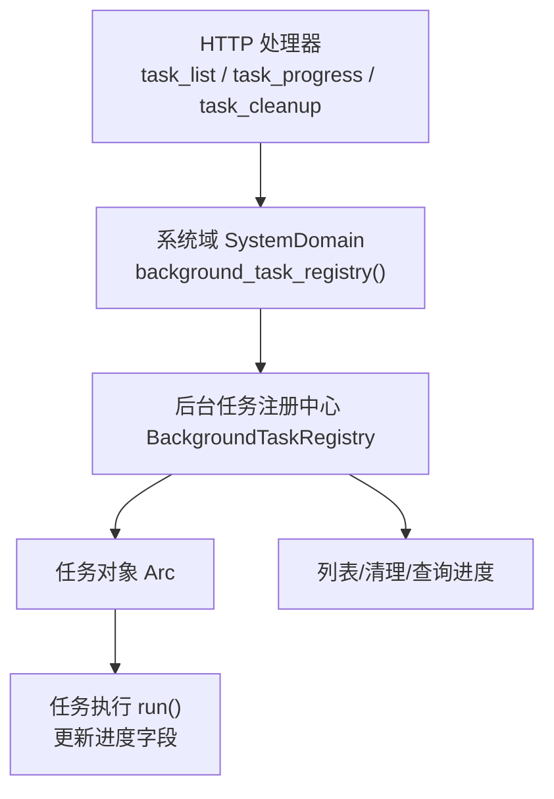
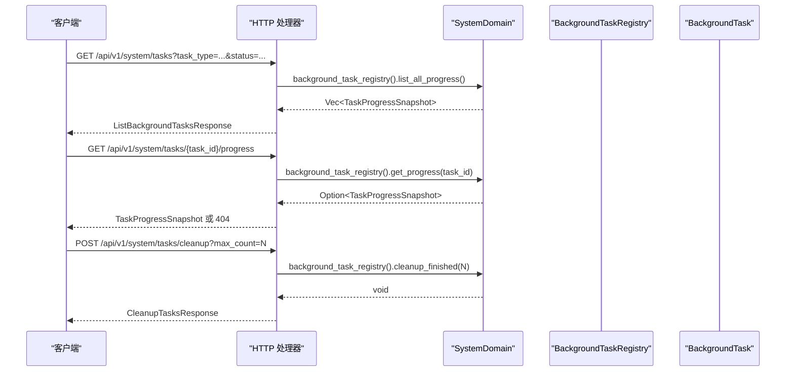
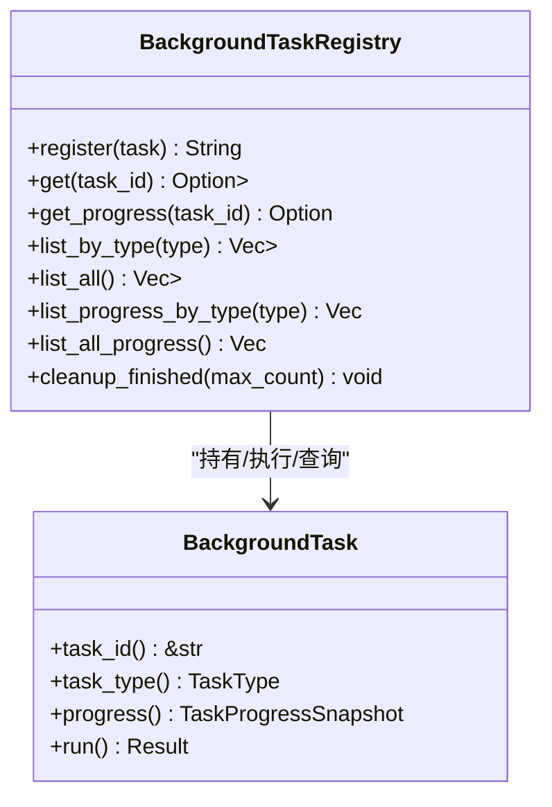
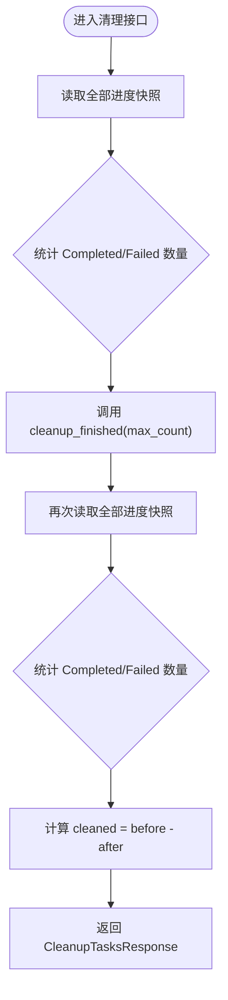
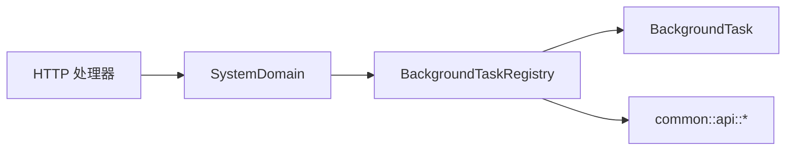

# 任务管理处理器

<cite>
**本文引用的文件**
- [common/src/api/background_task.rs](file://common/src/api/background_task.rs)
- [src/handlers/system/task_list.rs](file://src/handlers/system/task_list.rs)
- [src/handlers/system/task_progress.rs](file://src/handlers/system/task_progress.rs)
- [src/handlers/system/task_cleanup.rs](file://src/handlers/system/task_cleanup.rs)
- [src/pkg/background_task/mod.rs](file://src/pkg/background_task/mod.rs)
- [src/pkg/background_task/registry.rs](file://src/pkg/background_task/registry.rs)
- [src/service/domain/system/mod.rs](file://src/service/domain/system/mod.rs)
- [common/src/enums/task.rs](file://common/src/enums/task.rs)
</cite>

## 目录
1. [简介](#简介)
2. [项目结构](#项目结构)
3. [核心组件](#核心组件)
4. [架构总览](#架构总览)
5. [详细组件分析](#详细组件分析)
6. [依赖关系分析](#依赖关系分析)
7. [性能考虑](#性能考虑)
8. [故障排查指南](#故障排查指南)
9. [结论](#结论)
10. [附录：API 使用示例与监控面板建议](#附录api-使用示例与监控面板建议)

## 简介
本文件面向“后台任务管理”的 HTTP 接口与内部机制，覆盖任务生命周期、进度跟踪、清理与资源回收；并说明任务调度器、优先级、并发控制与服务发现在系统中的实现方式。文档同时给出任务状态持久化、失败重试策略与超时处理的设计要点，以及 API 使用示例、实时监控面板与性能调优建议，并提供审计日志与故障诊断工具指引。

## 项目结构
围绕后台任务管理的代码主要分布在以下位置：
- 公共 DTO 与枚举：common/src/api/background_task.rs、common/src/enums/task.rs
- HTTP 处理器：src/handlers/system/task_list.rs、task_progress.rs、task_cleanup.rs
- 通用后台任务框架（pkg 层）：src/pkg/background_task/mod.rs、registry.rs
- 系统域入口（暴露注册中心）：src/service/domain/system/mod.rs

图表来源
- [src/handlers/system/task_list.rs:1-41](file://src/handlers/system/task_list.rs#L1-L41)
- [src/handlers/system/task_progress.rs:1-26](file://src/handlers/system/task_progress.rs#L1-L26)
- [src/handlers/system/task_cleanup.rs:1-48](file://src/handlers/system/task_cleanup.rs#L1-L48)
- [src/service/domain/system/mod.rs:102-114](file://src/service/domain/system/mod.rs#L102-L114)
- [src/pkg/background_task/mod.rs:46-79](file://src/pkg/background_task/mod.rs#L46-L79)
- [src/pkg/background_task/registry.rs:13-123](file://src/pkg/background_task/registry.rs#L13-L123)

章节来源
- [src/handlers/system/task_list.rs:1-41](file://src/handlers/system/task_list.rs#L1-L41)
- [src/handlers/system/task_progress.rs:1-26](file://src/handlers/system/task_progress.rs#L1-L26)
- [src/handlers/system/task_cleanup.rs:1-48](file://src/handlers/system/task_cleanup.rs#L1-L48)
- [src/pkg/background_task/mod.rs:1-80](file://src/pkg/background_task/mod.rs#L1-L80)
- [src/pkg/background_task/registry.rs:1-131](file://src/pkg/background_task/registry.rs#L1-L131)
- [src/service/domain/system/mod.rs:102-114](file://src/service/domain/system/mod.rs#L102-L114)
- [common/src/api/background_task.rs:1-128](file://common/src/api/background_task.rs#L1-L128)
- [common/src/enums/task.rs:1-100](file://common/src/enums/task.rs#L1-L100)

## 核心组件
- 后台任务契约与注册中心
  - BackgroundTask trait：定义任务 ID、类型、进度快照读取与执行入口 run。
  - BackgroundTaskRegistry：全局注册中心，提供注册、查询、列表、清理等能力；通过 tokio::spawn 异步执行任务体。
- HTTP 处理器
  - 列表任务：支持按 task_type 与 status 筛选，返回 TaskProgressSnapshot 列表并按 started_at 降序。
  - 进度查询：根据 task_id 获取单个任务的进度快照，不存在返回未找到错误。
  - 清理任务：保留每个类型最近 N 个已完成/失败的任务，其余移除。
- 系统域桥接
  - SystemDomain 暴露 background_task_registry()，统一从 pkg 层获取全局注册中心。
- 公共 DTO 与枚举
  - TaskStatus、TaskType、TaskProgressSnapshot、各类请求/响应 DTO。
  - 业务任务状态枚举 TaskStatus（项目任务）与后台任务状态区分。

章节来源
- [src/pkg/background_task/mod.rs:46-79](file://src/pkg/background_task/mod.rs#L46-L79)
- [src/pkg/background_task/registry.rs:13-123](file://src/pkg/background_task/registry.rs#L13-L123)
- [src/handlers/system/task_list.rs:1-41](file://src/handlers/system/task_list.rs#L1-L41)
- [src/handlers/system/task_progress.rs:1-26](file://src/handlers/system/task_progress.rs#L1-L26)
- [src/handlers/system/task_cleanup.rs:1-48](file://src/handlers/system/task_cleanup.rs#L1-L48)
- [src/service/domain/system/mod.rs:102-114](file://src/service/domain/system/mod.rs#L102-L114)
- [common/src/api/background_task.rs:1-128](file://common/src/api/background_task.rs#L1-L128)
- [common/src/enums/task.rs:1-100](file://common/src/enums/task.rs#L1-L100)

## 架构总览
后端采用四层单向调用：Adapter（HTTP Handler）→ Domain → DAL → DAO。后台任务管理遵循该约束：
- Adapter 层：HTTP 处理器仅负责参数解析与结果封装，不持有业务逻辑。
- Domain 层：SystemDomain 暴露 background_task_registry()，将请求委派给 pkg 层的注册中心。
- pkg 层：BackgroundTaskRegistry 维护任务集合与执行生命周期，无业务感知。
- 数据层：任务进度快照为内存中的结构化数据；如需持久化，应由具体任务实现自行决定（当前注册中心以内存为主）。

图表来源
- [src/handlers/system/task_list.rs:12-40](file://src/handlers/system/task_list.rs#L12-L40)
- [src/handlers/system/task_progress.rs:12-25](file://src/handlers/system/task_progress.rs#L12-L25)
- [src/handlers/system/task_cleanup.rs:12-47](file://src/handlers/system/task_cleanup.rs#L12-L47)
- [src/service/domain/system/mod.rs:108-113](file://src/service/domain/system/mod.rs#L108-L113)
- [src/pkg/background_task/registry.rs:25-92](file://src/pkg/background_task/registry.rs#L25-L92)

## 详细组件分析

### 后台任务契约与注册中心
- BackgroundTask trait
  - 职责：声明任务 ID、类型、进度快照读取与执行入口；run 内部更新进度字段并在完成时写入 result。
  - 并发模型：trait 方法签名允许 dyn 兼容；registry 通过 Arc<dyn BackgroundTask> 分发。
- BackgroundTaskRegistry
  - 注册与执行：register 插入任务到 HashMap，并使用 tokio::spawn 异步执行 run；若 run 返回 Err 且未标记失败，记录错误日志。
  - 进度查询：get_progress/list_all_progress 遍历任务并调用 progress() 生成快照。
  - 清理策略：cleanup_finished 按 task_type 分组，对 Completed/Failed 任务按 finished_at 降序排序，保留最近 max_count 条，其余移除。

图表来源
- [src/pkg/background_task/mod.rs:46-79](file://src/pkg/background_task/mod.rs#L46-L79)
- [src/pkg/background_task/registry.rs:13-123](file://src/pkg/background_task/registry.rs#L13-L123)

章节来源
- [src/pkg/background_task/mod.rs:1-80](file://src/pkg/background_task/mod.rs#L1-L80)
- [src/pkg/background_task/registry.rs:1-131](file://src/pkg/background_task/registry.rs#L1-L131)

### HTTP 处理器：任务列表、进度查询、清理
- 任务列表
  - 输入：task_type（字符串匹配）、status（枚举）。
  - 行为：拉取所有进度快照，过滤后按 started_at 降序排序，返回 total 与 tasks。
- 进度查询
  - 输入：task_id（路径参数）。
  - 行为：根据 task_id 获取快照，不存在返回未找到错误。
- 清理任务
  - 输入：max_count（默认 10）。
  - 行为：统计清理前后 Completed/Failed 数量差值，返回 cleaned。

图表来源
- [src/handlers/system/task_cleanup.rs:12-47](file://src/handlers/system/task_cleanup.rs#L12-L47)
- [src/pkg/background_task/registry.rs:94-123](file://src/pkg/background_task/registry.rs#L94-L123)

章节来源
- [src/handlers/system/task_list.rs:1-41](file://src/handlers/system/task_list.rs#L1-L41)
- [src/handlers/system/task_progress.rs:1-26](file://src/handlers/system/task_progress.rs#L1-L26)
- [src/handlers/system/task_cleanup.rs:1-48](file://src/handlers/system/task_cleanup.rs#L1-L48)

### 系统域桥接与单例访问
- SystemDomain 通过 OnceLock 暴露全局实例，并提供 background_task_registry() 返回静态引用到 pkg 层的注册中心。
- init_base_data 用于第二阶段异步初始化基础数据（如系统级 cron triggers），与后台任务无关但体现系统启动流程。

章节来源
- [src/service/domain/system/mod.rs:20-46](file://src/service/domain/system/mod.rs#L20-L46)
- [src/service/domain/system/mod.rs:102-114](file://src/service/domain/system/mod.rs#L102-L114)

### 公共 DTO 与枚举
- 后台任务状态与类型：TaskStatus（Pending/Running/Completed/Failed）、TaskType（InitializeSystem/RebuildVectors/SeedSave/SeedLoad/SeedApplyDefault）。
- 进度快照：TaskProgressSnapshot（包含 task_id、task_type、status、current_step、total_steps、step_message、started_at、finished_at、error、result）。
- 请求/响应：GetTaskProgressRequest、ListBackgroundTasksRequest/Response、CleanupTasksRequest/Response。
- 业务任务状态：common/src/enums/task.rs 中的 TaskStatus（Cancelled/PendingReview/Pending/InProgress/Completed/Archived），与后台任务状态区分。

章节来源
- [common/src/api/background_task.rs:1-128](file://common/src/api/background_task.rs#L1-L128)
- [common/src/enums/task.rs:1-100](file://common/src/enums/task.rs#L1-L100)

## 依赖关系分析
- 处理器依赖 SystemDomain，后者委托 pkg 层注册中心。
- 注册中心依赖 tokio 运行时进行任务调度，依赖 common 的 DTO 与枚举。
- 无跨层调用与同层互调，符合四层单向调用规范。

图表来源
- [src/handlers/system/task_list.rs:1-41](file://src/handlers/system/task_list.rs#L1-L41)
- [src/handlers/system/task_progress.rs:1-26](file://src/handlers/system/task_progress.rs#L1-L26)
- [src/handlers/system/task_cleanup.rs:1-48](file://src/handlers/system/task_cleanup.rs#L1-L48)
- [src/service/domain/system/mod.rs:102-114](file://src/service/domain/system/mod.rs#L102-L114)
- [src/pkg/background_task/registry.rs:1-131](file://src/pkg/background_task/registry.rs#L1-L131)
- [common/src/api/background_task.rs:1-128](file://common/src/api/background_task.rs#L1-L128)

章节来源
- [src/handlers/system/task_list.rs:1-41](file://src/handlers/system/task_list.rs#L1-L41)
- [src/handlers/system/task_progress.rs:1-26](file://src/handlers/system/task_progress.rs#L1-L26)
- [src/handlers/system/task_cleanup.rs:1-48](file://src/handlers/system/task_cleanup.rs#L1-L48)
- [src/service/domain/system/mod.rs:102-114](file://src/service/domain/system/mod.rs#L102-L114)
- [src/pkg/background_task/registry.rs:1-131](file://src/pkg/background_task/registry.rs#L1-L131)
- [common/src/api/background_task.rs:1-128](file://common/src/api/background_task.rs#L1-L128)

## 性能考虑
- 列表与清理
  - list_all_progress 遍历任务集合并调用 progress()，适合任务数量不大的场景。
  - cleanup_finished 按类型分组并排序，时间复杂度近似 O(N log N)，N 为已完成/失败任务数。
- 并发与锁
  - 注册中心使用 RwLock 保护 HashMap，读多写少场景下性能可接受。
  - 任务执行通过 tokio::spawn 异步运行，避免阻塞请求线程。
- 前端分页
  - 列表接口返回全部匹配任务，由前端分页，降低后端压力。
- 扩展建议
  - 当任务量增长时，可对注册中心引入分片或基于类型的索引以提升查询效率。
  - 对频繁查询的进度快照可考虑短期缓存（注意一致性）。

[本节为通用指导，无需特定文件来源]

## 故障排查指南
- 任务不存在
  - 现象：GET 进度接口返回未找到错误。
  - 原因：task_id 无效或已被清理。
  - 处理：检查任务创建流程与清理策略。
- 任务执行失败
  - 现象：任务状态为 Failed，错误信息在快照中。
  - 原因：run 内部抛错或未正确设置状态。
  - 处理：查看任务实现与日志；注册中心会在 run 返回 Err 时记录错误日志。
- 清理未生效
  - 现象：Completed/Failed 任务未被移除。
  - 原因：max_count 设置过大或任务仍在 Running/Pending。
  - 处理：调整 max_count 并确认任务状态。

章节来源
- [src/handlers/system/task_progress.rs:12-25](file://src/handlers/system/task_progress.rs#L12-L25)
- [src/pkg/background_task/registry.rs:25-44](file://src/pkg/background_task/registry.rs#L25-L44)
- [src/handlers/system/task_cleanup.rs:12-47](file://src/handlers/system/task_cleanup.rs#L12-L47)

## 结论
后台任务管理通过统一的 HTTP 接口与 pkg 层注册中心实现了任务的生命周期管理、进度跟踪与清理。处理器保持薄层，领域层仅做桥接，注册中心承担调度与状态管理。该设计清晰、可扩展，便于新增任务类型与监控能力。

[本节为总结，无需特定文件来源]

## 附录：API 使用示例与监控面板建议

### API 使用示例
- 列出后台任务
  - 方法：GET
  - 路径：/api/v1/system/tasks
  - 查询参数：task_type（可选）、status（可选）
  - 响应：ListBackgroundTasksResponse（tasks、total）
- 查询任务进度
  - 方法：GET
  - 路径：/api/v1/system/tasks/{task_id}/progress
  - 响应：TaskProgressSnapshot
- 清理已完成任务
  - 方法：POST
  - 路径：/api/v1/system/tasks/cleanup
  - 查询参数：max_count（可选，默认 10）
  - 响应：CleanupTasksResponse（cleaned）

章节来源
- [src/handlers/system/task_list.rs:1-41](file://src/handlers/system/task_list.rs#L1-L41)
- [src/handlers/system/task_progress.rs:1-26](file://src/handlers/system/task_progress.rs#L1-L26)
- [src/handlers/system/task_cleanup.rs:1-48](file://src/handlers/system/task_cleanup.rs#L1-L48)
- [common/src/api/background_task.rs:1-128](file://common/src/api/background_task.rs#L1-L128)

### 实时监控面板建议
- 任务概览
  - 展示各类型任务的数量分布（Pending/Running/Completed/Failed）。
  - 显示最近完成的 top N 任务及其耗时。
- 进度详情
  - 实时轮询任务进度，展示步骤消息与百分比。
  - 失败任务显示错误信息与堆栈摘要。
- 清理策略可视化
  - 展示清理前后的任务数量变化，帮助调优 max_count。

[本节为概念性内容，无需特定文件来源]

### 任务调度器、优先级、并发控制与服务发现
- 调度器
  - 当前注册中心使用 tokio::spawn 异步执行任务，属于轻量调度；复杂调度需求可通过外部调度器（如 CronTrigger）触发任务创建。
- 优先级
  - 注册中心未内置优先级队列；可在任务创建时按类型或标签组织，或在更高层实现优先级选择。
- 并发控制
  - 注册中心使用 RwLock 保护任务集合；任务执行并行度由运行时决定。可按需限制并发（例如信号量）。
- 服务发现
  - 注册中心作为进程内服务发现，提供任务对象的注册与查询；跨进程服务发现需结合其他机制（如消息总线或配置中心）。

[本节为概念性内容，无需特定文件来源]

### 任务状态持久化、失败重试与超时处理
- 持久化
  - 当前注册中心以内存快照为主；如需持久化，应在任务实现中自行落库或通过事件通道持久化。
- 失败重试
  - 注册中心在 run 返回 Err 时记录错误日志；重试策略应由任务实现或上层编排决定。
- 超时处理
  - 注册中心未内置超时；可在 spawn 外层包裹超时控制，或在任务内部实现超时检测与中断。

[本节为概念性内容，无需特定文件来源]

### 审计日志与故障诊断工具
- 审计日志
  - 使用 tracing 记录任务执行关键节点与错误；建议在任务实现中埋点记录步骤开始/结束与异常。
- 故障诊断
  - 通过进度快照中的 error 字段定位失败原因。
  - 结合系统日志查询（LogQuery）与 AOP 统计（AopStats）进行问题追踪。

[本节为概念性内容，无需特定文件来源]