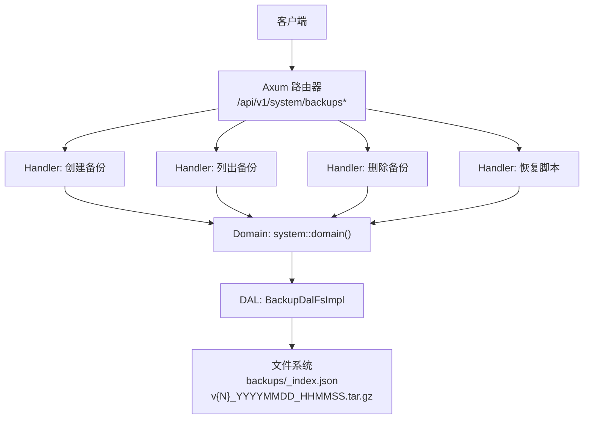
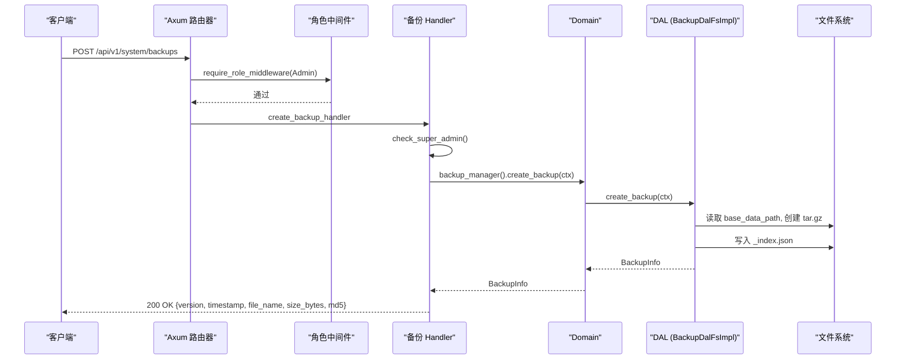
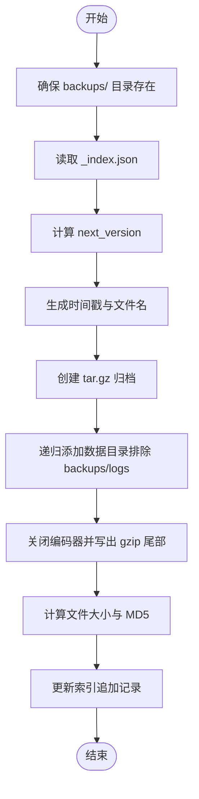
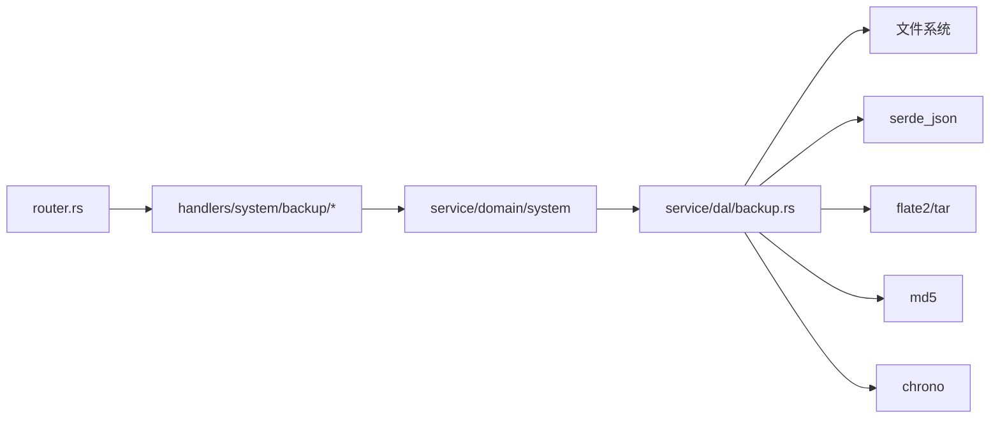

# 备份管理处理器

<cite>
**本文引用的文件**
- [src/handlers/system/backup/mod.rs](file://src/handlers/system/backup/mod.rs)
- [src/handlers/system/backup/create_backup.rs](file://src/handlers/system/backup/create_backup.rs)
- [src/handlers/system/backup/delete_backup.rs](file://src/handlers/system/backup/delete_backup.rs)
- [src/handlers/system/backup/list_backups.rs](file://src/handlers/system/backup/list_backups.rs)
- [src/handlers/system/backup/restore_backup.rs](file://src/handlers/system/backup/restore_backup.rs)
- [src/router.rs](file://src/router.rs)
- [src/service/dal/backup.rs](file://src/service/dal/backup.rs)
</cite>

## 目录
1. [简介](#简介)
2. [项目结构](#项目结构)
3. [核心组件](#核心组件)
4. [架构总览](#架构总览)
5. [详细组件分析](#详细组件分析)
6. [依赖关系分析](#依赖关系分析)
7. [性能考虑](#性能考虑)
8. [故障排除指南](#故障排除指南)
9. [结论](#结论)
10. [附录：API 使用示例与自动化建议](#附录api-使用示例与自动化建议)

## 简介
本文件为“备份管理处理器”的完整技术文档，覆盖数据库与应用数据备份、恢复相关的 HTTP 接口实现。内容包含：
- 备份文件的创建、删除、列表查询与恢复脚本生成
- 备份策略配置（存储路径、命名规则、版本控制）
- 权限控制、并发访问处理、错误恢复机制与数据一致性保证
- API 使用示例、性能优化建议与故障排除指南
- 备份自动化脚本与监控告警配置方法

本项目遵循严格四层单向调用：Adapter（HTTP Handler / 公开回调 Handler / AOP Producer）→ Domain → DAL → DAO，禁止跨层调用与同层互调。备份能力由 Adapter 层暴露 HTTP 接口，Domain 层编排业务逻辑，DAL 层负责基于文件系统的备份与恢复实现。

## 项目结构
备份管理相关代码位于系统模块下，按方法粒度拆分到独立文件，便于维护与测试。路由在系统路由中统一注册，并受角色中间件保护。



图表来源
- [src/router.rs:603-646](file://src/router.rs#L603-L646)
- [src/handlers/system/backup/mod.rs:1-32](file://src/handlers/system/backup/mod.rs#L1-L32)
- [src/service/dal/backup.rs:100-243](file://src/service/dal/backup.rs#L100-L243)

章节来源
- [src/router.rs:603-646](file://src/router.rs#L603-L646)
- [src/handlers/system/backup/mod.rs:1-32](file://src/handlers/system/backup/mod.rs#L1-L32)

## 核心组件
- 适配器层（HTTP Handler）
  - 创建备份：POST /api/v1/system/backups
  - 列出备份：GET /api/v1/system/backups
  - 删除备份：DELETE /api/v1/system/backups/{version}
  - 恢复脚本：POST /api/v1/system/backups/{version}/restore
- 领域层（Domain）
  - 通过 domain().backup_manager() 暴露备份管理能力，协调 DAL 完成具体操作
- 数据访问层（DAL）
  - 基于文件系统的备份实现：BackupDalFsImpl
  - 备份元信息：BackupInfo（版本号、时间戳、文件名、大小、MD5）
  - 索引文件：_index.json（schema_version、backups 列表）
  - 归档格式：tar.gz，排除 backups/ 与 logs/ 子目录
  - 恢复脚本：生成 bash 脚本，用于离线恢复

章节来源
- [src/handlers/system/backup/create_backup.rs:1-26](file://src/handlers/system/backup/create_backup.rs#L1-L26)
- [src/handlers/system/backup/list_backups.rs:1-21](file://src/handlers/system/backup/list_backups.rs#L1-L21)
- [src/handlers/system/backup/delete_backup.rs:1-24](file://src/handlers/system/backup/delete_backup.rs#L1-L24)
- [src/handlers/system/backup/restore_backup.rs:1-35](file://src/handlers/system/backup/restore_backup.rs#L1-L35)
- [src/service/dal/backup.rs:21-84](file://src/service/dal/backup.rs#L21-L84)
- [src/service/dal/backup.rs:100-243](file://src/service/dal/backup.rs#L100-L243)

## 架构总览
备份管理采用清晰的分层架构：
- Adapter 层：HTTP 请求解析、参数校验、权限二次校验（SuperAdmin）
- Domain 层：业务编排，调用 DAL 完成备份/恢复
- DAL 层：文件系统 I/O、压缩归档、索引读写、MD5 计算、脚本生成
- 路由与中间件：JWT 认证 + 角色校验（Admin/SuperAdmin），高危操作二次校验



图表来源
- [src/router.rs:112-116](file://src/router.rs#L112-L116)
- [src/router.rs:633-646](file://src/router.rs#L633-L646)
- [src/handlers/system/backup/mod.rs:19-32](file://src/handlers/system/backup/mod.rs#L19-L32)
- [src/handlers/system/backup/create_backup.rs:16-26](file://src/handlers/system/backup/create_backup.rs#L16-L26)
- [src/service/dal/backup.rs:100-152](file://src/service/dal/backup.rs#L100-L152)

## 详细组件分析

### 权限控制与安全
- 路由层：system 路由整体要求 Admin 角色（Admin/SuperAdmin 可访问）
- Handler 层：对创建/删除/恢复等高危操作进行 SuperAdmin 二次校验
- 恢复脚本：返回 text/plain 的 bash 脚本，需管理员手动执行

章节来源
- [src/router.rs:112-116](file://src/router.rs#L112-L116)
- [src/handlers/system/backup/mod.rs:19-32](file://src/handlers/system/backup/mod.rs#L19-L32)
- [src/handlers/system/backup/restore_backup.rs:18-35](file://src/handlers/system/backup/restore_backup.rs#L18-L35)

### 备份策略配置
- 存储路径：base_data_path()/backups/
- 索引文件：_index.json（schema_version=1，记录所有备份元信息）
- 归档命名：v{version}_{YYYYMMDD_HHMMSS}.tar.gz
- 排除目录：顶层 backups/ 与 logs/ 不参与归档
- 版本控制：单调递增 version；列表按 version 降序返回

章节来源
- [src/service/dal/backup.rs:21-52](file://src/service/dal/backup.rs#L21-L52)
- [src/service/dal/backup.rs:91-99](file://src/service/dal/backup.rs#L91-L99)
- [src/service/dal/backup.rs:102-152](file://src/service/dal/backup.rs#L102-L152)
- [src/service/dal/backup.rs:154-174](file://src/service/dal/backup.rs#L154-L174)

### 备份文件创建流程
- 确保 backups/ 目录存在
- 读取现有索引，计算 next_version
- 生成 ISO8601 时间戳与文件名
- 递归添加数据目录内容到 tar.gz（排除指定目录）
- 关闭编码器并写出 gzip 尾部
- 计算文件大小与 MD5
- 更新索引（追加新记录）



图表来源
- [src/service/dal/backup.rs:102-152](file://src/service/dal/backup.rs#L102-L152)
- [src/service/dal/backup.rs:268-321](file://src/service/dal/backup.rs#L268-L321)
- [src/service/dal/backup.rs:342-356](file://src/service/dal/backup.rs#L342-L356)

章节来源
- [src/service/dal/backup.rs:102-152](file://src/service/dal/backup.rs#L102-L152)

### 备份列表与恢复脚本
- 列表：读取索引，若为空则扫描 backups/ 重建索引；按 version 降序返回
- 恢复脚本：根据 version 查找对应备份文件，生成 bash 脚本，提示停止服务、备份当前数据、解压恢复

```mermaid
sequenceDiagram
participant C as "客户端"
participant H as "restore_backup_handler"
participant D as "Domain"
participant L as "DAL"
participant F as "文件系统"
C->>H : POST /api/v1/system/backups/{version}/restore
H->>H : check_super_admin()
H->>D : backup_manager().generate_restore_script(ctx, version)
D->>L : generate_restore_script(ctx, version)
L->>F : 读取 _index.json，定位备份文件
L-->>D : 返回 bash 脚本
D-->>H : 返回脚本文本
H-->>C : 200 text/plain; charset=utf-8
```

图表来源
- [src/handlers/system/backup/restore_backup.rs:18-35](file://src/handlers/system/backup/restore_backup.rs#L18-L35)
- [src/service/dal/backup.rs:198-243](file://src/service/dal/backup.rs#L198-L243)

章节来源
- [src/handlers/system/backup/restore_backup.rs:18-35](file://src/handlers/system/backup/restore_backup.rs#L18-L35)
- [src/service/dal/backup.rs:154-174](file://src/service/dal/backup.rs#L154-L174)
- [src/service/dal/backup.rs:198-243](file://src/service/dal/backup.rs#L198-L243)

### 删除备份
- 读取索引，定位指定 version
- 删除对应 .tar.gz 文件
- 从索引移除记录并写回

章节来源
- [src/handlers/system/backup/delete_backup.rs:14-24](file://src/handlers/system/backup/delete_backup.rs#L14-L24)
- [src/service/dal/backup.rs:176-196](file://src/service/dal/backup.rs#L176-L196)

### 数据一致性与错误恢复
- 索引持久化：每次创建/删除后写回 _index.json
- 防御性重建：当索引为空时，扫描 backups/ 重建索引
- 完整性校验：归档文件附带 MD5，可用于校验下载或传输完整性
- 错误处理：使用统一 Result 类型与错误码（如 ResourceNotFound、Internal）

章节来源
- [src/service/dal/backup.rs:247-266](file://src/service/dal/backup.rs#L247-L266)
- [src/service/dal/backup.rs:358-394](file://src/service/dal/backup.rs#L358-L394)
- [src/service/dal/backup.rs:176-196](file://src/service/dal/backup.rs#L176-L196)

## 依赖关系分析
备份管理涉及以下关键依赖：
- Axum 路由与中间件：JWT 认证、角色校验
- 文件系统 I/O：tar/gzip 压缩、目录遍历、符号链接处理
- 序列化：JSON 索引读写
- 哈希：MD5 校验
- 时间：ISO8601 时间戳



图表来源
- [src/router.rs:603-646](file://src/router.rs#L603-L646)
- [src/handlers/system/backup/mod.rs:1-32](file://src/handlers/system/backup/mod.rs#L1-L32)
- [src/service/dal/backup.rs:1-18](file://src/service/dal/backup.rs#L1-L18)

章节来源
- [src/router.rs:603-646](file://src/router.rs#L603-L646)
- [src/service/dal/backup.rs:1-18](file://src/service/dal/backup.rs#L1-L18)

## 性能考虑
- 大文件归档：tar.gz 流式写入，避免一次性加载整个目录到内存
- 索引读写：小文件 JSON，读写开销低；频繁写入场景可考虑批量合并
- MD5 计算：逐块读取文件，降低内存占用
- 排除目录：减少备份体积与 I/O 压力
- 并发访问：当前实现未加锁，高并发场景建议在上层引入分布式锁或队列串行化

[本节提供通用指导，不直接分析具体文件]

## 故障排除指南
- 权限不足：确认当前用户为 SuperAdmin；检查 JWT 与角色中间件
- 备份不存在：检查 version 是否正确；查看 _index.json 是否损坏
- 恢复失败：确保已停止服务；确认数据目录有写权限；验证 tar.gz 完整性（对比 MD5）
- 索引不一致：触发重建逻辑；必要时手动修复 _index.json

章节来源
- [src/handlers/system/backup/mod.rs:19-32](file://src/handlers/system/backup/mod.rs#L19-L32)
- [src/service/dal/backup.rs:154-174](file://src/service/dal/backup.rs#L154-L174)
- [src/service/dal/backup.rs:198-243](file://src/service/dal/backup.rs#L198-L243)

## 结论
备份管理处理器通过清晰的层次划分与严格的权限控制，提供了安全可靠的备份与恢复能力。基于文件系统的实现简单高效，适合中小规模部署。建议在大规模场景中引入分布式锁与异步任务队列，以提升并发与可靠性。

[本节总结性内容，不直接分析具体文件]

## 附录：API 使用示例与自动化建议

### API 端点与行为
- POST /api/v1/system/backups
  - 权限：SuperAdmin（路由层 Admin + Handler 层 SuperAdmin 校验）
  - 响应：BackupInfo（version, timestamp, file_name, size_bytes, md5）
- GET /api/v1/system/backups
  - 权限：Admin/SuperAdmin
  - 响应：Vec<BackupInfo>，按 version 降序
- DELETE /api/v1/system/backups/{version}
  - 权限：SuperAdmin
  - 响应：空体
- POST /api/v1/system/backups/{version}/restore
  - 权限：SuperAdmin
  - 响应：text/plain 的 bash 脚本

章节来源
- [src/router.rs:633-646](file://src/router.rs#L633-L646)
- [src/handlers/system/backup/create_backup.rs:16-26](file://src/handlers/system/backup/create_backup.rs#L16-L26)
- [src/handlers/system/backup/list_backups.rs:13-21](file://src/handlers/system/backup/list_backups.rs#L13-L21)
- [src/handlers/system/backup/delete_backup.rs:14-24](file://src/handlers/system/backup/delete_backup.rs#L14-L24)
- [src/handlers/system/backup/restore_backup.rs:18-35](file://src/handlers/system/backup/restore_backup.rs#L18-L35)

### 备份自动化脚本建议
- 定时任务：使用 cron 定期调用创建备份接口
- 健康检查：在恢复脚本中加入服务状态检测与重试逻辑
- 通知告警：备份成功/失败后发送通知（邮件/IM）
- 保留策略：结合列表接口，定期清理旧版本备份

### 监控与告警配置建议
- 指标采集：记录备份耗时、文件大小、MD5 校验结果
- 日志记录：关键步骤（创建、删除、恢复）输出结构化日志
- 告警规则：备份失败、磁盘空间不足、索引损坏时触发告警

[本节提供通用实践建议，不直接分析具体文件]